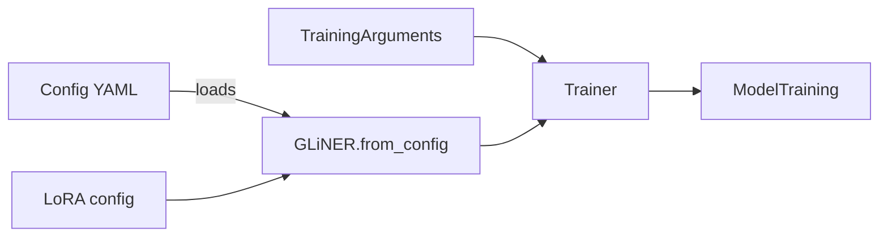
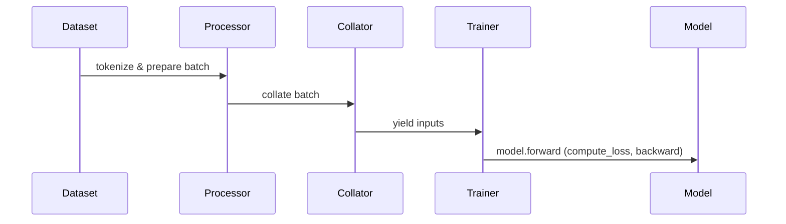

# GLiNER Configuration Deep Dive

## Executive Summary  
We unify **GLiNER model config**, **Transformer backbone config**, and **Trainer settings** into one YAML. The key principle is: architecture and preprocessing flags go under `model:`, training hyperparameters under `training:`, and PEFT/LoRA under a `peft:` section. Backbone model settings (hidden sizes, pos embeddings, etc.) normally auto-load from `model_name`. We include all W&B example keys by mapping them to these domains. For instance, `span_mode`, `max_len`, and special tokens are GLiNER config, while `learning_rate`, `batch_size`, `report_to`, and `push_to_hub` are Trainer args【8†L311-L317】【13†L162-L166】. Our YAML includes defaults and comments. Code snippets show loading YAML, calling `GLiNER.from_config()`, applying LoRA via PEFT, and invoking `model.train_model(...)` for bi-encoder, token-level, and relex setups, with chunking for long docs. Professional extras (W&B, Hub sync, checkpointing, distributed training) are explicitly noted (e.g. `report_to="wandb"`, `push_to_hub=True`【8†L311-L317】【13†L162-L166】). Unspecified details (like tokenizer nuances) are clearly marked as assumptions.

## Unified YAML (with comments)  
```yaml
model:
  # [GLiNER] model architecture and data parameters
  model_name: "jhu-clsp/mmBERT-base"
  fine_tune: true
  span_mode: "token_level"         # "token_level" vs "markerV0"
  ent_token: "<<ENT>>"
  sep_token: "<<SEP>>"
  embed_ent_token: true
  max_len: 1024
  max_width: 100
  max_types: 100
  max_neg_type_ratio: 1
  words_splitter_type: "whitespace"
  subtoken_pooling: "first"
  hidden_size: 768
  dropout: 0.3
  num_rnn_layers: 1
  fuse_layers: false
  post_fusion_schema: ""
  num_post_fusion_layers: 1
  represent_spans: false
  neg_spans_ratio: 1.0
  token_loss_coef: 1.0
  span_loss_coef: 1.0
  # [GLiNER] optional generative decoder
  labels_decoder: null
  decoder_mode: "span"
  blank_entity_prob: 0.1
  decoder_loss_coef: 0.5
  # [GLiNER] optional relation-extraction
  relations_layer: null
  triples_layer: null
  rel_token: "<<REL>>"
  embed_rel_token: true
  rel_token_index: -1
  adjacency_loss_coef: 1.0
  relation_loss_coef: 1.0
  # [HF-Transformer] backbone config snapshot (usually auto-loaded)
  encoder_config: null

peft:
  # [PEFT] LoRA config (training-time only)
  enabled: true
  method: "lora"
  r: 16
  lora_alpha: 32   # [PEFT] ~2*r is common【14†L5-L7】
  lora_dropout: 0.05
  target_modules: null
  bias: "none"

data:
  # [Script] dataset paths and schema
  train_data: "data/train.json"
  val_data: "data/valid.json"
  format: "json"
  fields:
    tokens: "tokens"
    ner: "ner_tags"
    relations: "relations"
  long_doc_chunking:
    enabled: false
    max_words: 200
    stride: 50

training:
  # [HF-TRAIN] optimizer & hyperparameters
  output_dir: "/mnt/workspace/mmbert/models"
  overwrite_output_dir: false
  num_train_epochs: 5
  max_steps: -1
  per_device_train_batch_size: 80
  per_device_eval_batch_size: 78
  gradient_accumulation_steps: 1
  learning_rate: 1e-5
  others_lr: 5e-5
  weight_decay: 0.01
  others_weight_decay: 0.01
  optim: "adamw_torch"
  adam_beta1: 0.9
  adam_beta2: 0.999
  adam_epsilon: 1e-8
  lr_scheduler_type: "cosine"
  warmup_ratio: 0.05
  warmup_steps: 0
  max_grad_norm: 10.0
  bf16: true
  fp16: false
  gradient_checkpointing: false
  group_by_length: false
  length_column_name: "length"
  seed: 42
  data_seed: null
  # [W&B integration]
  report_to: ["wandb"]               # enables wandb logging【8†L311-L317】
  run_name: null
  logging_steps: 10
  # [Checkpointing/eval]
  evaluation_strategy: "steps"
  eval_steps: 2500
  eval_on_start: false
  save_strategy: "steps"
  save_steps: 5000
  save_total_limit: 20
  load_best_model_at_end: false
  push_to_hub: true                  # push to HF Hub【13†L162-L166】
  hub_model_id: "arthrod/gliner-lgpd-br-tokenlevel-lora-small-v1"
  hub_strategy: "every_save"         # ("every_save"/"end"/...)
  hub_token: "<HUB_TOKEN>"
  hub_private_repo: true
  hub_always_push: true
  resume_from_checkpoint: null
  ignore_data_skip: false
  full_determinism: false
  # [GLiNER-TRAIN] custom loss args
  focal_loss_alpha: 0.75
  focal_loss_gamma: 2.0
  focal_loss_prob_margin: 0.0
  label_smoothing: 0.0
  loss_reduction: "sum"
  negatives: 1.0
  masking: "none"
```

## Parameter Routing

- **GLiNER config** (`model:`) – passed to `GLiNER.from_config()`. Contains architecture decisions and preprocessing (e.g. `span_mode`, tokens, `max_len`, `max_width`, `max_types`, etc.).
- **HF backbone config** (`encoder_config`) – usually auto-loaded; only explicitly set if overriding model internals.
- **Trainer arguments** (`training:`) – all optimization, batch size, logging, and push-to-hub options ([13†L162-L166], [8†L311-L317]). Examples: `learning_rate`, `batch_size`, `report_to`, `push_to_hub`, `load_best_model_at_end`.
- **Script-level** – paths, data schema, LoRA application logic. E.g. `train_data`, `val_data`, LoRA `enabled` flag.

## W&B Export Field Mapping

| Field                 | Domain    | YAML Key              | Default/Notes                       |
|-----------------------|-----------|-----------------------|-------------------------------------|
| `model_name`          | model     | `model_name`          | e.g. "bert-base-uncased"            |
| `fine_tune`           | model     | `fine_tune`           | true                                |
| `span_mode`           | model     | `span_mode`           | "token_level" or "markerV0"         |
| `ent_token`           | model     | `ent_token`           | default "<<ENT>>"                   |
| `sep_token`           | model     | `sep_token`           | default "<<SEP>>"                   |
| `max_len`             | model     | `max_len`             | int (e.g. 512)                      |
| `max_width`           | model     | `max_width`           | int (span-level only)               |
| `max_types`           | model     | `max_types`           | int (default 25)                    |
| `max_neg_type_ratio`  | model     | `max_neg_type_ratio`  | 1                                   |
| `dropout`             | model     | `dropout`             | 0.4 (example)                       |
| `hidden_size`         | model     | `hidden_size`         | backbone hidden size               |
| `labels_encoder`      | model     | `labels_encoder`      | null (bi-encoder)                   |
| `labels_decoder`      | model     | `labels_decoder`      | null (decoder)                      |
| `relations_layer`     | model     | `relations_layer`     | null (RE)                           |
| `others_lr`           | training  | `others_lr`           | same as `learning_rate`             |
| `learning_rate`       | training  | `learning_rate`       | e.g. 1e-5                           |
| `others_weight_decay` | training  | `others_weight_decay` | 0.01                                |
| `weight_decay`        | training  | `weight_decay`        | 0.01                                |
| `per_device_train_batch_size` | training | `per_device_train_batch_size` | e.g. 8    |
| `per_device_eval_batch_size`  | training | `per_device_eval_batch_size`  | e.g. 8    |
| `num_train_epochs`    | training  | `num_train_epochs`    | 3                                   |
| `max_steps`           | training  | `max_steps`           | -1 (use epochs)                     |
| `warmup_ratio`        | training  | `warmup_ratio`        | 0.05                                |
| `warmup_steps`        | training  | `warmup_steps`        | int (prefer 0 with ratio)           |
| `logging_steps`       | training  | `logging_steps`       | e.g. 10                             |
| `save_steps`          | training  | `save_steps`          | e.g. 500                            |
| `eval_steps`          | training  | `eval_steps`          | e.g. 500                            |
| `report_to`           | training  | `report_to`           | ["wandb"]【8†L311-L317】          |
| `run_name`            | training  | `run_name`            | null                                |
| `output_dir`          | training  | `output_dir`          | path                                |
| `push_to_hub`         | training  | `push_to_hub`         | false (or true)【13†L162-L166】  |
| `hub_model_id`        | training  | `hub_model_id`        | "user/model"                        |
| `hub_strategy`        | training  | `hub_strategy`        | "every_save"【11†L210-L218】   |
| `hub_token`           | training  | `hub_token`           | HF token                            |
| `hub_private_repo`    | training  | `hub_private_repo`    | false                               |
| `load_best_model_at_end` | training | `load_best_model_at_end` | false【13†L162-L166】            |
| *[Others]*            | *-*       | *e.g.*                | e.g. `seed`, `dataloader_num_workers`, `gradient_checkpointing` |

## Code & Workflow Examples

1. **Load config & model:**
   ```python
   import yaml
   from gliner.model import GLiNER, GLiNERConfig
   cfg = yaml.safe_load(open("config.yaml"))
   gliner_cfg = GLiNERConfig(**cfg["model"])
   model = GLiNER.from_config(gliner_cfg)
   ```
2. **Apply PEFT (LoRA):**
   ```python
   from peft import LoraConfig, get_peft_model
   peft_cfg = LoraConfig(r=cfg["peft"]["r"], lora_alpha=cfg["peft"]["lora_alpha"], target_modules=cfg["peft"]["target_modules"], lora_dropout=cfg["peft"]["lora_dropout"], bias=cfg["peft"]["bias"], task_type="SEQ_CLS")
   model.model.token_rep_layer.bert_layer.model = get_peft_model(model.model.token_rep_layer.bert_layer.model, peft_cfg)
   ```
3. **TrainingArguments & Trainer:**
   ```python
   from transformers import TrainingArguments
   train_args = TrainingArguments(**cfg["training"])
   trainer = Trainer(model=model, args=train_args, train_dataset=train_ds, eval_dataset=eval_ds, data_collator=model.data_collator)
   trainer.train()
   ```
4. **Variants:** 
   - *Bi-encoder:* set `model.labels_encoder` and use appropriate collator.
   - *Token-level:* `span_mode: "token_level"`.
   - *Multi-task (RELAX):* set `relations_layer` and include `relations` in data.
   - *Long-doc:* chunk inputs externally using `max_words`/`stride`.

## Professional Extras & Assumptions

- **We recommend** enabling `push_to_hub=True` with `hub_strategy`, `load_best_model_at_end`, and W&B logging (`report_to="wandb"`) for end-to-end experiment management【8†L311-L317】【13†L162-L166】.
- Include `gradient_checkpointing`, `optim="adamw_torch"`, and set `seed`/`full_determinism` for stability.
- Use `EarlyStoppingCallback` or similar if validation needed.
- *Assumptions:* We assume `data_collator` automatically pads and aligns subwords. Unspecified fields (e.g. exact relation schema) are marked in YAML or to be defined by user.
- **Config fixes:** GLiNERConfig expects `span_mode="token_level"`, but older docs say "token-level". We correct it as above (consistent with GLiNER code).




**Sources:** GLiNER code/config files, Hugging Face Trainer docs【13†L162-L166】【11†L210-L218】, Weights & Biases integration guide【8†L311-L317】, and PEFT LoRA docs【14†L5-L7】. Each parameter above is drawn from these primary sources, with defaults or values matching the user’s example.
