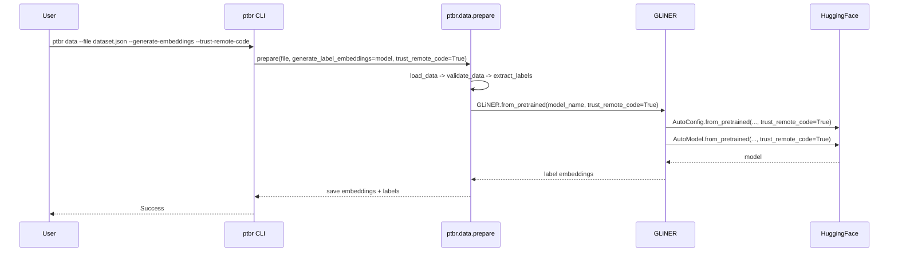
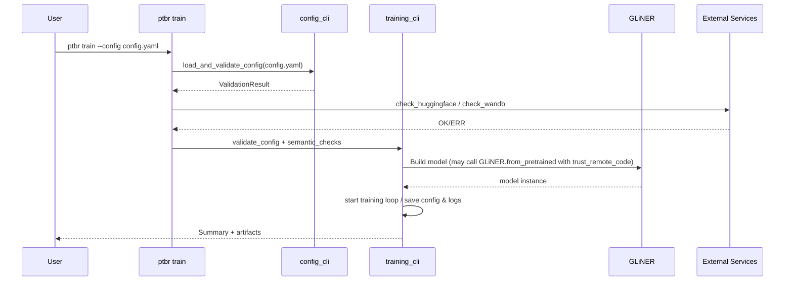

# PR Comments Export

> Exported from [https://github.com/arthrod/GLiNER/pull/13](https://github.com/arthrod/GLiNER/pull/13)  
> 12 of 13 comments selected  
> Generated by [Cicero](https://cicero.im) on 2/17/2026, 8:23:48 PM

---

### coderabbitai[bot] &mdash; 2/17/2026, 5:19:47 PM

> File: `ptbr/tests/test_training_cli.py`

<details><summary>Code context</summary>

```diff
@@ -0,0 +1,613 @@
+"""Tests for ptbr.training_cli -- config validation, CLI flags, API checks."""
+
+from __future__ import annotations
+
+import os
+from pathlib import Path
+from unittest import mock
+
+import pytest
+import yaml
+from typer.testing import CliRunner
+
+from ptbr.training_cli import (
+    _check_type,
+    _deep_get,
+    _deep_set,
+    app,
+    check_huggingface,
+    check_wandb,
+    check_resume,
+    print_summary,
+    semantic_checks,
+    validate_config,
+    ValidationResult,
+)
+
+runner = CliRunner()
+
+# ------------------------------------------------------------------ #
+# Fixtures                                                            #
+# ------------------------------------------------------------------ #
+
+MINIMAL_VALID_CONFIG = {
+    "run": {"name": "test-run", "seed": 42},
+    "model": {
+        "model_name": "microsoft/deberta-v3-small",
+        "span_mode": "markerV0",
+        "max_len": 384,
+    },
+    "data": {
+        "root_dir": "logs",
+        "train_data": "data/train.json",
+    },
+    "training": {
+        "num_steps": 100,
+        "train_batch_size": 4,
+        "eval_every": 50,
+        "lr_encoder": 1e-5,
+        "lr_others": 3e-5,
+    },
+}
+
+
+@pytest.fixture()
+def valid_cfg() -> dict:
+    """
+    Return a deep copy of the module's minimal valid configuration.
+    
+    Returns:
+        dict: A deep-copied dictionary of MINIMAL_VALID_CONFIG suitable for use in tests.
+    """
+    import copy
+    return copy.deepcopy(MINIMAL_VALID_CONFIG)
+
+
+@pytest.fixture()
+def cfg_file(tmp_path: Path, valid_cfg: dict) -> Path:
+    """
+    Write a configuration dictionary to a temporary YAML file and return its path.
+    
+    Parameters:
+        tmp_path (Path): Directory in which to create the temporary config file (typically pytest's tmp_path).
+        valid_cfg (dict): Configuration dictionary to serialize to YAML.
+    
+    Returns:
+        Path: Path to the created YAML file named "config.yaml".
+    """
+    data_dir = tmp_path / "data"
+    data_dir.mkdir(parents=True, exist_ok=True)
+    (data_dir / "train.json").write_text("[]", encoding="utf-8")
+    p = tmp_path / "config.yaml"
+    p.write_text(yaml.dump(valid_cfg, default_flow_style=False))
+    return p
+
+
+# ------------------------------------------------------------------ #
+# _deep_get / _deep_set                                               #
+# ------------------------------------------------------------------ #
+
+class TestDeepGetSet:
+    def test_deep_get_found(self) -> None:
+        d = {"a": {"b": {"c": 42}}}
+        found, val = _deep_get(d, "a.b.c")
+        assert found is True
+        assert val == 42
+
+    def test_deep_get_missing(self) -> None:
+        d = {"a": {"b": 1}}
+        found, val = _deep_get(d, "a.x")
+        assert found is False
+        assert val is None
+
+    def test_deep_set_creates_intermediates(self) -> None:
+        d: dict = {}
+        _deep_set(d, "a.b.c", 99)
+        assert d == {"a": {"b": {"c": 99}}}
+
+    def test_deep_set_raises_when_parent_not_mapping(self) -> None:
+        d = {"a": "not-a-dict"}
+        with pytest.raises(ValueError):
+            _deep_set(d, "a.b.c", 99)
+
+
+# ------------------------------------------------------------------ #
+# _check_type                                                         #
+# ------------------------------------------------------------------ #
+
+class TestCheckType:
+    def test_int_as_float(self) -> None:
+        assert _check_type(3, float) is True
+
+    def test_float_as_float(self) -> None:
+        assert _check_type(3.0, float) is True
+
+    def test_bool_not_int(self) -> None:
+        # bool is a subclass of int, but we don't want bools matching int
+        """
+        Ensure _check_type does not treat boolean values as integers.
+        """
+        assert _check_type(True, int) is False
+
+    def test_bool_matches_bool(self) -> None:
+        assert _check_type(True, bool) is True
+
+    def test_none_in_union(self) -> None:
+        assert _check_type(None, (str, type(None))) is True
+
+    def test_str_for_int_fails(self) -> None:
+        assert _check_type("hello", int) is False
+
+
+# ------------------------------------------------------------------ #
+# validate_config                                                      #
+# ------------------------------------------------------------------ #
+
+class TestValidateConfig:
+    def test_minimal_valid(self, valid_cfg: dict) -> None:
+        """
+        Verifies that a minimal valid configuration passes validation.
+        
+        Parameters:
+            valid_cfg (dict): A minimal configuration dictionary expected to conform to the validator's schema.
+        """
+        result = validate_config(valid_cfg)
+        assert result.ok, f"Errors: {result.errors}"
+
+    def test_missing_required_field(self, valid_cfg: dict) -> None:
+        del valid_cfg["run"]["name"]
+        result = validate_config(valid_cfg)
+        assert not result.ok
+        assert any("run.name" in e for e in result.errors)
+
+    def test_required_field_set_to_none(self, valid_cfg: dict) -> None:
+        valid_cfg["run"]["name"] = None
+        result = validate_config(valid_cfg)
+        assert not result.ok
+        assert any("run.name" in e for e in result.errors)
+
+    def test_wrong_type_errors(self, valid_cfg: dict) -> None:
+        valid_cfg["training"]["num_steps"] = "not_an_int"
+        result = validate_config(valid_cfg)
+        assert not result.ok
+        assert any("training.num_steps" in e for e in result.errors)
+
+    def test_defaults_applied_with_warning(self, valid_cfg: dict) -> None:
+        # scheduler_type is optional with default "cosine"
+        assert "scheduler_type" not in valid_cfg.get("training", {})
+        result = validate_config(valid_cfg)
+        assert result.ok
+        # The default should have been applied
+        assert valid_cfg["training"]["scheduler_type"] == "cosine"
+        # There should be a warning about it
+        assert any("scheduler_type" in w for w in result.warnings)
+
+    def test_all_required_missing(self) -> None:
+        result = validate_config({})
+        assert not result.ok
+        required_keys = [
+            "run.name", "model.model_name", "model.span_mode", "model.max_len",
+            "data.root_dir", "data.train_data",
+            "training.num_steps", "training.train_batch_size",
+            "training.eval_every", "training.lr_encoder", "training.lr_others",
+        ]
+        for key in required_keys:
+            assert any(key in e for e in result.errors), f"Expected error for {key}"
+
+    def test_extra_keys_warned(self, valid_cfg: dict) -> None:
+        valid_cfg["model"]["totally_unknown_param"] = True
+        result = validate_config(valid_cfg)
+        assert result.ok  # extra keys are warnings, not errors
+        assert any("totally_unknown_param" in w for w in result.warnings)
+
+    def test_none_for_optional_is_ok(self, valid_cfg: dict) -> None:
+        valid_cfg["model"]["labels_encoder"] = None
+        result = validate_config(valid_cfg)
+        assert result.ok
+
+    def test_sensitive_values_are_redacted(self, valid_cfg: dict) -> None:
+        valid_cfg.setdefault("environment", {})["hf_token"] = "hf_secret_token"
+        valid_cfg["environment"]["wandb_api_key"] = "wandb_secret_key"
+        result = validate_config(valid_cfg)
+        assert result.ok
+
+        info_by_key = {key: value for key, _, value in result.info}
+        assert info_by_key["environment.hf_token"] == "***REDACTED***"
+        assert info_by_key["environment.wandb_api_key"] == "***REDACTED***"
+
+        summary = print_summary(result)
+        assert "hf_secret_token" not in summary
+        assert "wandb_secret_key" not in summary
+
+
+# ------------------------------------------------------------------ #
+# semantic_checks                                                      #
+# ------------------------------------------------------------------ #
+
+class TestSemanticChecks:
+    def test_invalid_span_mode(self, valid_cfg: dict) -> None:
+        valid_cfg["model"]["span_mode"] = "invalid"
+        result = ValidationResult()
+        semantic_checks(valid_cfg, result)
+        assert any("span_mode" in e for e in result.errors)
+
+    def test_invalid_scheduler(self, valid_cfg: dict) -> None:
+        valid_cfg["training"]["scheduler_type"] = "exponential"
+        result = ValidationResult()
+        semantic_checks(valid_cfg, result)
+        assert any("scheduler_type" in e for e in result.errors)
+
+    def test_invalid_optimizer(self, valid_cfg: dict) -> None:
+        valid_cfg["training"]["optimizer"] = "rmsprop"
+        result = ValidationResult()
+        semantic_checks(valid_cfg, result)
+        assert any("optimizer" in e for e in result.errors)
+
+    def test_bf16_fp16_conflict(self, valid_cfg: dict) -> None:
+        valid_cfg["training"]["bf16"] = True
+        valid_cfg["training"]["fp16"] = True
+        result = ValidationResult()
+        semantic_checks(valid_cfg, result)
+        assert any("bf16" in e and "fp16" in e for e in result.errors)
+
+    def test_wandb_requires_project(self, valid_cfg: dict) -> None:
+        valid_cfg.setdefault("environment", {})["report_to"] = "wandb"
+        result = ValidationResult()
+        semantic_checks(valid_cfg, result)
+        assert any("wandb_project" in e for e in result.errors)
+
+    def test_hub_requires_model_id(self, valid_cfg: dict) -> None:
+        valid_cfg.setdefault("environment", {})["push_to_hub"] = True
+        result = ValidationResult()
+        semantic_checks(valid_cfg, result)
+        assert any("hub_model_id" in e for e in result.errors)
+
+    def test_positive_num_steps(self, valid_cfg: dict) -> None:
+        """
+        Checks that semantic validation reports an error when training.num_steps is not positive.
+        
+        Sets training.num_steps to 0 on the provided configuration, runs semantic_checks, and asserts that an error referencing "num_steps" is present in the ValidationResult.
+        
+        Parameters:
+            valid_cfg (dict): A baseline valid configuration dictionary used for the test.
+        """
+        valid_cfg["training"]["num_steps"] = 0
+        result = ValidationResult()
+        semantic_checks(valid_cfg, result)
+        assert any("num_steps" in e for e in result.errors)
+
+    def test_positive_lr(self, valid_cfg: dict) -> None:
+        valid_cfg["training"]["lr_encoder"] = -1e-5
+        result = ValidationResult()
+        semantic_checks(valid_cfg, result)
+        assert any("lr_encoder" in e for e in result.errors)
+
+    @pytest.mark.parametrize("value", [-0.1, 1.1])
+    def test_warmup_ratio_out_of_bounds(self, valid_cfg: dict, value: float) -> None:
+        valid_cfg["training"]["warmup_ratio"] = value
+        result = ValidationResult()
+        semantic_checks(valid_cfg, result)
+        assert any("warmup_ratio" in e for e in result.errors)
+
+    def test_valid_enums_pass(self, valid_cfg: dict) -> None:
+        valid_cfg["training"]["scheduler_type"] = "cosine"
+        valid_cfg["training"]["optimizer"] = "adamw_torch"
+        valid_cfg["training"]["loss_reduction"] = "sum"
+        valid_cfg["training"]["masking"] = "none"
+        valid_cfg.setdefault("environment", {})["report_to"] = "none"
+        result = ValidationResult()
+        semantic_checks(valid_cfg, result)
+        assert len(result.errors) == 0
+
+
+# ------------------------------------------------------------------ #
+# check_huggingface                                                    #
+# ------------------------------------------------------------------ #
+
+class TestCheckHuggingFace:
+    def test_skip_when_push_disabled(self, valid_cfg: dict) -> None:
+        valid_cfg.setdefault("environment", {})["push_to_hub"] = False
+        result = ValidationResult()
+        check_huggingface(valid_cfg, result)
+        assert result.ok
+
+    def test_error_no_token(self, valid_cfg: dict) -> None:
+        valid_cfg.setdefault("environment", {})["push_to_hub"] = True
+        valid_cfg["environment"]["hf_token"] = None
+        result = ValidationResult()
+        with mock.patch.dict(os.environ, {}, clear=True):
+            check_huggingface(valid_cfg, result)
+        assert any("token" in e.lower() for e in result.errors)
+
+    def test_success_with_mock(self, valid_cfg: dict) -> None:
+        valid_cfg.setdefault("environment", {})["push_to_hub"] = True
+        valid_cfg["environment"]["hf_token"] = "hf_testtoken"
+        result = ValidationResult()
+
+        mock_resp = mock.MagicMock()
+        mock_resp.status_code = 200
+        mock_resp.json.return_value = {"name": "testuser"}
+
+        with mock.patch("requests.get", return_value=mock_resp):
+            check_huggingface(valid_cfg, result)
+        assert result.ok
+
+    def test_failure_status(self, valid_cfg: dict) -> None:
+        valid_cfg.setdefault("environment", {})["push_to_hub"] = True
+        valid_cfg["environment"]["hf_token"] = "hf_badtoken"
+        result = ValidationResult()
+
+        mock_resp = mock.MagicMock()
+        mock_resp.status_code = 401
+        mock_resp.text = "Unauthorized"
+
+        with mock.patch("requests.get", return_value=mock_resp):
+            check_huggingface(valid_cfg, result)
+        assert not result.ok
+
+    def test_network_error(self, valid_cfg: dict) -> None:
+        valid_cfg.setdefault("environment", {})["push_to_hub"] = True
+        valid_cfg["environment"]["hf_token"] = "hf_token"
+        result = ValidationResult()
+
+        with mock.patch("requests.get", side_effect=ConnectionError("no network")):
+            check_huggingface(valid_cfg, result)
+        assert not result.ok
+
+
+# ------------------------------------------------------------------ #
+# check_wandb                                                         #
+# ------------------------------------------------------------------ #
+
+class TestCheckWandB:
+    def test_skip_when_disabled(self, valid_cfg: dict) -> None:
+        valid_cfg.setdefault("environment", {})["report_to"] = "none"
+        result = ValidationResult()
+        check_wandb(valid_cfg, result)
+        assert result.ok
+
+    def test_error_no_key(self, valid_cfg: dict) -> None:
+        valid_cfg.setdefault("environment", {})["report_to"] = "wandb"
+        valid_cfg["environment"]["wandb_api_key"] = None
+        result = ValidationResult()
+        with mock.patch.dict(os.environ, {}, clear=True):
+            check_wandb(valid_cfg, result)
+        assert any("api key" in e.lower() for e in result.errors)
+
+    def test_success_with_mock(self, valid_cfg: dict) -> None:
+        valid_cfg.setdefault("environment", {})["report_to"] = "wandb"
+        valid_cfg["environment"]["wandb_api_key"] = "test-key"
+        result = ValidationResult()
+
+        mock_resp = mock.MagicMock()
+        mock_resp.status_code = 200
+        mock_resp.json.return_value = {
+            "data": {"viewer": {"username": "testuser"}}
+        }
+
+        with mock.patch("requests.post", return_value=mock_resp):
+            check_wandb(valid_cfg, result)
+        assert result.ok
+
+    def test_failure_status(self, valid_cfg: dict) -> None:
+        valid_cfg.setdefault("environment", {})["report_to"] = "all"
+        valid_cfg["environment"]["wandb_api_key"] = "bad-key"
+        result = ValidationResult()
+
+        mock_resp = mock.MagicMock()
+        mock_resp.status_code = 403
+        mock_resp.text = "Forbidden"
+
+        with mock.patch("requests.post", return_value=mock_resp):
+            check_wandb(valid_cfg, result)
+        assert not result.ok
+
+
+# ------------------------------------------------------------------ #
+# check_resume                                                         #
+# ------------------------------------------------------------------ #
+
+class TestCheckResume:
+    def test_missing_run_name_in_current_config(
+        self, valid_cfg: dict, tmp_path: Path
+    ) -> None:
+        valid_cfg["run"].pop("name", None)
+        (tmp_path / "checkpoint-100").mkdir()
+        result = ValidationResult()
+        check_resume(valid_cfg, tmp_path, result)
+        assert not result.ok
+        assert any("cannot resume: 'run.name' is missing" in e.lower() for e in result.errors)
+
+    def test_no_checkpoints(self, valid_cfg: dict, tmp_path: Path) -> None:
+        result = ValidationResult()
+        check_resume(valid_cfg, tmp_path, result)
+        assert not result.ok
+        assert any("no checkpoint" in e.lower() for e in result.errors)
+
+    def test_no_saved_config(self, valid_cfg: dict, tmp_path: Path) -> None:
+        (tmp_path / "checkpoint-100").mkdir()
+        result = ValidationResult()
+        check_resume(valid_cfg, tmp_path, result)
+        assert not result.ok
+        assert any("config.yaml" in e for e in result.errors)
+
+    def test_name_mismatch(self, valid_cfg: dict, tmp_path: Path) -> None:
+        (tmp_path / "checkpoint-100").mkdir()
+        saved = {"run": {"name": "different-name"}}
+        (tmp_path / "config.yaml").write_text(yaml.dump(saved))
+        result = ValidationResult()
+        check_resume(valid_cfg, tmp_path, result)
+        assert not result.ok
+        assert any("mismatch" in e for e in result.errors)
+
+    def test_successful_resume(self, valid_cfg: dict, tmp_path: Path) -> None:
+        (tmp_path / "checkpoint-100").mkdir()
+        (tmp_path / "checkpoint-200").mkdir()
+        saved = {"run": {"name": "test-run"}}
+        (tmp_path / "config.yaml").write_text(yaml.dump(saved))
+        result = ValidationResult()
+        check_resume(valid_cfg, tmp_path, result)
+        assert result.ok
+
+
+# ------------------------------------------------------------------ #
+# CLI integration (typer runner)                                       #
+# ------------------------------------------------------------------ #
+
+class TestCLI:
+    def test_validate_valid_config(self, cfg_file: Path) -> None:
+        result = runner.invoke(app, [str(cfg_file), "--validate"])
+        assert result.exit_code == 0
+
+    def test_validate_fails_when_train_data_missing(self, cfg_file: Path) -> None:
+        cfg = yaml.safe_load(cfg_file.read_text())
+        cfg["data"]["train_data"] = "data/missing_train.json"
+        cfg_file.write_text(yaml.dump(cfg, default_flow_style=False))
+        result = runner.invoke(app, [str(cfg_file), "--validate"])
+        assert result.exit_code == 1
+
+    def test_validate_fails_when_val_data_missing(self, cfg_file: Path) -> None:
+        cfg = yaml.safe_load(cfg_file.read_text())
+        cfg["data"]["val_data_dir"] = "data/missing_val.json"
+        cfg_file.write_text(yaml.dump(cfg, default_flow_style=False))
+        result = runner.invoke(app, [str(cfg_file), "--validate"])
+        assert result.exit_code == 1
+
+    def test_validate_invalid_config(self, tmp_path: Path) -> None:
+        bad = tmp_path / "bad.yaml"
+        bad.write_text(yaml.dump({"run": {"seed": 42}}))
+        result = runner.invoke(app, [str(bad), "--validate"])
+        assert result.exit_code == 1
+
+    def test_missing_config_file(self) -> None:
+        result = runner.invoke(app, ["/nonexistent/path.yaml", "--validate"])
+        assert result.exit_code != 0
+
+    def test_output_folder_must_be_empty(
+        self, cfg_file: Path, tmp_path: Path
+    ) -> None:
+        out = tmp_path / "output"
+        out.mkdir()
+        (out / "some_file.txt").write_text("blocker")
+        result = runner.invoke(
+            app, [str(cfg_file), "--output-folder", str(out)]
+        )
+        assert result.exit_code == 1
+
+    @mock.patch("ptbr.training_cli._launch_training")
+    def test_output_folder_empty_ok(
+        self,
+        mock_launch: mock.MagicMock,
+        cfg_file: Path,
+        tmp_path: Path,
+    ) -> None:
+        """An empty output folder should be accepted for a new training run."""
+        out = tmp_path / "output"
+        out.mkdir()
+        result = runner.invoke(app, [str(cfg_file), "--output-folder", str(out)])
+        assert result.exit_code == 0
+        mock_launch.assert_called_once()
+
+    @mock.patch("ptbr.training_cli._launch_training")
+    def test_output_folder_allows_validation_artifacts(
+        self,
+        mock_launch: mock.MagicMock,
+        cfg_file: Path,
+        tmp_path: Path,
+    ) -> None:
+        out = tmp_path / "output"
+        out.mkdir()
+        (out / "validation_20260101T000000Z.log").write_text("ok")
+        (out / "summary_20260101T000000Z.txt").write_text("ok")
+        result = runner.invoke(app, [str(cfg_file), "--output-folder", str(out)])
+        assert result.exit_code == 0
+    @mock.patch("ptbr.training_cli._launch_training")
+    def test_output_folder_empty_ok(
+        self,
+        mock_launch: mock.MagicMock,
+        cfg_file: Path,
+        tmp_path: Path,
+    ) -> None:
+        """An empty output folder should be accepted for a new training run."""
+        out = tmp_path / "output"
+        out.mkdir()
+        result = runner.invoke(app, [str(cfg_file), "--output-folder", str(out)])
+        assert result.exit_code == 0
+        mock_launch.assert_called_once()
+
+    @mock.patch("ptbr.training_cli._launch_training")
+    def test_output_folder_allows_validation_artifacts(
+        self,
+        mock_launch: mock.MagicMock,
+        cfg_file: Path,
+        tmp_path: Path,
+    ) -> None:
+        out = tmp_path / "output"
+        out.mkdir()
+        (out / "validation_20260101T000000Z.log").write_text("ok")
+        (out / "summary_20260101T000000Z.txt").write_text("ok")
+        result = runner.invoke(app, [str(cfg_file), "--output-folder", str(out)])
+        assert result.exit_code == 0
+        mock_launch.assert_called_once()
```
</details>

_⚠️ Potential issue_ | _🟡 Minor_

**Remove duplicate test methods.**

`test_output_folder_empty_ok` and `test_output_folder_allows_validation_artifacts` are defined twice (lines 497-523 and again at 524-551). The second definitions shadow the first, resulting in dead code. Also, the first `test_output_folder_allows_validation_artifacts` (lines 511-523) doesn't assert on `mock_launch`.


<details>
<summary>🛠️ Suggested fix - remove duplicates and add missing assertion</summary>

```diff
     `@mock.patch`("ptbr.training_cli._launch_training")
     def test_output_folder_allows_validation_artifacts(
         self,
         mock_launch: mock.MagicMock,
         cfg_file: Path,
         tmp_path: Path,
     ) -> None:
         out = tmp_path / "output"
         out.mkdir()
         (out / "validation_20260101T000000Z.log").write_text("ok")
         (out / "summary_20260101T000000Z.txt").write_text("ok")
         result = runner.invoke(app, [str(cfg_file), "--output-folder", str(out)])
         assert result.exit_code == 0
+        mock_launch.assert_called_once()
-    `@mock.patch`("ptbr.training_cli._launch_training")
-    def test_output_folder_empty_ok(
-        self,
-        mock_launch: mock.MagicMock,
-        cfg_file: Path,
-        tmp_path: Path,
-    ) -> None:
-        """An empty output folder should be accepted for a new training run."""
-        out = tmp_path / "output"
-        out.mkdir()
-        result = runner.invoke(app, [str(cfg_file), "--output-folder", str(out)])
-        assert result.exit_code == 0
-        mock_launch.assert_called_once()
-
-    `@mock.patch`("ptbr.training_cli._launch_training")
-    def test_output_folder_allows_validation_artifacts(
-        self,
-        mock_launch: mock.MagicMock,
-        cfg_file: Path,
-        tmp_path: Path,
-    ) -> None:
-        out = tmp_path / "output"
-        out.mkdir()
-        (out / "validation_20260101T000000Z.log").write_text("ok")
-        (out / "summary_20260101T000000Z.txt").write_text("ok")
-        result = runner.invoke(app, [str(cfg_file), "--output-folder", str(out)])
-        assert result.exit_code == 0
-        mock_launch.assert_called_once()
```
</details>

<details>
<summary>🧰 Tools</summary>

<details>
<summary>🪛 Ruff (0.15.1)</summary>

[warning] 514-514: Unused method argument: `mock_launch`

(ARG002)

---

[error] 525-525: Redefinition of unused `test_output_folder_empty_ok` from line 498: `test_output_folder_empty_ok` redefined here

(F811)

---

[error] 539-539: Redefinition of unused `test_output_folder_allows_validation_artifacts` from line 512: `test_output_folder_allows_validation_artifacts` redefined here

(F811)

</details>

</details>

<details>
<summary>🤖 Prompt for AI Agents</summary>

```
Verify each finding against the current code and only fix it if needed.

In `@ptbr/tests/test_training_cli.py` around lines 511 - 551, Remove the duplicate
definitions of test_output_folder_empty_ok and
test_output_folder_allows_validation_artifacts so each test name is defined only
once; keep the versions that include the mock_launch assertion and delete the
earlier duplicates (the first test_output_folder_allows_validation_artifacts at
the top of the block and the earlier test_output_folder_empty_ok if duplicated).
Also add mock_launch.assert_called_once() to the remaining
test_output_folder_allows_validation_artifacts (which calls runner.invoke(app,
[str(cfg_file), "--output-folder", str(out)])) so both tests verify that
_launch_training was invoked.
```

</details>

<!-- fingerprinting:phantom:medusa:ocelot -->

<!-- This is an auto-generated comment by CodeRabbit -->

---

### coderabbitai[bot] &mdash; 2/17/2026, 5:19:47 PM

> File: `ptbr/training_cli.py`

<details><summary>Code context</summary>

```diff
@@ -0,0 +1,1193 @@
+"""GLiNER Training CLI.
+
+Typer-based command-line interface for validating configuration and launching
+GLiNER training runs.  Every config field is validated before training begins.
+Fields that require a value error out; fields using a default emit a warning.
+A rich summary is printed and persisted to a log file.
+
+Usage:
+    python -m ptbr.training_cli --validate config.yaml
+    python -m ptbr.training_cli --output-folder ./runs config.yaml
+    python -m ptbr.training_cli --output-folder ./runs --resume config.yaml
+"""
+
+from __future__ import annotations
+
+import copy
+import logging
+import os
+import sys
+import time
+import copy
+from datetime import datetime, timezone
```
</details>

_⚠️ Potential issue_ | _🟡 Minor_

**Remove duplicate `import copy` statement.**

`copy` is imported twice (lines 16 and 21).


<details>
<summary>🛠️ Suggested fix</summary>

```diff
 import copy
 import logging
 import os
 import sys
 import time
-import copy
 from datetime import datetime, timezone
```
</details>

<!-- suggestion_start -->

<details>
<summary>📝 Committable suggestion</summary>

> ‼️ **IMPORTANT**
> Carefully review the code before committing. Ensure that it accurately replaces the highlighted code, contains no missing lines, and has no issues with indentation. Thoroughly test & benchmark the code to ensure it meets the requirements.

```suggestion
import copy
import logging
import os
import sys
import time
from datetime import datetime, timezone
```

</details>

<!-- suggestion_end -->

<details>
<summary>🧰 Tools</summary>

<details>
<summary>🪛 Ruff (0.15.1)</summary>

[error] 21-21: Redefinition of unused `copy` from line 16: `copy` redefined here

Remove definition: `copy`

(F811)

</details>

</details>

<details>
<summary>🤖 Prompt for AI Agents</summary>

```
Verify each finding against the current code and only fix it if needed.

In `@ptbr/training_cli.py` around lines 16 - 22, In ptbr/training_cli.py remove
the duplicate import of the copy module: there are two identical import copy
statements at the top of the file—keep a single import copy and delete the
redundant one so only one import copy remains among the top-level imports (check
the import block around the datetime import to ensure no other duplicate imports
remain).
```

</details>

<!-- fingerprinting:phantom:medusa:ocelot -->

<!-- This is an auto-generated comment by CodeRabbit -->

---

### coderabbitai[bot] &mdash; 2/17/2026, 5:12:28 PM

> File: `ptbr/tests/generate_noisy_jsonl.py`

<details><summary>Code context</summary>

```diff
@@ -0,0 +1,380 @@
+"""Generate a large JSONL dataset, inject noise, and validate.
+
+Usage:
+    python ptbr/tests/generate_noisy_jsonl.py
+
+Creates:
+    ptbr/tests/base_valid.jsonl   -- 50 000 clean entries
+    ptbr/tests/noisy.jsonl        -- same data with ~30 % corrupted
+    Prints a full validation report at the end.
+"""
+
+import copy
+import json
+import random
+import sys
+import time
+from pathlib import Path
+
+# Ensure repo root is importable
+sys.path.insert(0, str(Path(__file__).resolve().parents[2]))
+from ptbr import validate_data
+
+# ---------------------------------------------------------------------------
+# Vocabulary pools for generating realistic-looking valid entries
+# ---------------------------------------------------------------------------
+NAMES = [
+    "Maria", "Joao", "Pedro", "Ana", "Carlos", "Fernanda", "Lucas", "Julia",
+    "Rafael", "Beatriz", "Gustavo", "Camila", "Thiago", "Larissa", "Diego",
+    "Mariana", "Bruno", "Isabela", "Felipe", "Leticia", "Matheus", "Gabriela",
+]
+CITIES = [
+    "Sao Paulo", "Rio de Janeiro", "Brasilia", "Salvador", "Fortaleza",
+    "Belo Horizonte", "Manaus", "Curitiba", "Recife", "Porto Alegre",
+    "Belem", "Goiania", "Guarulhos", "Campinas", "Sao Luis", "Natal",
+]
+ORGS = [
+    "Petrobras", "Itau", "Bradesco", "Vale", "Embraer", "Natura",
+    "Magazine Luiza", "Globo", "BNDES", "Fiocruz", "USP", "UNICAMP",
+]
+VERBS = ["visited", "founded", "joined", "managed", "reported", "announced"]
+FILLERS = ["the", "a", "in", "of", "and", "with", "for", "on", "at", "to"]
+LABELS_NER = [
+    "Person", "City", "Organization", "Date", "Country", "Event",
+    "Product", "Money", "Percent", "Location", "Time", "Quantity",
+]
+RELATION_TYPES = ["located_in", "works_for", "born_in", "CEO_of", "founded_by"]
+
+# ---------------------------------------------------------------------------
+# Random valid entry generator
+# ---------------------------------------------------------------------------
+
+def random_valid_entry(idx: int) -> dict:
+    """Generate a single valid GLiNER entry with realistic content."""
+    # Build a sentence
+    name = random.choice(NAMES)
+    verb = random.choice(VERBS)
+    city = random.choice(CITIES).split()
+    org = random.choice(ORGS).split()
+    filler1 = random.choice(FILLERS)
+    filler2 = random.choice(FILLERS)
+
+    tokens = [name, verb, filler1, *org, filler2, *city, "."]
+    n = len(tokens)
+
+    name_end = 0
+    org_start, org_end = 3, 3 + len(org) - 1
+    city_start, city_end = org_end + 2, org_end + 1 + len(city)
+
+    spans = [[0, name_end, random.choice(["Person", "Name"])]]
+    if org_end < n:
+        spans.append([org_start, org_end, "Organization"])
+    if city_end < n:
+        spans.append([city_start, city_end, "City"])
+
+    entry = {"id": f"gen-{idx:06d}", "tokenized_text": tokens, "ner": spans}
+
+    # Occasionally add relations
+    if random.random() < 0.15 and len(spans) >= 2:
+        entry["relations"] = [[0, 1, random.choice(RELATION_TYPES)]]
+
+    return entry
+
+
+# ---------------------------------------------------------------------------
+# 30 noise injection functions -- each corrupts exactly one thing
+# ---------------------------------------------------------------------------
+
+def noise_text_as_string(e):
+    e["tokenized_text"] = " ".join(e["tokenized_text"])
+
+def noise_text_has_int(e):
+    tokens = e["tokenized_text"]
+    if tokens:
+        tokens[random.randrange(len(tokens))] = random.randint(0, 999)
+
+def noise_text_has_none(e):
+    tokens = e["tokenized_text"]
+    if tokens:
+        tokens[random.randrange(len(tokens))] = None
+
+def noise_text_has_float(e):
+    tokens = e["tokenized_text"]
+    if tokens:
+        tokens[random.randrange(len(tokens))] = 3.14
+
+def noise_text_is_dict(e):
+    e["tokenized_text"] = {"tokens": e["tokenized_text"]}
+
+def noise_text_missing(e):
+    del e["tokenized_text"]
+
+def noise_text_is_none(e):
+    e["tokenized_text"] = None
+
+def noise_ner_missing(e):
+    del e["ner"]
+
+def noise_ner_is_dict(e):
+    e["ner"] = {str(i): s for i, s in enumerate(e["ner"])}
+
+def noise_ner_is_string(e):
+    e["ner"] = str(e["ner"])
+
+def noise_ner_is_none(e):
+    e["ner"] = None
+
+def noise_ner_is_int(e):
+    e["ner"] = 0
+
+def noise_span_too_short(e):
+    if e["ner"]:
+        e["ner"][0] = e["ner"][0][:2]  # drop label
+
+def noise_span_too_long(e):
+    if e["ner"]:
+        e["ner"][0] = e["ner"][0] + [0.95]  # add confidence
+
+def noise_span_as_string(e):
+    if e["ner"]:
+        s = e["ner"][0]
+        e["ner"][0] = f"{s[0]},{s[1]},{s[2]}"
+
+def noise_span_as_dict(e):
+    if e["ner"]:
+        s = e["ner"][0]
+        e["ner"][0] = {"start": s[0], "end": s[1], "label": s[2]}
+
+def noise_float_indices(e):
+    if e["ner"]:
+        s = e["ner"][0]
+        e["ner"][0] = [float(s[0]), float(s[1]), s[2]]
+
+def noise_negative_index(e):
+    if e["ner"]:
+        e["ner"][0][0] = -random.randint(1, 5)
+
+def noise_start_gt_end(e):
+    if e["ner"]:
+        s = e["ner"][0]
+        e["ner"][0] = [s[1] + 1, s[0], s[2]]
+
+def noise_oob_index(e):
+    if e["ner"]:
+        n = len(e["tokenized_text"])
+        e["ner"][0][1] = n + random.randint(0, 10)
+
+def noise_label_as_int(e):
+    if e["ner"]:
+        e["ner"][0][2] = random.randint(0, 99)
+
+def noise_label_as_none(e):
+    if e["ner"]:
+        e["ner"][0][2] = None
+
+def noise_label_as_list(e):
+    if e["ner"]:
+        lbl = e["ner"][0][2]
+        e["ner"][0][2] = [lbl, "extra"]
+
+def noise_label_as_bool(e):
+    if e["ner"]:
+        e["ner"][0][2] = True
+
+def noise_item_is_list(e):
+    """Returns a list instead of dict -- special handling needed."""
+    return [e.get("tokenized_text", []), e.get("ner", [])]
+
+def noise_item_is_string(e):
+    """Returns a string instead of dict -- special handling needed."""
+    return json.dumps(e)
+
+def noise_relations_oob(e):
+    e.setdefault("relations", [])
+    e["relations"] = [[0, 99, "bad_rel"]]
+
+def noise_relations_type_int(e):
+    e.setdefault("relations", [])
+    e["relations"] = [[0, 0, 42]]
+
+def noise_relations_wrong_shape(e):
+    e.setdefault("relations", [])
+    e["relations"] = [[0, 1]]
+
+def noise_relations_is_string(e):
+    e["relations"] = "bad"
+
+
+ALL_NOISE = [
+    ("text_as_string",       noise_text_as_string),
+    ("text_has_int",         noise_text_has_int),
+    ("text_has_none",        noise_text_has_none),
+    ("text_has_float",       noise_text_has_float),
+    ("text_is_dict",         noise_text_is_dict),
+    ("text_missing",         noise_text_missing),
+    ("text_is_none",         noise_text_is_none),
+    ("ner_missing",          noise_ner_missing),
+    ("ner_is_dict",          noise_ner_is_dict),
+    ("ner_is_string",        noise_ner_is_string),
+    ("ner_is_none",          noise_ner_is_none),
+    ("ner_is_int",           noise_ner_is_int),
+    ("span_too_short",       noise_span_too_short),
+    ("span_too_long",        noise_span_too_long),
+    ("span_as_string",       noise_span_as_string),
+    ("span_as_dict",         noise_span_as_dict),
+    ("float_indices",        noise_float_indices),
+    ("negative_index",       noise_negative_index),
+    ("start_gt_end",         noise_start_gt_end),
+    ("oob_index",            noise_oob_index),
+    ("label_as_int",         noise_label_as_int),
+    ("label_as_none",        noise_label_as_none),
+    ("label_as_list",        noise_label_as_list),
+    ("label_as_bool",        noise_label_as_bool),
+    ("item_is_list",         noise_item_is_list),
+    ("item_is_string",       noise_item_is_string),
+    ("relations_oob",        noise_relations_oob),
+    ("relations_type_int",   noise_relations_type_int),
+    ("relations_wrong_shape", noise_relations_wrong_shape),
+    ("relations_is_string",  noise_relations_is_string),
+]
+
+# ---------------------------------------------------------------------------
+# Main
+# ---------------------------------------------------------------------------
+
+TOTAL = 50_000
+CORRUPTION_RATE = 0.30
+
+def main():
+    random.seed(42)
+    out_dir = Path(__file__).resolve().parent
+    base_path = out_dir / "base_valid.jsonl"
+    noisy_path = out_dir / "noisy.jsonl"
+
+    # ---- Step 1: generate base valid JSONL --------------------------------
+    print(f"Generating {TOTAL} valid entries...")
+    t0 = time.time()
+    base = [random_valid_entry(i) for i in range(TOTAL)]
+    with open(base_path, "w", encoding="utf-8") as f:
+        for entry in base:
+            f.write(json.dumps(entry, ensure_ascii=False) + "\n")
+    print(f"  Wrote {base_path}  ({time.time()-t0:.1f}s)")
+
+    # Quick sanity: base should be 100 % valid
+    is_valid, errs = validate_data(base)
+    assert is_valid, f"Base data has {len(errs)} unexpected errors:\n" + "\n".join(errs[:10])
+    print(f"  Base validation: PASSED ({len(base)} entries, 0 errors)")
+
+    # ---- Step 2: inject noise ---------------------------------------------
+    num_corrupt = int(TOTAL * CORRUPTION_RATE)
+    corrupt_indices = set(random.sample(range(TOTAL), num_corrupt))
+
+    # Track which noise type was applied to each corrupted index
+    noise_log = {}  # idx -> noise_type_name
+
+    # Ensure every noise type is used at least once
+    noise_queue = list(range(len(ALL_NOISE)))
+    random.shuffle(noise_queue)
+    corrupt_list = sorted(corrupt_indices)
+
+    # Assign guaranteed-at-least-once for each noise type
+    guaranteed = {}
+    for ni in range(len(ALL_NOISE)):
+        ci = corrupt_list[ni % len(corrupt_list)]
+        guaranteed[ci] = ni
+    # Fill remaining corruptions with random noise types
+    for ci in corrupt_list:
+        if ci not in guaranteed:
+            guaranteed[ci] = random.randrange(len(ALL_NOISE))
+
+    print(f"Injecting noise into {num_corrupt} entries ({len(ALL_NOISE)} noise types)...")
+    t0 = time.time()
+    noisy = []
+    for i, entry in enumerate(base):
+        if i in corrupt_indices:
+            noise_idx = guaranteed[i]
+            name, fn = ALL_NOISE[noise_idx]
+            e = copy.deepcopy(entry)
+            result = fn(e)
+            if result is not None:
+                # noise_item_is_list / noise_item_is_string return a new object
+                noisy.append(result)
+            else:
+                noisy.append(e)
+            noise_log[i] = name
+        else:
+            noisy.append(copy.deepcopy(entry))
+
+    with open(noisy_path, "w", encoding="utf-8") as f:
+        for entry in noisy:
+            f.write(json.dumps(entry, ensure_ascii=False) + "\n")
+    print(f"  Wrote {noisy_path}  ({time.time()-t0:.1f}s)")
+
+    # ---- Step 3: validate the noisy data ----------------------------------
+    print(f"\nValidating noisy dataset ({TOTAL} entries, {num_corrupt} corrupted)...")
+    t0 = time.time()
+    is_valid, errors = validate_data(noisy)
+    elapsed = time.time() - t0
+    print(f"  Validation completed in {elapsed:.2f}s")
+    print(f"  is_valid = {is_valid}")
+    print(f"  Total errors found: {len(errors)}")
+
+     # Parse error indices from messages like "[123] ..."
+     error_indices = set()
+     for err in errors:
+         if err.startswith("["):
+            # Extract top-level index from "[123] ..." or "[123].ner[0] ..."
+            error_indices.add(int(err[1:err.index("]")]))
+
```
</details>

_⚠️ Potential issue_ | _🔴 Critical_

**Fix indentation error in noisy-data validation block.**

The block that parses error indices is indented one level too deep, which triggers an `IndentationError` and prevents the script from running.


<details>
<summary>🩹 Suggested fix</summary>

```diff
-     # Parse error indices from messages like "[123] ..."
-     error_indices = set()
-     for err in errors:
-         if err.startswith("["):
-            # Extract top-level index from "[123] ..." or "[123].ner[0] ..."
-            error_indices.add(int(err[1:err.index("]")]))
+    # Parse error indices from messages like "[123] ..."
+    error_indices = set()
+    for err in errors:
+        if err.startswith("["):
+            # Extract top-level index from "[123] ..." or "[123].ner[0] ..."
+            error_indices.add(int(err[1:err.index("]")]))
```
</details>

<!-- suggestion_start -->

<details>
<summary>📝 Committable suggestion</summary>

> ‼️ **IMPORTANT**
> Carefully review the code before committing. Ensure that it accurately replaces the highlighted code, contains no missing lines, and has no issues with indentation. Thoroughly test & benchmark the code to ensure it meets the requirements.

```suggestion
    # Parse error indices from messages like "[123] ..."
    error_indices = set()
    for err in errors:
        if err.startswith("["):
            # Extract top-level index from "[123] ..." or "[123].ner[0] ..."
            error_indices.add(int(err[1:err.index("]")]))
```

</details>

<!-- suggestion_end -->

<details>
<summary>🧰 Tools</summary>

<details>
<summary>🪛 Ruff (0.15.1)</summary>

[warning] 323-323: Unexpected indentation

(invalid-syntax)

</details>

</details>

<details>
<summary>🤖 Prompt for AI Agents</summary>

```
Verify each finding against the current code and only fix it if needed.

In `@ptbr/tests/generate_noisy_jsonl.py` around lines 322 - 328, The parsing loop
for error indices is indented one level too deep causing an IndentationError;
move the entire block beginning with "error_indices = set()" and the "for err in
errors:" loop out one indentation level so it aligns with the surrounding
noisy-data validation code (preserving the existing parsing logic that extracts
int(err[1:err.index("]")]) and uses error_indices.add(...)); ensure the block is
not nested inside another statement or block and retains the comment "# Parse
error indices from messages like "[123] ..." to keep intent clear.
```

</details>

<!-- fingerprinting:phantom:poseidon:eagle -->

<!-- This is an auto-generated comment by CodeRabbit -->

---

### coderabbitai[bot] &mdash; 2/17/2026, 5:12:27 PM

> File: `ptbr/tests/generate_noisy_jsonl.py`

<details><summary>Code context</summary>

```diff
@@ -0,0 +1,380 @@
+"""Generate a large JSONL dataset, inject noise, and validate.
+
+Usage:
+    python ptbr/tests/generate_noisy_jsonl.py
+
+Creates:
+    ptbr/tests/base_valid.jsonl   -- 50 000 clean entries
+    ptbr/tests/noisy.jsonl        -- same data with ~30 % corrupted
+    Prints a full validation report at the end.
+"""
+
+import copy
+import json
+import random
+import sys
+import time
+from pathlib import Path
+
+# Ensure repo root is importable
+sys.path.insert(0, str(Path(__file__).resolve().parents[2]))
+from ptbr import validate_data
+
+# ---------------------------------------------------------------------------
+# Vocabulary pools for generating realistic-looking valid entries
+# ---------------------------------------------------------------------------
+NAMES = [
+    "Maria", "Joao", "Pedro", "Ana", "Carlos", "Fernanda", "Lucas", "Julia",
+    "Rafael", "Beatriz", "Gustavo", "Camila", "Thiago", "Larissa", "Diego",
+    "Mariana", "Bruno", "Isabela", "Felipe", "Leticia", "Matheus", "Gabriela",
+]
+CITIES = [
+    "Sao Paulo", "Rio de Janeiro", "Brasilia", "Salvador", "Fortaleza",
+    "Belo Horizonte", "Manaus", "Curitiba", "Recife", "Porto Alegre",
+    "Belem", "Goiania", "Guarulhos", "Campinas", "Sao Luis", "Natal",
+]
+ORGS = [
+    "Petrobras", "Itau", "Bradesco", "Vale", "Embraer", "Natura",
+    "Magazine Luiza", "Globo", "BNDES", "Fiocruz", "USP", "UNICAMP",
+]
+VERBS = ["visited", "founded", "joined", "managed", "reported", "announced"]
+FILLERS = ["the", "a", "in", "of", "and", "with", "for", "on", "at", "to"]
+LABELS_NER = [
+    "Person", "City", "Organization", "Date", "Country", "Event",
+    "Product", "Money", "Percent", "Location", "Time", "Quantity",
+]
+RELATION_TYPES = ["located_in", "works_for", "born_in", "CEO_of", "founded_by"]
+
+# ---------------------------------------------------------------------------
+# Random valid entry generator
+# ---------------------------------------------------------------------------
+
+def random_valid_entry(idx: int) -> dict:
+    """Generate a single valid GLiNER entry with realistic content."""
+    # Build a sentence
+    name = random.choice(NAMES)
+    verb = random.choice(VERBS)
+    city = random.choice(CITIES).split()
+    org = random.choice(ORGS).split()
+    filler1 = random.choice(FILLERS)
+    filler2 = random.choice(FILLERS)
+
+    tokens = [name, verb, filler1, *org, filler2, *city, "."]
+    n = len(tokens)
+
+    name_end = 0
+    org_start, org_end = 3, 3 + len(org) - 1
+    city_start, city_end = org_end + 2, org_end + 1 + len(city)
+
+    spans = [[0, name_end, random.choice(["Person", "Name"])]]
+    if org_end < n:
+        spans.append([org_start, org_end, "Organization"])
+    if city_end < n:
+        spans.append([city_start, city_end, "City"])
+
+    entry = {"id": f"gen-{idx:06d}", "tokenized_text": tokens, "ner": spans}
+
+    # Occasionally add relations
+    if random.random() < 0.15 and len(spans) >= 2:
+        entry["relations"] = [[0, 1, random.choice(RELATION_TYPES)]]
+
+    return entry
+
+
+# ---------------------------------------------------------------------------
+# 30 noise injection functions -- each corrupts exactly one thing
+# ---------------------------------------------------------------------------
+
+def noise_text_as_string(e):
+    e["tokenized_text"] = " ".join(e["tokenized_text"])
+
+def noise_text_has_int(e):
+    tokens = e["tokenized_text"]
+    if tokens:
+        tokens[random.randrange(len(tokens))] = random.randint(0, 999)
+
+def noise_text_has_none(e):
+    tokens = e["tokenized_text"]
+    if tokens:
+        tokens[random.randrange(len(tokens))] = None
+
+def noise_text_has_float(e):
+    tokens = e["tokenized_text"]
+    if tokens:
+        tokens[random.randrange(len(tokens))] = 3.14
+
+def noise_text_is_dict(e):
+    e["tokenized_text"] = {"tokens": e["tokenized_text"]}
+
+def noise_text_missing(e):
+    del e["tokenized_text"]
+
+def noise_text_is_none(e):
+    e["tokenized_text"] = None
+
+def noise_ner_missing(e):
+    del e["ner"]
+
+def noise_ner_is_dict(e):
+    e["ner"] = {str(i): s for i, s in enumerate(e["ner"])}
+
+def noise_ner_is_string(e):
+    e["ner"] = str(e["ner"])
+
+def noise_ner_is_none(e):
+    e["ner"] = None
+
+def noise_ner_is_int(e):
+    e["ner"] = 0
+
+def noise_span_too_short(e):
+    if e["ner"]:
+        e["ner"][0] = e["ner"][0][:2]  # drop label
+
+def noise_span_too_long(e):
+    if e["ner"]:
+        e["ner"][0] = e["ner"][0] + [0.95]  # add confidence
+
+def noise_span_as_string(e):
+    if e["ner"]:
+        s = e["ner"][0]
+        e["ner"][0] = f"{s[0]},{s[1]},{s[2]}"
+
+def noise_span_as_dict(e):
+    if e["ner"]:
+        s = e["ner"][0]
+        e["ner"][0] = {"start": s[0], "end": s[1], "label": s[2]}
+
+def noise_float_indices(e):
+    if e["ner"]:
+        s = e["ner"][0]
+        e["ner"][0] = [float(s[0]), float(s[1]), s[2]]
+
+def noise_negative_index(e):
+    if e["ner"]:
+        e["ner"][0][0] = -random.randint(1, 5)
+
+def noise_start_gt_end(e):
+    if e["ner"]:
+        s = e["ner"][0]
+        e["ner"][0] = [s[1] + 1, s[0], s[2]]
+
+def noise_oob_index(e):
+    if e["ner"]:
+        n = len(e["tokenized_text"])
+        e["ner"][0][1] = n + random.randint(0, 10)
+
+def noise_label_as_int(e):
+    if e["ner"]:
+        e["ner"][0][2] = random.randint(0, 99)
+
+def noise_label_as_none(e):
+    if e["ner"]:
+        e["ner"][0][2] = None
+
+def noise_label_as_list(e):
+    if e["ner"]:
+        lbl = e["ner"][0][2]
+        e["ner"][0][2] = [lbl, "extra"]
+
+def noise_label_as_bool(e):
+    if e["ner"]:
+        e["ner"][0][2] = True
+
+def noise_item_is_list(e):
+    """Returns a list instead of dict -- special handling needed."""
+    return [e.get("tokenized_text", []), e.get("ner", [])]
+
+def noise_item_is_string(e):
+    """Returns a string instead of dict -- special handling needed."""
+    return json.dumps(e)
+
+def noise_relations_oob(e):
+    e.setdefault("relations", [])
+    e["relations"] = [[0, 99, "bad_rel"]]
+
+def noise_relations_type_int(e):
+    e.setdefault("relations", [])
+    e["relations"] = [[0, 0, 42]]
+
+def noise_relations_wrong_shape(e):
+    e.setdefault("relations", [])
+    e["relations"] = [[0, 1]]
+
+def noise_relations_is_string(e):
+    e["relations"] = "bad"
+
+
+ALL_NOISE = [
+    ("text_as_string",       noise_text_as_string),
+    ("text_has_int",         noise_text_has_int),
+    ("text_has_none",        noise_text_has_none),
+    ("text_has_float",       noise_text_has_float),
+    ("text_is_dict",         noise_text_is_dict),
+    ("text_missing",         noise_text_missing),
+    ("text_is_none",         noise_text_is_none),
+    ("ner_missing",          noise_ner_missing),
+    ("ner_is_dict",          noise_ner_is_dict),
+    ("ner_is_string",        noise_ner_is_string),
+    ("ner_is_none",          noise_ner_is_none),
+    ("ner_is_int",           noise_ner_is_int),
+    ("span_too_short",       noise_span_too_short),
+    ("span_too_long",        noise_span_too_long),
+    ("span_as_string",       noise_span_as_string),
+    ("span_as_dict",         noise_span_as_dict),
+    ("float_indices",        noise_float_indices),
+    ("negative_index",       noise_negative_index),
+    ("start_gt_end",         noise_start_gt_end),
+    ("oob_index",            noise_oob_index),
+    ("label_as_int",         noise_label_as_int),
+    ("label_as_none",        noise_label_as_none),
+    ("label_as_list",        noise_label_as_list),
+    ("label_as_bool",        noise_label_as_bool),
+    ("item_is_list",         noise_item_is_list),
+    ("item_is_string",       noise_item_is_string),
+    ("relations_oob",        noise_relations_oob),
+    ("relations_type_int",   noise_relations_type_int),
+    ("relations_wrong_shape", noise_relations_wrong_shape),
+    ("relations_is_string",  noise_relations_is_string),
+]
+
+# ---------------------------------------------------------------------------
+# Main
+# ---------------------------------------------------------------------------
+
+TOTAL = 50_000
+CORRUPTION_RATE = 0.30
+
+def main():
+    random.seed(42)
+    out_dir = Path(__file__).resolve().parent
+    base_path = out_dir / "base_valid.jsonl"
+    noisy_path = out_dir / "noisy.jsonl"
+
+    # ---- Step 1: generate base valid JSONL --------------------------------
+    print(f"Generating {TOTAL} valid entries...")
+    t0 = time.time()
+    base = [random_valid_entry(i) for i in range(TOTAL)]
+    with open(base_path, "w", encoding="utf-8") as f:
+        for entry in base:
+            f.write(json.dumps(entry, ensure_ascii=False) + "\n")
+    print(f"  Wrote {base_path}  ({time.time()-t0:.1f}s)")
+
+    # Quick sanity: base should be 100 % valid
+    is_valid, errs = validate_data(base)
+    assert is_valid, f"Base data has {len(errs)} unexpected errors:\n" + "\n".join(errs[:10])
+    print(f"  Base validation: PASSED ({len(base)} entries, 0 errors)")
+
+    # ---- Step 2: inject noise ---------------------------------------------
+    num_corrupt = int(TOTAL * CORRUPTION_RATE)
+    corrupt_indices = set(random.sample(range(TOTAL), num_corrupt))
+
+    # Track which noise type was applied to each corrupted index
+    noise_log = {}  # idx -> noise_type_name
+
+    # Ensure every noise type is used at least once
+    noise_queue = list(range(len(ALL_NOISE)))
+    random.shuffle(noise_queue)
+    corrupt_list = sorted(corrupt_indices)
+
+    # Assign guaranteed-at-least-once for each noise type
+    guaranteed = {}
+    for ni in range(len(ALL_NOISE)):
+        ci = corrupt_list[ni % len(corrupt_list)]
+        guaranteed[ci] = ni
+    # Fill remaining corruptions with random noise types
+    for ci in corrupt_list:
+        if ci not in guaranteed:
+            guaranteed[ci] = random.randrange(len(ALL_NOISE))
+
```
</details>

_⚠️ Potential issue_ | _🟡 Minor_

**Guard against insufficient corrupt entries to cover all noise types.**

If `num_corrupt < len(ALL_NOISE)`, the “ensure every noise type is used at least once” logic silently overwrites entries and fails to cover all noise types. Consider failing fast (or explicitly downgrading coverage) to keep the report truthful.


<details>
<summary>🛡️ Suggested guard</summary>

```diff
     num_corrupt = int(TOTAL * CORRUPTION_RATE)
+    if num_corrupt < len(ALL_NOISE):
+        raise ValueError(
+            "CORRUPTION_RATE * TOTAL must be >= number of noise types "
+            "to guarantee coverage."
+        )
     corrupt_indices = set(random.sample(range(TOTAL), num_corrupt))
```
</details>

<!-- suggestion_start -->

<details>
<summary>📝 Committable suggestion</summary>

> ‼️ **IMPORTANT**
> Carefully review the code before committing. Ensure that it accurately replaces the highlighted code, contains no missing lines, and has no issues with indentation. Thoroughly test & benchmark the code to ensure it meets the requirements.

```suggestion
    num_corrupt = int(TOTAL * CORRUPTION_RATE)
    if num_corrupt < len(ALL_NOISE):
        raise ValueError(
            "CORRUPTION_RATE * TOTAL must be >= number of noise types "
            "to guarantee coverage."
        )
    corrupt_indices = set(random.sample(range(TOTAL), num_corrupt))

    # Track which noise type was applied to each corrupted index
    noise_log = {}  # idx -> noise_type_name

    # Ensure every noise type is used at least once
    noise_queue = list(range(len(ALL_NOISE)))
    random.shuffle(noise_queue)
    corrupt_list = sorted(corrupt_indices)

    # Assign guaranteed-at-least-once for each noise type
    guaranteed = {}
    for ni in range(len(ALL_NOISE)):
        ci = corrupt_list[ni % len(corrupt_list)]
        guaranteed[ci] = ni
    # Fill remaining corruptions with random noise types
    for ci in corrupt_list:
        if ci not in guaranteed:
            guaranteed[ci] = random.randrange(len(ALL_NOISE))
```

</details>

<!-- suggestion_end -->

<details>
<summary>🤖 Prompt for AI Agents</summary>

```
Verify each finding against the current code and only fix it if needed.

In `@ptbr/tests/generate_noisy_jsonl.py` around lines 269 - 289, The code assumes
num_corrupt >= len(ALL_NOISE) when building the guaranteed mapping (using
corrupt_list[ni % len(corrupt_list)]) which can silently fail to cover all noise
types; add an explicit guard before the "Assign guaranteed-at-least-once" block
that checks if num_corrupt < len(ALL_NOISE) and either (a) raise a clear
exception (e.g., ValueError/RuntimeError) stating that there aren't enough
corrupt entries to cover ALL_NOISE, or (b) deterministically downgrade coverage
by setting required_types = min(num_corrupt, len(ALL_NOISE)) and only guarantee
that many unique noise types, then proceed to build guaranteed using
corrupt_list[:required_types] and remaining entries as before; update any
log/message to reference num_corrupt, len(ALL_NOISE), corrupt_list, and
guaranteed so the intent is clear.
```

</details>

<!-- fingerprinting:phantom:poseidon:eagle -->

<!-- This is an auto-generated comment by CodeRabbit -->

---

### coderabbitai[bot] &mdash; 2/17/2026, 1:47:25 PM

> File: `ptbr/data.py`

<details><summary>Code context</summary>

```diff
@@ -0,0 +1,224 @@
+"""Data loading, validation, and preparation for GLiNER.
+
+Loads, validates, and prepares datasets in GLiNER's native format.
+Compatible with all model variants: span, token, bi-encoder, decoder,
+relation extraction (relex), and multitask pipelines.
+"""
+
+import json
+import os
+from dataclasses import dataclass, field
+from typing import Any, Dict, List, Optional, Tuple
+
+
+@dataclass
+class GLiNERData:
+    """Container for a GLiNER-compatible dataset."""
+
+    data: List[Dict[str, Any]]
+    labels: List[str] = field(default_factory=list)
+    label_embeddings: Optional[Any] = None
+    source: str = ""
+    validation_errors: List[str] = field(default_factory=list)
+    is_valid: bool = False
+
+
+def load_data(
+    file_or_repo: str,
+    text_column: str = "tokenized_text",
+    ner_column: str = "ner",
+    split: str = "train",
+) -> List[Dict[str, Any]]:
+    """Load data from a local JSON file or a HuggingFace dataset repo.
+
+    Columns are mapped to GLiNER's native keys (tokenized_text, ner).
+    Extra columns (relations, ner_negatives, ner_labels, etc.) are preserved.
+    """
+    if os.path.exists(file_or_repo):
+        with open(file_or_repo, "r", encoding="utf-8") as f:
+            if file_or_repo.endswith(".jsonl"):
+                raw = [json.loads(line) for line in f if line.strip()]
+            else:
+                raw = json.load(f)
+        if not isinstance(raw, list):
+            raw = [raw]
+        if text_column == "tokenized_text" and ner_column == "ner":
+            return raw
+        data = []
+        for item in raw:
+            mapped = dict(item)
+            if text_column != "tokenized_text" and text_column in mapped:
+                mapped["tokenized_text"] = mapped.pop(text_column)
+            if ner_column != "ner" and ner_column in mapped:
+                mapped["ner"] = mapped.pop(ner_column)
+            data.append(mapped)
+        return data
+
+    from datasets import load_dataset
+
+    dataset = load_dataset(file_or_repo, split=split)
+    available_columns = getattr(dataset, "column_names", None)
+    if available_columns is not None:
+        missing_columns = [col for col in (text_column, ner_column) if col not in available_columns]
+        if missing_columns:
+            missing = ", ".join(repr(col) for col in missing_columns)
+            available = ", ".join(repr(col) for col in available_columns)
+            raise ValueError(
+                f"Missing required column(s): {missing}. "
+                f"Available columns for split '{split}': {available}"
+            )
+    data = []
+    for item in dataset:
+        mapped = {"tokenized_text": item[text_column], "ner": item[ner_column]}
+        for key in item:
+            if key not in (text_column, ner_column):
+                mapped[key] = item[key]
+        data.append(mapped)
+    return data
```
</details>

_⚠️ Potential issue_ | _🟡 Minor_

**Add a local-file column presence check when custom column names are used.**

Remote datasets validate required columns, but local JSON/JSONL paths silently accept missing columns, which can lead to downstream failures when `validate=False`. A quick guard keeps behavior consistent.


<details>
<summary>🛠️ Suggested guard for missing local columns</summary>

```diff
         if text_column == "tokenized_text" and ner_column == "ner":
             return raw
+        missing_columns = [
+            col for col in (text_column, ner_column)
+            if not any(isinstance(item, dict) and col in item for item in raw)
+        ]
+        if missing_columns:
+            missing = ", ".join(repr(col) for col in missing_columns)
+            raise ValueError(f"Missing required column(s) in local file: {missing}")
         data = []
```
</details>

<details>
<summary>🧰 Tools</summary>

<details>
<summary>🪛 Ruff (0.15.1)</summary>

[warning] 66-69: Avoid specifying long messages outside the exception class

(TRY003)

</details>

</details>

<details>
<summary>🤖 Prompt for AI Agents</summary>

```
Verify each finding against the current code and only fix it if needed.

In `@ptbr/data.py` around lines 26 - 77, The local-file branch of load_data
currently skips validation of required columns when custom
text_column/ner_column are provided, causing downstream failures; add the same
presence check as the remote-dataset branch: after loading raw (and ensuring
it's a list) in load_data, verify each item contains text_column and ner_column
(unless they equal the native "tokenized_text"/"ner" and already present),
collect missing column names and raise a ValueError with details (similar
message format used for dataset missing columns) so behavior matches the
load_dataset path; update variable names used in that block (e.g., raw, mapped)
to perform the check before mapping and returning data.
```

</details>

<!-- fingerprinting:phantom:medusa:eagle -->

<!-- This is an auto-generated comment by CodeRabbit -->

---

### coderabbitai[bot] &mdash; 2/17/2026, 1:47:25 PM

> File: `ptbr/tests/test_validation.py`

<details><summary>Code context</summary>

```diff
@@ -0,0 +1,381 @@
+"""Comprehensive validation tests for ptbr.
+
+Runs every mock file through the validator and checks that:
+  - Valid data passes
+  - Each invalid mock produces the expected error patterns
+  - The CLI works end-to-end
+  - JSONL loading works
+  - Column remapping works
+
+Usage:
+    python ptbr/tests/test_validation.py
+"""
+
+import json
+import os
+import re
+import sys
+import tempfile
+from pathlib import Path
+
+sys.path.insert(0, str(Path(__file__).resolve().parents[2]))
+from ptbr import GLiNERData, extract_labels, load_data, prepare, validate_data
+
+MOCKS = Path(__file__).resolve().parent / "mocks"
+PASS = 0
+FAIL = 0
+
+
+def report(name, passed, detail=""):
+    global PASS, FAIL
+    status = "PASS" if passed else "FAIL"
+    if passed:
+        PASS += 1
+    else:
+        FAIL += 1
+    suffix = f"  ({detail})" if detail else ""
+    print(f"  [{status}] {name}{suffix}")
+
+
+def load_mock(filename):
+    path = MOCKS / filename
+    with open(path, "r", encoding="utf-8") as f:
+        return json.load(f)
+
+
+# ===================================================================
+# 1. Valid data should pass
+# ===================================================================
+
+def test_valid_with_extras():
+    data = load_mock("valid_with_extras.json")
+    ok, errs = validate_data(data)
+    report("valid_with_extras.json passes", ok, f"{len(errs)} errors")
+    # Extra columns should NOT cause errors
+    report("extra columns preserved", all("id" in d for d in data))
+
+
+def test_sample_data():
+    """The repo's own sample_data.json must pass."""
+    sample = Path(__file__).resolve().parents[2] / "examples" / "sample_data.json"
+    if not sample.exists():
+        report("examples/sample_data.json", False, "file not found")
+        return
+    with open(sample, "r", encoding="utf-8") as f:
+        data = json.load(f)
+    ok, errs = validate_data(data)
+    report("examples/sample_data.json passes", ok, f"{len(data)} entries, {len(errs)} errors")
+
+
+# ===================================================================
+# 2. Invalid mocks -- each must produce errors
+# ===================================================================
+
+def test_text_is_raw_string():
+    data = load_mock("text_is_raw_string.json")
+    ok, errs = validate_data(data)
+    report("text_is_raw_string catches all", not ok and len(errs) == 2,
+           f"ok={ok}, errors={len(errs)}")
+    report("error mentions list of strings", any("list of strings" in e for e in errs))
+
+
+def test_text_has_mixed_types():
+    data = load_mock("text_has_mixed_types.json")
+    ok, errs = validate_data(data)
+    report("text_has_mixed_types catches all 3", not ok and len(errs) == 3,
+           f"ok={ok}, errors={len(errs)}")
+
+
+def test_indices_are_floats():
+    data = load_mock("indices_are_floats.json")
+    ok, errs = validate_data(data)
+    report("indices_are_floats fails", not ok, f"errors={len(errs)}")
+    report("error mentions integers", any("integers" in e for e in errs))
+
+
+def test_spans_wrong_shape():
+    data = load_mock("spans_wrong_shape.json")
+    ok, errs = validate_data(data)
+    report("spans_wrong_shape catches all 4", not ok and len(errs) == 4,
+           f"ok={ok}, errors={len(errs)}")
+
+
+def test_boundary_violations():
+    data = load_mock("boundary_violations.json")
+    ok, errs = validate_data(data)
+    # 5 entries: start>end, oob, neg start, neg end, oob span
+    report("boundary_violations fails", not ok, f"errors={len(errs)}")
+    has_gt = any(">" in e and "start" in e for e in errs)
+    has_oob = any(">=" in e and "num_tokens" in e for e in errs)
+    has_neg = any("non-negative" in e for e in errs)
+    report("catches start > end", has_gt)
+    report("catches out-of-bounds", has_oob)
+    report("catches negative indices", has_neg)
+
+
+def test_bad_labels():
+    data = load_mock("bad_labels.json")
+    ok, errs = validate_data(data)
+    # 5 entries, each with at least 1 bad label
+    report("bad_labels fails", not ok, f"errors={len(errs)}")
+    report("catches non-string labels", any("label must be a string" in e for e in errs))
+    # int, null, list, bool, float -- should catch all 5 items
+    flagged = set()
+    for e in errs:
+        m = re.match(r"\[(\d+)\]", e)
+        if m:
+            flagged.add(int(m.group(1)))
+    report("all 5 bad-label items flagged", len(flagged) == 5, f"flagged={sorted(flagged)}")
+
+
+def test_missing_fields():
+    data = load_mock("missing_fields.json")
+    ok, errs = validate_data(data)
+    report("missing_fields fails", not ok, f"errors={len(errs)}")
+    # 5 items: no ner, no text, wrong text key, wrong ner key, empty
+    flagged = set()
+    for e in errs:
+        m = re.match(r"\[(\d+)\]", e)
+        if m:
+            flagged.add(int(m.group(1)))
+    report("all 5 items with missing fields flagged", len(flagged) == 5,
+           f"flagged={sorted(flagged)}")
+
+
+def test_ner_wrong_type():
+    data = load_mock("ner_wrong_type.json")
+    ok, errs = validate_data(data)
+    report("ner_wrong_type catches all 4", not ok and len(errs) == 4,
+           f"ok={ok}, errors={len(errs)}")
+
+
+def test_item_wrong_type():
+    data = load_mock("item_wrong_type.json")
+    ok, errs = validate_data(data)
+    # Items 0-3 are not dicts, item 4 is valid
+    report("item_wrong_type flags non-dict items", not ok, f"errors={len(errs)}")
+    flagged = set()
+    for e in errs:
+        m = re.match(r"\[(\d+)\]", e)
+        if m:
+            flagged.add(int(m.group(1)))
+    report("exactly items 0-3 flagged", flagged == {0, 1, 2, 3},
+           f"flagged={sorted(flagged)}")
+
+
+def test_relations_bad():
+    data = load_mock("relations_bad.json")
+    ok, errs = validate_data(data)
+    report("relations_bad fails", not ok, f"errors={len(errs)}")
+    flagged = set()
+    for e in errs:
+        m = re.match(r"\[(\d+)\]", e)
+        if m:
+            flagged.add(int(m.group(1)))
+    report("all 4 bad relation items flagged", len(flagged) == 4,
+           f"flagged={sorted(flagged)}")
+
+
+def test_sneaky_mixed():
+    """12 entries, rows 2/4/6/8/10 are subtly broken."""
+    data = load_mock("sneaky_mixed.json")
+    ok, errs = validate_data(data)
+    report("sneaky_mixed fails", not ok, f"errors={len(errs)}")
+    flagged = set()
+    for e in errs:
+        m = re.match(r"\[(\d+)\]", e)
+        if m:
+            flagged.add(int(m.group(1)))
+    expected_bad = {2, 4, 6, 8, 10}
+    report("catches exactly the 5 bad rows", flagged == expected_bad,
+           f"flagged={sorted(flagged)}, expected={sorted(expected_bad)}")
+    # Verify the 7 good rows produce NO errors
+    good_flagged = flagged - expected_bad
+    report("zero false positives on good rows", len(good_flagged) == 0)
+
+
+def test_text_is_dict():
+    data = load_mock("text_is_dict.json")
+    ok, errs = validate_data(data)
+    report("text_is_dict fails", not ok, f"errors={len(errs)}")
+
+
+def test_empty_edge_cases():
+    data = load_mock("empty_edge_cases.json")
+    ok, errs = validate_data(data)
+    # item 0: empty tokens + empty ner = OK
+    # item 1: empty tokens + ner pointing at index 0 = OOB
+    # item 2: single token, ner [0,0] = OK
+    # item 3: single token, ner [0,1] = OOB
+    report("empty_edge_cases fails", not ok, f"errors={len(errs)}")
+    flagged = set()
+    for e in errs:
+        m = re.match(r"\[(\d+)\]", e)
+        if m:
+            flagged.add(int(m.group(1)))
+    report("catches OOB on empty tokens (item 1)", 1 in flagged)
+    report("catches OOB on single token (item 3)", 3 in flagged)
+    report("does not flag valid empty (item 0)", 0 not in flagged)
+    report("does not flag valid single (item 2)", 2 not in flagged)
+
+
+# ===================================================================
+# 3. JSONL loading
+# ===================================================================
+
+def test_jsonl_loading():
+    entries = [
+        {"tokenized_text": ["Hello", "world"], "ner": [[0, 1, "Greeting"]]},
+        {"tokenized_text": ["Foo", "bar", "baz"], "ner": [[0, 0, "Name"]]},
+    ]
+    with tempfile.NamedTemporaryFile(mode="w", suffix=".jsonl", delete=False) as f:
+        for e in entries:
+            f.write(json.dumps(e) + "\n")
+        tmp = f.name
+    try:
+        data = load_data(tmp)
+        ok, errs = validate_data(data)
+        report("JSONL loading works", len(data) == 2 and ok,
```
</details>

_⚠️ Potential issue_ | _🟡 Minor_

**Avoid unused unpacked variables to keep Ruff clean.**  
`errs` isn’t used in the JSONL loading and column remapping tests; rename to `_errs` (or `_`) to satisfy RUF059.  

<details>
<summary>🧹 Minimal fix</summary>

```diff
-        ok, errs = validate_data(data)
+        ok, _errs = validate_data(data)
@@
-        ok, errs = validate_data(data)
+        ok, _errs = validate_data(data)
```
</details>


Also applies to: 276-278

<details>
<summary>🧰 Tools</summary>

<details>
<summary>🪛 Ruff (0.15.1)</summary>

[warning] 237-237: Unpacked variable `errs` is never used

Prefix it with an underscore or any other dummy variable pattern

(RUF059)

</details>

</details>

<details>
<summary>🤖 Prompt for AI Agents</summary>

```
Verify each finding against the current code and only fix it if needed.

In `@ptbr/tests/test_validation.py` around lines 236 - 238, The test unpackings
call validate_data(...) returning (ok, errs) but errs is unused, causing a Ruff
RUF059 warning; update the unpacking in the test functions where this occurs
(calls around load_data/tmp and the similar block later) to use a throwaway name
like _errs or _ instead of errs (e.g., change "ok, errs = validate_data(data)"
to "ok, _errs = validate_data(data)") so the unused variable lint error is
resolved; apply the same rename to the other occurrence around lines referenced
(the JSONL loading and the column remapping test).
```

</details>

<!-- fingerprinting:phantom:medusa:eagle -->

<!-- This is an auto-generated comment by CodeRabbit -->

---

### coderabbitai[bot] &mdash; 2/17/2026, 1:47:25 PM

> File: `ptbr/tests/test_validation.py`

<details><summary>Code context</summary>

```diff
@@ -0,0 +1,381 @@
+"""Comprehensive validation tests for ptbr.
+
+Runs every mock file through the validator and checks that:
+  - Valid data passes
+  - Each invalid mock produces the expected error patterns
+  - The CLI works end-to-end
+  - JSONL loading works
+  - Column remapping works
+
+Usage:
+    python ptbr/tests/test_validation.py
+"""
+
+import json
+import os
+import re
+import sys
+import tempfile
+from pathlib import Path
+
+sys.path.insert(0, str(Path(__file__).resolve().parents[2]))
+from ptbr import GLiNERData, extract_labels, load_data, prepare, validate_data
+
+MOCKS = Path(__file__).resolve().parent / "mocks"
+PASS = 0
+FAIL = 0
+
+
+def report(name, passed, detail=""):
+    global PASS, FAIL
+    status = "PASS" if passed else "FAIL"
+    if passed:
+        PASS += 1
+    else:
+        FAIL += 1
+    suffix = f"  ({detail})" if detail else ""
+    print(f"  [{status}] {name}{suffix}")
+
+
+def load_mock(filename):
+    path = MOCKS / filename
+    with open(path, "r", encoding="utf-8") as f:
+        return json.load(f)
+
+
+# ===================================================================
+# 1. Valid data should pass
+# ===================================================================
+
+def test_valid_with_extras():
+    data = load_mock("valid_with_extras.json")
+    ok, errs = validate_data(data)
+    report("valid_with_extras.json passes", ok, f"{len(errs)} errors")
+    # Extra columns should NOT cause errors
+    report("extra columns preserved", all("id" in d for d in data))
+
+
+def test_sample_data():
+    """The repo's own sample_data.json must pass."""
+    sample = Path(__file__).resolve().parents[2] / "examples" / "sample_data.json"
+    if not sample.exists():
+        report("examples/sample_data.json", False, "file not found")
+        return
+    with open(sample, "r", encoding="utf-8") as f:
+        data = json.load(f)
+    ok, errs = validate_data(data)
+    report("examples/sample_data.json passes", ok, f"{len(data)} entries, {len(errs)} errors")
+
+
+# ===================================================================
+# 2. Invalid mocks -- each must produce errors
+# ===================================================================
+
+def test_text_is_raw_string():
+    data = load_mock("text_is_raw_string.json")
+    ok, errs = validate_data(data)
+    report("text_is_raw_string catches all", not ok and len(errs) == 2,
+           f"ok={ok}, errors={len(errs)}")
+    report("error mentions list of strings", any("list of strings" in e for e in errs))
+
+
+def test_text_has_mixed_types():
+    data = load_mock("text_has_mixed_types.json")
+    ok, errs = validate_data(data)
+    report("text_has_mixed_types catches all 3", not ok and len(errs) == 3,
+           f"ok={ok}, errors={len(errs)}")
+
+
+def test_indices_are_floats():
+    data = load_mock("indices_are_floats.json")
+    ok, errs = validate_data(data)
+    report("indices_are_floats fails", not ok, f"errors={len(errs)}")
+    report("error mentions integers", any("integers" in e for e in errs))
+
+
+def test_spans_wrong_shape():
+    data = load_mock("spans_wrong_shape.json")
+    ok, errs = validate_data(data)
+    report("spans_wrong_shape catches all 4", not ok and len(errs) == 4,
+           f"ok={ok}, errors={len(errs)}")
+
+
+def test_boundary_violations():
+    data = load_mock("boundary_violations.json")
+    ok, errs = validate_data(data)
+    # 5 entries: start>end, oob, neg start, neg end, oob span
+    report("boundary_violations fails", not ok, f"errors={len(errs)}")
+    has_gt = any(">" in e and "start" in e for e in errs)
+    has_oob = any(">=" in e and "num_tokens" in e for e in errs)
+    has_neg = any("non-negative" in e for e in errs)
+    report("catches start > end", has_gt)
+    report("catches out-of-bounds", has_oob)
+    report("catches negative indices", has_neg)
+
+
+def test_bad_labels():
+    data = load_mock("bad_labels.json")
+    ok, errs = validate_data(data)
+    # 5 entries, each with at least 1 bad label
+    report("bad_labels fails", not ok, f"errors={len(errs)}")
+    report("catches non-string labels", any("label must be a string" in e for e in errs))
+    # int, null, list, bool, float -- should catch all 5 items
+    flagged = set()
+    for e in errs:
+        m = re.match(r"\[(\d+)\]", e)
+        if m:
+            flagged.add(int(m.group(1)))
+    report("all 5 bad-label items flagged", len(flagged) == 5, f"flagged={sorted(flagged)}")
+
+
+def test_missing_fields():
+    data = load_mock("missing_fields.json")
+    ok, errs = validate_data(data)
+    report("missing_fields fails", not ok, f"errors={len(errs)}")
+    # 5 items: no ner, no text, wrong text key, wrong ner key, empty
+    flagged = set()
+    for e in errs:
+        m = re.match(r"\[(\d+)\]", e)
+        if m:
+            flagged.add(int(m.group(1)))
+    report("all 5 items with missing fields flagged", len(flagged) == 5,
+           f"flagged={sorted(flagged)}")
+
+
+def test_ner_wrong_type():
+    data = load_mock("ner_wrong_type.json")
+    ok, errs = validate_data(data)
+    report("ner_wrong_type catches all 4", not ok and len(errs) == 4,
+           f"ok={ok}, errors={len(errs)}")
+
+
+def test_item_wrong_type():
+    data = load_mock("item_wrong_type.json")
+    ok, errs = validate_data(data)
+    # Items 0-3 are not dicts, item 4 is valid
+    report("item_wrong_type flags non-dict items", not ok, f"errors={len(errs)}")
+    flagged = set()
+    for e in errs:
+        m = re.match(r"\[(\d+)\]", e)
+        if m:
+            flagged.add(int(m.group(1)))
+    report("exactly items 0-3 flagged", flagged == {0, 1, 2, 3},
+           f"flagged={sorted(flagged)}")
+
+
+def test_relations_bad():
+    data = load_mock("relations_bad.json")
+    ok, errs = validate_data(data)
+    report("relations_bad fails", not ok, f"errors={len(errs)}")
+    flagged = set()
+    for e in errs:
+        m = re.match(r"\[(\d+)\]", e)
+        if m:
+            flagged.add(int(m.group(1)))
+    report("all 4 bad relation items flagged", len(flagged) == 4,
+           f"flagged={sorted(flagged)}")
+
+
+def test_sneaky_mixed():
+    """12 entries, rows 2/4/6/8/10 are subtly broken."""
+    data = load_mock("sneaky_mixed.json")
+    ok, errs = validate_data(data)
+    report("sneaky_mixed fails", not ok, f"errors={len(errs)}")
+    flagged = set()
+    for e in errs:
+        m = re.match(r"\[(\d+)\]", e)
+        if m:
+            flagged.add(int(m.group(1)))
+    expected_bad = {2, 4, 6, 8, 10}
+    report("catches exactly the 5 bad rows", flagged == expected_bad,
+           f"flagged={sorted(flagged)}, expected={sorted(expected_bad)}")
+    # Verify the 7 good rows produce NO errors
+    good_flagged = flagged - expected_bad
+    report("zero false positives on good rows", len(good_flagged) == 0)
+
+
+def test_text_is_dict():
+    data = load_mock("text_is_dict.json")
+    ok, errs = validate_data(data)
+    report("text_is_dict fails", not ok, f"errors={len(errs)}")
+
+
+def test_empty_edge_cases():
+    data = load_mock("empty_edge_cases.json")
+    ok, errs = validate_data(data)
+    # item 0: empty tokens + empty ner = OK
+    # item 1: empty tokens + ner pointing at index 0 = OOB
+    # item 2: single token, ner [0,0] = OK
+    # item 3: single token, ner [0,1] = OOB
+    report("empty_edge_cases fails", not ok, f"errors={len(errs)}")
+    flagged = set()
+    for e in errs:
+        m = re.match(r"\[(\d+)\]", e)
+        if m:
+            flagged.add(int(m.group(1)))
+    report("catches OOB on empty tokens (item 1)", 1 in flagged)
+    report("catches OOB on single token (item 3)", 3 in flagged)
+    report("does not flag valid empty (item 0)", 0 not in flagged)
+    report("does not flag valid single (item 2)", 2 not in flagged)
+
+
+# ===================================================================
+# 3. JSONL loading
+# ===================================================================
+
+def test_jsonl_loading():
+    entries = [
+        {"tokenized_text": ["Hello", "world"], "ner": [[0, 1, "Greeting"]]},
+        {"tokenized_text": ["Foo", "bar", "baz"], "ner": [[0, 0, "Name"]]},
+    ]
+    with tempfile.NamedTemporaryFile(mode="w", suffix=".jsonl", delete=False) as f:
+        for e in entries:
+            f.write(json.dumps(e) + "\n")
+        tmp = f.name
+    try:
+        data = load_data(tmp)
+        ok, errs = validate_data(data)
+        report("JSONL loading works", len(data) == 2 and ok,
+               f"loaded={len(data)}, valid={ok}")
+    finally:
+        os.unlink(tmp)
+
+
+def test_jsonl_with_noise():
+    entries = [
+        {"tokenized_text": ["Hello", "world"], "ner": [[0, 1, "Greeting"]]},
+        {"tokenized_text": "not a list", "ner": [[0, 1, "Bad"]]},
+        {"tokenized_text": ["OK", "entry"], "ner": [[0, 0, "Fine"]]},
+    ]
+    with tempfile.NamedTemporaryFile(mode="w", suffix=".jsonl", delete=False) as f:
+        for e in entries:
+            f.write(json.dumps(e) + "\n")
+        tmp = f.name
+    try:
+        data = load_data(tmp)
+        ok, errs = validate_data(data)
+        report("JSONL noise detected", not ok and len(errs) == 1,
+               f"errors={len(errs)}")
+        report("error on correct row", errs and errs[0].startswith("[1]"))
+    finally:
+        os.unlink(tmp)
+
+
+# ===================================================================
+# 4. Column remapping
+# ===================================================================
+
+def test_column_remapping():
+    entries = [
+        {"text": ["Hello", "world"], "entities": [[0, 1, "Greeting"]], "id": 1},
+    ]
+    with tempfile.NamedTemporaryFile(mode="w", suffix=".json", delete=False) as f:
+        json.dump(entries, f)
+        tmp = f.name
+    try:
+        data = load_data(tmp, text_column="text", ner_column="entities")
+        ok, errs = validate_data(data)
+        report("column remapping works", ok and "tokenized_text" in data[0],
+               f"keys={list(data[0].keys())}")
+        report("extra columns preserved after remap", "id" in data[0])
+    finally:
+        os.unlink(tmp)
+
+
+# ===================================================================
+# 5. prepare() returns GLiNERData
+# ===================================================================
+
+def test_prepare_module():
+    sample = Path(__file__).resolve().parents[2] / "examples" / "sample_data.json"
+    if not sample.exists():
+        report("prepare() module test", False, "sample_data.json not found")
+        return
+    result = prepare(str(sample))
+    report("prepare returns GLiNERData", isinstance(result, GLiNERData))
+    report("prepare sets is_valid", result.is_valid is True)
+    report("prepare extracts labels", len(result.labels) > 0,
+           f"{len(result.labels)} labels")
+    report("prepare sets source", result.source == str(sample))
+
+
+# ===================================================================
+# 6. CLI smoke test
+# ===================================================================
+
+def test_cli_validate():
+    sample = Path(__file__).resolve().parents[2] / "examples" / "sample_data.json"
+    if not sample.exists():
+        report("CLI validate", False, "sample_data.json not found")
+        return
+    ret = os.system(f'python -m ptbr --file-or-repo "{sample}" --validate > /dev/null 2>&1')
+    report("CLI --validate exits 0 on valid data", ret == 0)
+
+
+def test_cli_validate_bad():
+    bad = MOCKS / "text_is_raw_string.json"
+    ret = os.system(f'python -m ptbr --file-or-repo "{bad}" --validate > /dev/null 2>&1')
+    report("CLI --validate exits non-zero on bad data", ret != 0)
```
</details>

_⚠️ Potential issue_ | _🟠 Major_

**Replace shell-based CLI invocations with subprocess.run.**  
`os.system` executes through a shell (injection risk, not portable) and `python` may not match the current interpreter. Use `subprocess.run` with `sys.executable` and capture output.  

<details>
<summary>🔧 Safer, portable CLI invocation</summary>

```diff
-import os
+import os
+import subprocess
@@
-    ret = os.system(f'python -m ptbr --file-or-repo "{sample}" --validate > /dev/null 2>&1')
-    report("CLI --validate exits 0 on valid data", ret == 0)
+    result = subprocess.run(
+        [sys.executable, "-m", "ptbr", "--file-or-repo", str(sample), "--validate"],
+        stdout=subprocess.DEVNULL,
+        stderr=subprocess.DEVNULL,
+    )
+    report("CLI --validate exits 0 on valid data", result.returncode == 0)
@@
-    ret = os.system(f'python -m ptbr --file-or-repo "{bad}" --validate > /dev/null 2>&1')
-    report("CLI --validate exits non-zero on bad data", ret != 0)
+    result = subprocess.run(
+        [sys.executable, "-m", "ptbr", "--file-or-repo", str(bad), "--validate"],
+        stdout=subprocess.DEVNULL,
+        stderr=subprocess.DEVNULL,
+    )
+    report("CLI --validate exits non-zero on bad data", result.returncode != 0)
```
</details>

<details>
<summary>🧰 Tools</summary>

<details>
<summary>🪛 Ruff (0.15.1)</summary>

[error] 311-311: Starting a process with a shell, possible injection detected

(S605)

---

[error] 317-317: Starting a process with a shell, possible injection detected

(S605)

</details>

</details>

<details>
<summary>🤖 Prompt for AI Agents</summary>

```
Verify each finding against the current code and only fix it if needed.

In `@ptbr/tests/test_validation.py` around lines 306 - 318, Replace os.system
usage in test_cli_validate and test_cli_validate_bad with subprocess.run invoked
via sys.executable to ensure the current interpreter is used and avoid shell
execution; call subprocess.run([sys.executable, "-m", "ptbr", "--file-or-repo",
str(path), "--validate"], stdout=subprocess.DEVNULL, stderr=subprocess.DEVNULL)
(or capture output) and assert against CompletedProcess.returncode (== 0 for
test_cli_validate, != 0 for test_cli_validate_bad); update references to sample
and bad (the Path objects used in test_cli_validate and test_cli_validate_bad)
to pass str(...) into the args list and remove shell=True usage entirely.
```

</details>

<!-- fingerprinting:phantom:medusa:eagle -->

<!-- This is an auto-generated comment by CodeRabbit -->

---

### coderabbitai[bot] &mdash; 2/17/2026, 1:47:25 PM

> File: `ptbr/training_cli.py`

<details><summary>Code context</summary>

```diff
@@ -0,0 +1,1192 @@
+"""GLiNER Training CLI.
+
+Typer-based command-line interface for validating configuration and launching
+GLiNER training runs.  Every config field is validated before training begins.
+Fields that require a value error out; fields using a default emit a warning.
+A rich summary is printed and persisted to a log file.
+
+Usage:
+    python -m ptbr.training_cli --validate config.yaml
+    python -m ptbr.training_cli --output-folder ./runs config.yaml
+    python -m ptbr.training_cli --output-folder ./runs --resume config.yaml
+"""
+
+from __future__ import annotations
+
+import logging
+import os
+import sys
+import time
+import copy
+from datetime import datetime, timezone
+from pathlib import Path
+from typing import Any, Optional
+
+import typer
+import yaml
+from rich.console import Console
+from rich.logging import RichHandler
+from rich.panel import Panel
+from rich.table import Table
+from rich.text import Text
+
+# ---------------------------------------------------------------------------
+# Typer app
+# ---------------------------------------------------------------------------
+app = typer.Typer(
+    name="gliner-train",
+    help="Validate configuration and launch GLiNER training runs.",
+    add_completion=False,
+)
+
+# ---------------------------------------------------------------------------
+# Rich console (stderr so stdout stays clean for piping)
+# ---------------------------------------------------------------------------
+console = Console(stderr=True)
+
+# ---------------------------------------------------------------------------
+# Module-level logger  --  prints to terminal via Rich AND writes to a file
+# ---------------------------------------------------------------------------
+LOG_FORMAT = "%(message)s"
+logger = logging.getLogger("ptbr.training_cli")
+logger.setLevel(logging.DEBUG)
+
+# Rich handler (terminal)
+_rich_handler = RichHandler(
+    console=console,
+    show_time=True,
+    show_path=False,
+    markup=True,
+)
+_rich_handler.setLevel(logging.DEBUG)
+logger.addHandler(_rich_handler)
+
+# File handler is attached later once we know the output folder.
+_file_handler: Optional[logging.FileHandler] = None
+
+
+def _attach_file_handler(log_path: Path) -> None:
+    """
+    Attach a file log handler that writes logs to the given path, replacing any previously attached file handler.
+    
+    Parameters:
+        log_path (Path): Destination file path for the log; parent directories will be created if missing.
+    """
+    global _file_handler
+    if _file_handler is not None:
+        logger.removeHandler(_file_handler)
+    log_path.parent.mkdir(parents=True, exist_ok=True)
+    _file_handler = logging.FileHandler(str(log_path), mode="w", encoding="utf-8")
+    _file_handler.setLevel(logging.DEBUG)
+    _file_handler.setFormatter(
+        logging.Formatter("%(asctime)s | %(levelname)-8s | %(message)s")
+    )
+    logger.addHandler(_file_handler)
```
</details>

_⚠️ Potential issue_ | _🟡 Minor_

**Close replaced file handlers to avoid descriptor leaks.**

Removing a handler without closing it leaves the file descriptor open.


<details>
<summary>🛠️ Suggested fix</summary>

```diff
     if _file_handler is not None:
         logger.removeHandler(_file_handler)
+        _file_handler.close()
```
</details>

<details>
<summary>🤖 Prompt for AI Agents</summary>

```
Verify each finding against the current code and only fix it if needed.

In `@ptbr/training_cli.py` around lines 68 - 84, The _attach_file_handler function
currently removes the previous _file_handler from logger without closing it,
leaking file descriptors; update _attach_file_handler so that if _file_handler
is not None you first call _file_handler.close() (and optionally wrap in
try/except to ignore close errors) before calling
logger.removeHandler(_file_handler), then proceed to create and assign the new
logging.FileHandler as before; reference the global _file_handler, the
_attach_file_handler function, and logger when making this change.
```

</details>

<!-- fingerprinting:phantom:medusa:eagle -->

<!-- This is an auto-generated comment by CodeRabbit -->

---

### coderabbitai[bot] &mdash; 2/17/2026, 1:47:24 PM

> File: `ptbr/__main__.py`

<details><summary>Code context</summary>

```diff
@@ -0,0 +1,126 @@
+"""Central CLI entry point: python -m ptbr <command>
+
+Commands:
+    data    Load, validate, and prepare GLiNER datasets
+    config  Validate a GLiNER YAML configuration file
+    train   Validate config and launch a training run
+"""
+
+import json
+from typing import Optional
+
+import typer
+
+app = typer.Typer(
+    name="ptbr",
+    help="GLiNER fine-tuning toolkit: data preparation, config validation, and training.",
+    add_completion=False,
+)
+
+
+# ── data subcommand ──────────────────────────────────────────────────────
+
+data_app = typer.Typer(help="Load, validate, and prepare GLiNER datasets.")
+app.add_typer(data_app, name="data")
+
+
+@data_app.callback(invoke_without_command=True)
+def data_cmd(
+    file_or_repo: str = typer.Option(..., help="Local JSON/JSONL file or HuggingFace dataset repo id."),
+    text_column: str = typer.Option("tokenized_text", help="Source column name for tokenized text."),
+    ner_column: str = typer.Option("ner", help="Source column name for NER annotations."),
+    split: str = typer.Option("train", help="Dataset split (e.g. train, validation, test)."),
+    validate: bool = typer.Option(False, help="Validate against GLiNER native format."),
+    generate_label_embeddings: Optional[str] = typer.Option(
+        None, help="Model name/path for bi-encoder label embeddings."
+    ),
+    trust_remote_code: bool = typer.Option(
+        False, help="Allow custom code execution when loading remote models."
+    ),
+    output_embeddings_path: str = typer.Option(
+        "label_embeddings.pt", help="Output path for label embeddings."
+    ),
+    output_labels_path: str = typer.Option(
+        "labels.json", help="Output path for extracted labels JSON."
+    ),
+):
+    """Load GLiNER data, validate, or generate label embeddings."""
+    from ptbr.data import extract_labels, load_data, validate_data
+
+    data = load_data(file_or_repo, text_column, ner_column, split=split)
+    labels = extract_labels(data)
+
+    typer.echo(f"Loaded {len(data)} examples from {file_or_repo}")
+    typer.echo(f"Found {len(labels)} unique labels")
+
+    if validate:
+        is_valid, errors = validate_data(data)
+        if is_valid:
+            typer.echo("Validation passed.")
+        else:
+            typer.echo(f"Validation failed with {len(errors)} error(s):")
+            for err in errors:
+                typer.echo(f"  {err}")
+            raise typer.Exit(code=1)
+
+    if generate_label_embeddings:
+        import torch
+
+        from gliner import GLiNER
+
+        typer.echo(f"Loading model: {generate_label_embeddings}")
+        model = GLiNER.from_pretrained(
+            generate_label_embeddings, trust_remote_code=trust_remote_code
+        )
+
+        typer.echo(f"Encoding {len(labels)} labels...")
+        embeddings = model.encode_labels(labels)
+
+        torch.save(embeddings, output_embeddings_path)
+        with open(output_labels_path, "w", encoding="utf-8") as f:
+            json.dump(labels, f, ensure_ascii=False, indent=2)
+
+        typer.echo(
+            f"Saved {output_embeddings_path} ({tuple(embeddings.shape)}) "
+            f"and {output_labels_path}"
+        )
+
+
+# ── config subcommand ────────────────────────────────────────────────────
+
+config_app = typer.Typer(help="Validate GLiNER YAML configuration files.")
+app.add_typer(config_app, name="config")
+
+
+@config_app.callback(invoke_without_command=True)
+def config_cmd(
+    file: str = typer.Option(..., help="Path to YAML config file."),
+    validate: bool = typer.Option(False, "--validate", help="Run full validation with rich report."),
+    full_or_lora: str = typer.Option("full", help="Training mode: 'full' or 'lora'."),
+    method: str = typer.Option("span", help="GLiNER method: span, token, biencoder, decoder, relex."),
+):
+    """Validate a GLiNER training configuration YAML file."""
+    from ptbr.config_cli import load_and_validate_config, print_and_log_result
+
+    result = load_and_validate_config(
+        file, full_or_lora=full_or_lora, method=method, validate=validate,
+    )
+
+    if validate:
+        print_and_log_result(result, file)
```
</details>

_⚠️ Potential issue_ | _🟡 Minor_

<details>
<summary>🧩 Analysis chain</summary>

🏁 Script executed:

```shell
#!/bin/bash
# Find print_and_log_result function definition
rg "def print_and_log_result" -A 5
```

Repository: arthrod/GLiNER

Length of output: 364

---

🏁 Script executed:

```shell
#!/bin/bash
# Check the context of file variable in __main__.py
cat -n ptbr/__main__.py | sed -n '95,115p'
```

Repository: arthrod/GLiNER

Length of output: 1028

---

🏁 Script executed:

```shell
#!/bin/bash
# Look for imports and function signature in config_cli.py
rg "def print_and_log_result" -B 2 -A 10
```

Repository: arthrod/GLiNER

Length of output: 694

---

🏁 Script executed:

```shell
#!/bin/bash
# Check if Path is already imported in __main__.py
head -20 ptbr/__main__.py
```

Repository: arthrod/GLiNER

Length of output: 502

---

🏁 Script executed:

```shell
#!/bin/bash
# Get full implementation of print_and_log_result to see how it uses file_path
rg "def print_and_log_result" -A 30
```

Repository: arthrod/GLiNER

Length of output: 1658

---

🏁 Script executed:

```shell
#!/bin/bash
# Get more of the implementation to see if .parent is actually used
rg "def print_and_log_result" -A 50 | head -60
```

Repository: arthrod/GLiNER

Length of output: 2590

---

🏁 Script executed:

```shell
#!/bin/bash
# Check full imports in __main__.py to see if Path is imported
cat ptbr/__main__.py | head -50
```

Repository: arthrod/GLiNER

Length of output: 1963

---

🏁 Script executed:

```shell
#!/bin/bash
# Check if there are other calls to print_and_log_result
rg "print_and_log_result\(" -B 2 -A 2
```

Repository: arthrod/GLiNER

Length of output: 1998

---

🏁 Script executed:

```shell
#!/bin/bash
# Check if cfg_path in tests is a Path object by looking at _write_yaml
rg "_write_yaml" -B 2 -A 10
```

Repository: arthrod/GLiNER

Length of output: 27185

---

🏁 Script executed:

```shell
#!/bin/bash
# Verify what typer.Option returns and check if there's type conversion elsewhere
rg "file.*typer.Option" -B 2 -A 5
```

Repository: arthrod/GLiNER

Length of output: 1790

---

🏁 Script executed:

```shell
#!/bin/bash
# Check all imports in __main__.py to verify Path is not imported
cat ptbr/__main__.py | head -30
```

Repository: arthrod/GLiNER

Length of output: 963

---

🏁 Script executed:

```shell
#!/bin/bash
# Double-check: does load_and_validate_config return Path or does it accept string?
rg "def load_and_validate_config" -A 5
```

Repository: arthrod/GLiNER

Length of output: 407

---


</details>

**Pass `Path` object to `print_and_log_result`.**

The `print_and_log_result` function expects a `Path` object for the `file_path` parameter, but line 110 passes a string. The function implementation uses `.parent` (a Path-specific method), which will fail at runtime.

<details>
<summary>🔧 Proposed fix</summary>

```diff
+from pathlib import Path
+
     result = load_and_validate_config(
         file, full_or_lora=full_or_lora, method=method, validate=validate,
     )
 
     if validate:
-        print_and_log_result(result, file)
+        print_and_log_result(result, Path(file))
```
</details>

<!-- suggestion_start -->

<details>
<summary>📝 Committable suggestion</summary>

> ‼️ **IMPORTANT**
> Carefully review the code before committing. Ensure that it accurately replaces the highlighted code, contains no missing lines, and has no issues with indentation. Thoroughly test & benchmark the code to ensure it meets the requirements.

```suggestion
from pathlib import Path

    result = load_and_validate_config(
        file, full_or_lora=full_or_lora, method=method, validate=validate,
    )

    if validate:
        print_and_log_result(result, Path(file))
```

</details>

<!-- suggestion_end -->

<details>
<summary>🤖 Prompt for AI Agents</summary>

```
Verify each finding against the current code and only fix it if needed.

In `@ptbr/__main__.py` around lines 105 - 110, The call to print_and_log_result is
passing a string for file_path but that function expects a pathlib.Path (it uses
.parent); convert the file value to a Path before calling print_and_log_result
(e.g. wrap with pathlib.Path or ensure load_and_validate_config returns a Path)
so print_and_log_result receives a Path object; update the call site around
load_and_validate_config/print_and_log_result to pass Path(file) (or rename the
variable to file_path: Path) to avoid runtime .parent errors.
```

</details>

<!-- fingerprinting:phantom:poseidon:ocelot -->

<!-- This is an auto-generated comment by CodeRabbit -->

---

### gemini-code-assist[bot] &mdash; 2/17/2026, 1:45:39 PM

> File: `ptbr/training_cli.py`

<details><summary>Code context</summary>

```diff
@@ -0,0 +1,1192 @@
+"""GLiNER Training CLI.
+
+Typer-based command-line interface for validating configuration and launching
+GLiNER training runs.  Every config field is validated before training begins.
+Fields that require a value error out; fields using a default emit a warning.
+A rich summary is printed and persisted to a log file.
+
+Usage:
+    python -m ptbr.training_cli --validate config.yaml
+    python -m ptbr.training_cli --output-folder ./runs config.yaml
+    python -m ptbr.training_cli --output-folder ./runs --resume config.yaml
+"""
+
+from __future__ import annotations
+
+import logging
+import os
+import sys
+import time
+import copy
+from datetime import datetime, timezone
+from pathlib import Path
+from typing import Any, Optional
+
+import typer
+import yaml
+from rich.console import Console
+from rich.logging import RichHandler
+from rich.panel import Panel
+from rich.table import Table
+from rich.text import Text
+
+# ---------------------------------------------------------------------------
+# Typer app
+# ---------------------------------------------------------------------------
+app = typer.Typer(
+    name="gliner-train",
+    help="Validate configuration and launch GLiNER training runs.",
+    add_completion=False,
+)
+
+# ---------------------------------------------------------------------------
+# Rich console (stderr so stdout stays clean for piping)
+# ---------------------------------------------------------------------------
+console = Console(stderr=True)
+
+# ---------------------------------------------------------------------------
+# Module-level logger  --  prints to terminal via Rich AND writes to a file
+# ---------------------------------------------------------------------------
+LOG_FORMAT = "%(message)s"
+logger = logging.getLogger("ptbr.training_cli")
+logger.setLevel(logging.DEBUG)
+
+# Rich handler (terminal)
+_rich_handler = RichHandler(
+    console=console,
+    show_time=True,
+    show_path=False,
+    markup=True,
+)
+_rich_handler.setLevel(logging.DEBUG)
+logger.addHandler(_rich_handler)
+
+# File handler is attached later once we know the output folder.
+_file_handler: Optional[logging.FileHandler] = None
+
+
+def _attach_file_handler(log_path: Path) -> None:
+    """
+    Attach a file log handler that writes logs to the given path, replacing any previously attached file handler.
+    
+    Parameters:
+        log_path (Path): Destination file path for the log; parent directories will be created if missing.
+    """
+    global _file_handler
+    if _file_handler is not None:
+        logger.removeHandler(_file_handler)
+    log_path.parent.mkdir(parents=True, exist_ok=True)
+    _file_handler = logging.FileHandler(str(log_path), mode="w", encoding="utf-8")
+    _file_handler.setLevel(logging.DEBUG)
+    _file_handler.setFormatter(
+        logging.Formatter("%(asctime)s | %(levelname)-8s | %(message)s")
+    )
+    logger.addHandler(_file_handler)
+
+
+# ======================================================================== #
+#  SCHEMA  --  declarative description of every config field               #
+# ======================================================================== #
+
+# Each entry:  (dotted_key, python_type, required?, default_value, description)
+# For required fields default_value is ignored (use None as placeholder).
+
+_FIELD_SCHEMA: list[tuple[str, type | tuple[type, ...], bool, Any, str]] = [
+    # -- run --
+    ("run.name",        str,    True,   None,       "Run name"),
+    ("run.description", str,    False,  "",         "Run description"),
+    ("run.tags",        list,   False,  [],         "Run tags"),
+    ("run.seed",        int,    False,  42,         "Random seed"),
+
+    # -- model --
+    ("model.model_name",            str,    True,   None,           "Backbone model name/path"),
+    ("model.name",                  str,    False,  "gliner",       "Model display name"),
+    ("model.labels_encoder",        (str, type(None)),  False,  None,   "Bi-encoder labels model"),
+    ("model.labels_decoder",        (str, type(None)),  False,  None,   "Decoder model for generative labels"),
+    ("model.decoder_mode",          (str, type(None)),  False,  None,   "Decoder mode (span/prompt)"),
+    ("model.full_decoder_context",  bool,   False,  True,           "Full context in decoder"),
+    ("model.blank_entity_prob",     float,  False,  0.1,            "Blank entity probability"),
+    ("model.decoder_loss_coef",     float,  False,  0.5,            "Decoder loss coefficient"),
+    ("model.relations_layer",       (str, type(None)),  False,  None,   "Relation extraction layer"),
+    ("model.triples_layer",         (str, type(None)),  False,  None,   "Triples layer"),
+    ("model.embed_rel_token",       bool,   False,  True,           "Embed relation token"),
+    ("model.rel_token_index",       int,    False,  -1,             "Relation token index"),
+    ("model.rel_token",             str,    False,  "<<REL>>",      "Relation marker token"),
+    ("model.adjacency_loss_coef",   float,  False,  1.0,            "Adjacency loss coefficient"),
+    ("model.relation_loss_coef",    float,  False,  1.0,            "Relation loss coefficient"),
+    ("model.span_mode",             str,    True,   None,           "Span mode (markerV0 / token_level)"),
+    ("model.max_width",             int,    False,  12,             "Max entity span width"),
+    ("model.represent_spans",       bool,   False,  False,          "Explicit span representations"),
+    ("model.neg_spans_ratio",       float,  False,  1.0,            "Negative spans ratio"),
+    ("model.hidden_size",           int,    False,  512,            "Projection hidden size"),
+    ("model.dropout",               float,  False,  0.4,            "Dropout probability"),
+    ("model.fine_tune",             bool,   False,  True,           "Fine-tune encoder"),
+    ("model.subtoken_pooling",      str,    False,  "first",        "Sub-token pooling strategy"),
+    ("model.fuse_layers",           bool,   False,  False,          "Fuse layers"),
+    ("model.post_fusion_schema",    (str, type(None)),  False,  "",  "Post-fusion schema"),
+    ("model.num_post_fusion_layers", int,   False,  1,              "Post-fusion layer count"),
+    ("model.num_rnn_layers",        int,    False,  1,              "Bi-LSTM layers"),
+    ("model.max_len",               int,    True,   None,           "Max sequence length"),
+    ("model.max_types",             int,    False,  25,             "Max entity types per example"),
+    ("model.max_neg_type_ratio",    int,    False,  1,              "Max neg/pos type ratio"),
+    ("model.words_splitter_type",   str,    False,  "whitespace",   "Word splitter"),
+    ("model.embed_ent_token",       bool,   False,  True,           "Embed entity token"),
+    ("model.class_token_index",     int,    False,  -1,             "Class token index"),
+    ("model.ent_token",             str,    False,  "<<ENT>>",      "Entity marker token"),
+    ("model.sep_token",             str,    False,  "<<SEP>>",      "Separator token"),
+    ("model.token_loss_coef",       float,  False,  1.0,            "Token loss coefficient"),
+    ("model.span_loss_coef",        float,  False,  1.0,            "Span loss coefficient"),
+    ("model.encoder_config",        (dict, type(None)),   False,  None,   "Encoder config override"),
+    ("model._attn_implementation",  (str, type(None)),    False,  None,   "Attention implementation"),
+    ("model.vocab_size",            int,    False,  -1,             "Vocabulary size override"),
+
+    # -- data --
+    ("data.root_dir",       str,    True,   None,       "Root log directory"),
+    ("data.train_data",     str,    True,   None,       "Training data path"),
+    ("data.val_data_dir",   str,    False,  "none",     "Validation data path"),
+
+    # -- training --
+    ("training.prev_path",                  (str, type(None)),  False,  None,   "Pretrained checkpoint"),
+    ("training.num_steps",                  int,    True,   None,       "Total training steps"),
+    ("training.scheduler_type",             str,    False,  "cosine",   "LR scheduler type"),
+    ("training.warmup_ratio",               float,  False,  0.1,        "Warmup ratio"),
+    ("training.train_batch_size",           int,    True,   None,       "Per-device train batch size"),
+    ("training.eval_batch_size",            (int, type(None)),  False,  None,   "Per-device eval batch size"),
+    ("training.gradient_accumulation_steps", int,   False,  1,          "Gradient accumulation steps"),
+    ("training.max_grad_norm",              float,  False,  1.0,        "Max gradient norm"),
+    ("training.optimizer",                  str,    False,  "adamw_torch", "Optimizer"),
+    ("training.lr_encoder",                 float,  True,   None,       "Encoder learning rate"),
+    ("training.lr_others",                  float,  True,   None,       "Others learning rate"),
+    ("training.weight_decay_encoder",       float,  False,  0.01,       "Encoder weight decay"),
+    ("training.weight_decay_other",         float,  False,  0.01,       "Others weight decay"),
+    ("training.loss_alpha",                 (float, int),  False,  -1,  "Focal loss alpha"),
+    ("training.loss_gamma",                 (float, int),  False,  0,   "Focal loss gamma"),
+    ("training.loss_prob_margin",           (float, int),  False,  0,   "Focal loss prob margin"),
+    ("training.label_smoothing",            (float, int),  False,  0,   "Label smoothing"),
+    ("training.loss_reduction",             str,    False,  "sum",      "Loss reduction"),
+    ("training.negatives",                  float,  False,  1.0,        "Negative sampling ratio"),
+    ("training.masking",                    str,    False,  "none",     "Masking strategy"),
+    ("training.eval_every",                 int,    True,   None,       "Eval/save interval (steps)"),
+    ("training.save_total_limit",           int,    False,  3,          "Max checkpoints kept"),
+    ("training.logging_steps",              (int, type(None)),  False,  None,   "Logging interval"),
+    ("training.bf16",                       bool,   False,  False,      "bfloat16 precision"),
+    ("training.fp16",                       bool,   False,  False,      "float16 precision"),
+    ("training.use_cpu",                    bool,   False,  False,      "Force CPU"),
+    ("training.dataloader_num_workers",     int,    False,  2,          "Dataloader workers"),
+    ("training.dataloader_pin_memory",      bool,   False,  True,       "Pin memory"),
+    ("training.dataloader_persistent_workers", bool, False, False,      "Persistent workers"),
+    ("training.dataloader_prefetch_factor",  int,   False,  2,          "Prefetch factor"),
+    ("training.freeze_components",          (list, type(None)),  False,  None,  "Components to freeze"),
+    ("training.compile_model",              bool,   False,  False,      "torch.compile"),
+    ("training.size_sup",                   int,    False,  -1,         "Max supervised examples"),
+    ("training.shuffle_types",              bool,   False,  True,       "Shuffle entity types"),
+    ("training.random_drop",                bool,   False,  True,       "Random drop types"),
+
+    # -- lora --
+    ("lora.enabled",        bool,   False,  False,              "Enable LoRA"),
+    ("lora.r",              int,    False,  8,                  "LoRA rank"),
+    ("lora.lora_alpha",     int,    False,  16,                 "LoRA alpha"),
+    ("lora.lora_dropout",   float,  False,  0.05,               "LoRA dropout"),
+    ("lora.bias",           str,    False,  "none",             "LoRA bias mode"),
+    ("lora.target_modules",  list,  False,  ["q_proj", "v_proj"], "LoRA target modules"),
+    ("lora.task_type",      str,    False,  "TOKEN_CLS",        "PEFT task type"),
+    ("lora.modules_to_save", (list, type(None)), False, None,   "Modules to save"),
+
+    # -- environment --
+    ("environment.push_to_hub",         bool,   False,  False,  "Push to HF Hub"),
+    ("environment.hub_model_id",        (str, type(None)),  False,  None,   "HF Hub model id"),
+    ("environment.hf_token",            (str, type(None)),  False,  None,   "HF token override"),
+    ("environment.report_to",           str,    False,  "none", "Reporting backend"),
+    ("environment.wandb_project",       (str, type(None)),  False,  None,   "WandB project"),
+    ("environment.wandb_entity",        (str, type(None)),  False,  None,   "WandB entity"),
+    ("environment.wandb_api_key",       (str, type(None)),  False,  None,   "WandB API key override"),
+    ("environment.cuda_visible_devices", (str, type(None)), False, None,    "CUDA visible devices"),
+]
+
+
+# ======================================================================== #
+#  HELPERS                                                                  #
+# ======================================================================== #
+
+def _deep_get(d: dict, dotted_key: str) -> tuple[bool, Any]:
+    """
+    Retrieve a value from a nested dictionary following a dotted path.
+    
+    If the full path exists, returns (True, value) where value is the final value; otherwise returns (False, None).
+    
+    Parameters:
+        d (dict): Mapping to traverse.
+        dotted_key (str): Dotted path (e.g., "a.b.c") of nested keys.
+    
+    Returns:
+        tuple[bool, Any]: `(True, value)` if the path exists, `(False, None)` otherwise.
+    """
+    keys = dotted_key.split(".")
+    current = d
+    for k in keys:
+        if not isinstance(current, dict) or k not in current:
+            return False, None
+        current = current[k]
+    return True, current
+
+
+def _deep_set(d: dict, dotted_key: str, value: Any) -> None:
+    """
+    Set a value in a nested dictionary at the location specified by a dotted key, creating intermediate dictionaries as needed.
+    
+    Parameters:
+        d (dict): Dictionary to modify in place.
+        dotted_key (str): Dotted path to the target key (e.g., "section.sub.key").
+        value (Any): Value to assign to the final key.
+    
+    Notes:
+        - Intermediate dictionaries are created when a path segment is missing.
+        - The final key's value is overwritten if it already exists.
+    """
+    keys = dotted_key.split(".")
+    current = d
+    for k in keys[:-1]:
+        if not isinstance(current, dict):
+            raise ValueError(
+                f"Cannot set '{dotted_key}': parent object for '{k}' is not a mapping"
+            )
+        if k not in current:
+            current[k] = {}
+        elif not isinstance(current[k], dict):
+            raise ValueError(
+                f"Cannot set '{dotted_key}': '{k}' exists but is not a mapping"
+            )
+        current = current[k]
+    if not isinstance(current, dict):
+        raise ValueError(f"Cannot set '{dotted_key}': parent is not a mapping")
+    current[keys[-1]] = value
+
+
+def _type_name(t: type | tuple) -> str:
+    """
+    Return a human-readable name for a type or a tuple of types.
+    
+    Parameters:
+        t (type | tuple): A type object or a tuple of type objects.
+    
+    Returns:
+        str: The type's __name__ or the joined type names separated by " | ".
+    """
+    if isinstance(t, tuple):
+        return " | ".join(x.__name__ for x in t)
+    return t.__name__
+
+
+def _check_type(value: Any, expected: type | tuple[type, ...]) -> bool:
+    """
+    Perform a relaxed type check allowing integers where floats are expected.
+    
+    Parameters:
+        value (Any): The value to test.
+        expected (type | tuple[type, ...]): A type or tuple of types that `value` should conform to.
+    
+    Returns:
+        bool: `True` if `value` matches any of the `expected` types (treating `int` as compatible with `float`), `False` otherwise.
+    
+    Notes:
+        - A `bool` value is not considered a match unless `bool` is explicitly included in `expected`.
+    """
+    if isinstance(expected, tuple):
+        types = expected
+    else:
+        types = (expected,)
+
+    if isinstance(value, bool) and bool not in types:
+        return False
+
+    # Allow int where float is expected
+    if isinstance(value, int) and not isinstance(value, bool) and float in types:
+        return True
+
+    return isinstance(value, types)
+
+
+def _is_sensitive_config_key(dotted_key: str) -> bool:
+    """Return True for config keys that should be redacted in logs/summaries."""
+    lower = dotted_key.lower()
+    if not lower.startswith("environment."):
+        return False
+    leaf = lower.split(".")[-1]
+    return any(
+        marker in leaf
+        for marker in ("token", "api_key", "apikey", "secret", "password")
+    )
+
+
+def _sanitize_for_display(dotted_key: str, value: Any) -> Any:
+    """Redact sensitive config values before logging or persisting summaries."""
+    if not _is_sensitive_config_key(dotted_key):
+        return value
+    if value in (None, ""):
+        return value
+    return "***REDACTED***"
+
+
+# ======================================================================== #
+#  VALIDATION ENGINE                                                        #
+# ======================================================================== #
+
+class ValidationResult:
+    """Accumulates validation outcomes for every config field."""
+
+    def __init__(self) -> None:
+        """
+        Initialize a ValidationResult with empty collections for errors, warnings, and per-field info.
+        
+        Attributes:
+            errors (list[str]): Collected error messages.
+            warnings (list[str]): Collected warning messages.
+            info (list[tuple[str, str, Any]]): Per-field tuples of (key, status, value) where status is one of "OK", "DEFAULT", or "ERROR".
+        """
```
</details>


This file introduces validation logic (`validate_config`, `semantic_checks`) that appears to be duplicated in `ptbr/config_cli.py`. The implementation in `config_cli.py` is more modular and maintainable (e.g., using `_coerce_type` and `_validate_section`).

Currently, the `train` command uses this file's validation, while the `config` command uses the logic from `config_cli.py`, leading to inconsistency. To improve maintainability and ensure consistency, consider refactoring the `train` command's validation to reuse the more robust logic from `ptbr/config_cli.py`.

---

### gemini-code-assist[bot] &mdash; 2/17/2026, 1:39:46 PM

## Summary of Changes

Hello @arthrod, I'm Gemini Code Assist[^1]! I'm currently reviewing this pull request and will post my feedback shortly. In the meantime, here's a summary to help you and other reviewers quickly get up to speed!

This pull request significantly expands the GLiNER ecosystem by introducing a new `ptbr` module, a dedicated toolkit for fine-tuning. This toolkit streamlines the entire fine-tuning workflow from data preparation and configuration to launching training runs, with a strong emphasis on validation and user guidance. Concurrently, the core GLiNER library has been updated to incorporate a `trust_remote_code` flag, enhancing security and control when loading models from external sources.

### Highlights

* **Enhanced Model Loading Security**: Introduced a `trust_remote_code` parameter across GLiNER's model loading functions, allowing explicit control over the execution of custom code from remote repositories for backbone and decoder models.
* **New Fine-tuning Toolkit (`ptbr`)**: Added a new Python package `ptbr` designed for GLiNER fine-tuning, providing dedicated CLI tools for data preparation, comprehensive configuration validation, and streamlined training launch.
* **Robust Configuration Validation**: Implemented a detailed schema and semantic validation system for GLiNER training configurations, ensuring all parameters are correctly typed, within bounds, and logically consistent before a training run begins.
* **Comprehensive Data Validation**: Developed utilities within the `ptbr` module to load, remap, and rigorously validate GLiNER-compatible datasets, catching common errors in data structure and content.

<details>
<summary><b>Changelog</b></summary>

* **gliner/model.py**
    * Added `trust_remote_code` parameter to `from_pretrained` function
    * Propagated `trust_remote_code` to the model's internal configuration
* **gliner/modeling/decoder.py**
    * Modified `DecoderTransformer` and `Decoder` initializers to accept `trust_remote_code`
    * Ensured `trust_remote_code` is passed to `AutoConfig.from_pretrained` and `AutoModelForCausalLM.from_config`
* **gliner/modeling/encoder.py**
    * Modified `Transformer`, `Encoder`, and `BiEncoder` initializers to accept `trust_remote_code`
    * Ensured `trust_remote_code` is passed to `AutoConfig.from_pretrained` and `AutoModel.from_pretrained`/`from_config`
* **ptbr/__init__.py**
    * Added initialization file for the new `ptbr` package
    * Defined public API for data loading and validation functions
* **ptbr/__main__.py**
    * Added the main CLI entry point for the `ptbr` package
    * Integrated `data`, `config`, and `train` subcommands using Typer
* **ptbr/config_cli.py**
    * Added a new module for GLiNER fine-tuning configuration validation
    * Implemented schema-based and cross-field validation logic for YAML configurations
    * Provided rich console output and log file generation for validation reports
* **ptbr/data.py**
    * Added a new module for loading GLiNER-compatible datasets from JSON/JSONL files or HuggingFace repos
    * Implemented data validation functions to check for correct structure and types
    * Included functionality to extract unique labels and generate label embeddings
* **ptbr/template.yaml**
    * Added a comprehensive YAML configuration template for GLiNER training runs
    * Documented all available configuration parameters for run, model, data, training, lora, and environment sections
* **ptbr/tests/.gitignore**
    * Added a gitignore entry to exclude generated test data files (`base_valid.jsonl`, `noisy.jsonl`)
* **ptbr/tests/generate_noisy_jsonl.py**
    * Added a script to generate large valid and noisy JSONL datasets for robust data validation testing
* **ptbr/tests/mocks/bad_labels.json**
    * Added a mock JSON file to test data validation with non-string or null NER labels
* **ptbr/tests/mocks/boundary_violations.json**
    * Added a mock JSON file to test data validation with NER span indices that are out-of-bounds, negative, or inverted
* **ptbr/tests/mocks/empty_edge_cases.json**
    * Added a mock JSON file to test data validation with empty token lists or single-token examples
* **ptbr/tests/mocks/indices_are_floats.json**
    * Added a mock JSON file to test data validation when NER span indices are floats instead of integers
* **ptbr/tests/mocks/item_wrong_type.json**
    * Added a mock JSON file to test data validation with non-dictionary items in the dataset list
* **ptbr/tests/mocks/missing_fields.json**
    * Added a mock JSON file to test data validation with missing required fields (`tokenized_text`, `ner`)
* **ptbr/tests/mocks/ner_wrong_type.json**
    * Added a mock JSON file to test data validation when the 'ner' field has an incorrect data type
* **ptbr/tests/mocks/relations_bad.json**
    * Added a mock JSON file to test data validation with malformed relation annotations (e.g., wrong shape, out-of-bounds indices)
* **ptbr/tests/mocks/sneaky_mixed.json**
    * Added a mock JSON file containing a mix of valid and subtly invalid entries to test comprehensive validation
* **ptbr/tests/mocks/spans_wrong_shape.json**
    * Added a mock JSON file to test data validation with NER spans having incorrect array lengths or types
* **ptbr/tests/mocks/text_has_mixed_types.json**
    * Added a mock JSON file to test data validation when `tokenized_text` contains mixed data types (e.g., strings and numbers)
* **ptbr/tests/mocks/text_is_dict.json**
    * Added a mock JSON file to test data validation when `tokenized_text` is a dictionary instead of a list of strings
* **ptbr/tests/mocks/text_is_raw_string.json**
    * Added a mock JSON file to test data validation when `tokenized_text` is a raw string instead of a list of strings
* **ptbr/tests/mocks/valid_with_extras.json**
    * Added a mock JSON file with valid data including extra, non-standard fields to ensure they are preserved
* **ptbr/tests/test_config_cli.py**
    * Added unit and integration tests for the `ptbr.config_cli` module
    * Covered schema validation, cross-field constraints, and CLI invocation tests
* **ptbr/tests/test_training_cli.py**
    * Added unit and integration tests for the `ptbr.training_cli` module
    * Covered config validation, semantic checks, API connectivity, resume logic, and CLI behavior
* **ptbr/tests/test_trust_remote_code.py**
    * Added tests to ensure the `trust_remote_code` parameter is correctly forwarded through `ptbr`'s data preparation functions and CLI
* **ptbr/tests/test_validation.py**
    * Added a comprehensive test suite for the `ptbr.data` module's data loading and validation functionalities
    * Included tests for JSONL loading, column remapping, and various error conditions
* **ptbr/training_cli.py**
    * Added the core CLI module for GLiNER training, featuring detailed configuration schema validation
    * Implemented API connectivity checks for HuggingFace Hub and Weights & Biases
    * Included logic for handling output folders, resuming runs, and launching the GLiNER training process
* **pyproject.toml**
    * Updated `tool.setuptools.packages.find.include` to include the new `ptbr` package and its submodules
    * Added `typer` to the project's core dependencies
* **tests/test_trust_remote_code_loading.py**
    * Added new tests to verify that the `trust_remote_code` parameter is correctly passed to `transformers` model loading functions within GLiNER's encoder and decoder components
</details>

<details>
<summary><b>Using Gemini Code Assist</b></summary>
<br>

The full guide for Gemini Code Assist can be found on our [documentation page](https://developers.google.com/gemini-code-assist/docs/review-github-code), here are some quick tips.

<b>Invoking Gemini</b>

You can request assistance from Gemini at any point by creating a comment using either `/gemini <command>` or `@gemini-code-assist <command>`. Below is a summary of the supported commands on the current page.

Feature | Command | Description
--- | --- | ---
Code Review | `/gemini review` | Performs a code review for the current pull request in its current state.
Pull Request Summary | `/gemini summary` | Provides a summary of the current pull request in its current state.
Comment | @gemini-code-assist | Responds in comments when explicitly tagged, both in pull request comments and review comments.
Help | `/gemini help` | Displays a list of available commands.

<b>Customization</b>

To customize Gemini Code Assist for GitHub experience, repository maintainers can create a configuration file and/or provide a custom code review style guide (such as PEP-8 for Python) by creating and adding files to a `.gemini/` folder in the base of the repository. Detailed instructions can be found [here](https://developers.google.com/gemini-code-assist/docs/customize-gemini-behavior-github).

<b>Limitations & Feedback</b>

Gemini Code Assist may make mistakes. Please leave feedback on any instances where its feedback is incorrect or counter productive. You can react with :thumbsup: and :thumbsdown: on @gemini-code-assist comments. If you're interested in giving your feedback about your experience with Gemini Code Assist for Github and other Google products, sign up [here](https://google.qualtrics.com/jfe/form/SV_2cyuGuTWsEw84yG).

<b>You can also get AI-powered code generation, chat, as well as code reviews directly in the IDE at no cost with the [Gemini Code Assist IDE Extension](https://cloud.google.com/products/gemini/code-assist).</b>
</details>


[^1]: Review the [Privacy Notices](https://policies.google.com/privacy), [Generative AI Prohibited Use Policy](https://policies.google.com/terms/generative-ai/use-policy), [Terms of Service](https://policies.google.com/terms), and learn how to configure Gemini Code Assist in GitHub [here](https://developers.google.com/gemini-code-assist/docs/customize-gemini-behavior-github). Gemini can make mistakes, so double check it and [use code with caution](https://support.google.com/legal/answer/13505487).


---

### coderabbitai[bot] &mdash; 2/17/2026, 1:39:14 PM

<!-- This is an auto-generated comment: summarize by coderabbit.ai -->
<!-- walkthrough_start -->

<details>
<summary>📝 Walkthrough</summary>

<!-- This is an auto-generated comment: release notes by coderabbit.ai -->

## Summary by CodeRabbit

* **New Features**
  * CLI commands for training orchestration, configuration validation, and data management
  * Data loading, validation, and label extraction utilities for NER datasets
  * Configuration validation framework with structured YAML schema
  * Remote code trust control for pretrained model loading
  * Training template for Portuguese NER tasks

* **Tests**
  * Comprehensive test suite for configuration, validation, and training workflows

<!-- end of auto-generated comment: release notes by coderabbit.ai -->
## Walkthrough

Adds a trust_remote_code boolean propagated through GLiNER pretrained loaders and Transformer constructors, and introduces a new `ptbr` package (data utilities, YAML validation, Typer CLIs, training CLI, templates) with extensive tests and mock fixtures.

## Changes

|Cohort / File(s)|Summary|
|---|---|
|**Model trust_remote_code propagation** <br> `gliner/model.py`, `gliner/modeling/encoder.py`, `gliner/modeling/decoder.py`|Add `trust_remote_code: bool = False` to `BaseGLiNER.from_pretrained`, top-level `GLiNER.from_pretrained`, and transformer/encoder/decoder constructors; propagate and store `config.trust_remote_code` and forward the flag into `AutoConfig`/`Model.from_pretrained`/`from_config`.|
|**Decoder & Encoder API surface** <br> `gliner/modeling/decoder.py`, `gliner/modeling/encoder.py`|Update public constructors (`DecoderTransformer`, `Decoder`, `Transformer`, `Encoder`, `BiEncoder`) to accept `trust_remote_code` and consistently apply it across pretrained/config loading paths.|
|**ptbr package core & CLI** <br> `ptbr/__init__.py`, `ptbr/__main__.py`, `ptbr/data.py`, `ptbr/config_cli.py`, `ptbr/training_cli.py`, `ptbr/template.yaml`|Add `ptbr` package exposing data utilities, `GLiNERData` and `prepare()`, YAML validation API, and Typer-based CLIs (`data`, `config`, `train`) plus a training CLI and a YAML template.|
|**ptbr tests, fixtures & generators** <br> `ptbr/tests/*`, `ptbr/tests/mocks/*.json`, `ptbr/tests/generate_noisy_jsonl.py`, `ptbr/tests/.gitignore`|Add large test suites, many mock JSON fixtures covering edge cases, and a noisy JSONL generator script; update `.gitignore` for generated fixtures.|
|**Test suites for CLI & trust propagation** <br> `ptbr/tests/test_config_cli.py`, `ptbr/tests/test_training_cli.py`, `ptbr/tests/test_validation.py`, `ptbr/tests/test_trust_remote_code.py`, `tests/test_trust_remote_code_loading.py`|Add comprehensive tests for config CLI, training CLI, validation, and unit/integration tests asserting `trust_remote_code` forwarding through GLiNER and AutoModel/AutoConfig loading paths.|
|**Project packaging** <br> `pyproject.toml`|Expand package discovery to include `ptbr` and add `typer` dependency.|

## Sequence Diagram(s)





## Estimated code review effort

🎯 4 (Complex) | ⏱️ ~60 minutes

## Possibly related PRs

- arthrod/GLiNER#11: Implements the same `trust_remote_code` propagation through `GLiNER.from_pretrained` and transformer/encoder/decoder loading paths.  
- arthrod/GLiNER#4: Adds/updates `ptbr` CLI and config modules overlapping `ptbr/config_cli.py` and `ptbr/__main__.py`.  
- arthrod/GLiNER#5: Adds the `ptbr` training CLI and `template.yaml`, related to `ptbr/training_cli.py` and training orchestration.

## Poem

> 🐰 I hopped through configs, flags in paw,  
> > trust_remote_code carried safe and raw,  
> > Data cleaned, labels snug in a row,  
> > CLIs and tests helped the pipeline grow,  
> > A tiny rabbit cheers for code that’s ready to go!

</details>

<!-- walkthrough_end -->


<!-- pre_merge_checks_walkthrough_start -->

<details>
<summary>🚥 Pre-merge checks | ❌ 3</summary>

### ❌ Failed checks (1 warning, 2 inconclusive)

|     Check name     | Status         | Explanation                                                                                                                            | Resolution                                                                                                                            |
| :----------------: | :------------- | :------------------------------------------------------------------------------------------------------------------------------------- | :------------------------------------------------------------------------------------------------------------------------------------ |
| Docstring Coverage | ⚠️ Warning     | Docstring coverage is 27.44% which is insufficient. The required threshold is 80.00%.                                                  | Write docstrings for the functions missing them to satisfy the coverage threshold.                                                    |
|     Title check    | ❓ Inconclusive | The title 'Dev' is vague and non-descriptive, using a generic term that doesn't convey any meaningful information about the changeset. | Provide a descriptive title that summarizes the main change (e.g., 'Add trust_remote_code support and Portuguese NER CLI utilities'). |
|  Description check | ❓ Inconclusive | No description was provided by the author, making it impossible to assess relevance to the changeset.                                  | Add a pull request description explaining the changes, objectives, and any relevant context for reviewers.                            |

<sub>✏️ Tip: You can configure your own custom pre-merge checks in the settings.</sub>

</details>

<!-- pre_merge_checks_walkthrough_end -->

<!-- finishing_touch_checkbox_start -->

<details>
<summary>✨ Finishing touches</summary>

- [ ] <!-- {"checkboxId": "7962f53c-55bc-4827-bfbf-6a18da830691"} --> 📝 Generate docstrings
<details>
<summary>🧪 Generate unit tests (beta)</summary>

- [ ] <!-- {"checkboxId": "f47ac10b-58cc-4372-a567-0e02b2c3d479", "radioGroupId": "utg-output-choice-group-unknown_comment_id"} -->   Create PR with unit tests
- [ ] <!-- {"checkboxId": "07f1e7d6-8a8e-4e23-9900-8731c2c87f58", "radioGroupId": "utg-output-choice-group-unknown_comment_id"} -->   Post copyable unit tests in a comment
- [ ] <!-- {"checkboxId": "6ba7b810-9dad-11d1-80b4-00c04fd430c8", "radioGroupId": "utg-output-choice-group-unknown_comment_id"} -->   Commit unit tests in branch `dev`

</details>

</details>

<!-- finishing_touch_checkbox_end -->

<!-- tips_start -->

---


<sub>Comment `@coderabbitai help` to get the list of available commands and usage tips.</sub>

<!-- tips_end -->

<!-- internal state start -->


<!-- DwQgtGAEAqAWCWBnSTIEMB26CuAXA9mAOYCmGJATmriQCaQDG+Ats2bgFyQAOFk+AIwBWJBrngA3EsgEBPRvlqU0AgfFwA6NPEgQAfACgjoCEejqANiS4AREhIMA5bMwGUuARgDMBgKoAlABkuWFxcbkQOAHooonVYbAENJmYotApcWApFKIBxQPhHAFF/KO5sCwso7z9Ed3QMrMUDAGV8bAoGEkgBKgwGWC4lB2h00lwevoGuZm0MVtxqbEj+bjIDf3t4EgB3ShWDQJUSCwOAYQoSajp0TkgAJgAGe4A2MGewDwB2aA8ADg4XgBABY/gAtIz6YzgKBkej4ABmOAIxDIyho9BSbAwd14/GEonEUhk8iYSioqnUWh0UJMUDgqFQmGRhFI5CoGIUrHYXCoO0giBcswo8jkCnJKjUmm0ujAhmhpgMRAs8HZUWYihOGm4sg4BgARIaDABiY2QACCAElUezrvRBax0vJEYxYJhSIhIRbaLRkGhIOR+QJ8PgrMzuOk0GwaHxcBRlrgAPqXDU0RNk7oEHiXONzOhgCz4NC0VVESDsEU8fCq3B+jD0Xj4CNEa7IdQoHH4SC0fA7DCIONXZiQQvF0s8aiwRAaSAtNYMeAI+AMNCVXUGSC6SCWrAAITQdXyhRKGgR2WYid4JFzqroABp0D7kHGE8mSKmSOnNVxg6HIABeSAADFVzqSAs0ybpEHgIgMCWS50HrdBEGg2DkCYDAlyIDQXwHN8Py/JQAPA+M8JTfA0wzdAERjEcixLDAywwrCNA3Lcd3A2BuiPYp/EYCwD2QBBlE6WBZAfYtfRI19yMo78ehDCxiJA05My7HiTzPFhLxzKhb3oTAG2yZtWxQCYdi4rAlCsFtxEY8Cu0ggV50XZdIA0viJHSeBMFwQBMAmQLSLyvG9yFoVjNygDinIIbgC3sE53IKXjT3PHTrz0sLuyQCNcAGSgJKfaSyPfCjPwzH9FOU0C1M4qCYLg3AOm6QzIARfAKB2dIpPbCCuNdfA6iwZVbwodMBJQ1LtJCzKblVCR8BXcR8AwVj6X6wQ6goLyBCscsEQRQkUD9ANdkgWSSDAKjcImbhQ2XeQIyoaNKE46hGGZNwJxQm5MmybAiFgNrzzqyAEEB+KpCUma83oUdyQc7te37Qco3LfpNQoKIlAzPh4f2B8Bw6m4VtB5iYOQ4qkwuwiSFYowDCgABZa9YEUR8lFoLgAAMlCRIL0tCugAAoNDFgBKbmO34wTIH3Q9kpKSBhZGtUNWs7VZHFxnIBZzJ2dQxrmsgbBuFoO0eb54Hpt02HRYlqXVRllCkuPPiVZVNXNQsTXteZ1mDYa+DulN82MUtkh+bSmH9PtjRJelhgJuQDzldiyHEp2KhuDWPhljQUhxeV1XKHVb3fZ1gAFYyC+oeAVp58nsJu/Cytp4iW5pjMpckuasCcns+wHS40fh8dcqnNqOuzDLYcgdWTmnSFFQKch0LdRi6C4ABqABOKJ3iMIoB3gWZOSoy4JG2flI/ajIuBZksXANI1GcVEusYXz2iGx0RMc1vUhp9QmjNFaG06IbgOmFM6JEAx3TSC9OaIq/pAyrGWnBaGkYXqxlItTUqckiJ9W6HYXG0A+iIDvmwPgrV1DIHzqQPUkVtxYETImVU6hWEPick9KM15XpMgYF0bgnJDIPkXJARwK0SAPj5mgCotZEZNxwrg1uBDujCwRKuCwAg0AMAANZtRquLGccBug40xgoTCMEOh11JqgfG9AdjxCpqo8qmp0A5xVHQCKW4ADqlk6JjnsjHLK08m5gB0XUegX9EBcP6p3fBbiiIIgEmWVAEYfr0CzALEJNxWoCybudaQ84iQnFkD4qA/iyDW2CrbfSx0TZRK4Soru7imSeO2FkrsTNvZnGTlNWps99IziqVgZY44CkrSws0mSiT27tO4F4rputen9MmVY7CVca62WkKDBJBEqI8OwZxf6gNQYkIseUXablzSV0tIwrcFzyQaFYewpMiYAy9nQIIkgwjnwtLmVRVqGS6htgmDWRy/U16cieZQMhmAKEdSoR2dQPkVQAC9bGrR1kUfszV0IrWggOdgYNDLf34EifZbcgUMGyC7MewTJzIGFuaPA+AzhTJggMwWs1aAPh6dZPpgluW5L5YhegAqThCsmusrCRdxn2ScpcRAoYpD0F/GGLAXkLDYDpjrSRPQSBuivh1Vcrp4HPi7GydE9csCFjiAwQ1sgVqOPgBQccVK1EnPaGcr+gSGJlgnkvBmpoLQWBjFiy1oMcYCQ5La5ALoSAAA87oZBJnwK5KpHXsFRQgnWes2YGR9FvSAvNI6QFeRgDhiZhZ1AsAiB8X9ExwTYFwYeD4m5cHNBgcSNSeWw0qn+QCKk6gdt0VxRMJYKBcAAPLCNtauAA2r4KtK1F3tsgJXScABdbdxFJHkBmSVA58k53oKXRqvdgED0kATk7JOstuawooPC/slDKCOywEuPa3MP5l2sqWX+uNNbc3zQHItnMI5IkrdW2tJwG2WKwl2ntD4cl1LCoOpSw6apjvypOt1s750rSXSu21664wPi3ZkXd+6pFHrwSepQhHz0WEXZe2j5A71YAfS7J9f9ySfravAH9f6v6AfMc8nUoGQG60wIuaQEwgLCe6N21csh0WUCMKvXZcDN5c0gNvLwXgD4vCPifM+NwL5bDOrfDqdwAASMFYAv2AW/MARhRPe0A2QYDOpAFGlDWA61HJIFCidBS81m9PQ6yQZzdAp1+RNhYxOZ6fCcGzMY7VV9iKKBUJeWwqt7yHy4uAzBor4q5bwBK//MrnDuyRzkeGiZIMlGeqSd0Cy1Sb1rU3dsu0LjWmEKaADIGby0XwExegicmRIhsUqQE2lVw7Jlh85jL8GyHysoIByjZIr0M3AwF8y4XRJC7La7Tf852MwVOAtHfbtAoiypgv+xKGFh7YDELaj6lRkCHf5CCgbgK2koyuPCJEq4uqyDodBeyZDdU3ey++vg81FqRsgE4zITtqsI1aruKrGMEZ/YFKbRZ8grvuKzNCm4fq3svk+ytHrvgzb9czTcu5Aog5NWVRF5Nqbz6ErpwQCgs2mGI6RZQfLbzWHCybS26RiGYKobu0MsKD4BJuFOImVb5J/wjvlyuPDU7/w3vo64i7N7tZMOxxL2rNa60Iabkrm2Ku6C65wx9Q3brjd0cB5l73nG5uVetxQSXhXpf247ZyogTvBlC1oG71SuGJ1G5N776lmp/e3pi7QIQCYbjq8Str16E9EYA/J4QyF3Qjga+QGL3Lr1OvcYF/GT79l7caAL5rovIecV4suAZSo89vYFnouPSckPmVoZd2Kp70eKtTqOrTlvQvEBFze0gGgOILDyGVSUtPXrdF0uQCWA6lASU6P0cGcg4FZBrGZbuEo0AHzQAAKwPjsG4DIaAJJITupv8QZqEm+wxiRgpoWmt4688C+m28L+jwB8fwZm4gFmmI7il818+0d8dwj88Az8QCy87mBgwivQUQtuACLmMmQWaIIW9oYWlYLoumHoRgsWJ0qCEY+iBc3QY2q4E2xeuAxBpBOob0EwvOg0uyeiJA8gYc/oeAwmuagUIMRBIeUh3qI2oMbBeiHB5YKadmxOFAmiXQJi/U6sFQZii0w8447QuAnsZ2/UgoAgxhVgdY9AZwgQlojSHBM4lo4KzAfOKcis/gNg1A3+WhuYYgiYnesS/qk6QRD4V4T08urU2q8AYcn4yhQUPAfBShQRFWlwYAIhGQz4XEw4V8/orCWirCU8GaiQWajSeqIaoC4aNqhKiMA8ogsaaOia2haa8IVR1y2aOIchXoRQXREwvc+m3MHkgRiwgmDh3Q3Mihoe1aUswsuR+REw6R8xmRGgUh3MfskAwxfOHMJa3MyaoRSYERMxigJhpaCxtuyxqxIxNSNxWxOxexBxOhYxPM8M0R0x0ssxzxvQix7y9xl0axTxmxgJrxOKjxnxNxlw8RlxtA1xEJIedxysDxhxGxCxUJUA7xGQRx4xSRKRPxaAiJyJtxBWSx6JoJjxWJLxQRux0JfOkCsgrgf4sJ3MZRlQrCZJP6FJUuiYUsGEiw7C9ki6+okxQR+oD4+opxVAYRER0pkA+o3xUhSp+ocR6QJA6pRJ1wJJ+o264Ba8kWpA0B9wfwB8jwiBp8/WVmV8NmB0dmD8dAOBzA5BbmRgihJBiYswqorCZBeBgW1owW/WUC4W9BG8jBBgO4cYVxXQLBZ0XQOIVASkLhbhFYj01YOItwGR/BPpcw/pghCqZY0At+Eu3oUk/o6cVgUMHi3A6Ozif0JAUEiQWIhkKwUhkeG2FWoUM4OsUx/odhbZSEwsUh6YzAtA4sXA8Mx+2R6R/o36JAUQ8J+AMilAp2yAERD4SWC6Skup6CP+8IRGGCkAIZU2Lone5YrgdAAayAJR8WoqrsvEQ+GskAM6eA5QCiqoSc2ARE74bgPopYThI4xwpwkAAAUi0DOo4OjgEpcAAI66rErhQ6w7ZYTE4CDDn0DCxNzjmTnTn0TAX7m7L+ipwACa5oTMgQCuZYGOQMO5zRd8bUFQe53BYcX2rUJ+h0lw2ZoU44C8kRjYJky2kA+5X2yq8iwFyaqK9kh2GAYAGm2Q/AX62gOqlwPW8KTsQ5LAsw9YXANYJARAIWdYWhG+HqmU44aZdZPQ8gp8fO447YrU1AiwAwDloxJ0dhYAaAOcJs9Yr0TkvpWAaZPWvibqFhSInl3lEQFWgV6McYmZNYdEDqD4dFtRFAYA+h/F0giAHBgU08M5D4YlhKh5AoaAaqDQ4g+htYnh/QOqSgyAgoOcOhTFF04o3QyaogMhpMwp2QSkje/q44rVMSFWOVV89kia15gFjEiAUQER9M+BoBDREa6CUarRD6cazRnRzJPRPA1RbkOa4geaUAjgZ0sxPMXprCgVhZsgyxaxJ0rOjqVlGZVYiV95pZucexlce1jqXk7qKge0HJUVUsLouAZZpaoNucGg71H6acRhcwkAT1yZCVOIn131ol3k/1LUxa4xY5QNEWENcxBNIe0NFAyxkVPlTFyhWFq+VcaNv1Pku0WNkGpauFeNINYN3MRNUNZZpNys5N9ZTFhS1NqNfRzF/QU2HJY5DAE5ccXGL55JWxl1BZgpysyh2ljoSEK4lQF+eiItNRCI2A4tHF2NjcUeeFstvJcxFJV1KtOFUeGFWF322iuiuttNotBlRlWK+lPhHxSEzl46IRlAJ5oU1lB4GFXlOcDyUUPt98pa6RCxfFjE40OgdlHxPlYdiYoUiYQNgeX1otui6CPMUVWgPomdPNwsmdmU2dOcD4cu/4+ooU+oksC1MmTMcmh0A4wEymFoGC6mmmhwEBJpJa28Hgrwlp1pyBbVRS9pN8jpsd2BuBr8EABBXpuFSc8AAZAWoCwZVBoZtBMCQ90WUUyZcZJFCWm6sg+sWA/xq9Zt69msQh2Y+AV89V8WBtg+VlwK2Qntjo4gjqtybhTFYl9kqcTcNiU2FFVFQmjhPWzB8WKQV4lk0EUg6NKo7FpMZ4vCOwHUeiUdkAdgS4xpRVWA8YjhlRp51hY0hSrUhYVA626FdQ9O/YysiY+QlovEiY/gvggQRQLQFWiYgQM6/g5onD3DvDIBTCloPhVg2ICiBNCglAC4pMFdTAijn4BNRcwKlAGV2wFg9AxDDZmQRSiFbqdAv8mi8ipK9Y5KrUS+cwEw+U+izKfQpAFWKoEapwEjW48KTjqDyRWKx0gouy95AAamxVipaChLqhVmE2g1ipsHzg+CITDithQNkMLilekFWtNSVc/coIPkSeoOUtnpWbtaLQA+Q8sPsHg98YZImMRfQzBBospqhixYmB1OEaao2uBoVeEzQEXHKE+SUGhTBJsIKOGmxEwoEIRZAJA4EL03EzQMgB/I02WMLDQ6aqsygEiE7NM8Iy+berEZQJQuhEfjoycCgSjJlLWCVTmB0Mw4OYLs1PQBJeGj4kwruNgMJqUx5CM2WIICIGILBdUkSTdrwDWNnfWJ00QG+OM7gCsdIPIqhsppeJOGrvgDC1OgM3oJupOJM1uNXDWCdO6gMMTo6JWMLIsIzXlXwCs9Q/WGIuDh0iuIzei3Q03OLLEe6jiG2FE9ICVaNWfZBdBX4+g3ahiz1jGdkEifGedMuLAGAL4G4TxeSOOFxBYLnCLluPmeIYmCs1SwDUhDq5+LQ2gJnZjYjCq69MRfQEuBc8gKlQOEsEvEwjpBC0gEE1GiWIgIsmgPIJQOk8BV1BQNk0QHeT5JAP4PKzdjGUHWauq5q+Q0vh9iJfasBWGe6tILA8gjADzREgeDcFZcLAJOisJvIA4kXHRXg+aPPPDY7ZkO9LokIgoouQs/4zQK05UGAB1CPlQCVdGIWkc3oUim2BgJ+aK1ig+PGMw7U1Cw047hVuCzy7NRi8gK8wov1cA5skwuvfmU7M9XdIlVmNO6DGmUk3BNcsEpfWzFgGAMOAsWvSqO4aQNm1JFTcnLsi1Yi+Gjkb8nZqWHg781HmM5Yz5t5eM3XPZHS1Hm2ykbQHq5Q2y2awu3yImLIFGBYFO3+xkP29eMWEETdrE+27apE0EzE307agk81dPO9mIM8+WGkx1FEMG6GyRC7aWD1rioKNzobXon9lgHM5AOIVDqebvTQOjlk0Bd2B0OOAY7Y2c3a3o5YsPPY36DngmPwHwCx+gMGHgB2OvsStmWAxtf2PNYtWGstfGi0f1DGpGCtTziMemmUzUQddsEfRWSWgOc7H4W7H8yBz+07LfRssnZrLnWjQdbqEM/4H59+7gIHi0Jzs1FwEBxsv5/C/i5uNBxssxruYuil1hNuneBlxOxiAh6NLYMuLgORhQJtj2oV8V6a6szl8RqxjYJV9V7V7ILukV5uL1+dGgDsGhxhxV2IB1z3V1z1310UnzlwER2K1Rzh8V+/RYO02NKa22hRsVwO4oBtxQPi3sbFp59kTxsgHNxE3y9LEF1hCFzqGF6LRF7NxRytKR7qvF4l5cI94syR3y8WwlBYLt8ixcwD/PNlRwbtwdybfg8d8nJAGd+ggt+ClgFdzBDd7IHdy5wMaDZ98RytAj297BMHNj/N9h/Cx60hVwAUAOIunD990E1ekJhc6OQ1vIomFVR1LIP+CqAOOLJbgS8ZJQIdSsAGx1MgIM5T1VzT893y4VxJyG1J2LxvtT09xgC9yQDL0gPU2xboDixqoHgWooCsJJFroxxQM00DwKBRiDyhGDxbxQNixIj7kbyx6WGb3o8D2wNbwwrb/bzeiUyWkBIbUw1EXU/O/bYF5kVEI+xvbd0wglwT1ztYMH3O3024hssLEt8prt5AAAD64uZCTd9fLeredNUAU/qD5PinLfqmmsGnET6hV8F+9fbf6YFAePilqDd7qlAEUDqmXBWBJrqk+uYDqkEDiEYC1+AT6hD/j+N+bjEWYbERw4kD7fa9Rcxdwt+/6YB9G2kxLtJh1P2qwuWPh/EFR+hex/veJ97+QvweH/rvp9TdFJwvJf+Hr9IsZ9WCouZBcBUawCz9JX4Zp0b5Y8kul/709fefXe3r/035cBY2IbeNicFzgVpZgurfVpjWFg2sRuVXDdN2gm7TcnSsPZXgj3t6jBGaMA5hDGBPIJtXoxrEvmawNYkAMBKffTG11G44C6uWHGboQK+648SeJAzGuQLgFUDEBNA6/mT2kAIsuBkvDAMQNX6+8oAh3fTEIIQEasaBgrTXjwIwDQsEWz/NfsB1i7osYWE8H/miwFDtBOgn4Rcs1wwSLowBHGW9HIKkTkDEa8VF6jyzwZ50s0XAXdoFWFg+8nBkjHEHG3+4VoBAXzPRtXW4B+DV+XNEmuQM8FuQDaO/FhGEO+aRDohDbCYHcxDYnQSa1lYtmgFLbb4UAMdDEBD2ZoJDHUSQoPtfwP4Ysj+AXUdpvjixMV/i9CEgAAG5ai6qeQFZRSS9gdYTOODj/3C7aFuO3QF0CTXzZRIEarhOKpWBLz3kfBcwfVGVC7SD5WC4XTHm5waBmJI49SE/ljDP6CEnKCEEeLQHkBMVTiwQkoXziiBVN6YoaNulWg7qKZu6qmbfIpSNI6ZIyw9L4F4DgKHwDAx8JAraVQLWZZ6mBLgI5kBjull6npCPlIU3rAIgy4CagmS2gQRYGCR1CgdKw+xn1UElca9qTBvqIiCOghTIU/Rfq7JU4yhDeLQHJQyF3GbnLgKRX8JecpCJ3RGGBwiAVBrg3YGIiBRrxJNJqt5EqgYydY0Auh1Q+zlmHhgCjFgTxQsFrQgpQVHAUQYVo4GorTx7MAMOIIxBAhdAFRBbWsF0OIrGjbeKbY2LYxWj/5yGHkK6CwFyjwBGalRM+IgC6FykC6vleAIhW6CXk5c8hFgMaK6FOUZ48RMWkHyzAdR8oKncTgyjnwMUTyxDNXKBRCLykDyFWJMWakvL/kby44M8l9nvJsi3YBzH2JAB1iqlsijVXwnRBVGLkE0fAVqlITqA3Na20VBgAmGDFMAdUzAZhlmA8gBQHIY/HgvBxoBJpRiSEdkFy2kCUBiQ6Yhcro19AlV6RZDTURqLVHUVKE1AacJAFGSNJBqiSY0a2MiLthiKa7EgCY37wKBexDzJCLMGirjjcAUQdkAzz0ZRpU4wnJeFAAabKFc4JzLkIgzIDIMoITzFMq6FEB6IE0WAK4KS3L7MAuAV4IaEaNajyMQa+AEcRpjHGnFlYXPbAXGG3SctTofAYthvgizkZ0guAc9mKk7yETa6Lgdco6l071gaWzkBFLXRWhgByAtkU7B2BLDxlcmIApSH3zRypUhKr0WjgnwqzMTfQPWL0QqVAoEpKghIOhFWj9HEShRi8b5EfmjRBFWxWHLnKx0HJ2Z88G+HrJqQQgxiuIcY3ZAmO3JCSSutqVMRrgXFMN7JyWXMaKILFicvsGAiNh5D2zT4iJrUbIQ8yi5ecAWi+W0XMHHCdlNJpwQmOYK6AlU8xU1H+BKMWA0AzOgWRoiZ1Wo2c2idnKzltRMk7UHqcVQYqhRh4clJSvxJ2CiWxjkibqOsbfkH0lrloqxiwZpp/w6YrlgeT4r8LeKz6T9R+ZAUcZnVOJKl2Qg0lwBgGGnKl2QSpH1u43mkN1MoTdVfuL0XSsD8JNXcbrukEwNSkRUmFqYHwlqQ8y0SIX8UEVHJBEy+VPHaWN1wG7oSBpsKwGxkUgPgtpw8A6dLCOlNTQMUAVqedOZqXTXJ5xRSbdMWD3Squj09gV1xl7CdVpi0+3t9IImHSvSx05qUDLOnG1QZVsCyYwMXLF8+ptvLhKcRml9jVpo0qtFhImkTipplASmXNNt519FpsHa4Av0AhL8HwZ5E1qBS1xeTpq1gpdD9PsGm5BsifDVNVETzOQVprMkaetPt61TSSf0zGQDPM7PD5MndJTHtA+F909uA9Y0tiLNL3BgQ49YEeZjBFEQ0CDpKEbrBdKL1XM8IwghHxoDSNrgGgdDswH+7kFURfMmguSwPrYjoscDf0Ag0uBINeJqcROkxCjzgMvs7s31uJydiCcmKlcOzADCQrdBeIkeKQNyzLCMMVqeoKANOxmB4dlCwsOXGuUQC0p4Ax5LhAXEiJ1A6AexL+D+BdpX4WoSEbvAKGvDLZmUsuXhLXWHnxTEAk6fjAVHqy4wfSmoQmBGC0ELwkmeUeODrCkJDA9J14abJPBWIhgkwU6ZpAWTinaoSSgAvYrHN5CIs2AaCeNITHyhIlyUVclwImGJQRA75XEB+UzIJqZNcspsZMLYiIk6I8oQMaCBpkiI7lmAE2AJq2IHnKwIFPBPaRYDGjd41cY0CiFxGFxETCwLsJMZEUcZ6JD2AxRiCuyID6i58V4BcNBBWgPg3QFAWgMG31xOipE2ZM8M2VLaMQSqxYLyP0Esy2jeqzKBBiiy/iEweCL802ITASAHQrAy5QyNpFoDGQ9i63TdEUCAjQAogezGtsZwCbCwyAmNMVIgs2arhuAboJDpOmMiWEHwagA8I3IoDjBZ5n8yIosEQB6Iy6awRtFcUcKZ18AL8sqlnlhAYAr42QDALIxCCJAogviQyLuA7A0BPaU2YWOUEQCwAvFiYBIAIBoWJB7FJwNhGKlgAIgvFY/TgXZi8WZN6wAgHSPgEBbPiIuaQbgPAETDCcHwZwXwDYBrbDBlw0gbWAYFMTgR3wyc9qphBjHBNleNlNjqKRhb30ThSEPmIPVkSWNtUSFCrMWEgUoQXRe0XBeQ1glAxFO4UbcBMCdb1huoPBISF8l5zrlZGfoBCMZ3vD6c6qFhByUXKs4FCa8WuAnFPIiITzcYSHZeQwHjgVZecWadsLMvDSsT4SeIhcGoHcbyBWopy91LI20V0xsIhMZsmKlmBJpwiZASxdQFJagL+WI4K4HL3sjGVjEuypGLskOwTB1Yi4HfIbSQL+iMWbkNwM6l/zZAX644R5svmeYcz+cGyBOXYjHZ4Auh7YLaPOLDrGSOgRokGvGCMZMVY550Q2kG3aBKdVQKSXVDwrJh8K/w/Q/kPeRigWVGIaZIcXJyQh2E6gfo3inqv+aiQFMJnbKUtSaL9jK8089ovZxKndFNOznfatsJxEGo1iZjcqVRFc67I9gCEMYu6spV2sdlDIY/IuB2Yn0ZWZ9LRVNiTkCRxOi5ZWF6WTWezvZFgTRlMvwBkqKIQ9SMegkj7Jx1Q4GDnPH3xTurypADYNE8PboKYu6es3ul8KNk/CoCO8F/MCEBFWlLZoI/nDbIhEYECBC9N0ngQ9KuziCSzWsFEA0BxBxAsEYmP5hRHb00Re9IOViN+GhyiouAbBvMJ2FZgM1CmGavOtRRLqPuPQAthoOSIaAhAKqDAEpFaiHYkA5Se9StEw4fRiydUMCGmtyiUCo0X0BqMTB6GiV9gX2HqqGBnAGoZRu5KeiHPpjaZICemHePcAtkgibSg67oLbMhEEDpmOwOEYqGPUDgZqfM5tNWEQCyBEw76x9ciIoI71bQnIDNsHO3VMEc2hI4kVgFrnuphEOZYjbOrI0vrKN1Gh9T7ApFugJgfMk6LGlcaajqKLY68GIgwCVKGqYEg7BRoSJIRzxCkIxpEm7n0AhNkhAjgjWJhtRCwOwEue5DE67JoAM6aAOaGop6bRWB64JhGz6A9gLwRJF5a4NahZxy+Mga9aCxo0+wdYcPGwt0Cc2VzBIAvZAI8AY6BsQCUAC4Etl2RnAhGXDSuNAEtDQVOG5oaAEUB5zJlD1XYJgGk1NhUS+5VgVvGWCE2ZgyyQY4cA5sCCJhHAM6S0C0AK1ZhgJxsTZTfjWANIoqSyHMmGE7orQDCOsXxO6iWbqqytwiG4ApomCU4KNb60TYfP0TjgLI8rT5EgDq39auofoDpDcCQGlb4wc2+gBmR6xhbCi3QQzceMU0pZQU8WkXojGSI5oEQpIDqKds5Cqh+JuKhBngF2RKAaAYgMxssqiSPYaoYAO6NBFKQKAaV343rKfWQC5wuJGmsAPI0lFmUGAzKVUJUpuASBdxK4EbBVtSpErf2tYsHU500SqQodg0VFCgxXCgpOOSaWhIYyBhUQPA2zRCB9tm1TZ9t88D1lTpqjFCgdhIOgF0PQWUAnEYEaSgokFA/JJoBgAANISFlOguWbKXNkWea2K3mkUMLGSJJp7e/EyTdZvuoCRxkro1OM9VSo0zxpT42uhJIXmRFWo2Y4SScEjQ9YAR28bbWBFzBvpxcwuZWAio0AcSdt9M/fuPPMIcKfdn4aaWDtLCh66gL8hednXHnG7E9n4ESStTYSR64wCe8sCvKLi9bmAeASDmWEHKlgAaPrI6C6GZAZkuhKqa+aFPizwkBIXQWRviEqXKxatbCd2TnvCIb4ogUeogEXCzA1idC1ehcPGzJQccYsgQZra1va0FaHxtSxiNOTIkugq5o82DStCLgRg3UyAXRZezLCi7cs7CE+I6lkBbz6avC3nbag0p2aHNFWNLf4Ay1ZactwjfLWrt8gI7fBRcKydatMiFjqFMejsJUqcmOSQD9qMhSlJZ0TA3AxqeuD3igC5BsA3US1obVraqhoh/VDqp2JEQeU65wiW1RZ3tX5S9h61DokiF9VlSth4gQXl6BOr8h/iHJfjaRus3kbX1Imj9SBlOnJCCSUGfrvWG0heaMy+u2gEmn0oo1V+xuwGcBFxnNFQ1VcjTWx39315MFXAQPGDJ70DSDwL8vPYxB0WSwHw2hjTeHpSV6GawRh7mCYatg6GKZboceXJUYG3obDpaOw2YYGmOHWeo4eFq4dsPlp7DE4/vcbusMBGkQQRpMPHsMP+H3DgRzwxTI17OHrDWhjw2Hrj0esXesR0w+kaZka9Qj2RtI0numka9h9YRuIxEbMMlGnDUicozkeKN5Hx5Vh1w6kfiNh7p+Xi7xYkrsx1Gijn4DowQG8WFgYjxhiozHuT2YBU9+hgub0baNJ6Ojehgo83SYT1HLBvhgrL9sQCzHKjuRniVIA2PJptj4xp1hkD1ZJg4QRxnvSGDKU/bDjLRlY30fCICzLDOIS42Yc7xTHkjhRuY/zI1xTG8JbxsPR8b0MaoUjDxn473vfD96AT3xnY0nvgn96yj9xrcKsbfApr407TQQICaT1Z6MTBNArH4dGOoncThKRMFnBWgwtEl3lFw0SceMkn+wiJgw0QBSNJaBcvkDmKikJR4NuYtm+zYEGWI1heeUAbmC/rf3ZbHAuW/LcsX6HUAhTpaJrS1ra0dblieEiLFvrYCtNkho+t6R0vzTw0D2WZWsNyath/7liABmycsx8kgGTt5WiA8QzlOoH0D3McRKwjlwVF/wk/JWn6UTD6gZgcwPwdJk1mNqdZ7w1tf3SQ1D1oCQIXtYRpXpuyT1ZcJxlEB0S39FJd6h9Suvo3rqmN+9LdRajMA2cY1HMBMvyE1FD59E0DFqLdHjMkbEzUE5M8WCeM150z3VaKWMsQgNAqAB9JcCg1zFFas2+xAOs9W/J1VpAlm5IqyNt4OUlAAxO1ntygC266ZT41kVgHSBdn8aGE6pMPs9BQB2QK5zs36wixSIw1pmzAOSoCZNRFkuyCiacduNJpqJBx+86g11R7pOsCEeZd0Bv0kh5h8gJ+deQyYBgWKlixSFcH7CEwmTo7eLHhO3J8AZTtYTpbijz06Y8mfAEsPnN931byGr4j8ysA9oExALlQCSCOA30RUILRFjVKBc4VmaiwFW0FbOKIUn6TgLoiBMUNmD1pxcO1G/XDDTE4XyGM6sfMLkAzEMSD5oXKWjiIROqipm1ag451oP3cvV7nH1bJZrVo1bOeU9HGfhfKuRvE3w5DaaVQ1fB0NVsrDdPXQK2ZY6+G2MwiOnUJmNQSZmSU6Hqb1x0ThKFs3NL9lrqA5GI8MrAlY0GAw559Ms3ZYMRpFu670Ng3WZmoOWRQTl0MB7po2WIRSrHGdR9Ee1MVny0V+QKuI44wB+oaa6ZcaWZBrnDzLoHs5wXdmRFetVbHWBOfqzcb65sOlK4zpu28IdYi5ugOHvX2jbKUm55hnRaGgiUnIqoT8jrD3PEXurbEh5sgBvMVa4Qzkk4HugrDFaOcJelNf0voOih2gByzNqeNqq/lZObFbcngG7YIgIkW15cadD2OcF6w7S53fePgBJp8w0/AUEmW8iDQDAZwAtgSnzmWaTjkmkeLRAbYwSRyf14gLgDyL1g9icIPicmn4DHXEQZ1w2lJB0X1hu2ggPYtxLrgoM/r3ewyljcuh/WMbeN2HdDarnE3TsENycjrGDBGMftt1uG+DYRsySHWziVa+ICvOTXmUNNhVtcc6XmdRLlnZohJbUtUGtC21FS/JfoNudGDTg1usGbeEtq1MbaiMybIMtGWB1vCodTPRHXz1HZ46pekRprOzrgrM1XpaDS1y0BSA6YL625czP+zrNgczERGXzP+X2Np1RaCFbnLd0IrJtqIGbao10ArbzV6cAleFIxT7I7UDoD0s7rB3H6TAfOeWEtvdAMIJYezjKt6ujielE4irHLloAQ2NrRSJgLBE5NYBhYvEKcjrH9vo7eriAPIj4VBpcT6g7V7CdncAiLoZer4tu4aVhD13ZA1dsfrXecO93G7QA5u+HuIjt2HdfANu4ukeAPg57ypXIGzAHAGlu7HORiFYH7tkAwARJLgGPafET39Q9mE4IWANJT2J7s9+ezKVyCXBrwpYVezrBSab2aZaNgQHvYztLmcJbdo+yffwBn2NJM9hex4Gvu33lsD94EUOaRo3LfyJFLAMkSIv72cJxV3tE5SwCvjkHbOya3xPps0M0zuV7oGmprBgqdMX1zB/7eHHVI8JlV3uznc4nkPc5WY+G6deZsSIlY0/YNPzbEuyjHVItl1TJfFvTxypgaxS12BoNlBVLhU9S+Gs6SPCzQWs14c2pUxhnDZKt34abPVuYbNb2G4deZbuCWWJ1Lsn2x7Zmp034y2dS4D4Zosh2MzHli0AxogSO2fLh9NjaU1QRBWPblZ3MljBnUzVfbpj6QOY7WNWO3LiV8O+XtXNpMSrlKfdcFZc27iigkD1wSOZgca6UA+mYfWk7e3bB5zFD2mR1eXMHmD6NMqc9NVGv1AMHLoXO/naKac2UqGC9qgHWeuoAZr1E+axYG3SGECHB+4QlA6qaBRfDpYWnYlT+t+2tNq4BZcLEeAaAgH0zouExX9D6hK4+wFaPqAqzCwvA0zh8Bs8eBzPp4Czs4EU31BdCnIjDF1D+dqLIBIFj1gzQxJJZ9bdkwsYB5AA8CzPyGzIfUDOlsVyZJstqfUIYVQBprhVJFZ8E2rSLTwtRlcMAFnt+gnqOwC0CwGNTLCLmAmrUYoOBALhkLMHcF9GLQEIXVUGYFBLh1Z2FuSPRbNBiWxjylverRHylwR3QbkJaWI1sj2TC8KbW6ylHSt8M4PVVsGZR6GjyenaTMtz0sCetqy1Ou8e2XjHUQBE+SaToE1bbtjygoxtCybrnbUWRBNjXPp/qjbvjqVzK6CUwt5Xodts0ZNVEisMHqVK579Hq2Tmqc9oNTZAHFLH3Kgf9mUtgwoB6MlSi6S+885AfNkwHu6GXv6F9ZaUmTRFjAC4E/zKxgQ9wIiRG8IuLKsAkUoFjbo/v5OkHU416Nst3HdLk34KZAAAG8G6ablu7gF9OOv9QUa9UlInVJIAdSbFf+/qEWlcBvXC9he/qDsAagrm+N1ewAF8RLRLoWzw9Jd8OxbpUil56qpciPyAQZ1lyGcVufCuXxstRzvEMtAiMNAr8Edrd0fOkn4+t52YbZsu1nfb0RmFtm4VeBlPLDt7y3QV8su2ArbjtUeWYMRprwrOryK+qEyNJ1z3xrnEGE47MVP+YvEpq6Q8pEdVOgO2gXSsvGrI4MYaTI6Nm74unEogz5JEYObgnuzoHr9ZkMkQqz00f9EWbN+/cwnpuJxU98mWR7+UKWUqziWO60K/dIuS34extAx+IldkUklXccF+M4XA3xAfff1jQ7zfQaSt7iEOe6vtRuRVwgth5ghCIen0UK9RUg+pZJeUHR35Lul5LcqnHVZbqjztQZnuDGZ13xlrR6Zbtl4aBhBjw9xK+PdSvppsrw12WQvdb07H2ZlV07bvfqvXbrjs6ClaXATjjYr76s0e+Nu2emZ9n1xXTF/dJW2VET9c6VfMEaSzzFEaBVGCvPxPGnqXvaMk+w9wOxUiDyj2GNfHbLMHBlAYi12KHflPtR0Amob2yhMMnQRF4fT/miWGUp5hXlip07icChaFmYfqFiFJiSTjYBbtJ1wiY/26NJ/b3KwC+7pAu/Qv2cmygxSvKEsw5o+RtlfGqUooUWbpcQO+k/kHJL6l11ZyA0+UutPDvQ+tyNkviPRavD+NIhu5crv9PaGozxrZQJa2hX9ssdWK6MdJn6T48lM059XUuevLzGvM554fc+em1fnqSdq+C+6vfv7u7PQD6i//v/QZZwD1PCjuxP6TXX0r3Fi62PWIPYEeaFrypN34+L/UP72+K5i95XBHgS+S5eYbNOfXb+ZUlfBh10BV7mD5kJYROuI2WJOLmG0mjThjecJVgRiLTeQDAhEt+xKB/cAZ9o5mfQDh8DG5oxvnevvXt1OdpkYkomQnyeSsPulcBK2K6OsGh+c45QOvACv+zkr4fAeAaMp70GAhS+bXjMcdC8sDr5xAW/XBwIa31Z1QCLPln8ldn+XzzsHPQaqz9lQ5RBzFgIs/oPCWkEicH0cfeeq8/i/8uD4lruyKk7J5nN/0zUyLiWlON4R52IunNnoHpwAyf5rgrFpAFUyd+I+rOg3hCBBCbXEM/bJvKxgyOj8PbxwEnn5QS5yl7frOFB51cVP4fjuTvk7s777zltzuFbHLxdyo4e96ft4Y9F75o7e/aPt3wr3d66W+/vvfbiAcgGgD0RUarX4UGjXbavfKvHHt75x9GTjX4iSz0d9Yg9Zh/e3D/Ur4/1cDP8+kHr3iCj7tmRVkn4RYo9M+6F2HULJLoeQMMdhQBWHrA5pOPZKL4TiDeglDgScAXQqjsP5ERDoOGAOeb2cqVPTTtAh+knapWZ2I5BNq2QGEIDga8M3IfYQMAeCWacFoM54ugvv47Moweg+A+uLzu25LOwuCs6ESo1pxIZO08BG5UIbkJeS8WOivOoh6kAF4CUw8fqBRE2fAOw6YOXFOuT2QJwO+AkoTAPDpB6sgdwFPO9wDKTmgGQO656ISpFM67wu8EIFQAager7sBflML6XiaBmBTi+RAEYzTwjgWoFakDNnz7M2ldv2Ys2RjI75FeS4juYC61zs5o0IxvmgxpArgNYgkBlonRzc4MgYipQeKTFyCzAfcjwgr4D4IbTLAbgVg5k+upk4BdgO+ieRUQIcsc4IAgUDN5ziwLvFhoW+wFBBbylTgt76aidqQBXQBbB2CfkrEs+RPQWQT467eZBiP4HeZLrS69Ep3gwarCY7t0TXeNRLd7NE0jjpZz+2sgv490nLsv7Luq/i8AeA/LtbLb+H3gQIwizmJZ5xmcPh+7sOZJga4vyboGsCA+WZiD65marlGRSsSOvFioIKVrE6BeXjlEA+ONwU7p3BFJg8HUmITmHbABsXlE5YOSXplJWcqVKV4sYFXnB7HYeyo8EDm3SgtoIBeVFHZZ+qTjWxEkuTnbo4SqVOg4nQJ2kdD3AeRJ757KC8rAxYOqVP6DAg6OjqZYebKgrgzmRoh+acCyqDmj2QdeoxzkAyQaUGMh2FuM69e70Hr4ZOqoMSix+teikEJ8cMGZIxYGkh+aP0evsboLolYKlRfiFvJRKtObjGmJyhNAAqHg441poAFms4l17gelCp+bDKTFK+KlBu1jgEeoIYGADdGOHA5CEAwxj/CVe8HkCyXme0NuJtiw+tMKQITuiVTG6EYfaBO6nXoQ5NCcIDcAyqCmOODC8fAOt7l6/0PeKrg76HGFFW+Acl42+/cP1C7gfEKMGD+dqsp7DuqnuP4LBx3jMHT+cwcdRnQr7hdI/e9ZrcHheYoTRrSYDavP6KO2wUv66WkZqhrPefahu7HBpnrhq62e7gf7XBvtl4Z6GF/hF7WODcIq72O6IqD7vBeaBD6lmT7r57v+1okF7WeIXkmbLh48quE1ekISa4xehTvjRZAzZJ3oqSM4Ak6ksebriHjm6TkyZtWKAXcAgB65lc7jg25vRL/md1jc6VAZTkAKARsITNaPmD5neZtOe6Kn5WAtYNaF3aWQr8j8hPLFEH5g8jDTIhB7OlV4+sLqOOBVOZfnAHF2U2GoGphJ8IyjC4+wF37koXEDGAYsaIMkHFON4QS4KCg7g6rRoI7vWHqeTYf0RTuRgAagPUftspYrBzDMGrdAawTspl2JWtuovaQQnoS6IuKpUHgKqFtWJqa04J0q6eKGry5ruk4cZ5b+M4TrYiu84ZcHWWZ4fD71mA0vkaVczwfba3+N7ixou2Cgm7b8gR4f54IQsPnZEfujkWnrORQAaa5P28kR44Xa+Duc7ZeuyLh5T8bBH3ZrESpPl7mQjZDXYVuzrqfZuuHUJ657orUEPyysi6C+Dy41OnUBBuftGg6vQ8IQEytudvn6532jEKvbCeU9P36H0DeqGBlIxokPqZe11uOx0R6fpw7D+KnmP7SWDYU5xCOCll6DOGs7psFDh+ssrYr+RkdvAmRE9NOE4alkRTwWeBtlcGBRS4YkbjyqHMPouRN/g47uRYPlGT7hZrjBS+RUkm+6LhUrsFH/yg3CdFhRHqDE5RRwQZZqIWlYPqAhgEQBlQdQRABRDV2W9nk6rOqbiR6luypPuDykBiDOg6IOQfzrBgIbNLD2YK0KGAVA2ABoCR+mbqoFO6jrjwEyk/AQ+r/2i6Kz6s++oOH6yALUbT5/RoEIQB8gkMRlHQx49vqDmgniN0A7gPyvgJuq+KqGzQSMAEhTmw5SHjEGajugihExC9iYHKkHKD4SYAtMbuisQ3Svlb7CxpPA4khn9gV74x1PqxK9aF2lWFKe4lrWFjRzDEd6TR9LnMEGoYngT7bUSwW5AyR9anI7y2C0co6jhPLiPQTh60SZabRO7pAD6Ou0bZGAhkrkmZeadFFrgTiVAOuHuWl7sD7XuO4R55XR3ka/5CYfkV057QUIclZPhkURWY9gnYucpYuEQZZr5x7wI8CPA9PiN5mC4qvLhpR5HiDyLAUhGvKLQZcc8D6UYqCqg1xo3mzHje04owBdiF4NsqNyYbM3EMArcVb5VxncRYLdxY0trEVafcbVFC4WHDPT6GzrEfAB0+cQxLZkcUZag9xGbgZol+1TqDSQB1Eb5LsgRcOw4S6Dkoh6/Uj0K9D5xnXmrQOuqAJjqOosQc0Iph08JWGKeAtuMGjRUlubET+bqlP6iRM/jS72xU0QXaGwwcBd5ye8agp4Dh80ey7DhBsh7GPea/i/hHBvsTo67+AcTtEHue0SHG1mM6qsyo81/vHFuRicQ/6fB8apSFOikcsBLAeTaqSLXBJCccKXCgjlsRR8CgPnIAcOsIJwpiswpaD9sHiipjs4BlBmJWc95NcL9gvEobSOUSEB7Qmcr/gjrOuibFmB8yszJRTUUialZytQkClWhsWkfE6JoR3EP4TqKQjJopR4COtACwuTFBIlVB+ahB6kw7USoxOJXQBF5ESDyqTAGMFdA0zeJGAEXDZeh4leIphEQWuQWMwKlOzwIgIWDT4KEEb5R8cyMEJwSECOhcCDQtdnYyvUwyn4kp86YEfjrYKnESy7OfAB3yvKe0t3xYc/fCVQ0yQ+gvIHMLXpImuWOsNMzFgXlKjbmiSiReawuxbPRA38N6sSQcs2khkkC6hiauCPYLFDRS8qYFnRBUABzCx7QehcoSC3yeHm9bLADcYWjMo0/DPEYAlitsDlJa5J8pFI/fDL7TMpChYQfkenPeS1CULHfyxcmDvaiJWJKNFoZAVnEAxsURTEkwm8CSaazGil2kQIk8hqIgZfxPSeQ4rk3oc7zTUnyIjxbsXyYGxwuFHNHoX+gTEhQy+tiR7LicAicMpdafeFBAIAOcDC4YpdMNmoNIwwVcCsszmkjavQbNvXJ7QAlCVRZxm5JsxKIqFHMLCwJNEElBCsSonKwu36n0jwA/gIbSviK3uuTvaorEb7EhTcJETN8j2KkhCQM+tHobMVAMmbwAENrjBAYmMICG9WL1roruog0JxxJ2vQb7p2J08IJzDB5EWgY8KkROIGMSJTmGwKMzibskxU8iKqnN8jAGcwGM3WgXLnQggBpzx2ygK4yJonfhi6XAPEgzi944wsjrfUGVLoixSukRyrc4IUrFzoQa5v6wpoYurawRBBgRkH5cFMN/JliEXtEmDc2alhxwstwHnphCSzCAQ8R53rWrs40CQnwOsmlnAn4iO1ApHSwYjpAlyEM4Oyl1B2UAdDFmKicpTb4q8oS4jRpsQAkJoQCY2EeqoCS2HnenaRI51hzRHJEEkJ5ifgyOMUWJ4Gceyl1HFCioT8HMJoiRVis6DiSoKaszLvI5suoZjsFoJq/l8AvAhnqZGveU9H7G4JX3jZHiuRCbOokJscmQmbhrnnf4eR4PsggwSE4owkoMRIlfSpxgoOXzkMCdBarJ0PCZoFEAlmnYC/IJsOIDMiY5hWhKAvyHqz3aE8vhmtiQKWVRIGxziamqBH2PGQUIFQEUhIW2qAslZBQaEpoxgbACWDXAYAMbrupS2BAbQqnfqTByUXGZVwpY7ADYlxJXEE4xcA6YJJkuK8jAgZkZ08PYnLscFlFaKQkRDejMRPfvInFUJ6XEG4e8jKLpMMPWH8yQGLMj47kMBiTaSsUaDDRRMZISS75hJ9rA+CaZOFilQGu9zpERAqoxMyzwqhgS9YfyJhGNAaMSTFHH+g+oZClhsWHObBB8WlIwmw62bgyn0JRqBBntUJvMxySchKiTxsqtKCMmnu6oLWzsW9eJmn2sPWC0DvgvkG5DEMKwBZlMUHRkvIBZdAEFmFpN8pAqKUligiAeALwI9jcAXWYhhZobYl1ClKxjI5nnK6SgIAvYK3Lh5ZJPLLER06sOjal3OM2W2JkALgKKyfJFWJFmicjGvfrQklAmajCq7ShBJSZQ6UxS6i5yQaIaRFWL4gkATmAogAAZJVikO8Sb5QIwxAesny6NGRDrCYzUC+LXgFgTqlwQeqVJQBKbqCtAd6EiQXR3eOsCBzXy/fnvaUZmQYNSYG1cjpzISEwr5aQSeLtKmsegrJczTIAYLwhQeZ8LGICs1GdlTv0T/AxLbyJmXMJdJhdLmwo6ems4RzCtWdPAGMWqjIjZEJePElHW4QMdbtQejNazK8kRBJTXyWqgkm8JS4EtBfYLoK8HksbnCQoI6RQGQHB2IQAqkrYNDnMysZrXoHpNsvyAQbUWO4uTJEpZmdGGTyfAAvCy8gsRpRQ+x4Ymn3iHtgBy6w7DJaBMwDmomAhMDmpaA2AiYGlqOAQEJaC5AFWAwAIgZ7t3TUCwuJ6LgZsiSgz1+LoCbYvaKqGtanQe6jgzbgM6D1gSRaNBUxieLaV0C0A0ootDrJqAD4mIpK2Czr0RZYJUHcEx8dCqq5pDjqonqZnGOl/xE6Yd7TplsZp7zpN6FwBKWECVbHyADadWqrp7aU7CY40agdCdeYnn4EzqnoV8zickkCXZERlhOgC5S48Dnl3IwaIZH6WBmC8AVxWCSZ5vpn3qK7tqelsPQHBT6T7FH5OCfbLnBC4YFG/pAKJlh0arkedFUJIci44guJGo5KKoz+enjJIHUMGwBopGSaiweXjhaBb5NVLGS0J3wZD6d0/xExQWSMXi8xCp44A6LM58UleQAUIBcAZYAzIUhB0Uq+eXjy4wSfZBWU9OTykkaM4CrqigRqIpmB6UuZ0iWaiYCBDiEkqE+pGsbBSQBFAQsvanQQq1vyKeSOBd5I7ZpMIVGYhPWHcHl8AySSQkZfmtNr+gVmWxaYRmDmlE52r0HNRtWCmOlDxErPEAXdQ48iQWV0uqFwBepuyITJO0PnClBT4ceGoX/5aiP+BL8v7IZKH6fBURFi2GaWPI9YJCYTITykSbWAmFx6AAWWCNUGYW4px+Mzw/sCmWAVWFUXIFJ2FNug4XtYCeHUA+FOhbux3wwBUYXJFtMD4YFwXANppWUJeFkWGF++O1iiUEbLlCuUIDP4QJFvKFR7ccFyfznCE7hcaE14lZhcrJ2ANtcqpuokBoCCscLpuYKew0W3kCRy6YAkTRclrMHS2qwjO5n5Y4QZh/AV+f2qb+r6bflnBTmA/nfpM1CQnCWfmABny57ntQlP+srCgiJkyWVHKQZnGrGFmZMGQvlVmAIUCF7FyvJrCdeFmXaGQe3CJkQlcezrlkuwNKRza1yuqfXBC8feAda2Zf4tFqREW7PFi9A9EEIaBpsasSGJ5dtLwmEqA3Hak450QTV5KaVIUGH1aEitSbE5WKtZLAWSNuFgp2y+fZkR24SVercWwovr7CZQLPBK7WxIX94CsJ/mf54RmIF9ZEScmgNT2QBBa6j6wenLVqR4t4kUgr6EyAoYYIG2YTLRCFTKFLoF7IoKJhiVlIgAag4hK/6desGeJzgpCiCjopWlcOaAtALQFEBAQVoNRSSifThJCkKoaaZAEAiwAlJ/KcBr9icSilF2DiFPaIYg/Z6lCSqMxuITi5gx0Ni9lMUApXZI3is0lKVRUG2s4gpgUVDcDcez+nTlcpyidcmcaugPexbERsb/E1h4xWbFTpUxRO5zpsxa2H8g7YaDIRWLxZoK8GGwQo7IJi0Uu4dqK0UCCHBG/pu7veZnnOH7+n6RmqIZEyuuBxxSru/lvBScXmg0Jz/m/QsUGVFYBJ29AFMKYFfQtPAxyFqpdxuyA5SqBvFMUagiEO0jDoG4RdeqjYog0NrKrmmuYFNiNg9dniW3Ka+l6AkIY/gzrxyyibXJFEaAGYUx5IEhWiB5RQIEC+5LQGcD2YRQO7l1WdcmoCChg+IUiIeh+CMnTsk2Y1KLAgIRaorsyqWQCBK4OSSg26hJfVgBFCSfVREGK1D1j+AvqZ3SepjELeCFFeSYUj/iI7DwDaMxXr4nO+pjA9jeZsSf1rxJREj2JVahpfRVLiBoU1DMoM6ErpRANgCormg3DGoolA/gEIzBSSEGmz4gwqh7r4MfCGICH6YWSkkicvmpln2pTFLxz8cesSZkKcfFXUC6Uf9GZltoFWQMQMAMmZBKH6AyhYJ2VLgF5m/IyYf0BucWHKEmYg/eDmigQc2TDq8SLjLiol6TUGajJoP5MgwbZNojdbJYTFSmBiZ2aXIFDZtABNmpKI2aYxjZ08hYhW5/VO8rd8DSFUyTkM4FdqAWEgUxLnWwFMFXFBYVTqgRVx8S6ACAnWS8AVYCIL1kvAPWGomvQTInIRDAzZPWTjAQ+lvKU0FEJyAsZ9zoTkGJc+END+VKDMoT94UOSAacUQRFDqTgT/FjFTYuJot4ieGyNlDIGm6HTTDKPVAXQfl0OrsjSCaXOmpo0GjIuxo0WkVgZOp1/MxpcqqfATkmVlWdZW85x2S4oJAF2UQD6E+uLJlkmhkGkqfVR/GwCwM7OBhDkAn2FfDHx8Sd4IA131WQp/VJXLsj2YQELk4h5WiA6xswUYDoAAMXQvgqA1w2dpoRK9YFErCclRaRTZwsAAACKgQF0Lc2SVAzYpAsDg2DLAQMBmFNCjquuw9YA5MtVGMxDNJmE1Y5EGhga7qHaz/IR8tkSJEq4KfJToplJ3QIs6JptU0UO1TL6w5ydrJkrAhNWLkOhizLsjTsGgKjlISPmBjmfVeLmAAAAVDtWEgHUO5UK1m+ChKa0hKBvg+YB9Hjk0UXshhy3MhtFxJE53BLBAd6jrL4r45XKDDnysBQVtAxpC4G3j70iEtyxJgoPlax65dFelTFeDApg49iPbBmD2uzrLioLyWkkxSRZptt8lUWhDGagZSzrA3q5mB9qgChSn8RmjgahnEaJyiGLEPq5mDYj1hnJmLi7qXJFKpgAcEISpGxbab2F1FJUUaAODkgFAKGKVmtxY8lMgYQOOh5IuYTWBzwSAtOzV1m6mGIo6J7I8mvuCEB7U26p8ApipeB2Lwg2Ja5ebr9AGCrhKFCtlKUJTkFaFfUDAldP+4lsZbLcJ2YQkFcASAH2j7TkAs2WrrL4lzt7BPEhSII73Y28oTAk4X9Xgn7M95JELb4dAuizFgktWMpRABjJXKaislbnUFEoyqxzMhIFLYptBEwAnmJlWSGuVHIaWK6G3lhcjA34kTFE0otKD4KTW0AUSmhXo0AFjLV6p6ybKpiQucFQ0xgCOhorE4TVLHRnocGiI2UFpMKlRaKrogYp0MRiiYqzJZrPIpNgFij0A+QjimMDXg9iiYQJJruvLSeKBAD4pSAoYodpRoX8EOLFO/VuwABMAkFfrI4SICbVe+btJS4igeLn6b3oOlE5Q/IfyKrUTwRFuaIpIBcO5JwalhJ+RAxQuXtJhiutWZoFwXQjRW5Yd5MrzuZ/mqrWFR+9CVTP11kvg0baASFFTGQf1FlL9k3OStXQqoOUEod6WYZfLJ584htXdAo1ePp4NTDSIwhM7WpaC7gPDImCiV7TWcC8MJVEJS1w02qw27g4SoQDFOMClJw4p6FcEoko+HtSx8WFqvTDdKeeacUtQgEqYngWhkKuDHmy5XwCwluDoHwIAtRaWKyq07B4XN++eBiwwGFooIlf0vyHZzs8FvL8isSsqngZdU2KD/F8R+3k7EOcAjiJEVSPeW2GZ8AJN46bl0fNjJ7VotJUGVqRsMqjGm5aL4KdoefH/wo1mGHzmfk+hdE0iyrGGAKlpDEphj+C5AKBjgmzjQnViKQcjoLyIRPPEyxc9vMPCktKJlbCh8afKHmoZdXrgD28Z1bFxMtwplbCvVVlTZVOMOFGHlDAlXAS3hotLfDz0tjgiS2tGmOfogpKeoqWB/VorRy3p6VOVK3cCOPDIKytgzDeh8tYxoTVJVAgOq3itYgJK13APLXCzEtJAEa1gyOtVfKMC7LRa0VaETXgDYt5ICYL58Wrda0AptrXK32tbjW5AncBYPADalZfmJJo0grX/RaswplyI2t8iMsTlS8jAVUjKHObKU00TCEpE0AUhvtlKQkeTNS3Vf1nGVGMVKcLilaJFJcou15IEdruoXkIvlTihanhJ5IUaX0SjpiCQ2U3pI4QsWexHgB4C7wV+X2W342QJUo4QLAL7LDlW4RurHFn+TrAcQOoI2DjtBAD7KhZC8lJDqEmhN6z+plYFmBxREBcChbE1tePmKQAxdeDla6mdqAu0uVKeA/ar7JEVrAflP0DyADdDzSrOElsu1HQSgE+3chbnPd57BK0c94eA1+eZHH55ngRqfpzxToXGFCYq/lnR24WOUnFMBVOXnFPkUemfyKid+lBFDGCEWdMQSNhCCENujnFDpsJSQVP0wlF9hOwqcPjDC4lmiEyipOwnXjIofTujC4wqtUkUZYIRfE1lgYoNUUnNZYFtj4AHBdyj0sBkD9CvJ9kO2D86WtHOX2FXHY4VL8l2ox27Iz6Mx2dVj2nlWFInHcEVeoITbx2PQpJeOBCdHBUBAdQn1vnAWAgQEzCid9tE5QSdIlNJ1h0snTcA6duHYp3xgeqFAAMd4tTsIBSthQ0WlFWAeUXtwElhW3b444FyJigXbsJz8d44ARlJgdLDDzHsF7WjH+gSJKwBk4ZZGOiVAzWM7iJFjZLkUZgThZ52cKDnR6h5WBhXQr46koWMH5la1IWX/Nk/oC3COXoMDJ4yxxE/kIoSOImB9OpCcYX6dh0tB14QsHaPiMQvBjjL8GHJCQnd8r9WoZUIvXaCj9dRXZqD5FRAEN0JmT+Qp3tY+HQGgTd8hlN0XSJCSswBdsMPoWdQhhTh1m43cH9LDdSYKN0EddZTvkX5FpB2UbRGxT2VOyy8PKB0ggvrXpsogGdkE8g/XPyCg+YoLjCSgVIDKC0gMINkEcIyREdEQiHVjjZQgBgL91fACILvACAL+C/hfAtAC8D75HgOXEMA/wgiC0AwILvB/A9wLQAv4u8DT3/CLwAIDAg5PY+mHQfwLKCGAv3WgBfAwIAiDmkmiDj249XwCQBeAwIC/h0ACIAIBDtu8AwA49AgF8DU9oIPcAIgXwH8C0A9wJzow9EAJACPAaAI8AkACvSr2S9DAPj2PAdPV4C7wLwDjBAgu8I8AE9wIHr2PAXgGgADtwIKHlNVqPb91Yg8Pb6BvgM9B1bQ2WvVABXgPpJQBB2WtavH4kqPQW5sQ+oEgCVw/gLuDKi4hLQDyxsjBnLIU5buVHSIsfd0YVAbDcn0J9WfThix9SADOj5y7qMWjj8XANn2Tc+oCWC0AgqRgA2Ai0C0AQWZwLJnlupUXX0N9TfeYBWEJAB32QSXfaV2x9vfYbR2A9VseRD9+iCP26odfZ7Ap9qvIgBt9PfFwCGgC/QeC4AM/XohpciAOW6Lo+LDH2P8+oPgqOAvCOW6VulgJrXD9//FPyZSywMX2J4xXLKQpoAkI1C/O6/d0r0Ge0AADkdgBIC/9DSF5BEA0TM+qcS+FTxqlIkdZyHBYbkGxmP0PYNIAYAv/Q4wrQUgFCo+lbAHJiMQlOcqpIoKLrpyLafXturXguMXf3Koa1Z/3Kk1cM/SvazQdIAEVwHtf2P0GbEcqgwsVNiIJVD4L/2xYIXVRDNNk4vQAZyGQFnI2hz5FZRdVgvL/3GI0pC/0Lwl/ZFlyDJ/XAE8qlwHP059J/XbX6iq4Dv3n9bAJf0/92pPiy9ujfMf1Tcp/bJn6D2pOv2T9TA91Sd9d/TaX79NfSX0n9/ygPXoIl/QaiQDDVl9j86jYNSKgaTkHIj6we0igJuUn9SsquiWYNCUXiNZJgAt1jqiHJkDygxYOUDOqF4Pr9fA8G6TJzvqC6MDUA19geD7Zk5Ahy25ASDQ1uKqg4742gdwpoDQQtnZfs/vcLjkD8g5qCKD2lWkN9c+oKoNYQzUBoN392g6qC6DVgxf3r9vg8eTAIfXKYNH9L/Wf3jDypC33Y6TJiZr5yHBN0O9c9/c6xP9o6C/0eDH/Ss62DZhKsO7tmhKgD3AXwBoDAgwIAACksFFtqMgeKAdDLg+yZoAxRsVb9BPh3RkqrIAfwFM7lxtw20MqD0gFQNHDypJNpwZ+cduYU+BDlm1I5iqEUSIwOVOIAUIZOH14oWmhE2Q/D4UJsObg+oAoPr9Sg0MPuoOgxYB6Diw/X0nDBcvv0mDbEPVz4jE0LgAJ9/fVYCX9MvWbIIgYvdz1XAu8CQDAgBPX8DNkXgB4C0ADAP8ACAtALr27wHgC/heAnWcCDeAXQAIDyjxYBKO69jwML1dZJAC8BoAWPbL1/AXwGkNUjKwwXIco6w6QDKCFgG33XA5buYP4jnmABjEK3fJrB2jL/U6Wrg7XYSjluJgS/1aRoVJkDLD25j6MmDjfBqQR8XploKJgro1wD2jWwx6MWAXo/2A+jd/f6PxAQYxBYhjMw2GOOjTFsQrd4MY5ABxj+IwmNJjLg/IGpjWbQGOwAGYzSPluPgNmP4s4Y8QRYyboyf2ljWbeW7AglY8kKIA1Y7WNAUXY6GNNjyPOMpblOoG2MWDHY72Plug7T2NMMfY+mPUjg454DAgw4z0MRWgmstrcGtGhOOxj7o8l6JjnY1wBeAvoyf1pjgY8uPTU9Y+uNbDuY2Jq0x+4+2OHjZYymN+jVY0uOmjK4w8C3j+I9WUwdK3UoCFjxY8qTTjC4+W4vA84ytT9jV42GzluVpI2Mbj77jWW6twEwePOlr41wBmyUE/GgwTX49eNYTv48qT/jI3RC1oTz4xhPHjkAC8BnjFgxeM1jsE+WNE9RE82OP5GRXfTjjj40WPoTno1RN/A3Y++O9jeE8GNcAu8CxN3dV3ZLK7dHHHuPcTFE7xMzjXAAJPnjH45eP4TcE1wAITvXLMNIT06mROyTIE8W6UTikw8C0TPQ/RMDjBE6ZN0jm4L24GAdk2j2w9IfVQjh9tlS8r0AQfSyCosVTKvFpgKPXKBGARbkyNboBVeaC4AmwP72p9OlOoAcoNKr6aPADk1z1so3k/MaZSn4IH1ygQAA=== -->

<!-- internal state end -->

---

