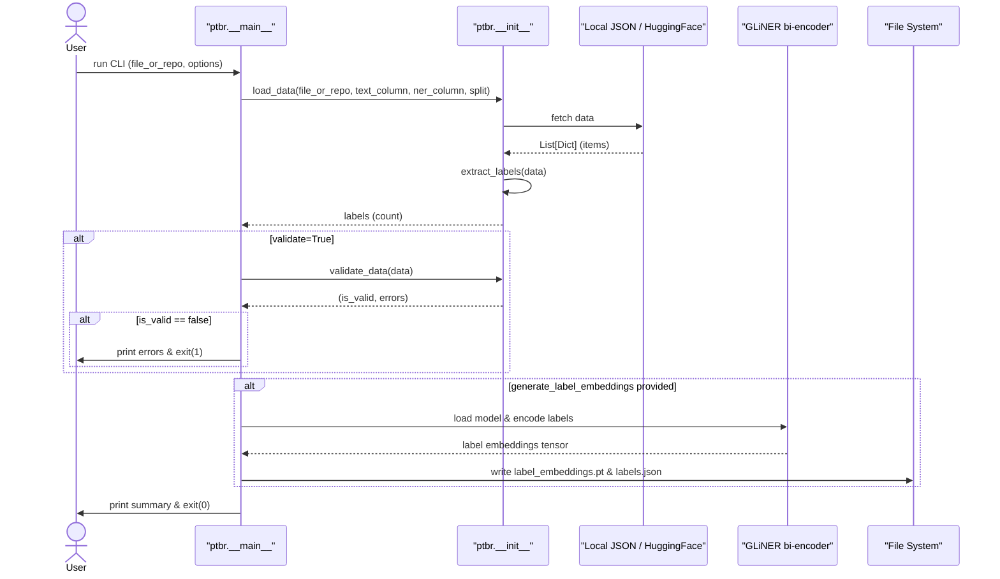
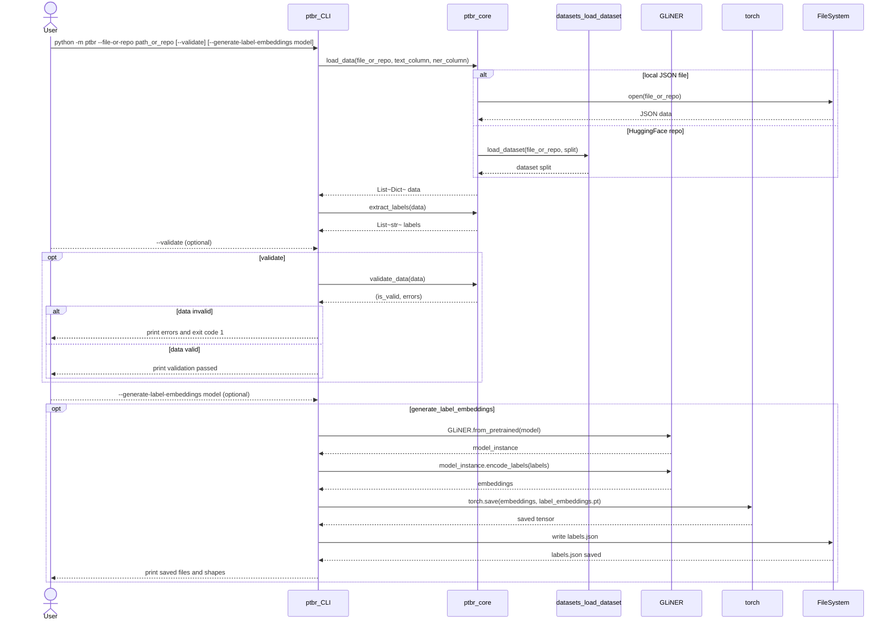
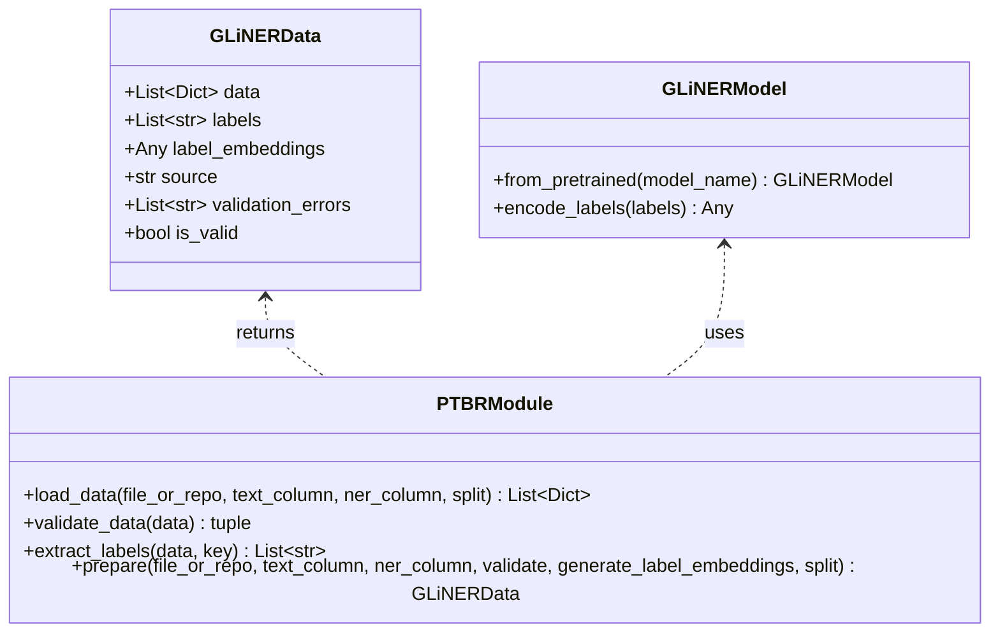

# PR Comments Export

> Exported from [https://github.com/arthrod/GLiNER/pull/3](https://github.com/arthrod/GLiNER/pull/3)  
> 16 of 16 comments selected  
> Generated by [Cicero](https://cicero.im) on 2/17/2026, 12:56:27 AM

---

### coderabbitai[bot] &mdash; 2/16/2026, 11:31:01 PM

> File: `ptbr/__init__.py`

<details><summary>Code context</summary>

```diff
@@ -0,0 +1,212 @@
+"""PT-BR data utilities for GLiNER.
+
+Loads, validates, and prepares datasets in GLiNER's native format.
+Compatible with all model variants: span, token, bi-encoder, decoder,
+relation extraction (relex), and multitask pipelines.
+
+Native format (both span-based and token-based models consume this):
+    [
+        {
+            "tokenized_text": ["word1", "word2", ...],
+            "ner": [[start, end, "Label"], ...]
+        },
+        ...
+    ]
+
+Optional fields for relation extraction models:
+    "relations": [[head_entity_idx, tail_entity_idx, "rel_type"], ...]
+
+When used as a module:
+    from ptbr import prepare
+    result = prepare("path/to/data.json")
+    # result is a GLiNERData object with .data, .labels, .is_valid, etc.
+"""
+
+import os
+import json
+from dataclasses import dataclass, field
+from typing import Any, Dict, List, Optional
+
+
+@dataclass
+class GLiNERData:
+    """Container for a GLiNER-compatible dataset."""
+
+    data: List[Dict[str, Any]]
+    labels: List[str] = field(default_factory=list)
+    label_embeddings: Optional[Any] = None
+    source: str = ""
+    validation_errors: List[str] = field(default_factory=list)
+    is_valid: bool = False
+
+
+def load_data(
+    file_or_repo: str,
+    text_column: str = "tokenized_text",
+    ner_column: str = "ner",
+    split: str = "train",
+) -> List[Dict[str, Any]]:
+    """Load data from a local JSON file or a HuggingFace dataset repo.
+
+    Columns are mapped to GLiNER's native keys (tokenized_text, ner).
+    Extra columns (relations, ner_negatives, ner_labels, etc.) are preserved.
+    """
+    if os.path.exists(file_or_repo):
+        with open(file_or_repo, "r", encoding="utf-8") as f:
+            raw = json.load(f)
+        if not isinstance(raw, list):
+            raw = [raw]
+        if text_column == "tokenized_text" and ner_column == "ner":
+            return raw
+        data = []
+        for item in raw:
+            mapped = dict(item)
+            if text_column != "tokenized_text" and text_column in mapped:
+                mapped["tokenized_text"] = mapped.pop(text_column)
+            if ner_column != "ner" and ner_column in mapped:
+                mapped["ner"] = mapped.pop(ner_column)
+            data.append(mapped)
+        return data
+
+    from datasets import load_dataset
+
+    dataset = load_dataset(file_or_repo, split=split)
+    data = []
+    for item in dataset:
+        mapped = {"tokenized_text": item[text_column], "ner": item[ner_column]}
+        for key in item:
+            if key not in (text_column, ner_column):
+                mapped[key] = item[key]
+        data.append(mapped)
+    return data
+
+
+def validate_data(data: List[Dict[str, Any]]) -> tuple:
+    """Validate that data conforms to GLiNER's native format.
+
+    Checks the core fields required by all model variants (span, token,
+    bi-encoder, decoder, relex, multitask) and optional relation fields.
+
+    Returns:
+        (is_valid, errors) tuple.
+    """
+    errors = []
+
+    if not isinstance(data, list):
+        return False, ["Data must be a list of dictionaries"]
+
+    for i, item in enumerate(data):
+        if not isinstance(item, dict):
+            errors.append(f"[{i}] Item is not a dictionary")
+            continue
+
+        # --- tokenized_text ---
+        if "tokenized_text" not in item:
+            errors.append(f"[{i}] Missing 'tokenized_text'")
+            continue
+
+        tokens = item["tokenized_text"]
+        if not isinstance(tokens, list) or not all(isinstance(t, str) for t in tokens):
+            errors.append(f"[{i}] 'tokenized_text' must be a list of strings")
+            continue
+
+        num_tokens = len(tokens)
+
+        # --- ner ---
+        if "ner" not in item:
+            errors.append(f"[{i}] Missing 'ner'")
+            continue
+
+        ner = item["ner"]
+        if not isinstance(ner, list):
+            errors.append(f"[{i}] 'ner' must be a list of [start, end, label]")
+            continue
+
+        for j, span in enumerate(ner):
+            if not isinstance(span, (list, tuple)) or len(span) != 3:
+                errors.append(f"[{i}].ner[{j}] Must be [start, end, label], got {span}")
+                continue
+            start, end, label = span
+            if not isinstance(start, int) or not isinstance(end, int):
+                errors.append(f"[{i}].ner[{j}] start/end must be integers")
+            elif start < 0 or end < 0:
+                errors.append(f"[{i}].ner[{j}] start/end must be non-negative")
+            elif start > end:
+                errors.append(f"[{i}].ner[{j}] start ({start}) > end ({end})")
+            elif end >= num_tokens:
+                errors.append(f"[{i}].ner[{j}] end ({end}) >= num_tokens ({num_tokens})")
+            if not isinstance(label, str):
+                errors.append(f"[{i}].ner[{j}] label must be a string")
+
+        # --- relations (optional, for relex models) ---
+        if "relations" in item:
+            rels = item["relations"]
+            if not isinstance(rels, list):
+                errors.append(f"[{i}] 'relations' must be a list")
+            else:
+                num_entities = len(ner)
+                for j, rel in enumerate(rels):
+                    if not isinstance(rel, (list, tuple)) or len(rel) != 3:
+                        errors.append(f"[{i}].relations[{j}] Must be [head, tail, type]")
+                        continue
+                    head, tail, rel_type = rel
+                    if not isinstance(head, int) or not isinstance(tail, int):
+                        errors.append(f"[{i}].relations[{j}] head/tail must be integers")
+                    elif head >= num_entities or tail >= num_entities:
+                        errors.append(
+                            f"[{i}].relations[{j}] index out of bounds "
+                            f"(head={head}, tail={tail}, num_entities={num_entities})"
+                        )
```
</details>

_⚠️ Potential issue_ | _🟡 Minor_

**Missing negative index check for relation head/tail.**

The code validates that `head` and `tail` are integers and checks upper bounds, but doesn't check for negative indices (unlike the NER span validation at line 132-133).


<details>
<summary>🐛 Proposed fix</summary>

```diff
                     head, tail, rel_type = rel
                     if not isinstance(head, int) or not isinstance(tail, int):
                         errors.append(f"[{i}].relations[{j}] head/tail must be integers")
+                    elif head < 0 or tail < 0:
+                        errors.append(f"[{i}].relations[{j}] head/tail must be non-negative")
                     elif head >= num_entities or tail >= num_entities:
```
</details>

<details>
<summary>🤖 Prompt for AI Agents</summary>

```
Verify each finding against the current code and only fix it if needed.

In `@ptbr/__init__.py` around lines 152 - 159, The relation validation currently
checks types and upper bounds for head/tail but misses negative-index checks;
update the validation inside the loop that handles rel = (head, tail, rel_type)
(the block that appends to errors for relations[{j}] in item [{i}]) to also
reject negative indices by adding a check for head < 0 or tail < 0 and append an
appropriate error message (similar format to the NER span negative-index
handling) before the upper-bound check so negative values produce a clear
errors.append entry referencing head/tail and num_entities.
```

</details>

<!-- fingerprinting:phantom:poseidon:ocelot -->

<!-- This is an auto-generated comment by CodeRabbit -->

---

### gemini-code-assist[bot] &mdash; 2/16/2026, 11:30:57 PM

> File: `ptbr/__init__.py`

<details><summary>Code context</summary>

```diff
@@ -0,0 +1,212 @@
+"""PT-BR data utilities for GLiNER.
+
+Loads, validates, and prepares datasets in GLiNER's native format.
+Compatible with all model variants: span, token, bi-encoder, decoder,
+relation extraction (relex), and multitask pipelines.
+
+Native format (both span-based and token-based models consume this):
+    [
+        {
+            "tokenized_text": ["word1", "word2", ...],
+            "ner": [[start, end, "Label"], ...]
+        },
+        ...
+    ]
+
+Optional fields for relation extraction models:
+    "relations": [[head_entity_idx, tail_entity_idx, "rel_type"], ...]
+
+When used as a module:
+    from ptbr import prepare
+    result = prepare("path/to/data.json")
+    # result is a GLiNERData object with .data, .labels, .is_valid, etc.
+"""
+
+import os
+import json
+from dataclasses import dataclass, field
+from typing import Any, Dict, List, Optional
+
+
+@dataclass
+class GLiNERData:
+    """Container for a GLiNER-compatible dataset."""
+
+    data: List[Dict[str, Any]]
+    labels: List[str] = field(default_factory=list)
+    label_embeddings: Optional[Any] = None
+    source: str = ""
+    validation_errors: List[str] = field(default_factory=list)
+    is_valid: bool = False
+
+
+def load_data(
+    file_or_repo: str,
+    text_column: str = "tokenized_text",
+    ner_column: str = "ner",
+    split: str = "train",
+) -> List[Dict[str, Any]]:
+    """Load data from a local JSON file or a HuggingFace dataset repo.
+
+    Columns are mapped to GLiNER's native keys (tokenized_text, ner).
+    Extra columns (relations, ner_negatives, ner_labels, etc.) are preserved.
+    """
+    if os.path.exists(file_or_repo):
+        with open(file_or_repo, "r", encoding="utf-8") as f:
+            raw = json.load(f)
+        if not isinstance(raw, list):
+            raw = [raw]
+        if text_column == "tokenized_text" and ner_column == "ner":
+            return raw
+        data = []
+        for item in raw:
+            mapped = dict(item)
+            if text_column != "tokenized_text" and text_column in mapped:
+                mapped["tokenized_text"] = mapped.pop(text_column)
+            if ner_column != "ner" and ner_column in mapped:
+                mapped["ner"] = mapped.pop(ner_column)
+            data.append(mapped)
+        return data
+
+    from datasets import load_dataset
+
+    dataset = load_dataset(file_or_repo, split=split)
+    data = []
+    for item in dataset:
+        mapped = {"tokenized_text": item[text_column], "ner": item[ner_column]}
+        for key in item:
+            if key not in (text_column, ner_column):
+                mapped[key] = item[key]
+        data.append(mapped)
+    return data
+
+
+def validate_data(data: List[Dict[str, Any]]) -> tuple:
+    """Validate that data conforms to GLiNER's native format.
+
+    Checks the core fields required by all model variants (span, token,
+    bi-encoder, decoder, relex, multitask) and optional relation fields.
+
+    Returns:
+        (is_valid, errors) tuple.
+    """
+    errors = []
+
+    if not isinstance(data, list):
+        return False, ["Data must be a list of dictionaries"]
+
+    for i, item in enumerate(data):
+        if not isinstance(item, dict):
+            errors.append(f"[{i}] Item is not a dictionary")
+            continue
+
+        # --- tokenized_text ---
+        if "tokenized_text" not in item:
+            errors.append(f"[{i}] Missing 'tokenized_text'")
+            continue
+
+        tokens = item["tokenized_text"]
+        if not isinstance(tokens, list) or not all(isinstance(t, str) for t in tokens):
+            errors.append(f"[{i}] 'tokenized_text' must be a list of strings")
+            continue
+
+        num_tokens = len(tokens)
+
+        # --- ner ---
+        if "ner" not in item:
+            errors.append(f"[{i}] Missing 'ner'")
+            continue
+
+        ner = item["ner"]
+        if not isinstance(ner, list):
+            errors.append(f"[{i}] 'ner' must be a list of [start, end, label]")
+            continue
+
+        for j, span in enumerate(ner):
+            if not isinstance(span, (list, tuple)) or len(span) != 3:
+                errors.append(f"[{i}].ner[{j}] Must be [start, end, label], got {span}")
+                continue
+            start, end, label = span
+            if not isinstance(start, int) or not isinstance(end, int):
+                errors.append(f"[{i}].ner[{j}] start/end must be integers")
+            elif start < 0 or end < 0:
+                errors.append(f"[{i}].ner[{j}] start/end must be non-negative")
+            elif start > end:
+                errors.append(f"[{i}].ner[{j}] start ({start}) > end ({end})")
+            elif end >= num_tokens:
+                errors.append(f"[{i}].ner[{j}] end ({end}) >= num_tokens ({num_tokens})")
+            if not isinstance(label, str):
+                errors.append(f"[{i}].ner[{j}] label must be a string")
+
+        # --- relations (optional, for relex models) ---
+        if "relations" in item:
+            rels = item["relations"]
+            if not isinstance(rels, list):
+                errors.append(f"[{i}] 'relations' must be a list")
+            else:
+                num_entities = len(ner)
+                for j, rel in enumerate(rels):
+                    if not isinstance(rel, (list, tuple)) or len(rel) != 3:
+                        errors.append(f"[{i}].relations[{j}] Must be [head, tail, type]")
+                        continue
+                    head, tail, rel_type = rel
+                    if not isinstance(head, int) or not isinstance(tail, int):
+                        errors.append(f"[{i}].relations[{j}] head/tail must be integers")
+                    elif head >= num_entities or tail >= num_entities:
+                        errors.append(
+                            f"[{i}].relations[{j}] index out of bounds "
+                            f"(head={head}, tail={tail}, num_entities={num_entities})"
+                        )
+                    if not isinstance(rel_type, str):
+                        errors.append(f"[{i}].relations[{j}] relation type must be a string")
+
+    return len(errors) == 0, errors
+
+
+def extract_labels(data: List[Dict[str, Any]], key: str = "ner") -> List[str]:
+    """Extract all unique labels from the dataset."""
+    labels = set()
+    for item in data:
+        for span in item.get(key, []):
+            if len(span) >= 3:
+                labels.add(span[-1])
+    return sorted(labels)
+
+
+def prepare(
+    file_or_repo: str,
+    text_column: str = "tokenized_text",
+    ner_column: str = "ner",
+    validate: bool = True,
+    generate_label_embeddings: Optional[str] = None,
+    split: str = "train",
+) -> GLiNERData:
+    """Load, validate, and optionally embed labels. Returns a GLiNERData object.
+
+    Args:
+        file_or_repo: Path to a local JSON file or HuggingFace dataset repo id.
+        text_column: Column name to map to ``tokenized_text``.
+        ner_column: Column name to map to ``ner``.
+        validate: Whether to run validation.
+        generate_label_embeddings: Model name/path for bi-encoder label
+            embedding generation (e.g. ``"urchade/gliner_multi-v2.1"``).
+            Only supported for bi-encoder models.
+        split: Dataset split when loading from HuggingFace.
+    """
+    data = load_data(file_or_repo, text_column, ner_column, split)
+    labels = extract_labels(data)
+
+    result = GLiNERData(data=data, labels=labels, source=file_or_repo)
+
+    if validate:
+        is_valid, errs = validate_data(data)
+        result.is_valid = is_valid
+        result.validation_errors = errs
+
+    if generate_label_embeddings:
+        from gliner import GLiNER
+
+        model = GLiNER.from_pretrained(generate_label_embeddings)
```
</details>

 

The `prepare` function uses `GLiNER.from_pretrained` to load a model from a user-provided path or repository ID. In the core `gliner` library (specifically in `gliner/modeling/encoder.py`), the `Transformer` class hardcodes `trust_remote_code=True` when calling `AutoModel.from_pretrained`. This allows an attacker to execute arbitrary code on the user's machine if they can trick the user into loading a malicious model. 

To mitigate this, you should add a `trust_remote_code` parameter to the `prepare` function, defaulting to `False`, and pass it to `GLiNER.from_pretrained`. Note that the core library should also be updated to support this parameter and not default to `True`.

---

### gemini-code-assist[bot] &mdash; 2/16/2026, 11:30:57 PM

> File: `ptbr/__main__.py`

<details><summary>Code context</summary>

```diff
@@ -0,0 +1,64 @@
+"""CLI entry point: python -m ptbr
+
+Uses typer to expose --validate, --file-or-repo, --text-column,
+--ner-column, and --generate-label-embeddings.
+"""
+
+import json
+from typing import Optional
+
+import typer
+
+from ptbr import extract_labels, load_data, validate_data
+
+app = typer.Typer(add_completion=False)
+
+
+@app.callback(invoke_without_command=True)
+def main(
+    file_or_repo: str = typer.Option(..., help="Local JSON file path or HuggingFace dataset repo id."),
+    text_column: str = typer.Option("tokenized_text", help="Source column name for tokenized text."),
+    ner_column: str = typer.Option("ner", help="Source column name for NER annotations."),
+    validate: bool = typer.Option(False, help="Validate the dataset against GLiNER native format."),
+    generate_label_embeddings: Optional[str] = typer.Option(
+        None,
+        help="Model name/path to generate and save label embeddings (bi-encoder models).",
+    ),
+):
+    """Load GLiNER data from a file or HuggingFace repo, validate, or generate label embeddings."""
+    data = load_data(file_or_repo, text_column, ner_column)
+    labels = extract_labels(data)
+
+    typer.echo(f"Loaded {len(data)} examples from {file_or_repo}")
+    typer.echo(f"Found {len(labels)} unique labels")
+
+    if validate:
+        is_valid, errors = validate_data(data)
+        if is_valid:
+            typer.echo("Validation passed.")
+        else:
+            typer.echo(f"Validation failed with {len(errors)} error(s):")
+            for err in errors:
+                typer.echo(f"  {err}")
+            raise typer.Exit(code=1)
+
+    if generate_label_embeddings:
+        import torch
+
+        from gliner import GLiNER
+
+        typer.echo(f"Loading model: {generate_label_embeddings}")
+        model = GLiNER.from_pretrained(generate_label_embeddings)
```
</details>

 

The CLI entry point uses `GLiNER.from_pretrained` with the user-provided `generate_label_embeddings` option. As noted in the `ptbr/__init__.py` review, this leads to arbitrary code execution because `trust_remote_code=True` is hardcoded in the underlying library. 

You should add a `--trust-remote-code` flag to the CLI, defaulting to `False`, and pass it to the model loading function.

---

### gemini-code-assist[bot] &mdash; 2/16/2026, 11:30:57 PM

> File: `ptbr/__main__.py`

<details><summary>Code context</summary>

```diff
@@ -0,0 +1,64 @@
+"""CLI entry point: python -m ptbr
+
+Uses typer to expose --validate, --file-or-repo, --text-column,
+--ner-column, and --generate-label-embeddings.
+"""
+
+import json
+from typing import Optional
+
+import typer
+
+from ptbr import extract_labels, load_data, validate_data
+
+app = typer.Typer(add_completion=False)
+
+
+@app.callback(invoke_without_command=True)
+def main(
+    file_or_repo: str = typer.Option(..., help="Local JSON file path or HuggingFace dataset repo id."),
+    text_column: str = typer.Option("tokenized_text", help="Source column name for tokenized text."),
+    ner_column: str = typer.Option("ner", help="Source column name for NER annotations."),
+    validate: bool = typer.Option(False, help="Validate the dataset against GLiNER native format."),
+    generate_label_embeddings: Optional[str] = typer.Option(
+        None,
+        help="Model name/path to generate and save label embeddings (bi-encoder models).",
+    ),
+):
+    """Load GLiNER data from a file or HuggingFace repo, validate, or generate label embeddings."""
+    data = load_data(file_or_repo, text_column, ner_column)
+    labels = extract_labels(data)
+
+    typer.echo(f"Loaded {len(data)} examples from {file_or_repo}")
+    typer.echo(f"Found {len(labels)} unique labels")
+
+    if validate:
+        is_valid, errors = validate_data(data)
+        if is_valid:
+            typer.echo("Validation passed.")
+        else:
+            typer.echo(f"Validation failed with {len(errors)} error(s):")
+            for err in errors:
+                typer.echo(f"  {err}")
+            raise typer.Exit(code=1)
+
+    if generate_label_embeddings:
+        import torch
+
+        from gliner import GLiNER
+
+        typer.echo(f"Loading model: {generate_label_embeddings}")
+        model = GLiNER.from_pretrained(generate_label_embeddings)
+
+        typer.echo(f"Encoding {len(labels)} labels...")
+        embeddings = model.encode_labels(labels)
+
+        torch.save(embeddings, "label_embeddings.pt")
+        with open("labels.json", "w", encoding="utf-8") as f:
+            json.dump(labels, f, ensure_ascii=False, indent=2)
```
</details>

 

The CLI tool writes output to hardcoded filenames (`label_embeddings.pt` and `labels.json`) in the current working directory. This is a security concern as it can lead to unintended overwriting of existing files and is susceptible to symlink attacks in shared environments. It also causes accidental data loss if the script is run multiple times. It is strongly recommended to allow users to specify the output paths via CLI options, such as `--output-embeddings-path` and `--output-labels-path`, and to use safe file writing practices.

```python
        torch.save(embeddings, output_embeddings_path)
with open(output_labels_path, "w", encoding="utf-8") as f:
    json.dump(labels, f, ensure_ascii=False, indent=2)
```

---

### gemini-code-assist[bot] &mdash; 2/16/2026, 11:30:57 PM

> File: `ptbr/__init__.py`

<details><summary>Code context</summary>

```diff
@@ -0,0 +1,212 @@
+"""PT-BR data utilities for GLiNER.
+
+Loads, validates, and prepares datasets in GLiNER's native format.
+Compatible with all model variants: span, token, bi-encoder, decoder,
+relation extraction (relex), and multitask pipelines.
+
+Native format (both span-based and token-based models consume this):
+    [
+        {
+            "tokenized_text": ["word1", "word2", ...],
+            "ner": [[start, end, "Label"], ...]
+        },
+        ...
+    ]
+
+Optional fields for relation extraction models:
+    "relations": [[head_entity_idx, tail_entity_idx, "rel_type"], ...]
+
+When used as a module:
+    from ptbr import prepare
+    result = prepare("path/to/data.json")
+    # result is a GLiNERData object with .data, .labels, .is_valid, etc.
+"""
+
+import os
+import json
+from dataclasses import dataclass, field
+from typing import Any, Dict, List, Optional
+
+
+@dataclass
+class GLiNERData:
+    """Container for a GLiNER-compatible dataset."""
+
+    data: List[Dict[str, Any]]
+    labels: List[str] = field(default_factory=list)
+    label_embeddings: Optional[Any] = None
+    source: str = ""
+    validation_errors: List[str] = field(default_factory=list)
+    is_valid: bool = False
+
+
+def load_data(
+    file_or_repo: str,
+    text_column: str = "tokenized_text",
+    ner_column: str = "ner",
+    split: str = "train",
+) -> List[Dict[str, Any]]:
+    """Load data from a local JSON file or a HuggingFace dataset repo.
+
+    Columns are mapped to GLiNER's native keys (tokenized_text, ner).
+    Extra columns (relations, ner_negatives, ner_labels, etc.) are preserved.
+    """
+    if os.path.exists(file_or_repo):
+        with open(file_or_repo, "r", encoding="utf-8") as f:
+            raw = json.load(f)
+        if not isinstance(raw, list):
+            raw = [raw]
+        if text_column == "tokenized_text" and ner_column == "ner":
+            return raw
+        data = []
+        for item in raw:
+            mapped = dict(item)
+            if text_column != "tokenized_text" and text_column in mapped:
+                mapped["tokenized_text"] = mapped.pop(text_column)
+            if ner_column != "ner" and ner_column in mapped:
+                mapped["ner"] = mapped.pop(ner_column)
+            data.append(mapped)
+        return data
+
+    from datasets import load_dataset
+
+    dataset = load_dataset(file_or_repo, split=split)
+    data = []
+    for item in dataset:
+        mapped = {"tokenized_text": item[text_column], "ner": item[ner_column]}
+        for key in item:
+            if key not in (text_column, ner_column):
+                mapped[key] = item[key]
+        data.append(mapped)
+    return data
+
+
+def validate_data(data: List[Dict[str, Any]]) -> tuple:
+    """Validate that data conforms to GLiNER's native format.
+
+    Checks the core fields required by all model variants (span, token,
+    bi-encoder, decoder, relex, multitask) and optional relation fields.
+
+    Returns:
+        (is_valid, errors) tuple.
+    """
+    errors = []
+
+    if not isinstance(data, list):
+        return False, ["Data must be a list of dictionaries"]
+
+    for i, item in enumerate(data):
+        if not isinstance(item, dict):
+            errors.append(f"[{i}] Item is not a dictionary")
+            continue
+
+        # --- tokenized_text ---
+        if "tokenized_text" not in item:
+            errors.append(f"[{i}] Missing 'tokenized_text'")
+            continue
+
+        tokens = item["tokenized_text"]
+        if not isinstance(tokens, list) or not all(isinstance(t, str) for t in tokens):
+            errors.append(f"[{i}] 'tokenized_text' must be a list of strings")
+            continue
+
+        num_tokens = len(tokens)
+
+        # --- ner ---
+        if "ner" not in item:
+            errors.append(f"[{i}] Missing 'ner'")
+            continue
+
+        ner = item["ner"]
+        if not isinstance(ner, list):
+            errors.append(f"[{i}] 'ner' must be a list of [start, end, label]")
+            continue
+
+        for j, span in enumerate(ner):
+            if not isinstance(span, (list, tuple)) or len(span) != 3:
+                errors.append(f"[{i}].ner[{j}] Must be [start, end, label], got {span}")
+                continue
+            start, end, label = span
+            if not isinstance(start, int) or not isinstance(end, int):
+                errors.append(f"[{i}].ner[{j}] start/end must be integers")
+            elif start < 0 or end < 0:
+                errors.append(f"[{i}].ner[{j}] start/end must be non-negative")
+            elif start > end:
+                errors.append(f"[{i}].ner[{j}] start ({start}) > end ({end})")
+            elif end >= num_tokens:
+                errors.append(f"[{i}].ner[{j}] end ({end}) >= num_tokens ({num_tokens})")
+            if not isinstance(label, str):
+                errors.append(f"[{i}].ner[{j}] label must be a string")
+
+        # --- relations (optional, for relex models) ---
+        if "relations" in item:
+            rels = item["relations"]
+            if not isinstance(rels, list):
+                errors.append(f"[{i}] 'relations' must be a list")
+            else:
+                num_entities = len(ner)
+                for j, rel in enumerate(rels):
+                    if not isinstance(rel, (list, tuple)) or len(rel) != 3:
+                        errors.append(f"[{i}].relations[{j}] Must be [head, tail, type]")
+                        continue
+                    head, tail, rel_type = rel
+                    if not isinstance(head, int) or not isinstance(tail, int):
+                        errors.append(f"[{i}].relations[{j}] head/tail must be integers")
+                    elif head >= num_entities or tail >= num_entities:
+                        errors.append(
+                            f"[{i}].relations[{j}] index out of bounds "
+                            f"(head={head}, tail={tail}, num_entities={num_entities})"
+                        )
+                    if not isinstance(rel_type, str):
+                        errors.append(f"[{i}].relations[{j}] relation type must be a string")
+
+    return len(errors) == 0, errors
+
+
+def extract_labels(data: List[Dict[str, Any]], key: str = "ner") -> List[str]:
+    """Extract all unique labels from the dataset."""
+    labels = set()
+    for item in data:
+        for span in item.get(key, []):
+            if len(span) >= 3:
+                labels.add(span[-1])
```
</details>


For clarity and consistency with the documented data format `[start, end, "Label"]`, it's better to access the label using `span[2]` instead of `span[-1]`. While they are equivalent for correctly formatted data, using the explicit index improves readability and makes the code more robust to potential future changes in the span format.

```suggestion
                labels.add(span[2])
```

---

### gemini-code-assist[bot] &mdash; 2/16/2026, 11:30:57 PM

> File: `ptbr/__main__.py`

<details><summary>Code context</summary>

```diff
@@ -0,0 +1,64 @@
+"""CLI entry point: python -m ptbr
+
+Uses typer to expose --validate, --file-or-repo, --text-column,
+--ner-column, and --generate-label-embeddings.
+"""
+
+import json
+from typing import Optional
+
+import typer
+
+from ptbr import extract_labels, load_data, validate_data
+
+app = typer.Typer(add_completion=False)
+
+
+@app.callback(invoke_without_command=True)
+def main(
+    file_or_repo: str = typer.Option(..., help="Local JSON file path or HuggingFace dataset repo id."),
+    text_column: str = typer.Option("tokenized_text", help="Source column name for tokenized text."),
+    ner_column: str = typer.Option("ner", help="Source column name for NER annotations."),
+    validate: bool = typer.Option(False, help="Validate the dataset against GLiNER native format."),
+    generate_label_embeddings: Optional[str] = typer.Option(
+        None,
+        help="Model name/path to generate and save label embeddings (bi-encoder models).",
+    ),
+):
+    """Load GLiNER data from a file or HuggingFace repo, validate, or generate label embeddings."""
+    data = load_data(file_or_repo, text_column, ner_column)
```
</details>


The `load_data` function is called without the `split` argument, which means it will always use the default "train" split when loading from a HuggingFace dataset. To make the CLI more flexible, consider adding a `--split` option to allow users to specify which dataset split to process.

You can add the option to your `main` function like this:
```python
@app.callback(invoke_without_command=True)
def main(
    # ... existing options
    split: str = typer.Option("train", help="Dataset split to load from HuggingFace repo."),
    # ... existing options
):
```
And then use it in the `load_data` call.

```python
    data = load_data(file_or_repo, text_column, ner_column, split)
```

---

### chatgpt-codex-connector[bot] &mdash; 2/16/2026, 11:30:30 PM

> File: `ptbr/__main__.py`

<details><summary>Code context</summary>

```diff
@@ -0,0 +1,64 @@
+"""CLI entry point: python -m ptbr
+
+Uses typer to expose --validate, --file-or-repo, --text-column,
+--ner-column, and --generate-label-embeddings.
+"""
+
+import json
+from typing import Optional
+
+import typer
```
</details>

**<sub><sub></sub></sub>  Add typer to runtime dependencies**

The new CLI imports `typer` at module import time, but `pyproject.toml` does not declare `typer` in `project.dependencies` or any optional dependency group, so `python -m ptbr` fails with `ModuleNotFoundError` in a standard install unless users manually add an undeclared package. Since this commit advertises `python -m ptbr` as the entrypoint, the feature is broken out of the box for packaged usage.

Useful? React with 👍 / 👎.

---

### chatgpt-codex-connector[bot] &mdash; 2/16/2026, 11:30:30 PM

> File: `ptbr/__init__.py`

<details><summary>Code context</summary>

```diff
@@ -0,0 +1,212 @@
+"""PT-BR data utilities for GLiNER.
+
+Loads, validates, and prepares datasets in GLiNER's native format.
+Compatible with all model variants: span, token, bi-encoder, decoder,
+relation extraction (relex), and multitask pipelines.
+
+Native format (both span-based and token-based models consume this):
+    [
+        {
+            "tokenized_text": ["word1", "word2", ...],
+            "ner": [[start, end, "Label"], ...]
+        },
+        ...
+    ]
+
+Optional fields for relation extraction models:
+    "relations": [[head_entity_idx, tail_entity_idx, "rel_type"], ...]
+
+When used as a module:
+    from ptbr import prepare
```
</details>

**<sub><sub></sub></sub>  Include ptbr package in distribution build**

This commit introduces a new top-level `ptbr` package/API, but the build config still only includes `gliner` packages (`[tool.setuptools.packages.find] include = ["gliner", "gliner.*"]`), so wheels/sdists built from this repo will not ship `ptbr`. In installed environments, both `from ptbr import prepare` and `python -m ptbr` will be unavailable even though this commit adds and documents them.

Useful? React with 👍 / 👎.

---

### chatgpt-codex-connector[bot] &mdash; 2/16/2026, 11:30:30 PM

> File: `ptbr/__init__.py`

<details><summary>Code context</summary>

```diff
@@ -0,0 +1,212 @@
+"""PT-BR data utilities for GLiNER.
+
+Loads, validates, and prepares datasets in GLiNER's native format.
+Compatible with all model variants: span, token, bi-encoder, decoder,
+relation extraction (relex), and multitask pipelines.
+
+Native format (both span-based and token-based models consume this):
+    [
+        {
+            "tokenized_text": ["word1", "word2", ...],
+            "ner": [[start, end, "Label"], ...]
+        },
+        ...
+    ]
+
+Optional fields for relation extraction models:
+    "relations": [[head_entity_idx, tail_entity_idx, "rel_type"], ...]
+
+When used as a module:
+    from ptbr import prepare
+    result = prepare("path/to/data.json")
+    # result is a GLiNERData object with .data, .labels, .is_valid, etc.
+"""
+
+import os
+import json
+from dataclasses import dataclass, field
+from typing import Any, Dict, List, Optional
+
+
+@dataclass
+class GLiNERData:
+    """Container for a GLiNER-compatible dataset."""
+
+    data: List[Dict[str, Any]]
+    labels: List[str] = field(default_factory=list)
+    label_embeddings: Optional[Any] = None
+    source: str = ""
+    validation_errors: List[str] = field(default_factory=list)
+    is_valid: bool = False
+
+
+def load_data(
+    file_or_repo: str,
+    text_column: str = "tokenized_text",
+    ner_column: str = "ner",
+    split: str = "train",
+) -> List[Dict[str, Any]]:
+    """Load data from a local JSON file or a HuggingFace dataset repo.
+
+    Columns are mapped to GLiNER's native keys (tokenized_text, ner).
+    Extra columns (relations, ner_negatives, ner_labels, etc.) are preserved.
+    """
+    if os.path.exists(file_or_repo):
+        with open(file_or_repo, "r", encoding="utf-8") as f:
+            raw = json.load(f)
+        if not isinstance(raw, list):
+            raw = [raw]
+        if text_column == "tokenized_text" and ner_column == "ner":
+            return raw
+        data = []
+        for item in raw:
+            mapped = dict(item)
+            if text_column != "tokenized_text" and text_column in mapped:
+                mapped["tokenized_text"] = mapped.pop(text_column)
+            if ner_column != "ner" and ner_column in mapped:
+                mapped["ner"] = mapped.pop(ner_column)
+            data.append(mapped)
+        return data
+
+    from datasets import load_dataset
+
+    dataset = load_dataset(file_or_repo, split=split)
+    data = []
+    for item in dataset:
+        mapped = {"tokenized_text": item[text_column], "ner": item[ner_column]}
+        for key in item:
+            if key not in (text_column, ner_column):
+                mapped[key] = item[key]
+        data.append(mapped)
+    return data
+
+
+def validate_data(data: List[Dict[str, Any]]) -> tuple:
+    """Validate that data conforms to GLiNER's native format.
+
+    Checks the core fields required by all model variants (span, token,
+    bi-encoder, decoder, relex, multitask) and optional relation fields.
+
+    Returns:
+        (is_valid, errors) tuple.
+    """
+    errors = []
+
+    if not isinstance(data, list):
+        return False, ["Data must be a list of dictionaries"]
+
+    for i, item in enumerate(data):
+        if not isinstance(item, dict):
+            errors.append(f"[{i}] Item is not a dictionary")
+            continue
+
+        # --- tokenized_text ---
+        if "tokenized_text" not in item:
+            errors.append(f"[{i}] Missing 'tokenized_text'")
+            continue
+
+        tokens = item["tokenized_text"]
+        if not isinstance(tokens, list) or not all(isinstance(t, str) for t in tokens):
+            errors.append(f"[{i}] 'tokenized_text' must be a list of strings")
+            continue
+
+        num_tokens = len(tokens)
+
+        # --- ner ---
+        if "ner" not in item:
+            errors.append(f"[{i}] Missing 'ner'")
+            continue
+
+        ner = item["ner"]
+        if not isinstance(ner, list):
+            errors.append(f"[{i}] 'ner' must be a list of [start, end, label]")
+            continue
+
+        for j, span in enumerate(ner):
+            if not isinstance(span, (list, tuple)) or len(span) != 3:
+                errors.append(f"[{i}].ner[{j}] Must be [start, end, label], got {span}")
+                continue
+            start, end, label = span
+            if not isinstance(start, int) or not isinstance(end, int):
+                errors.append(f"[{i}].ner[{j}] start/end must be integers")
+            elif start < 0 or end < 0:
+                errors.append(f"[{i}].ner[{j}] start/end must be non-negative")
+            elif start > end:
+                errors.append(f"[{i}].ner[{j}] start ({start}) > end ({end})")
+            elif end >= num_tokens:
+                errors.append(f"[{i}].ner[{j}] end ({end}) >= num_tokens ({num_tokens})")
+            if not isinstance(label, str):
+                errors.append(f"[{i}].ner[{j}] label must be a string")
+
+        # --- relations (optional, for relex models) ---
+        if "relations" in item:
+            rels = item["relations"]
+            if not isinstance(rels, list):
+                errors.append(f"[{i}] 'relations' must be a list")
+            else:
+                num_entities = len(ner)
+                for j, rel in enumerate(rels):
+                    if not isinstance(rel, (list, tuple)) or len(rel) != 3:
+                        errors.append(f"[{i}].relations[{j}] Must be [head, tail, type]")
+                        continue
+                    head, tail, rel_type = rel
+                    if not isinstance(head, int) or not isinstance(tail, int):
+                        errors.append(f"[{i}].relations[{j}] head/tail must be integers")
+                    elif head >= num_entities or tail >= num_entities:
+                        errors.append(
+                            f"[{i}].relations[{j}] index out of bounds "
+                            f"(head={head}, tail={tail}, num_entities={num_entities})"
+                        )
+                    if not isinstance(rel_type, str):
+                        errors.append(f"[{i}].relations[{j}] relation type must be a string")
+
+    return len(errors) == 0, errors
+
+
+def extract_labels(data: List[Dict[str, Any]], key: str = "ner") -> List[str]:
+    """Extract all unique labels from the dataset."""
+    labels = set()
+    for item in data:
+        for span in item.get(key, []):
+            if len(span) >= 3:
+                labels.add(span[-1])
+    return sorted(labels)
+
+
+def prepare(
+    file_or_repo: str,
+    text_column: str = "tokenized_text",
+    ner_column: str = "ner",
+    validate: bool = True,
+    generate_label_embeddings: Optional[str] = None,
+    split: str = "train",
+) -> GLiNERData:
+    """Load, validate, and optionally embed labels. Returns a GLiNERData object.
+
+    Args:
+        file_or_repo: Path to a local JSON file or HuggingFace dataset repo id.
+        text_column: Column name to map to ``tokenized_text``.
+        ner_column: Column name to map to ``ner``.
+        validate: Whether to run validation.
+        generate_label_embeddings: Model name/path for bi-encoder label
+            embedding generation (e.g. ``"urchade/gliner_multi-v2.1"``).
+            Only supported for bi-encoder models.
+        split: Dataset split when loading from HuggingFace.
+    """
+    data = load_data(file_or_repo, text_column, ner_column, split)
+    labels = extract_labels(data)
```
</details>

**<sub><sub></sub></sub>  Validate records before extracting labels**

`prepare()` extracts labels before running `validate_data()`, and `extract_labels()` inserts raw `span[-1]` values into a set; malformed inputs with unhashable labels (for example, a list instead of a string) raise `TypeError` and abort execution before validation can report structured errors. This makes `validate=True` ineffective on bad datasets that should be handled gracefully.

Useful? React with 👍 / 👎.

---

### sourcery-ai[bot] &mdash; 2/16/2026, 11:28:49 PM

> File: `ptbr/__init__.py`

<details><summary>Code context</summary>

```diff
@@ -0,0 +1,212 @@
+"""PT-BR data utilities for GLiNER.
+
+Loads, validates, and prepares datasets in GLiNER's native format.
+Compatible with all model variants: span, token, bi-encoder, decoder,
+relation extraction (relex), and multitask pipelines.
+
+Native format (both span-based and token-based models consume this):
+    [
+        {
+            "tokenized_text": ["word1", "word2", ...],
+            "ner": [[start, end, "Label"], ...]
+        },
+        ...
+    ]
+
+Optional fields for relation extraction models:
+    "relations": [[head_entity_idx, tail_entity_idx, "rel_type"], ...]
+
+When used as a module:
+    from ptbr import prepare
+    result = prepare("path/to/data.json")
+    # result is a GLiNERData object with .data, .labels, .is_valid, etc.
+"""
+
+import os
+import json
+from dataclasses import dataclass, field
+from typing import Any, Dict, List, Optional
+
+
+@dataclass
+class GLiNERData:
+    """Container for a GLiNER-compatible dataset."""
+
+    data: List[Dict[str, Any]]
+    labels: List[str] = field(default_factory=list)
+    label_embeddings: Optional[Any] = None
+    source: str = ""
+    validation_errors: List[str] = field(default_factory=list)
+    is_valid: bool = False
+
+
+def load_data(
+    file_or_repo: str,
+    text_column: str = "tokenized_text",
+    ner_column: str = "ner",
+    split: str = "train",
+) -> List[Dict[str, Any]]:
+    """Load data from a local JSON file or a HuggingFace dataset repo.
+
+    Columns are mapped to GLiNER's native keys (tokenized_text, ner).
+    Extra columns (relations, ner_negatives, ner_labels, etc.) are preserved.
+    """
+    if os.path.exists(file_or_repo):
+        with open(file_or_repo, "r", encoding="utf-8") as f:
+            raw = json.load(f)
+        if not isinstance(raw, list):
+            raw = [raw]
+        if text_column == "tokenized_text" and ner_column == "ner":
+            return raw
+        data = []
+        for item in raw:
+            mapped = dict(item)
+            if text_column != "tokenized_text" and text_column in mapped:
+                mapped["tokenized_text"] = mapped.pop(text_column)
+            if ner_column != "ner" and ner_column in mapped:
+                mapped["ner"] = mapped.pop(ner_column)
+            data.append(mapped)
+        return data
+
+    from datasets import load_dataset
+
+    dataset = load_dataset(file_or_repo, split=split)
+    data = []
+    for item in dataset:
+        mapped = {"tokenized_text": item[text_column], "ner": item[ner_column]}
+        for key in item:
+            if key not in (text_column, ner_column):
+                mapped[key] = item[key]
+        data.append(mapped)
+    return data
+
+
+def validate_data(data: List[Dict[str, Any]]) -> tuple:
```
</details>

**suggestion:** Return type for `validate_data` is too generic and loses type information.

The function consistently returns `(bool, List[str])`, but the annotation uses the bare `tuple`, which weakens type safety and can mask incorrect unpacking. Please change the return type to `-> Tuple[bool, List[str]]` (and import `Tuple` from `typing`) to match the actual contract.

Suggested implementation:

```python
from typing import List, Dict, Any, Tuple

```

```python
def validate_data(data: List[Dict[str, Any]]) -> Tuple[bool, List[str]]:

```

---

### sourcery-ai[bot] &mdash; 2/16/2026, 11:28:49 PM

> File: `ptbr/__init__.py`

<details><summary>Code context</summary>

```diff
@@ -0,0 +1,212 @@
+"""PT-BR data utilities for GLiNER.
+
+Loads, validates, and prepares datasets in GLiNER's native format.
+Compatible with all model variants: span, token, bi-encoder, decoder,
+relation extraction (relex), and multitask pipelines.
+
+Native format (both span-based and token-based models consume this):
+    [
+        {
+            "tokenized_text": ["word1", "word2", ...],
+            "ner": [[start, end, "Label"], ...]
+        },
+        ...
+    ]
+
+Optional fields for relation extraction models:
+    "relations": [[head_entity_idx, tail_entity_idx, "rel_type"], ...]
+
+When used as a module:
+    from ptbr import prepare
+    result = prepare("path/to/data.json")
+    # result is a GLiNERData object with .data, .labels, .is_valid, etc.
+"""
+
+import os
+import json
+from dataclasses import dataclass, field
+from typing import Any, Dict, List, Optional
+
+
+@dataclass
+class GLiNERData:
+    """Container for a GLiNER-compatible dataset."""
+
+    data: List[Dict[str, Any]]
+    labels: List[str] = field(default_factory=list)
+    label_embeddings: Optional[Any] = None
+    source: str = ""
+    validation_errors: List[str] = field(default_factory=list)
+    is_valid: bool = False
+
+
+def load_data(
+    file_or_repo: str,
+    text_column: str = "tokenized_text",
+    ner_column: str = "ner",
+    split: str = "train",
+) -> List[Dict[str, Any]]:
+    """Load data from a local JSON file or a HuggingFace dataset repo.
+
+    Columns are mapped to GLiNER's native keys (tokenized_text, ner).
+    Extra columns (relations, ner_negatives, ner_labels, etc.) are preserved.
+    """
+    if os.path.exists(file_or_repo):
+        with open(file_or_repo, "r", encoding="utf-8") as f:
+            raw = json.load(f)
+        if not isinstance(raw, list):
+            raw = [raw]
+        if text_column == "tokenized_text" and ner_column == "ner":
+            return raw
+        data = []
+        for item in raw:
+            mapped = dict(item)
+            if text_column != "tokenized_text" and text_column in mapped:
+                mapped["tokenized_text"] = mapped.pop(text_column)
+            if ner_column != "ner" and ner_column in mapped:
+                mapped["ner"] = mapped.pop(ner_column)
+            data.append(mapped)
+        return data
+
+    from datasets import load_dataset
+
+    dataset = load_dataset(file_or_repo, split=split)
+    data = []
+    for item in dataset:
+        mapped = {"tokenized_text": item[text_column], "ner": item[ner_column]}
+        for key in item:
+            if key not in (text_column, ner_column):
+                mapped[key] = item[key]
+        data.append(mapped)
+    return data
+
+
+def validate_data(data: List[Dict[str, Any]]) -> tuple:
+    """Validate that data conforms to GLiNER's native format.
+
+    Checks the core fields required by all model variants (span, token,
+    bi-encoder, decoder, relex, multitask) and optional relation fields.
+
+    Returns:
+        (is_valid, errors) tuple.
+    """
+    errors = []
+
+    if not isinstance(data, list):
+        return False, ["Data must be a list of dictionaries"]
+
+    for i, item in enumerate(data):
+        if not isinstance(item, dict):
+            errors.append(f"[{i}] Item is not a dictionary")
+            continue
+
+        # --- tokenized_text ---
+        if "tokenized_text" not in item:
+            errors.append(f"[{i}] Missing 'tokenized_text'")
+            continue
+
+        tokens = item["tokenized_text"]
+        if not isinstance(tokens, list) or not all(isinstance(t, str) for t in tokens):
+            errors.append(f"[{i}] 'tokenized_text' must be a list of strings")
+            continue
+
+        num_tokens = len(tokens)
+
+        # --- ner ---
+        if "ner" not in item:
+            errors.append(f"[{i}] Missing 'ner'")
+            continue
+
+        ner = item["ner"]
+        if not isinstance(ner, list):
+            errors.append(f"[{i}] 'ner' must be a list of [start, end, label]")
+            continue
+
+        for j, span in enumerate(ner):
+            if not isinstance(span, (list, tuple)) or len(span) != 3:
+                errors.append(f"[{i}].ner[{j}] Must be [start, end, label], got {span}")
+                continue
+            start, end, label = span
+            if not isinstance(start, int) or not isinstance(end, int):
+                errors.append(f"[{i}].ner[{j}] start/end must be integers")
+            elif start < 0 or end < 0:
+                errors.append(f"[{i}].ner[{j}] start/end must be non-negative")
+            elif start > end:
+                errors.append(f"[{i}].ner[{j}] start ({start}) > end ({end})")
+            elif end >= num_tokens:
+                errors.append(f"[{i}].ner[{j}] end ({end}) >= num_tokens ({num_tokens})")
+            if not isinstance(label, str):
+                errors.append(f"[{i}].ner[{j}] label must be a string")
+
+        # --- relations (optional, for relex models) ---
+        if "relations" in item:
+            rels = item["relations"]
+            if not isinstance(rels, list):
+                errors.append(f"[{i}] 'relations' must be a list")
+            else:
+                num_entities = len(ner)
+                for j, rel in enumerate(rels):
+                    if not isinstance(rel, (list, tuple)) or len(rel) != 3:
+                        errors.append(f"[{i}].relations[{j}] Must be [head, tail, type]")
+                        continue
```
</details>

**issue:** Relations validation does not catch negative head/tail indices.

In the relations block you only bound-check `head`/`tail` on the upper side (`< num_entities`), so negative indices are accepted. This can silently reference the wrong entities via Python’s negative indexing or represent invalid data. Please add a lower-bound check (`0 <= head < num_entities` and `0 <= tail < num_entities`) and raise an error for negative indices, mirroring the NER validation logic.

---

### sourcery-ai[bot] &mdash; 2/16/2026, 11:28:49 PM

> File: `ptbr/__init__.py`

<details><summary>Code context</summary>

```diff
@@ -0,0 +1,212 @@
+"""PT-BR data utilities for GLiNER.
+
+Loads, validates, and prepares datasets in GLiNER's native format.
+Compatible with all model variants: span, token, bi-encoder, decoder,
+relation extraction (relex), and multitask pipelines.
+
+Native format (both span-based and token-based models consume this):
+    [
+        {
+            "tokenized_text": ["word1", "word2", ...],
+            "ner": [[start, end, "Label"], ...]
+        },
+        ...
+    ]
+
+Optional fields for relation extraction models:
+    "relations": [[head_entity_idx, tail_entity_idx, "rel_type"], ...]
+
+When used as a module:
+    from ptbr import prepare
+    result = prepare("path/to/data.json")
+    # result is a GLiNERData object with .data, .labels, .is_valid, etc.
+"""
+
+import os
+import json
+from dataclasses import dataclass, field
+from typing import Any, Dict, List, Optional
+
+
+@dataclass
+class GLiNERData:
+    """Container for a GLiNER-compatible dataset."""
+
+    data: List[Dict[str, Any]]
+    labels: List[str] = field(default_factory=list)
+    label_embeddings: Optional[Any] = None
+    source: str = ""
+    validation_errors: List[str] = field(default_factory=list)
+    is_valid: bool = False
+
+
+def load_data(
+    file_or_repo: str,
+    text_column: str = "tokenized_text",
+    ner_column: str = "ner",
+    split: str = "train",
+) -> List[Dict[str, Any]]:
+    """Load data from a local JSON file or a HuggingFace dataset repo.
+
+    Columns are mapped to GLiNER's native keys (tokenized_text, ner).
+    Extra columns (relations, ner_negatives, ner_labels, etc.) are preserved.
+    """
+    if os.path.exists(file_or_repo):
+        with open(file_or_repo, "r", encoding="utf-8") as f:
+            raw = json.load(f)
+        if not isinstance(raw, list):
+            raw = [raw]
+        if text_column == "tokenized_text" and ner_column == "ner":
+            return raw
+        data = []
+        for item in raw:
+            mapped = dict(item)
+            if text_column != "tokenized_text" and text_column in mapped:
+                mapped["tokenized_text"] = mapped.pop(text_column)
+            if ner_column != "ner" and ner_column in mapped:
+                mapped["ner"] = mapped.pop(ner_column)
+            data.append(mapped)
+        return data
+
+    from datasets import load_dataset
+
+    dataset = load_dataset(file_or_repo, split=split)
+    data = []
+    for item in dataset:
+        mapped = {"tokenized_text": item[text_column], "ner": item[ner_column]}
```
</details>

**issue:** Accessing dataset columns with direct indexing can raise unclear KeyErrors if columns are missing.

Using `item[text_column]` and `item[ner_column]` assumes these columns exist in the dataset. If the user passes an invalid column name, this will fail with an unhelpful `KeyError`. Please either validate `text_column` and `ner_column` against `dataset.column_names` when loading, or catch `KeyError` here and raise a clearer exception that names the missing column and lists available columns.

---

### sourcery-ai[bot] &mdash; 2/16/2026, 11:28:49 PM

> File: `ptbr/__main__.py`

<details><summary>Code context</summary>

```diff
@@ -0,0 +1,64 @@
+"""CLI entry point: python -m ptbr
+
+Uses typer to expose --validate, --file-or-repo, --text-column,
+--ner-column, and --generate-label-embeddings.
+"""
+
+import json
+from typing import Optional
+
+import typer
+
+from ptbr import extract_labels, load_data, validate_data
+
+app = typer.Typer(add_completion=False)
+
+
+@app.callback(invoke_without_command=True)
+def main(
+    file_or_repo: str = typer.Option(..., help="Local JSON file path or HuggingFace dataset repo id."),
+    text_column: str = typer.Option("tokenized_text", help="Source column name for tokenized text."),
+    ner_column: str = typer.Option("ner", help="Source column name for NER annotations."),
+    validate: bool = typer.Option(False, help="Validate the dataset against GLiNER native format."),
+    generate_label_embeddings: Optional[str] = typer.Option(
+        None,
+        help="Model name/path to generate and save label embeddings (bi-encoder models).",
+    ),
+):
+    """Load GLiNER data from a file or HuggingFace repo, validate, or generate label embeddings."""
+    data = load_data(file_or_repo, text_column, ner_column)
```
</details>

**suggestion:** CLI always loads only the default split, which may be surprising for HuggingFace repos.

Since the CLI always uses `load_data`’s default split (`train`), users can’t select `validation`/`test` or other splits that HF datasets expose. Adding a `--split` flag and passing it through to `load_data` would make the CLI more predictable and flexible for different dataset layouts.

Suggested implementation:

```python
    ner_column: str = typer.Option("ner", help="Source column name for NER annotations."),
    split: str = typer.Option(
        "train",
        help="Dataset split to load when using a HuggingFace dataset repo (e.g. 'train', 'validation', 'test').",
    ),
    validate: bool = typer.Option(False, help="Validate the dataset against GLiNER native format."),

```

```python
    """Load GLiNER data from a file or HuggingFace repo, validate, or generate label embeddings."""
+    data = load_data(file_or_repo, text_column, ner_column, split=split)
+    labels = extract_labels(data)

```

```python
Uses typer to expose --validate, --file-or-repo, --text-column,
--ner-column, --split, and --generate-label-embeddings.

```

These changes assume `load_data` already accepts a `split` keyword argument in the form `load_data(file_or_repo, text_column, ner_column, split=...)`. If its signature differs (e.g. `load_data(file_or_repo, text_column, ner_column, split)` or positional-only parameters), adjust the call accordingly so that the `split` value is correctly forwarded.

---

### coderabbitai[bot] &mdash; 2/16/2026, 11:28:09 PM

<!-- This is an auto-generated comment: summarize by coderabbit.ai -->
<!-- walkthrough_start -->

<details>
<summary>📝 Walkthrough</summary>

<!-- This is an auto-generated comment: release notes by coderabbit.ai -->

## Summary by CodeRabbit

* **New Features**
  * Added a PT-BR dataset preparation pipeline compatible with GLiNER, supporting local JSON and Hugging Face datasets, automatic field mapping, label extraction, optional label embedding generation, and a CLI for validation and processing.
* **Tests**
  * Added a comprehensive validation test suite, many mock datasets covering edge cases, and a noisy-data generator to exercise detection and reporting.
* **Chores**
  * Updated test ignore rules.

<!-- end of auto-generated comment: release notes by coderabbit.ai -->
## Walkthrough

Adds a new `ptbr` package implementing a GLiNER-compatible PT-BR data pipeline (loading, label extraction, validation, optional label embeddings) and a Typer CLI, plus extensive test fixtures and test scripts for validator behavior and noise injection.

## Changes

|Cohort / File(s)|Summary|
|---|---|
|**Core Data Pipeline** <br> `ptbr/__init__.py`|New `GLiNERData` dataclass and functions: `load_data()` (local JSON or HuggingFace), `validate_data()` (structure and span checks), `extract_labels()`, and `prepare()` (orchestrates load→extract→validate→embed).|
|**CLI Entry Point** <br> `ptbr/__main__.py`|New Typer-based CLI (`app`, `main`) that loads data, extracts labels, optionally validates (exits non-zero on errors), optionally generates/saves label embeddings and labels JSON.|
|**Tests — harness & generator** <br> `ptbr/tests/test_validation.py`, `ptbr/tests/generate_noisy_jsonl.py`, `ptbr/tests/.gitignore`|Adds end-to-end validator tests and a noise-generation script that creates base and corrupted JSONL sets, validates them, reports per-noise detection stats, and enforces detection via exit codes; also updates test ignore rules.|
|**Test fixtures / mocks** <br> `ptbr/tests/mocks/*`|Adds many new JSON fixtures covering valid cases, malformed ner/span patterns, boundary violations, mixed types, relations errors, and other edge cases used by the validation tests.|

## Sequence Diagram



## Estimated code review effort

🎯 3 (Moderate) | ⏱️ ~25 minutes

## Poem

> 🐰 I hopped through tokens, labels in tow,  
> I checked each span where entities grow,  
> I mixed some noise, then found what's true,  
> Embeddings sprout where labels flew,  
> PT‑BR data ready — off we go!

</details>

<!-- walkthrough_end -->


<!-- pre_merge_checks_walkthrough_start -->

<details>
<summary>🚥 Pre-merge checks | ✅ 3 | ❌ 1</summary>

### ❌ Failed checks (1 warning)

|     Check name     | Status     | Explanation                                                                           | Resolution                                                                         |
| :----------------: | :--------- | :------------------------------------------------------------------------------------ | :--------------------------------------------------------------------------------- |
| Docstring Coverage | ⚠️ Warning | Docstring coverage is 16.39% which is insufficient. The required threshold is 80.00%. | Write docstrings for the functions missing them to satisfy the coverage threshold. |

<details>
<summary>✅ Passed checks (3 passed)</summary>

|        Check name        | Status   | Explanation                                                                                                                                                                                          |
| :----------------------: | :------- | :--------------------------------------------------------------------------------------------------------------------------------------------------------------------------------------------------- |
|        Title check       | ✅ Passed | The PR title accurately summarizes the main contribution: adding a data preparation module for PT-BR GLiNER datasets with a Typer CLI, which aligns with the core changes across all modified files. |
|     Description check    | ✅ Passed | The PR description clearly relates to the changeset, describing the load/validate/embed workflow, CLI usage, and Python API that are implemented across the new ptbr module files and test suite.    |
| Merge Conflict Detection | ✅ Passed | ✅ No merge conflicts detected when merging into `main`                                                                                                                                               |

</details>

<sub>✏️ Tip: You can configure your own custom pre-merge checks in the settings.</sub>

</details>

<!-- pre_merge_checks_walkthrough_end -->

<!-- finishing_touch_checkbox_start -->

<details>
<summary>✨ Finishing touches</summary>

- [ ] <!-- {"checkboxId": "7962f53c-55bc-4827-bfbf-6a18da830691"} --> 📝 Generate docstrings
<details>
<summary>🧪 Generate unit tests (beta)</summary>

- [ ] <!-- {"checkboxId": "f47ac10b-58cc-4372-a567-0e02b2c3d479", "radioGroupId": "utg-output-choice-group-unknown_comment_id"} -->   Create PR with unit tests
- [ ] <!-- {"checkboxId": "07f1e7d6-8a8e-4e23-9900-8731c2c87f58", "radioGroupId": "utg-output-choice-group-unknown_comment_id"} -->   Post copyable unit tests in a comment
- [ ] <!-- {"checkboxId": "6ba7b810-9dad-11d1-80b4-00c04fd430c8", "radioGroupId": "utg-output-choice-group-unknown_comment_id"} -->   Commit unit tests in branch `claude/ptbr-data-script-rx12b`

</details>

</details>

<!-- finishing_touch_checkbox_end -->

<!-- tips_start -->

---


<sub>Comment `@coderabbitai help` to get the list of available commands and usage tips.</sub>

<!-- tips_end -->

<!-- internal state start -->


<!-- DwQgtGAEAqAWCWBnSTIEMB26CuAXA9mAOYCmGJATmriQCaQDG+Ats2bgFyQAOFk+AIwBWJBrngA3EsgEBPRvlqU0AgfFwA6NPEgQAfACgjoCEYDEZyAAUASpETZWaCrKPR1AGxJcAgrXrcuAJ8tNRoPBQk3M7U8PhYzIrYXpAA7uqwkLiy3JSQAMIAMgCSkJAGAHKOApRcAMxlBgCqNoVcsLi43IgcAPS9RBnYAhpMzL3OuLAUir0A4oXwFQCiNr3cyR69DeVNiLXoFFMz9OUAyvjYFAwkkMGYDLBcDB5o2ErrQRRgobhoYIgGBR4IEwBQAB4ARgATAJIIAkwhgzlIuDuVAwjy4zG0WHOf1w2B6/FyuIM+Ui1Do6E4kGhAAZoQA2MAMsCQgDs0DpABYOND2RwAKzcgBaRgAItIgSDxPEOAYoH5aMhwlZoGAAEJ2BZLVaQX7hXhRGKyhJJFIkcHcfCIeAYIjoayyKbxSA+KylTD0cLQHKUMACND7ehFYoaBUFEqQdgua12mncZ2wV1gZg8L5pDLE03ICAAM3gXjA+G+kWtkGA0SmxdLUXwegANLowBI0B54L8SE2vc3SOQqDQwK8ah4wCRmDV/HaiMhgIklB49OGoFYk67CWhSFw8zM04FgihmNajhFjZEANyQSIODyogC8p+ikQAFAAiA0aISIeKvgCUy+sGYJA7aRIA8fA0FoXpW3bTtenHSc0hLABrPNwNSSA8xLSAdRWOwDX2XBECbdIpgUI9YjUdtsn1URXkiegsL4ecSA8SBW2BTAiK4RBogwJsCGQsgmzUMcMUUSgmyUJglAoJtIleU1o3BXAqDEOJ+PQDB6GYZJxD+RBkIAnw8BYWIGDAlRWOU1S0HU10e3wQINLbSyR2jCc6FoadID7ZQlKYu54DEmS8hYjxEAAs5sG4Y8iLAiDvPtfUwkI5AdxYBKGFcgApM4AHkKkwwtQOwgAJbAiEGZKADE7NuAiSCIgDlhUygMFcyI80oMgbjAu1kJQDEPHeOh2k6bo+l6F43iULR4GmiTen2RBbXiAB9OlIUKAA1WBBQADTzRl2UQGxUh25DoCsCoBG4cE/DK8xLHyFhmHUSA2FWzdQIcJwXCMV7WA+yDlUdMYjVgMhbSkdi2w7WJXRoRBUQcdRbh7PLCsKewYri+UoGKDBVKSG5kEhblIFgL0wFSYFOjIT78AYQasaKgsvGQJgpGBZK6jpfUkHEDFUQwfAkFubJcmQZ8mOxVFKBmChiLSGZkql6QRMubTnHkYD8EUjSVcDegFMRjAVfe1afILVjlSbJqGA0f8IyVFVIDFiWhpEeysEBYFAiyanUT8gdQPCQU6QAaTE1T5DZnGeyYCgKBi+L+YAUkzMiXX2D3xbzjXIojaBpFRVOMH7bPMm5Bog32I4jcgZ82zY6JrftX8FB5nzEhZlWE4SyDpybJgRuYLBImxWKR6Z2hklud1im7bTI1KRBEiErIy+LxV/GQQeHFiktUQIIfaHWg0tPoGCEaU8DBgsy1KAYCX6DkIPbnIDDkeaox9GMOAKAZB6D4DzDgAgxAyD+SpGMNgxMuC8H4MIUQ4gpAyHkKFKgqh1DzWbIYEwUA4CoFQJgCBhBQ6UnoHA9gXAqAYT+tiFwdxMESWwWoTQ2h8FGAMIQow+4KC9HWutO06hhEaETPKV80iDAWDdMUKB/YqG43+vIMBjBqb2mkEYImJN55k0dN/J0LozTzxSAIoRIiMBiPWhI+QUxqARHwMBJQyBcKrDABDSiKQr7cBBKxO0tw8CFnUPAUCgU1SanwqlJqkVIBRxIKwo88R2A9H/jhRYeFxRhBSn8Gaq1njxD+IEvggUDRNmHKxFWTlTSuUqR4daCEvLThVt+K4Nwmy31+BpRpKcSwqx7EgdaXSALgUgpfMIssSrrRLOtMs+ABKWlwOtMejgMB3lfIJMg8AABedB1o0BUq+Js/YVkGzWRs/sxz7DcGohs2ydo/xcDGWDK+GU0zhHAtlNibNiopGwuECqVVpx1T6o1XATZp5+PtL0MWFBsTth2T5M+WzrF7Ivoc1EPYq62w8MqS8RoG7oJslQBQ48LYAS6ZSCZfxnwGl/FwKlyMMm6hsGADqaDbhy0cXZGYq0UA0GYCraGVxkX4CEmi/ZmKUDu3bCjfg4CUa8xnCcvIpD+ryvUQAbRRpMB22kKlWQ8AAXWjMTYEoFSKZF4E5PIRdr53G1vbB1NSXJsTNjmaudwgzwAskq7AYgrgY1XgIJ1XMob9wAkstSyz6mIDpWEJsQlZCXMoE8kldl4rYGsQAR2wLcD1Gleh4TclUzCu5P65KDE1ACRonwkCmV4GZFA5l1kWSpM55L7niu2eig5SzrmnNWRPVNFBrlMpIHeaAqcuy+WgWHda9TGmeSnPaRAd4KgpKbLxO5myqCPIZfwa4UMlWUmQC82e9SM2+ybK6+IrkmUaRXqA5y962JXqaauh0lClLAXCOEdxdhRK9TYXPVil5IgEgoBbR0gHsl/GQT7VETBiY4h8uU0tEVOnw26a6a8ekBmr0/UlGc4YyRFJmGxNC+BUjPMSjS8IYA9DXtjUa3MzG70dTYhO3QHHX1cY8ohONvGrxNSuFgODYRLxHzijIfAZEvm5QKuzEqKpV5AuqkQUFDUYlEUvBOrmJYuVhLxWpl9tT3WsXNogS8n7z1sbSFDSeJA81lypH+2DmS9ThTI1ACoJAMIbAEO2J+xNQnSHlGUKA+S3FeZsPBtABgouYWzb7c+DHnwaCy7+JLugUsiw0nDWC1KDSZey7lqAeZUtKWjZmxdbGyvOwq/ltLdbnANqy012RlgfC3n8k3FFUNaIzQHE3dRlo4pUmwkFkLZr9JhMQOkmLLKslhC4KDKkM3fVVuW1a4qds0nJYNFwRYKMtXil9bgHVqkmw+AwLIY1xrmtxpO0La7FBTUPi1U95LS7iMtK4PlfjbYtV3Ye5AB8m7yDNbadcbw9hVIQ8gDI5Lj6NqK36a9s7SrPuQG+81oZXSuChoNkjuqEUSDpJqtVjSXAlDgJeRljmJBm2tutDxG728O3DowBzvgD5Nk9slRigdqqW08750j18Vzt23PUJLgXDyMB/hE6dq7F2xDvdu/dx7VOadylouAidGXjuQDV+dy7Wu3Q6+NV3JjWQYpeD1wVg39OWP1ZHPG035uNdXaVdrh7xqk2JIV8jq5dvmPm5x8732dOSDgLay+ZnrP5l8/bcsiXCP+fI9RbsqVouPaUE7Ws0P0u03YeKzQYn+BScPmnfmpsP6Wd/ZXSRokQOLPvdx1D2dO75dZ6l0rlX9vJN/GepAAAspgeA3V5U1RKtbtssg9kUCMIscg4bMCkFoFwAA1NCGEvQWRGGWCjeA8tYESVE8BAL0Y8xMRpBPug8BHBr8CZvrRO/ID78hIKI/dIDBpFXx/5TADALFhFsQ7RxFJFACZE5EfAFEm96BGFdYFUNEt9tEDBdETgA1w5C8MJQw5tmE4xiZqR0xghLFICMBoD5BCQfJfRcgKANAYAhtCC7IbhAhkBON0oSx5QIxk9Zl5lm5Ig814AGJD1FMfllMeBqBMhypKpNNtMq1CJRNrQIxMVi8J5m56c3hbwc8hc88RcjkcsoAh1zktC6V49dDUQy8x0TCis75bhZZXgiBD0K4Vs9QOVJAuUSx5YHDcMMAIwm8PdWJl1Jw29m5OM2xD1woPY0A2B1hZCsh8A50lEaAHVEA0BYYP1W8WlAYjNMJ0ICYzdEpkAr4PNGdSsBCW15l09NDNIzDyV7DWpbIxB7NPd2J4BwhasxAQiIoE0/h7CrBeZ4oXkqRLR4jblbgmBs0sVV5s14BXNMMFBZiIxigjccNKQZV7Amp5Js1kBjdSt6VLxXQHAGAyZkBeB4x3YUMCx4VzZb0sA8xtARpIgIhrjow+llYHVLR1BkA9tQpIBIQ1jwFgiW9wiWltibUXE6AKlSjPNWUwMPB9VQp2iqlt0sjQJ/s11kjMMwjmk10JEIUHU6Z0Y0SIpcS41PxvxAioBWo/iWErxs1rF1YhsGC8g0BYpHNGY7QJAe1vR3Z/YZQjArBhhZsJsT40koBOTuAuB2S+A7RdUMRKcoAqDGtD1CDvkPBAwWYqYvR2xWSMZQ1YZuCHUUMSYqN0IT8vi9TtIDSiBiidpNiasvjkBVJ4AqoOT84MAwAV8UjfjkMJIIxCh8BgVkoPMNYmDRBkxMJpsZgiBrwzNRMbwiIIwO83VBMCTv151zYZCyIiBsBnAlB357EhtCVepbh1EwSjV8Sv1FseF4C+tRt4g3SUipgGo6ITQxtwEJSjgps+AttQt5tMC/Nb8qsXdedDdPocRG0WdBC6w08ucM9zDJz/dC9xcVzFyJ1q8DZG8cyaA+jay29AdgcPAu8I9IAe8ho54F5yDBEICcQaCIx/NAsxTtsOIujgt4cZSuBIyNB5Trz5xbzwD1oqCnyVx5N2Aui2IjEYx5ASDUQNwtwUBwFhEOo2BhEIcBcHyoD1pXx1tYpnwu5nxBz7BpRA5eTmZcy4KcsDB19QJHgMCv9d9GRuR/8T8z8L9qEr9Igb8MJ48H8uAn9vJX8gCQCwB+Evhehf5EBegNBBhxAiA4VvBYDgD4DED9yqQUDmF1FGKtF6y3YshUgUiqwaBoNWy7zpKd45KFKPTlLidq1hkcNqT4g2JsUC5ZAXKMAPBmDN0WsLMFAlB0D9KTjvL5A7KCjU5OZIAYpOxaAyNx9eszLrNcT2zht6IUrxsrQT5+yeA3yhzwt6yoBnwxY8rgtfV4Jsq+z6AoKaI9LSBEBaK5Ep9rFZ9UR58Ug7sl8V9eEKhCplhDA6L39grt899oR2KDBT9xAuLAqC0SA+K79BKSjUhVLxLJKKCZKBhNL1pPZEBZB1ovxXK7EpE4CesNK0itLHAmE1FwF6rMDsDSY8CjFVwTEyKA5UQLFNrgjdr9rDrvK7Eg5qBii5hNLkBI4Gw6RIb7BZBUN1ItS9YcMPC2V2wt4YwFsvV0RaAWBDD9tTMHVUVd5IAAB1emPAwMfYJy2CLyqjBfc0tDZKVufwoghbACJ0yvUCNK8mnTAyJqXEkVN4gWDHZWACckEgM9QxDy6mxk5OVOZyZKCYsQDweQTONAtG0COg5KaEbkXfQWM/EWfOL2e1Z8MWx4Ig8KwzFONOKkD+BW3AJW/gcgA2wuP0EiLMcIAsmIYmEgSWYOaMHmexP0bYwkKkRxLwIMVEeIG4F2KAEMmcRzX1TIXayWQO1IIMdAWKdsTbPIGWq2mq81TyiMEmskytH65Q3ms+byQyB1SIFsZ00CXBV2LjZfUCNHZzFMiypQMy96R2zu1BdzOJK2YMBQS2/jJM54inHgG0UJdBACYYx692Rg9lAuEgMADWNEMW5CLG1ILAdRO0JDQrCQOJXutLMOFWPbVO6DSEwKQeqkY+z1bCcevOa0W0TlQm+k+KPbcIMWH0v0hHagQkFCrSVhEemgPOuONINOsWVEO+3KmfIBzCNsJ+qe1+5SIWMjBJVhc1UnajWjCMEGi671PODDUk9Is+ZnZ9fwykKKViVBR0AscELS3m3SksWW0BoabyMmKSIWYEAQPAL+ZerIP0GWfmnybmZQUgX8bsDO+QJOihkh/hpAeQZnVmuup2+QA0AlZwPOJOFgetT4pWdh31cOIgHEeVHOwIKkO0Dh6QWekY2iYpLwZA/EIWX1S4vIJOwR3IF1HmRmnmDh3AWzcED6b+30ygFI10O0CGLwdIu+wrB+xB24Z+6emx60gxzRWge0h1GoamfWCgR0uumQatKtB1euSgeKX+oWwmzdL2cc32ZASDcTfAxDVBZAO0ewFgaY6tGWJOkRQVERRARdIWWFZe3p8cfp9aJVacLuRydsigdIPOXSfEW4Np25eqACGwQQQkcuOsRuZKdRGBqCG+qCR+lepJzlYe1ho2ACPYUCXu+FURM/CyTGlgDfHgvgMsHA1+KidQeQZ8fYOgKkPbbkaEF2AwUU8qhgSqybegaSDKnMYovy0ipeEa0qPgXsth2q9G+cGfMJegEq2/IUwOZndAfwOgS8Uq34vWh0Ui+MSgZ4gxO62gUFxs5Kz1QbDskbTKnsqqth6bfKubQq9JHvN/DfFF5iuoAADnGuPzEoVFAM+usr7mQlkpNj6Mij+pOrUrOsURgWQKutQN0s0Qap0Swf0Setv1+V/iZl1OJccQVZRlkqVZVfGSpL+oUFQ1EQZqwGcCoBuvXKHCNXGPBEmM5mYOWDskyHRjTEiZGlcS0hQFoAEgML7UxQoarihUhKUESAtlsmFgdA/MuGQDoFIE8SKZgnzU8YiyGhoFIGVhOU2AqSFmNhrzDotgoeo2oDiTgG5v/VijFu+NcTsqpDPh43Scyf2e8OVi/jyHLeTuln1FFWSifFtC9ZvmdI0gSu6zdCbJSvZfSq7JbNVp5dytIsxcwJ7zI3oo/1Gu/35AmqmvP2UUBN4rCX4vvxPhOxo1WrlYkrAKks2qdd6FDWzVCBcGGTiENhbK8s1a3YQJ1bDj1dUTQLuoMv3kMVvyVeKdtY+v/cVeZmVaA6dV1nA4Nmsy8vdeKRZIdHCF+R9bQD9ateyhWljL4GA51hcGLT1FbrDYjbNqGheFGjUwTaTYlUMP7RUjTbyF4kwC7aGzVsMx5jhmBELejFoFIEYC6eKN1RPCsctF8gpDMsBqwBAWbm09wGIHM5AXsJM90/BH4DwDQLY7BmNu0mLEEHsPIBMfObM/Yb0/xa8+8IBD+COA85IAC9hhs+0j8889iCkDEiZYjFDTIisaMa4Ic/USc/+KzF0lvBBBSGk5g2fCS9gDc4EFou7fXJuRk/49jcSeQe8IdT9IDGrXoBS84fabYDQNSAQFNva1onbBqDDntt5MRrPmfmuC9iFttIyZ8mwlboSkfmvJQz+koGLgbJ6x3bZbbKG1hYPZgyyuhaPTKvFLC3EBHMvJSXHxapnzLkgA6sXibp6qGtFcZbGvZHvc4qfZ4vmtfcWo/cn2f1EpkR/fWsEQA/w9kvHECH2uLZZyY5sY1dWvUvg+UW0r9ZQ6MEMq/otekMw7eQX3taIl6EA6h+yEaTU7h66fI7ps9YdCwiuG3jMa6cBsDMU9h7IrIGcDiDeeSNE52VzOxXiLoFjh+dEyYCUtCXiB49Nrgpq8E/jY7BE97Xzwk4dRxRM2VGKNJ9kFXqF0QDHCPGyHZQOFzxTaWW2O+zFwt6e2AUN514JqXvIDt+N7yd5+V6MNRFQEt8q5p5g3CAK7xzpCbCD+RzmGTBRlfBt/sGnCLFRVrtgl/OTZV89+QC1VfDKlYnAkj6t999T5D5D9fDmEiCamnEj4jBXaIFj6F1K8T75+T4t/T8z/wGz596KVMcD6bEhCbEL+L7zcj8iLwGLDzADDDTNVa6i/BFor8sBJQ6O4fm22xYLGyk9T6/jE+bJaDhIUuKDXtreWwhks3ZZf60Pb3d2+bP2+5cO75YhYFbO6Kubm/pICassGu7aru4Xy6qVp6uAD6pWEGqvbFZjVpWABSap9zYbPsfut+ASv9xDIrVZWEAX9oT0dYQ9egbXaQOtHazrQO2zURHmJWR5IEVE11ZDka0wJY8mmlrW7ph2JZIDieKAtAQM0wHYD1WNJCjvTQdC4BjKvnOzvJ2l6ZBZeMbeXmQkV6OhTe9fOjrIEk58BMAUDMjiwWnZotzU6NcsqQR849hIu1jGWO9Ds670vatbMemMiIhdwASLDaQNaG0g+Raq8gYTMbXkoaBu+VgVbj+G775Afm1yV8PlAoAmM0U5sP8MwQq53F5UsvYOsgC0FUgMAjgSgNtntSBQq4BXJMuEFfAuDsgr4LIJuDILhAnOusEiAgBSBpV9gKGegMEMdAV8UgsQviF6iEG6CpOwXXAPBFXg9gyE7gzwdPn56mgUh9SQ/ht1ZYDZtuHLOFt2WUhX8By/LM9vfxfJ/IMYpLL/AAAMaBgHegRgMiBYCDBzA+INMObhWtrwlwOHLRQAGvdv8h+Y/KAOmpfcgqL7KAe+yOBCVAezAb9ggNB5WUHWtA/uKgL6Z0x4gRAA5H6Gg5I9tWBAtHsQIwKocwY2PH+JQPw6QBfk2HSyuDxeFRt1o7w+0F8NyDU82+tPR0KENoCr1A6vyaILIBeR+ChsBAbgEOHmrWR/UgaN4qQm9Ypx6OXqGhvAnigTseYztaWOtizw+RxBeORvh4Cz4NhXwxlCgHimuRaotUQfLvj329p99HsQeR0KszaaTN7Q3YD2NUDyDPhgWkjQxA2xKY70UEYgL1KII95q88guKZUISJ7bp1cgWjatiAmHb+kGGE3POGO1m4bELU9AX5LO0rZZcpgbTNKlazRg0BN29w2Dptx6GVoz+XLQYTlVATDCb+ow9JGtWe4MUSBzFd7kcIfYzUIBC1aAVcOWp3D5WuHJ4YB0HrTgsBGvVYbzl+HyIUebDAEYayBGY80OoIyEbjwhHQi5hKAksUiNNEVjWB6IgsLDEY7M9r6SACvkdytjoUqQPY68iWmOwRgxYLvRBEBBAitk6+RotPhn15HN9u+go4Ud3w0D99eGosFIurztgAQFxmKJcc4hXGVdRRIfLvqH176l9HsdwBzqVUNHidUQz4aVKaM+ijipmAEamPr0xQBhB+iIogGAGTRXiYSq493p+J4AjRkAVcEDnaiGwy1aGyaESA5zSpXwZS/bCyjUBtFRdChUXKQYLHvw9QVBqkANFBicITYQsngcKsNHl7So2wHw20EFX7DR09S+vfsKBPM7gTIJIeN3sLngnKDUQe2UYUNBRhi1QE4CfsABCiZNRWIOvbXutmM529mmYgMjN2zzjw8FOUnG4B1GU7ejMgXYunuWMhRIB5YjwKkMmkIw1VNJkQZOGDBRS3cZgvDFGK83QAmNFSnvcSEeGibLMMAGwTQDwhDHdCT+vQ/dufy4KX9oxR3U9qdwWxCt7R0LdYPy2Raz8DmZGZqtPjf73dF8X/SgCK2TFMUxqdQD7icPAHfdsxlwx/DcPzGIDCxRPQDqcnAnIiSAPwvAX8M0qIciB9Y/Siaz0S4F3YRiCgfKioEL47WLU5AS8PalqxPhGsVER6yo7xsuR6iennwEEBIY4k4bU2jtNoZATiiHYLgAsSWIgQwstsVfFAA/GXjuRm4vkcjl3G0Ay+phA4AWwAa0swsb6YbuJBTi0Mi4kWPLHxKQA/BLs7I/xi5GYSf1C8MkpxqnEpGU5ksoM/XoqIdLFD3SyUD5tIHYC5l1EnyIWM1lRlgB4w6km0bW2Jn+gwZ4Q3kVwFpkeA3ACAS4suLjYxdzm+k7km8TSqni8U+ofAKBCgbus5YqVOTlaD7oIyaJQafVCoEyYyUWOlbShkpDUE2lnR9oTdhFOP4wZT+nZWKUeyGHHdts8Y58ikgf5pToxGUm/hGM9SpAeoYrXYcNX2H75gBHFaqZfjOGQC32S1YSi/luHwCCxG1PDi8MLQtl1oJsbqadWrH/D9WOlW6iQOBFjScehURntAxyTUDZpzwgjiHIthhzIIK0yjjbG2HWtBo2c5muEmwgVBCgVgFOXtN478DmJcbYQXdKWRi4KG2c9KOWPNGiZIOMGX8d9Isz21c+05DwHLFvo5IxuDo1+HnFbpcAIwCkUrjFWY5kJLg5nMBCPxA6tMJ+HfSAIKFNSBRwgW03XhKh2KuZlSAEeeRrFJn694wi8p6hEOBBPMrM98I1NvIfHAtTU3XO2WlSvSIBkwyQd+BjA5Hqy55rEWmItIBDUwvGRQ8IAilHmmwn5hWaIGITxxijO+L4vbIqWwD35fUYSFQZAq6kgLRwYM9GbfPqYILD2adf3ljIdB+TZJaBQmSjHDDEIO5+XSgMSkgZhdYuksW7pzJHaRC8w8FGYIwX0bYQ1Z1HVePN3USlyKRtEtbolVDFRTwxusyMeixPYjDkp53PyqopjGGyLI1spuLbLeIbYdFi/XFpe0dkpixqjIKqY+xqkey6p3sxqf7OamByixKAxAOQDQDIR9qmIiOVqyjl9TCBBrOOQ2IMBkCjEePNOQTwzmAcPFG9HxfAAYbxU3WvvTkTSN9ZoEYQbIBoIdLaK8CtJ/kgTo3MTYiSxOqbY0VIMrjyYUqe2T6W83lhSlIAZwP4Ox3H41spO5Q+gQrKkk2CiAdg7eQXwcHKwfwtuKKB0zLnIBg6f4pJUdxCa0ta2hjAxL0v6WoKgSGgQZY4OVyjKIwFwTrlJIEFBVbil0vqICCMxcE0WKkUlNOOWXd8fARwQUchGuR0gNAAATheXcTlgig+ug3NuDs99JWIf8clF5klKQm6M2FPfKNmncA60sChpiOxFeN6kvQWgGvVnbCNbBTYLVIKCbBYrIAdQbZYqGmVoEpYvqVyIwRpLrBXgNwXoCWC8G7JzYQ4eAFvGkHVKV+q8RIEYoECnp9Ry/MLiWHRrPh4Ms6dwGwFuyJBZiDsXAE7G4lnAyRVANiAuHgCDdKQ9tagDkBJVsROZ9SKkHMHyjQB8gZUHwM3GwGLLNY1bTDMKlc5ryvAfsIyVzxtBWSO44imQTmC7huT5UHkrZq8xUawQJlfY4zhkGqFegiyYeNNIcF9bnLDgtwcyZVzPi2gcuWxSJroyClaRnVVzcKUfz1k6zOW99eKdVUSnqLhyYwkyvlShYJT9Fh7QxZMOLLjjFAOLOgLlJf75TbuhUz/s3VXxJjr2Y0b/IyEhA2LMxtU37jmIakiU/ZwPYMR2JeFxCERi0iZvgr8WwdzqurIJbHJRb1kHqZrROWCMmltjppOHVxa1PcV8QBmHU3+ZyS6kpK0Ra0raVV2M7BtAplqLMP3LdR/T0J+oktKerZERgOw+hQgL/JPj4VKuadO8Wgqj7frBchAcCPaFpgZBPE8QAsEoGVIAaq4QG1ZQXyBh8RZATy15bvNA30BXwBXK+WAH+DoykNHJZAK+HFENg7sj7DwMASgBgaCNYM/4P41I1SDU+AAb3w01CANBfEBABofGvh6kAGyUSX3tCvgAAvk9gMD+CCerMlulzypCwLfCVIEtDjP2CoZPUz4OVBHUVRHrG28qSSV4EZGtJqFFDfxpqO+nVqYhnCzlNBHXanFbVJk68gf3TVdCtZFlHCcopzVRi811/E7oWtSk+bQGls2bOWpgymL61V3JtXPg/6PcSpHawAbexdnHDbF7suag4v+4+ygewBEHn+33VzSCOGhICaBUSVSohG86/AYErrEhKhprsJseQNbE2tol+WzObJSK1BgStSSzqb2NSVesw1dI9RMcG9oFLa5B0vUYUtq6tMSlzclSM3F63UdCV6idGSrHCGeQ62avTYJqOxQckqlzjKDnIN9WFhEJubKNaVqxFr0ZtEkrMOhN4jxASMcRNgFiMsFi9Qy1iJSHEN8opEZ+8cufqGQX61ql+KVVfqa1wLxVXN27SKdrOilha4pQWtRXGI0X38otrVZtbFu6rxa9hlig4WmJAEZjTh6WwdfVOuEjqmpDw2EYVqWTjN/GFW3qRdX6nBLV16SJUCHQa3JyppKQGaS1sA4aEhk1Oi9atM5HR97QKQKNqoWvBQUGaVXfIDrxRq/KeWXqHsVwAY3RAGAqknltcku1y97tBNB6U3zcEvT++PYaTgYi1TUTZ0JzWUdtsqWprXQwGoEt3yL5SjnxxqcxS9yx274cdrs1LdxXsWE7HFJO5xWTqDkU6O0QyehBM2oU06AldO5dej3jmNiQRrOoqOzsSYxKUBPOgZuHvRn5y2B602kQx04G5LmokAfaXIXG1a7w4WAJuUnw94UMyEyG3bbmW01dyAhCsfOqUr2TkaNQMQXUvlEDDYgIGcmaDNeTKjxBzkI0A8dXBLTAaJRQymktn0xUNgsViQ1wY9goZ5DRAd2vjqIPI0+AM6twImE7FUIJT+2VHLglgGgD5pEAoQTyikKtTT7UF0IfkehswCYbHsnQiHe5tFl9C9usO7RfmoR0BaTZ0OLdq/1R2dU4t7azHeVIOHJa8ddignRcP92+zSdeWsHsHtkpdIERGQRpJcqDBR64O0cpDoNONZYEQdBiZsRNNRD0NaJZBCdQRywNWpcDtkHrZeuRTTBhtWNBgBEOJimTcamvYTu03aSzpLtVvOIXXqnABU2AfwD8JAHFDMweDqISEBXvsz2hCypAUeHBuOWzp3KGafgzIESRb6G9OkJqJBDCDMF5D3BxkbSBJZgxuDKMFgGWLtj41NwcSSw4odxW2G1MzqgFKvHOGpAI9/9WTvIN9W8RRAM+eQM9riHoBU+ZnfVNNr9AfzH1zEmGMFI0GfbZqC3bbCh1Cq7805+/HeEGIu4gHoDn+Man/nTFgC0t1+P3ZlqcVjqA56Bp4b/Epp3wN2MBHqdHqXXVbGddWxPRDEiBOZUjxiZMFgH9HYB0YdBjOS0e46JgWeykF+BLDdJlkMwTKbCCAl17xdmCxQVEC8hCEQiMMPcW2AcTtUAMukqAjAF0g57GTueiyB1i2OxjnxZ4POUTBmyVGPh2sRFN0B6DuAkAcmcQOSA6kIK0sY0VzA7fLNKYngwjr8JfiIoHLUAzKbbU8Opr6jqI40mhgGfqLEVHtbI+hihhscgQmdCCAZWanEh2MxVxAiKUCKPjQAOw8DvRdE+lgwyJ4dDEiuugxgoYHK8CapLuBXCrgTzRAfDdALyJrlep24slZ4oWGP27M+l4OpKl/qzX9DD2B3BKX5shVAG/Ml3XhMM3ICDU8pKOmLRAfR1QGLFMB3fJK17WVG3ZPuxA17LqMB6Gjg1QhGP3oWmQaxl+VgLQivBoAGEMc+QB/CwQqAOEeCABM6bgRiIOwmez2fsh84AJeEQCSAHSBIACA6ggoAQOyGeJ0gBADAbkByHZC0BuQJ0CVgwFYo1BBQx0LM6xTqDshIQkENM9wmdO0AXleYQUHUFoACAJWJAF5ZCAEAnQ8wErAQC8uLPchIIkIPMEmZIDQhzieYbkC8uhD0g2zgobhPGYgDkR3oyySM62j4r7ITOoZhM0aFAqUBSAKyCNMq0CMng4z7G3LK+CQC2ANQXyISLQCBiMirANoUBgBpOYNhrzf6/+fefw62APzCTL82UBvOIB8oPMYEKS2VzbggL157yLQBsDZpLDzS5VIgHyCnmANZu4C8jnguIWMA7gO2iQHQuiBHlv5GdNhffAdg8LkoQlqaGIssxML5F68waUfPFBVoV+lC8JuOTMXw69F5CDYGkAEYANWqXLGUCvNlAJLyOWySzAqBC9hNBFlINJceXYXJLXGoI4xYbyiWJLr4eiZgB8FcBXwFXWwFkE8AYxziVwZVfIG0p55ljUanEBRx4bBIDcoMQXb4jLB7cbyKQCJOqC1BI0y6H9N2jAD9B8BQw2QhOsKbsp8G0qycaYj9t5Q2gVQIpiLYxFUwHiVL2lliMJovpUduLklkC85K0MFlIggFinOlZAt8rqobYPi7JbYDCb9IXgYApJfE3pXxLeV18EpZqskBhNNF8ikpCUu5W2ruqAkIgA0tdgtLIF3S14R/AGWjL+EKUO9UKwvB+29tD1BzWikodditEIUmoENLnw7N7NeCCuiQgUBUI6EJsIQSQqsn6AL1UY98dKAOIsUVI+9YyJDpAgErJdW/AIk8vGZoqPYcY+jDSvjXkcmVgy9ldL5lXkcBVjAAWCKtdWYLpVoG6+Aqt2gqrp5zq8JtcS9WNIjViS81a0utXVLHVuSwZcsMkLXoPjUgANdUtDXCQJV/YBDZ0tWhXgU16C8jlJvULu44jZZuTEZAaA6gLyrON13CskILYWCpfrgs0AHaRCExhiEHGvDJg+ZqACVs8shoZxAbeVyG9IHORtCDLRdGJszGW0Ky0qtTT1NGvbJphY1sQRAAIsrRiMqA6nIbX+rxTq22rIN56c4BysM3kbXGaq8TZwsG3qFI1rS3jcksE3tLRN2qwZafyeDbgr0aGyFlRCSgaAvsKm9pZpsjWyLmljW4zdWYs3hNgAUHILun0I89MTg0J2yiyksQICyczF3PBPkeMCkWmFUFphqd/K1rZGg62VRvIhm27YFEe3wbiN726jZIvo2DLbAGO3HbQiXYcbZQcTbliDw8WUYtgHqwtemtSXuQAgCiXUGhAVmszoQUQCQHZDcgpW7IRkE2f8CMhVAErY6LQEFB325zaARkIyDQBoAta0ICVoKHZAMAv7ErNAC8pOh73JzA1wTeHVsAKW4byOJkFrUhC0Av73IVs9CHbMkBuQDAds9CDqAkBqzY56EMg4ECChGQbZ/mwIDpAZnoQaAOoJffgd5h2QA5t5RK0hASsJWqZ/wHSEFBoBgHXB9GeTa5u6J2obYZpZSAA1h3XwIFMCrYkTBCPEbBAP4B4GpwTkM79uxGybaNhE0Mg7N1C/xuDvpWRHUlYRKImWTiPMNXAMOyBekdtg5HdTADdyAZvKOWyqjqYOo5aRWOtHWlnRy1u+oeUDqNJHyhI+MdSPqlsj/XBbAA3b2bHQTxAPY9gCOO10ITlx6pZoEzH7NGAOxJI+ztmPAn8jgDVrTCfyPIn0TmcFk+Du5Y57c9lc1AAPPj3jzSlgZruaYxlPyE60aIMHUCMHlYzdTgwJxteBL23gwYHwLgAEvbmnzb0dQK9FmL4U6QpT5028AICNOenLOIayzlqd6AgAA== -->

<!-- internal state end -->

---

### gemini-code-assist[bot] &mdash; 2/16/2026, 11:28:09 PM

## Summary of Changes

Hello @arthrod, I'm Gemini Code Assist[^1]! I'm currently reviewing this pull request and will post my feedback shortly. In the meantime, here's a summary to help you and other reviewers quickly get up to speed!

This pull request introduces a comprehensive data preparation module and an accompanying command-line interface for GLiNER. It streamlines the process of ingesting, validating, and transforming datasets into GLiNER's native format, supporting both local JSON files and HuggingFace repositories. The new tools also offer the capability to generate label embeddings, significantly enhancing the workflow for users working with GLiNER models.

### Highlights

* **New GLiNER Data Preparation Module**: Introduced a new Python module `ptbr` to provide utilities for loading, validating, and preparing datasets compatible with all GLiNER model variants.
* **Command-Line Interface (CLI)**: Added a `typer`-based CLI (`python -m ptbr`) for executing data preparation workflows, including data loading, validation, and label embedding generation.
* **Flexible Data Loading**: Implemented functionality to load GLiNER-compatible data from local JSON files or directly from HuggingFace dataset repositories, with configurable column mapping.
* **Data Validation**: Included a robust validation mechanism to ensure datasets conform to GLiNER's native format, checking for required fields and correct data structures.
* **Label Embedding Generation**: Provided an option to generate and save label embeddings using a specified GLiNER bi-encoder model, facilitating model training.

<details>
<summary><b>Changelog</b></summary>

* **ptbr/__init__.py**
    * Defined `GLiNERData` dataclass for structured dataset handling.
    * Implemented `load_data` function to load data from local files or HuggingFace datasets, with column mapping.
    * Developed `validate_data` function to check dataset conformity to GLiNER's native format, including NER and optional relation fields.
    * Created `extract_labels` function to gather unique labels from a dataset.
    * Provided `prepare` function as a unified entry point for loading, validating, and optionally generating label embeddings.
* **ptbr/__main__.py**
    * Established a `typer` CLI application for `ptbr` module.
    * Exposed options for specifying input file/repo, text/NER columns, validation, and label embedding generation.
    * Integrated `load_data`, `extract_labels`, and `validate_data` functions from the `ptbr` module.
    * Added logic to load GLiNER models and encode labels, saving them to `label_embeddings.pt` and `labels.json`.
</details>

<details>
<summary><b>Using Gemini Code Assist</b></summary>
<br>

The full guide for Gemini Code Assist can be found on our [documentation page](https://developers.google.com/gemini-code-assist/docs/review-github-code), here are some quick tips.

<b>Invoking Gemini</b>

You can request assistance from Gemini at any point by creating a comment using either `/gemini <command>` or `@gemini-code-assist <command>`. Below is a summary of the supported commands on the current page.

Feature | Command | Description
--- | --- | ---
Code Review | `/gemini review` | Performs a code review for the current pull request in its current state.
Pull Request Summary | `/gemini summary` | Provides a summary of the current pull request in its current state.
Comment | @gemini-code-assist | Responds in comments when explicitly tagged, both in pull request comments and review comments.
Help | `/gemini help` | Displays a list of available commands.

<b>Customization</b>

To customize Gemini Code Assist for GitHub experience, repository maintainers can create a configuration file and/or provide a custom code review style guide (such as PEP-8 for Python) by creating and adding files to a `.gemini/` folder in the base of the repository. Detailed instructions can be found [here](https://developers.google.com/gemini-code-assist/docs/customize-gemini-behavior-github).

<b>Limitations & Feedback</b>

Gemini Code Assist may make mistakes. Please leave feedback on any instances where its feedback is incorrect or counter productive. You can react with :thumbsup: and :thumbsdown: on @gemini-code-assist comments. If you're interested in giving your feedback about your experience with Gemini Code Assist for Github and other Google products, sign up [here](https://google.qualtrics.com/jfe/form/SV_2cyuGuTWsEw84yG).

<b>You can also get AI-powered code generation, chat, as well as code reviews directly in the IDE at no cost with the [Gemini Code Assist IDE Extension](https://cloud.google.com/products/gemini/code-assist).</b>
</details>


[^1]: Review the [Privacy Notices](https://policies.google.com/privacy), [Generative AI Prohibited Use Policy](https://policies.google.com/terms/generative-ai/use-policy), [Terms of Service](https://policies.google.com/terms), and learn how to configure Gemini Code Assist in GitHub [here](https://developers.google.com/gemini-code-assist/docs/customize-gemini-behavior-github). Gemini can make mistakes, so double check it and [use code with caution](https://support.google.com/legal/answer/13505487).


---

### sourcery-ai[bot] &mdash; 2/16/2026, 11:28:00 PM

<!-- Generated by sourcery-ai[bot]: start review_guide -->

## Reviewer's Guide

Introduces a new ptbr package that encapsulates GLiNER-compatible PT-BR dataset preparation, including loading from JSON or HuggingFace datasets, validation, label extraction, optional label embedding generation, and a Typer-based CLI entry point.

#### Sequence diagram for ptbr Typer CLI data preparation workflow



#### Class diagram for GLiNERData container and ptbr preparation API



### File-Level Changes

| Change | Details | Files |
| ------ | ------- | ----- |
| Add GLiNERData container and end-to-end prepare() workflow for loading, validating, labeling, and optionally embedding datasets. | <ul><li>Define GLiNERData dataclass to store dataset, labels, embeddings, source, validation errors, and validity flag.</li><li>Implement load_data() to load from local JSON files or HuggingFace datasets and normalize column names to GLiNER-native keys while preserving extra fields.</li><li>Implement validate_data() to enforce structure and type checks for tokenized_text, ner spans, and optional relations for relation extraction use cases.</li><li>Implement extract_labels() to derive a sorted list of unique labels from ner annotations.</li><li>Implement prepare() to orchestrate load_data, extract_labels, optional validation, and optional GLiNER-based label embedding generation into a GLiNERData result.</li></ul> | `ptbr/__init__.py` |
| Expose a Typer-based CLI for dataset loading, validation, and label embedding generation when running `python -m ptbr`. | <ul><li>Create a Typer app callback main() that accepts file_or_repo, text_column, ner_column, validate, and generate_label_embeddings options.</li><li>Wire main() to load data via load_data(), report dataset and label counts, and optionally run validate_data() with process exit on failure.</li><li>Integrate GLiNER model loading and label encoding in the CLI when generate_label_embeddings is provided, saving embeddings with torch.save and labels to JSON.</li><li>Set up module entrypoint guard to run the Typer app when the package is executed as a module.</li></ul> | `ptbr/__main__.py` |

---

<details>
<summary>Tips and commands</summary>

#### Interacting with Sourcery

- **Trigger a new review:** Comment `@sourcery-ai review` on the pull request.
- **Continue discussions:** Reply directly to Sourcery's review comments.
- **Generate a GitHub issue from a review comment:** Ask Sourcery to create an
  issue from a review comment by replying to it. You can also reply to a
  review comment with `@sourcery-ai issue` to create an issue from it.
- **Generate a pull request title:** Write `@sourcery-ai` anywhere in the pull
  request title to generate a title at any time. You can also comment
  `@sourcery-ai title` on the pull request to (re-)generate the title at any time.
- **Generate a pull request summary:** Write `@sourcery-ai summary` anywhere in
  the pull request body to generate a PR summary at any time exactly where you
  want it. You can also comment `@sourcery-ai summary` on the pull request to
  (re-)generate the summary at any time.
- **Generate reviewer's guide:** Comment `@sourcery-ai guide` on the pull
  request to (re-)generate the reviewer's guide at any time.
- **Resolve all Sourcery comments:** Comment `@sourcery-ai resolve` on the
  pull request to resolve all Sourcery comments. Useful if you've already
  addressed all the comments and don't want to see them anymore.
- **Dismiss all Sourcery reviews:** Comment `@sourcery-ai dismiss` on the pull
  request to dismiss all existing Sourcery reviews. Especially useful if you
  want to start fresh with a new review - don't forget to comment
  `@sourcery-ai review` to trigger a new review!

#### Customizing Your Experience

Access your [dashboard](https://app.sourcery.ai) to:
- Enable or disable review features such as the Sourcery-generated pull request
  summary, the reviewer's guide, and others.
- Change the review language.
- Add, remove or edit custom review instructions.
- Adjust other review settings.

#### Getting Help

- [Contact our support team](mailto:support@sourcery.ai) for questions or feedback.
- Visit our [documentation](https://docs.sourcery.ai) for detailed guides and information.
- Keep in touch with the Sourcery team by following us on [X/Twitter](https://x.com/SourceryAI), [LinkedIn](https://www.linkedin.com/company/sourcery-ai/) or [GitHub](https://github.com/sourcery-ai).

</details>

<!-- Generated by sourcery-ai[bot]: end review_guide -->

---

