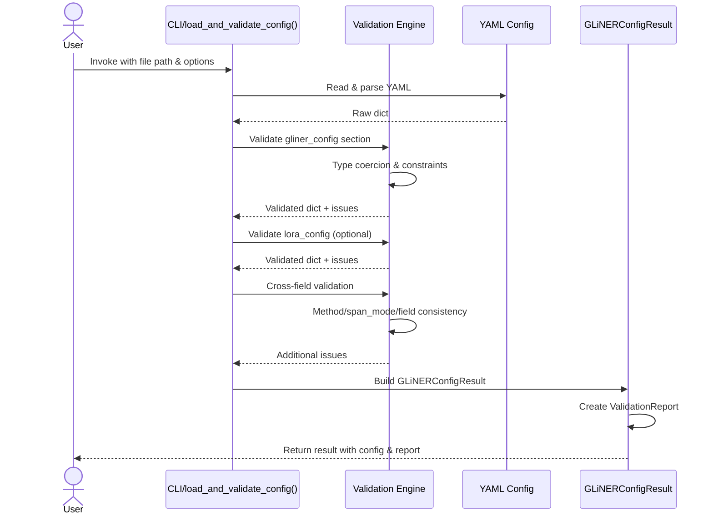
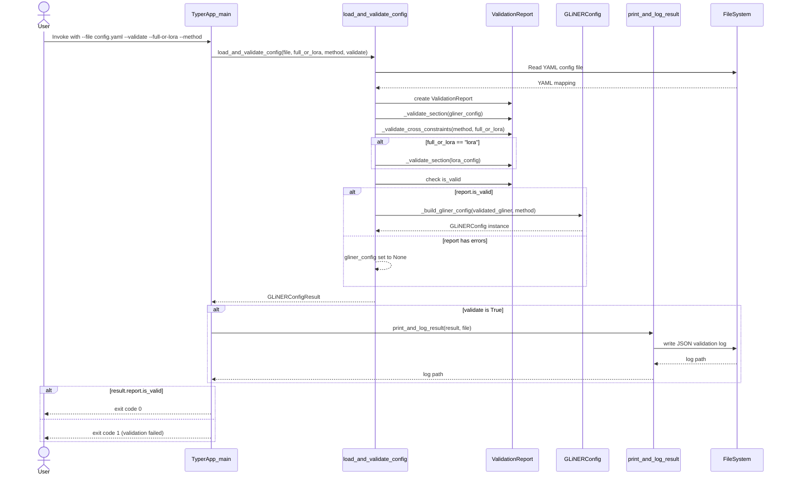
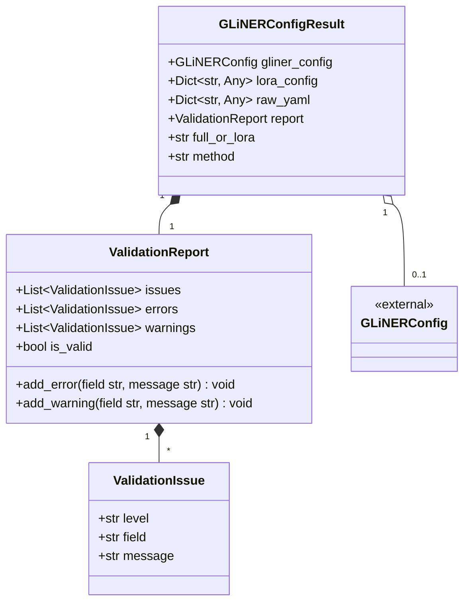

# PR Comments Export

> Exported from [https://github.com/arthrod/GLiNER/pull/4](https://github.com/arthrod/GLiNER/pull/4)  
> 17 of 17 comments selected  
> Generated by [Cicero](https://cicero.im) on 2/17/2026, 12:59:07 AM

---

### coderabbitai[bot] &mdash; 2/17/2026, 12:27:23 AM

> File: `ptbr/config_cli.py`

<details><summary>Code context</summary>

```diff
@@ -0,0 +1,741 @@
+"""GLiNER fine-tuning configuration validator and CLI.
+
+Usage as CLI (via Typer):
+    python -m ptbr.config_cli --file config.yaml --validate \\
+        --full-or-lora full --method span
+
+Usage as module:
+    from ptbr.config_cli import load_and_validate_config
+    result = load_and_validate_config("config.yaml", full_or_lora="full", method="span")
+    gliner_cfg = result.gliner_config   # ready for GLiNER.from_config(...)
+    lora_cfg   = result.lora_config     # dict or None
+"""
+
+from __future__ import annotations
+
+import json
+import logging
+import sys
+from dataclasses import dataclass, field
+from datetime import datetime
+from pathlib import Path
+from typing import Any, Dict, List, Literal, Optional, Tuple
+
+import yaml
+from rich.console import Console
+from rich.panel import Panel
+from rich.table import Table
+
+from gliner.config import (
+    GLiNERConfig,
+    BiEncoderSpanConfig,
+    BiEncoderTokenConfig,
+    UniEncoderSpanConfig,
+    UniEncoderTokenConfig,
+    UniEncoderSpanDecoderConfig,
+    UniEncoderTokenDecoderConfig,
+    UniEncoderSpanRelexConfig,
+    UniEncoderTokenRelexConfig,
+)
+
+logger = logging.getLogger(__name__)
+console = Console()
+
+# ============================================================================
+# Validation Rules
+# ============================================================================
+# Each rule is a tuple: (key, type, required, default, constraint)
+#   constraint is one of:
+#     - ("range", min, max)
+#     - ("literals", {set of allowed values})
+#     - None  (no extra constraint beyond type)
+# ============================================================================
+
+_GLINER_RULES: List[Tuple[str, type, bool, Any, Any]] = [
+    # 1.1 Backbone / Encoder
+    ("model_name",          str,   True,  None,          None),
+    ("name",                str,   False, "gliner",      None),
+    ("fine_tune",           bool,  False, True,          ("literals", {True, False})),
+    # 1.2 Architecture
+    ("span_mode",           str,   False, "markerV0",    ("literals", {
+        "markerV0", "markerV1", "marker", "query", "mlp", "cat",
+        "conv_conv", "conv_max", "conv_mean", "conv_sum", "conv_share",
+        "token_level",
+    })),
+    ("max_width",           int,   False, 12,            ("range", 1, 128)),
+    # 1.3 BiEncoder
+    ("labels_encoder",      str,   False, None,          None),
+    # 1.4 Decoder
+    ("labels_decoder",      str,   False, None,          None),
+    ("decoder_mode",        str,   False, "span",        ("literals", {"span", "prompt"})),
+    ("full_decoder_context", bool, False, True,          ("literals", {True, False})),
+    ("blank_entity_prob",   float, False, 0.1,           ("range", 0.0, 1.0)),
+    ("decoder_loss_coef",   float, False, 0.5,           ("range", 0.0, 10.0)),
+    # 1.5 Relex
+    ("relations_layer",     str,   False, None,          None),
+    ("triples_layer",       str,   False, None,          None),
+    ("embed_rel_token",     bool,  False, True,          ("literals", {True, False})),
+    ("rel_token_index",     int,   False, -1,            ("range", -1, 100000)),
+    ("rel_token",           str,   False, "<<REL>>",     None),
+    ("adjacency_loss_coef", float, False, 1.0,           ("range", 0.0, 10.0)),
+    ("relation_loss_coef",  float, False, 1.0,           ("range", 0.0, 10.0)),
+    # 1.6 Hidden dims
+    ("hidden_size",         int,   False, 512,           ("range", 64, 4096)),
+    ("dropout",             float, False, 0.4,           ("range", 0.0, 0.9)),
+    # 1.7 Subtoken
+    ("subtoken_pooling",    str,   False, "first",       ("literals", {"first", "mean", "max"})),
+    ("words_splitter_type", str,   False, "whitespace",  ("literals", {
+        "whitespace", "spacy", "stanza", "mecab", "jieba", "janome", "camel",
+    })),
+    # 1.8 Sequence limits
+    ("max_len",             int,   False, 384,           ("range", 32, 8192)),
+    ("max_types",           int,   False, 25,            ("range", 1, 1000)),
+    ("max_neg_type_ratio",  int,   False, 1,             ("range", 0, 100)),
+    # 1.9 Post-fusion & layers
+    ("post_fusion_schema",  str,   False, "",            None),
+    ("num_post_fusion_layers", int, False, 1,            ("range", 1, 12)),
+    ("fuse_layers",         bool,  False, False,         ("literals", {True, False})),
+    ("num_rnn_layers",      int,   False, 1,             ("range", 0, 4)),
+    # 1.10 Special tokens
+    ("embed_ent_token",     bool,  False, True,          ("literals", {True, False})),
+    ("class_token_index",   int,   False, -1,            ("range", -1, 100000)),
+    ("vocab_size",          int,   False, -1,            ("range", -1, 1000000)),
+    ("ent_token",           str,   False, "<<ENT>>",     None),
+    ("sep_token",           str,   False, "<<SEP>>",     None),
+    # 1.11 Loss coefficients
+    ("token_loss_coef",     float, False, 1.0,           ("range", 0.0, 10.0)),
+    ("span_loss_coef",      float, False, 1.0,           ("range", 0.0, 10.0)),
+    ("represent_spans",     bool,  False, False,         ("literals", {True, False})),
+    ("neg_spans_ratio",     float, False, 1.0,           ("range", 0.0, 10.0)),
+    # 1.12 Attention
+    ("_attn_implementation", str,  False, None,          ("literals", {None, "eager", "sdpa", "flash_attention_2"})),
+]
+
+_LORA_RULES: List[Tuple[str, type, bool, Any, Any]] = [
+    ("r",                  int,   False, 8,                ("range", 1, 256)),
+    ("lora_alpha",         int,   False, 16,               ("range", 1, 512)),
+    ("lora_dropout",       float, False, 0.1,              ("range", 0.0, 0.9)),
+    ("target_modules",     list,  False, ["query_proj", "value_proj"], None),
+    ("bias",               str,   False, "none",           ("literals", {"none", "all", "lora_only"})),
+    ("task_type",          str,   False, "FEATURE_EXTRACTION", ("literals", {
+        "FEATURE_EXTRACTION", "TOKEN_CLS", "SEQ_CLS", "CAUSAL_LM", "SEQ_2_SEQ_LM",
+    })),
+    ("modules_to_save",    list,  False, None,             None),
+    ("fan_in_fan_out",     bool,  False, False,            ("literals", {True, False})),
+    ("use_rslora",         bool,  False, False,            ("literals", {True, False})),
+    ("init_lora_weights",  bool,  False, True,             ("literals", {True, False})),
+]
+
+
+# Method -> config class mapping
+_METHOD_CONFIG_CLASS = {
+    ("span",      False, False): UniEncoderSpanConfig,
+    ("token",     False, False): UniEncoderTokenConfig,
+    ("biencoder", True,  False): BiEncoderSpanConfig,     # span variant
+    ("biencoder_token", True, False): BiEncoderTokenConfig,
+    ("decoder",   False, True):  UniEncoderSpanDecoderConfig,
+    ("decoder_token", False, True): UniEncoderTokenDecoderConfig,
+    ("relex",     False, False): UniEncoderSpanRelexConfig,
+    ("relex_token", False, False): UniEncoderTokenRelexConfig,
+}
+
+
+# ============================================================================
+# Validation Issue Tracking
+# ============================================================================
+
+@dataclass
+class ValidationIssue:
+    """A single validation finding."""
+    level: str          # "ERROR" or "WARNING"
+    field: str          # dotted path: "gliner_config.model_name"
+    message: str
+
+
+@dataclass
+class ValidationReport:
+    """Collection of all issues found during validation."""
+    issues: List[ValidationIssue] = field(default_factory=list)
+
+    @property
+    def errors(self) -> List[ValidationIssue]:
+        return [i for i in self.issues if i.level == "ERROR"]
+
+    @property
+    def warnings(self) -> List[ValidationIssue]:
+        return [i for i in self.issues if i.level == "WARNING"]
+
+    @property
+    def is_valid(self) -> bool:
+        return len(self.errors) == 0
+
+    def add_error(self, field: str, message: str) -> None:
+        self.issues.append(ValidationIssue("ERROR", field, message))
+
+    def add_warning(self, field: str, message: str) -> None:
+        self.issues.append(ValidationIssue("WARNING", field, message))
+
+
+# ============================================================================
+# Result Object
+# ============================================================================
+
+@dataclass
+class GLiNERConfigResult:
+    """Validated configuration result returned when used as a module.
+
+    Attributes:
+        gliner_config: A GLiNERConfig (or subclass) instance ready for the trainer.
+        lora_config: A dict of LoRA parameters (or None when full fine-tuning).
+        raw_yaml: The original parsed YAML dictionary.
+        report: The ValidationReport with all warnings/errors.
+        full_or_lora: Whether this is a "full" or "lora" configuration.
+        method: The resolved method string.
+    """
+    gliner_config: GLiNERConfig
+    lora_config: Optional[Dict[str, Any]]
+    raw_yaml: Dict[str, Any]
+    report: ValidationReport
+    full_or_lora: str
+    method: str
+
+
+# ============================================================================
+# Core Validation Logic
+# ============================================================================
+
+def _coerce_type(value: Any, expected_type: type) -> Any:
+    """Try to coerce a value to the expected type."""
+    if value is None:
+        return None
+    if expected_type is bool:
+        if isinstance(value, bool):
+            return value
+        if isinstance(value, str):
+            if value.lower() in ("true", "yes", "1"):
+                return True
+            if value.lower() in ("false", "no", "0"):
+                return False
+        raise TypeError(f"Cannot coerce {value!r} to bool")
+    if expected_type is int:
+        if isinstance(value, bool):
+            raise TypeError(f"Cannot coerce bool {value!r} to int")
+        return int(value)
+    if expected_type is float:
+        if isinstance(value, bool):
+            raise TypeError(f"Cannot coerce bool {value!r} to float")
+        return float(value)
+    if expected_type is str:
+        return str(value)
+    if expected_type is list:
+        if isinstance(value, list):
+            return value
+        raise TypeError(f"Expected list, got {type(value).__name__}")
+    return value
+
+
+def _validate_section(
+    section_data: Dict[str, Any],
+    rules: List[Tuple[str, type, bool, Any, Any]],
+    section_prefix: str,
+    report: ValidationReport,
+) -> Dict[str, Any]:
+    """Validate a section of the config against its rules.
+
+    Returns a cleaned dict with validated/defaulted values.
+    """
+    result: Dict[str, Any] = {}
+
+    for key, expected_type, required, default, constraint in rules:
+        field_path = f"{section_prefix}.{key}"
+        raw_value = section_data.get(key)
+
+        # --- Missing / None handling ---
+        if raw_value is None:
+            if required:
+                report.add_error(field_path, f"REQUIRED field is missing or null.")
+                continue
+            else:
+                if default is not None:
+                    report.add_warning(
+                        field_path,
+                        f"Not set; using default: {default!r}",
+                    )
+                result[key] = default
+                continue
```
</details>

_⚠️ Potential issue_ | _🟡 Minor_

**Remove extraneous f-prefix from string literal.**

Line 256 has an f-string without any placeholders.


<details>
<summary>Proposed fix</summary>

```diff
-                report.add_error(field_path, f"REQUIRED field is missing or null.")
+                report.add_error(field_path, "REQUIRED field is missing or null.")
```
</details>

<details>
<summary>🧰 Tools</summary>

<details>
<summary>🪛 Ruff (0.15.0)</summary>

[error] 256-256: f-string without any placeholders

Remove extraneous `f` prefix

(F541)

</details>

</details>

<details>
<summary>🤖 Prompt for AI Agents</summary>

```
Verify each finding against the current code and only fix it if needed.

In `@ptbr/config_cli.py` around lines 254 - 265, The string passed to
report.add_error uses an unnecessary f-prefix even though it contains no
placeholders; change the call to report.add_error(field_path, "REQUIRED field is
missing or null.") (remove the leading f) while leaving other f-strings (e.g.,
report.add_warning(..., f"Not set; using default: {default!r}")) intact so
placeholders continue to work.
```

</details>

<!-- fingerprinting:phantom:poseidon:ocelot -->

<!-- This is an auto-generated comment by CodeRabbit -->

---

### coderabbitai[bot] &mdash; 2/17/2026, 12:27:23 AM

> File: `ptbr/config_cli.py`

<details><summary>Code context</summary>

```diff
@@ -0,0 +1,741 @@
+"""GLiNER fine-tuning configuration validator and CLI.
+
+Usage as CLI (via Typer):
+    python -m ptbr.config_cli --file config.yaml --validate \\
+        --full-or-lora full --method span
+
+Usage as module:
+    from ptbr.config_cli import load_and_validate_config
+    result = load_and_validate_config("config.yaml", full_or_lora="full", method="span")
+    gliner_cfg = result.gliner_config   # ready for GLiNER.from_config(...)
+    lora_cfg   = result.lora_config     # dict or None
+"""
+
+from __future__ import annotations
+
+import json
+import logging
+import sys
+from dataclasses import dataclass, field
+from datetime import datetime
+from pathlib import Path
+from typing import Any, Dict, List, Literal, Optional, Tuple
+
+import yaml
+from rich.console import Console
+from rich.panel import Panel
+from rich.table import Table
+
+from gliner.config import (
+    GLiNERConfig,
+    BiEncoderSpanConfig,
+    BiEncoderTokenConfig,
+    UniEncoderSpanConfig,
+    UniEncoderTokenConfig,
+    UniEncoderSpanDecoderConfig,
+    UniEncoderTokenDecoderConfig,
+    UniEncoderSpanRelexConfig,
+    UniEncoderTokenRelexConfig,
+)
+
+logger = logging.getLogger(__name__)
+console = Console()
+
+# ============================================================================
+# Validation Rules
+# ============================================================================
+# Each rule is a tuple: (key, type, required, default, constraint)
+#   constraint is one of:
+#     - ("range", min, max)
+#     - ("literals", {set of allowed values})
+#     - None  (no extra constraint beyond type)
+# ============================================================================
+
+_GLINER_RULES: List[Tuple[str, type, bool, Any, Any]] = [
+    # 1.1 Backbone / Encoder
+    ("model_name",          str,   True,  None,          None),
+    ("name",                str,   False, "gliner",      None),
+    ("fine_tune",           bool,  False, True,          ("literals", {True, False})),
+    # 1.2 Architecture
+    ("span_mode",           str,   False, "markerV0",    ("literals", {
+        "markerV0", "markerV1", "marker", "query", "mlp", "cat",
+        "conv_conv", "conv_max", "conv_mean", "conv_sum", "conv_share",
+        "token_level",
+    })),
+    ("max_width",           int,   False, 12,            ("range", 1, 128)),
+    # 1.3 BiEncoder
+    ("labels_encoder",      str,   False, None,          None),
+    # 1.4 Decoder
+    ("labels_decoder",      str,   False, None,          None),
+    ("decoder_mode",        str,   False, "span",        ("literals", {"span", "prompt"})),
+    ("full_decoder_context", bool, False, True,          ("literals", {True, False})),
+    ("blank_entity_prob",   float, False, 0.1,           ("range", 0.0, 1.0)),
+    ("decoder_loss_coef",   float, False, 0.5,           ("range", 0.0, 10.0)),
+    # 1.5 Relex
+    ("relations_layer",     str,   False, None,          None),
+    ("triples_layer",       str,   False, None,          None),
+    ("embed_rel_token",     bool,  False, True,          ("literals", {True, False})),
+    ("rel_token_index",     int,   False, -1,            ("range", -1, 100000)),
+    ("rel_token",           str,   False, "<<REL>>",     None),
+    ("adjacency_loss_coef", float, False, 1.0,           ("range", 0.0, 10.0)),
+    ("relation_loss_coef",  float, False, 1.0,           ("range", 0.0, 10.0)),
+    # 1.6 Hidden dims
+    ("hidden_size",         int,   False, 512,           ("range", 64, 4096)),
+    ("dropout",             float, False, 0.4,           ("range", 0.0, 0.9)),
+    # 1.7 Subtoken
+    ("subtoken_pooling",    str,   False, "first",       ("literals", {"first", "mean", "max"})),
+    ("words_splitter_type", str,   False, "whitespace",  ("literals", {
+        "whitespace", "spacy", "stanza", "mecab", "jieba", "janome", "camel",
+    })),
+    # 1.8 Sequence limits
+    ("max_len",             int,   False, 384,           ("range", 32, 8192)),
+    ("max_types",           int,   False, 25,            ("range", 1, 1000)),
+    ("max_neg_type_ratio",  int,   False, 1,             ("range", 0, 100)),
+    # 1.9 Post-fusion & layers
+    ("post_fusion_schema",  str,   False, "",            None),
+    ("num_post_fusion_layers", int, False, 1,            ("range", 1, 12)),
+    ("fuse_layers",         bool,  False, False,         ("literals", {True, False})),
+    ("num_rnn_layers",      int,   False, 1,             ("range", 0, 4)),
+    # 1.10 Special tokens
+    ("embed_ent_token",     bool,  False, True,          ("literals", {True, False})),
+    ("class_token_index",   int,   False, -1,            ("range", -1, 100000)),
+    ("vocab_size",          int,   False, -1,            ("range", -1, 1000000)),
+    ("ent_token",           str,   False, "<<ENT>>",     None),
+    ("sep_token",           str,   False, "<<SEP>>",     None),
+    # 1.11 Loss coefficients
+    ("token_loss_coef",     float, False, 1.0,           ("range", 0.0, 10.0)),
+    ("span_loss_coef",      float, False, 1.0,           ("range", 0.0, 10.0)),
+    ("represent_spans",     bool,  False, False,         ("literals", {True, False})),
+    ("neg_spans_ratio",     float, False, 1.0,           ("range", 0.0, 10.0)),
+    # 1.12 Attention
+    ("_attn_implementation", str,  False, None,          ("literals", {None, "eager", "sdpa", "flash_attention_2"})),
+]
+
+_LORA_RULES: List[Tuple[str, type, bool, Any, Any]] = [
+    ("r",                  int,   False, 8,                ("range", 1, 256)),
+    ("lora_alpha",         int,   False, 16,               ("range", 1, 512)),
+    ("lora_dropout",       float, False, 0.1,              ("range", 0.0, 0.9)),
+    ("target_modules",     list,  False, ["query_proj", "value_proj"], None),
+    ("bias",               str,   False, "none",           ("literals", {"none", "all", "lora_only"})),
+    ("task_type",          str,   False, "FEATURE_EXTRACTION", ("literals", {
+        "FEATURE_EXTRACTION", "TOKEN_CLS", "SEQ_CLS", "CAUSAL_LM", "SEQ_2_SEQ_LM",
+    })),
+    ("modules_to_save",    list,  False, None,             None),
+    ("fan_in_fan_out",     bool,  False, False,            ("literals", {True, False})),
+    ("use_rslora",         bool,  False, False,            ("literals", {True, False})),
+    ("init_lora_weights",  bool,  False, True,             ("literals", {True, False})),
+]
+
+
+# Method -> config class mapping
+_METHOD_CONFIG_CLASS = {
+    ("span",      False, False): UniEncoderSpanConfig,
+    ("token",     False, False): UniEncoderTokenConfig,
+    ("biencoder", True,  False): BiEncoderSpanConfig,     # span variant
+    ("biencoder_token", True, False): BiEncoderTokenConfig,
+    ("decoder",   False, True):  UniEncoderSpanDecoderConfig,
+    ("decoder_token", False, True): UniEncoderTokenDecoderConfig,
+    ("relex",     False, False): UniEncoderSpanRelexConfig,
+    ("relex_token", False, False): UniEncoderTokenRelexConfig,
+}
+
+
+# ============================================================================
+# Validation Issue Tracking
+# ============================================================================
+
+@dataclass
+class ValidationIssue:
+    """A single validation finding."""
+    level: str          # "ERROR" or "WARNING"
+    field: str          # dotted path: "gliner_config.model_name"
+    message: str
+
+
+@dataclass
+class ValidationReport:
+    """Collection of all issues found during validation."""
+    issues: List[ValidationIssue] = field(default_factory=list)
+
+    @property
+    def errors(self) -> List[ValidationIssue]:
+        return [i for i in self.issues if i.level == "ERROR"]
+
+    @property
+    def warnings(self) -> List[ValidationIssue]:
+        return [i for i in self.issues if i.level == "WARNING"]
+
+    @property
+    def is_valid(self) -> bool:
+        return len(self.errors) == 0
+
+    def add_error(self, field: str, message: str) -> None:
+        self.issues.append(ValidationIssue("ERROR", field, message))
+
+    def add_warning(self, field: str, message: str) -> None:
+        self.issues.append(ValidationIssue("WARNING", field, message))
+
+
+# ============================================================================
+# Result Object
+# ============================================================================
+
+@dataclass
+class GLiNERConfigResult:
+    """Validated configuration result returned when used as a module.
+
+    Attributes:
+        gliner_config: A GLiNERConfig (or subclass) instance ready for the trainer.
+        lora_config: A dict of LoRA parameters (or None when full fine-tuning).
+        raw_yaml: The original parsed YAML dictionary.
+        report: The ValidationReport with all warnings/errors.
+        full_or_lora: Whether this is a "full" or "lora" configuration.
+        method: The resolved method string.
+    """
+    gliner_config: GLiNERConfig
+    lora_config: Optional[Dict[str, Any]]
+    raw_yaml: Dict[str, Any]
+    report: ValidationReport
+    full_or_lora: str
+    method: str
+
+
+# ============================================================================
+# Core Validation Logic
+# ============================================================================
+
+def _coerce_type(value: Any, expected_type: type) -> Any:
+    """Try to coerce a value to the expected type."""
+    if value is None:
+        return None
+    if expected_type is bool:
+        if isinstance(value, bool):
+            return value
+        if isinstance(value, str):
+            if value.lower() in ("true", "yes", "1"):
+                return True
+            if value.lower() in ("false", "no", "0"):
+                return False
+        raise TypeError(f"Cannot coerce {value!r} to bool")
+    if expected_type is int:
+        if isinstance(value, bool):
+            raise TypeError(f"Cannot coerce bool {value!r} to int")
+        return int(value)
+    if expected_type is float:
+        if isinstance(value, bool):
+            raise TypeError(f"Cannot coerce bool {value!r} to float")
+        return float(value)
+    if expected_type is str:
+        return str(value)
+    if expected_type is list:
+        if isinstance(value, list):
+            return value
+        raise TypeError(f"Expected list, got {type(value).__name__}")
+    return value
+
+
+def _validate_section(
+    section_data: Dict[str, Any],
+    rules: List[Tuple[str, type, bool, Any, Any]],
+    section_prefix: str,
+    report: ValidationReport,
+) -> Dict[str, Any]:
+    """Validate a section of the config against its rules.
+
+    Returns a cleaned dict with validated/defaulted values.
+    """
+    result: Dict[str, Any] = {}
+
+    for key, expected_type, required, default, constraint in rules:
+        field_path = f"{section_prefix}.{key}"
+        raw_value = section_data.get(key)
+
+        # --- Missing / None handling ---
+        if raw_value is None:
+            if required:
+                report.add_error(field_path, f"REQUIRED field is missing or null.")
+                continue
+            else:
+                if default is not None:
+                    report.add_warning(
+                        field_path,
+                        f"Not set; using default: {default!r}",
+                    )
+                result[key] = default
+                continue
+
+        # --- Type coercion ---
+        try:
+            value = _coerce_type(raw_value, expected_type)
+        except (TypeError, ValueError) as exc:
+            report.add_error(
+                field_path,
+                f"Type error: expected {expected_type.__name__}, got {type(raw_value).__name__} "
+                f"({raw_value!r}). {exc}",
+            )
+            continue
+
+        # --- Constraint checking ---
+        if constraint is not None:
+            kind = constraint[0]
+            if kind == "range":
+                _, lo, hi = constraint
+                if not (lo <= value <= hi):
+                    report.add_error(
+                        field_path,
+                        f"Value {value!r} outside allowed range [{lo}, {hi}].",
+                    )
+                    continue
+            elif kind == "literals":
+                allowed = constraint[1]
+                if value not in allowed:
+                    report.add_error(
+                        field_path,
+                        f"Value {value!r} not in allowed set: {sorted(str(v) for v in allowed)}.",
+                    )
+                    continue
+
+        result[key] = value
+
+    # --- Warn about unknown keys ---
+    known_keys = {r[0] for r in rules}
+    for key in section_data:
+        if key not in known_keys:
+            report.add_warning(
+                f"{section_prefix}.{key}",
+                f"Unknown field (will be ignored): {key!r}",
+            )
+
+    return result
+
+
+def _validate_cross_constraints(
+    gliner_data: Dict[str, Any],
+    method: str,
+    full_or_lora: str,
+    report: ValidationReport,
+) -> None:
+    """Check cross-field constraints that depend on method and mode."""
+
+    # --- Method-specific requirements ---
+    if method == "biencoder":
+        if not gliner_data.get("labels_encoder"):
+            report.add_error(
+                "gliner_config.labels_encoder",
+                "BiEncoder method requires labels_encoder to be set to a model name.",
+            )
+    elif method == "decoder":
+        if not gliner_data.get("labels_decoder"):
+            report.add_error(
+                "gliner_config.labels_decoder",
+                "Decoder method requires labels_decoder to be set to a model name.",
+            )
+    elif method == "relex":
+        if not gliner_data.get("relations_layer"):
+            report.add_error(
+                "gliner_config.relations_layer",
+                "Relex method requires relations_layer to be set.",
+            )
+
+    # --- span_mode vs method consistency ---
+    span_mode = gliner_data.get("span_mode", "markerV0")
+    if method == "token" and span_mode != "token_level":
+        report.add_warning(
+            "gliner_config.span_mode",
+            f"Method is 'token' but span_mode is {span_mode!r}; forcing to 'token_level'.",
+        )
+        gliner_data["span_mode"] = "token_level"
+    elif method in ("span", "biencoder", "decoder", "relex") and span_mode == "token_level":
+        report.add_warning(
+            "gliner_config.span_mode",
+            f"Method is {method!r} but span_mode is 'token_level'; this may be intentional "
+            f"for a token-level variant. If not, change span_mode.",
+        )
+
+    # --- decoder fields when no decoder ---
+    if method != "decoder":
+        for fld in ("decoder_mode", "full_decoder_context", "blank_entity_prob", "decoder_loss_coef"):
+            if gliner_data.get(fld) is not None and fld in ("decoder_mode",) and gliner_data.get("labels_decoder") is None:
+                pass  # defaults are fine
+
+    # --- relex fields when no relex ---
+    if method != "relex":
+        for fld in ("relations_layer", "triples_layer"):
+            if gliner_data.get(fld) is not None:
+                report.add_warning(
+                    f"gliner_config.{fld}",
+                    f"Field {fld!r} is set but method is not 'relex'; it will be ignored.",
+                )
+
+
+def _build_gliner_config(
+    gliner_data: Dict[str, Any],
+    method: str,
+) -> GLiNERConfig:
+    """Build the appropriate GLiNERConfig subclass from validated data."""
+    # Filter out keys not accepted by BaseGLiNERConfig or the subclass
+    # Use GLiNERConfig which auto-detects model_type
+    cfg_kwargs = {}
+    for key, value in gliner_data.items():
+        if value is not None or key in (
+            "labels_encoder", "labels_decoder", "relations_layer",
+            "triples_layer", "_attn_implementation", "post_fusion_schema",
+            "modules_to_save",
+        ):
+            cfg_kwargs[key] = value
+
+    # Remove relex-specific fields from non-relex builds to avoid __init__ errors
+    base_fields = {
+        "model_name", "name", "max_width", "hidden_size", "dropout", "fine_tune",
+        "subtoken_pooling", "span_mode", "post_fusion_schema", "num_post_fusion_layers",
+        "vocab_size", "max_neg_type_ratio", "max_types", "max_len",
+        "words_splitter_type", "num_rnn_layers", "fuse_layers", "embed_ent_token",
+        "class_token_index", "encoder_config", "ent_token", "sep_token",
+        "_attn_implementation", "token_loss_coef", "span_loss_coef",
+        "represent_spans", "neg_spans_ratio",
+    }
+
+    biencoder_fields = base_fields | {"labels_encoder", "labels_encoder_config"}
+
+    decoder_fields = base_fields | {
+        "labels_decoder", "decoder_mode", "full_decoder_context",
+        "blank_entity_prob", "labels_decoder_config", "decoder_loss_coef",
+    }
+
+    relex_fields = base_fields | {
+        "relations_layer", "triples_layer", "embed_rel_token",
+        "rel_token_index", "rel_token", "adjacency_loss_coef", "relation_loss_coef",
+    }
+
+    # Legacy GLiNERConfig accepts a broad set
+    gliner_legacy_fields = base_fields | {
+        "labels_encoder", "labels_decoder", "relations_layer",
+    }
+
+    # Use the legacy GLiNERConfig which auto-detects the right model_type
+    filtered = {k: v for k, v in cfg_kwargs.items() if k in gliner_legacy_fields}
+    return GLiNERConfig(**filtered)
+
+
+# ============================================================================
+# Public API: load_and_validate_config
+# ============================================================================
+
+def load_and_validate_config(
+    file: str | Path,
+    full_or_lora: Literal["full", "lora"] = "full",
+    method: Literal["biencoder", "decoder", "relex", "span", "token"] = "span",
+    validate: bool = True,
+) -> GLiNERConfigResult:
+    """Load a YAML config file, validate every field, and return a config object.
+
+    Args:
+        file: Path to the YAML configuration file.
+        full_or_lora: Whether to do full fine-tuning or LoRA.
+        method: Architecture method to use.
+        validate: Whether to perform validation (always True in practice).
+
+    Returns:
+        GLiNERConfigResult with the validated config, lora dict, and report.
+
+    Raises:
+        SystemExit: When used as CLI and validation fails.
+        ValueError: When used as module and validation fails.
+    """
+    file = Path(file)
+    if not file.exists():
+        raise FileNotFoundError(f"Config file not found: {file}")
+
+    with open(file) as f:
+        raw = yaml.safe_load(f)
+
+    if not isinstance(raw, dict):
+        raise ValueError(f"Config file must contain a YAML mapping, got {type(raw).__name__}")
+
+    report = ValidationReport()
+
+    # --- Validate gliner_config section ---
+    gliner_section = raw.get("gliner_config", {})
+    if not gliner_section:
+        report.add_error("gliner_config", "Missing 'gliner_config' section in YAML file.")
+        gliner_section = {}
+
+    validated_gliner = _validate_section(
+        gliner_section, _GLINER_RULES, "gliner_config", report,
+    )
+
+    # --- Cross-field validation ---
+    _validate_cross_constraints(validated_gliner, method, full_or_lora, report)
+
+    # --- Validate lora_config section (only for lora mode) ---
+    validated_lora: Optional[Dict[str, Any]] = None
+    if full_or_lora == "lora":
+        lora_section = raw.get("lora_config", {})
+        if not lora_section:
+            report.add_warning("lora_config", "LoRA mode selected but 'lora_config' section is missing; using all defaults.")
+            lora_section = {}
+        validated_lora = _validate_section(
+            lora_section, _LORA_RULES, "lora_config", report,
+        )
+
+    # --- Build GLiNERConfig object ---
+    gliner_config = None
+    if report.is_valid:
+        gliner_config = _build_gliner_config(validated_gliner, method)
+
+    result = GLiNERConfigResult(
+        gliner_config=gliner_config,
+        lora_config=validated_lora,
+        raw_yaml=raw,
+        report=report,
+        full_or_lora=full_or_lora,
+        method=method,
+    )
+
+    return result
+
+
+# ============================================================================
+# Rich Output: Summary Printing
+# ============================================================================
+
+def _make_gliner_table(validated: Dict[str, Any], report: ValidationReport) -> Table:
+    """Build a rich table showing each gliner_config field and its status."""
+    table = Table(title="GLiNER Configuration", show_lines=True)
+    table.add_column("Field", style="cyan", min_width=25)
+    table.add_column("Value", style="white", min_width=30)
+    table.add_column("Status", style="white", min_width=20)
+
+    warning_fields = {i.field.split(".")[-1] for i in report.warnings}
+    error_fields = {i.field.split(".")[-1] for i in report.errors}
+
+    for key, _type, required, default, _constraint in _GLINER_RULES:
+        value = validated.get(key, "[missing]")
+        if key in error_fields:
+            status = "[bold red]ERROR[/]"
+        elif key in warning_fields:
+            status = "[yellow]DEFAULT[/]"
+        elif required:
+            status = "[green]SET (required)[/]"
+        else:
+            status = "[green]SET[/]"
+        table.add_row(key, repr(value), status)
+
+    return table
+
+
+def _make_lora_table(validated: Dict[str, Any], report: ValidationReport) -> Table:
+    """Build a rich table showing each lora_config field and its status."""
+    table = Table(title="LoRA Configuration", show_lines=True)
+    table.add_column("Field", style="cyan", min_width=25)
+    table.add_column("Value", style="white", min_width=30)
+    table.add_column("Status", style="white", min_width=20)
+
+    warning_fields = {i.field.split(".")[-1] for i in report.warnings}
+    error_fields = {i.field.split(".")[-1] for i in report.errors}
+
+    for key, _type, required, default, _constraint in _LORA_RULES:
+        value = validated.get(key, "[missing]")
+        if key in error_fields:
+            status = "[bold red]ERROR[/]"
+        elif key in warning_fields:
+            status = "[yellow]DEFAULT[/]"
+        else:
+            status = "[green]SET[/]"
+        table.add_row(key, repr(value), status)
+
+    return table
+
+
+def _print_issues(report: ValidationReport) -> None:
+    """Print errors and warnings using rich."""
+    if report.errors:
+        console.print(Panel("[bold red]VALIDATION ERRORS[/]", style="red"))
+        for issue in report.errors:
+            console.print(f"  [bold red]ERROR[/]  {issue.field}: {issue.message}")
+        console.print()
+
+    if report.warnings:
+        console.print(Panel("[bold yellow]WARNINGS (defaults applied)[/]", style="yellow"))
+        for issue in report.warnings:
+            console.print(f"  [yellow]WARN[/]   {issue.field}: {issue.message}")
+        console.print()
+
+
+def _save_validation_log(
+    result: GLiNERConfigResult,
+    log_path: Path,
+) -> None:
+    """Save a structured JSON log of the validation run."""
+    log_data = {
+        "timestamp": datetime.now().isoformat(),
+        "file": str(result.raw_yaml.get("_source_file", "unknown")),
+        "full_or_lora": result.full_or_lora,
+        "method": result.method,
+        "valid": result.report.is_valid,
+        "error_count": len(result.report.errors),
+        "warning_count": len(result.report.warnings),
+        "issues": [
+            {"level": i.level, "field": i.field, "message": i.message}
+            for i in result.report.issues
+        ],
+    }
+    # Add resolved config if valid
+    if result.gliner_config is not None:
+        log_data["resolved_gliner_config"] = result.gliner_config.to_dict()
+    if result.lora_config is not None:
+        log_data["resolved_lora_config"] = result.lora_config
+
+    log_path.parent.mkdir(parents=True, exist_ok=True)
+    with open(log_path, "w") as f:
+        json.dump(log_data, f, indent=2, default=str)
+
+
+def print_and_log_result(
+    result: GLiNERConfigResult,
+    file_path: Path,
+    log_dir: Optional[Path] = None,
+) -> Path:
+    """Print the rich summary to the terminal and save a log file.
+
+    Args:
+        result: The validated config result.
+        file_path: The original config file path (for display).
+        log_dir: Directory for the log file. Defaults to file_path.parent.
+
+    Returns:
+        Path to the saved log file.
+    """
+    console.print()
+    console.print(Panel(
+        f"[bold]Config Validation Report[/]\n"
+        f"File: {file_path}\n"
+        f"Mode: [cyan]{result.full_or_lora}[/]  |  Method: [cyan]{result.method}[/]",
+        title="GLiNER ptbr Config",
+        style="blue",
+    ))
+    console.print()
+
+    # Re-validate to get section data for tables
+    raw = result.raw_yaml
+    gliner_section = raw.get("gliner_config", {})
+    validated_gliner = {}
+    for key, _type, _req, _def, _con in _GLINER_RULES:
+        val = gliner_section.get(key)
+        if val is None:
+            val = _def
+        validated_gliner[key] = val
+
+    console.print(_make_gliner_table(validated_gliner, result.report))
+    console.print()
+
+    if result.full_or_lora == "lora" and result.lora_config is not None:
+        console.print(_make_lora_table(result.lora_config, result.report))
+        console.print()
+
+    _print_issues(result.report)
+
+    if result.report.is_valid:
+        console.print("[bold green]Validation PASSED[/]")
+    else:
+        console.print("[bold red]Validation FAILED[/]")
+
+    # Save log
+    if log_dir is None:
+        log_dir = file_path.parent
+    timestamp = datetime.now().strftime("%Y%m%d_%H%M%S")
+    log_path = log_dir / f"config_validation_{timestamp}.json"
+    result.raw_yaml["_source_file"] = str(file_path)
+    _save_validation_log(result, log_path)
```
</details>

_⚠️ Potential issue_ | _🟡 Minor_

**Mutation of `raw_yaml` as side effect.**

This line mutates the `result.raw_yaml` dictionary. This side effect is unexpected in a function primarily for printing/logging and could cause issues if the result object is reused. Consider making a copy or passing the source file path separately.


<details>
<summary>Proposed fix</summary>

```diff
-    result.raw_yaml["_source_file"] = str(file_path)
-    _save_validation_log(result, log_path)
+    # Create a copy to avoid mutating the original
+    raw_with_source = {**result.raw_yaml, "_source_file": str(file_path)}
+    # Pass file_path to _save_validation_log separately or adjust the function
+    _save_validation_log(result, log_path, source_file=str(file_path))
```

Or pass file_path directly to `_save_validation_log` instead of embedding it in raw_yaml.
</details>

<details>
<summary>🤖 Prompt for AI Agents</summary>

```
Verify each finding against the current code and only fix it if needed.

In `@ptbr/config_cli.py` around lines 648 - 649, The code mutates result.raw_yaml
by setting "_source_file" before calling _save_validation_log, causing an
unexpected side-effect; instead avoid changing result.raw_yaml in place — either
create a shallow copy of raw_yaml (e.g., copy = dict(result.raw_yaml) and add
"_source_file" to that) and pass the copy to _save_validation_log, or modify the
call to _save_validation_log to accept file_path as a separate parameter and
pass file_path directly without touching result.raw_yaml; update references to
result.raw_yaml and the _save_validation_log call accordingly.
```

</details>

<!-- fingerprinting:phantom:poseidon:ocelot -->

<!-- This is an auto-generated comment by CodeRabbit -->

---

### coderabbitai[bot] &mdash; 2/17/2026, 12:27:23 AM

> File: `ptbr/tests/test_config_cli.py`

<details><summary>Code context</summary>

```diff
@@ -0,0 +1,727 @@
+"""Tests for ptbr.config_cli: YAML validation, CLI, and module API."""
+
+from __future__ import annotations
+
+import json
+import textwrap
+from pathlib import Path
+
+import pytest
+import yaml
+
+from ptbr.config_cli import (
+    GLiNERConfigResult,
+    ValidationReport,
+    _coerce_type,
+    _validate_section,
+    _validate_cross_constraints,
+    _GLINER_RULES,
+    _LORA_RULES,
+    load_and_validate_config,
+    print_and_log_result,
+)
+from gliner.config import GLiNERConfig
+
+
+# ============================================================================
+# Helpers
+# ============================================================================
+
+def _write_yaml(tmp_path: Path, data: dict, filename: str = "cfg.yaml") -> Path:
+    """Write a dict as YAML and return the path."""
+    p = tmp_path / filename
+    with open(p, "w") as f:
+        yaml.dump(data, f)
+    return p
+
+
+def _minimal_gliner_config() -> dict:
+    """Return the minimal valid gliner_config section."""
+    return {
+        "model_name": "microsoft/deberta-v3-small",
+    }
+
+
+def _full_gliner_config() -> dict:
+    """Return a fully-specified gliner_config section (no defaults needed)."""
+    return {
+        "model_name": "microsoft/deberta-v3-small",
+        "name": "test-model",
+        "fine_tune": True,
+        "span_mode": "markerV0",
+        "max_width": 12,
+        "labels_encoder": None,
+        "labels_decoder": None,
+        "decoder_mode": "span",
+        "full_decoder_context": True,
+        "blank_entity_prob": 0.1,
+        "decoder_loss_coef": 0.5,
+        "relations_layer": None,
+        "triples_layer": None,
+        "embed_rel_token": True,
+        "rel_token_index": -1,
+        "rel_token": "<<REL>>",
+        "adjacency_loss_coef": 1.0,
+        "relation_loss_coef": 1.0,
+        "hidden_size": 512,
+        "dropout": 0.4,
+        "subtoken_pooling": "first",
+        "words_splitter_type": "whitespace",
+        "max_len": 384,
+        "max_types": 25,
+        "max_neg_type_ratio": 1,
+        "post_fusion_schema": "",
+        "num_post_fusion_layers": 1,
+        "fuse_layers": False,
+        "num_rnn_layers": 1,
+        "embed_ent_token": True,
+        "class_token_index": -1,
+        "vocab_size": -1,
+        "ent_token": "<<ENT>>",
+        "sep_token": "<<SEP>>",
+        "token_loss_coef": 1.0,
+        "span_loss_coef": 1.0,
+        "represent_spans": False,
+        "neg_spans_ratio": 1.0,
+        "_attn_implementation": None,
+    }
+
+
+def _full_lora_config() -> dict:
+    """Return a fully-specified lora_config section."""
+    return {
+        "r": 16,
+        "lora_alpha": 32,
+        "lora_dropout": 0.05,
+        "target_modules": ["query_proj", "value_proj"],
+        "bias": "none",
+        "task_type": "FEATURE_EXTRACTION",
+        "modules_to_save": None,
+        "fan_in_fan_out": False,
+        "use_rslora": False,
+        "init_lora_weights": True,
+    }
+
+
+# ============================================================================
+# Unit tests: _coerce_type
+# ============================================================================
+
+class TestCoerceType:
+    def test_none_passthrough(self):
+        assert _coerce_type(None, str) is None
+
+    def test_bool_from_bool(self):
+        assert _coerce_type(True, bool) is True
+        assert _coerce_type(False, bool) is False
+
+    def test_bool_from_string(self):
+        assert _coerce_type("true", bool) is True
+        assert _coerce_type("yes", bool) is True
+        assert _coerce_type("false", bool) is False
+
+    def test_bool_invalid(self):
+        with pytest.raises(TypeError):
+            _coerce_type("maybe", bool)
+
+    def test_int_from_int(self):
+        assert _coerce_type(42, int) == 42
+
+    def test_int_from_float(self):
+        assert _coerce_type(3.0, int) == 3
+
+    def test_int_rejects_bool(self):
+        with pytest.raises(TypeError):
+            _coerce_type(True, int)
+
+    def test_float_from_int(self):
+        assert _coerce_type(3, float) == 3.0
+
+    def test_float_rejects_bool(self):
+        with pytest.raises(TypeError):
+            _coerce_type(False, float)
+
+    def test_str_from_anything(self):
+        assert _coerce_type(123, str) == "123"
+
+    def test_list_from_list(self):
+        assert _coerce_type([1, 2], list) == [1, 2]
+
+    def test_list_rejects_nonlist(self):
+        with pytest.raises(TypeError):
+            _coerce_type("not a list", list)
+
+
+# ============================================================================
+# Unit tests: _validate_section
+# ============================================================================
+
+class TestValidateSection:
+    def test_required_field_missing_errors(self):
+        report = ValidationReport()
+        result = _validate_section({}, _GLINER_RULES, "gliner_config", report)
+        # model_name is REQUIRED
+        errors = [i for i in report.errors if "model_name" in i.field]
+        assert len(errors) == 1
+        assert "REQUIRED" in errors[0].message
+
+    def test_default_fields_produce_warnings(self):
+        report = ValidationReport()
+        data = {"model_name": "some-model"}
+        result = _validate_section(data, _GLINER_RULES, "gliner_config", report)
+        # Many fields should get defaults → warnings
+        warning_fields = {i.field.split(".")[-1] for i in report.warnings}
+        assert "name" in warning_fields
+        assert "hidden_size" in warning_fields
+        assert "dropout" in warning_fields
+        assert report.is_valid  # no errors
+
+    def test_fully_specified_no_warnings(self):
+        report = ValidationReport()
+        data = _full_gliner_config()
+        result = _validate_section(data, _GLINER_RULES, "gliner_config", report)
+        # Only _attn_implementation should produce a warning since it's None and default is None
+        # (None default → no warning)
+        non_attn_warnings = [w for w in report.warnings if "_attn_implementation" not in w.field]
+        assert len(non_attn_warnings) == 0
+        assert report.is_valid
+
+    def test_range_violation(self):
+        report = ValidationReport()
+        data = {"model_name": "x", "dropout": 1.5}  # max is 0.9
+        _validate_section(data, _GLINER_RULES, "gliner_config", report)
+        errors = [i for i in report.errors if "dropout" in i.field]
+        assert len(errors) == 1
+        assert "range" in errors[0].message.lower() or "outside" in errors[0].message.lower()
+
+    def test_literal_violation(self):
+        report = ValidationReport()
+        data = {"model_name": "x", "span_mode": "invalid_mode"}
+        _validate_section(data, _GLINER_RULES, "gliner_config", report)
+        errors = [i for i in report.errors if "span_mode" in i.field]
+        assert len(errors) == 1
+
+    def test_type_error(self):
+        report = ValidationReport()
+        data = {"model_name": "x", "max_width": "not_an_int"}
+        _validate_section(data, _GLINER_RULES, "gliner_config", report)
+        errors = [i for i in report.errors if "max_width" in i.field]
+        assert len(errors) == 1
+
+    def test_unknown_keys_warned(self):
+        report = ValidationReport()
+        data = {"model_name": "x", "totally_made_up_field": 42}
+        _validate_section(data, _GLINER_RULES, "gliner_config", report)
+        warnings = [i for i in report.warnings if "totally_made_up_field" in i.field]
+        assert len(warnings) == 1
+        assert "Unknown" in warnings[0].message
+
+    def test_lora_section_defaults(self):
+        report = ValidationReport()
+        result = _validate_section({}, _LORA_RULES, "lora_config", report)
+        assert report.is_valid
+        assert result["r"] == 8
+        assert result["lora_alpha"] == 16
+        assert result["lora_dropout"] == 0.1
+
+    def test_lora_section_fully_specified(self):
+        report = ValidationReport()
+        data = _full_lora_config()
+        result = _validate_section(data, _LORA_RULES, "lora_config", report)
+        assert report.is_valid
+        assert result["r"] == 16
+        assert result["lora_alpha"] == 32
+
+    def test_lora_range_violation(self):
+        report = ValidationReport()
+        data = {"r": 999}  # max 256
+        _validate_section(data, _LORA_RULES, "lora_config", report)
+        errors = [i for i in report.errors if "r" in i.field]
+        assert len(errors) == 1
+
+
+# ============================================================================
+# Unit tests: _validate_cross_constraints
+# ============================================================================
+
+class TestCrossConstraints:
+    def test_biencoder_requires_labels_encoder(self):
+        report = ValidationReport()
+        data = {"labels_encoder": None, "span_mode": "markerV0"}
+        _validate_cross_constraints(data, method="biencoder", full_or_lora="full", report=report)
+        errors = [i for i in report.errors if "labels_encoder" in i.field]
+        assert len(errors) == 1
+
+    def test_biencoder_with_labels_encoder_ok(self):
+        report = ValidationReport()
+        data = {"labels_encoder": "some-model", "span_mode": "markerV0"}
+        _validate_cross_constraints(data, method="biencoder", full_or_lora="full", report=report)
+        assert report.is_valid
+
+    def test_decoder_requires_labels_decoder(self):
+        report = ValidationReport()
+        data = {"labels_decoder": None, "span_mode": "markerV0"}
+        _validate_cross_constraints(data, method="decoder", full_or_lora="full", report=report)
+        errors = [i for i in report.errors if "labels_decoder" in i.field]
+        assert len(errors) == 1
+
+    def test_decoder_with_labels_decoder_ok(self):
+        report = ValidationReport()
+        data = {"labels_decoder": "gpt2", "span_mode": "markerV0"}
+        _validate_cross_constraints(data, method="decoder", full_or_lora="full", report=report)
+        assert report.is_valid
+
+    def test_relex_requires_relations_layer(self):
+        report = ValidationReport()
+        data = {"relations_layer": None, "span_mode": "markerV0"}
+        _validate_cross_constraints(data, method="relex", full_or_lora="full", report=report)
+        errors = [i for i in report.errors if "relations_layer" in i.field]
+        assert len(errors) == 1
+
+    def test_token_method_forces_span_mode(self):
+        report = ValidationReport()
+        data = {"span_mode": "markerV0"}
+        _validate_cross_constraints(data, method="token", full_or_lora="full", report=report)
+        assert data["span_mode"] == "token_level"
+        assert len(report.warnings) > 0
+
+    def test_span_method_with_token_level_warns(self):
+        report = ValidationReport()
+        data = {"span_mode": "token_level"}
+        _validate_cross_constraints(data, method="span", full_or_lora="full", report=report)
+        warnings = [i for i in report.warnings if "span_mode" in i.field]
+        assert len(warnings) == 1
+
+    def test_relex_fields_warn_when_not_relex(self):
+        report = ValidationReport()
+        data = {"relations_layer": "some_layer", "span_mode": "markerV0"}
+        _validate_cross_constraints(data, method="span", full_or_lora="full", report=report)
+        warnings = [i for i in report.warnings if "relations_layer" in i.field]
+        assert len(warnings) == 1
+
+
+# ============================================================================
+# Integration tests: load_and_validate_config
+# ============================================================================
+
+class TestLoadAndValidateConfig:
+    def test_minimal_config_loads(self, tmp_path):
+        data = {"gliner_config": _minimal_gliner_config()}
+        cfg_path = _write_yaml(tmp_path, data)
+        result = load_and_validate_config(cfg_path, full_or_lora="full", method="span")
+        assert result.report.is_valid
+        assert result.gliner_config is not None
+        assert isinstance(result.gliner_config, GLiNERConfig)
+        assert result.lora_config is None
+
+    def test_full_config_no_warnings(self, tmp_path):
+        data = {"gliner_config": _full_gliner_config()}
+        cfg_path = _write_yaml(tmp_path, data)
+        result = load_and_validate_config(cfg_path, full_or_lora="full", method="span")
+        assert result.report.is_valid
+        # Only warnings should be for fields with None default that stay None
+        real_warnings = [w for w in result.report.warnings
+                         if "Not set; using default" in w.message]
+        assert len(real_warnings) == 0
+
+    def test_full_config_with_lora(self, tmp_path):
+        data = {
+            "gliner_config": _minimal_gliner_config(),
+            "lora_config": _full_lora_config(),
+        }
+        cfg_path = _write_yaml(tmp_path, data)
+        result = load_and_validate_config(cfg_path, full_or_lora="lora", method="span")
+        assert result.report.is_valid
+        assert result.lora_config is not None
+        assert result.lora_config["r"] == 16
+
+    def test_lora_mode_without_section_uses_defaults(self, tmp_path):
+        data = {"gliner_config": _minimal_gliner_config()}
+        cfg_path = _write_yaml(tmp_path, data)
+        result = load_and_validate_config(cfg_path, full_or_lora="lora", method="span")
+        assert result.report.is_valid
+        assert result.lora_config is not None
+        assert result.lora_config["r"] == 8  # default
+
+    def test_missing_required_field_fails(self, tmp_path):
+        data = {"gliner_config": {"name": "test"}}  # missing model_name
+        cfg_path = _write_yaml(tmp_path, data)
+        result = load_and_validate_config(cfg_path, full_or_lora="full", method="span")
+        assert not result.report.is_valid
+        assert result.gliner_config is None
+
+    def test_range_error_fails(self, tmp_path):
+        cfg = _minimal_gliner_config()
+        cfg["dropout"] = 5.0  # out of range
+        data = {"gliner_config": cfg}
+        cfg_path = _write_yaml(tmp_path, data)
+        result = load_and_validate_config(cfg_path, full_or_lora="full", method="span")
+        assert not result.report.is_valid
+
+    def test_biencoder_method_validates(self, tmp_path):
+        cfg = _minimal_gliner_config()
+        cfg["labels_encoder"] = "microsoft/deberta-v3-small"
+        data = {"gliner_config": cfg}
+        cfg_path = _write_yaml(tmp_path, data)
+        result = load_and_validate_config(cfg_path, full_or_lora="full", method="biencoder")
+        assert result.report.is_valid
+
+    def test_biencoder_without_encoder_errors(self, tmp_path):
+        data = {"gliner_config": _minimal_gliner_config()}
+        cfg_path = _write_yaml(tmp_path, data)
+        result = load_and_validate_config(cfg_path, full_or_lora="full", method="biencoder")
+        assert not result.report.is_valid
+        error_fields = [e.field for e in result.report.errors]
+        assert any("labels_encoder" in f for f in error_fields)
+
+    def test_decoder_method_validates(self, tmp_path):
+        cfg = _minimal_gliner_config()
+        cfg["labels_decoder"] = "openai-community/gpt2"
+        data = {"gliner_config": cfg}
+        cfg_path = _write_yaml(tmp_path, data)
+        result = load_and_validate_config(cfg_path, full_or_lora="full", method="decoder")
+        assert result.report.is_valid
+
+    def test_decoder_without_decoder_errors(self, tmp_path):
+        data = {"gliner_config": _minimal_gliner_config()}
+        cfg_path = _write_yaml(tmp_path, data)
+        result = load_and_validate_config(cfg_path, full_or_lora="full", method="decoder")
+        assert not result.report.is_valid
+
+    def test_token_method_forces_span_mode(self, tmp_path):
+        cfg = _minimal_gliner_config()
+        cfg["span_mode"] = "markerV0"
+        data = {"gliner_config": cfg}
+        cfg_path = _write_yaml(tmp_path, data)
+        result = load_and_validate_config(cfg_path, full_or_lora="full", method="token")
+        assert result.report.is_valid
+        # The config should have had span_mode forced to token_level
+        warnings = [w for w in result.report.warnings if "span_mode" in w.field and "forcing" in w.message]
+        assert len(warnings) == 1
+
+    def test_relex_without_relations_layer_errors(self, tmp_path):
+        data = {"gliner_config": _minimal_gliner_config()}
+        cfg_path = _write_yaml(tmp_path, data)
+        result = load_and_validate_config(cfg_path, full_or_lora="full", method="relex")
+        assert not result.report.is_valid
+
+    def test_file_not_found_raises(self, tmp_path):
+        with pytest.raises(FileNotFoundError):
+            load_and_validate_config(tmp_path / "nonexistent.yaml")
+
+    def test_invalid_yaml_content(self, tmp_path):
+        p = tmp_path / "bad.yaml"
+        p.write_text("just a string")
+        with pytest.raises(ValueError, match="YAML mapping"):
+            load_and_validate_config(p)
+
+    def test_missing_gliner_config_section(self, tmp_path):
+        data = {"some_other_key": 42}
+        cfg_path = _write_yaml(tmp_path, data)
+        result = load_and_validate_config(cfg_path, full_or_lora="full", method="span")
+        assert not result.report.is_valid
+
+    def test_gliner_config_model_type(self, tmp_path):
+        """Verify the returned GLiNERConfig has the correct model_type property."""
+        cfg = _minimal_gliner_config()
+        data = {"gliner_config": cfg}
+        cfg_path = _write_yaml(tmp_path, data)
+        result = load_and_validate_config(cfg_path, full_or_lora="full", method="span")
+        assert result.report.is_valid
+        # span mode with no labels_encoder/decoder/relations → uni_encoder_span
+        assert result.gliner_config.model_type == "gliner_uni_encoder_span"
+
+    def test_config_result_has_raw_yaml(self, tmp_path):
+        data = {"gliner_config": _minimal_gliner_config()}
+        cfg_path = _write_yaml(tmp_path, data)
+        result = load_and_validate_config(cfg_path, full_or_lora="full", method="span")
+        assert "gliner_config" in result.raw_yaml
+
+    def test_config_result_attributes(self, tmp_path):
+        data = {"gliner_config": _minimal_gliner_config()}
+        cfg_path = _write_yaml(tmp_path, data)
+        result = load_and_validate_config(cfg_path, full_or_lora="full", method="span")
+        assert result.full_or_lora == "full"
+        assert result.method == "span"
+
+
+# ============================================================================
+# Tests: print_and_log_result (log file output)
+# ============================================================================
+
+class TestPrintAndLogResult:
+    def test_log_file_created(self, tmp_path):
+        data = {"gliner_config": _minimal_gliner_config()}
+        cfg_path = _write_yaml(tmp_path, data)
+        result = load_and_validate_config(cfg_path, full_or_lora="full", method="span")
+        log_path = print_and_log_result(result, cfg_path, log_dir=tmp_path)
+        assert log_path.exists()
+        log_data = json.loads(log_path.read_text())
+        assert log_data["valid"] is True
+        assert "resolved_gliner_config" in log_data
+
+    def test_log_file_records_errors(self, tmp_path):
+        data = {"gliner_config": {"name": "bad"}}  # missing model_name
+        cfg_path = _write_yaml(tmp_path, data)
+        result = load_and_validate_config(cfg_path, full_or_lora="full", method="span")
+        log_path = print_and_log_result(result, cfg_path, log_dir=tmp_path)
+        log_data = json.loads(log_path.read_text())
+        assert log_data["valid"] is False
+        assert log_data["error_count"] > 0
+
+    def test_log_file_records_lora(self, tmp_path):
+        data = {
+            "gliner_config": _minimal_gliner_config(),
+            "lora_config": _full_lora_config(),
+        }
+        cfg_path = _write_yaml(tmp_path, data)
+        result = load_and_validate_config(cfg_path, full_or_lora="lora", method="span")
+        log_path = print_and_log_result(result, cfg_path, log_dir=tmp_path)
+        log_data = json.loads(log_path.read_text())
+        assert "resolved_lora_config" in log_data
+        assert log_data["resolved_lora_config"]["r"] == 16
+
+
+# ============================================================================
+# Tests: ValidationReport
+# ============================================================================
+
+class TestValidationReport:
+    def test_empty_report_is_valid(self):
+        r = ValidationReport()
+        assert r.is_valid
+        assert len(r.errors) == 0
+        assert len(r.warnings) == 0
+
+    def test_warning_does_not_invalidate(self):
+        r = ValidationReport()
+        r.add_warning("f", "msg")
+        assert r.is_valid
+
+    def test_error_invalidates(self):
+        r = ValidationReport()
+        r.add_error("f", "msg")
+        assert not r.is_valid
+
+    def test_mixed_issues(self):
+        r = ValidationReport()
+        r.add_warning("f1", "warn")
+        r.add_error("f2", "err")
+        assert not r.is_valid
+        assert len(r.warnings) == 1
+        assert len(r.errors) == 1
+
+
+# ============================================================================
+# Tests: Template YAML is itself valid
+# ============================================================================
+
+class TestTemplateYaml:
+    """Ensure the shipped template.yaml is valid when loaded."""
+
+    @pytest.fixture
+    def template_path(self) -> Path:
+        return Path(__file__).parent.parent / "template.yaml"
+
+    def test_template_exists(self, template_path):
+        assert template_path.exists(), f"template.yaml not found at {template_path}"
+
+    def test_template_parses(self, template_path):
+        with open(template_path) as f:
+            data = yaml.safe_load(f)
+        assert isinstance(data, dict)
+        assert "gliner_config" in data
+
+    def test_template_validates_span(self, template_path):
+        result = load_and_validate_config(template_path, full_or_lora="full", method="span")
+        assert result.report.is_valid, (
+            f"Template failed validation:\n"
+            + "\n".join(f"  {e.field}: {e.message}" for e in result.report.errors)
+        )
+
+    def test_template_validates_lora(self, template_path):
+        result = load_and_validate_config(template_path, full_or_lora="lora", method="span")
+        assert result.report.is_valid, (
+            f"Template failed lora validation:\n"
+            + "\n".join(f"  {e.field}: {e.message}" for e in result.report.errors)
+        )
```
</details>

_⚠️ Potential issue_ | _🟡 Minor_

**Remove extraneous f-prefix from string literals.**

The f-prefix on lines 538 and 545 is unnecessary since those string portions have no placeholders.


<details>
<summary>Proposed fix</summary>

```diff
     def test_template_validates_span(self, template_path):
         result = load_and_validate_config(template_path, full_or_lora="full", method="span")
         assert result.report.is_valid, (
-            f"Template failed validation:\n"
+            "Template failed validation:\n"
             + "\n".join(f"  {e.field}: {e.message}" for e in result.report.errors)
         )
 
     def test_template_validates_lora(self, template_path):
         result = load_and_validate_config(template_path, full_or_lora="lora", method="span")
         assert result.report.is_valid, (
-            f"Template failed lora validation:\n"
+            "Template failed lora validation:\n"
             + "\n".join(f"  {e.field}: {e.message}" for e in result.report.errors)
         )
```
</details>

<details>
<summary>🧰 Tools</summary>

<details>
<summary>🪛 Ruff (0.15.0)</summary>

[error] 538-538: f-string without any placeholders

Remove extraneous `f` prefix

(F541)

---

[error] 545-545: f-string without any placeholders

Remove extraneous `f` prefix

(F541)

</details>

</details>

<details>
<summary>🤖 Prompt for AI Agents</summary>

```
Verify each finding against the current code and only fix it if needed.

In `@ptbr/tests/test_config_cli.py` around lines 536 - 547, The assertion messages
use unnecessary f-string prefixes where no interpolation occurs; update the two
assertions in the tests that call load_and_validate_config (the one asserting
result.report.is_valid for full and the one for lora) to use plain string
literals instead of f-strings, keeping the concatenation with the "\n".join(...)
unchanged and still referencing result.report.errors for the dynamic part;
locate them around the assertions that reference result.report.is_valid and
replace the leading f"Template failed validation:..." and f"Template failed lora
validation:..." with regular string literals.
```

</details>

<!-- fingerprinting:phantom:poseidon:ocelot -->

<!-- This is an auto-generated comment by CodeRabbit -->

---

### chatgpt-codex-connector[bot] &mdash; 2/17/2026, 12:27:20 AM

> File: `ptbr/config_cli.py`

<details><summary>Code context</summary>

```diff
@@ -0,0 +1,741 @@
+"""GLiNER fine-tuning configuration validator and CLI.
+
+Usage as CLI (via Typer):
+    python -m ptbr.config_cli --file config.yaml --validate \\
+        --full-or-lora full --method span
+
+Usage as module:
+    from ptbr.config_cli import load_and_validate_config
+    result = load_and_validate_config("config.yaml", full_or_lora="full", method="span")
+    gliner_cfg = result.gliner_config   # ready for GLiNER.from_config(...)
+    lora_cfg   = result.lora_config     # dict or None
+"""
+
+from __future__ import annotations
+
+import json
+import logging
+import sys
+from dataclasses import dataclass, field
+from datetime import datetime
+from pathlib import Path
+from typing import Any, Dict, List, Literal, Optional, Tuple
+
+import yaml
+from rich.console import Console
+from rich.panel import Panel
+from rich.table import Table
+
+from gliner.config import (
+    GLiNERConfig,
+    BiEncoderSpanConfig,
+    BiEncoderTokenConfig,
+    UniEncoderSpanConfig,
+    UniEncoderTokenConfig,
+    UniEncoderSpanDecoderConfig,
+    UniEncoderTokenDecoderConfig,
+    UniEncoderSpanRelexConfig,
+    UniEncoderTokenRelexConfig,
+)
+
+logger = logging.getLogger(__name__)
+console = Console()
+
+# ============================================================================
+# Validation Rules
+# ============================================================================
+# Each rule is a tuple: (key, type, required, default, constraint)
+#   constraint is one of:
+#     - ("range", min, max)
+#     - ("literals", {set of allowed values})
+#     - None  (no extra constraint beyond type)
+# ============================================================================
+
+_GLINER_RULES: List[Tuple[str, type, bool, Any, Any]] = [
+    # 1.1 Backbone / Encoder
+    ("model_name",          str,   True,  None,          None),
+    ("name",                str,   False, "gliner",      None),
+    ("fine_tune",           bool,  False, True,          ("literals", {True, False})),
+    # 1.2 Architecture
+    ("span_mode",           str,   False, "markerV0",    ("literals", {
+        "markerV0", "markerV1", "marker", "query", "mlp", "cat",
+        "conv_conv", "conv_max", "conv_mean", "conv_sum", "conv_share",
+        "token_level",
+    })),
+    ("max_width",           int,   False, 12,            ("range", 1, 128)),
+    # 1.3 BiEncoder
+    ("labels_encoder",      str,   False, None,          None),
+    # 1.4 Decoder
+    ("labels_decoder",      str,   False, None,          None),
+    ("decoder_mode",        str,   False, "span",        ("literals", {"span", "prompt"})),
+    ("full_decoder_context", bool, False, True,          ("literals", {True, False})),
+    ("blank_entity_prob",   float, False, 0.1,           ("range", 0.0, 1.0)),
+    ("decoder_loss_coef",   float, False, 0.5,           ("range", 0.0, 10.0)),
+    # 1.5 Relex
+    ("relations_layer",     str,   False, None,          None),
+    ("triples_layer",       str,   False, None,          None),
+    ("embed_rel_token",     bool,  False, True,          ("literals", {True, False})),
+    ("rel_token_index",     int,   False, -1,            ("range", -1, 100000)),
+    ("rel_token",           str,   False, "<<REL>>",     None),
+    ("adjacency_loss_coef", float, False, 1.0,           ("range", 0.0, 10.0)),
+    ("relation_loss_coef",  float, False, 1.0,           ("range", 0.0, 10.0)),
+    # 1.6 Hidden dims
+    ("hidden_size",         int,   False, 512,           ("range", 64, 4096)),
+    ("dropout",             float, False, 0.4,           ("range", 0.0, 0.9)),
+    # 1.7 Subtoken
+    ("subtoken_pooling",    str,   False, "first",       ("literals", {"first", "mean", "max"})),
+    ("words_splitter_type", str,   False, "whitespace",  ("literals", {
+        "whitespace", "spacy", "stanza", "mecab", "jieba", "janome", "camel",
+    })),
+    # 1.8 Sequence limits
+    ("max_len",             int,   False, 384,           ("range", 32, 8192)),
+    ("max_types",           int,   False, 25,            ("range", 1, 1000)),
+    ("max_neg_type_ratio",  int,   False, 1,             ("range", 0, 100)),
+    # 1.9 Post-fusion & layers
+    ("post_fusion_schema",  str,   False, "",            None),
+    ("num_post_fusion_layers", int, False, 1,            ("range", 1, 12)),
+    ("fuse_layers",         bool,  False, False,         ("literals", {True, False})),
+    ("num_rnn_layers",      int,   False, 1,             ("range", 0, 4)),
+    # 1.10 Special tokens
+    ("embed_ent_token",     bool,  False, True,          ("literals", {True, False})),
+    ("class_token_index",   int,   False, -1,            ("range", -1, 100000)),
+    ("vocab_size",          int,   False, -1,            ("range", -1, 1000000)),
+    ("ent_token",           str,   False, "<<ENT>>",     None),
+    ("sep_token",           str,   False, "<<SEP>>",     None),
+    # 1.11 Loss coefficients
+    ("token_loss_coef",     float, False, 1.0,           ("range", 0.0, 10.0)),
+    ("span_loss_coef",      float, False, 1.0,           ("range", 0.0, 10.0)),
+    ("represent_spans",     bool,  False, False,         ("literals", {True, False})),
+    ("neg_spans_ratio",     float, False, 1.0,           ("range", 0.0, 10.0)),
+    # 1.12 Attention
+    ("_attn_implementation", str,  False, None,          ("literals", {None, "eager", "sdpa", "flash_attention_2"})),
+]
+
+_LORA_RULES: List[Tuple[str, type, bool, Any, Any]] = [
+    ("r",                  int,   False, 8,                ("range", 1, 256)),
+    ("lora_alpha",         int,   False, 16,               ("range", 1, 512)),
+    ("lora_dropout",       float, False, 0.1,              ("range", 0.0, 0.9)),
+    ("target_modules",     list,  False, ["query_proj", "value_proj"], None),
+    ("bias",               str,   False, "none",           ("literals", {"none", "all", "lora_only"})),
+    ("task_type",          str,   False, "FEATURE_EXTRACTION", ("literals", {
+        "FEATURE_EXTRACTION", "TOKEN_CLS", "SEQ_CLS", "CAUSAL_LM", "SEQ_2_SEQ_LM",
+    })),
+    ("modules_to_save",    list,  False, None,             None),
+    ("fan_in_fan_out",     bool,  False, False,            ("literals", {True, False})),
+    ("use_rslora",         bool,  False, False,            ("literals", {True, False})),
+    ("init_lora_weights",  bool,  False, True,             ("literals", {True, False})),
+]
+
+
+# Method -> config class mapping
+_METHOD_CONFIG_CLASS = {
+    ("span",      False, False): UniEncoderSpanConfig,
+    ("token",     False, False): UniEncoderTokenConfig,
+    ("biencoder", True,  False): BiEncoderSpanConfig,     # span variant
+    ("biencoder_token", True, False): BiEncoderTokenConfig,
+    ("decoder",   False, True):  UniEncoderSpanDecoderConfig,
+    ("decoder_token", False, True): UniEncoderTokenDecoderConfig,
+    ("relex",     False, False): UniEncoderSpanRelexConfig,
+    ("relex_token", False, False): UniEncoderTokenRelexConfig,
+}
+
+
+# ============================================================================
+# Validation Issue Tracking
+# ============================================================================
+
+@dataclass
+class ValidationIssue:
+    """A single validation finding."""
+    level: str          # "ERROR" or "WARNING"
+    field: str          # dotted path: "gliner_config.model_name"
+    message: str
+
+
+@dataclass
+class ValidationReport:
+    """Collection of all issues found during validation."""
+    issues: List[ValidationIssue] = field(default_factory=list)
+
+    @property
+    def errors(self) -> List[ValidationIssue]:
+        return [i for i in self.issues if i.level == "ERROR"]
+
+    @property
+    def warnings(self) -> List[ValidationIssue]:
+        return [i for i in self.issues if i.level == "WARNING"]
+
+    @property
+    def is_valid(self) -> bool:
+        return len(self.errors) == 0
+
+    def add_error(self, field: str, message: str) -> None:
+        self.issues.append(ValidationIssue("ERROR", field, message))
+
+    def add_warning(self, field: str, message: str) -> None:
+        self.issues.append(ValidationIssue("WARNING", field, message))
+
+
+# ============================================================================
+# Result Object
+# ============================================================================
+
+@dataclass
+class GLiNERConfigResult:
+    """Validated configuration result returned when used as a module.
+
+    Attributes:
+        gliner_config: A GLiNERConfig (or subclass) instance ready for the trainer.
+        lora_config: A dict of LoRA parameters (or None when full fine-tuning).
+        raw_yaml: The original parsed YAML dictionary.
+        report: The ValidationReport with all warnings/errors.
+        full_or_lora: Whether this is a "full" or "lora" configuration.
+        method: The resolved method string.
+    """
+    gliner_config: GLiNERConfig
+    lora_config: Optional[Dict[str, Any]]
+    raw_yaml: Dict[str, Any]
+    report: ValidationReport
+    full_or_lora: str
+    method: str
+
+
+# ============================================================================
+# Core Validation Logic
+# ============================================================================
+
+def _coerce_type(value: Any, expected_type: type) -> Any:
+    """Try to coerce a value to the expected type."""
+    if value is None:
+        return None
+    if expected_type is bool:
+        if isinstance(value, bool):
+            return value
+        if isinstance(value, str):
+            if value.lower() in ("true", "yes", "1"):
+                return True
+            if value.lower() in ("false", "no", "0"):
+                return False
+        raise TypeError(f"Cannot coerce {value!r} to bool")
+    if expected_type is int:
+        if isinstance(value, bool):
+            raise TypeError(f"Cannot coerce bool {value!r} to int")
+        return int(value)
+    if expected_type is float:
+        if isinstance(value, bool):
+            raise TypeError(f"Cannot coerce bool {value!r} to float")
+        return float(value)
+    if expected_type is str:
+        return str(value)
+    if expected_type is list:
+        if isinstance(value, list):
+            return value
+        raise TypeError(f"Expected list, got {type(value).__name__}")
+    return value
+
+
+def _validate_section(
+    section_data: Dict[str, Any],
+    rules: List[Tuple[str, type, bool, Any, Any]],
+    section_prefix: str,
+    report: ValidationReport,
+) -> Dict[str, Any]:
+    """Validate a section of the config against its rules.
+
+    Returns a cleaned dict with validated/defaulted values.
+    """
+    result: Dict[str, Any] = {}
+
+    for key, expected_type, required, default, constraint in rules:
+        field_path = f"{section_prefix}.{key}"
+        raw_value = section_data.get(key)
+
+        # --- Missing / None handling ---
+        if raw_value is None:
+            if required:
+                report.add_error(field_path, f"REQUIRED field is missing or null.")
+                continue
+            else:
+                if default is not None:
+                    report.add_warning(
+                        field_path,
+                        f"Not set; using default: {default!r}",
+                    )
+                result[key] = default
+                continue
+
+        # --- Type coercion ---
+        try:
+            value = _coerce_type(raw_value, expected_type)
+        except (TypeError, ValueError) as exc:
+            report.add_error(
+                field_path,
+                f"Type error: expected {expected_type.__name__}, got {type(raw_value).__name__} "
+                f"({raw_value!r}). {exc}",
+            )
+            continue
+
+        # --- Constraint checking ---
+        if constraint is not None:
+            kind = constraint[0]
+            if kind == "range":
+                _, lo, hi = constraint
+                if not (lo <= value <= hi):
+                    report.add_error(
+                        field_path,
+                        f"Value {value!r} outside allowed range [{lo}, {hi}].",
+                    )
+                    continue
+            elif kind == "literals":
+                allowed = constraint[1]
+                if value not in allowed:
+                    report.add_error(
+                        field_path,
+                        f"Value {value!r} not in allowed set: {sorted(str(v) for v in allowed)}.",
+                    )
+                    continue
+
+        result[key] = value
+
+    # --- Warn about unknown keys ---
+    known_keys = {r[0] for r in rules}
+    for key in section_data:
+        if key not in known_keys:
+            report.add_warning(
+                f"{section_prefix}.{key}",
+                f"Unknown field (will be ignored): {key!r}",
+            )
+
+    return result
+
+
+def _validate_cross_constraints(
+    gliner_data: Dict[str, Any],
+    method: str,
+    full_or_lora: str,
+    report: ValidationReport,
+) -> None:
+    """Check cross-field constraints that depend on method and mode."""
+
+    # --- Method-specific requirements ---
+    if method == "biencoder":
+        if not gliner_data.get("labels_encoder"):
+            report.add_error(
+                "gliner_config.labels_encoder",
+                "BiEncoder method requires labels_encoder to be set to a model name.",
+            )
+    elif method == "decoder":
+        if not gliner_data.get("labels_decoder"):
+            report.add_error(
+                "gliner_config.labels_decoder",
+                "Decoder method requires labels_decoder to be set to a model name.",
+            )
+    elif method == "relex":
+        if not gliner_data.get("relations_layer"):
+            report.add_error(
+                "gliner_config.relations_layer",
+                "Relex method requires relations_layer to be set.",
+            )
+
+    # --- span_mode vs method consistency ---
+    span_mode = gliner_data.get("span_mode", "markerV0")
+    if method == "token" and span_mode != "token_level":
+        report.add_warning(
+            "gliner_config.span_mode",
+            f"Method is 'token' but span_mode is {span_mode!r}; forcing to 'token_level'.",
+        )
+        gliner_data["span_mode"] = "token_level"
+    elif method in ("span", "biencoder", "decoder", "relex") and span_mode == "token_level":
+        report.add_warning(
+            "gliner_config.span_mode",
+            f"Method is {method!r} but span_mode is 'token_level'; this may be intentional "
+            f"for a token-level variant. If not, change span_mode.",
+        )
+
+    # --- decoder fields when no decoder ---
+    if method != "decoder":
+        for fld in ("decoder_mode", "full_decoder_context", "blank_entity_prob", "decoder_loss_coef"):
+            if gliner_data.get(fld) is not None and fld in ("decoder_mode",) and gliner_data.get("labels_decoder") is None:
+                pass  # defaults are fine
+
+    # --- relex fields when no relex ---
+    if method != "relex":
+        for fld in ("relations_layer", "triples_layer"):
+            if gliner_data.get(fld) is not None:
+                report.add_warning(
+                    f"gliner_config.{fld}",
+                    f"Field {fld!r} is set but method is not 'relex'; it will be ignored.",
+                )
+
+
+def _build_gliner_config(
+    gliner_data: Dict[str, Any],
+    method: str,
+) -> GLiNERConfig:
+    """Build the appropriate GLiNERConfig subclass from validated data."""
+    # Filter out keys not accepted by BaseGLiNERConfig or the subclass
+    # Use GLiNERConfig which auto-detects model_type
+    cfg_kwargs = {}
+    for key, value in gliner_data.items():
+        if value is not None or key in (
+            "labels_encoder", "labels_decoder", "relations_layer",
+            "triples_layer", "_attn_implementation", "post_fusion_schema",
+            "modules_to_save",
+        ):
+            cfg_kwargs[key] = value
+
+    # Remove relex-specific fields from non-relex builds to avoid __init__ errors
+    base_fields = {
+        "model_name", "name", "max_width", "hidden_size", "dropout", "fine_tune",
+        "subtoken_pooling", "span_mode", "post_fusion_schema", "num_post_fusion_layers",
+        "vocab_size", "max_neg_type_ratio", "max_types", "max_len",
+        "words_splitter_type", "num_rnn_layers", "fuse_layers", "embed_ent_token",
+        "class_token_index", "encoder_config", "ent_token", "sep_token",
+        "_attn_implementation", "token_loss_coef", "span_loss_coef",
+        "represent_spans", "neg_spans_ratio",
+    }
+
+    biencoder_fields = base_fields | {"labels_encoder", "labels_encoder_config"}
+
+    decoder_fields = base_fields | {
+        "labels_decoder", "decoder_mode", "full_decoder_context",
+        "blank_entity_prob", "labels_decoder_config", "decoder_loss_coef",
+    }
+
+    relex_fields = base_fields | {
+        "relations_layer", "triples_layer", "embed_rel_token",
+        "rel_token_index", "rel_token", "adjacency_loss_coef", "relation_loss_coef",
+    }
+
+    # Legacy GLiNERConfig accepts a broad set
+    gliner_legacy_fields = base_fields | {
+        "labels_encoder", "labels_decoder", "relations_layer",
+    }
+
+    # Use the legacy GLiNERConfig which auto-detects the right model_type
+    filtered = {k: v for k, v in cfg_kwargs.items() if k in gliner_legacy_fields}
+    return GLiNERConfig(**filtered)
```
</details>

**<sub><sub></sub></sub>  Keep method-specific config fields when constructing GLiNERConfig**

`_build_gliner_config` narrows `cfg_kwargs` to `gliner_legacy_fields` and then instantiates `GLiNERConfig`, which strips validated decoder/relex keys such as `decoder_mode`, `blank_entity_prob`, `decoder_loss_coef`, `triples_layer`, `rel_token`, and relation loss coefficients. As a result, YAML values for those fields are silently discarded and downstream `GLiNER.from_config(...)` runs with defaults instead of user-specified settings, which can invalidate experiment configurations without any error.

Useful? React with 👍 / 👎.

---

### chatgpt-codex-connector[bot] &mdash; 2/17/2026, 12:27:20 AM

> File: `ptbr/config_cli.py`

<details><summary>Code context</summary>

```diff
@@ -0,0 +1,741 @@
+"""GLiNER fine-tuning configuration validator and CLI.
+
+Usage as CLI (via Typer):
+    python -m ptbr.config_cli --file config.yaml --validate \\
+        --full-or-lora full --method span
+
+Usage as module:
+    from ptbr.config_cli import load_and_validate_config
+    result = load_and_validate_config("config.yaml", full_or_lora="full", method="span")
+    gliner_cfg = result.gliner_config   # ready for GLiNER.from_config(...)
+    lora_cfg   = result.lora_config     # dict or None
+"""
+
+from __future__ import annotations
+
+import json
+import logging
+import sys
+from dataclasses import dataclass, field
+from datetime import datetime
+from pathlib import Path
+from typing import Any, Dict, List, Literal, Optional, Tuple
+
+import yaml
+from rich.console import Console
+from rich.panel import Panel
+from rich.table import Table
+
+from gliner.config import (
+    GLiNERConfig,
+    BiEncoderSpanConfig,
+    BiEncoderTokenConfig,
+    UniEncoderSpanConfig,
+    UniEncoderTokenConfig,
+    UniEncoderSpanDecoderConfig,
+    UniEncoderTokenDecoderConfig,
+    UniEncoderSpanRelexConfig,
+    UniEncoderTokenRelexConfig,
+)
+
+logger = logging.getLogger(__name__)
+console = Console()
+
+# ============================================================================
+# Validation Rules
+# ============================================================================
+# Each rule is a tuple: (key, type, required, default, constraint)
+#   constraint is one of:
+#     - ("range", min, max)
+#     - ("literals", {set of allowed values})
+#     - None  (no extra constraint beyond type)
+# ============================================================================
+
+_GLINER_RULES: List[Tuple[str, type, bool, Any, Any]] = [
+    # 1.1 Backbone / Encoder
+    ("model_name",          str,   True,  None,          None),
+    ("name",                str,   False, "gliner",      None),
+    ("fine_tune",           bool,  False, True,          ("literals", {True, False})),
+    # 1.2 Architecture
+    ("span_mode",           str,   False, "markerV0",    ("literals", {
+        "markerV0", "markerV1", "marker", "query", "mlp", "cat",
+        "conv_conv", "conv_max", "conv_mean", "conv_sum", "conv_share",
+        "token_level",
+    })),
+    ("max_width",           int,   False, 12,            ("range", 1, 128)),
+    # 1.3 BiEncoder
+    ("labels_encoder",      str,   False, None,          None),
+    # 1.4 Decoder
+    ("labels_decoder",      str,   False, None,          None),
+    ("decoder_mode",        str,   False, "span",        ("literals", {"span", "prompt"})),
+    ("full_decoder_context", bool, False, True,          ("literals", {True, False})),
+    ("blank_entity_prob",   float, False, 0.1,           ("range", 0.0, 1.0)),
+    ("decoder_loss_coef",   float, False, 0.5,           ("range", 0.0, 10.0)),
+    # 1.5 Relex
+    ("relations_layer",     str,   False, None,          None),
+    ("triples_layer",       str,   False, None,          None),
+    ("embed_rel_token",     bool,  False, True,          ("literals", {True, False})),
+    ("rel_token_index",     int,   False, -1,            ("range", -1, 100000)),
+    ("rel_token",           str,   False, "<<REL>>",     None),
+    ("adjacency_loss_coef", float, False, 1.0,           ("range", 0.0, 10.0)),
+    ("relation_loss_coef",  float, False, 1.0,           ("range", 0.0, 10.0)),
+    # 1.6 Hidden dims
+    ("hidden_size",         int,   False, 512,           ("range", 64, 4096)),
+    ("dropout",             float, False, 0.4,           ("range", 0.0, 0.9)),
+    # 1.7 Subtoken
+    ("subtoken_pooling",    str,   False, "first",       ("literals", {"first", "mean", "max"})),
+    ("words_splitter_type", str,   False, "whitespace",  ("literals", {
+        "whitespace", "spacy", "stanza", "mecab", "jieba", "janome", "camel",
+    })),
+    # 1.8 Sequence limits
+    ("max_len",             int,   False, 384,           ("range", 32, 8192)),
+    ("max_types",           int,   False, 25,            ("range", 1, 1000)),
+    ("max_neg_type_ratio",  int,   False, 1,             ("range", 0, 100)),
+    # 1.9 Post-fusion & layers
+    ("post_fusion_schema",  str,   False, "",            None),
+    ("num_post_fusion_layers", int, False, 1,            ("range", 1, 12)),
+    ("fuse_layers",         bool,  False, False,         ("literals", {True, False})),
+    ("num_rnn_layers",      int,   False, 1,             ("range", 0, 4)),
+    # 1.10 Special tokens
+    ("embed_ent_token",     bool,  False, True,          ("literals", {True, False})),
+    ("class_token_index",   int,   False, -1,            ("range", -1, 100000)),
+    ("vocab_size",          int,   False, -1,            ("range", -1, 1000000)),
+    ("ent_token",           str,   False, "<<ENT>>",     None),
+    ("sep_token",           str,   False, "<<SEP>>",     None),
+    # 1.11 Loss coefficients
+    ("token_loss_coef",     float, False, 1.0,           ("range", 0.0, 10.0)),
+    ("span_loss_coef",      float, False, 1.0,           ("range", 0.0, 10.0)),
+    ("represent_spans",     bool,  False, False,         ("literals", {True, False})),
+    ("neg_spans_ratio",     float, False, 1.0,           ("range", 0.0, 10.0)),
+    # 1.12 Attention
+    ("_attn_implementation", str,  False, None,          ("literals", {None, "eager", "sdpa", "flash_attention_2"})),
+]
+
+_LORA_RULES: List[Tuple[str, type, bool, Any, Any]] = [
+    ("r",                  int,   False, 8,                ("range", 1, 256)),
+    ("lora_alpha",         int,   False, 16,               ("range", 1, 512)),
+    ("lora_dropout",       float, False, 0.1,              ("range", 0.0, 0.9)),
+    ("target_modules",     list,  False, ["query_proj", "value_proj"], None),
+    ("bias",               str,   False, "none",           ("literals", {"none", "all", "lora_only"})),
+    ("task_type",          str,   False, "FEATURE_EXTRACTION", ("literals", {
+        "FEATURE_EXTRACTION", "TOKEN_CLS", "SEQ_CLS", "CAUSAL_LM", "SEQ_2_SEQ_LM",
+    })),
+    ("modules_to_save",    list,  False, None,             None),
+    ("fan_in_fan_out",     bool,  False, False,            ("literals", {True, False})),
+    ("use_rslora",         bool,  False, False,            ("literals", {True, False})),
+    ("init_lora_weights",  bool,  False, True,             ("literals", {True, False})),
+]
+
+
+# Method -> config class mapping
+_METHOD_CONFIG_CLASS = {
+    ("span",      False, False): UniEncoderSpanConfig,
+    ("token",     False, False): UniEncoderTokenConfig,
+    ("biencoder", True,  False): BiEncoderSpanConfig,     # span variant
+    ("biencoder_token", True, False): BiEncoderTokenConfig,
+    ("decoder",   False, True):  UniEncoderSpanDecoderConfig,
+    ("decoder_token", False, True): UniEncoderTokenDecoderConfig,
+    ("relex",     False, False): UniEncoderSpanRelexConfig,
+    ("relex_token", False, False): UniEncoderTokenRelexConfig,
+}
+
+
+# ============================================================================
+# Validation Issue Tracking
+# ============================================================================
+
+@dataclass
+class ValidationIssue:
+    """A single validation finding."""
+    level: str          # "ERROR" or "WARNING"
+    field: str          # dotted path: "gliner_config.model_name"
+    message: str
+
+
+@dataclass
+class ValidationReport:
+    """Collection of all issues found during validation."""
+    issues: List[ValidationIssue] = field(default_factory=list)
+
+    @property
+    def errors(self) -> List[ValidationIssue]:
+        return [i for i in self.issues if i.level == "ERROR"]
+
+    @property
+    def warnings(self) -> List[ValidationIssue]:
+        return [i for i in self.issues if i.level == "WARNING"]
+
+    @property
+    def is_valid(self) -> bool:
+        return len(self.errors) == 0
+
+    def add_error(self, field: str, message: str) -> None:
+        self.issues.append(ValidationIssue("ERROR", field, message))
+
+    def add_warning(self, field: str, message: str) -> None:
+        self.issues.append(ValidationIssue("WARNING", field, message))
+
+
+# ============================================================================
+# Result Object
+# ============================================================================
+
+@dataclass
+class GLiNERConfigResult:
+    """Validated configuration result returned when used as a module.
+
+    Attributes:
+        gliner_config: A GLiNERConfig (or subclass) instance ready for the trainer.
+        lora_config: A dict of LoRA parameters (or None when full fine-tuning).
+        raw_yaml: The original parsed YAML dictionary.
+        report: The ValidationReport with all warnings/errors.
+        full_or_lora: Whether this is a "full" or "lora" configuration.
+        method: The resolved method string.
+    """
+    gliner_config: GLiNERConfig
+    lora_config: Optional[Dict[str, Any]]
+    raw_yaml: Dict[str, Any]
+    report: ValidationReport
+    full_or_lora: str
+    method: str
+
+
+# ============================================================================
+# Core Validation Logic
+# ============================================================================
+
+def _coerce_type(value: Any, expected_type: type) -> Any:
+    """Try to coerce a value to the expected type."""
+    if value is None:
+        return None
+    if expected_type is bool:
+        if isinstance(value, bool):
+            return value
+        if isinstance(value, str):
+            if value.lower() in ("true", "yes", "1"):
+                return True
+            if value.lower() in ("false", "no", "0"):
+                return False
+        raise TypeError(f"Cannot coerce {value!r} to bool")
+    if expected_type is int:
+        if isinstance(value, bool):
+            raise TypeError(f"Cannot coerce bool {value!r} to int")
+        return int(value)
+    if expected_type is float:
+        if isinstance(value, bool):
+            raise TypeError(f"Cannot coerce bool {value!r} to float")
+        return float(value)
+    if expected_type is str:
+        return str(value)
+    if expected_type is list:
+        if isinstance(value, list):
+            return value
+        raise TypeError(f"Expected list, got {type(value).__name__}")
+    return value
+
+
+def _validate_section(
+    section_data: Dict[str, Any],
+    rules: List[Tuple[str, type, bool, Any, Any]],
+    section_prefix: str,
+    report: ValidationReport,
+) -> Dict[str, Any]:
+    """Validate a section of the config against its rules.
+
+    Returns a cleaned dict with validated/defaulted values.
+    """
+    result: Dict[str, Any] = {}
+
+    for key, expected_type, required, default, constraint in rules:
+        field_path = f"{section_prefix}.{key}"
+        raw_value = section_data.get(key)
+
+        # --- Missing / None handling ---
+        if raw_value is None:
+            if required:
+                report.add_error(field_path, f"REQUIRED field is missing or null.")
+                continue
+            else:
+                if default is not None:
+                    report.add_warning(
+                        field_path,
+                        f"Not set; using default: {default!r}",
+                    )
+                result[key] = default
+                continue
+
+        # --- Type coercion ---
+        try:
+            value = _coerce_type(raw_value, expected_type)
+        except (TypeError, ValueError) as exc:
+            report.add_error(
+                field_path,
+                f"Type error: expected {expected_type.__name__}, got {type(raw_value).__name__} "
+                f"({raw_value!r}). {exc}",
+            )
+            continue
+
+        # --- Constraint checking ---
+        if constraint is not None:
+            kind = constraint[0]
+            if kind == "range":
+                _, lo, hi = constraint
+                if not (lo <= value <= hi):
+                    report.add_error(
+                        field_path,
+                        f"Value {value!r} outside allowed range [{lo}, {hi}].",
+                    )
+                    continue
+            elif kind == "literals":
+                allowed = constraint[1]
+                if value not in allowed:
+                    report.add_error(
+                        field_path,
+                        f"Value {value!r} not in allowed set: {sorted(str(v) for v in allowed)}.",
+                    )
+                    continue
+
+        result[key] = value
+
+    # --- Warn about unknown keys ---
+    known_keys = {r[0] for r in rules}
+    for key in section_data:
+        if key not in known_keys:
+            report.add_warning(
+                f"{section_prefix}.{key}",
+                f"Unknown field (will be ignored): {key!r}",
+            )
+
+    return result
+
+
+def _validate_cross_constraints(
+    gliner_data: Dict[str, Any],
+    method: str,
+    full_or_lora: str,
+    report: ValidationReport,
+) -> None:
+    """Check cross-field constraints that depend on method and mode."""
+
+    # --- Method-specific requirements ---
+    if method == "biencoder":
+        if not gliner_data.get("labels_encoder"):
+            report.add_error(
+                "gliner_config.labels_encoder",
+                "BiEncoder method requires labels_encoder to be set to a model name.",
+            )
+    elif method == "decoder":
+        if not gliner_data.get("labels_decoder"):
+            report.add_error(
+                "gliner_config.labels_decoder",
+                "Decoder method requires labels_decoder to be set to a model name.",
+            )
+    elif method == "relex":
+        if not gliner_data.get("relations_layer"):
+            report.add_error(
+                "gliner_config.relations_layer",
+                "Relex method requires relations_layer to be set.",
+            )
+
+    # --- span_mode vs method consistency ---
+    span_mode = gliner_data.get("span_mode", "markerV0")
+    if method == "token" and span_mode != "token_level":
+        report.add_warning(
+            "gliner_config.span_mode",
+            f"Method is 'token' but span_mode is {span_mode!r}; forcing to 'token_level'.",
+        )
+        gliner_data["span_mode"] = "token_level"
+    elif method in ("span", "biencoder", "decoder", "relex") and span_mode == "token_level":
+        report.add_warning(
+            "gliner_config.span_mode",
+            f"Method is {method!r} but span_mode is 'token_level'; this may be intentional "
+            f"for a token-level variant. If not, change span_mode.",
+        )
+
+    # --- decoder fields when no decoder ---
+    if method != "decoder":
+        for fld in ("decoder_mode", "full_decoder_context", "blank_entity_prob", "decoder_loss_coef"):
+            if gliner_data.get(fld) is not None and fld in ("decoder_mode",) and gliner_data.get("labels_decoder") is None:
+                pass  # defaults are fine
+
+    # --- relex fields when no relex ---
+    if method != "relex":
+        for fld in ("relations_layer", "triples_layer"):
+            if gliner_data.get(fld) is not None:
+                report.add_warning(
+                    f"gliner_config.{fld}",
+                    f"Field {fld!r} is set but method is not 'relex'; it will be ignored.",
```
</details>

**<sub><sub></sub></sub>  Stop warning that `relations_layer` is ignored outside relex**

This warning is incorrect for `relations_layer`: even when `method != "relex"`, the field is preserved in the built config and GLiNER type selection uses `config.relations_layer` to switch into relation-extraction models. In practice, `--method span` plus a non-null `relations_layer` can still produce a relex architecture while the validator tells users the field will be ignored, which is highly misleading for run setup.

Useful? React with 👍 / 👎.

---

### gemini-code-assist[bot] &mdash; 2/17/2026, 12:25:53 AM

> File: `ptbr/config_cli.py`

<details><summary>Code context</summary>

```diff
@@ -0,0 +1,741 @@
+"""GLiNER fine-tuning configuration validator and CLI.
+
+Usage as CLI (via Typer):
+    python -m ptbr.config_cli --file config.yaml --validate \\
+        --full-or-lora full --method span
+
+Usage as module:
+    from ptbr.config_cli import load_and_validate_config
+    result = load_and_validate_config("config.yaml", full_or_lora="full", method="span")
+    gliner_cfg = result.gliner_config   # ready for GLiNER.from_config(...)
+    lora_cfg   = result.lora_config     # dict or None
+"""
+
+from __future__ import annotations
+
+import json
+import logging
+import sys
+from dataclasses import dataclass, field
+from datetime import datetime
+from pathlib import Path
+from typing import Any, Dict, List, Literal, Optional, Tuple
+
+import yaml
+from rich.console import Console
+from rich.panel import Panel
+from rich.table import Table
+
+from gliner.config import (
+    GLiNERConfig,
+    BiEncoderSpanConfig,
+    BiEncoderTokenConfig,
+    UniEncoderSpanConfig,
+    UniEncoderTokenConfig,
+    UniEncoderSpanDecoderConfig,
+    UniEncoderTokenDecoderConfig,
+    UniEncoderSpanRelexConfig,
+    UniEncoderTokenRelexConfig,
+)
+
+logger = logging.getLogger(__name__)
+console = Console()
+
+# ============================================================================
+# Validation Rules
+# ============================================================================
+# Each rule is a tuple: (key, type, required, default, constraint)
+#   constraint is one of:
+#     - ("range", min, max)
+#     - ("literals", {set of allowed values})
+#     - None  (no extra constraint beyond type)
+# ============================================================================
+
+_GLINER_RULES: List[Tuple[str, type, bool, Any, Any]] = [
+    # 1.1 Backbone / Encoder
+    ("model_name",          str,   True,  None,          None),
+    ("name",                str,   False, "gliner",      None),
+    ("fine_tune",           bool,  False, True,          ("literals", {True, False})),
+    # 1.2 Architecture
+    ("span_mode",           str,   False, "markerV0",    ("literals", {
+        "markerV0", "markerV1", "marker", "query", "mlp", "cat",
+        "conv_conv", "conv_max", "conv_mean", "conv_sum", "conv_share",
+        "token_level",
+    })),
+    ("max_width",           int,   False, 12,            ("range", 1, 128)),
+    # 1.3 BiEncoder
+    ("labels_encoder",      str,   False, None,          None),
+    # 1.4 Decoder
+    ("labels_decoder",      str,   False, None,          None),
+    ("decoder_mode",        str,   False, "span",        ("literals", {"span", "prompt"})),
+    ("full_decoder_context", bool, False, True,          ("literals", {True, False})),
+    ("blank_entity_prob",   float, False, 0.1,           ("range", 0.0, 1.0)),
+    ("decoder_loss_coef",   float, False, 0.5,           ("range", 0.0, 10.0)),
+    # 1.5 Relex
+    ("relations_layer",     str,   False, None,          None),
+    ("triples_layer",       str,   False, None,          None),
+    ("embed_rel_token",     bool,  False, True,          ("literals", {True, False})),
+    ("rel_token_index",     int,   False, -1,            ("range", -1, 100000)),
+    ("rel_token",           str,   False, "<<REL>>",     None),
+    ("adjacency_loss_coef", float, False, 1.0,           ("range", 0.0, 10.0)),
+    ("relation_loss_coef",  float, False, 1.0,           ("range", 0.0, 10.0)),
+    # 1.6 Hidden dims
+    ("hidden_size",         int,   False, 512,           ("range", 64, 4096)),
+    ("dropout",             float, False, 0.4,           ("range", 0.0, 0.9)),
+    # 1.7 Subtoken
+    ("subtoken_pooling",    str,   False, "first",       ("literals", {"first", "mean", "max"})),
+    ("words_splitter_type", str,   False, "whitespace",  ("literals", {
+        "whitespace", "spacy", "stanza", "mecab", "jieba", "janome", "camel",
+    })),
+    # 1.8 Sequence limits
+    ("max_len",             int,   False, 384,           ("range", 32, 8192)),
+    ("max_types",           int,   False, 25,            ("range", 1, 1000)),
+    ("max_neg_type_ratio",  int,   False, 1,             ("range", 0, 100)),
+    # 1.9 Post-fusion & layers
+    ("post_fusion_schema",  str,   False, "",            None),
+    ("num_post_fusion_layers", int, False, 1,            ("range", 1, 12)),
+    ("fuse_layers",         bool,  False, False,         ("literals", {True, False})),
+    ("num_rnn_layers",      int,   False, 1,             ("range", 0, 4)),
+    # 1.10 Special tokens
+    ("embed_ent_token",     bool,  False, True,          ("literals", {True, False})),
+    ("class_token_index",   int,   False, -1,            ("range", -1, 100000)),
+    ("vocab_size",          int,   False, -1,            ("range", -1, 1000000)),
+    ("ent_token",           str,   False, "<<ENT>>",     None),
+    ("sep_token",           str,   False, "<<SEP>>",     None),
+    # 1.11 Loss coefficients
+    ("token_loss_coef",     float, False, 1.0,           ("range", 0.0, 10.0)),
+    ("span_loss_coef",      float, False, 1.0,           ("range", 0.0, 10.0)),
+    ("represent_spans",     bool,  False, False,         ("literals", {True, False})),
+    ("neg_spans_ratio",     float, False, 1.0,           ("range", 0.0, 10.0)),
+    # 1.12 Attention
+    ("_attn_implementation", str,  False, None,          ("literals", {None, "eager", "sdpa", "flash_attention_2"})),
+]
+
+_LORA_RULES: List[Tuple[str, type, bool, Any, Any]] = [
+    ("r",                  int,   False, 8,                ("range", 1, 256)),
+    ("lora_alpha",         int,   False, 16,               ("range", 1, 512)),
+    ("lora_dropout",       float, False, 0.1,              ("range", 0.0, 0.9)),
+    ("target_modules",     list,  False, ["query_proj", "value_proj"], None),
+    ("bias",               str,   False, "none",           ("literals", {"none", "all", "lora_only"})),
+    ("task_type",          str,   False, "FEATURE_EXTRACTION", ("literals", {
+        "FEATURE_EXTRACTION", "TOKEN_CLS", "SEQ_CLS", "CAUSAL_LM", "SEQ_2_SEQ_LM",
+    })),
+    ("modules_to_save",    list,  False, None,             None),
+    ("fan_in_fan_out",     bool,  False, False,            ("literals", {True, False})),
+    ("use_rslora",         bool,  False, False,            ("literals", {True, False})),
+    ("init_lora_weights",  bool,  False, True,             ("literals", {True, False})),
+]
+
+
+# Method -> config class mapping
+_METHOD_CONFIG_CLASS = {
+    ("span",      False, False): UniEncoderSpanConfig,
+    ("token",     False, False): UniEncoderTokenConfig,
+    ("biencoder", True,  False): BiEncoderSpanConfig,     # span variant
+    ("biencoder_token", True, False): BiEncoderTokenConfig,
+    ("decoder",   False, True):  UniEncoderSpanDecoderConfig,
+    ("decoder_token", False, True): UniEncoderTokenDecoderConfig,
+    ("relex",     False, False): UniEncoderSpanRelexConfig,
+    ("relex_token", False, False): UniEncoderTokenRelexConfig,
+}
+
+
+# ============================================================================
+# Validation Issue Tracking
+# ============================================================================
+
+@dataclass
+class ValidationIssue:
+    """A single validation finding."""
+    level: str          # "ERROR" or "WARNING"
+    field: str          # dotted path: "gliner_config.model_name"
+    message: str
+
+
+@dataclass
+class ValidationReport:
+    """Collection of all issues found during validation."""
+    issues: List[ValidationIssue] = field(default_factory=list)
+
+    @property
+    def errors(self) -> List[ValidationIssue]:
+        return [i for i in self.issues if i.level == "ERROR"]
+
+    @property
+    def warnings(self) -> List[ValidationIssue]:
+        return [i for i in self.issues if i.level == "WARNING"]
+
+    @property
+    def is_valid(self) -> bool:
+        return len(self.errors) == 0
+
+    def add_error(self, field: str, message: str) -> None:
+        self.issues.append(ValidationIssue("ERROR", field, message))
+
+    def add_warning(self, field: str, message: str) -> None:
+        self.issues.append(ValidationIssue("WARNING", field, message))
+
+
+# ============================================================================
+# Result Object
+# ============================================================================
+
+@dataclass
+class GLiNERConfigResult:
+    """Validated configuration result returned when used as a module.
+
+    Attributes:
+        gliner_config: A GLiNERConfig (or subclass) instance ready for the trainer.
+        lora_config: A dict of LoRA parameters (or None when full fine-tuning).
+        raw_yaml: The original parsed YAML dictionary.
+        report: The ValidationReport with all warnings/errors.
+        full_or_lora: Whether this is a "full" or "lora" configuration.
+        method: The resolved method string.
+    """
+    gliner_config: GLiNERConfig
+    lora_config: Optional[Dict[str, Any]]
+    raw_yaml: Dict[str, Any]
+    report: ValidationReport
+    full_or_lora: str
+    method: str
+
+
+# ============================================================================
+# Core Validation Logic
+# ============================================================================
+
+def _coerce_type(value: Any, expected_type: type) -> Any:
+    """Try to coerce a value to the expected type."""
+    if value is None:
+        return None
+    if expected_type is bool:
+        if isinstance(value, bool):
+            return value
+        if isinstance(value, str):
+            if value.lower() in ("true", "yes", "1"):
+                return True
+            if value.lower() in ("false", "no", "0"):
+                return False
+        raise TypeError(f"Cannot coerce {value!r} to bool")
+    if expected_type is int:
+        if isinstance(value, bool):
+            raise TypeError(f"Cannot coerce bool {value!r} to int")
+        return int(value)
+    if expected_type is float:
+        if isinstance(value, bool):
+            raise TypeError(f"Cannot coerce bool {value!r} to float")
+        return float(value)
+    if expected_type is str:
+        return str(value)
+    if expected_type is list:
+        if isinstance(value, list):
+            return value
+        raise TypeError(f"Expected list, got {type(value).__name__}")
+    return value
+
+
+def _validate_section(
+    section_data: Dict[str, Any],
+    rules: List[Tuple[str, type, bool, Any, Any]],
+    section_prefix: str,
+    report: ValidationReport,
+) -> Dict[str, Any]:
+    """Validate a section of the config against its rules.
+
+    Returns a cleaned dict with validated/defaulted values.
+    """
+    result: Dict[str, Any] = {}
+
+    for key, expected_type, required, default, constraint in rules:
+        field_path = f"{section_prefix}.{key}"
+        raw_value = section_data.get(key)
+
+        # --- Missing / None handling ---
+        if raw_value is None:
+            if required:
+                report.add_error(field_path, f"REQUIRED field is missing or null.")
+                continue
+            else:
+                if default is not None:
+                    report.add_warning(
+                        field_path,
+                        f"Not set; using default: {default!r}",
+                    )
+                result[key] = default
+                continue
+
+        # --- Type coercion ---
+        try:
+            value = _coerce_type(raw_value, expected_type)
+        except (TypeError, ValueError) as exc:
+            report.add_error(
+                field_path,
+                f"Type error: expected {expected_type.__name__}, got {type(raw_value).__name__} "
+                f"({raw_value!r}). {exc}",
+            )
+            continue
+
+        # --- Constraint checking ---
+        if constraint is not None:
+            kind = constraint[0]
+            if kind == "range":
+                _, lo, hi = constraint
+                if not (lo <= value <= hi):
+                    report.add_error(
+                        field_path,
+                        f"Value {value!r} outside allowed range [{lo}, {hi}].",
+                    )
+                    continue
+            elif kind == "literals":
+                allowed = constraint[1]
+                if value not in allowed:
+                    report.add_error(
+                        field_path,
+                        f"Value {value!r} not in allowed set: {sorted(str(v) for v in allowed)}.",
+                    )
+                    continue
+
+        result[key] = value
+
+    # --- Warn about unknown keys ---
+    known_keys = {r[0] for r in rules}
+    for key in section_data:
+        if key not in known_keys:
+            report.add_warning(
+                f"{section_prefix}.{key}",
+                f"Unknown field (will be ignored): {key!r}",
+            )
+
+    return result
+
+
+def _validate_cross_constraints(
+    gliner_data: Dict[str, Any],
+    method: str,
+    full_or_lora: str,
+    report: ValidationReport,
+) -> None:
+    """Check cross-field constraints that depend on method and mode."""
+
+    # --- Method-specific requirements ---
+    if method == "biencoder":
+        if not gliner_data.get("labels_encoder"):
+            report.add_error(
+                "gliner_config.labels_encoder",
+                "BiEncoder method requires labels_encoder to be set to a model name.",
+            )
+    elif method == "decoder":
+        if not gliner_data.get("labels_decoder"):
+            report.add_error(
+                "gliner_config.labels_decoder",
+                "Decoder method requires labels_decoder to be set to a model name.",
+            )
+    elif method == "relex":
+        if not gliner_data.get("relations_layer"):
+            report.add_error(
+                "gliner_config.relations_layer",
+                "Relex method requires relations_layer to be set.",
+            )
+
+    # --- span_mode vs method consistency ---
+    span_mode = gliner_data.get("span_mode", "markerV0")
+    if method == "token" and span_mode != "token_level":
+        report.add_warning(
+            "gliner_config.span_mode",
+            f"Method is 'token' but span_mode is {span_mode!r}; forcing to 'token_level'.",
+        )
+        gliner_data["span_mode"] = "token_level"
+    elif method in ("span", "biencoder", "decoder", "relex") and span_mode == "token_level":
+        report.add_warning(
+            "gliner_config.span_mode",
+            f"Method is {method!r} but span_mode is 'token_level'; this may be intentional "
+            f"for a token-level variant. If not, change span_mode.",
+        )
+
+    # --- decoder fields when no decoder ---
+    if method != "decoder":
+        for fld in ("decoder_mode", "full_decoder_context", "blank_entity_prob", "decoder_loss_coef"):
+            if gliner_data.get(fld) is not None and fld in ("decoder_mode",) and gliner_data.get("labels_decoder") is None:
+                pass  # defaults are fine
+
+    # --- relex fields when no relex ---
+    if method != "relex":
+        for fld in ("relations_layer", "triples_layer"):
+            if gliner_data.get(fld) is not None:
+                report.add_warning(
+                    f"gliner_config.{fld}",
+                    f"Field {fld!r} is set but method is not 'relex'; it will be ignored.",
+                )
+
+
+def _build_gliner_config(
+    gliner_data: Dict[str, Any],
+    method: str,
+) -> GLiNERConfig:
+    """Build the appropriate GLiNERConfig subclass from validated data."""
+    # Filter out keys not accepted by BaseGLiNERConfig or the subclass
+    # Use GLiNERConfig which auto-detects model_type
+    cfg_kwargs = {}
+    for key, value in gliner_data.items():
+        if value is not None or key in (
+            "labels_encoder", "labels_decoder", "relations_layer",
+            "triples_layer", "_attn_implementation", "post_fusion_schema",
+            "modules_to_save",
+        ):
+            cfg_kwargs[key] = value
+
+    # Remove relex-specific fields from non-relex builds to avoid __init__ errors
+    base_fields = {
+        "model_name", "name", "max_width", "hidden_size", "dropout", "fine_tune",
+        "subtoken_pooling", "span_mode", "post_fusion_schema", "num_post_fusion_layers",
+        "vocab_size", "max_neg_type_ratio", "max_types", "max_len",
+        "words_splitter_type", "num_rnn_layers", "fuse_layers", "embed_ent_token",
+        "class_token_index", "encoder_config", "ent_token", "sep_token",
+        "_attn_implementation", "token_loss_coef", "span_loss_coef",
+        "represent_spans", "neg_spans_ratio",
+    }
+
+    biencoder_fields = base_fields | {"labels_encoder", "labels_encoder_config"}
+
+    decoder_fields = base_fields | {
+        "labels_decoder", "decoder_mode", "full_decoder_context",
+        "blank_entity_prob", "labels_decoder_config", "decoder_loss_coef",
+    }
+
+    relex_fields = base_fields | {
+        "relations_layer", "triples_layer", "embed_rel_token",
+        "rel_token_index", "rel_token", "adjacency_loss_coef", "relation_loss_coef",
+    }
+
+    # Legacy GLiNERConfig accepts a broad set
+    gliner_legacy_fields = base_fields | {
+        "labels_encoder", "labels_decoder", "relations_layer",
+    }
+
+    # Use the legacy GLiNERConfig which auto-detects the right model_type
+    filtered = {k: v for k, v in cfg_kwargs.items() if k in gliner_legacy_fields}
+    return GLiNERConfig(**filtered)
+
+
+# ============================================================================
+# Public API: load_and_validate_config
+# ============================================================================
+
+def load_and_validate_config(
+    file: str | Path,
+    full_or_lora: Literal["full", "lora"] = "full",
+    method: Literal["biencoder", "decoder", "relex", "span", "token"] = "span",
+    validate: bool = True,
+) -> GLiNERConfigResult:
+    """Load a YAML config file, validate every field, and return a config object.
+
+    Args:
+        file: Path to the YAML configuration file.
+        full_or_lora: Whether to do full fine-tuning or LoRA.
+        method: Architecture method to use.
+        validate: Whether to perform validation (always True in practice).
+
+    Returns:
+        GLiNERConfigResult with the validated config, lora dict, and report.
+
+    Raises:
+        SystemExit: When used as CLI and validation fails.
+        ValueError: When used as module and validation fails.
+    """
+    file = Path(file)
+    if not file.exists():
+        raise FileNotFoundError(f"Config file not found: {file}")
+
+    with open(file) as f:
+        raw = yaml.safe_load(f)
+
+    if not isinstance(raw, dict):
+        raise ValueError(f"Config file must contain a YAML mapping, got {type(raw).__name__}")
+
+    report = ValidationReport()
+
+    # --- Validate gliner_config section ---
+    gliner_section = raw.get("gliner_config", {})
+    if not gliner_section:
+        report.add_error("gliner_config", "Missing 'gliner_config' section in YAML file.")
+        gliner_section = {}
+
+    validated_gliner = _validate_section(
+        gliner_section, _GLINER_RULES, "gliner_config", report,
+    )
+
+    # --- Cross-field validation ---
+    _validate_cross_constraints(validated_gliner, method, full_or_lora, report)
+
+    # --- Validate lora_config section (only for lora mode) ---
+    validated_lora: Optional[Dict[str, Any]] = None
+    if full_or_lora == "lora":
+        lora_section = raw.get("lora_config", {})
+        if not lora_section:
+            report.add_warning("lora_config", "LoRA mode selected but 'lora_config' section is missing; using all defaults.")
+            lora_section = {}
+        validated_lora = _validate_section(
+            lora_section, _LORA_RULES, "lora_config", report,
+        )
+
+    # --- Build GLiNERConfig object ---
+    gliner_config = None
+    if report.is_valid:
+        gliner_config = _build_gliner_config(validated_gliner, method)
+
+    result = GLiNERConfigResult(
+        gliner_config=gliner_config,
+        lora_config=validated_lora,
+        raw_yaml=raw,
+        report=report,
+        full_or_lora=full_or_lora,
+        method=method,
+    )
+
+    return result
+
+
+# ============================================================================
+# Rich Output: Summary Printing
+# ============================================================================
+
+def _make_gliner_table(validated: Dict[str, Any], report: ValidationReport) -> Table:
+    """Build a rich table showing each gliner_config field and its status."""
+    table = Table(title="GLiNER Configuration", show_lines=True)
+    table.add_column("Field", style="cyan", min_width=25)
+    table.add_column("Value", style="white", min_width=30)
+    table.add_column("Status", style="white", min_width=20)
+
+    warning_fields = {i.field.split(".")[-1] for i in report.warnings}
+    error_fields = {i.field.split(".")[-1] for i in report.errors}
+
+    for key, _type, required, default, _constraint in _GLINER_RULES:
+        value = validated.get(key, "[missing]")
+        if key in error_fields:
+            status = "[bold red]ERROR[/]"
+        elif key in warning_fields:
+            status = "[yellow]DEFAULT[/]"
+        elif required:
+            status = "[green]SET (required)[/]"
+        else:
+            status = "[green]SET[/]"
+        table.add_row(key, repr(value), status)
+
+    return table
+
+
+def _make_lora_table(validated: Dict[str, Any], report: ValidationReport) -> Table:
+    """Build a rich table showing each lora_config field and its status."""
+    table = Table(title="LoRA Configuration", show_lines=True)
+    table.add_column("Field", style="cyan", min_width=25)
+    table.add_column("Value", style="white", min_width=30)
+    table.add_column("Status", style="white", min_width=20)
+
+    warning_fields = {i.field.split(".")[-1] for i in report.warnings}
+    error_fields = {i.field.split(".")[-1] for i in report.errors}
+
+    for key, _type, required, default, _constraint in _LORA_RULES:
+        value = validated.get(key, "[missing]")
+        if key in error_fields:
+            status = "[bold red]ERROR[/]"
+        elif key in warning_fields:
+            status = "[yellow]DEFAULT[/]"
+        else:
+            status = "[green]SET[/]"
+        table.add_row(key, repr(value), status)
+
+    return table
+
+
+def _print_issues(report: ValidationReport) -> None:
+    """Print errors and warnings using rich."""
+    if report.errors:
+        console.print(Panel("[bold red]VALIDATION ERRORS[/]", style="red"))
+        for issue in report.errors:
+            console.print(f"  [bold red]ERROR[/]  {issue.field}: {issue.message}")
+        console.print()
+
+    if report.warnings:
+        console.print(Panel("[bold yellow]WARNINGS (defaults applied)[/]", style="yellow"))
+        for issue in report.warnings:
+            console.print(f"  [yellow]WARN[/]   {issue.field}: {issue.message}")
+        console.print()
+
+
+def _save_validation_log(
+    result: GLiNERConfigResult,
+    log_path: Path,
+) -> None:
+    """Save a structured JSON log of the validation run."""
+    log_data = {
+        "timestamp": datetime.now().isoformat(),
+        "file": str(result.raw_yaml.get("_source_file", "unknown")),
+        "full_or_lora": result.full_or_lora,
+        "method": result.method,
+        "valid": result.report.is_valid,
+        "error_count": len(result.report.errors),
+        "warning_count": len(result.report.warnings),
+        "issues": [
+            {"level": i.level, "field": i.field, "message": i.message}
+            for i in result.report.issues
+        ],
+    }
+    # Add resolved config if valid
+    if result.gliner_config is not None:
+        log_data["resolved_gliner_config"] = result.gliner_config.to_dict()
+    if result.lora_config is not None:
+        log_data["resolved_lora_config"] = result.lora_config
+
+    log_path.parent.mkdir(parents=True, exist_ok=True)
+    with open(log_path, "w") as f:
+        json.dump(log_data, f, indent=2, default=str)
+
+
+def print_and_log_result(
+    result: GLiNERConfigResult,
+    file_path: Path,
+    log_dir: Optional[Path] = None,
+) -> Path:
+    """Print the rich summary to the terminal and save a log file.
+
+    Args:
+        result: The validated config result.
+        file_path: The original config file path (for display).
+        log_dir: Directory for the log file. Defaults to file_path.parent.
+
+    Returns:
+        Path to the saved log file.
+    """
+    console.print()
+    console.print(Panel(
+        f"[bold]Config Validation Report[/]\n"
+        f"File: {file_path}\n"
+        f"Mode: [cyan]{result.full_or_lora}[/]  |  Method: [cyan]{result.method}[/]",
+        title="GLiNER ptbr Config",
+        style="blue",
+    ))
+    console.print()
+
+    # Re-validate to get section data for tables
+    raw = result.raw_yaml
+    gliner_section = raw.get("gliner_config", {})
+    validated_gliner = {}
+    for key, _type, _req, _def, _con in _GLINER_RULES:
+        val = gliner_section.get(key)
+        if val is None:
+            val = _def
+        validated_gliner[key] = val
+
```
</details>


This block of code re-populates `validated_gliner` for table generation. This approach is inefficient as validation has already occurred, and more importantly, it's buggy. It does not perform the same type coercion as `_validate_section` (e.g., converting string `'true'` to boolean `True`), which can lead to incorrect values being displayed in the summary table.

To fix this, you should pass the `validated_gliner` dictionary (which is created in `load_and_validate_config`) through the `GLiNERConfigResult` object to `print_and_log_result`. This would be consistent with how `validated_lora` (as `lora_config`) is handled for the LoRA table.

You would need to:
1. Add a `validated_gliner: Dict[str, Any]` field to the `GLiNERConfigResult` dataclass.
2. Populate this field in `load_and_validate_config` when creating the `GLiNERConfigResult` instance.
3. Remove this re-validation block and use `result.validated_gliner` in the call to `_make_gliner_table` on line 629.

---

### gemini-code-assist[bot] &mdash; 2/17/2026, 12:25:53 AM

> File: `ptbr/config_cli.py`

<details><summary>Code context</summary>

```diff
@@ -0,0 +1,741 @@
+"""GLiNER fine-tuning configuration validator and CLI.
+
+Usage as CLI (via Typer):
+    python -m ptbr.config_cli --file config.yaml --validate \\
+        --full-or-lora full --method span
+
+Usage as module:
+    from ptbr.config_cli import load_and_validate_config
+    result = load_and_validate_config("config.yaml", full_or_lora="full", method="span")
+    gliner_cfg = result.gliner_config   # ready for GLiNER.from_config(...)
+    lora_cfg   = result.lora_config     # dict or None
+"""
+
+from __future__ import annotations
+
+import json
+import logging
+import sys
+from dataclasses import dataclass, field
+from datetime import datetime
+from pathlib import Path
+from typing import Any, Dict, List, Literal, Optional, Tuple
+
+import yaml
+from rich.console import Console
+from rich.panel import Panel
+from rich.table import Table
+
+from gliner.config import (
+    GLiNERConfig,
+    BiEncoderSpanConfig,
+    BiEncoderTokenConfig,
+    UniEncoderSpanConfig,
+    UniEncoderTokenConfig,
+    UniEncoderSpanDecoderConfig,
+    UniEncoderTokenDecoderConfig,
+    UniEncoderSpanRelexConfig,
+    UniEncoderTokenRelexConfig,
+)
+
+logger = logging.getLogger(__name__)
+console = Console()
+
+# ============================================================================
+# Validation Rules
+# ============================================================================
+# Each rule is a tuple: (key, type, required, default, constraint)
+#   constraint is one of:
+#     - ("range", min, max)
+#     - ("literals", {set of allowed values})
+#     - None  (no extra constraint beyond type)
+# ============================================================================
+
+_GLINER_RULES: List[Tuple[str, type, bool, Any, Any]] = [
+    # 1.1 Backbone / Encoder
+    ("model_name",          str,   True,  None,          None),
+    ("name",                str,   False, "gliner",      None),
+    ("fine_tune",           bool,  False, True,          ("literals", {True, False})),
+    # 1.2 Architecture
+    ("span_mode",           str,   False, "markerV0",    ("literals", {
+        "markerV0", "markerV1", "marker", "query", "mlp", "cat",
+        "conv_conv", "conv_max", "conv_mean", "conv_sum", "conv_share",
+        "token_level",
+    })),
+    ("max_width",           int,   False, 12,            ("range", 1, 128)),
+    # 1.3 BiEncoder
+    ("labels_encoder",      str,   False, None,          None),
+    # 1.4 Decoder
+    ("labels_decoder",      str,   False, None,          None),
+    ("decoder_mode",        str,   False, "span",        ("literals", {"span", "prompt"})),
+    ("full_decoder_context", bool, False, True,          ("literals", {True, False})),
+    ("blank_entity_prob",   float, False, 0.1,           ("range", 0.0, 1.0)),
+    ("decoder_loss_coef",   float, False, 0.5,           ("range", 0.0, 10.0)),
+    # 1.5 Relex
+    ("relations_layer",     str,   False, None,          None),
+    ("triples_layer",       str,   False, None,          None),
+    ("embed_rel_token",     bool,  False, True,          ("literals", {True, False})),
+    ("rel_token_index",     int,   False, -1,            ("range", -1, 100000)),
+    ("rel_token",           str,   False, "<<REL>>",     None),
+    ("adjacency_loss_coef", float, False, 1.0,           ("range", 0.0, 10.0)),
+    ("relation_loss_coef",  float, False, 1.0,           ("range", 0.0, 10.0)),
+    # 1.6 Hidden dims
+    ("hidden_size",         int,   False, 512,           ("range", 64, 4096)),
+    ("dropout",             float, False, 0.4,           ("range", 0.0, 0.9)),
+    # 1.7 Subtoken
+    ("subtoken_pooling",    str,   False, "first",       ("literals", {"first", "mean", "max"})),
+    ("words_splitter_type", str,   False, "whitespace",  ("literals", {
+        "whitespace", "spacy", "stanza", "mecab", "jieba", "janome", "camel",
+    })),
+    # 1.8 Sequence limits
+    ("max_len",             int,   False, 384,           ("range", 32, 8192)),
+    ("max_types",           int,   False, 25,            ("range", 1, 1000)),
+    ("max_neg_type_ratio",  int,   False, 1,             ("range", 0, 100)),
+    # 1.9 Post-fusion & layers
+    ("post_fusion_schema",  str,   False, "",            None),
+    ("num_post_fusion_layers", int, False, 1,            ("range", 1, 12)),
+    ("fuse_layers",         bool,  False, False,         ("literals", {True, False})),
+    ("num_rnn_layers",      int,   False, 1,             ("range", 0, 4)),
+    # 1.10 Special tokens
+    ("embed_ent_token",     bool,  False, True,          ("literals", {True, False})),
+    ("class_token_index",   int,   False, -1,            ("range", -1, 100000)),
+    ("vocab_size",          int,   False, -1,            ("range", -1, 1000000)),
+    ("ent_token",           str,   False, "<<ENT>>",     None),
+    ("sep_token",           str,   False, "<<SEP>>",     None),
+    # 1.11 Loss coefficients
+    ("token_loss_coef",     float, False, 1.0,           ("range", 0.0, 10.0)),
+    ("span_loss_coef",      float, False, 1.0,           ("range", 0.0, 10.0)),
+    ("represent_spans",     bool,  False, False,         ("literals", {True, False})),
+    ("neg_spans_ratio",     float, False, 1.0,           ("range", 0.0, 10.0)),
+    # 1.12 Attention
+    ("_attn_implementation", str,  False, None,          ("literals", {None, "eager", "sdpa", "flash_attention_2"})),
+]
+
+_LORA_RULES: List[Tuple[str, type, bool, Any, Any]] = [
+    ("r",                  int,   False, 8,                ("range", 1, 256)),
+    ("lora_alpha",         int,   False, 16,               ("range", 1, 512)),
+    ("lora_dropout",       float, False, 0.1,              ("range", 0.0, 0.9)),
+    ("target_modules",     list,  False, ["query_proj", "value_proj"], None),
+    ("bias",               str,   False, "none",           ("literals", {"none", "all", "lora_only"})),
+    ("task_type",          str,   False, "FEATURE_EXTRACTION", ("literals", {
+        "FEATURE_EXTRACTION", "TOKEN_CLS", "SEQ_CLS", "CAUSAL_LM", "SEQ_2_SEQ_LM",
+    })),
+    ("modules_to_save",    list,  False, None,             None),
+    ("fan_in_fan_out",     bool,  False, False,            ("literals", {True, False})),
+    ("use_rslora",         bool,  False, False,            ("literals", {True, False})),
+    ("init_lora_weights",  bool,  False, True,             ("literals", {True, False})),
+]
+
+
+# Method -> config class mapping
+_METHOD_CONFIG_CLASS = {
+    ("span",      False, False): UniEncoderSpanConfig,
+    ("token",     False, False): UniEncoderTokenConfig,
+    ("biencoder", True,  False): BiEncoderSpanConfig,     # span variant
+    ("biencoder_token", True, False): BiEncoderTokenConfig,
+    ("decoder",   False, True):  UniEncoderSpanDecoderConfig,
+    ("decoder_token", False, True): UniEncoderTokenDecoderConfig,
+    ("relex",     False, False): UniEncoderSpanRelexConfig,
+    ("relex_token", False, False): UniEncoderTokenRelexConfig,
+}
```
</details>


This `_METHOD_CONFIG_CLASS` dictionary appears to be unused in the file. To improve code clarity and remove dead code, it should be removed.

Additionally, there are other unused variables that could be cleaned up:
- The `sys` import on line 18.
- The `biencoder_fields`, `decoder_fields`, and `relex_fields` sets within the `_build_gliner_config` function (lines 398-408).

---

### gemini-code-assist[bot] &mdash; 2/17/2026, 12:25:53 AM

> File: `ptbr/config_cli.py`

<details><summary>Code context</summary>

```diff
@@ -0,0 +1,741 @@
+"""GLiNER fine-tuning configuration validator and CLI.
+
+Usage as CLI (via Typer):
+    python -m ptbr.config_cli --file config.yaml --validate \\
+        --full-or-lora full --method span
+
+Usage as module:
+    from ptbr.config_cli import load_and_validate_config
+    result = load_and_validate_config("config.yaml", full_or_lora="full", method="span")
+    gliner_cfg = result.gliner_config   # ready for GLiNER.from_config(...)
+    lora_cfg   = result.lora_config     # dict or None
+"""
+
+from __future__ import annotations
+
+import json
+import logging
+import sys
+from dataclasses import dataclass, field
+from datetime import datetime
+from pathlib import Path
+from typing import Any, Dict, List, Literal, Optional, Tuple
+
+import yaml
+from rich.console import Console
+from rich.panel import Panel
+from rich.table import Table
+
+from gliner.config import (
+    GLiNERConfig,
+    BiEncoderSpanConfig,
+    BiEncoderTokenConfig,
+    UniEncoderSpanConfig,
+    UniEncoderTokenConfig,
+    UniEncoderSpanDecoderConfig,
+    UniEncoderTokenDecoderConfig,
+    UniEncoderSpanRelexConfig,
+    UniEncoderTokenRelexConfig,
+)
+
+logger = logging.getLogger(__name__)
+console = Console()
+
+# ============================================================================
+# Validation Rules
+# ============================================================================
+# Each rule is a tuple: (key, type, required, default, constraint)
+#   constraint is one of:
+#     - ("range", min, max)
+#     - ("literals", {set of allowed values})
+#     - None  (no extra constraint beyond type)
+# ============================================================================
+
+_GLINER_RULES: List[Tuple[str, type, bool, Any, Any]] = [
+    # 1.1 Backbone / Encoder
+    ("model_name",          str,   True,  None,          None),
+    ("name",                str,   False, "gliner",      None),
+    ("fine_tune",           bool,  False, True,          ("literals", {True, False})),
+    # 1.2 Architecture
+    ("span_mode",           str,   False, "markerV0",    ("literals", {
+        "markerV0", "markerV1", "marker", "query", "mlp", "cat",
+        "conv_conv", "conv_max", "conv_mean", "conv_sum", "conv_share",
+        "token_level",
+    })),
+    ("max_width",           int,   False, 12,            ("range", 1, 128)),
+    # 1.3 BiEncoder
+    ("labels_encoder",      str,   False, None,          None),
+    # 1.4 Decoder
+    ("labels_decoder",      str,   False, None,          None),
+    ("decoder_mode",        str,   False, "span",        ("literals", {"span", "prompt"})),
+    ("full_decoder_context", bool, False, True,          ("literals", {True, False})),
+    ("blank_entity_prob",   float, False, 0.1,           ("range", 0.0, 1.0)),
+    ("decoder_loss_coef",   float, False, 0.5,           ("range", 0.0, 10.0)),
+    # 1.5 Relex
+    ("relations_layer",     str,   False, None,          None),
+    ("triples_layer",       str,   False, None,          None),
+    ("embed_rel_token",     bool,  False, True,          ("literals", {True, False})),
+    ("rel_token_index",     int,   False, -1,            ("range", -1, 100000)),
+    ("rel_token",           str,   False, "<<REL>>",     None),
+    ("adjacency_loss_coef", float, False, 1.0,           ("range", 0.0, 10.0)),
+    ("relation_loss_coef",  float, False, 1.0,           ("range", 0.0, 10.0)),
+    # 1.6 Hidden dims
+    ("hidden_size",         int,   False, 512,           ("range", 64, 4096)),
+    ("dropout",             float, False, 0.4,           ("range", 0.0, 0.9)),
+    # 1.7 Subtoken
+    ("subtoken_pooling",    str,   False, "first",       ("literals", {"first", "mean", "max"})),
+    ("words_splitter_type", str,   False, "whitespace",  ("literals", {
+        "whitespace", "spacy", "stanza", "mecab", "jieba", "janome", "camel",
+    })),
+    # 1.8 Sequence limits
+    ("max_len",             int,   False, 384,           ("range", 32, 8192)),
+    ("max_types",           int,   False, 25,            ("range", 1, 1000)),
+    ("max_neg_type_ratio",  int,   False, 1,             ("range", 0, 100)),
+    # 1.9 Post-fusion & layers
+    ("post_fusion_schema",  str,   False, "",            None),
+    ("num_post_fusion_layers", int, False, 1,            ("range", 1, 12)),
+    ("fuse_layers",         bool,  False, False,         ("literals", {True, False})),
+    ("num_rnn_layers",      int,   False, 1,             ("range", 0, 4)),
+    # 1.10 Special tokens
+    ("embed_ent_token",     bool,  False, True,          ("literals", {True, False})),
+    ("class_token_index",   int,   False, -1,            ("range", -1, 100000)),
+    ("vocab_size",          int,   False, -1,            ("range", -1, 1000000)),
+    ("ent_token",           str,   False, "<<ENT>>",     None),
+    ("sep_token",           str,   False, "<<SEP>>",     None),
+    # 1.11 Loss coefficients
+    ("token_loss_coef",     float, False, 1.0,           ("range", 0.0, 10.0)),
+    ("span_loss_coef",      float, False, 1.0,           ("range", 0.0, 10.0)),
+    ("represent_spans",     bool,  False, False,         ("literals", {True, False})),
+    ("neg_spans_ratio",     float, False, 1.0,           ("range", 0.0, 10.0)),
+    # 1.12 Attention
+    ("_attn_implementation", str,  False, None,          ("literals", {None, "eager", "sdpa", "flash_attention_2"})),
+]
+
+_LORA_RULES: List[Tuple[str, type, bool, Any, Any]] = [
+    ("r",                  int,   False, 8,                ("range", 1, 256)),
+    ("lora_alpha",         int,   False, 16,               ("range", 1, 512)),
+    ("lora_dropout",       float, False, 0.1,              ("range", 0.0, 0.9)),
+    ("target_modules",     list,  False, ["query_proj", "value_proj"], None),
+    ("bias",               str,   False, "none",           ("literals", {"none", "all", "lora_only"})),
+    ("task_type",          str,   False, "FEATURE_EXTRACTION", ("literals", {
+        "FEATURE_EXTRACTION", "TOKEN_CLS", "SEQ_CLS", "CAUSAL_LM", "SEQ_2_SEQ_LM",
+    })),
+    ("modules_to_save",    list,  False, None,             None),
+    ("fan_in_fan_out",     bool,  False, False,            ("literals", {True, False})),
+    ("use_rslora",         bool,  False, False,            ("literals", {True, False})),
+    ("init_lora_weights",  bool,  False, True,             ("literals", {True, False})),
+]
+
+
+# Method -> config class mapping
+_METHOD_CONFIG_CLASS = {
+    ("span",      False, False): UniEncoderSpanConfig,
+    ("token",     False, False): UniEncoderTokenConfig,
+    ("biencoder", True,  False): BiEncoderSpanConfig,     # span variant
+    ("biencoder_token", True, False): BiEncoderTokenConfig,
+    ("decoder",   False, True):  UniEncoderSpanDecoderConfig,
+    ("decoder_token", False, True): UniEncoderTokenDecoderConfig,
+    ("relex",     False, False): UniEncoderSpanRelexConfig,
+    ("relex_token", False, False): UniEncoderTokenRelexConfig,
+}
+
+
+# ============================================================================
+# Validation Issue Tracking
+# ============================================================================
+
+@dataclass
+class ValidationIssue:
+    """A single validation finding."""
+    level: str          # "ERROR" or "WARNING"
+    field: str          # dotted path: "gliner_config.model_name"
+    message: str
+
+
+@dataclass
+class ValidationReport:
+    """Collection of all issues found during validation."""
+    issues: List[ValidationIssue] = field(default_factory=list)
+
+    @property
+    def errors(self) -> List[ValidationIssue]:
+        return [i for i in self.issues if i.level == "ERROR"]
+
+    @property
+    def warnings(self) -> List[ValidationIssue]:
+        return [i for i in self.issues if i.level == "WARNING"]
+
+    @property
+    def is_valid(self) -> bool:
+        return len(self.errors) == 0
+
+    def add_error(self, field: str, message: str) -> None:
+        self.issues.append(ValidationIssue("ERROR", field, message))
+
+    def add_warning(self, field: str, message: str) -> None:
+        self.issues.append(ValidationIssue("WARNING", field, message))
+
+
+# ============================================================================
+# Result Object
+# ============================================================================
+
+@dataclass
+class GLiNERConfigResult:
+    """Validated configuration result returned when used as a module.
+
+    Attributes:
+        gliner_config: A GLiNERConfig (or subclass) instance ready for the trainer.
+        lora_config: A dict of LoRA parameters (or None when full fine-tuning).
+        raw_yaml: The original parsed YAML dictionary.
+        report: The ValidationReport with all warnings/errors.
+        full_or_lora: Whether this is a "full" or "lora" configuration.
+        method: The resolved method string.
+    """
+    gliner_config: GLiNERConfig
+    lora_config: Optional[Dict[str, Any]]
+    raw_yaml: Dict[str, Any]
+    report: ValidationReport
+    full_or_lora: str
+    method: str
+
+
+# ============================================================================
+# Core Validation Logic
+# ============================================================================
+
+def _coerce_type(value: Any, expected_type: type) -> Any:
+    """Try to coerce a value to the expected type."""
+    if value is None:
+        return None
+    if expected_type is bool:
+        if isinstance(value, bool):
+            return value
+        if isinstance(value, str):
+            if value.lower() in ("true", "yes", "1"):
+                return True
+            if value.lower() in ("false", "no", "0"):
+                return False
+        raise TypeError(f"Cannot coerce {value!r} to bool")
+    if expected_type is int:
+        if isinstance(value, bool):
+            raise TypeError(f"Cannot coerce bool {value!r} to int")
+        return int(value)
+    if expected_type is float:
+        if isinstance(value, bool):
+            raise TypeError(f"Cannot coerce bool {value!r} to float")
+        return float(value)
+    if expected_type is str:
+        return str(value)
+    if expected_type is list:
+        if isinstance(value, list):
+            return value
+        raise TypeError(f"Expected list, got {type(value).__name__}")
+    return value
+
+
+def _validate_section(
+    section_data: Dict[str, Any],
+    rules: List[Tuple[str, type, bool, Any, Any]],
+    section_prefix: str,
+    report: ValidationReport,
+) -> Dict[str, Any]:
+    """Validate a section of the config against its rules.
+
+    Returns a cleaned dict with validated/defaulted values.
+    """
+    result: Dict[str, Any] = {}
+
+    for key, expected_type, required, default, constraint in rules:
+        field_path = f"{section_prefix}.{key}"
+        raw_value = section_data.get(key)
+
+        # --- Missing / None handling ---
+        if raw_value is None:
+            if required:
+                report.add_error(field_path, f"REQUIRED field is missing or null.")
+                continue
+            else:
+                if default is not None:
+                    report.add_warning(
+                        field_path,
+                        f"Not set; using default: {default!r}",
+                    )
+                result[key] = default
+                continue
+
+        # --- Type coercion ---
+        try:
+            value = _coerce_type(raw_value, expected_type)
+        except (TypeError, ValueError) as exc:
+            report.add_error(
+                field_path,
+                f"Type error: expected {expected_type.__name__}, got {type(raw_value).__name__} "
+                f"({raw_value!r}). {exc}",
+            )
+            continue
+
+        # --- Constraint checking ---
+        if constraint is not None:
+            kind = constraint[0]
+            if kind == "range":
+                _, lo, hi = constraint
+                if not (lo <= value <= hi):
+                    report.add_error(
+                        field_path,
+                        f"Value {value!r} outside allowed range [{lo}, {hi}].",
+                    )
+                    continue
+            elif kind == "literals":
+                allowed = constraint[1]
+                if value not in allowed:
+                    report.add_error(
+                        field_path,
+                        f"Value {value!r} not in allowed set: {sorted(str(v) for v in allowed)}.",
+                    )
+                    continue
+
+        result[key] = value
+
+    # --- Warn about unknown keys ---
+    known_keys = {r[0] for r in rules}
+    for key in section_data:
+        if key not in known_keys:
+            report.add_warning(
+                f"{section_prefix}.{key}",
+                f"Unknown field (will be ignored): {key!r}",
+            )
+
+    return result
+
+
+def _validate_cross_constraints(
+    gliner_data: Dict[str, Any],
+    method: str,
+    full_or_lora: str,
+    report: ValidationReport,
+) -> None:
+    """Check cross-field constraints that depend on method and mode."""
+
+    # --- Method-specific requirements ---
+    if method == "biencoder":
+        if not gliner_data.get("labels_encoder"):
+            report.add_error(
+                "gliner_config.labels_encoder",
+                "BiEncoder method requires labels_encoder to be set to a model name.",
+            )
+    elif method == "decoder":
+        if not gliner_data.get("labels_decoder"):
+            report.add_error(
+                "gliner_config.labels_decoder",
+                "Decoder method requires labels_decoder to be set to a model name.",
+            )
+    elif method == "relex":
+        if not gliner_data.get("relations_layer"):
+            report.add_error(
+                "gliner_config.relations_layer",
+                "Relex method requires relations_layer to be set.",
+            )
+
+    # --- span_mode vs method consistency ---
+    span_mode = gliner_data.get("span_mode", "markerV0")
+    if method == "token" and span_mode != "token_level":
+        report.add_warning(
+            "gliner_config.span_mode",
+            f"Method is 'token' but span_mode is {span_mode!r}; forcing to 'token_level'.",
+        )
+        gliner_data["span_mode"] = "token_level"
+    elif method in ("span", "biencoder", "decoder", "relex") and span_mode == "token_level":
+        report.add_warning(
+            "gliner_config.span_mode",
+            f"Method is {method!r} but span_mode is 'token_level'; this may be intentional "
+            f"for a token-level variant. If not, change span_mode.",
+        )
+
+    # --- decoder fields when no decoder ---
+    if method != "decoder":
+        for fld in ("decoder_mode", "full_decoder_context", "blank_entity_prob", "decoder_loss_coef"):
+            if gliner_data.get(fld) is not None and fld in ("decoder_mode",) and gliner_data.get("labels_decoder") is None:
+                pass  # defaults are fine
```
</details>


This block for checking decoder-related fields seems incomplete and confusing. The `pass` statement makes it a no-op for `decoder_mode`, and it does nothing for the other fields in the loop.

This is inconsistent with the check for `relex` fields (lines 362-368), which correctly warns if `relex`-specific fields are set when not in `relex` mode.

A similar warning should be issued for decoder-specific fields when `method` is not `'decoder'`. However, a simple check like `if gliner_data.get(fld) is not None:` won't work because fields like `decoder_mode` have non-`None` defaults in `_GLINER_RULES`.

To fix this, you should only warn if the user has *explicitly* provided a value for these fields in their YAML file. This might require passing the raw `gliner_config` section from the YAML into this function to check for key existence before defaults are applied.

---

### sourcery-ai[bot] &mdash; 2/17/2026, 12:25:02 AM

> File: `ptbr/config_cli.py`

<details><summary>Code context</summary>

```diff
@@ -0,0 +1,741 @@
+"""GLiNER fine-tuning configuration validator and CLI.
+
+Usage as CLI (via Typer):
+    python -m ptbr.config_cli --file config.yaml --validate \\
+        --full-or-lora full --method span
+
+Usage as module:
+    from ptbr.config_cli import load_and_validate_config
+    result = load_and_validate_config("config.yaml", full_or_lora="full", method="span")
+    gliner_cfg = result.gliner_config   # ready for GLiNER.from_config(...)
+    lora_cfg   = result.lora_config     # dict or None
+"""
+
+from __future__ import annotations
+
+import json
+import logging
+import sys
+from dataclasses import dataclass, field
+from datetime import datetime
+from pathlib import Path
+from typing import Any, Dict, List, Literal, Optional, Tuple
+
+import yaml
+from rich.console import Console
+from rich.panel import Panel
+from rich.table import Table
+
+from gliner.config import (
+    GLiNERConfig,
+    BiEncoderSpanConfig,
+    BiEncoderTokenConfig,
+    UniEncoderSpanConfig,
+    UniEncoderTokenConfig,
+    UniEncoderSpanDecoderConfig,
+    UniEncoderTokenDecoderConfig,
+    UniEncoderSpanRelexConfig,
+    UniEncoderTokenRelexConfig,
+)
+
+logger = logging.getLogger(__name__)
+console = Console()
+
+# ============================================================================
+# Validation Rules
+# ============================================================================
+# Each rule is a tuple: (key, type, required, default, constraint)
+#   constraint is one of:
+#     - ("range", min, max)
+#     - ("literals", {set of allowed values})
+#     - None  (no extra constraint beyond type)
+# ============================================================================
+
+_GLINER_RULES: List[Tuple[str, type, bool, Any, Any]] = [
+    # 1.1 Backbone / Encoder
+    ("model_name",          str,   True,  None,          None),
+    ("name",                str,   False, "gliner",      None),
+    ("fine_tune",           bool,  False, True,          ("literals", {True, False})),
+    # 1.2 Architecture
+    ("span_mode",           str,   False, "markerV0",    ("literals", {
+        "markerV0", "markerV1", "marker", "query", "mlp", "cat",
+        "conv_conv", "conv_max", "conv_mean", "conv_sum", "conv_share",
+        "token_level",
+    })),
+    ("max_width",           int,   False, 12,            ("range", 1, 128)),
+    # 1.3 BiEncoder
+    ("labels_encoder",      str,   False, None,          None),
+    # 1.4 Decoder
+    ("labels_decoder",      str,   False, None,          None),
+    ("decoder_mode",        str,   False, "span",        ("literals", {"span", "prompt"})),
+    ("full_decoder_context", bool, False, True,          ("literals", {True, False})),
+    ("blank_entity_prob",   float, False, 0.1,           ("range", 0.0, 1.0)),
+    ("decoder_loss_coef",   float, False, 0.5,           ("range", 0.0, 10.0)),
+    # 1.5 Relex
+    ("relations_layer",     str,   False, None,          None),
+    ("triples_layer",       str,   False, None,          None),
+    ("embed_rel_token",     bool,  False, True,          ("literals", {True, False})),
+    ("rel_token_index",     int,   False, -1,            ("range", -1, 100000)),
+    ("rel_token",           str,   False, "<<REL>>",     None),
+    ("adjacency_loss_coef", float, False, 1.0,           ("range", 0.0, 10.0)),
+    ("relation_loss_coef",  float, False, 1.0,           ("range", 0.0, 10.0)),
+    # 1.6 Hidden dims
+    ("hidden_size",         int,   False, 512,           ("range", 64, 4096)),
+    ("dropout",             float, False, 0.4,           ("range", 0.0, 0.9)),
+    # 1.7 Subtoken
+    ("subtoken_pooling",    str,   False, "first",       ("literals", {"first", "mean", "max"})),
+    ("words_splitter_type", str,   False, "whitespace",  ("literals", {
+        "whitespace", "spacy", "stanza", "mecab", "jieba", "janome", "camel",
+    })),
+    # 1.8 Sequence limits
+    ("max_len",             int,   False, 384,           ("range", 32, 8192)),
+    ("max_types",           int,   False, 25,            ("range", 1, 1000)),
+    ("max_neg_type_ratio",  int,   False, 1,             ("range", 0, 100)),
+    # 1.9 Post-fusion & layers
+    ("post_fusion_schema",  str,   False, "",            None),
+    ("num_post_fusion_layers", int, False, 1,            ("range", 1, 12)),
+    ("fuse_layers",         bool,  False, False,         ("literals", {True, False})),
+    ("num_rnn_layers",      int,   False, 1,             ("range", 0, 4)),
+    # 1.10 Special tokens
+    ("embed_ent_token",     bool,  False, True,          ("literals", {True, False})),
+    ("class_token_index",   int,   False, -1,            ("range", -1, 100000)),
+    ("vocab_size",          int,   False, -1,            ("range", -1, 1000000)),
+    ("ent_token",           str,   False, "<<ENT>>",     None),
+    ("sep_token",           str,   False, "<<SEP>>",     None),
+    # 1.11 Loss coefficients
+    ("token_loss_coef",     float, False, 1.0,           ("range", 0.0, 10.0)),
+    ("span_loss_coef",      float, False, 1.0,           ("range", 0.0, 10.0)),
+    ("represent_spans",     bool,  False, False,         ("literals", {True, False})),
+    ("neg_spans_ratio",     float, False, 1.0,           ("range", 0.0, 10.0)),
+    # 1.12 Attention
+    ("_attn_implementation", str,  False, None,          ("literals", {None, "eager", "sdpa", "flash_attention_2"})),
+]
+
+_LORA_RULES: List[Tuple[str, type, bool, Any, Any]] = [
+    ("r",                  int,   False, 8,                ("range", 1, 256)),
+    ("lora_alpha",         int,   False, 16,               ("range", 1, 512)),
+    ("lora_dropout",       float, False, 0.1,              ("range", 0.0, 0.9)),
+    ("target_modules",     list,  False, ["query_proj", "value_proj"], None),
+    ("bias",               str,   False, "none",           ("literals", {"none", "all", "lora_only"})),
+    ("task_type",          str,   False, "FEATURE_EXTRACTION", ("literals", {
+        "FEATURE_EXTRACTION", "TOKEN_CLS", "SEQ_CLS", "CAUSAL_LM", "SEQ_2_SEQ_LM",
+    })),
+    ("modules_to_save",    list,  False, None,             None),
+    ("fan_in_fan_out",     bool,  False, False,            ("literals", {True, False})),
+    ("use_rslora",         bool,  False, False,            ("literals", {True, False})),
+    ("init_lora_weights",  bool,  False, True,             ("literals", {True, False})),
+]
+
+
+# Method -> config class mapping
+_METHOD_CONFIG_CLASS = {
+    ("span",      False, False): UniEncoderSpanConfig,
+    ("token",     False, False): UniEncoderTokenConfig,
+    ("biencoder", True,  False): BiEncoderSpanConfig,     # span variant
+    ("biencoder_token", True, False): BiEncoderTokenConfig,
+    ("decoder",   False, True):  UniEncoderSpanDecoderConfig,
+    ("decoder_token", False, True): UniEncoderTokenDecoderConfig,
+    ("relex",     False, False): UniEncoderSpanRelexConfig,
+    ("relex_token", False, False): UniEncoderTokenRelexConfig,
+}
+
+
+# ============================================================================
+# Validation Issue Tracking
+# ============================================================================
+
+@dataclass
+class ValidationIssue:
+    """A single validation finding."""
+    level: str          # "ERROR" or "WARNING"
+    field: str          # dotted path: "gliner_config.model_name"
+    message: str
+
+
+@dataclass
+class ValidationReport:
+    """Collection of all issues found during validation."""
+    issues: List[ValidationIssue] = field(default_factory=list)
+
+    @property
+    def errors(self) -> List[ValidationIssue]:
+        return [i for i in self.issues if i.level == "ERROR"]
+
+    @property
+    def warnings(self) -> List[ValidationIssue]:
+        return [i for i in self.issues if i.level == "WARNING"]
+
+    @property
+    def is_valid(self) -> bool:
+        return len(self.errors) == 0
+
+    def add_error(self, field: str, message: str) -> None:
+        self.issues.append(ValidationIssue("ERROR", field, message))
+
+    def add_warning(self, field: str, message: str) -> None:
+        self.issues.append(ValidationIssue("WARNING", field, message))
+
+
+# ============================================================================
+# Result Object
+# ============================================================================
+
+@dataclass
+class GLiNERConfigResult:
+    """Validated configuration result returned when used as a module.
+
+    Attributes:
+        gliner_config: A GLiNERConfig (or subclass) instance ready for the trainer.
+        lora_config: A dict of LoRA parameters (or None when full fine-tuning).
+        raw_yaml: The original parsed YAML dictionary.
+        report: The ValidationReport with all warnings/errors.
+        full_or_lora: Whether this is a "full" or "lora" configuration.
+        method: The resolved method string.
+    """
+    gliner_config: GLiNERConfig
+    lora_config: Optional[Dict[str, Any]]
+    raw_yaml: Dict[str, Any]
+    report: ValidationReport
+    full_or_lora: str
+    method: str
+
+
+# ============================================================================
+# Core Validation Logic
+# ============================================================================
+
+def _coerce_type(value: Any, expected_type: type) -> Any:
+    """Try to coerce a value to the expected type."""
+    if value is None:
+        return None
+    if expected_type is bool:
+        if isinstance(value, bool):
+            return value
+        if isinstance(value, str):
+            if value.lower() in ("true", "yes", "1"):
+                return True
+            if value.lower() in ("false", "no", "0"):
+                return False
+        raise TypeError(f"Cannot coerce {value!r} to bool")
+    if expected_type is int:
+        if isinstance(value, bool):
+            raise TypeError(f"Cannot coerce bool {value!r} to int")
+        return int(value)
+    if expected_type is float:
+        if isinstance(value, bool):
+            raise TypeError(f"Cannot coerce bool {value!r} to float")
+        return float(value)
+    if expected_type is str:
+        return str(value)
+    if expected_type is list:
+        if isinstance(value, list):
+            return value
+        raise TypeError(f"Expected list, got {type(value).__name__}")
+    return value
+
+
+def _validate_section(
+    section_data: Dict[str, Any],
+    rules: List[Tuple[str, type, bool, Any, Any]],
+    section_prefix: str,
+    report: ValidationReport,
+) -> Dict[str, Any]:
+    """Validate a section of the config against its rules.
+
+    Returns a cleaned dict with validated/defaulted values.
+    """
+    result: Dict[str, Any] = {}
+
+    for key, expected_type, required, default, constraint in rules:
+        field_path = f"{section_prefix}.{key}"
+        raw_value = section_data.get(key)
+
+        # --- Missing / None handling ---
+        if raw_value is None:
+            if required:
+                report.add_error(field_path, f"REQUIRED field is missing or null.")
+                continue
+            else:
+                if default is not None:
+                    report.add_warning(
+                        field_path,
+                        f"Not set; using default: {default!r}",
+                    )
+                result[key] = default
+                continue
+
+        # --- Type coercion ---
+        try:
+            value = _coerce_type(raw_value, expected_type)
+        except (TypeError, ValueError) as exc:
+            report.add_error(
+                field_path,
+                f"Type error: expected {expected_type.__name__}, got {type(raw_value).__name__} "
+                f"({raw_value!r}). {exc}",
+            )
+            continue
+
+        # --- Constraint checking ---
+        if constraint is not None:
+            kind = constraint[0]
+            if kind == "range":
+                _, lo, hi = constraint
+                if not (lo <= value <= hi):
+                    report.add_error(
+                        field_path,
+                        f"Value {value!r} outside allowed range [{lo}, {hi}].",
+                    )
+                    continue
+            elif kind == "literals":
+                allowed = constraint[1]
+                if value not in allowed:
+                    report.add_error(
+                        field_path,
+                        f"Value {value!r} not in allowed set: {sorted(str(v) for v in allowed)}.",
+                    )
+                    continue
+
+        result[key] = value
+
+    # --- Warn about unknown keys ---
+    known_keys = {r[0] for r in rules}
+    for key in section_data:
+        if key not in known_keys:
+            report.add_warning(
+                f"{section_prefix}.{key}",
+                f"Unknown field (will be ignored): {key!r}",
+            )
+
+    return result
+
+
+def _validate_cross_constraints(
+    gliner_data: Dict[str, Any],
+    method: str,
+    full_or_lora: str,
+    report: ValidationReport,
+) -> None:
+    """Check cross-field constraints that depend on method and mode."""
+
+    # --- Method-specific requirements ---
+    if method == "biencoder":
+        if not gliner_data.get("labels_encoder"):
+            report.add_error(
+                "gliner_config.labels_encoder",
+                "BiEncoder method requires labels_encoder to be set to a model name.",
+            )
+    elif method == "decoder":
+        if not gliner_data.get("labels_decoder"):
+            report.add_error(
+                "gliner_config.labels_decoder",
+                "Decoder method requires labels_decoder to be set to a model name.",
+            )
+    elif method == "relex":
+        if not gliner_data.get("relations_layer"):
+            report.add_error(
+                "gliner_config.relations_layer",
+                "Relex method requires relations_layer to be set.",
+            )
+
+    # --- span_mode vs method consistency ---
+    span_mode = gliner_data.get("span_mode", "markerV0")
+    if method == "token" and span_mode != "token_level":
+        report.add_warning(
+            "gliner_config.span_mode",
+            f"Method is 'token' but span_mode is {span_mode!r}; forcing to 'token_level'.",
+        )
+        gliner_data["span_mode"] = "token_level"
+    elif method in ("span", "biencoder", "decoder", "relex") and span_mode == "token_level":
+        report.add_warning(
+            "gliner_config.span_mode",
+            f"Method is {method!r} but span_mode is 'token_level'; this may be intentional "
+            f"for a token-level variant. If not, change span_mode.",
+        )
+
+    # --- decoder fields when no decoder ---
+    if method != "decoder":
+        for fld in ("decoder_mode", "full_decoder_context", "blank_entity_prob", "decoder_loss_coef"):
+            if gliner_data.get(fld) is not None and fld in ("decoder_mode",) and gliner_data.get("labels_decoder") is None:
+                pass  # defaults are fine
+
+    # --- relex fields when no relex ---
+    if method != "relex":
+        for fld in ("relations_layer", "triples_layer"):
+            if gliner_data.get(fld) is not None:
+                report.add_warning(
+                    f"gliner_config.{fld}",
+                    f"Field {fld!r} is set but method is not 'relex'; it will be ignored.",
+                )
+
+
+def _build_gliner_config(
+    gliner_data: Dict[str, Any],
+    method: str,
+) -> GLiNERConfig:
+    """Build the appropriate GLiNERConfig subclass from validated data."""
+    # Filter out keys not accepted by BaseGLiNERConfig or the subclass
+    # Use GLiNERConfig which auto-detects model_type
+    cfg_kwargs = {}
+    for key, value in gliner_data.items():
+        if value is not None or key in (
+            "labels_encoder", "labels_decoder", "relations_layer",
+            "triples_layer", "_attn_implementation", "post_fusion_schema",
+            "modules_to_save",
+        ):
+            cfg_kwargs[key] = value
+
+    # Remove relex-specific fields from non-relex builds to avoid __init__ errors
+    base_fields = {
+        "model_name", "name", "max_width", "hidden_size", "dropout", "fine_tune",
+        "subtoken_pooling", "span_mode", "post_fusion_schema", "num_post_fusion_layers",
+        "vocab_size", "max_neg_type_ratio", "max_types", "max_len",
+        "words_splitter_type", "num_rnn_layers", "fuse_layers", "embed_ent_token",
+        "class_token_index", "encoder_config", "ent_token", "sep_token",
+        "_attn_implementation", "token_loss_coef", "span_loss_coef",
+        "represent_spans", "neg_spans_ratio",
+    }
+
+    biencoder_fields = base_fields | {"labels_encoder", "labels_encoder_config"}
+
+    decoder_fields = base_fields | {
+        "labels_decoder", "decoder_mode", "full_decoder_context",
+        "blank_entity_prob", "labels_decoder_config", "decoder_loss_coef",
+    }
+
+    relex_fields = base_fields | {
+        "relations_layer", "triples_layer", "embed_rel_token",
+        "rel_token_index", "rel_token", "adjacency_loss_coef", "relation_loss_coef",
+    }
+
+    # Legacy GLiNERConfig accepts a broad set
+    gliner_legacy_fields = base_fields | {
+        "labels_encoder", "labels_decoder", "relations_layer",
+    }
+
+    # Use the legacy GLiNERConfig which auto-detects the right model_type
+    filtered = {k: v for k, v in cfg_kwargs.items() if k in gliner_legacy_fields}
+    return GLiNERConfig(**filtered)
+
+
+# ============================================================================
+# Public API: load_and_validate_config
+# ============================================================================
+
+def load_and_validate_config(
+    file: str | Path,
+    full_or_lora: Literal["full", "lora"] = "full",
+    method: Literal["biencoder", "decoder", "relex", "span", "token"] = "span",
+    validate: bool = True,
+) -> GLiNERConfigResult:
+    """Load a YAML config file, validate every field, and return a config object.
+
+    Args:
+        file: Path to the YAML configuration file.
+        full_or_lora: Whether to do full fine-tuning or LoRA.
+        method: Architecture method to use.
+        validate: Whether to perform validation (always True in practice).
+
+    Returns:
+        GLiNERConfigResult with the validated config, lora dict, and report.
+
+    Raises:
+        SystemExit: When used as CLI and validation fails.
+        ValueError: When used as module and validation fails.
+    """
+    file = Path(file)
+    if not file.exists():
+        raise FileNotFoundError(f"Config file not found: {file}")
+
+    with open(file) as f:
+        raw = yaml.safe_load(f)
+
+    if not isinstance(raw, dict):
+        raise ValueError(f"Config file must contain a YAML mapping, got {type(raw).__name__}")
+
+    report = ValidationReport()
+
+    # --- Validate gliner_config section ---
+    gliner_section = raw.get("gliner_config", {})
+    if not gliner_section:
+        report.add_error("gliner_config", "Missing 'gliner_config' section in YAML file.")
+        gliner_section = {}
+
+    validated_gliner = _validate_section(
+        gliner_section, _GLINER_RULES, "gliner_config", report,
+    )
+
+    # --- Cross-field validation ---
```
</details>

**suggestion:** print_and_log_result recomputes a naive view of gliner_config instead of using the validated/coerced values.

`print_and_log_result` rebuilds the GLiNER config directly from `gliner_section`, only filling in `None` with defaults, and bypasses `_validate_section`’s coercion/constraint logic. This can make the printed table diverge from the actual validated config (e.g., coerced types, adjusted `span_mode`, or fields that were rejected as invalid). It would be better to either store the validated GLiNER config on `GLiNERConfigResult` and use that here, or refactor `_validate_section` to return data suitable both for internal use and for display so the output always reflects the validated state.

---

### sourcery-ai[bot] &mdash; 2/17/2026, 12:25:02 AM

> File: `ptbr/tests/test_config_cli.py`

<details><summary>Code context</summary>

```diff
@@ -0,0 +1,727 @@
+"""Tests for ptbr.config_cli: YAML validation, CLI, and module API."""
+
+from __future__ import annotations
+
+import json
+import textwrap
+from pathlib import Path
+
+import pytest
+import yaml
+
+from ptbr.config_cli import (
+    GLiNERConfigResult,
+    ValidationReport,
+    _coerce_type,
+    _validate_section,
+    _validate_cross_constraints,
+    _GLINER_RULES,
+    _LORA_RULES,
+    load_and_validate_config,
+    print_and_log_result,
+)
+from gliner.config import GLiNERConfig
+
+
+# ============================================================================
+# Helpers
+# ============================================================================
+
+def _write_yaml(tmp_path: Path, data: dict, filename: str = "cfg.yaml") -> Path:
+    """Write a dict as YAML and return the path."""
+    p = tmp_path / filename
+    with open(p, "w") as f:
+        yaml.dump(data, f)
+    return p
+
+
+def _minimal_gliner_config() -> dict:
+    """Return the minimal valid gliner_config section."""
+    return {
+        "model_name": "microsoft/deberta-v3-small",
+    }
+
+
+def _full_gliner_config() -> dict:
+    """Return a fully-specified gliner_config section (no defaults needed)."""
+    return {
+        "model_name": "microsoft/deberta-v3-small",
+        "name": "test-model",
+        "fine_tune": True,
+        "span_mode": "markerV0",
+        "max_width": 12,
+        "labels_encoder": None,
+        "labels_decoder": None,
+        "decoder_mode": "span",
+        "full_decoder_context": True,
+        "blank_entity_prob": 0.1,
+        "decoder_loss_coef": 0.5,
+        "relations_layer": None,
+        "triples_layer": None,
+        "embed_rel_token": True,
+        "rel_token_index": -1,
+        "rel_token": "<<REL>>",
+        "adjacency_loss_coef": 1.0,
+        "relation_loss_coef": 1.0,
+        "hidden_size": 512,
+        "dropout": 0.4,
+        "subtoken_pooling": "first",
+        "words_splitter_type": "whitespace",
+        "max_len": 384,
+        "max_types": 25,
+        "max_neg_type_ratio": 1,
+        "post_fusion_schema": "",
+        "num_post_fusion_layers": 1,
+        "fuse_layers": False,
+        "num_rnn_layers": 1,
+        "embed_ent_token": True,
+        "class_token_index": -1,
+        "vocab_size": -1,
+        "ent_token": "<<ENT>>",
+        "sep_token": "<<SEP>>",
+        "token_loss_coef": 1.0,
+        "span_loss_coef": 1.0,
+        "represent_spans": False,
+        "neg_spans_ratio": 1.0,
+        "_attn_implementation": None,
+    }
+
+
+def _full_lora_config() -> dict:
+    """Return a fully-specified lora_config section."""
+    return {
+        "r": 16,
+        "lora_alpha": 32,
+        "lora_dropout": 0.05,
+        "target_modules": ["query_proj", "value_proj"],
+        "bias": "none",
+        "task_type": "FEATURE_EXTRACTION",
+        "modules_to_save": None,
+        "fan_in_fan_out": False,
+        "use_rslora": False,
+        "init_lora_weights": True,
+    }
+
+
+# ============================================================================
+# Unit tests: _coerce_type
+# ============================================================================
+
+class TestCoerceType:
+    def test_none_passthrough(self):
+        assert _coerce_type(None, str) is None
+
+    def test_bool_from_bool(self):
+        assert _coerce_type(True, bool) is True
+        assert _coerce_type(False, bool) is False
+
+    def test_bool_from_string(self):
+        assert _coerce_type("true", bool) is True
+        assert _coerce_type("yes", bool) is True
+        assert _coerce_type("false", bool) is False
+
+    def test_bool_invalid(self):
+        with pytest.raises(TypeError):
+            _coerce_type("maybe", bool)
+
+    def test_int_from_int(self):
+        assert _coerce_type(42, int) == 42
+
+    def test_int_from_float(self):
+        assert _coerce_type(3.0, int) == 3
+
+    def test_int_rejects_bool(self):
+        with pytest.raises(TypeError):
+            _coerce_type(True, int)
+
+    def test_float_from_int(self):
+        assert _coerce_type(3, float) == 3.0
+
+    def test_float_rejects_bool(self):
+        with pytest.raises(TypeError):
+            _coerce_type(False, float)
+
+    def test_str_from_anything(self):
+        assert _coerce_type(123, str) == "123"
+
+    def test_list_from_list(self):
+        assert _coerce_type([1, 2], list) == [1, 2]
+
+    def test_list_rejects_nonlist(self):
+        with pytest.raises(TypeError):
+            _coerce_type("not a list", list)
+
+
+# ============================================================================
+# Unit tests: _validate_section
+# ============================================================================
+
+class TestValidateSection:
+    def test_required_field_missing_errors(self):
+        report = ValidationReport()
+        result = _validate_section({}, _GLINER_RULES, "gliner_config", report)
+        # model_name is REQUIRED
+        errors = [i for i in report.errors if "model_name" in i.field]
+        assert len(errors) == 1
+        assert "REQUIRED" in errors[0].message
+
+    def test_default_fields_produce_warnings(self):
+        report = ValidationReport()
+        data = {"model_name": "some-model"}
+        result = _validate_section(data, _GLINER_RULES, "gliner_config", report)
+        # Many fields should get defaults → warnings
+        warning_fields = {i.field.split(".")[-1] for i in report.warnings}
+        assert "name" in warning_fields
+        assert "hidden_size" in warning_fields
+        assert "dropout" in warning_fields
+        assert report.is_valid  # no errors
+
+    def test_fully_specified_no_warnings(self):
+        report = ValidationReport()
+        data = _full_gliner_config()
+        result = _validate_section(data, _GLINER_RULES, "gliner_config", report)
+        # Only _attn_implementation should produce a warning since it's None and default is None
+        # (None default → no warning)
+        non_attn_warnings = [w for w in report.warnings if "_attn_implementation" not in w.field]
+        assert len(non_attn_warnings) == 0
+        assert report.is_valid
+
+    def test_range_violation(self):
+        report = ValidationReport()
+        data = {"model_name": "x", "dropout": 1.5}  # max is 0.9
+        _validate_section(data, _GLINER_RULES, "gliner_config", report)
+        errors = [i for i in report.errors if "dropout" in i.field]
+        assert len(errors) == 1
+        assert "range" in errors[0].message.lower() or "outside" in errors[0].message.lower()
+
+    def test_literal_violation(self):
+        report = ValidationReport()
+        data = {"model_name": "x", "span_mode": "invalid_mode"}
+        _validate_section(data, _GLINER_RULES, "gliner_config", report)
+        errors = [i for i in report.errors if "span_mode" in i.field]
+        assert len(errors) == 1
+
+    def test_type_error(self):
+        report = ValidationReport()
+        data = {"model_name": "x", "max_width": "not_an_int"}
+        _validate_section(data, _GLINER_RULES, "gliner_config", report)
+        errors = [i for i in report.errors if "max_width" in i.field]
+        assert len(errors) == 1
+
+    def test_unknown_keys_warned(self):
+        report = ValidationReport()
+        data = {"model_name": "x", "totally_made_up_field": 42}
+        _validate_section(data, _GLINER_RULES, "gliner_config", report)
+        warnings = [i for i in report.warnings if "totally_made_up_field" in i.field]
+        assert len(warnings) == 1
+        assert "Unknown" in warnings[0].message
+
+    def test_lora_section_defaults(self):
+        report = ValidationReport()
+        result = _validate_section({}, _LORA_RULES, "lora_config", report)
+        assert report.is_valid
+        assert result["r"] == 8
+        assert result["lora_alpha"] == 16
+        assert result["lora_dropout"] == 0.1
+
+    def test_lora_section_fully_specified(self):
+        report = ValidationReport()
+        data = _full_lora_config()
+        result = _validate_section(data, _LORA_RULES, "lora_config", report)
+        assert report.is_valid
+        assert result["r"] == 16
+        assert result["lora_alpha"] == 32
+
+    def test_lora_range_violation(self):
+        report = ValidationReport()
+        data = {"r": 999}  # max 256
+        _validate_section(data, _LORA_RULES, "lora_config", report)
+        errors = [i for i in report.errors if "r" in i.field]
+        assert len(errors) == 1
+
+
+# ============================================================================
+# Unit tests: _validate_cross_constraints
+# ============================================================================
+
+class TestCrossConstraints:
+    def test_biencoder_requires_labels_encoder(self):
+        report = ValidationReport()
+        data = {"labels_encoder": None, "span_mode": "markerV0"}
+        _validate_cross_constraints(data, method="biencoder", full_or_lora="full", report=report)
+        errors = [i for i in report.errors if "labels_encoder" in i.field]
+        assert len(errors) == 1
+
+    def test_biencoder_with_labels_encoder_ok(self):
+        report = ValidationReport()
+        data = {"labels_encoder": "some-model", "span_mode": "markerV0"}
+        _validate_cross_constraints(data, method="biencoder", full_or_lora="full", report=report)
+        assert report.is_valid
+
+    def test_decoder_requires_labels_decoder(self):
+        report = ValidationReport()
+        data = {"labels_decoder": None, "span_mode": "markerV0"}
+        _validate_cross_constraints(data, method="decoder", full_or_lora="full", report=report)
+        errors = [i for i in report.errors if "labels_decoder" in i.field]
+        assert len(errors) == 1
+
+    def test_decoder_with_labels_decoder_ok(self):
+        report = ValidationReport()
+        data = {"labels_decoder": "gpt2", "span_mode": "markerV0"}
+        _validate_cross_constraints(data, method="decoder", full_or_lora="full", report=report)
+        assert report.is_valid
+
+    def test_relex_requires_relations_layer(self):
+        report = ValidationReport()
+        data = {"relations_layer": None, "span_mode": "markerV0"}
+        _validate_cross_constraints(data, method="relex", full_or_lora="full", report=report)
+        errors = [i for i in report.errors if "relations_layer" in i.field]
+        assert len(errors) == 1
+
+    def test_token_method_forces_span_mode(self):
+        report = ValidationReport()
+        data = {"span_mode": "markerV0"}
+        _validate_cross_constraints(data, method="token", full_or_lora="full", report=report)
+        assert data["span_mode"] == "token_level"
+        assert len(report.warnings) > 0
+
+    def test_span_method_with_token_level_warns(self):
+        report = ValidationReport()
+        data = {"span_mode": "token_level"}
+        _validate_cross_constraints(data, method="span", full_or_lora="full", report=report)
+        warnings = [i for i in report.warnings if "span_mode" in i.field]
+        assert len(warnings) == 1
+
+    def test_relex_fields_warn_when_not_relex(self):
+        report = ValidationReport()
+        data = {"relations_layer": "some_layer", "span_mode": "markerV0"}
+        _validate_cross_constraints(data, method="span", full_or_lora="full", report=report)
+        warnings = [i for i in report.warnings if "relations_layer" in i.field]
+        assert len(warnings) == 1
+
+
+# ============================================================================
+# Integration tests: load_and_validate_config
+# ============================================================================
+
+class TestLoadAndValidateConfig:
+    def test_minimal_config_loads(self, tmp_path):
+        data = {"gliner_config": _minimal_gliner_config()}
+        cfg_path = _write_yaml(tmp_path, data)
+        result = load_and_validate_config(cfg_path, full_or_lora="full", method="span")
```
</details>

**suggestion (testing):** Add tests for `gliner_config` and `lora_config` explicitly set to `null` or non-mapping values in YAML.

Currently only the missing `gliner_config` case and non-mapping top-level YAML are covered. Please also add tests for:
- `gliner_config` present but `null`.
- `gliner_config` present but non-mapping (e.g. list/str).
- `lora_config` present but `null` when `full_or_lora="lora"`.
- `lora_config` present but non-mapping when `full_or_lora="lora"`.

These will document and lock in the expected error behavior when config sections are `None` or the wrong type.

Suggested implementation:

```python
    def test_invalid_yaml_content(self, tmp_path):
        p = tmp_path / "bad.yaml"
        p.write_text("just a string")
        with pytest.raises(ValueError, match="YAML mapping"):
            load_and_validate_config(p)

    def test_gliner_config_null(self, tmp_path):
        data = {"gliner_config": None}
        cfg_path = _write_yaml(tmp_path, data)
        result = load_and_validate_config(cfg_path, full_or_lora="full", method="span")
        assert not result.report.is_valid

    def test_gliner_config_non_mapping(self, tmp_path):
        for value in (["not", "a", "mapping"], "not-a-mapping"):
            data = {"gliner_config": value}
            cfg_path = _write_yaml(tmp_path, data)
            result = load_and_validate_config(cfg_path, full_or_lora="full", method="span")
            assert not result.report.is_valid

    def test_lora_config_null_when_lora(self, tmp_path):
        data = {"lora_config": None}
        cfg_path = _write_yaml(tmp_path, data)
        result = load_and_validate_config(cfg_path, full_or_lora="lora", method="span")
        assert not result.report.is_valid

    def test_lora_config_non_mapping_when_lora(self, tmp_path):
        for value in (["not", "a", "mapping"], "not-a-mapping"):
            data = {"lora_config": value}
            cfg_path = _write_yaml(tmp_path, data)
            result = load_and_validate_config(cfg_path, full_or_lora="lora", method="span")
            assert not result.report.is_valid


from __future__ import annotations

```

If `load_and_validate_config` is expected to raise instead of just marking the report invalid for null or non-mapping section configs, adjust the four new tests to use `with pytest.raises(...)` and the appropriate error message instead of checking `result.report.is_valid`. The helper `_write_yaml` and `load_and_validate_config` must already be available in this module, as used by existing tests.

---

### sourcery-ai[bot] &mdash; 2/17/2026, 12:25:01 AM

> File: `ptbr/config_cli.py`

<details><summary>Code context</summary>

```diff
@@ -0,0 +1,741 @@
+"""GLiNER fine-tuning configuration validator and CLI.
+
+Usage as CLI (via Typer):
+    python -m ptbr.config_cli --file config.yaml --validate \\
+        --full-or-lora full --method span
+
+Usage as module:
+    from ptbr.config_cli import load_and_validate_config
+    result = load_and_validate_config("config.yaml", full_or_lora="full", method="span")
+    gliner_cfg = result.gliner_config   # ready for GLiNER.from_config(...)
+    lora_cfg   = result.lora_config     # dict or None
+"""
+
+from __future__ import annotations
+
+import json
+import logging
+import sys
+from dataclasses import dataclass, field
+from datetime import datetime
+from pathlib import Path
+from typing import Any, Dict, List, Literal, Optional, Tuple
+
+import yaml
+from rich.console import Console
+from rich.panel import Panel
+from rich.table import Table
+
+from gliner.config import (
+    GLiNERConfig,
+    BiEncoderSpanConfig,
+    BiEncoderTokenConfig,
+    UniEncoderSpanConfig,
+    UniEncoderTokenConfig,
+    UniEncoderSpanDecoderConfig,
+    UniEncoderTokenDecoderConfig,
+    UniEncoderSpanRelexConfig,
+    UniEncoderTokenRelexConfig,
+)
+
+logger = logging.getLogger(__name__)
+console = Console()
+
+# ============================================================================
+# Validation Rules
+# ============================================================================
+# Each rule is a tuple: (key, type, required, default, constraint)
+#   constraint is one of:
+#     - ("range", min, max)
+#     - ("literals", {set of allowed values})
+#     - None  (no extra constraint beyond type)
+# ============================================================================
+
+_GLINER_RULES: List[Tuple[str, type, bool, Any, Any]] = [
+    # 1.1 Backbone / Encoder
+    ("model_name",          str,   True,  None,          None),
+    ("name",                str,   False, "gliner",      None),
+    ("fine_tune",           bool,  False, True,          ("literals", {True, False})),
+    # 1.2 Architecture
+    ("span_mode",           str,   False, "markerV0",    ("literals", {
+        "markerV0", "markerV1", "marker", "query", "mlp", "cat",
+        "conv_conv", "conv_max", "conv_mean", "conv_sum", "conv_share",
+        "token_level",
+    })),
+    ("max_width",           int,   False, 12,            ("range", 1, 128)),
+    # 1.3 BiEncoder
+    ("labels_encoder",      str,   False, None,          None),
+    # 1.4 Decoder
+    ("labels_decoder",      str,   False, None,          None),
+    ("decoder_mode",        str,   False, "span",        ("literals", {"span", "prompt"})),
+    ("full_decoder_context", bool, False, True,          ("literals", {True, False})),
+    ("blank_entity_prob",   float, False, 0.1,           ("range", 0.0, 1.0)),
+    ("decoder_loss_coef",   float, False, 0.5,           ("range", 0.0, 10.0)),
+    # 1.5 Relex
+    ("relations_layer",     str,   False, None,          None),
+    ("triples_layer",       str,   False, None,          None),
+    ("embed_rel_token",     bool,  False, True,          ("literals", {True, False})),
+    ("rel_token_index",     int,   False, -1,            ("range", -1, 100000)),
+    ("rel_token",           str,   False, "<<REL>>",     None),
+    ("adjacency_loss_coef", float, False, 1.0,           ("range", 0.0, 10.0)),
+    ("relation_loss_coef",  float, False, 1.0,           ("range", 0.0, 10.0)),
+    # 1.6 Hidden dims
+    ("hidden_size",         int,   False, 512,           ("range", 64, 4096)),
+    ("dropout",             float, False, 0.4,           ("range", 0.0, 0.9)),
+    # 1.7 Subtoken
+    ("subtoken_pooling",    str,   False, "first",       ("literals", {"first", "mean", "max"})),
+    ("words_splitter_type", str,   False, "whitespace",  ("literals", {
+        "whitespace", "spacy", "stanza", "mecab", "jieba", "janome", "camel",
+    })),
+    # 1.8 Sequence limits
+    ("max_len",             int,   False, 384,           ("range", 32, 8192)),
+    ("max_types",           int,   False, 25,            ("range", 1, 1000)),
+    ("max_neg_type_ratio",  int,   False, 1,             ("range", 0, 100)),
+    # 1.9 Post-fusion & layers
+    ("post_fusion_schema",  str,   False, "",            None),
+    ("num_post_fusion_layers", int, False, 1,            ("range", 1, 12)),
+    ("fuse_layers",         bool,  False, False,         ("literals", {True, False})),
+    ("num_rnn_layers",      int,   False, 1,             ("range", 0, 4)),
+    # 1.10 Special tokens
+    ("embed_ent_token",     bool,  False, True,          ("literals", {True, False})),
+    ("class_token_index",   int,   False, -1,            ("range", -1, 100000)),
+    ("vocab_size",          int,   False, -1,            ("range", -1, 1000000)),
+    ("ent_token",           str,   False, "<<ENT>>",     None),
+    ("sep_token",           str,   False, "<<SEP>>",     None),
+    # 1.11 Loss coefficients
+    ("token_loss_coef",     float, False, 1.0,           ("range", 0.0, 10.0)),
+    ("span_loss_coef",      float, False, 1.0,           ("range", 0.0, 10.0)),
+    ("represent_spans",     bool,  False, False,         ("literals", {True, False})),
+    ("neg_spans_ratio",     float, False, 1.0,           ("range", 0.0, 10.0)),
+    # 1.12 Attention
+    ("_attn_implementation", str,  False, None,          ("literals", {None, "eager", "sdpa", "flash_attention_2"})),
+]
+
+_LORA_RULES: List[Tuple[str, type, bool, Any, Any]] = [
+    ("r",                  int,   False, 8,                ("range", 1, 256)),
+    ("lora_alpha",         int,   False, 16,               ("range", 1, 512)),
+    ("lora_dropout",       float, False, 0.1,              ("range", 0.0, 0.9)),
+    ("target_modules",     list,  False, ["query_proj", "value_proj"], None),
+    ("bias",               str,   False, "none",           ("literals", {"none", "all", "lora_only"})),
+    ("task_type",          str,   False, "FEATURE_EXTRACTION", ("literals", {
+        "FEATURE_EXTRACTION", "TOKEN_CLS", "SEQ_CLS", "CAUSAL_LM", "SEQ_2_SEQ_LM",
+    })),
+    ("modules_to_save",    list,  False, None,             None),
+    ("fan_in_fan_out",     bool,  False, False,            ("literals", {True, False})),
+    ("use_rslora",         bool,  False, False,            ("literals", {True, False})),
+    ("init_lora_weights",  bool,  False, True,             ("literals", {True, False})),
+]
+
+
+# Method -> config class mapping
+_METHOD_CONFIG_CLASS = {
+    ("span",      False, False): UniEncoderSpanConfig,
+    ("token",     False, False): UniEncoderTokenConfig,
+    ("biencoder", True,  False): BiEncoderSpanConfig,     # span variant
+    ("biencoder_token", True, False): BiEncoderTokenConfig,
+    ("decoder",   False, True):  UniEncoderSpanDecoderConfig,
+    ("decoder_token", False, True): UniEncoderTokenDecoderConfig,
+    ("relex",     False, False): UniEncoderSpanRelexConfig,
+    ("relex_token", False, False): UniEncoderTokenRelexConfig,
+}
+
+
+# ============================================================================
+# Validation Issue Tracking
+# ============================================================================
+
+@dataclass
+class ValidationIssue:
+    """A single validation finding."""
+    level: str          # "ERROR" or "WARNING"
+    field: str          # dotted path: "gliner_config.model_name"
+    message: str
+
+
+@dataclass
+class ValidationReport:
+    """Collection of all issues found during validation."""
+    issues: List[ValidationIssue] = field(default_factory=list)
+
+    @property
+    def errors(self) -> List[ValidationIssue]:
+        return [i for i in self.issues if i.level == "ERROR"]
+
+    @property
+    def warnings(self) -> List[ValidationIssue]:
+        return [i for i in self.issues if i.level == "WARNING"]
+
+    @property
+    def is_valid(self) -> bool:
+        return len(self.errors) == 0
+
+    def add_error(self, field: str, message: str) -> None:
+        self.issues.append(ValidationIssue("ERROR", field, message))
+
+    def add_warning(self, field: str, message: str) -> None:
+        self.issues.append(ValidationIssue("WARNING", field, message))
+
+
+# ============================================================================
+# Result Object
+# ============================================================================
+
+@dataclass
+class GLiNERConfigResult:
+    """Validated configuration result returned when used as a module.
+
+    Attributes:
+        gliner_config: A GLiNERConfig (or subclass) instance ready for the trainer.
+        lora_config: A dict of LoRA parameters (or None when full fine-tuning).
+        raw_yaml: The original parsed YAML dictionary.
+        report: The ValidationReport with all warnings/errors.
+        full_or_lora: Whether this is a "full" or "lora" configuration.
+        method: The resolved method string.
+    """
+    gliner_config: GLiNERConfig
```
</details>

**issue:** gliner_config can be None when validation fails, which conflicts with the non-Optional type annotation.

Since `load_and_validate_config` can set `gliner_config = None`, the field type should either be `Optional[GLiNERConfig]` (and the docstring updated accordingly) or the code should guarantee a non-None config even on validation failure to keep the annotation accurate and avoid misleading type hints.

---

### sourcery-ai[bot] &mdash; 2/17/2026, 12:25:01 AM

> File: `ptbr/config_cli.py`

<details><summary>Code context</summary>

```diff
@@ -0,0 +1,741 @@
+"""GLiNER fine-tuning configuration validator and CLI.
+
+Usage as CLI (via Typer):
+    python -m ptbr.config_cli --file config.yaml --validate \\
+        --full-or-lora full --method span
+
+Usage as module:
+    from ptbr.config_cli import load_and_validate_config
+    result = load_and_validate_config("config.yaml", full_or_lora="full", method="span")
+    gliner_cfg = result.gliner_config   # ready for GLiNER.from_config(...)
+    lora_cfg   = result.lora_config     # dict or None
+"""
+
+from __future__ import annotations
+
+import json
+import logging
+import sys
+from dataclasses import dataclass, field
+from datetime import datetime
+from pathlib import Path
+from typing import Any, Dict, List, Literal, Optional, Tuple
+
+import yaml
+from rich.console import Console
+from rich.panel import Panel
+from rich.table import Table
+
+from gliner.config import (
+    GLiNERConfig,
+    BiEncoderSpanConfig,
+    BiEncoderTokenConfig,
+    UniEncoderSpanConfig,
+    UniEncoderTokenConfig,
+    UniEncoderSpanDecoderConfig,
+    UniEncoderTokenDecoderConfig,
+    UniEncoderSpanRelexConfig,
+    UniEncoderTokenRelexConfig,
+)
+
+logger = logging.getLogger(__name__)
+console = Console()
+
+# ============================================================================
+# Validation Rules
+# ============================================================================
+# Each rule is a tuple: (key, type, required, default, constraint)
+#   constraint is one of:
+#     - ("range", min, max)
+#     - ("literals", {set of allowed values})
+#     - None  (no extra constraint beyond type)
+# ============================================================================
+
+_GLINER_RULES: List[Tuple[str, type, bool, Any, Any]] = [
+    # 1.1 Backbone / Encoder
+    ("model_name",          str,   True,  None,          None),
+    ("name",                str,   False, "gliner",      None),
+    ("fine_tune",           bool,  False, True,          ("literals", {True, False})),
+    # 1.2 Architecture
+    ("span_mode",           str,   False, "markerV0",    ("literals", {
+        "markerV0", "markerV1", "marker", "query", "mlp", "cat",
+        "conv_conv", "conv_max", "conv_mean", "conv_sum", "conv_share",
+        "token_level",
+    })),
+    ("max_width",           int,   False, 12,            ("range", 1, 128)),
+    # 1.3 BiEncoder
+    ("labels_encoder",      str,   False, None,          None),
+    # 1.4 Decoder
+    ("labels_decoder",      str,   False, None,          None),
+    ("decoder_mode",        str,   False, "span",        ("literals", {"span", "prompt"})),
+    ("full_decoder_context", bool, False, True,          ("literals", {True, False})),
+    ("blank_entity_prob",   float, False, 0.1,           ("range", 0.0, 1.0)),
+    ("decoder_loss_coef",   float, False, 0.5,           ("range", 0.0, 10.0)),
+    # 1.5 Relex
+    ("relations_layer",     str,   False, None,          None),
+    ("triples_layer",       str,   False, None,          None),
+    ("embed_rel_token",     bool,  False, True,          ("literals", {True, False})),
+    ("rel_token_index",     int,   False, -1,            ("range", -1, 100000)),
+    ("rel_token",           str,   False, "<<REL>>",     None),
+    ("adjacency_loss_coef", float, False, 1.0,           ("range", 0.0, 10.0)),
+    ("relation_loss_coef",  float, False, 1.0,           ("range", 0.0, 10.0)),
+    # 1.6 Hidden dims
+    ("hidden_size",         int,   False, 512,           ("range", 64, 4096)),
+    ("dropout",             float, False, 0.4,           ("range", 0.0, 0.9)),
+    # 1.7 Subtoken
+    ("subtoken_pooling",    str,   False, "first",       ("literals", {"first", "mean", "max"})),
+    ("words_splitter_type", str,   False, "whitespace",  ("literals", {
+        "whitespace", "spacy", "stanza", "mecab", "jieba", "janome", "camel",
+    })),
+    # 1.8 Sequence limits
+    ("max_len",             int,   False, 384,           ("range", 32, 8192)),
+    ("max_types",           int,   False, 25,            ("range", 1, 1000)),
+    ("max_neg_type_ratio",  int,   False, 1,             ("range", 0, 100)),
+    # 1.9 Post-fusion & layers
+    ("post_fusion_schema",  str,   False, "",            None),
+    ("num_post_fusion_layers", int, False, 1,            ("range", 1, 12)),
+    ("fuse_layers",         bool,  False, False,         ("literals", {True, False})),
+    ("num_rnn_layers",      int,   False, 1,             ("range", 0, 4)),
+    # 1.10 Special tokens
+    ("embed_ent_token",     bool,  False, True,          ("literals", {True, False})),
+    ("class_token_index",   int,   False, -1,            ("range", -1, 100000)),
+    ("vocab_size",          int,   False, -1,            ("range", -1, 1000000)),
+    ("ent_token",           str,   False, "<<ENT>>",     None),
+    ("sep_token",           str,   False, "<<SEP>>",     None),
+    # 1.11 Loss coefficients
+    ("token_loss_coef",     float, False, 1.0,           ("range", 0.0, 10.0)),
+    ("span_loss_coef",      float, False, 1.0,           ("range", 0.0, 10.0)),
+    ("represent_spans",     bool,  False, False,         ("literals", {True, False})),
+    ("neg_spans_ratio",     float, False, 1.0,           ("range", 0.0, 10.0)),
+    # 1.12 Attention
+    ("_attn_implementation", str,  False, None,          ("literals", {None, "eager", "sdpa", "flash_attention_2"})),
+]
+
+_LORA_RULES: List[Tuple[str, type, bool, Any, Any]] = [
+    ("r",                  int,   False, 8,                ("range", 1, 256)),
+    ("lora_alpha",         int,   False, 16,               ("range", 1, 512)),
+    ("lora_dropout",       float, False, 0.1,              ("range", 0.0, 0.9)),
+    ("target_modules",     list,  False, ["query_proj", "value_proj"], None),
+    ("bias",               str,   False, "none",           ("literals", {"none", "all", "lora_only"})),
+    ("task_type",          str,   False, "FEATURE_EXTRACTION", ("literals", {
+        "FEATURE_EXTRACTION", "TOKEN_CLS", "SEQ_CLS", "CAUSAL_LM", "SEQ_2_SEQ_LM",
+    })),
+    ("modules_to_save",    list,  False, None,             None),
+    ("fan_in_fan_out",     bool,  False, False,            ("literals", {True, False})),
+    ("use_rslora",         bool,  False, False,            ("literals", {True, False})),
+    ("init_lora_weights",  bool,  False, True,             ("literals", {True, False})),
+]
+
+
+# Method -> config class mapping
+_METHOD_CONFIG_CLASS = {
+    ("span",      False, False): UniEncoderSpanConfig,
+    ("token",     False, False): UniEncoderTokenConfig,
+    ("biencoder", True,  False): BiEncoderSpanConfig,     # span variant
+    ("biencoder_token", True, False): BiEncoderTokenConfig,
+    ("decoder",   False, True):  UniEncoderSpanDecoderConfig,
+    ("decoder_token", False, True): UniEncoderTokenDecoderConfig,
+    ("relex",     False, False): UniEncoderSpanRelexConfig,
+    ("relex_token", False, False): UniEncoderTokenRelexConfig,
+}
+
+
+# ============================================================================
+# Validation Issue Tracking
+# ============================================================================
+
+@dataclass
+class ValidationIssue:
+    """A single validation finding."""
+    level: str          # "ERROR" or "WARNING"
+    field: str          # dotted path: "gliner_config.model_name"
+    message: str
+
+
+@dataclass
+class ValidationReport:
+    """Collection of all issues found during validation."""
+    issues: List[ValidationIssue] = field(default_factory=list)
+
+    @property
+    def errors(self) -> List[ValidationIssue]:
+        return [i for i in self.issues if i.level == "ERROR"]
+
+    @property
+    def warnings(self) -> List[ValidationIssue]:
+        return [i for i in self.issues if i.level == "WARNING"]
+
+    @property
+    def is_valid(self) -> bool:
+        return len(self.errors) == 0
+
+    def add_error(self, field: str, message: str) -> None:
+        self.issues.append(ValidationIssue("ERROR", field, message))
+
+    def add_warning(self, field: str, message: str) -> None:
+        self.issues.append(ValidationIssue("WARNING", field, message))
+
+
+# ============================================================================
+# Result Object
+# ============================================================================
+
+@dataclass
+class GLiNERConfigResult:
+    """Validated configuration result returned when used as a module.
+
+    Attributes:
+        gliner_config: A GLiNERConfig (or subclass) instance ready for the trainer.
+        lora_config: A dict of LoRA parameters (or None when full fine-tuning).
+        raw_yaml: The original parsed YAML dictionary.
+        report: The ValidationReport with all warnings/errors.
+        full_or_lora: Whether this is a "full" or "lora" configuration.
+        method: The resolved method string.
+    """
+    gliner_config: GLiNERConfig
+    lora_config: Optional[Dict[str, Any]]
+    raw_yaml: Dict[str, Any]
+    report: ValidationReport
+    full_or_lora: str
+    method: str
+
+
+# ============================================================================
+# Core Validation Logic
+# ============================================================================
+
+def _coerce_type(value: Any, expected_type: type) -> Any:
+    """Try to coerce a value to the expected type."""
+    if value is None:
+        return None
+    if expected_type is bool:
+        if isinstance(value, bool):
+            return value
+        if isinstance(value, str):
+            if value.lower() in ("true", "yes", "1"):
+                return True
+            if value.lower() in ("false", "no", "0"):
+                return False
+        raise TypeError(f"Cannot coerce {value!r} to bool")
+    if expected_type is int:
+        if isinstance(value, bool):
+            raise TypeError(f"Cannot coerce bool {value!r} to int")
+        return int(value)
+    if expected_type is float:
+        if isinstance(value, bool):
+            raise TypeError(f"Cannot coerce bool {value!r} to float")
+        return float(value)
+    if expected_type is str:
+        return str(value)
+    if expected_type is list:
+        if isinstance(value, list):
+            return value
+        raise TypeError(f"Expected list, got {type(value).__name__}")
+    return value
+
+
+def _validate_section(
+    section_data: Dict[str, Any],
+    rules: List[Tuple[str, type, bool, Any, Any]],
+    section_prefix: str,
+    report: ValidationReport,
+) -> Dict[str, Any]:
+    """Validate a section of the config against its rules.
+
+    Returns a cleaned dict with validated/defaulted values.
+    """
+    result: Dict[str, Any] = {}
+
+    for key, expected_type, required, default, constraint in rules:
+        field_path = f"{section_prefix}.{key}"
+        raw_value = section_data.get(key)
+
+        # --- Missing / None handling ---
+        if raw_value is None:
+            if required:
+                report.add_error(field_path, f"REQUIRED field is missing or null.")
+                continue
+            else:
+                if default is not None:
+                    report.add_warning(
+                        field_path,
+                        f"Not set; using default: {default!r}",
+                    )
+                result[key] = default
+                continue
+
+        # --- Type coercion ---
+        try:
+            value = _coerce_type(raw_value, expected_type)
+        except (TypeError, ValueError) as exc:
+            report.add_error(
+                field_path,
+                f"Type error: expected {expected_type.__name__}, got {type(raw_value).__name__} "
+                f"({raw_value!r}). {exc}",
+            )
+            continue
+
+        # --- Constraint checking ---
+        if constraint is not None:
+            kind = constraint[0]
+            if kind == "range":
+                _, lo, hi = constraint
+                if not (lo <= value <= hi):
+                    report.add_error(
+                        field_path,
+                        f"Value {value!r} outside allowed range [{lo}, {hi}].",
+                    )
+                    continue
+            elif kind == "literals":
+                allowed = constraint[1]
+                if value not in allowed:
+                    report.add_error(
+                        field_path,
+                        f"Value {value!r} not in allowed set: {sorted(str(v) for v in allowed)}.",
+                    )
+                    continue
+
+        result[key] = value
+
+    # --- Warn about unknown keys ---
+    known_keys = {r[0] for r in rules}
+    for key in section_data:
+        if key not in known_keys:
+            report.add_warning(
+                f"{section_prefix}.{key}",
+                f"Unknown field (will be ignored): {key!r}",
+            )
+
+    return result
+
+
+def _validate_cross_constraints(
+    gliner_data: Dict[str, Any],
+    method: str,
+    full_or_lora: str,
+    report: ValidationReport,
+) -> None:
+    """Check cross-field constraints that depend on method and mode."""
+
+    # --- Method-specific requirements ---
+    if method == "biencoder":
+        if not gliner_data.get("labels_encoder"):
+            report.add_error(
+                "gliner_config.labels_encoder",
+                "BiEncoder method requires labels_encoder to be set to a model name.",
+            )
+    elif method == "decoder":
+        if not gliner_data.get("labels_decoder"):
+            report.add_error(
+                "gliner_config.labels_decoder",
+                "Decoder method requires labels_decoder to be set to a model name.",
+            )
+    elif method == "relex":
+        if not gliner_data.get("relations_layer"):
+            report.add_error(
+                "gliner_config.relations_layer",
+                "Relex method requires relations_layer to be set.",
+            )
+
+    # --- span_mode vs method consistency ---
+    span_mode = gliner_data.get("span_mode", "markerV0")
+    if method == "token" and span_mode != "token_level":
+        report.add_warning(
+            "gliner_config.span_mode",
+            f"Method is 'token' but span_mode is {span_mode!r}; forcing to 'token_level'.",
+        )
+        gliner_data["span_mode"] = "token_level"
+    elif method in ("span", "biencoder", "decoder", "relex") and span_mode == "token_level":
+        report.add_warning(
+            "gliner_config.span_mode",
+            f"Method is {method!r} but span_mode is 'token_level'; this may be intentional "
+            f"for a token-level variant. If not, change span_mode.",
+        )
+
+    # --- decoder fields when no decoder ---
+    if method != "decoder":
+        for fld in ("decoder_mode", "full_decoder_context", "blank_entity_prob", "decoder_loss_coef"):
+            if gliner_data.get(fld) is not None and fld in ("decoder_mode",) and gliner_data.get("labels_decoder") is None:
+                pass  # defaults are fine
+
+    # --- relex fields when no relex ---
+    if method != "relex":
+        for fld in ("relations_layer", "triples_layer"):
+            if gliner_data.get(fld) is not None:
+                report.add_warning(
+                    f"gliner_config.{fld}",
+                    f"Field {fld!r} is set but method is not 'relex'; it will be ignored.",
+                )
+
+
+def _build_gliner_config(
+    gliner_data: Dict[str, Any],
+    method: str,
+) -> GLiNERConfig:
+    """Build the appropriate GLiNERConfig subclass from validated data."""
+    # Filter out keys not accepted by BaseGLiNERConfig or the subclass
+    # Use GLiNERConfig which auto-detects model_type
+    cfg_kwargs = {}
+    for key, value in gliner_data.items():
+        if value is not None or key in (
```
</details>

**suggestion:** Method-specific field sets are computed but not used, and the method argument is effectively ignored.

Inside `_build_gliner_config`, you compute `biencoder_fields`, `decoder_fields`, and `relex_fields` but only apply `gliner_legacy_fields`, and you always instantiate `GLiNERConfig`, so `method` is effectively unused. This is misleading given the docstring about choosing a subclass and leaves dead code. Either wire `method` and the corresponding field sets into subclass selection (e.g., via `_METHOD_CONFIG_CLASS`), or remove the unused field sets and the `method` parameter to reflect the actual behavior.

Suggested implementation:

```python
def _build_gliner_config(
    gliner_data: Dict[str, Any],
) -> GLiNERConfig:
    """Build a GLiNERConfig from validated data."""
    # Filter out keys not accepted by BaseGLiNERConfig
    # Use GLiNERConfig which auto-detects model_type

```

To fully implement the suggestion in the rest of the file:

1. Inside `_build_gliner_config`, remove the definitions (and any use) of the unused variables:
   - `biencoder_fields`
   - `decoder_fields`
   - `relex_fields`
   and any logic that branches on `method` for selecting a config subclass, if present.
2. Update all call sites of `_build_gliner_config` in `ptbr/config_cli.py` (and elsewhere in the project, if used) to stop passing the `method` argument, e.g. change:
   - `_build_gliner_config(gliner_data, method=method)` → `_build_gliner_config(gliner_data)`.
3. If there is documentation or comments elsewhere in the file that still describe `_build_gliner_config` as choosing a subclass based on `method`, update them to describe the simpler behavior (building a single `GLiNERConfig`).

---

### sourcery-ai[bot] &mdash; 2/17/2026, 12:25:01 AM

> File: `ptbr/config_cli.py`

<details><summary>Code context</summary>

```diff
@@ -0,0 +1,741 @@
+"""GLiNER fine-tuning configuration validator and CLI.
+
+Usage as CLI (via Typer):
+    python -m ptbr.config_cli --file config.yaml --validate \\
+        --full-or-lora full --method span
+
+Usage as module:
+    from ptbr.config_cli import load_and_validate_config
+    result = load_and_validate_config("config.yaml", full_or_lora="full", method="span")
+    gliner_cfg = result.gliner_config   # ready for GLiNER.from_config(...)
+    lora_cfg   = result.lora_config     # dict or None
+"""
+
+from __future__ import annotations
+
+import json
+import logging
+import sys
+from dataclasses import dataclass, field
+from datetime import datetime
+from pathlib import Path
+from typing import Any, Dict, List, Literal, Optional, Tuple
+
+import yaml
+from rich.console import Console
+from rich.panel import Panel
+from rich.table import Table
+
+from gliner.config import (
+    GLiNERConfig,
+    BiEncoderSpanConfig,
+    BiEncoderTokenConfig,
+    UniEncoderSpanConfig,
+    UniEncoderTokenConfig,
+    UniEncoderSpanDecoderConfig,
+    UniEncoderTokenDecoderConfig,
+    UniEncoderSpanRelexConfig,
+    UniEncoderTokenRelexConfig,
+)
+
+logger = logging.getLogger(__name__)
+console = Console()
+
+# ============================================================================
+# Validation Rules
+# ============================================================================
+# Each rule is a tuple: (key, type, required, default, constraint)
+#   constraint is one of:
+#     - ("range", min, max)
+#     - ("literals", {set of allowed values})
+#     - None  (no extra constraint beyond type)
+# ============================================================================
+
+_GLINER_RULES: List[Tuple[str, type, bool, Any, Any]] = [
+    # 1.1 Backbone / Encoder
+    ("model_name",          str,   True,  None,          None),
+    ("name",                str,   False, "gliner",      None),
+    ("fine_tune",           bool,  False, True,          ("literals", {True, False})),
+    # 1.2 Architecture
+    ("span_mode",           str,   False, "markerV0",    ("literals", {
+        "markerV0", "markerV1", "marker", "query", "mlp", "cat",
+        "conv_conv", "conv_max", "conv_mean", "conv_sum", "conv_share",
+        "token_level",
+    })),
+    ("max_width",           int,   False, 12,            ("range", 1, 128)),
+    # 1.3 BiEncoder
+    ("labels_encoder",      str,   False, None,          None),
+    # 1.4 Decoder
+    ("labels_decoder",      str,   False, None,          None),
+    ("decoder_mode",        str,   False, "span",        ("literals", {"span", "prompt"})),
+    ("full_decoder_context", bool, False, True,          ("literals", {True, False})),
+    ("blank_entity_prob",   float, False, 0.1,           ("range", 0.0, 1.0)),
+    ("decoder_loss_coef",   float, False, 0.5,           ("range", 0.0, 10.0)),
+    # 1.5 Relex
+    ("relations_layer",     str,   False, None,          None),
+    ("triples_layer",       str,   False, None,          None),
+    ("embed_rel_token",     bool,  False, True,          ("literals", {True, False})),
+    ("rel_token_index",     int,   False, -1,            ("range", -1, 100000)),
+    ("rel_token",           str,   False, "<<REL>>",     None),
+    ("adjacency_loss_coef", float, False, 1.0,           ("range", 0.0, 10.0)),
+    ("relation_loss_coef",  float, False, 1.0,           ("range", 0.0, 10.0)),
+    # 1.6 Hidden dims
+    ("hidden_size",         int,   False, 512,           ("range", 64, 4096)),
+    ("dropout",             float, False, 0.4,           ("range", 0.0, 0.9)),
+    # 1.7 Subtoken
+    ("subtoken_pooling",    str,   False, "first",       ("literals", {"first", "mean", "max"})),
+    ("words_splitter_type", str,   False, "whitespace",  ("literals", {
+        "whitespace", "spacy", "stanza", "mecab", "jieba", "janome", "camel",
+    })),
+    # 1.8 Sequence limits
+    ("max_len",             int,   False, 384,           ("range", 32, 8192)),
+    ("max_types",           int,   False, 25,            ("range", 1, 1000)),
+    ("max_neg_type_ratio",  int,   False, 1,             ("range", 0, 100)),
+    # 1.9 Post-fusion & layers
+    ("post_fusion_schema",  str,   False, "",            None),
+    ("num_post_fusion_layers", int, False, 1,            ("range", 1, 12)),
+    ("fuse_layers",         bool,  False, False,         ("literals", {True, False})),
+    ("num_rnn_layers",      int,   False, 1,             ("range", 0, 4)),
+    # 1.10 Special tokens
+    ("embed_ent_token",     bool,  False, True,          ("literals", {True, False})),
+    ("class_token_index",   int,   False, -1,            ("range", -1, 100000)),
+    ("vocab_size",          int,   False, -1,            ("range", -1, 1000000)),
+    ("ent_token",           str,   False, "<<ENT>>",     None),
+    ("sep_token",           str,   False, "<<SEP>>",     None),
+    # 1.11 Loss coefficients
+    ("token_loss_coef",     float, False, 1.0,           ("range", 0.0, 10.0)),
+    ("span_loss_coef",      float, False, 1.0,           ("range", 0.0, 10.0)),
+    ("represent_spans",     bool,  False, False,         ("literals", {True, False})),
+    ("neg_spans_ratio",     float, False, 1.0,           ("range", 0.0, 10.0)),
+    # 1.12 Attention
+    ("_attn_implementation", str,  False, None,          ("literals", {None, "eager", "sdpa", "flash_attention_2"})),
+]
+
+_LORA_RULES: List[Tuple[str, type, bool, Any, Any]] = [
+    ("r",                  int,   False, 8,                ("range", 1, 256)),
+    ("lora_alpha",         int,   False, 16,               ("range", 1, 512)),
+    ("lora_dropout",       float, False, 0.1,              ("range", 0.0, 0.9)),
+    ("target_modules",     list,  False, ["query_proj", "value_proj"], None),
+    ("bias",               str,   False, "none",           ("literals", {"none", "all", "lora_only"})),
+    ("task_type",          str,   False, "FEATURE_EXTRACTION", ("literals", {
+        "FEATURE_EXTRACTION", "TOKEN_CLS", "SEQ_CLS", "CAUSAL_LM", "SEQ_2_SEQ_LM",
+    })),
+    ("modules_to_save",    list,  False, None,             None),
+    ("fan_in_fan_out",     bool,  False, False,            ("literals", {True, False})),
+    ("use_rslora",         bool,  False, False,            ("literals", {True, False})),
+    ("init_lora_weights",  bool,  False, True,             ("literals", {True, False})),
+]
+
+
+# Method -> config class mapping
+_METHOD_CONFIG_CLASS = {
+    ("span",      False, False): UniEncoderSpanConfig,
+    ("token",     False, False): UniEncoderTokenConfig,
+    ("biencoder", True,  False): BiEncoderSpanConfig,     # span variant
+    ("biencoder_token", True, False): BiEncoderTokenConfig,
+    ("decoder",   False, True):  UniEncoderSpanDecoderConfig,
+    ("decoder_token", False, True): UniEncoderTokenDecoderConfig,
+    ("relex",     False, False): UniEncoderSpanRelexConfig,
+    ("relex_token", False, False): UniEncoderTokenRelexConfig,
+}
+
+
+# ============================================================================
+# Validation Issue Tracking
+# ============================================================================
+
+@dataclass
+class ValidationIssue:
+    """A single validation finding."""
+    level: str          # "ERROR" or "WARNING"
+    field: str          # dotted path: "gliner_config.model_name"
+    message: str
+
+
+@dataclass
+class ValidationReport:
+    """Collection of all issues found during validation."""
+    issues: List[ValidationIssue] = field(default_factory=list)
+
+    @property
+    def errors(self) -> List[ValidationIssue]:
+        return [i for i in self.issues if i.level == "ERROR"]
+
+    @property
+    def warnings(self) -> List[ValidationIssue]:
+        return [i for i in self.issues if i.level == "WARNING"]
+
+    @property
+    def is_valid(self) -> bool:
+        return len(self.errors) == 0
+
+    def add_error(self, field: str, message: str) -> None:
+        self.issues.append(ValidationIssue("ERROR", field, message))
+
+    def add_warning(self, field: str, message: str) -> None:
+        self.issues.append(ValidationIssue("WARNING", field, message))
+
+
+# ============================================================================
+# Result Object
+# ============================================================================
+
+@dataclass
+class GLiNERConfigResult:
+    """Validated configuration result returned when used as a module.
+
+    Attributes:
+        gliner_config: A GLiNERConfig (or subclass) instance ready for the trainer.
+        lora_config: A dict of LoRA parameters (or None when full fine-tuning).
+        raw_yaml: The original parsed YAML dictionary.
+        report: The ValidationReport with all warnings/errors.
+        full_or_lora: Whether this is a "full" or "lora" configuration.
+        method: The resolved method string.
+    """
+    gliner_config: GLiNERConfig
+    lora_config: Optional[Dict[str, Any]]
+    raw_yaml: Dict[str, Any]
+    report: ValidationReport
+    full_or_lora: str
+    method: str
+
+
+# ============================================================================
+# Core Validation Logic
+# ============================================================================
+
+def _coerce_type(value: Any, expected_type: type) -> Any:
+    """Try to coerce a value to the expected type."""
+    if value is None:
+        return None
+    if expected_type is bool:
+        if isinstance(value, bool):
+            return value
+        if isinstance(value, str):
+            if value.lower() in ("true", "yes", "1"):
+                return True
+            if value.lower() in ("false", "no", "0"):
+                return False
+        raise TypeError(f"Cannot coerce {value!r} to bool")
+    if expected_type is int:
+        if isinstance(value, bool):
+            raise TypeError(f"Cannot coerce bool {value!r} to int")
+        return int(value)
+    if expected_type is float:
+        if isinstance(value, bool):
+            raise TypeError(f"Cannot coerce bool {value!r} to float")
+        return float(value)
+    if expected_type is str:
+        return str(value)
+    if expected_type is list:
+        if isinstance(value, list):
+            return value
+        raise TypeError(f"Expected list, got {type(value).__name__}")
+    return value
+
+
+def _validate_section(
+    section_data: Dict[str, Any],
+    rules: List[Tuple[str, type, bool, Any, Any]],
+    section_prefix: str,
+    report: ValidationReport,
+) -> Dict[str, Any]:
+    """Validate a section of the config against its rules.
+
+    Returns a cleaned dict with validated/defaulted values.
+    """
+    result: Dict[str, Any] = {}
+
+    for key, expected_type, required, default, constraint in rules:
+        field_path = f"{section_prefix}.{key}"
+        raw_value = section_data.get(key)
+
+        # --- Missing / None handling ---
+        if raw_value is None:
+            if required:
+                report.add_error(field_path, f"REQUIRED field is missing or null.")
+                continue
+            else:
+                if default is not None:
+                    report.add_warning(
+                        field_path,
+                        f"Not set; using default: {default!r}",
+                    )
+                result[key] = default
+                continue
+
+        # --- Type coercion ---
+        try:
+            value = _coerce_type(raw_value, expected_type)
+        except (TypeError, ValueError) as exc:
+            report.add_error(
+                field_path,
+                f"Type error: expected {expected_type.__name__}, got {type(raw_value).__name__} "
+                f"({raw_value!r}). {exc}",
+            )
+            continue
+
+        # --- Constraint checking ---
+        if constraint is not None:
+            kind = constraint[0]
+            if kind == "range":
+                _, lo, hi = constraint
+                if not (lo <= value <= hi):
+                    report.add_error(
+                        field_path,
+                        f"Value {value!r} outside allowed range [{lo}, {hi}].",
+                    )
+                    continue
+            elif kind == "literals":
+                allowed = constraint[1]
+                if value not in allowed:
+                    report.add_error(
+                        field_path,
+                        f"Value {value!r} not in allowed set: {sorted(str(v) for v in allowed)}.",
+                    )
+                    continue
+
+        result[key] = value
+
+    # --- Warn about unknown keys ---
+    known_keys = {r[0] for r in rules}
+    for key in section_data:
+        if key not in known_keys:
+            report.add_warning(
+                f"{section_prefix}.{key}",
+                f"Unknown field (will be ignored): {key!r}",
+            )
+
+    return result
+
+
+def _validate_cross_constraints(
+    gliner_data: Dict[str, Any],
+    method: str,
+    full_or_lora: str,
+    report: ValidationReport,
+) -> None:
+    """Check cross-field constraints that depend on method and mode."""
+
+    # --- Method-specific requirements ---
+    if method == "biencoder":
+        if not gliner_data.get("labels_encoder"):
+            report.add_error(
+                "gliner_config.labels_encoder",
+                "BiEncoder method requires labels_encoder to be set to a model name.",
+            )
+    elif method == "decoder":
+        if not gliner_data.get("labels_decoder"):
+            report.add_error(
+                "gliner_config.labels_decoder",
+                "Decoder method requires labels_decoder to be set to a model name.",
+            )
+    elif method == "relex":
+        if not gliner_data.get("relations_layer"):
+            report.add_error(
+                "gliner_config.relations_layer",
+                "Relex method requires relations_layer to be set.",
+            )
+
+    # --- span_mode vs method consistency ---
+    span_mode = gliner_data.get("span_mode", "markerV0")
+    if method == "token" and span_mode != "token_level":
+        report.add_warning(
+            "gliner_config.span_mode",
+            f"Method is 'token' but span_mode is {span_mode!r}; forcing to 'token_level'.",
+        )
+        gliner_data["span_mode"] = "token_level"
+    elif method in ("span", "biencoder", "decoder", "relex") and span_mode == "token_level":
+        report.add_warning(
+            "gliner_config.span_mode",
+            f"Method is {method!r} but span_mode is 'token_level'; this may be intentional "
+            f"for a token-level variant. If not, change span_mode.",
+        )
+
+    # --- decoder fields when no decoder ---
+    if method != "decoder":
+        for fld in ("decoder_mode", "full_decoder_context", "blank_entity_prob", "decoder_loss_coef"):
+            if gliner_data.get(fld) is not None and fld in ("decoder_mode",) and gliner_data.get("labels_decoder") is None:
+                pass  # defaults are fine
```
</details>

**issue:** Decoder cross-constraint block is effectively a no-op and likely not doing what was intended.

This loop over decoder fields is effectively dead code: the only branch is a `pass` when `fld == "decoder_mode"` and `labels_decoder` is `None`, and nothing is logged, mutated, or validated. If you intended to handle decoder-specific fields when `method != "decoder"` (or when `labels_decoder` is unset), this should either emit warnings or modify `gliner_data`; otherwise, consider removing the block to avoid confusion.

---

### sourcery-ai[bot] &mdash; 2/17/2026, 12:25:01 AM

> File: `ptbr/config_cli.py`

<details><summary>Code context</summary>

```diff
@@ -0,0 +1,741 @@
+"""GLiNER fine-tuning configuration validator and CLI.
+
+Usage as CLI (via Typer):
+    python -m ptbr.config_cli --file config.yaml --validate \\
+        --full-or-lora full --method span
+
+Usage as module:
+    from ptbr.config_cli import load_and_validate_config
+    result = load_and_validate_config("config.yaml", full_or_lora="full", method="span")
+    gliner_cfg = result.gliner_config   # ready for GLiNER.from_config(...)
+    lora_cfg   = result.lora_config     # dict or None
+"""
+
+from __future__ import annotations
+
+import json
+import logging
+import sys
+from dataclasses import dataclass, field
+from datetime import datetime
+from pathlib import Path
+from typing import Any, Dict, List, Literal, Optional, Tuple
+
+import yaml
+from rich.console import Console
+from rich.panel import Panel
+from rich.table import Table
+
+from gliner.config import (
+    GLiNERConfig,
+    BiEncoderSpanConfig,
+    BiEncoderTokenConfig,
+    UniEncoderSpanConfig,
+    UniEncoderTokenConfig,
+    UniEncoderSpanDecoderConfig,
+    UniEncoderTokenDecoderConfig,
+    UniEncoderSpanRelexConfig,
+    UniEncoderTokenRelexConfig,
+)
+
+logger = logging.getLogger(__name__)
+console = Console()
+
+# ============================================================================
+# Validation Rules
+# ============================================================================
+# Each rule is a tuple: (key, type, required, default, constraint)
+#   constraint is one of:
+#     - ("range", min, max)
+#     - ("literals", {set of allowed values})
+#     - None  (no extra constraint beyond type)
+# ============================================================================
+
+_GLINER_RULES: List[Tuple[str, type, bool, Any, Any]] = [
+    # 1.1 Backbone / Encoder
+    ("model_name",          str,   True,  None,          None),
+    ("name",                str,   False, "gliner",      None),
+    ("fine_tune",           bool,  False, True,          ("literals", {True, False})),
+    # 1.2 Architecture
+    ("span_mode",           str,   False, "markerV0",    ("literals", {
+        "markerV0", "markerV1", "marker", "query", "mlp", "cat",
+        "conv_conv", "conv_max", "conv_mean", "conv_sum", "conv_share",
+        "token_level",
+    })),
+    ("max_width",           int,   False, 12,            ("range", 1, 128)),
+    # 1.3 BiEncoder
+    ("labels_encoder",      str,   False, None,          None),
+    # 1.4 Decoder
+    ("labels_decoder",      str,   False, None,          None),
+    ("decoder_mode",        str,   False, "span",        ("literals", {"span", "prompt"})),
+    ("full_decoder_context", bool, False, True,          ("literals", {True, False})),
+    ("blank_entity_prob",   float, False, 0.1,           ("range", 0.0, 1.0)),
+    ("decoder_loss_coef",   float, False, 0.5,           ("range", 0.0, 10.0)),
+    # 1.5 Relex
+    ("relations_layer",     str,   False, None,          None),
+    ("triples_layer",       str,   False, None,          None),
+    ("embed_rel_token",     bool,  False, True,          ("literals", {True, False})),
+    ("rel_token_index",     int,   False, -1,            ("range", -1, 100000)),
+    ("rel_token",           str,   False, "<<REL>>",     None),
+    ("adjacency_loss_coef", float, False, 1.0,           ("range", 0.0, 10.0)),
+    ("relation_loss_coef",  float, False, 1.0,           ("range", 0.0, 10.0)),
+    # 1.6 Hidden dims
+    ("hidden_size",         int,   False, 512,           ("range", 64, 4096)),
+    ("dropout",             float, False, 0.4,           ("range", 0.0, 0.9)),
+    # 1.7 Subtoken
+    ("subtoken_pooling",    str,   False, "first",       ("literals", {"first", "mean", "max"})),
+    ("words_splitter_type", str,   False, "whitespace",  ("literals", {
+        "whitespace", "spacy", "stanza", "mecab", "jieba", "janome", "camel",
+    })),
+    # 1.8 Sequence limits
+    ("max_len",             int,   False, 384,           ("range", 32, 8192)),
+    ("max_types",           int,   False, 25,            ("range", 1, 1000)),
+    ("max_neg_type_ratio",  int,   False, 1,             ("range", 0, 100)),
+    # 1.9 Post-fusion & layers
+    ("post_fusion_schema",  str,   False, "",            None),
+    ("num_post_fusion_layers", int, False, 1,            ("range", 1, 12)),
+    ("fuse_layers",         bool,  False, False,         ("literals", {True, False})),
+    ("num_rnn_layers",      int,   False, 1,             ("range", 0, 4)),
+    # 1.10 Special tokens
+    ("embed_ent_token",     bool,  False, True,          ("literals", {True, False})),
+    ("class_token_index",   int,   False, -1,            ("range", -1, 100000)),
+    ("vocab_size",          int,   False, -1,            ("range", -1, 1000000)),
+    ("ent_token",           str,   False, "<<ENT>>",     None),
+    ("sep_token",           str,   False, "<<SEP>>",     None),
+    # 1.11 Loss coefficients
+    ("token_loss_coef",     float, False, 1.0,           ("range", 0.0, 10.0)),
+    ("span_loss_coef",      float, False, 1.0,           ("range", 0.0, 10.0)),
+    ("represent_spans",     bool,  False, False,         ("literals", {True, False})),
+    ("neg_spans_ratio",     float, False, 1.0,           ("range", 0.0, 10.0)),
+    # 1.12 Attention
+    ("_attn_implementation", str,  False, None,          ("literals", {None, "eager", "sdpa", "flash_attention_2"})),
+]
+
+_LORA_RULES: List[Tuple[str, type, bool, Any, Any]] = [
+    ("r",                  int,   False, 8,                ("range", 1, 256)),
+    ("lora_alpha",         int,   False, 16,               ("range", 1, 512)),
+    ("lora_dropout",       float, False, 0.1,              ("range", 0.0, 0.9)),
+    ("target_modules",     list,  False, ["query_proj", "value_proj"], None),
+    ("bias",               str,   False, "none",           ("literals", {"none", "all", "lora_only"})),
+    ("task_type",          str,   False, "FEATURE_EXTRACTION", ("literals", {
+        "FEATURE_EXTRACTION", "TOKEN_CLS", "SEQ_CLS", "CAUSAL_LM", "SEQ_2_SEQ_LM",
+    })),
+    ("modules_to_save",    list,  False, None,             None),
+    ("fan_in_fan_out",     bool,  False, False,            ("literals", {True, False})),
+    ("use_rslora",         bool,  False, False,            ("literals", {True, False})),
+    ("init_lora_weights",  bool,  False, True,             ("literals", {True, False})),
+]
+
+
+# Method -> config class mapping
+_METHOD_CONFIG_CLASS = {
+    ("span",      False, False): UniEncoderSpanConfig,
+    ("token",     False, False): UniEncoderTokenConfig,
+    ("biencoder", True,  False): BiEncoderSpanConfig,     # span variant
+    ("biencoder_token", True, False): BiEncoderTokenConfig,
+    ("decoder",   False, True):  UniEncoderSpanDecoderConfig,
+    ("decoder_token", False, True): UniEncoderTokenDecoderConfig,
+    ("relex",     False, False): UniEncoderSpanRelexConfig,
+    ("relex_token", False, False): UniEncoderTokenRelexConfig,
+}
+
+
+# ============================================================================
+# Validation Issue Tracking
+# ============================================================================
+
+@dataclass
+class ValidationIssue:
+    """A single validation finding."""
+    level: str          # "ERROR" or "WARNING"
+    field: str          # dotted path: "gliner_config.model_name"
+    message: str
+
+
+@dataclass
+class ValidationReport:
+    """Collection of all issues found during validation."""
+    issues: List[ValidationIssue] = field(default_factory=list)
+
+    @property
+    def errors(self) -> List[ValidationIssue]:
+        return [i for i in self.issues if i.level == "ERROR"]
+
+    @property
+    def warnings(self) -> List[ValidationIssue]:
+        return [i for i in self.issues if i.level == "WARNING"]
+
+    @property
+    def is_valid(self) -> bool:
+        return len(self.errors) == 0
+
+    def add_error(self, field: str, message: str) -> None:
+        self.issues.append(ValidationIssue("ERROR", field, message))
+
+    def add_warning(self, field: str, message: str) -> None:
+        self.issues.append(ValidationIssue("WARNING", field, message))
+
+
+# ============================================================================
+# Result Object
+# ============================================================================
+
+@dataclass
+class GLiNERConfigResult:
+    """Validated configuration result returned when used as a module.
+
+    Attributes:
+        gliner_config: A GLiNERConfig (or subclass) instance ready for the trainer.
+        lora_config: A dict of LoRA parameters (or None when full fine-tuning).
+        raw_yaml: The original parsed YAML dictionary.
+        report: The ValidationReport with all warnings/errors.
+        full_or_lora: Whether this is a "full" or "lora" configuration.
+        method: The resolved method string.
+    """
+    gliner_config: GLiNERConfig
+    lora_config: Optional[Dict[str, Any]]
+    raw_yaml: Dict[str, Any]
+    report: ValidationReport
+    full_or_lora: str
+    method: str
+
+
+# ============================================================================
+# Core Validation Logic
+# ============================================================================
+
+def _coerce_type(value: Any, expected_type: type) -> Any:
+    """Try to coerce a value to the expected type."""
+    if value is None:
+        return None
+    if expected_type is bool:
+        if isinstance(value, bool):
+            return value
+        if isinstance(value, str):
+            if value.lower() in ("true", "yes", "1"):
+                return True
+            if value.lower() in ("false", "no", "0"):
+                return False
+        raise TypeError(f"Cannot coerce {value!r} to bool")
+    if expected_type is int:
+        if isinstance(value, bool):
+            raise TypeError(f"Cannot coerce bool {value!r} to int")
+        return int(value)
+    if expected_type is float:
+        if isinstance(value, bool):
+            raise TypeError(f"Cannot coerce bool {value!r} to float")
+        return float(value)
+    if expected_type is str:
+        return str(value)
+    if expected_type is list:
+        if isinstance(value, list):
+            return value
+        raise TypeError(f"Expected list, got {type(value).__name__}")
+    return value
+
+
+def _validate_section(
+    section_data: Dict[str, Any],
+    rules: List[Tuple[str, type, bool, Any, Any]],
+    section_prefix: str,
+    report: ValidationReport,
+) -> Dict[str, Any]:
+    """Validate a section of the config against its rules.
+
+    Returns a cleaned dict with validated/defaulted values.
+    """
+    result: Dict[str, Any] = {}
+
+    for key, expected_type, required, default, constraint in rules:
+        field_path = f"{section_prefix}.{key}"
+        raw_value = section_data.get(key)
+
+        # --- Missing / None handling ---
+        if raw_value is None:
+            if required:
+                report.add_error(field_path, f"REQUIRED field is missing or null.")
+                continue
+            else:
+                if default is not None:
+                    report.add_warning(
+                        field_path,
+                        f"Not set; using default: {default!r}",
+                    )
+                result[key] = default
+                continue
+
+        # --- Type coercion ---
+        try:
+            value = _coerce_type(raw_value, expected_type)
+        except (TypeError, ValueError) as exc:
+            report.add_error(
+                field_path,
+                f"Type error: expected {expected_type.__name__}, got {type(raw_value).__name__} "
+                f"({raw_value!r}). {exc}",
+            )
+            continue
+
+        # --- Constraint checking ---
+        if constraint is not None:
+            kind = constraint[0]
+            if kind == "range":
+                _, lo, hi = constraint
+                if not (lo <= value <= hi):
+                    report.add_error(
+                        field_path,
+                        f"Value {value!r} outside allowed range [{lo}, {hi}].",
+                    )
+                    continue
+            elif kind == "literals":
+                allowed = constraint[1]
+                if value not in allowed:
+                    report.add_error(
+                        field_path,
+                        f"Value {value!r} not in allowed set: {sorted(str(v) for v in allowed)}.",
+                    )
+                    continue
+
+        result[key] = value
+
+    # --- Warn about unknown keys ---
+    known_keys = {r[0] for r in rules}
+    for key in section_data:
+        if key not in known_keys:
+            report.add_warning(
+                f"{section_prefix}.{key}",
+                f"Unknown field (will be ignored): {key!r}",
+            )
+
+    return result
+
+
+def _validate_cross_constraints(
+    gliner_data: Dict[str, Any],
+    method: str,
+    full_or_lora: str,
+    report: ValidationReport,
+) -> None:
+    """Check cross-field constraints that depend on method and mode."""
+
+    # --- Method-specific requirements ---
+    if method == "biencoder":
+        if not gliner_data.get("labels_encoder"):
+            report.add_error(
+                "gliner_config.labels_encoder",
+                "BiEncoder method requires labels_encoder to be set to a model name.",
+            )
+    elif method == "decoder":
+        if not gliner_data.get("labels_decoder"):
+            report.add_error(
+                "gliner_config.labels_decoder",
+                "Decoder method requires labels_decoder to be set to a model name.",
+            )
+    elif method == "relex":
+        if not gliner_data.get("relations_layer"):
+            report.add_error(
+                "gliner_config.relations_layer",
+                "Relex method requires relations_layer to be set.",
+            )
+
+    # --- span_mode vs method consistency ---
+    span_mode = gliner_data.get("span_mode", "markerV0")
+    if method == "token" and span_mode != "token_level":
+        report.add_warning(
+            "gliner_config.span_mode",
+            f"Method is 'token' but span_mode is {span_mode!r}; forcing to 'token_level'.",
+        )
+        gliner_data["span_mode"] = "token_level"
+    elif method in ("span", "biencoder", "decoder", "relex") and span_mode == "token_level":
+        report.add_warning(
+            "gliner_config.span_mode",
+            f"Method is {method!r} but span_mode is 'token_level'; this may be intentional "
+            f"for a token-level variant. If not, change span_mode.",
+        )
+
+    # --- decoder fields when no decoder ---
+    if method != "decoder":
+        for fld in ("decoder_mode", "full_decoder_context", "blank_entity_prob", "decoder_loss_coef"):
+            if gliner_data.get(fld) is not None and fld in ("decoder_mode",) and gliner_data.get("labels_decoder") is None:
+                pass  # defaults are fine
+
+    # --- relex fields when no relex ---
+    if method != "relex":
+        for fld in ("relations_layer", "triples_layer"):
+            if gliner_data.get(fld) is not None:
+                report.add_warning(
+                    f"gliner_config.{fld}",
+                    f"Field {fld!r} is set but method is not 'relex'; it will be ignored.",
+                )
+
+
+def _build_gliner_config(
+    gliner_data: Dict[str, Any],
+    method: str,
+) -> GLiNERConfig:
+    """Build the appropriate GLiNERConfig subclass from validated data."""
+    # Filter out keys not accepted by BaseGLiNERConfig or the subclass
+    # Use GLiNERConfig which auto-detects model_type
+    cfg_kwargs = {}
+    for key, value in gliner_data.items():
+        if value is not None or key in (
+            "labels_encoder", "labels_decoder", "relations_layer",
+            "triples_layer", "_attn_implementation", "post_fusion_schema",
+            "modules_to_save",
+        ):
+            cfg_kwargs[key] = value
+
+    # Remove relex-specific fields from non-relex builds to avoid __init__ errors
+    base_fields = {
+        "model_name", "name", "max_width", "hidden_size", "dropout", "fine_tune",
+        "subtoken_pooling", "span_mode", "post_fusion_schema", "num_post_fusion_layers",
+        "vocab_size", "max_neg_type_ratio", "max_types", "max_len",
+        "words_splitter_type", "num_rnn_layers", "fuse_layers", "embed_ent_token",
+        "class_token_index", "encoder_config", "ent_token", "sep_token",
+        "_attn_implementation", "token_loss_coef", "span_loss_coef",
+        "represent_spans", "neg_spans_ratio",
+    }
+
+    biencoder_fields = base_fields | {"labels_encoder", "labels_encoder_config"}
+
+    decoder_fields = base_fields | {
+        "labels_decoder", "decoder_mode", "full_decoder_context",
+        "blank_entity_prob", "labels_decoder_config", "decoder_loss_coef",
+    }
+
+    relex_fields = base_fields | {
+        "relations_layer", "triples_layer", "embed_rel_token",
+        "rel_token_index", "rel_token", "adjacency_loss_coef", "relation_loss_coef",
+    }
+
+    # Legacy GLiNERConfig accepts a broad set
+    gliner_legacy_fields = base_fields | {
+        "labels_encoder", "labels_decoder", "relations_layer",
+    }
+
+    # Use the legacy GLiNERConfig which auto-detects the right model_type
+    filtered = {k: v for k, v in cfg_kwargs.items() if k in gliner_legacy_fields}
+    return GLiNERConfig(**filtered)
+
+
+# ============================================================================
+# Public API: load_and_validate_config
+# ============================================================================
+
+def load_and_validate_config(
+    file: str | Path,
+    full_or_lora: Literal["full", "lora"] = "full",
+    method: Literal["biencoder", "decoder", "relex", "span", "token"] = "span",
+    validate: bool = True,
+) -> GLiNERConfigResult:
+    """Load a YAML config file, validate every field, and return a config object.
+
+    Args:
+        file: Path to the YAML configuration file.
+        full_or_lora: Whether to do full fine-tuning or LoRA.
+        method: Architecture method to use.
+        validate: Whether to perform validation (always True in practice).
+
+    Returns:
+        GLiNERConfigResult with the validated config, lora dict, and report.
+
+    Raises:
+        SystemExit: When used as CLI and validation fails.
+        ValueError: When used as module and validation fails.
+    """
+    file = Path(file)
+    if not file.exists():
+        raise FileNotFoundError(f"Config file not found: {file}")
+
+    with open(file) as f:
+        raw = yaml.safe_load(f)
+
+    if not isinstance(raw, dict):
+        raise ValueError(f"Config file must contain a YAML mapping, got {type(raw).__name__}")
+
+    report = ValidationReport()
+
+    # --- Validate gliner_config section ---
+    gliner_section = raw.get("gliner_config", {})
+    if not gliner_section:
+        report.add_error("gliner_config", "Missing 'gliner_config' section in YAML file.")
+        gliner_section = {}
+
+    validated_gliner = _validate_section(
+        gliner_section, _GLINER_RULES, "gliner_config", report,
+    )
+
+    # --- Cross-field validation ---
+    _validate_cross_constraints(validated_gliner, method, full_or_lora, report)
+
+    # --- Validate lora_config section (only for lora mode) ---
+    validated_lora: Optional[Dict[str, Any]] = None
+    if full_or_lora == "lora":
+        lora_section = raw.get("lora_config", {})
+        if not lora_section:
+            report.add_warning("lora_config", "LoRA mode selected but 'lora_config' section is missing; using all defaults.")
+            lora_section = {}
+        validated_lora = _validate_section(
+            lora_section, _LORA_RULES, "lora_config", report,
+        )
+
+    # --- Build GLiNERConfig object ---
+    gliner_config = None
+    if report.is_valid:
+        gliner_config = _build_gliner_config(validated_gliner, method)
+
+    result = GLiNERConfigResult(
+        gliner_config=gliner_config,
+        lora_config=validated_lora,
+        raw_yaml=raw,
+        report=report,
+        full_or_lora=full_or_lora,
+        method=method,
+    )
+
+    return result
+
+
+# ============================================================================
+# Rich Output: Summary Printing
+# ============================================================================
+
+def _make_gliner_table(validated: Dict[str, Any], report: ValidationReport) -> Table:
+    """Build a rich table showing each gliner_config field and its status."""
+    table = Table(title="GLiNER Configuration", show_lines=True)
+    table.add_column("Field", style="cyan", min_width=25)
+    table.add_column("Value", style="white", min_width=30)
+    table.add_column("Status", style="white", min_width=20)
+
+    warning_fields = {i.field.split(".")[-1] for i in report.warnings}
+    error_fields = {i.field.split(".")[-1] for i in report.errors}
```
</details>

**suggestion (bug_risk):** Status calculation for table rows conflates field-local names across sections and warning types.

Here `warning_fields`/`error_fields` are derived from all issues using only the last path segment (e.g. `"span_mode"`), then used to set GLiNER row status. This can (1) let issues from other sections (e.g. `lora_config`) incorrectly flag GLiNER fields with the same key name, and (2) treat all warnings as `DEFAULT`, even when they are unrelated to defaulting (e.g. unknown fields). Consider restricting issues to `gliner_config` (e.g. `field.startswith("gliner_config.")`) and distinguishing “default applied” warnings from others (via message text or explicit tags). Apply the same approach in `_make_lora_table`.

Suggested implementation:

```python
    table = Table(title="GLiNER Configuration", show_lines=True)
    table.add_column("Field", style="cyan", min_width=25)
    table.add_column("Value", style="white", min_width=30)
    table.add_column("Status", style="white", min_width=20)

    # Compute status per-field using the fully-qualified path to avoid
    # conflating issues across sections (e.g. lora_config vs gliner_config).
    def _is_default_warning(warning: Any) -> bool:
        """Heuristic to detect 'default applied' warnings.

        Prefer an explicit flag on the warning object if available;
        fall back to checking the message text.
        """
        # If validation warnings carry a structured attribute, use it:
        attr = getattr(warning, "kind", None)
        if attr == "default_applied":
            return True

        message = getattr(warning, "message", "") or ""
        return "default" in message.lower()

    for key, _type, required, default, _constraint in _GLINER_RULES:
        full_field = f"gliner_config.{key}"

        field_errors = [e for e in report.errors if getattr(e, "field", "") == full_field]
        field_warnings = [w for w in report.warnings if getattr(w, "field", "") == full_field]

        has_default_warning = any(_is_default_warning(w) for w in field_warnings)
        has_other_warning = bool(field_warnings) and not has_default_warning

        value = validated.get(key, "[missing]")

        if field_errors:
            status = "[bold red]ERROR[/]"
        elif has_default_warning:
            status = "[yellow]DEFAULT[/]"
        elif has_other_warning:
            status = "[yellow]WARNING[/]"
        elif required:
            status = "[green]SET (required)[/]"
        else:
            status = "[green]SET[/]"
        table.add_row(key, repr(value), status)

```

` since that code isn’t shown).

Here are the code changes:

<file_operations>
<file_operation operation="edit" file_path="ptbr/config_cli.py">
<<<<<<< SEARCH
    table = Table(title="GLiNER Configuration", show_lines=True)
    table.add_column("Field", style="cyan", min_width=25)
    table.add_column("Value", style="white", min_width=30)
    table.add_column("Status", style="white", min_width=20)

    warning_fields = {i.field.split(".")[-1] for i in report.warnings}
    error_fields = {i.field.split(".")[-1] for i in report.errors}

    for key, _type, required, default, _constraint in _GLINER_RULES:
        value = validated.get(key, "[missing]")
        if key in error_fields:
            status = "[bold red]ERROR[/]"
        elif key in warning_fields:
            status = "[yellow]DEFAULT[/]"
        elif required:
            status = "[green]SET (required)[/]"
        else:
            status = "[green]SET[/]"
        table.add_row(key, repr(value), status)
=======
    table = Table(title="GLiNER Configuration", show_lines=True)
    table.add_column("Field", style="cyan", min_width=25)
    table.add_column("Value", style="white", min_width=30)
    table.add_column("Status", style="white", min_width=20)

    # Compute status per-field using the fully-qualified path to avoid
    # conflating issues across sections (e.g. lora_config vs gliner_config).
    def _is_default_warning(warning: Any) -> bool:
        """Heuristic to detect 'default applied' warnings.

        Prefer an explicit flag on the warning object if available;
        fall back to checking the message text.
        """
        # If validation warnings carry a structured attribute, use it:
        attr = getattr(warning, "kind", None)
        if attr == "default_applied":
            return True

        message = getattr(warning, "message", "") or ""
        return "default" in message.lower()

    for key, _type, required, default, _constraint in _GLINER_RULES:
        full_field = f"gliner_config.{key}"

        field_errors = [e for e in report.errors if getattr(e, "field", "") == full_field]
        field_warnings = [w for w in report.warnings if getattr(w, "field", "") == full_field]

        has_default_warning = any(_is_default_warning(w) for w in field_warnings)
        has_other_warning = bool(field_warnings) and not has_default_warning

        value = validated.get(key, "[missing]")

        if field_errors:
            status = "[bold red]ERROR[/]"
        elif has_default_warning:
            status = "[yellow]DEFAULT[/]"
        elif has_other_warning:
            status = "[yellow]WARNING[/]"
        elif required:
            status = "[green]SET (required)[/]"
        else:
            status = "[green]SET[/]"
        table.add_row(key, repr(value), status)
>>>>>>> REPLACE
</file_operation>
</file_operations>

<additional_changes>
To fully implement your suggestion, similar logic should be applied to the LoRA section:

1. In `_make_lora_table` (or whatever the LoRA table function is called), replace any use of:
   - `warning_fields = {i.field.split(".")[-1] for i in report.warnings}`
   - `error_fields = {i.field.split(".")[-1] for i in report.errors}`
   and subsequent `if key in warning_fields` / `if key in error_fields` checks.
2. Instead, construct `full_field = f"lora_config.{key}"`, filter `report.errors` / `report.warnings` by `field == full_field`, and apply the same `_is_default_warning` heuristic to distinguish:
   - default-applied warnings → `"[yellow]DEFAULT[/]"`
   - other warnings → `"[yellow]WARNING[/]"`.
3. If your `ValidationReport` uses a different attribute than `message` or already exposes a structured flag for defaulting (e.g. `warning.code`, `warning.kind`), adjust `_is_default_warning` to use that instead of the text heuristic.

---

### coderabbitai[bot] &mdash; 2/17/2026, 12:24:06 AM

<!-- This is an auto-generated comment: summarize by coderabbit.ai -->
<!-- walkthrough_start -->

<details>
<summary>📝 Walkthrough</summary>

<!-- This is an auto-generated comment: release notes by coderabbit.ai -->

## Summary by CodeRabbit

## Release Notes

* **New Features**
  - Configuration validation tool with command-line interface to validate settings
  - Template configuration file provided as reference
  - Detailed validation reports with diagnostic output
  - Support for LoRA fine-tuning configuration options

* **Chores**
  - Added comprehensive test coverage

<!-- end of auto-generated comment: release notes by coderabbit.ai -->
## Walkthrough

This PR introduces a YAML-based configuration validation system for GLiNER fine-tuning. It adds a CLI tool, validation module with typed coercion and cross-field constraints, a template configuration file, and comprehensive test coverage. The package can be invoked via `python -m ptbr` or used as a library through `load_and_validate_config()`.

## Changes

|Cohort / File(s)|Summary|
|---|---|
|**Package Infrastructure** <br> `ptbr/__init__.py`, `ptbr/__main__.py`|Adds package initializer re-exporting public API (load_and_validate_config, GLiNERConfigResult) and entry point for CLI invocation via `python -m ptbr`.|
|**Configuration Validation System** <br> `ptbr/config_cli.py`|Implements YAML config validation with typed coercion, range/literal constraints, cross-field validation, result container (GLiNERConfigResult), CLI via Typer with rich-based diagnostics, and ValidationReport/ValidationIssue structures for comprehensive error reporting.|
|**Template Configuration** <br> `ptbr/template.yaml`|Provides reference GLiNER fine-tuning configuration template documenting backbone, method selection, span modes, LoRA/PEFT parameters, and other training settings.|
|**Test Suite** <br> `ptbr/tests/test_config_cli.py`|Comprehensive tests covering type coercion, section validation, cross-field constraints, load_and_validate_config integration, CLI execution, edge cases, and template validity.|

## Sequence Diagram



## Estimated code review effort

🎯 4 (Complex) | ⏱️ ~50 minutes

## Poem

> 🐰 *A config tale, now validated neat,*  
> *With types coerced and cross-checks sweet,*  
> *YAML templates guide the way,*  
> *CLI shines, tests hold sway!*  
> *Fine-tuning GLiNER, hopping today.* 🌱

</details>

<!-- walkthrough_end -->


<!-- pre_merge_checks_walkthrough_start -->

<details>
<summary>🚥 Pre-merge checks | ✅ 3 | ❌ 1</summary>

### ❌ Failed checks (1 warning)

|     Check name     | Status     | Explanation                                                                           | Resolution                                                                         |
| :----------------: | :--------- | :------------------------------------------------------------------------------------ | :--------------------------------------------------------------------------------- |
| Docstring Coverage | ⚠️ Warning | Docstring coverage is 11.25% which is insufficient. The required threshold is 80.00%. | Write docstrings for the functions missing them to satisfy the coverage threshold. |

<details>
<summary>✅ Passed checks (3 passed)</summary>

|        Check name        | Status   | Explanation                                                                                                                                              |
| :----------------------: | :------- | :------------------------------------------------------------------------------------------------------------------------------------------------------- |
|        Title check       | ✅ Passed | The title accurately summarizes the main addition: a ptbr config CLI with YAML validation, rich reporting, and Typer integration.                        |
|     Description check    | ✅ Passed | The description is directly related to the changeset, detailing the three main components (template.yaml, config_cli.py, tests) and their functionality. |
| Merge Conflict Detection | ✅ Passed | ✅ No merge conflicts detected when merging into `main`                                                                                                   |

</details>

<sub>✏️ Tip: You can configure your own custom pre-merge checks in the settings.</sub>

</details>

<!-- pre_merge_checks_walkthrough_end -->

<!-- finishing_touch_checkbox_start -->

<details>
<summary>✨ Finishing touches</summary>

- [ ] <!-- {"checkboxId": "7962f53c-55bc-4827-bfbf-6a18da830691"} --> 📝 Generate docstrings
<details>
<summary>🧪 Generate unit tests (beta)</summary>

- [ ] <!-- {"checkboxId": "f47ac10b-58cc-4372-a567-0e02b2c3d479", "radioGroupId": "utg-output-choice-group-unknown_comment_id"} -->   Create PR with unit tests
- [ ] <!-- {"checkboxId": "07f1e7d6-8a8e-4e23-9900-8731c2c87f58", "radioGroupId": "utg-output-choice-group-unknown_comment_id"} -->   Post copyable unit tests in a comment
- [ ] <!-- {"checkboxId": "6ba7b810-9dad-11d1-80b4-00c04fd430c8", "radioGroupId": "utg-output-choice-group-unknown_comment_id"} -->   Commit unit tests in branch `claude/setup-ptbr-config-SGzrx`

</details>

</details>

<!-- finishing_touch_checkbox_end -->

<!-- tips_start -->

---


<sub>Comment `@coderabbitai help` to get the list of available commands and usage tips.</sub>

<!-- tips_end -->

<!-- internal state start -->


<!-- DwQgtGAEAqAWCWBnSTIEMB26CuAXA9mAOYCmGJATmriQCaQDG+Ats2bgFyQAOFk+AIwBWJBrngA3EsgEBPRvlqU0AgfFwA6NPEgQAfACgjoCEYDEZyAAUASpETZWaCrKPR1AGxJcAgrXrcuAJ8TBgAZvBEkADCADIAklwAmj4AsrGQEmge8LTU8PgYADSQFPAMsKUk3PgU4hhEJZj00LLclDEJkJAGAHKOApRcACyQgCgEkADK+NgUDN6MHmjYSgD0iCS42NxggcFgoRFEYJMA4gBeFAAekIBJhDDOpJyQzNpYPQCqGxRczriwFEU4ymuGo2EQXHw7SwE2iFBI1Do6GeACYAAwogBsYAxYAAjAB2aBogCsHBRAGYOMNMQAtboGD42WJcWC4XDcCGrVZEdSwbACDRMZirP4AxSrU6xeC9ACiNlW3GwHg8q2GRmisEwpGQ8AwuEBtGw81oHAMUD8tGQaEg5AA7jwghRVi9FMqSJAwrVIFKZfLPXqSGAthg9VFDpFZvlCi9MGhSGx9RpzZAaMxuEsaBpZGhmB5fp7lR55MLEzR6BGiFHxDG0xnEQopGUGj7pXK7JXU21pJAABQAITQG197ZKH1DsowTCUFBK/fgk+nlBKABFRIpl5AbCQvFcAJToDD0WL4Gw+VZWWUAMWg6DygQ6G3ZYcQAG4UFOPCse1QGj3mpAOQ0FQHgKBgiAGm8uDIF6fAkE28jcM4uabJQyZQJWAD6DA5Bo3CyAWrTtBQYACEOSJxPEkAkFcNSIGGnpLEQyC9hAWQ5HkNAlBAEReNxYBhEWYC1GAHi1Gg/FsP8ih7hoMCwB6lGZNkuSIsg8GUPIKTpAGO70PGbwQV27SrL+pCrEByigaEEFUHq0ElLw9nWqU5SVA4TguKmKh8fYaBSC5ABSkwAPK9MpHHRlgYmNIe9C9naClYPA6a1OW6AucwbpeAe8JbBQ4HoK2fo2NEhRHNuDgeLg/DCKImgptA0jQb8/jIASFKps1yBME2DG4N2CiUAwBTFPY9WjRFqk1mNDCAogiACfAelgbZUGIE0KoBlILybLAigbZAJ5nq6SglEp9kkEQVAzSUdaZh6GweGEYDsdNo0lHQpCMORh0AW9nGTTFAZePweBKg1fT4PYAoiGIkgeqW7DOPIeo4d+tDJuaYCGAYJhQGQ9D4GEOAEMQZDKOlSP6lwvC1XD4gBZAcgKDOKhqJo2i6DjePgFAcCoKgmCk4QpDkDdSLU88VAOh5rxeSzS5UKo6haDo+hGLzpgGHszqYZherqPreEEQYABEFsGBYkA+PE5Pi4i9Byyj/AkxU2rSEYFptUV9o8GgDAANbxh6hviCp5wdLrqz62Hxv4WBoKGy2NpZUaoO0PgDC2WGJTwmANE1HUyC4Ha0NKgIOQMCgaYwYCzCOsEQrlZE2E5H2YloLQmHNJhAOIthLexSO8pleEkSVcquB7k0R6QEoETkMg+vZB4+uptDhdpam+0bPYsjMAI+AeIgWPW171gClX1G0WlyDbJxdBmt0UCd93vf9zQg/j0QXD51vdQkRhHrqdd0jcKDNx/m3HQep/ZBxDuAgwL9irtjHhVaQU8/5BgAelYBLBQGg11pAo40CPxwODt9XWSDdCQBXiqfWXAH6Ow3h+dGShIBmzfj3I8fcVKP2/kcM2cUOEj1KkPSe1UzZGGlEvRgWo/ymkgAAahJKsHERhZQQRSswpcVQJDLQdCQMIsFngnjtObS22MwBGGjvrV4ep46mwtlI62tt7aUyRM7LyxM5Ee0QEYS0Lk/bsC8jUeynpvT/A9FYWQ0ksBIXgaQLgUSCEelsZhexGBHElESm5aiGAfI9j1BIfAgd+oKTAkcToVF9E2nwnE3QDciHyQ9LxUOqVi6LHgBkt4noQFEKwjhHQAEUpsFoPARExYb6iDwD2IZPS9S9hnuNCg+iU4uX+LAu0VBuDERYUsbAU5KgpKUolMgpRDkZSKogOa8BAhY3MJYHw1VKajRLtDFJSgcLIRmsgHxOCkTegrtfdg6hlr+JTL0QoJBHmQFSJgeAYRmqQCvPAUGPgCnFkjhQaRgYeryNIIolRai0QaK0a8KmG49EGOosYtKXBUh0HgI4CxUirE2KdKsQZuF8JmmcVbJ5dsxYeKdo4eW8gfHuz/BC+I+pDTGn/LaEgDo05gOjty+AJsUDpi8GWBiNolIARyMEF2sEpqAxbKIgM5BgyHIYtpDIlZqxvLkgAaRIPIJFYJ4QQhTA60i5EKxD3NVFSAdo+T2ANMafKSIKDuhgt6IgORxYCMiMIqEM1siAXEqmog6EtzugDRsegn9Jrhv+MZSW+BhofVKB7YRlkQKrUgs5EoC9ljVVzsIw5gcMD4DtBgMAgcPVhucKGBop8UxwnwAtJaK0AJSX2rQMAiB2gjQiNXUtMYYrlBYWQWC8xVpIBoFOeQgxS4kHOYuxQJRV2YAyRuWe9B4QAEdsDwHhE7CahRJ1QDQWmwQDNm1xvhjGWpKDR7Bt7ABeED16BkCVqsL5G4+BZDKJgaCB5y2VDCLueAldWnLQ8PQXiwF+rQwpRUGGuy0pIjTjuStv7L6V13T4KwVEuEfz4QPSsvY2klEEvQ2omExJUBKNe2gJRP4kFypsWY46og2lEf+ogEiaqhCTgpneHppP0GU0PEoGbRpZtE2gXNec0AOgdU0SAAA1bjM1txF1wE+3aoJOJoHzTYNyRakTjPjH2rR1cZgcjwKwr84yWyggIwmvgVqALHR8ONUD4FXM2lstG2YSJgphRDTNbNURwNOX1Nw7uMVMI+qnvmpSIT5DgaIh0bD/BAhvIiXwfjeXa30b7IJ1UpnlkLr2je8LKwGJxv1ClHTDnJo+KM2B7I2B/xzxouoVmPYYxhG0F+eE+bYhoHOKjDpNU1o0CIJ670DW+AEGo85wC+GqBeXBAg7DIWqhvo/QxS7yJtW3fEGwarLBeAkCSvRHa8JnMMQy2ILLLF7ORRmvEBai2Shw/eoUJzaUDwARtJV6qic3gdF7Ppn+amDzXYQ2gTkyoGyr06zGELwppBnyeS8m6rXrufNEEsNnP7XY32c4CvgwLd2gvEJ7FMK5qA2m+QtO8ShFEAANUeA0KIjhwJAFdkNVaDBXAyh7QM101iIelfXIK8FIfMkacXION8RrgtlqFQDYAtEO9uDQS6l4sIc1p/BP0gEr6b6PqhpU17A7XHpddOmIa3IZhu+TPxoUgdXEIjrHoANrK6imrxbABdR3PBATETFynyggIKCHTtGOl8JQkC8I4vniTKeu7d1L7UPjRHFG2XE9IRArurcDf8JhSvBUwzt70m72cu0XdJP7x70EXvZfN79wr4n6Cqq4FD1gcP/u9dQNj2G+P+ek2BgoLmrgq/Ij59M2fyAIUWuFGyGnlc5RcBp67zbDAsgc95+QTLTCOY8wuBn8xA38DQSgMUv989wd6U7NA8MAMc6h89etMJhNTMJ8G8htO93coArxDkUs5dl9OMeFpNc128vAJ9IAAAfawagWAATIsFA0/NA1PYCR/M2XrM2EoThcSM2HPSAAAXg4Q4O72kkUWlFYI8DTzNjUAQxQ04I4WQxnHkLNlgxomULvQwGUIIGHU0L4MELNg0PkOky4CPmPgEJgDjRk10D0AgzERJwwWqgVxTFwKnHyyX0V2K1wFKxE3wCIAqwcNwF7Fx2eAv1UwCIEzRRIEwiQn+C4CsFoJKHK3GR+Fv3v0xTT3iP+D0MgChXIAPBxhoP+E1yCLkwKmQBiOOWhl7ykHoBij3GcLwLcN90V3mUySWWKNqx4HwHCTNW3xohmRmnqJwMaMmncK4AVwEHfWIx7l2XaJQHKJ9XYCuUugKmyHfD7RqgBVoAaNcNGOaPGJ6WHUwmPxTWiy8F7F0yAJf1AMnwgJzzzmDzqC4Ez0c0eOnmsIeAI2KJWMxSGJRRGJjDGP91oVeCOOvzOJIAuIcz92ANf3fzuIeOc2eLgIQPeIKOgEKW+P1EoF+J2PwKBM12iObC8KT0W0QBKKRNgPh1GlRPyJsNyI1z7B+OyD+JcPxP2P90wmqKiK3SyRihKPX3PzbEg3sPX0SN8OiNoLiNoLpJyOhSxOAlxKhhoC4FlUVKzQUg8GImtDng8yt0yx9XQHhEgHBCRGuxSgzBIDLG0x4CvlY3Y2EUonfEKCmRSRUHwB2mF2rnoiIAKRjWtGNJyAgjoGZzhQRSRSMlRXRUxVkGxVxVkSlUJS4CUQJGGDxBJVZS9m1mjnukRGzFzHzEzNcSFQpgllFU8glTdgJXFySz9idR5ywFzJoBBjSU5SbJIHzLzEgC1BkEvSwHcLkniBql4A9NyEVStUXiDBDAYnrNDXbIPwrVLgo16Q2BSxTxOMoFzQbRzUrDkjgA9HnMzgYEcHYB1ICEWOgiKmFCBxBwRnGhqh8VtytDa2ZgDkDiPnIHGi8BSyaDmAQBoGh3hFWAky/O/TGg0NOmkDbXXBnFMh3CimQCfHqGYhKAQF9ywHGUTHoh/VvQFG0POXkVoGTVig2DfQQxIFWFF3kByGYHUEOjolwAEnBFrWoBPVumEUSwvGvFvCQioCkkoFPkgCHJWSZiHGuTDFBkQBmDmA9B8SjQrRshPPoBZgNS6E/kiXLnlUPWl2DUA3qhfJSRbXFgeQFRtlZwQpYU52+QbL+RJi2P4CFztOrlF3BQvihX51o1oEVCcvni5x+VaztEoA9DTkRWWkxnjLmWrKJQpApDRAzIME0T+x0SpXhH0WVVpRMQZSZRZX5XZR1jbO6lWBoAglzWgRNj5UtmLPcTLJhgrL50TPF16HSuvPhFvJ2mKuO3fWbJzMKo6tKqGS1XcJYWk0gAdUqUjBsvOi6Eumuiilc23zYyojNV3xISGWEVCL3IqQ6p6g9KGAvgAAkdxtThEIgrh/SXztkwUWxrMXhDZXhVRetbDVhYgQoTpZzfl81B5hooiBp2hmZgd/ICgm1tr0A5oZ1kAGSShTCPAa99QBNO4XMrdXMgz1NCgmxsLwJPqSDVz8sQazVX131P1dJiNDp20p451iNR0R8J16CVR5BV1RBQqkQ9QIZDozIPQjV1ArI6dUtK1qIKAy9Doe0+0B1IBh1ZA/pdSjEO0aoXqTokKXwsboTsJ5pEBv41pnIuoIJYtmZlopwUMkMYKOgCaP0rTTyHjdxgN1pXMNCwBusViA4PqUw1SroGytbLyzUiDu4SDOwmtaLQx7rVhHr3q3kSg5aksZqGzoLNsp4GJBgtR9FahXNW8+BCLiK+xaKFpIcwLDpik+FiarQIjQYNiIlDlJMPwAZRq0hYhZIUwNr6M15frQ5wggqpwPQy7HwkIxo7VMJZCZwuSu77B5gCkyh8B80modUGwxrex2zOyPADxeTMgJls0u5vCfbg0A5Vb7Au7xSxMN4dC3Ml1JbzzpByK+dr9dyp0uhexLsDxI7Q1mKWxogcgbBDlxZhroTxrCtl7SxObyBYa2EGIAZVg86OJ/Z/hDoQKF0qU06wx81ZRaBSADhyJ3adamAa0YxYEbqMATyyhvSDQXwyEeiO9j7GBVa7bMCeamNbNKBQqGALL8aAj9TAKSALMrNq6RsMa0t2QyhJjiqyEUlOxgj80XiaS3jxpXgJts4AGIsGIrTAh5BoDi4ckq8Wx47Aak7hEU70AiBroroopx75GHoq6dIAZ1B5AAIgcNg265FRBA56KvxkAlIQsIZ+d6oEKsZ3KvSbYHSfS/SYd0BdkEQrtoZBhTombaB3xNl8V60pKvAplm8dSb4T1QcDzkUHAuajSZhlsrhj0GJBJdiH8gJZATLXFzLflLKKkvlucLL/lb5AEiZHKWNnKJti83L0qOqWyCCPCCrtairmp+qeVZBiiNNDJUGd5qBpk5gkA0kfLoH04gxzcGMVjNt5hbLwFo8/C1qAJQioawtM4ewS6QqwgLHP8PKGnfLrKLKolmAnoApZI5TfFpUWE/HvV1s7L6nyxvLmn8lxBi9Qz4VQwIyaooyPQMVshYzKAIqYmFFkyCQUQCR4rErtFKV2FUqaUjFMq4VsrmBMzsZcZ8Z8kiYSZlgyZhUaqpY/5LNarxVmYSwUN2ZVYuYNZCXSwjZcg1b0XlU6AuTQQ6huYCW+ZIAAAOTENAYVsIYVgQPEWgAkBEAQNETEFEOgEkAATgEFVYpDCBJApAYFVcxFVbxExBJBJDCExFUBpAFeMCFbZZJKtH8LSsCpbznhZaFaBwyUoFIGwgUiDjVogj+CtYMAAG9qEzYkBbB+wxIg46AypWB2ArAZ1ywzYuBNsT5WHQ3EB9plRaBI2s5A5bBk3PRsgNgihQ2kAQomwyh0LC3U2S3Q3xlaBX6MAVws5JgCGJ1NQ7HC2o103ugzYG2m33BcAvBO2g5u3LDS2+2B3Dk1wbkyg0jR3A5x3kdQ3k1h1aBs9pA22KBC2LZJ2OElgIJF21NEBC209qFugQ3uhr2OEKg7HegUJd2h3QY72x392b2DDQQthT3kkJ2L3r2zZC4lg/TRon2trPAOaGBjyJYpkvF4BI4S4KlMk5cwVCgCxdYv7qkFzKgxreS848klHkLXMvt76ZoNBOD/2+36Nd3h8FMKOb2+34R6ySAa3i3e2GOzZahIg9RshF2H22Bd2/mvApEb2ABfd9yAK9jj19wOfjljrgM2Wd25NI2xt9yjjhf1795d9jj9oDuMGaMDj0JQOdu5fLVAZI+qKZWDZhDnCpBqp8aCpOdOwygES9WMWBa86FfUFiWegAmGr+sq/CO6bqLHOeKJD9QsQpzFcx8jiTqjjcGj1RogejjjpjoeLLVjtNuLjhLj3kTFPjx9hT4z5Tgz/98T/9qTj9mTuT3dlt7OdtqIMqJsEOFLj9zT8ETLuthjjhPTkDwoWrrOHOFsXqZQb6VAPEPEDQFEEkAAUjDQQCo0FnAmwGMXKD1s0BaTe0JrNNc8zePnoFQGFbRA0DRDRBm9i/U5UOkGPjwFA4U4AHUyhmyjyhvmIDKKkCm1zbqs6osFIG5rte9xBEATmbSRuqBvp/gfV9piMLvuuzZqOFPaOwxWuAPcueOPACuBOivBuGvT2yuJPKuAPqvCuOFGUKBvo0Eq4ao1wAKDPsvP2wQf3Uw/24feuopd3ABQckebYHJ8RnKip+QCUFp6RDOS309YYnsmhgV0yQVxR8Y+u6/AM64BwZVHp4R44SR4aDl5y7KDy9459dk5J/h89ZIEp5fxE+vdE+oXuNXaHFwFsCU/naV44WFdVZIBJGGApExGFZRFFZIAJGFYpDxFUBRFVdoDVZJExGGH98ldiuGBJBRDQGGAJDCBRHj+GDRCO5IAxBj4EDyDoFoGGAYAT+NZS84Tt9sGffk9vdoAEGm7RDCH1ZioT9VbQDlYECRTRDQAm8xAYBpAJFUDxAYCxENbQHVZpC97xGGDD4xHNYpEL9leH677D5Y/3f7Zx+bCICa9G5IBdtWI8DbcRELcJ7Nh6r6b6o1RNmP8u4IFBA8DZN+ULaO/p8+9+Xu75Dq9e6Z9VbK+oSt6t61hQB3WPPL1jJzVqEwrWhLUlvgElKmleWA8f1vyw1jBty+EEeIqaVoA+BcA24R1jGxYC0VcAZUQ5LgGTZogABUAvADAKQhwDNOURCAfoCAA== -->

<!-- internal state end -->

---

### gemini-code-assist[bot] &mdash; 2/17/2026, 12:24:03 AM

## Summary of Changes

Hello @arthrod, I'm Gemini Code Assist[^1]! I'm currently reviewing this pull request and will post my feedback shortly. In the meantime, here's a summary to help you and other reviewers quickly get up to speed!

This pull request establishes a dedicated module for managing GLiNER fine-tuning configurations, offering a structured and validated approach to defining model and training parameters. It introduces a powerful command-line interface that not only validates YAML configuration files against predefined rules but also presents a clear, rich summary of the configuration status, ensuring correctness and ease of use for fine-tuning GLiNER models.

### Highlights

* **New GLiNER Configuration Module**: Introduced a new `ptbr` Python module dedicated to GLiNER fine-tuning configuration management, centralizing all related logic.
* **Robust YAML Validation**: Implemented comprehensive YAML configuration validation, checking data types, value ranges, and literal constraints for both GLiNER model parameters and LoRA/PEFT adapter settings.
* **Typer-based Command-Line Interface (CLI)**: Developed a Typer-based CLI (`config_cli.py`) that allows users to validate configuration files, view rich, human-readable summaries in the terminal, and generate detailed JSON validation logs.
* **Comprehensive Configuration Template**: Provided a fully commented `template.yaml` file that serves as a single source of truth, covering all GLiNER configuration types (BaseGLiNER, UniEncoder, BiEncoder, Decoder, Relex) and LoRA/PEFT adapter settings.
* **Extensive Test Coverage**: Added a comprehensive test suite with 73 tests, ensuring the reliability of type coercion, section validation, cross-field constraints, various fine-tuning methods, LoRA mode, and CLI integration.

<details>
<summary><b>Changelog</b></summary>

* **ptbr/__init__.py**
    * Initialized the `ptbr` package.
    * Exposed `load_and_validate_config` and `GLiNERConfigResult` for external use.
* **ptbr/__main__.py**
    * Added an entry point to allow direct execution of the config CLI via `python -m ptbr`.
* **ptbr/config_cli.py**
    * Implemented core logic for YAML parsing, type coercion, and validation against GLiNER and LoRA rules.
    * Defined `ValidationIssue`, `ValidationReport`, and `GLiNERConfigResult` dataclasses for structured reporting.
    * Included functions for cross-field constraint validation and building `GLiNERConfig` objects.
    * Integrated `rich` library for enhanced terminal output and summary tables.
    * Developed a Typer CLI for file validation, mode selection, and log generation.
* **ptbr/template.yaml**
    * Created a detailed YAML template with extensive comments for GLiNER model and architecture configurations.
    * Included a separate section for LoRA/PEFT adapter settings with ranges and literal constraints.
* **ptbr/tests/test_config_cli.py**
    * Added unit tests for type coercion, section validation, and cross-field constraints.
    * Included integration tests for `load_and_validate_config` covering various scenarios, including minimal, full, and LoRA configurations.
    * Implemented tests for log file generation and CLI invocation.
    * Ensured the `template.yaml` itself passes validation.
</details>

<details>
<summary><b>Activity</b></summary>

* No specific activity (comments, reviews, or progress updates) has been recorded for this pull request yet.
</details>

<details>
<summary><b>Using Gemini Code Assist</b></summary>
<br>

The full guide for Gemini Code Assist can be found on our [documentation page](https://developers.google.com/gemini-code-assist/docs/review-github-code), here are some quick tips.

<b>Invoking Gemini</b>

You can request assistance from Gemini at any point by creating a comment using either `/gemini <command>` or `@gemini-code-assist <command>`. Below is a summary of the supported commands on the current page.

Feature | Command | Description
--- | --- | ---
Code Review | `/gemini review` | Performs a code review for the current pull request in its current state.
Pull Request Summary | `/gemini summary` | Provides a summary of the current pull request in its current state.
Comment | @gemini-code-assist | Responds in comments when explicitly tagged, both in pull request comments and review comments.
Help | `/gemini help` | Displays a list of available commands.

<b>Customization</b>

To customize Gemini Code Assist for GitHub experience, repository maintainers can create a configuration file and/or provide a custom code review style guide (such as PEP-8 for Python) by creating and adding files to a `.gemini/` folder in the base of the repository. Detailed instructions can be found [here](https://developers.google.com/gemini-code-assist/docs/customize-gemini-behavior-github).

<b>Limitations & Feedback</b>

Gemini Code Assist may make mistakes. Please leave feedback on any instances where its feedback is incorrect or counter productive. You can react with :thumbsup: and :thumbsdown: on @gemini-code-assist comments. If you're interested in giving your feedback about your experience with Gemini Code Assist for Github and other Google products, sign up [here](https://google.qualtrics.com/jfe/form/SV_2cyuGuTWsEw84yG).

<b>You can also get AI-powered code generation, chat, as well as code reviews directly in the IDE at no cost with the [Gemini Code Assist IDE Extension](https://cloud.google.com/products/gemini/code-assist).</b>
</details>


[^1]: Review the [Privacy Notices](https://policies.google.com/privacy), [Generative AI Prohibited Use Policy](https://policies.google.com/terms/generative-ai/use-policy), [Terms of Service](https://policies.google.com/terms), and learn how to configure Gemini Code Assist in GitHub [here](https://developers.google.com/gemini-code-assist/docs/customize-gemini-behavior-github). Gemini can make mistakes, so double check it and [use code with caution](https://support.google.com/legal/answer/13505487).


---

### sourcery-ai[bot] &mdash; 2/17/2026, 12:23:54 AM

<!-- Generated by sourcery-ai[bot]: start review_guide -->

## Reviewer's Guide

Introduces a new ptbr configuration module that provides a fully-commented GLiNER YAML template plus a Typer-based CLI and Python API for loading, validating, and logging fine-tuning configs, including optional LoRA settings, with extensive tests for validation rules, cross-field constraints, CLI behavior, and the template itself.

#### Sequence diagram for ptbr Typer CLI config validation flow



#### Class diagram for ptbr config validation core types



### File-Level Changes

| Change | Details | Files |
| ------ | ------- | ----- |
| Add a validation and CLI module for GLiNER fine-tuning configs with rich output and JSON logging. | <ul><li>Define typed validation rules for gliner_config and lora_config fields including ranges and literal constraints.</li><li>Implement type-coercion and section validation helpers that emit structured ValidationReport issues.</li><li>Add cross-field validation for method-specific requirements (biencoder, decoder, relex, token) and span_mode adjustments.</li><li>Build GLiNERConfig instances from validated dictionaries and bundle outputs in a GLiNERConfigResult dataclass.</li><li>Provide rich console reporting (tables, panels) and JSON log file generation for validation runs.</li><li>Expose a Typer-powered CLI command that wraps load_and_validate_config and handles enum-like options and exit codes.</li></ul> | `ptbr/config_cli.py` |
| Introduce comprehensive tests covering the validation logic, integration behavior, CLI, and the shipped template. | <ul><li>Add unit tests for type coercion, section validation, cross-field constraints, and ValidationReport behavior.</li><li>Add integration tests for load_and_validate_config across methods, LoRA vs full mode, and various error scenarios.</li><li>Test rich logging via print_and_log_result, including presence of resolved configs and error counts in JSON logs.</li><li>Validate that template.yaml parses, contains required sections, and passes validation for span, token, and lora modes.</li><li>Add Typer CLI tests via CliRunner to verify flags, error handling, and method/mode combinations.</li><li>Cover edge cases like coercing numeric strings, collecting multiple errors, and method-specific requirements.</li></ul> | `ptbr/tests/test_config_cli.py` |
| Ship a self-validating, fully-commented YAML template and package entry points for the ptbr config tooling. | <ul><li>Add template.yaml documenting all supported gliner_config and lora_config fields with defaults, ranges, and literals.</li><li>Ensure the template is compatible with load_and_validate_config across full and LoRA modes and multiple methods.</li><li>Expose load_and_validate_config and GLiNERConfigResult at the ptbr package level.</li><li>Prepare a package entrypoint module (ptbr/__main__.py) for future CLI integration.</li></ul> | `ptbr/template.yaml`<br/>`ptbr/__init__.py`<br/>`ptbr/__main__.py` |

---

<details>
<summary>Tips and commands</summary>

#### Interacting with Sourcery

- **Trigger a new review:** Comment `@sourcery-ai review` on the pull request.
- **Continue discussions:** Reply directly to Sourcery's review comments.
- **Generate a GitHub issue from a review comment:** Ask Sourcery to create an
  issue from a review comment by replying to it. You can also reply to a
  review comment with `@sourcery-ai issue` to create an issue from it.
- **Generate a pull request title:** Write `@sourcery-ai` anywhere in the pull
  request title to generate a title at any time. You can also comment
  `@sourcery-ai title` on the pull request to (re-)generate the title at any time.
- **Generate a pull request summary:** Write `@sourcery-ai summary` anywhere in
  the pull request body to generate a PR summary at any time exactly where you
  want it. You can also comment `@sourcery-ai summary` on the pull request to
  (re-)generate the summary at any time.
- **Generate reviewer's guide:** Comment `@sourcery-ai guide` on the pull
  request to (re-)generate the reviewer's guide at any time.
- **Resolve all Sourcery comments:** Comment `@sourcery-ai resolve` on the
  pull request to resolve all Sourcery comments. Useful if you've already
  addressed all the comments and don't want to see them anymore.
- **Dismiss all Sourcery reviews:** Comment `@sourcery-ai dismiss` on the pull
  request to dismiss all existing Sourcery reviews. Especially useful if you
  want to start fresh with a new review - don't forget to comment
  `@sourcery-ai review` to trigger a new review!

#### Customizing Your Experience

Access your [dashboard](https://app.sourcery.ai) to:
- Enable or disable review features such as the Sourcery-generated pull request
  summary, the reviewer's guide, and others.
- Change the review language.
- Add, remove or edit custom review instructions.
- Adjust other review settings.

#### Getting Help

- [Contact our support team](mailto:support@sourcery.ai) for questions or feedback.
- Visit our [documentation](https://docs.sourcery.ai) for detailed guides and information.
- Keep in touch with the Sourcery team by following us on [X/Twitter](https://x.com/SourceryAI), [LinkedIn](https://www.linkedin.com/company/sourcery-ai/) or [GitHub](https://github.com/sourcery-ai).

</details>

<!-- Generated by sourcery-ai[bot]: end review_guide -->

---

