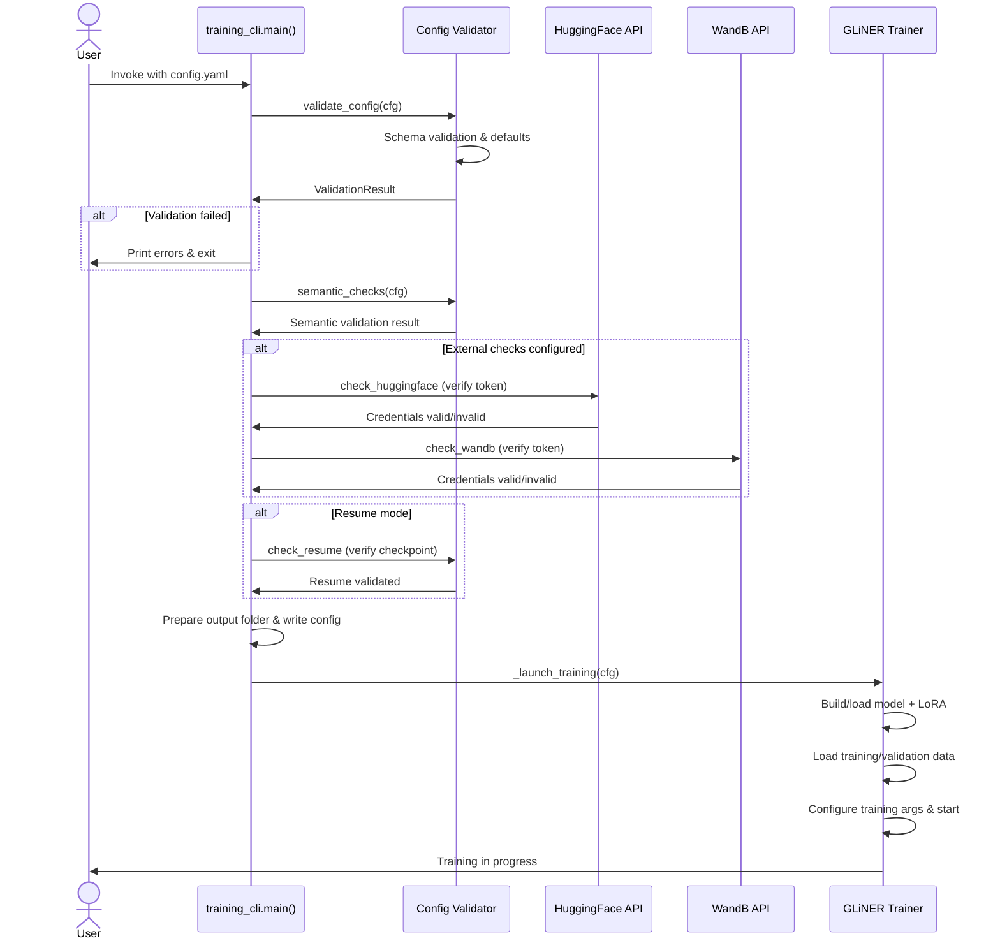
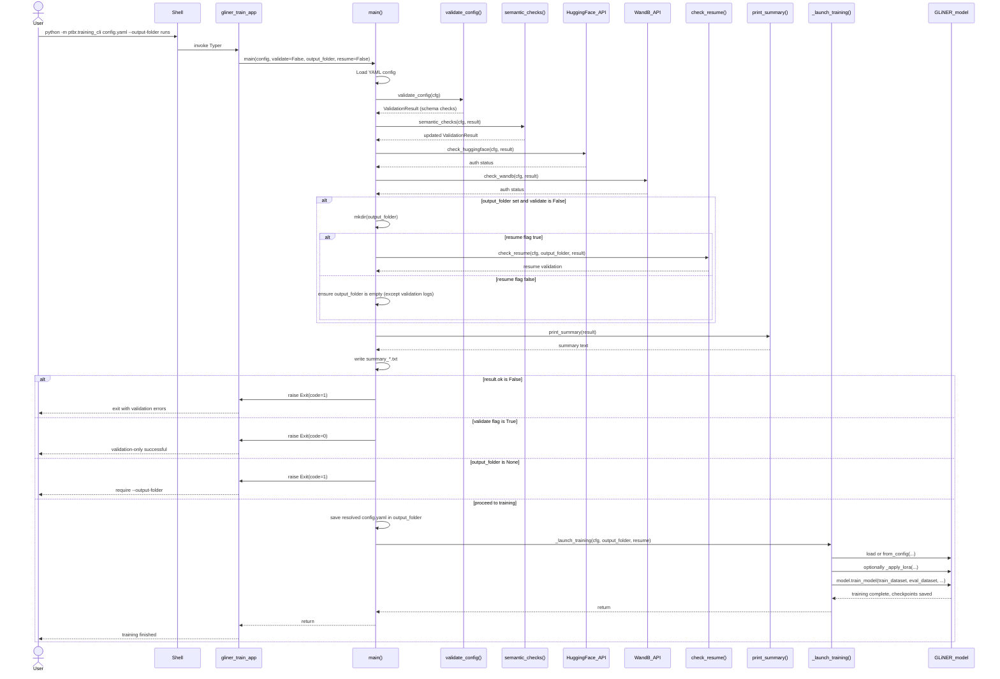
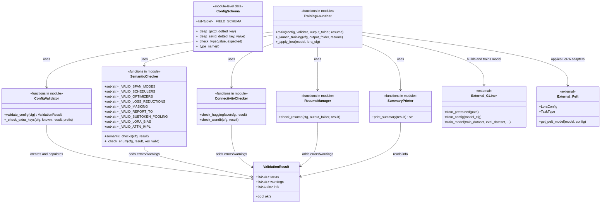

# PR Comments Export

> Exported from [https://github.com/arthrod/GLiNER/pull/5](https://github.com/arthrod/GLiNER/pull/5)  
> 24 of 24 comments selected  
> Generated by [Cicero](https://cicero.im) on 2/17/2026, 12:56:56 AM

---

### coderabbitai[bot] &mdash; 2/17/2026, 12:51:56 AM

> [!NOTE]
> Docstrings generation - SUCCESS
> Generated docstrings for this pull request at https://github.com/arthrod/GLiNER/pull/10

<!--DOCSTRING_INTERNAL_START_STATE>N4Igxg9gtlCWAuBJAJiAXCARgJgAwGYB2XAQxIDNMBOQzMANkIFYqnldcnMSnd7MAHMkIAWAKbcxJEZhAAaEACcxAN1hiA7gH0AzvBLwArjvThoABwA2Y+GNQLzigDKwAdgGtTAC3jxzOtAB6QIBzBC9DTAA6SChAkkV4L0UIZECAcRcAOQBRACVA80NLS0CARlwQAF8gA== <!--DOCSTRING_INTERNAL_END_STATE>

---

### coderabbitai[bot] &mdash; 2/17/2026, 12:32:30 AM

> File: `ptbr/training_cli.py`

<details><summary>Code context</summary>

```diff
@@ -0,0 +1,934 @@
+"""GLiNER Training CLI.
+
+Typer-based command-line interface for validating configuration and launching
+GLiNER training runs.  Every config field is validated before training begins.
+Fields that require a value error out; fields using a default emit a warning.
+A rich summary is printed and persisted to a log file.
+
+Usage:
+    python -m ptbr.training_cli --validate config.yaml
+    python -m ptbr.training_cli --output-folder ./runs config.yaml
+    python -m ptbr.training_cli --output-folder ./runs --resume config.yaml
+"""
+
+from __future__ import annotations
+
+import logging
+import os
+import sys
+import time
+from datetime import datetime, timezone
+from pathlib import Path
+from typing import Any, Optional
+
+import typer
+import yaml
+from rich.console import Console
+from rich.logging import RichHandler
+from rich.panel import Panel
+from rich.table import Table
+from rich.text import Text
+
+# ---------------------------------------------------------------------------
+# Typer app
+# ---------------------------------------------------------------------------
+app = typer.Typer(
+    name="gliner-train",
+    help="Validate configuration and launch GLiNER training runs.",
+    add_completion=False,
+)
+
+# ---------------------------------------------------------------------------
+# Rich console (stderr so stdout stays clean for piping)
+# ---------------------------------------------------------------------------
+console = Console(stderr=True)
+
+# ---------------------------------------------------------------------------
+# Module-level logger  --  prints to terminal via Rich AND writes to a file
+# ---------------------------------------------------------------------------
+LOG_FORMAT = "%(message)s"
+logger = logging.getLogger("ptbr.training_cli")
+logger.setLevel(logging.DEBUG)
+
+# Rich handler (terminal)
+_rich_handler = RichHandler(
+    console=console,
+    show_time=True,
+    show_path=False,
+    markup=True,
+)
+_rich_handler.setLevel(logging.DEBUG)
+logger.addHandler(_rich_handler)
+
+# File handler is attached later once we know the output folder.
+_file_handler: Optional[logging.FileHandler] = None
+
+
+def _attach_file_handler(log_path: Path) -> None:
+    """Create and attach a file handler to the module logger."""
+    global _file_handler
+    if _file_handler is not None:
+        logger.removeHandler(_file_handler)
+    log_path.parent.mkdir(parents=True, exist_ok=True)
+    _file_handler = logging.FileHandler(str(log_path), mode="w", encoding="utf-8")
+    _file_handler.setLevel(logging.DEBUG)
+    _file_handler.setFormatter(
+        logging.Formatter("%(asctime)s | %(levelname)-8s | %(message)s")
+    )
+    logger.addHandler(_file_handler)
+
+
+# ======================================================================== #
+#  SCHEMA  --  declarative description of every config field               #
+# ======================================================================== #
+
+# Each entry:  (dotted_key, python_type, required?, default_value, description)
+# For required fields default_value is ignored (use None as placeholder).
+
+_FIELD_SCHEMA: list[tuple[str, type | tuple[type, ...], bool, Any, str]] = [
+    # -- run --
+    ("run.name",        str,    True,   None,       "Run name"),
+    ("run.description", str,    False,  "",         "Run description"),
+    ("run.tags",        list,   False,  [],         "Run tags"),
+    ("run.seed",        int,    False,  42,         "Random seed"),
+
+    # -- model --
+    ("model.model_name",            str,    True,   None,           "Backbone model name/path"),
+    ("model.name",                  str,    False,  "gliner",       "Model display name"),
+    ("model.labels_encoder",        (str, type(None)),  False,  None,   "Bi-encoder labels model"),
+    ("model.labels_decoder",        (str, type(None)),  False,  None,   "Decoder model for generative labels"),
+    ("model.decoder_mode",          (str, type(None)),  False,  None,   "Decoder mode (span/prompt)"),
+    ("model.full_decoder_context",  bool,   False,  True,           "Full context in decoder"),
+    ("model.blank_entity_prob",     float,  False,  0.1,            "Blank entity probability"),
+    ("model.decoder_loss_coef",     float,  False,  0.5,            "Decoder loss coefficient"),
+    ("model.relations_layer",       (str, type(None)),  False,  None,   "Relation extraction layer"),
+    ("model.triples_layer",         (str, type(None)),  False,  None,   "Triples layer"),
+    ("model.embed_rel_token",       bool,   False,  True,           "Embed relation token"),
+    ("model.rel_token_index",       int,    False,  -1,             "Relation token index"),
+    ("model.rel_token",             str,    False,  "<<REL>>",      "Relation marker token"),
+    ("model.adjacency_loss_coef",   float,  False,  1.0,            "Adjacency loss coefficient"),
+    ("model.relation_loss_coef",    float,  False,  1.0,            "Relation loss coefficient"),
+    ("model.span_mode",             str,    True,   None,           "Span mode (markerV0 / token_level)"),
+    ("model.max_width",             int,    False,  12,             "Max entity span width"),
+    ("model.represent_spans",       bool,   False,  False,          "Explicit span representations"),
+    ("model.neg_spans_ratio",       float,  False,  1.0,            "Negative spans ratio"),
+    ("model.hidden_size",           int,    False,  512,            "Projection hidden size"),
+    ("model.dropout",               float,  False,  0.4,            "Dropout probability"),
+    ("model.fine_tune",             bool,   False,  True,           "Fine-tune encoder"),
+    ("model.subtoken_pooling",      str,    False,  "first",        "Sub-token pooling strategy"),
+    ("model.fuse_layers",           bool,   False,  False,          "Fuse layers"),
+    ("model.post_fusion_schema",    (str, type(None)),  False,  "",  "Post-fusion schema"),
+    ("model.num_post_fusion_layers", int,   False,  1,              "Post-fusion layer count"),
+    ("model.num_rnn_layers",        int,    False,  1,              "Bi-LSTM layers"),
+    ("model.max_len",               int,    True,   None,           "Max sequence length"),
+    ("model.max_types",             int,    False,  25,             "Max entity types per example"),
+    ("model.max_neg_type_ratio",    int,    False,  1,              "Max neg/pos type ratio"),
+    ("model.words_splitter_type",   str,    False,  "whitespace",   "Word splitter"),
+    ("model.embed_ent_token",       bool,   False,  True,           "Embed entity token"),
+    ("model.class_token_index",     int,    False,  -1,             "Class token index"),
+    ("model.ent_token",             str,    False,  "<<ENT>>",      "Entity marker token"),
+    ("model.sep_token",             str,    False,  "<<SEP>>",      "Separator token"),
+    ("model.token_loss_coef",       float,  False,  1.0,            "Token loss coefficient"),
+    ("model.span_loss_coef",        float,  False,  1.0,            "Span loss coefficient"),
+    ("model.encoder_config",        (dict, type(None)),   False,  None,   "Encoder config override"),
+    ("model._attn_implementation",  (str, type(None)),    False,  None,   "Attention implementation"),
+    ("model.vocab_size",            int,    False,  -1,             "Vocabulary size override"),
+
+    # -- data --
+    ("data.root_dir",       str,    True,   None,       "Root log directory"),
+    ("data.train_data",     str,    True,   None,       "Training data path"),
+    ("data.val_data_dir",   str,    False,  "none",     "Validation data path"),
+
+    # -- training --
+    ("training.prev_path",                  (str, type(None)),  False,  None,   "Pretrained checkpoint"),
+    ("training.num_steps",                  int,    True,   None,       "Total training steps"),
+    ("training.scheduler_type",             str,    False,  "cosine",   "LR scheduler type"),
+    ("training.warmup_ratio",               float,  False,  0.1,        "Warmup ratio"),
+    ("training.train_batch_size",           int,    True,   None,       "Per-device train batch size"),
+    ("training.eval_batch_size",            (int, type(None)),  False,  None,   "Per-device eval batch size"),
+    ("training.gradient_accumulation_steps", int,   False,  1,          "Gradient accumulation steps"),
+    ("training.max_grad_norm",              float,  False,  1.0,        "Max gradient norm"),
+    ("training.optimizer",                  str,    False,  "adamw_torch", "Optimizer"),
+    ("training.lr_encoder",                 float,  True,   None,       "Encoder learning rate"),
+    ("training.lr_others",                  float,  True,   None,       "Others learning rate"),
+    ("training.weight_decay_encoder",       float,  False,  0.01,       "Encoder weight decay"),
+    ("training.weight_decay_other",         float,  False,  0.01,       "Others weight decay"),
+    ("training.loss_alpha",                 (float, int),  False,  -1,  "Focal loss alpha"),
+    ("training.loss_gamma",                 (float, int),  False,  0,   "Focal loss gamma"),
+    ("training.loss_prob_margin",           (float, int),  False,  0,   "Focal loss prob margin"),
+    ("training.label_smoothing",            (float, int),  False,  0,   "Label smoothing"),
+    ("training.loss_reduction",             str,    False,  "sum",      "Loss reduction"),
+    ("training.negatives",                  float,  False,  1.0,        "Negative sampling ratio"),
+    ("training.masking",                    str,    False,  "none",     "Masking strategy"),
+    ("training.eval_every",                 int,    True,   None,       "Eval/save interval (steps)"),
+    ("training.save_total_limit",           int,    False,  3,          "Max checkpoints kept"),
+    ("training.logging_steps",              (int, type(None)),  False,  None,   "Logging interval"),
+    ("training.bf16",                       bool,   False,  False,      "bfloat16 precision"),
+    ("training.fp16",                       bool,   False,  False,      "float16 precision"),
+    ("training.use_cpu",                    bool,   False,  False,      "Force CPU"),
+    ("training.dataloader_num_workers",     int,    False,  2,          "Dataloader workers"),
+    ("training.dataloader_pin_memory",      bool,   False,  True,       "Pin memory"),
+    ("training.dataloader_persistent_workers", bool, False, False,      "Persistent workers"),
+    ("training.dataloader_prefetch_factor",  int,   False,  2,          "Prefetch factor"),
+    ("training.freeze_components",          (list, type(None)),  False,  None,  "Components to freeze"),
+    ("training.compile_model",              bool,   False,  False,      "torch.compile"),
+    ("training.size_sup",                   int,    False,  -1,         "Max supervised examples"),
+    ("training.shuffle_types",              bool,   False,  True,       "Shuffle entity types"),
+    ("training.random_drop",                bool,   False,  True,       "Random drop types"),
+
+    # -- lora --
+    ("lora.enabled",        bool,   False,  False,              "Enable LoRA"),
+    ("lora.r",              int,    False,  8,                  "LoRA rank"),
+    ("lora.lora_alpha",     int,    False,  16,                 "LoRA alpha"),
+    ("lora.lora_dropout",   float,  False,  0.05,               "LoRA dropout"),
+    ("lora.bias",           str,    False,  "none",             "LoRA bias mode"),
+    ("lora.target_modules",  list,  False,  ["q_proj", "v_proj"], "LoRA target modules"),
+    ("lora.task_type",      str,    False,  "TOKEN_CLS",        "PEFT task type"),
+    ("lora.modules_to_save", (list, type(None)), False, None,   "Modules to save"),
+
+    # -- environment --
+    ("environment.push_to_hub",         bool,   False,  False,  "Push to HF Hub"),
+    ("environment.hub_model_id",        (str, type(None)),  False,  None,   "HF Hub model id"),
+    ("environment.hf_token",            (str, type(None)),  False,  None,   "HF token override"),
+    ("environment.report_to",           str,    False,  "none", "Reporting backend"),
+    ("environment.wandb_project",       (str, type(None)),  False,  None,   "WandB project"),
+    ("environment.wandb_entity",        (str, type(None)),  False,  None,   "WandB entity"),
+    ("environment.wandb_api_key",       (str, type(None)),  False,  None,   "WandB API key override"),
+    ("environment.cuda_visible_devices", (str, type(None)), False, None,    "CUDA visible devices"),
+]
+
+
+# ======================================================================== #
+#  HELPERS                                                                  #
+# ======================================================================== #
+
+def _deep_get(d: dict, dotted_key: str) -> tuple[bool, Any]:
+    """Retrieve a value from a nested dict using a dotted key.
+
+    Returns (found: bool, value).
+    """
+    keys = dotted_key.split(".")
+    current = d
+    for k in keys:
+        if not isinstance(current, dict) or k not in current:
+            return False, None
+        current = current[k]
+    return True, current
+
+
+def _deep_set(d: dict, dotted_key: str, value: Any) -> None:
+    """Set a value in a nested dict using a dotted key."""
+    keys = dotted_key.split(".")
+    current = d
+    for k in keys[:-1]:
+        current = current.setdefault(k, {})
+    current[keys[-1]] = value
+
+
+def _type_name(t: type | tuple) -> str:
+    if isinstance(t, tuple):
+        return " | ".join(x.__name__ for x in t)
+    return t.__name__
+
+
+def _check_type(value: Any, expected: type | tuple[type, ...]) -> bool:
+    """Loose type check that treats int as float when float is expected."""
+    if isinstance(expected, tuple):
+        types = expected
+    else:
+        types = (expected,)
+
+    if isinstance(value, bool) and bool not in types:
+        return False
+
+    # Allow int where float is expected
+    if isinstance(value, int) and not isinstance(value, bool) and float in types:
+        return True
+
+    return isinstance(value, types)
+
+
+# ======================================================================== #
+#  VALIDATION ENGINE                                                        #
+# ======================================================================== #
+
+class ValidationResult:
+    """Accumulates validation outcomes for every config field."""
+
+    def __init__(self) -> None:
+        self.errors: list[str] = []
+        self.warnings: list[str] = []
+        self.info: list[tuple[str, str, Any]] = []   # (key, status, value)
+
+    @property
+    def ok(self) -> bool:
+        return len(self.errors) == 0
+
+
+def validate_config(cfg: dict) -> ValidationResult:
+    """Validate *every* field declared in ``_FIELD_SCHEMA``.
+
+    Rules:
+    - REQUIRED field missing or None  -> ERROR
+    - Optional field missing          -> WARNING (default applied in-place)
+    - Wrong type                      -> ERROR
+    - Extra keys not in schema        -> WARNING (ignored but noted)
+    """
+    result = ValidationResult()
+
+    known_keys: set[str] = set()
+
+    for dotted_key, expected_type, required, default, description in _FIELD_SCHEMA:
+        known_keys.add(dotted_key)
+        found, value = _deep_get(cfg, dotted_key)
+
+        if not found or (value is None and required):
+            if required:
+                msg = f"[REQUIRED] '{dotted_key}' is missing and has no default ({description})"
+                result.errors.append(msg)
+                result.info.append((dotted_key, "ERROR", "MISSING"))
+                logger.error(msg)
+            else:
+                _deep_set(cfg, dotted_key, default)
+                msg = f"[DEFAULT]  '{dotted_key}' not set -- using default: {default!r}"
+                result.warnings.append(msg)
+                result.info.append((dotted_key, "DEFAULT", default))
+                logger.warning(msg)
+            continue
+
+        # Type check
+        if not _check_type(value, expected_type):
+            msg = (
+                f"[TYPE]     '{dotted_key}' has type {type(value).__name__} "
+                f"but expected {_type_name(expected_type)} ({description})"
+            )
+            result.errors.append(msg)
+            result.info.append((dotted_key, "ERROR", value))
+            logger.error(msg)
+            continue
+
+        # Valid
+        result.info.append((dotted_key, "OK", value))
+        logger.info(f"[OK]       '{dotted_key}' = {value!r}")
+
+    # Detect extra keys
+    _check_extra_keys(cfg, known_keys, result)
+
+    return result
+
+
+def _check_extra_keys(
+    cfg: dict,
+    known: set[str],
+    result: ValidationResult,
+    prefix: str = "",
+) -> None:
+    """Warn about keys present in the config but absent from the schema."""
+    for key, value in cfg.items():
+        full = f"{prefix}{key}" if not prefix else f"{prefix}.{key}"
+        if isinstance(value, dict):
+            _check_extra_keys(value, known, result, full)
+        else:
+            if full not in known:
+                msg = f"[EXTRA]    '{full}' is not in the schema (will be ignored)"
+                result.warnings.append(msg)
+                logger.warning(msg)
+
+
+# ======================================================================== #
+#  CROSS-FIELD SEMANTIC CHECKS                                              #
+# ======================================================================== #
+
+_VALID_SPAN_MODES = {"markerV0", "token_level"}
+_VALID_SCHEDULERS = {
+    "linear", "cosine", "constant", "constant_with_warmup",
+    "polynomial", "inverse_sqrt",
+}
+_VALID_OPTIMIZERS = {"adamw_torch", "adamw_hf", "adafactor", "sgd"}
+_VALID_LOSS_REDUCTIONS = {"sum", "mean", "none"}
+_VALID_MASKING = {"none", "global"}
+_VALID_REPORT_TO = {"none", "wandb", "tensorboard", "all"}
+_VALID_SUBTOKEN_POOLING = {"first", "mean"}
+_VALID_LORA_BIAS = {"none", "all", "lora_only"}
+_VALID_ATTN_IMPL = {"eager", "sdpa", "flash_attention_2"}
+
+
+def semantic_checks(cfg: dict, result: ValidationResult) -> None:
+    """Run cross-field and enum-value validations."""
+    _check_enum(cfg, result, "model.span_mode", _VALID_SPAN_MODES)
+    _check_enum(cfg, result, "training.scheduler_type", _VALID_SCHEDULERS)
+    _check_enum(cfg, result, "training.optimizer", _VALID_OPTIMIZERS)
+    _check_enum(cfg, result, "training.loss_reduction", _VALID_LOSS_REDUCTIONS)
+    _check_enum(cfg, result, "training.masking", _VALID_MASKING)
+    _check_enum(cfg, result, "environment.report_to", _VALID_REPORT_TO)
+    _check_enum(cfg, result, "model.subtoken_pooling", _VALID_SUBTOKEN_POOLING)
+    _check_enum(cfg, result, "lora.bias", _VALID_LORA_BIAS)
+
+    # Optional enums (only check if non-null)
+    _, attn = _deep_get(cfg, "model._attn_implementation")
+    if attn is not None:
+        _check_enum(cfg, result, "model._attn_implementation", _VALID_ATTN_IMPL)
+
+    # Decoder fields require labels_decoder
+    _, dec = _deep_get(cfg, "model.labels_decoder")
+    if dec is not None:
+        _, dm = _deep_get(cfg, "model.decoder_mode")
+        if dm is None:
+            msg = "'model.decoder_mode' should be set when 'model.labels_decoder' is used"
+            result.warnings.append(msg)
+            logger.warning(msg)
+
+    # WandB requires project
+    _, report = _deep_get(cfg, "environment.report_to")
+    if report in ("wandb", "all"):
+        _, proj = _deep_get(cfg, "environment.wandb_project")
+        if not proj:
+            msg = "'environment.wandb_project' is required when report_to includes wandb"
+            result.errors.append(msg)
+            logger.error(msg)
+
+    # HF Hub requires model id
+    _, push = _deep_get(cfg, "environment.push_to_hub")
+    if push:
+        _, hid = _deep_get(cfg, "environment.hub_model_id")
+        if not hid:
+            msg = "'environment.hub_model_id' is required when push_to_hub is true"
+            result.errors.append(msg)
+            logger.error(msg)
+
+    # Positive numeric checks
+    for key in (
+        "training.num_steps", "training.train_batch_size", "training.eval_every",
+        "training.lr_encoder", "training.lr_others",
+    ):
+        _, val = _deep_get(cfg, key)
+        if val is not None and val <= 0:
+            msg = f"'{key}' must be > 0, got {val}"
+            result.errors.append(msg)
+            logger.error(msg)
+
+    # bf16 and fp16 mutual exclusivity
+    _, bf16 = _deep_get(cfg, "training.bf16")
+    _, fp16 = _deep_get(cfg, "training.fp16")
+    if bf16 and fp16:
+        msg = "Cannot enable both 'training.bf16' and 'training.fp16'"
+        result.errors.append(msg)
+        logger.error(msg)
+
+
+def _check_enum(
+    cfg: dict, result: ValidationResult, key: str, valid: set[str]
+) -> None:
+    _, val = _deep_get(cfg, key)
+    if val is not None and val not in valid:
+        msg = f"'{key}' = {val!r} is not one of {sorted(valid)}"
+        result.errors.append(msg)
+        logger.error(msg)
+
+
+# ======================================================================== #
+#  API CONNECTIVITY CHECKS                                                  #
+# ======================================================================== #
+
+def check_huggingface(cfg: dict, result: ValidationResult) -> None:
+    """Make a real API call to HuggingFace to verify credentials."""
+    _, push = _deep_get(cfg, "environment.push_to_hub")
+    if not push:
+        logger.info("[HF]       push_to_hub is false -- skipping HF API check")
+        return
+
+    _, token_override = _deep_get(cfg, "environment.hf_token")
+    token = token_override or os.environ.get("HF_TOKEN", "")
+    if not token:
+        msg = "HuggingFace: push_to_hub is true but no token found (set HF_TOKEN or environment.hf_token)"
+        result.errors.append(msg)
+        logger.error(msg)
+        return
+
+    try:
+        import requests
+        resp = requests.get(
+            "https://huggingface.co/api/whoami-v2",
+            headers={"Authorization": f"Bearer {token}"},
+            timeout=15,
+        )
+        if resp.status_code == 200:
+            data = resp.json()
+            username = data.get("name", "unknown")
+            logger.info(f"[HF]       Authenticated as '{username}'")
+        else:
+            msg = f"HuggingFace API returned status {resp.status_code}: {resp.text[:200]}"
+            result.errors.append(msg)
+            logger.error(msg)
+    except Exception as exc:
+        msg = f"HuggingFace API call failed: {exc}"
+        result.errors.append(msg)
+        logger.error(msg)
+
+
+def check_wandb(cfg: dict, result: ValidationResult) -> None:
+    """Make a real API call to WandB to verify credentials."""
+    _, report = _deep_get(cfg, "environment.report_to")
+    if report not in ("wandb", "all"):
+        logger.info("[WANDB]    report_to does not include wandb -- skipping WandB API check")
+        return
+
+    _, key_override = _deep_get(cfg, "environment.wandb_api_key")
+    key = key_override or os.environ.get("WANDB_API_KEY", "")
+    if not key:
+        msg = "WandB: report_to includes wandb but no API key found (set WANDB_API_KEY or environment.wandb_api_key)"
+        result.errors.append(msg)
+        logger.error(msg)
+        return
+
+    try:
+        import requests
+        resp = requests.get(
+            "https://api.wandb.ai/graphql",
+            headers={"Authorization": f"Bearer {key}"},
+            json={"query": "{ viewer { username } }"},
+            timeout=15,
+        )
+        if resp.status_code == 200:
+            data = resp.json()
+            username = (
+                data.get("data", {}).get("viewer", {}).get("username", "unknown")
+            )
+            logger.info(f"[WANDB]    Authenticated as '{username}'")
+        else:
+            msg = f"WandB API returned status {resp.status_code}: {resp.text[:200]}"
+            result.errors.append(msg)
+            logger.error(msg)
+    except Exception as exc:
+        msg = f"WandB API call failed: {exc}"
+        result.errors.append(msg)
+        logger.error(msg)
+
+
+# ======================================================================== #
+#  RESUME CHECK                                                             #
+# ======================================================================== #
+
+def check_resume(cfg: dict, output_folder: Path, result: ValidationResult) -> None:
+    """When --resume is passed, verify output_folder has a compatible checkpoint."""
+    _, run_name = _deep_get(cfg, "run.name")
+    if not run_name:
+        msg = "Cannot resume: 'run.name' is missing"
+        result.errors.append(msg)
+        logger.error(msg)
+        return
+
+    # Look for checkpoint dirs inside output_folder
+    checkpoint_dirs = sorted(output_folder.glob("checkpoint-*"))
+    if not checkpoint_dirs:
+        msg = f"Cannot resume: no checkpoint-* directories found in {output_folder}"
+        result.errors.append(msg)
+        logger.error(msg)
+        return
+
+    # Check for config.yaml in output_folder to verify run name matches
+    saved_cfg_path = output_folder / "config.yaml"
+    if not saved_cfg_path.exists():
+        msg = f"Cannot resume: {saved_cfg_path} not found"
+        result.errors.append(msg)
+        logger.error(msg)
+        return
+
+    with open(saved_cfg_path) as f:
+        saved_cfg = yaml.safe_load(f) or {}
+
+    saved_name = saved_cfg.get("run", {}).get("name", "")
+    if saved_name != run_name:
+        msg = (
+            f"Cannot resume: run.name mismatch -- "
+            f"config says '{run_name}' but checkpoint has '{saved_name}'"
+        )
+        result.errors.append(msg)
+        logger.error(msg)
+        return
+
+    latest = checkpoint_dirs[-1]
+    logger.info(f"[RESUME]   Found compatible checkpoint: {latest}")
+
+
+# ======================================================================== #
+#  RICH SUMMARY TABLE                                                       #
+# ======================================================================== #
+
+def print_summary(result: ValidationResult) -> str:
+    """Print a Rich table of all validated fields and return the plain-text version."""
+    table = Table(
+        title="Configuration Validation Summary",
+        show_header=True,
+        header_style="bold cyan",
+        expand=True,
+    )
+    table.add_column("Key", style="dim", no_wrap=True, ratio=3)
+    table.add_column("Status", justify="center", ratio=1)
+    table.add_column("Value", ratio=3)
+
+    lines: list[str] = []
+    lines.append("=" * 80)
+    lines.append("Configuration Validation Summary")
+    lines.append("=" * 80)
+
+    for key, status, value in result.info:
+        val_str = repr(value) if not isinstance(value, str) else value
+        if status == "OK":
+            style = "green"
+        elif status == "DEFAULT":
+            style = "yellow"
+        else:
+            style = "red"
+        table.add_row(key, Text(status, style=style), str(val_str))
+        lines.append(f"  {key:50s}  {status:10s}  {val_str}")
+
+    console.print()
+    console.print(table)
+
+    if result.warnings:
+        console.print(
+            Panel(
+                "\n".join(result.warnings),
+                title="Warnings",
+                border_style="yellow",
+            )
+        )
+        lines.append("")
+        lines.append("WARNINGS:")
+        lines.extend(f"  {w}" for w in result.warnings)
+
+    if result.errors:
+        console.print(
+            Panel(
+                "\n".join(result.errors),
+                title="Errors",
+                border_style="red",
+            )
+        )
+        lines.append("")
+        lines.append("ERRORS:")
+        lines.extend(f"  {e}" for e in result.errors)
+
+    if result.ok:
+        console.print(
+            Panel(
+                f"[bold green]Validation passed[/] -- "
+                f"{len(result.info)} fields checked, "
+                f"{len(result.warnings)} warnings, 0 errors",
+                border_style="green",
+            )
+        )
+    else:
+        console.print(
+            Panel(
+                f"[bold red]Validation FAILED[/] -- "
+                f"{len(result.errors)} error(s)",
+                border_style="red",
+            )
+        )
+
+    lines.append("")
+    lines.append(
+        f"Total: {len(result.info)} fields | "
+        f"{len(result.warnings)} warnings | {len(result.errors)} errors"
+    )
+    return "\n".join(lines)
+
+
+# ======================================================================== #
+#  MAIN COMMAND                                                             #
+# ======================================================================== #
+
+@app.command()
+def main(
+    config: Path = typer.Argument(
+        ...,
+        help="Path to the YAML configuration file.",
+        exists=True,
+        dir_okay=False,
+        readable=True,
+    ),
+    validate: bool = typer.Option(
+        False,
+        "--validate",
+        help="Validate the config and exit without training.",
+    ),
+    output_folder: Optional[Path] = typer.Option(
+        None,
+        "--output-folder",
+        help=(
+            "Root output folder for checkpoints and logs. "
+            "Must be empty unless --resume is passed."
+        ),
+    ),
+    resume: bool = typer.Option(
+        False,
+        "--resume",
+        help=(
+            "Resume from a previous run.  The output-folder must contain "
+            "checkpoints whose config.yaml run.name matches the current config."
+        ),
+    ),
+) -> None:
+    """Validate configuration and optionally launch a GLiNER training run."""
+    timestamp = datetime.now(timezone.utc).strftime("%Y%m%dT%H%M%SZ")
+
+    # ---- Load YAML ----
+    logger.info(f"Loading config from {config}")
+    with open(config) as f:
+        cfg: dict = yaml.safe_load(f) or {}
+
+    # ---- Determine log path ----
+    if output_folder is not None:
+        log_path = output_folder / f"validation_{timestamp}.log"
+    else:
+        log_path = config.parent / f"validation_{timestamp}.log"
+    _attach_file_handler(log_path)
+
+    logger.info(f"Log file: {log_path}")
+    logger.info(f"Timestamp: {timestamp}")
+
+    # ---- Schema validation ----
+    result = validate_config(cfg)
+
+    # ---- Semantic checks ----
+    semantic_checks(cfg, result)
+
+    # ---- API connectivity ----
+    check_huggingface(cfg, result)
+    check_wandb(cfg, result)
+
+    # ---- Output folder checks ----
+    if output_folder is not None and not validate:
+        output_folder.mkdir(parents=True, exist_ok=True)
+
+        if resume:
+            check_resume(cfg, output_folder, result)
+        else:
+            # Must be empty
+            existing = list(output_folder.iterdir())
+            # Allow the log file we just created
+            non_log = [
+                p for p in existing
+                if not p.name.startswith("validation_")
+            ]
+            if non_log:
+                msg = (
+                    f"--output-folder '{output_folder}' is not empty "
+                    f"(contains {len(non_log)} item(s)).  "
+                    f"Use --resume if you want to continue a previous run."
+                )
+                result.errors.append(msg)
+                logger.error(msg)
+
+    # ---- Print & save summary ----
+    summary_text = print_summary(result)
+    logger.info("Summary written to log file")
+
+    # Also write a dedicated summary file
+    if output_folder is not None:
+        summary_path = output_folder / f"summary_{timestamp}.txt"
+    else:
+        summary_path = config.parent / f"summary_{timestamp}.txt"
+    summary_path.write_text(summary_text, encoding="utf-8")
+    logger.info(f"Summary saved to {summary_path}")
+
+    # ---- Bail on errors or validate-only ----
+    if not result.ok:
+        logger.error(f"Validation failed with {len(result.errors)} error(s). Aborting.")
+        raise typer.Exit(code=1)
+
+    if validate:
+        logger.info("--validate flag set.  Exiting without training.")
+        raise typer.Exit(code=0)
+
+    # ---- Require --output-folder for training ----
+    if output_folder is None:
+        logger.error("--output-folder is required to start training (or use --validate).")
+        raise typer.Exit(code=1)
+
+    # ---- Save resolved config ----
+    resolved_path = output_folder / "config.yaml"
+    with open(resolved_path, "w") as f:
+        yaml.dump(cfg, f, default_flow_style=False, sort_keys=False)
+    logger.info(f"Resolved config saved to {resolved_path}")
+
+    # ---- Launch training ----
+    _launch_training(cfg, output_folder, resume=resume)
+
+
+# ======================================================================== #
+#  TRAINING LAUNCHER                                                        #
+# ======================================================================== #
+
+def _launch_training(cfg: dict, output_folder: Path, resume: bool) -> None:
+    """Build the GLiNER model and start training."""
+    logger.info("Preparing training run ...")
+
+    # Lazy-import heavy dependencies so validation stays fast
+    import json
+    import torch
+    from gliner import GLiNER
+    from gliner.training import TrainingArguments, Trainer
+
+    # -- Seed --
+    seed = cfg["run"]["seed"]
+    torch.manual_seed(seed)
+
+    # -- CUDA --
+    cuda_devs = cfg["environment"].get("cuda_visible_devices")
+    if cuda_devs is not None:
+        os.environ["CUDA_VISIBLE_DEVICES"] = str(cuda_devs)
+
+    # -- WandB env vars --
+    report_to = cfg["environment"]["report_to"]
+    if report_to in ("wandb", "all"):
+        key = cfg["environment"].get("wandb_api_key") or os.environ.get("WANDB_API_KEY", "")
+        if key:
+            os.environ["WANDB_API_KEY"] = key
+        proj = cfg["environment"].get("wandb_project")
+        if proj:
+            os.environ["WANDB_PROJECT"] = proj
+        entity = cfg["environment"].get("wandb_entity")
+        if entity:
+            os.environ["WANDB_ENTITY"] = entity
+
+    # -- Build model --
+    model_cfg = cfg["model"]
+    train_cfg = cfg["training"]
+
+    prev_path = train_cfg.get("prev_path")
+    if prev_path and str(prev_path).lower() not in ("none", "null", ""):
+        logger.info(f"Loading pretrained model from: {prev_path}")
+        model = GLiNER.from_pretrained(prev_path)
+    else:
+        logger.info("Initialising model from config ...")
+        model = GLiNER.from_config(model_cfg)
+
+    model = model.to(dtype=torch.float32)
+    logger.info(f"Model class: {model.__class__.__name__}")
+
+    # -- LoRA --
+    if cfg.get("lora", {}).get("enabled", False):
+        _apply_lora(model, cfg["lora"])
+
+    # -- Load data --
+    train_data_path = cfg["data"]["train_data"]
+    logger.info(f"Loading training data from {train_data_path}")
+    with open(train_data_path) as f:
+        train_dataset = json.load(f)
+    logger.info(f"Training samples: {len(train_dataset)}")
+
+    eval_dataset = None
+    val_path = cfg["data"].get("val_data_dir", "none")
+    if val_path and val_path.lower() not in ("none", "null", ""):
+        logger.info(f"Loading validation data from {val_path}")
+        with open(val_path) as f:
+            eval_dataset = json.load(f)
+        logger.info(f"Validation samples: {len(eval_dataset)}")
+
+    # -- Freeze components --
+    freeze = train_cfg.get("freeze_components")
+    if freeze:
+        logger.info(f"Freezing: {freeze}")
+
+    # -- Eval batch size fallback --
+    eval_bs = train_cfg.get("eval_batch_size") or train_cfg["train_batch_size"]
+
+    # -- Logging steps fallback --
+    log_steps = train_cfg.get("logging_steps") or train_cfg["eval_every"]
+
+    # -- Train --
+    logger.info("Starting training ...")
+    model.train_model(
+        train_dataset=train_dataset,
+        eval_dataset=eval_dataset,
+        output_dir=str(output_folder),
+        freeze_components=freeze,
+        compile_model=train_cfg.get("compile_model", False),
+        # Schedule
+        max_steps=train_cfg["num_steps"],
+        lr_scheduler_type=train_cfg["scheduler_type"],
+        warmup_ratio=train_cfg["warmup_ratio"],
+        # Batch
+        per_device_train_batch_size=train_cfg["train_batch_size"],
+        per_device_eval_batch_size=eval_bs,
+        # Optimisation
+        learning_rate=float(train_cfg["lr_encoder"]),
+        others_lr=float(train_cfg["lr_others"]),
+        weight_decay=float(train_cfg["weight_decay_encoder"]),
+        others_weight_decay=float(train_cfg["weight_decay_other"]),
+        max_grad_norm=float(train_cfg["max_grad_norm"]),
+        optim=train_cfg.get("optimizer", "adamw_torch"),
+        # Loss
+        focal_loss_alpha=float(train_cfg["loss_alpha"]),
+        focal_loss_gamma=float(train_cfg["loss_gamma"]),
+        focal_loss_prob_margin=float(train_cfg.get("loss_prob_margin", 0)),
+        label_smoothing=float(train_cfg.get("label_smoothing", 0)),
+        loss_reduction=train_cfg["loss_reduction"],
+        negatives=float(train_cfg["negatives"]),
+        masking=train_cfg["masking"],
+        # Logging & checkpoints
+        save_steps=train_cfg["eval_every"],
+        logging_steps=log_steps,
+        save_total_limit=train_cfg["save_total_limit"],
+        # Precision
+        bf16=train_cfg.get("bf16", False),
+        # Hardware
+        use_cpu=train_cfg.get("use_cpu", False),
+        dataloader_num_workers=train_cfg.get("dataloader_num_workers", 2),
+        # Reporting
+        report_to=report_to,
+        # Gradient accumulation
+        gradient_accumulation_steps=train_cfg.get("gradient_accumulation_steps", 1),
+    )
```
</details>

_⚠️ Potential issue_ | _🟠 Major_

<details>
<summary>🧩 Analysis chain</summary>

🏁 Script executed:

```shell
# First, locate the file and check its size
find . -name "training_cli.py" -type f
wc -l ptbr/training_cli.py 2>/dev/null || echo "File not found in expected location"
```

Repository: arthrod/GLiNER

Length of output: 105

---

🏁 Script executed:

```shell
# Read the function signature and surrounding context (lines 760-890 to get full context)
sed -n '760,890p' ptbr/training_cli.py
```

Repository: arthrod/GLiNER

Length of output: 5069

---

🏁 Script executed:

```shell
# Search for where resume is defined and used
rg -n "resume" ptbr/training_cli.py -B2 -A2
```

Repository: arthrod/GLiNER

Length of output: 2663

---

🏁 Script executed:

```shell
# Search for GLiNER imports and any documentation
rg -n "from gliner|import GLiNER" --type=py -A5 -B5
```

Repository: arthrod/GLiNER

Length of output: 28216

---

🏁 Script executed:

```shell
# Look for any test files or examples that use train_model with resume
rg -n "train_model" --type=py -C5
```

Repository: arthrod/GLiNER

Length of output: 1701

---

🏁 Script executed:

```shell
# Check if there are any comments or docs about resume behavior
rg -n "resume|checkpoint" --type=py -C3 | head -100
```

Repository: arthrod/GLiNER

Length of output: 7323

---

🏁 Script executed:

```shell
# Get the full train_model method signature
sed -n '1084,1150p' gliner/model.py
```

Repository: arthrod/GLiNER

Length of output: 2522

---

🏁 Script executed:

```shell
# Search for resume-related parameters in the train_model implementation
rg -n "resume" gliner/model.py -B5 -A5
```

Repository: arthrod/GLiNER

Length of output: 4901

---

🏁 Script executed:

```shell
# Search for create_training_args method
rg -n "def create_training_args" gliner/model.py -A20
```

Repository: arthrod/GLiNER

Length of output: 935

---

🏁 Script executed:

```shell
# Check what TrainingArguments is and what parameters it accepts
rg -n "class TrainingArguments|from.*TrainingArguments" gliner/ -A5
```

Repository: arthrod/GLiNER

Length of output: 977

---

🏁 Script executed:

```shell
# Look for resume handling in the Trainer.train() call or related code
rg -n "trainer.train\(\)" gliner/model.py -B5 -A10
```

Repository: arthrod/GLiNER

Length of output: 695

---

🏁 Script executed:

```shell
# Check if TrainingArguments supports resume_from_checkpoint
sed -n '46,150p' gliner/training/trainer.py
```

Repository: arthrod/GLiNER

Length of output: 4308

---

🏁 Script executed:

```shell
# Search for any use of resume_from_checkpoint in the codebase
rg -n "resume_from_checkpoint" . --type=py
```

Repository: arthrod/GLiNER

Length of output: 40

---

🏁 Script executed:

```shell
# Check the HuggingFace Trainer.train() signature to see what parameters it accepts
python3 << 'EOF'
import inspect
try:
    from transformers import Trainer
    sig = inspect.signature(Trainer.train)
    print("Trainer.train() signature:")
    print(sig)
except Exception as e:
    print(f"Error: {e}")
EOF
```

Repository: arthrod/GLiNER

Length of output: 95

---

🏁 Script executed:

```shell
# Check if there are any comments in _launch_training or surrounding code about resume
sed -n '758,890p' ptbr/training_cli.py | grep -i "resume\|checkpoint" -B2 -A2
```

Repository: arthrod/GLiNER

Length of output: 653

---


</details>

**`resume` parameter is validated but not used in training.**

The `resume` flag is validated in `check_resume()` but never passed to or used within `_launch_training()`. Unless `Trainer.train()` auto-resumes from `output_dir`, the validated flag has no effect. Verify the intended behavior: if auto-resumption from existing checkpoints is expected, add a comment explaining it; otherwise, explicitly wire the `resume` flag to the training call (e.g., via `resume_from_checkpoint` if supported by the underlying trainer).

<details>
<summary>🧰 Tools</summary>

<details>
<summary>🪛 Ruff (0.15.0)</summary>

[warning] 765-765: Unused function argument: `resume`

(ARG001)

</details>

</details>

<details>
<summary>🤖 Prompt for AI Agents</summary>

```
Verify each finding against the current code and only fix it if needed.

In `@ptbr/training_cli.py` around lines 765 - 885, The resume parameter passed
into _launch_training is validated but never used; either document that
auto-resume happens via model.train_model reading output_dir or wire resume into
the training invocation: pass resume (or a checkpoint path derived from
output_folder) into model.train_model using the trainer argument supported by
the backend (e.g., resume_from_checkpoint or resume=True), and ensure
_launch_training honors resume by checking resume and mapping it to the
corresponding parameter before calling model.train_model; update or add a short
comment near _launch_training and the model.train_model call to clarify the
resumption behavior.
```

</details>

<!-- fingerprinting:phantom:medusa:eagle -->

<!-- This is an auto-generated comment by CodeRabbit -->

---

### coderabbitai[bot] &mdash; 2/17/2026, 12:32:29 AM

> File: `ptbr/training_cli.py`

<details><summary>Code context</summary>

```diff
@@ -0,0 +1,934 @@
+"""GLiNER Training CLI.
+
+Typer-based command-line interface for validating configuration and launching
+GLiNER training runs.  Every config field is validated before training begins.
+Fields that require a value error out; fields using a default emit a warning.
+A rich summary is printed and persisted to a log file.
+
+Usage:
+    python -m ptbr.training_cli --validate config.yaml
+    python -m ptbr.training_cli --output-folder ./runs config.yaml
+    python -m ptbr.training_cli --output-folder ./runs --resume config.yaml
+"""
+
+from __future__ import annotations
+
+import logging
+import os
+import sys
+import time
+from datetime import datetime, timezone
+from pathlib import Path
+from typing import Any, Optional
+
+import typer
+import yaml
+from rich.console import Console
+from rich.logging import RichHandler
+from rich.panel import Panel
+from rich.table import Table
+from rich.text import Text
+
+# ---------------------------------------------------------------------------
+# Typer app
+# ---------------------------------------------------------------------------
+app = typer.Typer(
+    name="gliner-train",
+    help="Validate configuration and launch GLiNER training runs.",
+    add_completion=False,
+)
+
+# ---------------------------------------------------------------------------
+# Rich console (stderr so stdout stays clean for piping)
+# ---------------------------------------------------------------------------
+console = Console(stderr=True)
+
+# ---------------------------------------------------------------------------
+# Module-level logger  --  prints to terminal via Rich AND writes to a file
+# ---------------------------------------------------------------------------
+LOG_FORMAT = "%(message)s"
+logger = logging.getLogger("ptbr.training_cli")
+logger.setLevel(logging.DEBUG)
+
+# Rich handler (terminal)
+_rich_handler = RichHandler(
+    console=console,
+    show_time=True,
+    show_path=False,
+    markup=True,
+)
+_rich_handler.setLevel(logging.DEBUG)
+logger.addHandler(_rich_handler)
+
+# File handler is attached later once we know the output folder.
+_file_handler: Optional[logging.FileHandler] = None
+
+
+def _attach_file_handler(log_path: Path) -> None:
+    """Create and attach a file handler to the module logger."""
+    global _file_handler
+    if _file_handler is not None:
+        logger.removeHandler(_file_handler)
+    log_path.parent.mkdir(parents=True, exist_ok=True)
+    _file_handler = logging.FileHandler(str(log_path), mode="w", encoding="utf-8")
+    _file_handler.setLevel(logging.DEBUG)
+    _file_handler.setFormatter(
+        logging.Formatter("%(asctime)s | %(levelname)-8s | %(message)s")
+    )
+    logger.addHandler(_file_handler)
+
+
+# ======================================================================== #
+#  SCHEMA  --  declarative description of every config field               #
+# ======================================================================== #
+
+# Each entry:  (dotted_key, python_type, required?, default_value, description)
+# For required fields default_value is ignored (use None as placeholder).
+
+_FIELD_SCHEMA: list[tuple[str, type | tuple[type, ...], bool, Any, str]] = [
+    # -- run --
+    ("run.name",        str,    True,   None,       "Run name"),
+    ("run.description", str,    False,  "",         "Run description"),
+    ("run.tags",        list,   False,  [],         "Run tags"),
+    ("run.seed",        int,    False,  42,         "Random seed"),
+
+    # -- model --
+    ("model.model_name",            str,    True,   None,           "Backbone model name/path"),
+    ("model.name",                  str,    False,  "gliner",       "Model display name"),
+    ("model.labels_encoder",        (str, type(None)),  False,  None,   "Bi-encoder labels model"),
+    ("model.labels_decoder",        (str, type(None)),  False,  None,   "Decoder model for generative labels"),
+    ("model.decoder_mode",          (str, type(None)),  False,  None,   "Decoder mode (span/prompt)"),
+    ("model.full_decoder_context",  bool,   False,  True,           "Full context in decoder"),
+    ("model.blank_entity_prob",     float,  False,  0.1,            "Blank entity probability"),
+    ("model.decoder_loss_coef",     float,  False,  0.5,            "Decoder loss coefficient"),
+    ("model.relations_layer",       (str, type(None)),  False,  None,   "Relation extraction layer"),
+    ("model.triples_layer",         (str, type(None)),  False,  None,   "Triples layer"),
+    ("model.embed_rel_token",       bool,   False,  True,           "Embed relation token"),
+    ("model.rel_token_index",       int,    False,  -1,             "Relation token index"),
+    ("model.rel_token",             str,    False,  "<<REL>>",      "Relation marker token"),
+    ("model.adjacency_loss_coef",   float,  False,  1.0,            "Adjacency loss coefficient"),
+    ("model.relation_loss_coef",    float,  False,  1.0,            "Relation loss coefficient"),
+    ("model.span_mode",             str,    True,   None,           "Span mode (markerV0 / token_level)"),
+    ("model.max_width",             int,    False,  12,             "Max entity span width"),
+    ("model.represent_spans",       bool,   False,  False,          "Explicit span representations"),
+    ("model.neg_spans_ratio",       float,  False,  1.0,            "Negative spans ratio"),
+    ("model.hidden_size",           int,    False,  512,            "Projection hidden size"),
+    ("model.dropout",               float,  False,  0.4,            "Dropout probability"),
+    ("model.fine_tune",             bool,   False,  True,           "Fine-tune encoder"),
+    ("model.subtoken_pooling",      str,    False,  "first",        "Sub-token pooling strategy"),
+    ("model.fuse_layers",           bool,   False,  False,          "Fuse layers"),
+    ("model.post_fusion_schema",    (str, type(None)),  False,  "",  "Post-fusion schema"),
+    ("model.num_post_fusion_layers", int,   False,  1,              "Post-fusion layer count"),
+    ("model.num_rnn_layers",        int,    False,  1,              "Bi-LSTM layers"),
+    ("model.max_len",               int,    True,   None,           "Max sequence length"),
+    ("model.max_types",             int,    False,  25,             "Max entity types per example"),
+    ("model.max_neg_type_ratio",    int,    False,  1,              "Max neg/pos type ratio"),
+    ("model.words_splitter_type",   str,    False,  "whitespace",   "Word splitter"),
+    ("model.embed_ent_token",       bool,   False,  True,           "Embed entity token"),
+    ("model.class_token_index",     int,    False,  -1,             "Class token index"),
+    ("model.ent_token",             str,    False,  "<<ENT>>",      "Entity marker token"),
+    ("model.sep_token",             str,    False,  "<<SEP>>",      "Separator token"),
+    ("model.token_loss_coef",       float,  False,  1.0,            "Token loss coefficient"),
+    ("model.span_loss_coef",        float,  False,  1.0,            "Span loss coefficient"),
+    ("model.encoder_config",        (dict, type(None)),   False,  None,   "Encoder config override"),
+    ("model._attn_implementation",  (str, type(None)),    False,  None,   "Attention implementation"),
+    ("model.vocab_size",            int,    False,  -1,             "Vocabulary size override"),
+
+    # -- data --
+    ("data.root_dir",       str,    True,   None,       "Root log directory"),
+    ("data.train_data",     str,    True,   None,       "Training data path"),
+    ("data.val_data_dir",   str,    False,  "none",     "Validation data path"),
+
+    # -- training --
+    ("training.prev_path",                  (str, type(None)),  False,  None,   "Pretrained checkpoint"),
+    ("training.num_steps",                  int,    True,   None,       "Total training steps"),
+    ("training.scheduler_type",             str,    False,  "cosine",   "LR scheduler type"),
+    ("training.warmup_ratio",               float,  False,  0.1,        "Warmup ratio"),
+    ("training.train_batch_size",           int,    True,   None,       "Per-device train batch size"),
+    ("training.eval_batch_size",            (int, type(None)),  False,  None,   "Per-device eval batch size"),
+    ("training.gradient_accumulation_steps", int,   False,  1,          "Gradient accumulation steps"),
+    ("training.max_grad_norm",              float,  False,  1.0,        "Max gradient norm"),
+    ("training.optimizer",                  str,    False,  "adamw_torch", "Optimizer"),
+    ("training.lr_encoder",                 float,  True,   None,       "Encoder learning rate"),
+    ("training.lr_others",                  float,  True,   None,       "Others learning rate"),
+    ("training.weight_decay_encoder",       float,  False,  0.01,       "Encoder weight decay"),
+    ("training.weight_decay_other",         float,  False,  0.01,       "Others weight decay"),
+    ("training.loss_alpha",                 (float, int),  False,  -1,  "Focal loss alpha"),
+    ("training.loss_gamma",                 (float, int),  False,  0,   "Focal loss gamma"),
+    ("training.loss_prob_margin",           (float, int),  False,  0,   "Focal loss prob margin"),
+    ("training.label_smoothing",            (float, int),  False,  0,   "Label smoothing"),
+    ("training.loss_reduction",             str,    False,  "sum",      "Loss reduction"),
+    ("training.negatives",                  float,  False,  1.0,        "Negative sampling ratio"),
+    ("training.masking",                    str,    False,  "none",     "Masking strategy"),
+    ("training.eval_every",                 int,    True,   None,       "Eval/save interval (steps)"),
+    ("training.save_total_limit",           int,    False,  3,          "Max checkpoints kept"),
+    ("training.logging_steps",              (int, type(None)),  False,  None,   "Logging interval"),
+    ("training.bf16",                       bool,   False,  False,      "bfloat16 precision"),
+    ("training.fp16",                       bool,   False,  False,      "float16 precision"),
+    ("training.use_cpu",                    bool,   False,  False,      "Force CPU"),
+    ("training.dataloader_num_workers",     int,    False,  2,          "Dataloader workers"),
+    ("training.dataloader_pin_memory",      bool,   False,  True,       "Pin memory"),
+    ("training.dataloader_persistent_workers", bool, False, False,      "Persistent workers"),
+    ("training.dataloader_prefetch_factor",  int,   False,  2,          "Prefetch factor"),
+    ("training.freeze_components",          (list, type(None)),  False,  None,  "Components to freeze"),
+    ("training.compile_model",              bool,   False,  False,      "torch.compile"),
+    ("training.size_sup",                   int,    False,  -1,         "Max supervised examples"),
+    ("training.shuffle_types",              bool,   False,  True,       "Shuffle entity types"),
+    ("training.random_drop",                bool,   False,  True,       "Random drop types"),
+
+    # -- lora --
+    ("lora.enabled",        bool,   False,  False,              "Enable LoRA"),
+    ("lora.r",              int,    False,  8,                  "LoRA rank"),
+    ("lora.lora_alpha",     int,    False,  16,                 "LoRA alpha"),
+    ("lora.lora_dropout",   float,  False,  0.05,               "LoRA dropout"),
+    ("lora.bias",           str,    False,  "none",             "LoRA bias mode"),
+    ("lora.target_modules",  list,  False,  ["q_proj", "v_proj"], "LoRA target modules"),
+    ("lora.task_type",      str,    False,  "TOKEN_CLS",        "PEFT task type"),
+    ("lora.modules_to_save", (list, type(None)), False, None,   "Modules to save"),
+
+    # -- environment --
+    ("environment.push_to_hub",         bool,   False,  False,  "Push to HF Hub"),
+    ("environment.hub_model_id",        (str, type(None)),  False,  None,   "HF Hub model id"),
+    ("environment.hf_token",            (str, type(None)),  False,  None,   "HF token override"),
+    ("environment.report_to",           str,    False,  "none", "Reporting backend"),
+    ("environment.wandb_project",       (str, type(None)),  False,  None,   "WandB project"),
+    ("environment.wandb_entity",        (str, type(None)),  False,  None,   "WandB entity"),
+    ("environment.wandb_api_key",       (str, type(None)),  False,  None,   "WandB API key override"),
+    ("environment.cuda_visible_devices", (str, type(None)), False, None,    "CUDA visible devices"),
+]
+
+
+# ======================================================================== #
+#  HELPERS                                                                  #
+# ======================================================================== #
+
+def _deep_get(d: dict, dotted_key: str) -> tuple[bool, Any]:
+    """Retrieve a value from a nested dict using a dotted key.
+
+    Returns (found: bool, value).
+    """
+    keys = dotted_key.split(".")
+    current = d
+    for k in keys:
+        if not isinstance(current, dict) or k not in current:
+            return False, None
+        current = current[k]
+    return True, current
+
+
+def _deep_set(d: dict, dotted_key: str, value: Any) -> None:
+    """Set a value in a nested dict using a dotted key."""
+    keys = dotted_key.split(".")
+    current = d
+    for k in keys[:-1]:
+        current = current.setdefault(k, {})
+    current[keys[-1]] = value
```
</details>

_⚠️ Potential issue_ | _🟠 Major_

**Guard default application against non-mapping parents and avoid shared mutable defaults.**

If a parent key is the wrong type (e.g., `model: "foo"`), `_deep_set` raises and aborts validation. Also, list/dict defaults in `_FIELD_SCHEMA` are shared across runs. Deep-copy defaults and convert parent-type errors into validation errors instead of crashing.

<details>
<summary>🛠️ Suggested fix</summary>

```diff
+import copy
```

```diff
-            else:
-                _deep_set(cfg, dotted_key, default)
-                msg = f"[DEFAULT]  '{dotted_key}' not set -- using default: {default!r}"
-                result.warnings.append(msg)
-                result.info.append((dotted_key, "DEFAULT", default))
-                logger.warning(msg)
+            else:
+                try:
+                    default_value = copy.deepcopy(default)
+                    _deep_set(cfg, dotted_key, default_value)
+                except (TypeError, AttributeError) as exc:
+                    msg = (
+                        f"[TYPE]     '{dotted_key}' cannot be defaulted because "
+                        f"a parent key is not a mapping ({exc})"
+                    )
+                    result.errors.append(msg)
+                    result.info.append((dotted_key, "ERROR", "PARENT_NOT_MAPPING"))
+                    logger.error(msg)
+                    continue
+                msg = f"[DEFAULT]  '{dotted_key}' not set -- using default: {default_value!r}"
+                result.warnings.append(msg)
+                result.info.append((dotted_key, "DEFAULT", default_value))
+                logger.warning(msg)
```
</details>


Also applies to: 281-297

<details>
<summary>🤖 Prompt for AI Agents</summary>

```
Verify each finding against the current code and only fix it if needed.

In `@ptbr/training_cli.py` around lines 219 - 225, The _deep_set helper must avoid
mutating shared mutable defaults and must turn parent-type errors into
validation errors: when setting a dotted key (function _deep_set) deep-copy any
default value taken from _FIELD_SCHEMA (use copy.deepcopy) before inserting so
lists/dicts aren't shared across runs, and while traversing ensure each
intermediate key is a mapping (e.g., isinstance(current.get(k), dict) or if
current.setdefault would overwrite a non-dict) — if a parent exists but is not a
mapping raise a ValidationError (or ValueError consistent with your validation
flow) rather than letting a TypeError propagate; apply the same defensive checks
and deepcopy behavior in the similar code at the other block referenced (lines
281-297) to ensure defaults are not shared and type errors become validation
errors.
```

</details>

<!-- fingerprinting:phantom:medusa:eagle -->

<!-- This is an auto-generated comment by CodeRabbit -->

---

### coderabbitai[bot] &mdash; 2/17/2026, 12:32:29 AM

> File: `ptbr/training_cli.py`

<details><summary>Code context</summary>

```diff
@@ -0,0 +1,934 @@
+"""GLiNER Training CLI.
+
+Typer-based command-line interface for validating configuration and launching
+GLiNER training runs.  Every config field is validated before training begins.
+Fields that require a value error out; fields using a default emit a warning.
+A rich summary is printed and persisted to a log file.
+
+Usage:
+    python -m ptbr.training_cli --validate config.yaml
+    python -m ptbr.training_cli --output-folder ./runs config.yaml
+    python -m ptbr.training_cli --output-folder ./runs --resume config.yaml
+"""
+
+from __future__ import annotations
+
+import logging
+import os
+import sys
+import time
+from datetime import datetime, timezone
+from pathlib import Path
+from typing import Any, Optional
+
+import typer
+import yaml
+from rich.console import Console
+from rich.logging import RichHandler
+from rich.panel import Panel
+from rich.table import Table
+from rich.text import Text
+
+# ---------------------------------------------------------------------------
+# Typer app
+# ---------------------------------------------------------------------------
+app = typer.Typer(
+    name="gliner-train",
+    help="Validate configuration and launch GLiNER training runs.",
+    add_completion=False,
+)
+
+# ---------------------------------------------------------------------------
+# Rich console (stderr so stdout stays clean for piping)
+# ---------------------------------------------------------------------------
+console = Console(stderr=True)
+
+# ---------------------------------------------------------------------------
+# Module-level logger  --  prints to terminal via Rich AND writes to a file
+# ---------------------------------------------------------------------------
+LOG_FORMAT = "%(message)s"
+logger = logging.getLogger("ptbr.training_cli")
+logger.setLevel(logging.DEBUG)
+
+# Rich handler (terminal)
+_rich_handler = RichHandler(
+    console=console,
+    show_time=True,
+    show_path=False,
+    markup=True,
+)
+_rich_handler.setLevel(logging.DEBUG)
+logger.addHandler(_rich_handler)
+
+# File handler is attached later once we know the output folder.
+_file_handler: Optional[logging.FileHandler] = None
+
+
+def _attach_file_handler(log_path: Path) -> None:
+    """Create and attach a file handler to the module logger."""
+    global _file_handler
+    if _file_handler is not None:
+        logger.removeHandler(_file_handler)
+    log_path.parent.mkdir(parents=True, exist_ok=True)
+    _file_handler = logging.FileHandler(str(log_path), mode="w", encoding="utf-8")
+    _file_handler.setLevel(logging.DEBUG)
+    _file_handler.setFormatter(
+        logging.Formatter("%(asctime)s | %(levelname)-8s | %(message)s")
+    )
+    logger.addHandler(_file_handler)
+
+
+# ======================================================================== #
+#  SCHEMA  --  declarative description of every config field               #
+# ======================================================================== #
+
+# Each entry:  (dotted_key, python_type, required?, default_value, description)
+# For required fields default_value is ignored (use None as placeholder).
+
+_FIELD_SCHEMA: list[tuple[str, type | tuple[type, ...], bool, Any, str]] = [
+    # -- run --
+    ("run.name",        str,    True,   None,       "Run name"),
+    ("run.description", str,    False,  "",         "Run description"),
+    ("run.tags",        list,   False,  [],         "Run tags"),
+    ("run.seed",        int,    False,  42,         "Random seed"),
+
+    # -- model --
+    ("model.model_name",            str,    True,   None,           "Backbone model name/path"),
+    ("model.name",                  str,    False,  "gliner",       "Model display name"),
+    ("model.labels_encoder",        (str, type(None)),  False,  None,   "Bi-encoder labels model"),
+    ("model.labels_decoder",        (str, type(None)),  False,  None,   "Decoder model for generative labels"),
+    ("model.decoder_mode",          (str, type(None)),  False,  None,   "Decoder mode (span/prompt)"),
+    ("model.full_decoder_context",  bool,   False,  True,           "Full context in decoder"),
+    ("model.blank_entity_prob",     float,  False,  0.1,            "Blank entity probability"),
+    ("model.decoder_loss_coef",     float,  False,  0.5,            "Decoder loss coefficient"),
+    ("model.relations_layer",       (str, type(None)),  False,  None,   "Relation extraction layer"),
+    ("model.triples_layer",         (str, type(None)),  False,  None,   "Triples layer"),
+    ("model.embed_rel_token",       bool,   False,  True,           "Embed relation token"),
+    ("model.rel_token_index",       int,    False,  -1,             "Relation token index"),
+    ("model.rel_token",             str,    False,  "<<REL>>",      "Relation marker token"),
+    ("model.adjacency_loss_coef",   float,  False,  1.0,            "Adjacency loss coefficient"),
+    ("model.relation_loss_coef",    float,  False,  1.0,            "Relation loss coefficient"),
+    ("model.span_mode",             str,    True,   None,           "Span mode (markerV0 / token_level)"),
+    ("model.max_width",             int,    False,  12,             "Max entity span width"),
+    ("model.represent_spans",       bool,   False,  False,          "Explicit span representations"),
+    ("model.neg_spans_ratio",       float,  False,  1.0,            "Negative spans ratio"),
+    ("model.hidden_size",           int,    False,  512,            "Projection hidden size"),
+    ("model.dropout",               float,  False,  0.4,            "Dropout probability"),
+    ("model.fine_tune",             bool,   False,  True,           "Fine-tune encoder"),
+    ("model.subtoken_pooling",      str,    False,  "first",        "Sub-token pooling strategy"),
+    ("model.fuse_layers",           bool,   False,  False,          "Fuse layers"),
+    ("model.post_fusion_schema",    (str, type(None)),  False,  "",  "Post-fusion schema"),
+    ("model.num_post_fusion_layers", int,   False,  1,              "Post-fusion layer count"),
+    ("model.num_rnn_layers",        int,    False,  1,              "Bi-LSTM layers"),
+    ("model.max_len",               int,    True,   None,           "Max sequence length"),
+    ("model.max_types",             int,    False,  25,             "Max entity types per example"),
+    ("model.max_neg_type_ratio",    int,    False,  1,              "Max neg/pos type ratio"),
+    ("model.words_splitter_type",   str,    False,  "whitespace",   "Word splitter"),
+    ("model.embed_ent_token",       bool,   False,  True,           "Embed entity token"),
+    ("model.class_token_index",     int,    False,  -1,             "Class token index"),
+    ("model.ent_token",             str,    False,  "<<ENT>>",      "Entity marker token"),
+    ("model.sep_token",             str,    False,  "<<SEP>>",      "Separator token"),
+    ("model.token_loss_coef",       float,  False,  1.0,            "Token loss coefficient"),
+    ("model.span_loss_coef",        float,  False,  1.0,            "Span loss coefficient"),
+    ("model.encoder_config",        (dict, type(None)),   False,  None,   "Encoder config override"),
+    ("model._attn_implementation",  (str, type(None)),    False,  None,   "Attention implementation"),
+    ("model.vocab_size",            int,    False,  -1,             "Vocabulary size override"),
+
+    # -- data --
+    ("data.root_dir",       str,    True,   None,       "Root log directory"),
+    ("data.train_data",     str,    True,   None,       "Training data path"),
+    ("data.val_data_dir",   str,    False,  "none",     "Validation data path"),
+
+    # -- training --
+    ("training.prev_path",                  (str, type(None)),  False,  None,   "Pretrained checkpoint"),
+    ("training.num_steps",                  int,    True,   None,       "Total training steps"),
+    ("training.scheduler_type",             str,    False,  "cosine",   "LR scheduler type"),
+    ("training.warmup_ratio",               float,  False,  0.1,        "Warmup ratio"),
+    ("training.train_batch_size",           int,    True,   None,       "Per-device train batch size"),
+    ("training.eval_batch_size",            (int, type(None)),  False,  None,   "Per-device eval batch size"),
+    ("training.gradient_accumulation_steps", int,   False,  1,          "Gradient accumulation steps"),
+    ("training.max_grad_norm",              float,  False,  1.0,        "Max gradient norm"),
+    ("training.optimizer",                  str,    False,  "adamw_torch", "Optimizer"),
+    ("training.lr_encoder",                 float,  True,   None,       "Encoder learning rate"),
+    ("training.lr_others",                  float,  True,   None,       "Others learning rate"),
+    ("training.weight_decay_encoder",       float,  False,  0.01,       "Encoder weight decay"),
+    ("training.weight_decay_other",         float,  False,  0.01,       "Others weight decay"),
+    ("training.loss_alpha",                 (float, int),  False,  -1,  "Focal loss alpha"),
+    ("training.loss_gamma",                 (float, int),  False,  0,   "Focal loss gamma"),
+    ("training.loss_prob_margin",           (float, int),  False,  0,   "Focal loss prob margin"),
+    ("training.label_smoothing",            (float, int),  False,  0,   "Label smoothing"),
+    ("training.loss_reduction",             str,    False,  "sum",      "Loss reduction"),
+    ("training.negatives",                  float,  False,  1.0,        "Negative sampling ratio"),
+    ("training.masking",                    str,    False,  "none",     "Masking strategy"),
+    ("training.eval_every",                 int,    True,   None,       "Eval/save interval (steps)"),
+    ("training.save_total_limit",           int,    False,  3,          "Max checkpoints kept"),
+    ("training.logging_steps",              (int, type(None)),  False,  None,   "Logging interval"),
+    ("training.bf16",                       bool,   False,  False,      "bfloat16 precision"),
+    ("training.fp16",                       bool,   False,  False,      "float16 precision"),
+    ("training.use_cpu",                    bool,   False,  False,      "Force CPU"),
+    ("training.dataloader_num_workers",     int,    False,  2,          "Dataloader workers"),
+    ("training.dataloader_pin_memory",      bool,   False,  True,       "Pin memory"),
+    ("training.dataloader_persistent_workers", bool, False, False,      "Persistent workers"),
+    ("training.dataloader_prefetch_factor",  int,   False,  2,          "Prefetch factor"),
+    ("training.freeze_components",          (list, type(None)),  False,  None,  "Components to freeze"),
+    ("training.compile_model",              bool,   False,  False,      "torch.compile"),
+    ("training.size_sup",                   int,    False,  -1,         "Max supervised examples"),
+    ("training.shuffle_types",              bool,   False,  True,       "Shuffle entity types"),
+    ("training.random_drop",                bool,   False,  True,       "Random drop types"),
+
+    # -- lora --
+    ("lora.enabled",        bool,   False,  False,              "Enable LoRA"),
+    ("lora.r",              int,    False,  8,                  "LoRA rank"),
+    ("lora.lora_alpha",     int,    False,  16,                 "LoRA alpha"),
+    ("lora.lora_dropout",   float,  False,  0.05,               "LoRA dropout"),
+    ("lora.bias",           str,    False,  "none",             "LoRA bias mode"),
+    ("lora.target_modules",  list,  False,  ["q_proj", "v_proj"], "LoRA target modules"),
+    ("lora.task_type",      str,    False,  "TOKEN_CLS",        "PEFT task type"),
+    ("lora.modules_to_save", (list, type(None)), False, None,   "Modules to save"),
+
+    # -- environment --
+    ("environment.push_to_hub",         bool,   False,  False,  "Push to HF Hub"),
+    ("environment.hub_model_id",        (str, type(None)),  False,  None,   "HF Hub model id"),
+    ("environment.hf_token",            (str, type(None)),  False,  None,   "HF token override"),
+    ("environment.report_to",           str,    False,  "none", "Reporting backend"),
+    ("environment.wandb_project",       (str, type(None)),  False,  None,   "WandB project"),
+    ("environment.wandb_entity",        (str, type(None)),  False,  None,   "WandB entity"),
+    ("environment.wandb_api_key",       (str, type(None)),  False,  None,   "WandB API key override"),
+    ("environment.cuda_visible_devices", (str, type(None)), False, None,    "CUDA visible devices"),
+]
+
+
+# ======================================================================== #
+#  HELPERS                                                                  #
+# ======================================================================== #
+
+def _deep_get(d: dict, dotted_key: str) -> tuple[bool, Any]:
+    """Retrieve a value from a nested dict using a dotted key.
+
+    Returns (found: bool, value).
+    """
+    keys = dotted_key.split(".")
+    current = d
+    for k in keys:
+        if not isinstance(current, dict) or k not in current:
+            return False, None
+        current = current[k]
+    return True, current
+
+
+def _deep_set(d: dict, dotted_key: str, value: Any) -> None:
+    """Set a value in a nested dict using a dotted key."""
+    keys = dotted_key.split(".")
+    current = d
+    for k in keys[:-1]:
+        current = current.setdefault(k, {})
+    current[keys[-1]] = value
+
+
+def _type_name(t: type | tuple) -> str:
+    if isinstance(t, tuple):
+        return " | ".join(x.__name__ for x in t)
+    return t.__name__
+
+
+def _check_type(value: Any, expected: type | tuple[type, ...]) -> bool:
+    """Loose type check that treats int as float when float is expected."""
+    if isinstance(expected, tuple):
+        types = expected
+    else:
+        types = (expected,)
+
+    if isinstance(value, bool) and bool not in types:
+        return False
+
+    # Allow int where float is expected
+    if isinstance(value, int) and not isinstance(value, bool) and float in types:
+        return True
+
+    return isinstance(value, types)
+
+
+# ======================================================================== #
+#  VALIDATION ENGINE                                                        #
+# ======================================================================== #
+
+class ValidationResult:
+    """Accumulates validation outcomes for every config field."""
+
+    def __init__(self) -> None:
+        self.errors: list[str] = []
+        self.warnings: list[str] = []
+        self.info: list[tuple[str, str, Any]] = []   # (key, status, value)
+
+    @property
+    def ok(self) -> bool:
+        return len(self.errors) == 0
+
+
+def validate_config(cfg: dict) -> ValidationResult:
+    """Validate *every* field declared in ``_FIELD_SCHEMA``.
+
+    Rules:
+    - REQUIRED field missing or None  -> ERROR
+    - Optional field missing          -> WARNING (default applied in-place)
+    - Wrong type                      -> ERROR
+    - Extra keys not in schema        -> WARNING (ignored but noted)
+    """
+    result = ValidationResult()
+
+    known_keys: set[str] = set()
+
+    for dotted_key, expected_type, required, default, description in _FIELD_SCHEMA:
+        known_keys.add(dotted_key)
+        found, value = _deep_get(cfg, dotted_key)
+
+        if not found or (value is None and required):
+            if required:
+                msg = f"[REQUIRED] '{dotted_key}' is missing and has no default ({description})"
+                result.errors.append(msg)
+                result.info.append((dotted_key, "ERROR", "MISSING"))
+                logger.error(msg)
+            else:
+                _deep_set(cfg, dotted_key, default)
+                msg = f"[DEFAULT]  '{dotted_key}' not set -- using default: {default!r}"
+                result.warnings.append(msg)
+                result.info.append((dotted_key, "DEFAULT", default))
+                logger.warning(msg)
+            continue
+
+        # Type check
+        if not _check_type(value, expected_type):
+            msg = (
+                f"[TYPE]     '{dotted_key}' has type {type(value).__name__} "
+                f"but expected {_type_name(expected_type)} ({description})"
+            )
+            result.errors.append(msg)
+            result.info.append((dotted_key, "ERROR", value))
+            logger.error(msg)
+            continue
+
+        # Valid
+        result.info.append((dotted_key, "OK", value))
+        logger.info(f"[OK]       '{dotted_key}' = {value!r}")
```
</details>

_⚠️ Potential issue_ | _🟠 Major_

**Mask secrets before logging/summary output.**

`validate_config` and `print_summary` emit raw values; if users supply tokens in config, they’ll be written to terminal + log files. Please redact HF/WandB secrets (and similar fields) before logging.

<details>
<summary>🛡️ Suggested fix</summary>

```diff
+_SENSITIVE_KEYS = {"environment.hf_token", "environment.wandb_api_key"}
+
+def _mask_value(key: str, value: Any) -> Any:
+    if key in _SENSITIVE_KEYS and value:
+        s = str(value)
+        if len(s) <= 4:
+            return "***"
+        return f"{s[:2]}***{s[-2:]}"
+    return value
```

```diff
-        result.info.append((dotted_key, "OK", value))
-        logger.info(f"[OK]       '{dotted_key}' = {value!r}")
+        safe_value = _mask_value(dotted_key, value)
+        result.info.append((dotted_key, "OK", safe_value))
+        logger.info(f"[OK]       '{dotted_key}' = {safe_value!r}")
```

```diff
-    for key, status, value in result.info:
-        val_str = repr(value) if not isinstance(value, str) else value
+    for key, status, value in result.info:
+        value = _mask_value(key, value)
+        val_str = repr(value) if not isinstance(value, str) else value
```
</details>


Also applies to: 575-585

<details>
<summary>🤖 Prompt for AI Agents</summary>

```
Verify each finding against the current code and only fix it if needed.

In `@ptbr/training_cli.py` around lines 310 - 312, The code currently logs raw
config values in validate_config and print_summary (see uses of
result.info.append((dotted_key, "OK", value)) and logger.info(f"[OK]      
'{dotted_key}' = {value!r}")), which can leak tokens/secrets; add a small
sanitizer and use it everywhere before appending or logging. Implement a helper
(e.g., mask_secret(value) and/or mask_config_key(dotted_key, value)) that
returns a redacted string for keys matching common secret patterns (contain
"token", "secret", "key", "password", "hf_", "huggingface", "wandb", etc.) and
replace value with the masked output in both validate_config and print_summary
(and the code paths around lines 575-585) so result.info and logger.info only
receive redacted values.
```

</details>

<!-- fingerprinting:phantom:medusa:eagle -->

<!-- This is an auto-generated comment by CodeRabbit -->

---

### coderabbitai[bot] &mdash; 2/17/2026, 12:32:29 AM

> File: `ptbr/training_cli.py`

<details><summary>Code context</summary>

```diff
@@ -0,0 +1,934 @@
+"""GLiNER Training CLI.
+
+Typer-based command-line interface for validating configuration and launching
+GLiNER training runs.  Every config field is validated before training begins.
+Fields that require a value error out; fields using a default emit a warning.
+A rich summary is printed and persisted to a log file.
+
+Usage:
+    python -m ptbr.training_cli --validate config.yaml
+    python -m ptbr.training_cli --output-folder ./runs config.yaml
+    python -m ptbr.training_cli --output-folder ./runs --resume config.yaml
+"""
+
+from __future__ import annotations
+
+import logging
+import os
+import sys
+import time
+from datetime import datetime, timezone
+from pathlib import Path
+from typing import Any, Optional
+
+import typer
+import yaml
+from rich.console import Console
+from rich.logging import RichHandler
+from rich.panel import Panel
+from rich.table import Table
+from rich.text import Text
+
+# ---------------------------------------------------------------------------
+# Typer app
+# ---------------------------------------------------------------------------
+app = typer.Typer(
+    name="gliner-train",
+    help="Validate configuration and launch GLiNER training runs.",
+    add_completion=False,
+)
+
+# ---------------------------------------------------------------------------
+# Rich console (stderr so stdout stays clean for piping)
+# ---------------------------------------------------------------------------
+console = Console(stderr=True)
+
+# ---------------------------------------------------------------------------
+# Module-level logger  --  prints to terminal via Rich AND writes to a file
+# ---------------------------------------------------------------------------
+LOG_FORMAT = "%(message)s"
+logger = logging.getLogger("ptbr.training_cli")
+logger.setLevel(logging.DEBUG)
+
+# Rich handler (terminal)
+_rich_handler = RichHandler(
+    console=console,
+    show_time=True,
+    show_path=False,
+    markup=True,
+)
+_rich_handler.setLevel(logging.DEBUG)
+logger.addHandler(_rich_handler)
+
+# File handler is attached later once we know the output folder.
+_file_handler: Optional[logging.FileHandler] = None
+
+
+def _attach_file_handler(log_path: Path) -> None:
+    """Create and attach a file handler to the module logger."""
+    global _file_handler
+    if _file_handler is not None:
+        logger.removeHandler(_file_handler)
+    log_path.parent.mkdir(parents=True, exist_ok=True)
+    _file_handler = logging.FileHandler(str(log_path), mode="w", encoding="utf-8")
+    _file_handler.setLevel(logging.DEBUG)
+    _file_handler.setFormatter(
+        logging.Formatter("%(asctime)s | %(levelname)-8s | %(message)s")
+    )
+    logger.addHandler(_file_handler)
+
+
+# ======================================================================== #
+#  SCHEMA  --  declarative description of every config field               #
+# ======================================================================== #
+
+# Each entry:  (dotted_key, python_type, required?, default_value, description)
+# For required fields default_value is ignored (use None as placeholder).
+
+_FIELD_SCHEMA: list[tuple[str, type | tuple[type, ...], bool, Any, str]] = [
+    # -- run --
+    ("run.name",        str,    True,   None,       "Run name"),
+    ("run.description", str,    False,  "",         "Run description"),
+    ("run.tags",        list,   False,  [],         "Run tags"),
+    ("run.seed",        int,    False,  42,         "Random seed"),
+
+    # -- model --
+    ("model.model_name",            str,    True,   None,           "Backbone model name/path"),
+    ("model.name",                  str,    False,  "gliner",       "Model display name"),
+    ("model.labels_encoder",        (str, type(None)),  False,  None,   "Bi-encoder labels model"),
+    ("model.labels_decoder",        (str, type(None)),  False,  None,   "Decoder model for generative labels"),
+    ("model.decoder_mode",          (str, type(None)),  False,  None,   "Decoder mode (span/prompt)"),
+    ("model.full_decoder_context",  bool,   False,  True,           "Full context in decoder"),
+    ("model.blank_entity_prob",     float,  False,  0.1,            "Blank entity probability"),
+    ("model.decoder_loss_coef",     float,  False,  0.5,            "Decoder loss coefficient"),
+    ("model.relations_layer",       (str, type(None)),  False,  None,   "Relation extraction layer"),
+    ("model.triples_layer",         (str, type(None)),  False,  None,   "Triples layer"),
+    ("model.embed_rel_token",       bool,   False,  True,           "Embed relation token"),
+    ("model.rel_token_index",       int,    False,  -1,             "Relation token index"),
+    ("model.rel_token",             str,    False,  "<<REL>>",      "Relation marker token"),
+    ("model.adjacency_loss_coef",   float,  False,  1.0,            "Adjacency loss coefficient"),
+    ("model.relation_loss_coef",    float,  False,  1.0,            "Relation loss coefficient"),
+    ("model.span_mode",             str,    True,   None,           "Span mode (markerV0 / token_level)"),
+    ("model.max_width",             int,    False,  12,             "Max entity span width"),
+    ("model.represent_spans",       bool,   False,  False,          "Explicit span representations"),
+    ("model.neg_spans_ratio",       float,  False,  1.0,            "Negative spans ratio"),
+    ("model.hidden_size",           int,    False,  512,            "Projection hidden size"),
+    ("model.dropout",               float,  False,  0.4,            "Dropout probability"),
+    ("model.fine_tune",             bool,   False,  True,           "Fine-tune encoder"),
+    ("model.subtoken_pooling",      str,    False,  "first",        "Sub-token pooling strategy"),
+    ("model.fuse_layers",           bool,   False,  False,          "Fuse layers"),
+    ("model.post_fusion_schema",    (str, type(None)),  False,  "",  "Post-fusion schema"),
+    ("model.num_post_fusion_layers", int,   False,  1,              "Post-fusion layer count"),
+    ("model.num_rnn_layers",        int,    False,  1,              "Bi-LSTM layers"),
+    ("model.max_len",               int,    True,   None,           "Max sequence length"),
+    ("model.max_types",             int,    False,  25,             "Max entity types per example"),
+    ("model.max_neg_type_ratio",    int,    False,  1,              "Max neg/pos type ratio"),
+    ("model.words_splitter_type",   str,    False,  "whitespace",   "Word splitter"),
+    ("model.embed_ent_token",       bool,   False,  True,           "Embed entity token"),
+    ("model.class_token_index",     int,    False,  -1,             "Class token index"),
+    ("model.ent_token",             str,    False,  "<<ENT>>",      "Entity marker token"),
+    ("model.sep_token",             str,    False,  "<<SEP>>",      "Separator token"),
+    ("model.token_loss_coef",       float,  False,  1.0,            "Token loss coefficient"),
+    ("model.span_loss_coef",        float,  False,  1.0,            "Span loss coefficient"),
+    ("model.encoder_config",        (dict, type(None)),   False,  None,   "Encoder config override"),
+    ("model._attn_implementation",  (str, type(None)),    False,  None,   "Attention implementation"),
+    ("model.vocab_size",            int,    False,  -1,             "Vocabulary size override"),
+
+    # -- data --
+    ("data.root_dir",       str,    True,   None,       "Root log directory"),
+    ("data.train_data",     str,    True,   None,       "Training data path"),
+    ("data.val_data_dir",   str,    False,  "none",     "Validation data path"),
+
+    # -- training --
+    ("training.prev_path",                  (str, type(None)),  False,  None,   "Pretrained checkpoint"),
+    ("training.num_steps",                  int,    True,   None,       "Total training steps"),
+    ("training.scheduler_type",             str,    False,  "cosine",   "LR scheduler type"),
+    ("training.warmup_ratio",               float,  False,  0.1,        "Warmup ratio"),
+    ("training.train_batch_size",           int,    True,   None,       "Per-device train batch size"),
+    ("training.eval_batch_size",            (int, type(None)),  False,  None,   "Per-device eval batch size"),
+    ("training.gradient_accumulation_steps", int,   False,  1,          "Gradient accumulation steps"),
+    ("training.max_grad_norm",              float,  False,  1.0,        "Max gradient norm"),
+    ("training.optimizer",                  str,    False,  "adamw_torch", "Optimizer"),
+    ("training.lr_encoder",                 float,  True,   None,       "Encoder learning rate"),
+    ("training.lr_others",                  float,  True,   None,       "Others learning rate"),
+    ("training.weight_decay_encoder",       float,  False,  0.01,       "Encoder weight decay"),
+    ("training.weight_decay_other",         float,  False,  0.01,       "Others weight decay"),
+    ("training.loss_alpha",                 (float, int),  False,  -1,  "Focal loss alpha"),
+    ("training.loss_gamma",                 (float, int),  False,  0,   "Focal loss gamma"),
+    ("training.loss_prob_margin",           (float, int),  False,  0,   "Focal loss prob margin"),
+    ("training.label_smoothing",            (float, int),  False,  0,   "Label smoothing"),
+    ("training.loss_reduction",             str,    False,  "sum",      "Loss reduction"),
+    ("training.negatives",                  float,  False,  1.0,        "Negative sampling ratio"),
+    ("training.masking",                    str,    False,  "none",     "Masking strategy"),
+    ("training.eval_every",                 int,    True,   None,       "Eval/save interval (steps)"),
+    ("training.save_total_limit",           int,    False,  3,          "Max checkpoints kept"),
+    ("training.logging_steps",              (int, type(None)),  False,  None,   "Logging interval"),
+    ("training.bf16",                       bool,   False,  False,      "bfloat16 precision"),
+    ("training.fp16",                       bool,   False,  False,      "float16 precision"),
+    ("training.use_cpu",                    bool,   False,  False,      "Force CPU"),
+    ("training.dataloader_num_workers",     int,    False,  2,          "Dataloader workers"),
+    ("training.dataloader_pin_memory",      bool,   False,  True,       "Pin memory"),
+    ("training.dataloader_persistent_workers", bool, False, False,      "Persistent workers"),
+    ("training.dataloader_prefetch_factor",  int,   False,  2,          "Prefetch factor"),
+    ("training.freeze_components",          (list, type(None)),  False,  None,  "Components to freeze"),
+    ("training.compile_model",              bool,   False,  False,      "torch.compile"),
+    ("training.size_sup",                   int,    False,  -1,         "Max supervised examples"),
+    ("training.shuffle_types",              bool,   False,  True,       "Shuffle entity types"),
+    ("training.random_drop",                bool,   False,  True,       "Random drop types"),
+
+    # -- lora --
+    ("lora.enabled",        bool,   False,  False,              "Enable LoRA"),
+    ("lora.r",              int,    False,  8,                  "LoRA rank"),
+    ("lora.lora_alpha",     int,    False,  16,                 "LoRA alpha"),
+    ("lora.lora_dropout",   float,  False,  0.05,               "LoRA dropout"),
+    ("lora.bias",           str,    False,  "none",             "LoRA bias mode"),
+    ("lora.target_modules",  list,  False,  ["q_proj", "v_proj"], "LoRA target modules"),
+    ("lora.task_type",      str,    False,  "TOKEN_CLS",        "PEFT task type"),
+    ("lora.modules_to_save", (list, type(None)), False, None,   "Modules to save"),
+
+    # -- environment --
+    ("environment.push_to_hub",         bool,   False,  False,  "Push to HF Hub"),
+    ("environment.hub_model_id",        (str, type(None)),  False,  None,   "HF Hub model id"),
+    ("environment.hf_token",            (str, type(None)),  False,  None,   "HF token override"),
+    ("environment.report_to",           str,    False,  "none", "Reporting backend"),
+    ("environment.wandb_project",       (str, type(None)),  False,  None,   "WandB project"),
+    ("environment.wandb_entity",        (str, type(None)),  False,  None,   "WandB entity"),
+    ("environment.wandb_api_key",       (str, type(None)),  False,  None,   "WandB API key override"),
+    ("environment.cuda_visible_devices", (str, type(None)), False, None,    "CUDA visible devices"),
+]
+
+
+# ======================================================================== #
+#  HELPERS                                                                  #
+# ======================================================================== #
+
+def _deep_get(d: dict, dotted_key: str) -> tuple[bool, Any]:
+    """Retrieve a value from a nested dict using a dotted key.
+
+    Returns (found: bool, value).
+    """
+    keys = dotted_key.split(".")
+    current = d
+    for k in keys:
+        if not isinstance(current, dict) or k not in current:
+            return False, None
+        current = current[k]
+    return True, current
+
+
+def _deep_set(d: dict, dotted_key: str, value: Any) -> None:
+    """Set a value in a nested dict using a dotted key."""
+    keys = dotted_key.split(".")
+    current = d
+    for k in keys[:-1]:
+        current = current.setdefault(k, {})
+    current[keys[-1]] = value
+
+
+def _type_name(t: type | tuple) -> str:
+    if isinstance(t, tuple):
+        return " | ".join(x.__name__ for x in t)
+    return t.__name__
+
+
+def _check_type(value: Any, expected: type | tuple[type, ...]) -> bool:
+    """Loose type check that treats int as float when float is expected."""
+    if isinstance(expected, tuple):
+        types = expected
+    else:
+        types = (expected,)
+
+    if isinstance(value, bool) and bool not in types:
+        return False
+
+    # Allow int where float is expected
+    if isinstance(value, int) and not isinstance(value, bool) and float in types:
+        return True
+
+    return isinstance(value, types)
+
+
+# ======================================================================== #
+#  VALIDATION ENGINE                                                        #
+# ======================================================================== #
+
+class ValidationResult:
+    """Accumulates validation outcomes for every config field."""
+
+    def __init__(self) -> None:
+        self.errors: list[str] = []
+        self.warnings: list[str] = []
+        self.info: list[tuple[str, str, Any]] = []   # (key, status, value)
+
+    @property
+    def ok(self) -> bool:
+        return len(self.errors) == 0
+
+
+def validate_config(cfg: dict) -> ValidationResult:
+    """Validate *every* field declared in ``_FIELD_SCHEMA``.
+
+    Rules:
+    - REQUIRED field missing or None  -> ERROR
+    - Optional field missing          -> WARNING (default applied in-place)
+    - Wrong type                      -> ERROR
+    - Extra keys not in schema        -> WARNING (ignored but noted)
+    """
+    result = ValidationResult()
+
+    known_keys: set[str] = set()
+
+    for dotted_key, expected_type, required, default, description in _FIELD_SCHEMA:
+        known_keys.add(dotted_key)
+        found, value = _deep_get(cfg, dotted_key)
+
+        if not found or (value is None and required):
+            if required:
+                msg = f"[REQUIRED] '{dotted_key}' is missing and has no default ({description})"
+                result.errors.append(msg)
+                result.info.append((dotted_key, "ERROR", "MISSING"))
+                logger.error(msg)
+            else:
+                _deep_set(cfg, dotted_key, default)
+                msg = f"[DEFAULT]  '{dotted_key}' not set -- using default: {default!r}"
+                result.warnings.append(msg)
+                result.info.append((dotted_key, "DEFAULT", default))
+                logger.warning(msg)
+            continue
+
+        # Type check
+        if not _check_type(value, expected_type):
+            msg = (
+                f"[TYPE]     '{dotted_key}' has type {type(value).__name__} "
+                f"but expected {_type_name(expected_type)} ({description})"
+            )
+            result.errors.append(msg)
+            result.info.append((dotted_key, "ERROR", value))
+            logger.error(msg)
+            continue
+
+        # Valid
+        result.info.append((dotted_key, "OK", value))
+        logger.info(f"[OK]       '{dotted_key}' = {value!r}")
+
+    # Detect extra keys
+    _check_extra_keys(cfg, known_keys, result)
+
+    return result
+
+
+def _check_extra_keys(
+    cfg: dict,
+    known: set[str],
+    result: ValidationResult,
+    prefix: str = "",
+) -> None:
+    """Warn about keys present in the config but absent from the schema."""
+    for key, value in cfg.items():
+        full = f"{prefix}{key}" if not prefix else f"{prefix}.{key}"
+        if isinstance(value, dict):
+            _check_extra_keys(value, known, result, full)
+        else:
+            if full not in known:
+                msg = f"[EXTRA]    '{full}' is not in the schema (will be ignored)"
+                result.warnings.append(msg)
+                logger.warning(msg)
+
+
+# ======================================================================== #
+#  CROSS-FIELD SEMANTIC CHECKS                                              #
+# ======================================================================== #
+
+_VALID_SPAN_MODES = {"markerV0", "token_level"}
+_VALID_SCHEDULERS = {
+    "linear", "cosine", "constant", "constant_with_warmup",
+    "polynomial", "inverse_sqrt",
+}
+_VALID_OPTIMIZERS = {"adamw_torch", "adamw_hf", "adafactor", "sgd"}
+_VALID_LOSS_REDUCTIONS = {"sum", "mean", "none"}
+_VALID_MASKING = {"none", "global"}
+_VALID_REPORT_TO = {"none", "wandb", "tensorboard", "all"}
+_VALID_SUBTOKEN_POOLING = {"first", "mean"}
+_VALID_LORA_BIAS = {"none", "all", "lora_only"}
+_VALID_ATTN_IMPL = {"eager", "sdpa", "flash_attention_2"}
+
+
+def semantic_checks(cfg: dict, result: ValidationResult) -> None:
+    """Run cross-field and enum-value validations."""
+    _check_enum(cfg, result, "model.span_mode", _VALID_SPAN_MODES)
+    _check_enum(cfg, result, "training.scheduler_type", _VALID_SCHEDULERS)
+    _check_enum(cfg, result, "training.optimizer", _VALID_OPTIMIZERS)
+    _check_enum(cfg, result, "training.loss_reduction", _VALID_LOSS_REDUCTIONS)
+    _check_enum(cfg, result, "training.masking", _VALID_MASKING)
+    _check_enum(cfg, result, "environment.report_to", _VALID_REPORT_TO)
+    _check_enum(cfg, result, "model.subtoken_pooling", _VALID_SUBTOKEN_POOLING)
+    _check_enum(cfg, result, "lora.bias", _VALID_LORA_BIAS)
+
+    # Optional enums (only check if non-null)
+    _, attn = _deep_get(cfg, "model._attn_implementation")
+    if attn is not None:
+        _check_enum(cfg, result, "model._attn_implementation", _VALID_ATTN_IMPL)
+
+    # Decoder fields require labels_decoder
+    _, dec = _deep_get(cfg, "model.labels_decoder")
+    if dec is not None:
+        _, dm = _deep_get(cfg, "model.decoder_mode")
+        if dm is None:
+            msg = "'model.decoder_mode' should be set when 'model.labels_decoder' is used"
+            result.warnings.append(msg)
+            logger.warning(msg)
+
+    # WandB requires project
+    _, report = _deep_get(cfg, "environment.report_to")
+    if report in ("wandb", "all"):
+        _, proj = _deep_get(cfg, "environment.wandb_project")
+        if not proj:
+            msg = "'environment.wandb_project' is required when report_to includes wandb"
+            result.errors.append(msg)
+            logger.error(msg)
+
+    # HF Hub requires model id
+    _, push = _deep_get(cfg, "environment.push_to_hub")
+    if push:
+        _, hid = _deep_get(cfg, "environment.hub_model_id")
+        if not hid:
+            msg = "'environment.hub_model_id' is required when push_to_hub is true"
+            result.errors.append(msg)
+            logger.error(msg)
+
+    # Positive numeric checks
+    for key in (
+        "training.num_steps", "training.train_batch_size", "training.eval_every",
+        "training.lr_encoder", "training.lr_others",
+    ):
+        _, val = _deep_get(cfg, key)
+        if val is not None and val <= 0:
+            msg = f"'{key}' must be > 0, got {val}"
+            result.errors.append(msg)
+            logger.error(msg)
+
+    # bf16 and fp16 mutual exclusivity
+    _, bf16 = _deep_get(cfg, "training.bf16")
+    _, fp16 = _deep_get(cfg, "training.fp16")
+    if bf16 and fp16:
+        msg = "Cannot enable both 'training.bf16' and 'training.fp16'"
+        result.errors.append(msg)
+        logger.error(msg)
+
+
+def _check_enum(
+    cfg: dict, result: ValidationResult, key: str, valid: set[str]
+) -> None:
+    _, val = _deep_get(cfg, key)
+    if val is not None and val not in valid:
+        msg = f"'{key}' = {val!r} is not one of {sorted(valid)}"
+        result.errors.append(msg)
+        logger.error(msg)
+
+
+# ======================================================================== #
+#  API CONNECTIVITY CHECKS                                                  #
+# ======================================================================== #
+
+def check_huggingface(cfg: dict, result: ValidationResult) -> None:
+    """Make a real API call to HuggingFace to verify credentials."""
+    _, push = _deep_get(cfg, "environment.push_to_hub")
+    if not push:
+        logger.info("[HF]       push_to_hub is false -- skipping HF API check")
+        return
+
+    _, token_override = _deep_get(cfg, "environment.hf_token")
+    token = token_override or os.environ.get("HF_TOKEN", "")
+    if not token:
+        msg = "HuggingFace: push_to_hub is true but no token found (set HF_TOKEN or environment.hf_token)"
+        result.errors.append(msg)
+        logger.error(msg)
+        return
+
+    try:
+        import requests
+        resp = requests.get(
+            "https://huggingface.co/api/whoami-v2",
+            headers={"Authorization": f"Bearer {token}"},
+            timeout=15,
+        )
+        if resp.status_code == 200:
+            data = resp.json()
+            username = data.get("name", "unknown")
+            logger.info(f"[HF]       Authenticated as '{username}'")
+        else:
+            msg = f"HuggingFace API returned status {resp.status_code}: {resp.text[:200]}"
+            result.errors.append(msg)
+            logger.error(msg)
+    except Exception as exc:
+        msg = f"HuggingFace API call failed: {exc}"
+        result.errors.append(msg)
+        logger.error(msg)
+
+
+def check_wandb(cfg: dict, result: ValidationResult) -> None:
+    """Make a real API call to WandB to verify credentials."""
+    _, report = _deep_get(cfg, "environment.report_to")
+    if report not in ("wandb", "all"):
+        logger.info("[WANDB]    report_to does not include wandb -- skipping WandB API check")
+        return
+
+    _, key_override = _deep_get(cfg, "environment.wandb_api_key")
+    key = key_override or os.environ.get("WANDB_API_KEY", "")
+    if not key:
+        msg = "WandB: report_to includes wandb but no API key found (set WANDB_API_KEY or environment.wandb_api_key)"
+        result.errors.append(msg)
+        logger.error(msg)
+        return
+
+    try:
+        import requests
+        resp = requests.get(
+            "https://api.wandb.ai/graphql",
+            headers={"Authorization": f"Bearer {key}"},
+            json={"query": "{ viewer { username } }"},
+            timeout=15,
+        )
```
</details>

_⚠️ Potential issue_ | _🟠 Major_

<details>
<summary>🧩 Analysis chain</summary>

🌐 Web query:

`WandB GraphQL API POST GET request method requirement`

💡 Result:

W&B’s GraphQL endpoint (`https://api.wandb.ai/graphql` on SaaS, `/graphql` or `/graphql2` on self-managed) is intended to be called with **HTTP POST**, sending the GraphQL document in the request body (typically JSON like `{"query": "...", "variables": {...}}`) and authenticating with your API key. [1][2]

In practice, a plain `curl https://api.wandb.ai/graphql` (a **GET** by default, with no auth/body) returns **403 Forbidden**, and W&B examples use `POST` for GraphQL operations. [1][3]

**Example**
```bash
curl -X POST https://api.wandb.ai/graphql \
  -H 'Content-Type: application/json' \
  -u "api:$WANDB_API_KEY" \
  -d '{"query":"query Viewer{ viewer { username email } }"}'
```

Sources: [1] https://manuals.plus/m/3cbd176111ce3148084dbdbfb3bccdf12c961c3fc8e73926e305fcdeb765a012  [2] https://docs.wandb.ai/platform/hosting/self-managed/ref-arch  [3] https://community.wandb.ai/t/curl-https-api-wandb-ai-graphql-403-forbidden/7062

---

🌐 Web query:

`GraphQL endpoint HTTP method GET vs POST specification`

💡 Result:

- **Core GraphQL spec:** is **transport-agnostic** (it doesn’t mandate HTTP methods). The HTTP behavior is defined by the separate **GraphQL over HTTP** specification. [1]  
- **Server requirements (GraphQL over HTTP):**
  - A server **MUST accept HTTP POST** for GraphQL requests. [1]
  - A server **MAY accept other methods, such as GET**. [1]
- **GET vs POST rules (GraphQL over HTTP):**
  - **GET:** request parameters are encoded in the **URL query string** (`query` required; `operationName` string; `variables`/`extensions` as JSON-encoded strings). [1]
  - **GET MUST NOT execute mutations**; if the request indicates a mutation, the server **MUST return 405 Method Not Allowed** and stop. [1]
  - **POST:** request parameters are sent in the **request body**; server **MUST support `Content-Type: application/json` (UTF-8)**. [1]
- **Common implementation behavior:** Many servers (e.g., Apollo Server) accept **POST for queries/mutations** and **GET for queries**. [2]

**Sources:**  
[1] GraphQL over HTTP specification (draft): https://graphql.github.io/graphql-over-http/draft/  
[2] Apollo Server docs (request format): https://www.apollographql.com/docs/apollo-server/workflow/requests

---

🏁 Script executed:

```shell
# Check if there are other WandB API calls in the codebase that might show the correct pattern
rg -A 5 -B 5 "api.wandb" --type py
```

Repository: arthrod/GLiNER

Length of output: 591

---


</details>

**Switch to POST for WandB GraphQL authentication check.**

W&B's GraphQL endpoint requires HTTP POST; GET requests return 403 Forbidden. Additionally, GraphQL over HTTP specifies that GET parameters must be URL-encoded in the query string, not sent in a JSON body. Change to POST to match W&B's API expectations.

<details>
<summary>✏️ Suggested change</summary>

```diff
-        resp = requests.get(
+        resp = requests.post(
             "https://api.wandb.ai/graphql",
             headers={"Authorization": f"Bearer {key}"},
             json={"query": "{ viewer { username } }"},
             timeout=15,
         )
```
</details>

<!-- suggestion_start -->

<details>
<summary>📝 Committable suggestion</summary>

> ‼️ **IMPORTANT**
> Carefully review the code before committing. Ensure that it accurately replaces the highlighted code, contains no missing lines, and has no issues with indentation. Thoroughly test & benchmark the code to ensure it meets the requirements.

```suggestion
def check_wandb(cfg: dict, result: ValidationResult) -> None:
    """Make a real API call to WandB to verify credentials."""
    _, report = _deep_get(cfg, "environment.report_to")
    if report not in ("wandb", "all"):
        logger.info("[WANDB]    report_to does not include wandb -- skipping WandB API check")
        return

    _, key_override = _deep_get(cfg, "environment.wandb_api_key")
    key = key_override or os.environ.get("WANDB_API_KEY", "")
    if not key:
        msg = "WandB: report_to includes wandb but no API key found (set WANDB_API_KEY or environment.wandb_api_key)"
        result.errors.append(msg)
        logger.error(msg)
        return

    try:
        import requests
        resp = requests.post(
            "https://api.wandb.ai/graphql",
            headers={"Authorization": f"Bearer {key}"},
            json={"query": "{ viewer { username } }"},
            timeout=15,
        )
```

</details>

<!-- suggestion_end -->

<details>
<summary>🤖 Prompt for AI Agents</summary>

```
Verify each finding against the current code and only fix it if needed.

In `@ptbr/training_cli.py` around lines 469 - 491, The check_wandb function
currently uses requests.get for the GraphQL call which returns 403; change the
HTTP method to requests.post and send the GraphQL payload in the JSON body (keep
the same headers including Authorization and the timeout), ensuring the request
uses POST to "https://api.wandb.ai/graphql" with json={"query":"{ viewer {
username } }"} and preserve existing error/response handling in check_wandb.
```

</details>

<!-- fingerprinting:phantom:medusa:eagle -->

<!-- This is an auto-generated comment by CodeRabbit -->

---

### chatgpt-codex-connector[bot] &mdash; 2/17/2026, 12:28:25 AM

> File: `ptbr/training_cli.py`

<details><summary>Code context</summary>

```diff
@@ -0,0 +1,934 @@
+"""GLiNER Training CLI.
+
+Typer-based command-line interface for validating configuration and launching
+GLiNER training runs.  Every config field is validated before training begins.
+Fields that require a value error out; fields using a default emit a warning.
+A rich summary is printed and persisted to a log file.
+
+Usage:
+    python -m ptbr.training_cli --validate config.yaml
+    python -m ptbr.training_cli --output-folder ./runs config.yaml
+    python -m ptbr.training_cli --output-folder ./runs --resume config.yaml
+"""
+
+from __future__ import annotations
+
+import logging
+import os
+import sys
+import time
+from datetime import datetime, timezone
+from pathlib import Path
+from typing import Any, Optional
+
+import typer
+import yaml
+from rich.console import Console
+from rich.logging import RichHandler
+from rich.panel import Panel
+from rich.table import Table
+from rich.text import Text
+
+# ---------------------------------------------------------------------------
+# Typer app
+# ---------------------------------------------------------------------------
+app = typer.Typer(
+    name="gliner-train",
+    help="Validate configuration and launch GLiNER training runs.",
+    add_completion=False,
+)
+
+# ---------------------------------------------------------------------------
+# Rich console (stderr so stdout stays clean for piping)
+# ---------------------------------------------------------------------------
+console = Console(stderr=True)
+
+# ---------------------------------------------------------------------------
+# Module-level logger  --  prints to terminal via Rich AND writes to a file
+# ---------------------------------------------------------------------------
+LOG_FORMAT = "%(message)s"
+logger = logging.getLogger("ptbr.training_cli")
+logger.setLevel(logging.DEBUG)
+
+# Rich handler (terminal)
+_rich_handler = RichHandler(
+    console=console,
+    show_time=True,
+    show_path=False,
+    markup=True,
+)
+_rich_handler.setLevel(logging.DEBUG)
+logger.addHandler(_rich_handler)
+
+# File handler is attached later once we know the output folder.
+_file_handler: Optional[logging.FileHandler] = None
+
+
+def _attach_file_handler(log_path: Path) -> None:
+    """Create and attach a file handler to the module logger."""
+    global _file_handler
+    if _file_handler is not None:
+        logger.removeHandler(_file_handler)
+    log_path.parent.mkdir(parents=True, exist_ok=True)
+    _file_handler = logging.FileHandler(str(log_path), mode="w", encoding="utf-8")
+    _file_handler.setLevel(logging.DEBUG)
+    _file_handler.setFormatter(
+        logging.Formatter("%(asctime)s | %(levelname)-8s | %(message)s")
+    )
+    logger.addHandler(_file_handler)
+
+
+# ======================================================================== #
+#  SCHEMA  --  declarative description of every config field               #
+# ======================================================================== #
+
+# Each entry:  (dotted_key, python_type, required?, default_value, description)
+# For required fields default_value is ignored (use None as placeholder).
+
+_FIELD_SCHEMA: list[tuple[str, type | tuple[type, ...], bool, Any, str]] = [
+    # -- run --
+    ("run.name",        str,    True,   None,       "Run name"),
+    ("run.description", str,    False,  "",         "Run description"),
+    ("run.tags",        list,   False,  [],         "Run tags"),
+    ("run.seed",        int,    False,  42,         "Random seed"),
+
+    # -- model --
+    ("model.model_name",            str,    True,   None,           "Backbone model name/path"),
+    ("model.name",                  str,    False,  "gliner",       "Model display name"),
+    ("model.labels_encoder",        (str, type(None)),  False,  None,   "Bi-encoder labels model"),
+    ("model.labels_decoder",        (str, type(None)),  False,  None,   "Decoder model for generative labels"),
+    ("model.decoder_mode",          (str, type(None)),  False,  None,   "Decoder mode (span/prompt)"),
+    ("model.full_decoder_context",  bool,   False,  True,           "Full context in decoder"),
+    ("model.blank_entity_prob",     float,  False,  0.1,            "Blank entity probability"),
+    ("model.decoder_loss_coef",     float,  False,  0.5,            "Decoder loss coefficient"),
+    ("model.relations_layer",       (str, type(None)),  False,  None,   "Relation extraction layer"),
+    ("model.triples_layer",         (str, type(None)),  False,  None,   "Triples layer"),
+    ("model.embed_rel_token",       bool,   False,  True,           "Embed relation token"),
+    ("model.rel_token_index",       int,    False,  -1,             "Relation token index"),
+    ("model.rel_token",             str,    False,  "<<REL>>",      "Relation marker token"),
+    ("model.adjacency_loss_coef",   float,  False,  1.0,            "Adjacency loss coefficient"),
+    ("model.relation_loss_coef",    float,  False,  1.0,            "Relation loss coefficient"),
+    ("model.span_mode",             str,    True,   None,           "Span mode (markerV0 / token_level)"),
+    ("model.max_width",             int,    False,  12,             "Max entity span width"),
+    ("model.represent_spans",       bool,   False,  False,          "Explicit span representations"),
+    ("model.neg_spans_ratio",       float,  False,  1.0,            "Negative spans ratio"),
+    ("model.hidden_size",           int,    False,  512,            "Projection hidden size"),
+    ("model.dropout",               float,  False,  0.4,            "Dropout probability"),
+    ("model.fine_tune",             bool,   False,  True,           "Fine-tune encoder"),
+    ("model.subtoken_pooling",      str,    False,  "first",        "Sub-token pooling strategy"),
+    ("model.fuse_layers",           bool,   False,  False,          "Fuse layers"),
+    ("model.post_fusion_schema",    (str, type(None)),  False,  "",  "Post-fusion schema"),
+    ("model.num_post_fusion_layers", int,   False,  1,              "Post-fusion layer count"),
+    ("model.num_rnn_layers",        int,    False,  1,              "Bi-LSTM layers"),
+    ("model.max_len",               int,    True,   None,           "Max sequence length"),
+    ("model.max_types",             int,    False,  25,             "Max entity types per example"),
+    ("model.max_neg_type_ratio",    int,    False,  1,              "Max neg/pos type ratio"),
+    ("model.words_splitter_type",   str,    False,  "whitespace",   "Word splitter"),
+    ("model.embed_ent_token",       bool,   False,  True,           "Embed entity token"),
+    ("model.class_token_index",     int,    False,  -1,             "Class token index"),
+    ("model.ent_token",             str,    False,  "<<ENT>>",      "Entity marker token"),
+    ("model.sep_token",             str,    False,  "<<SEP>>",      "Separator token"),
+    ("model.token_loss_coef",       float,  False,  1.0,            "Token loss coefficient"),
+    ("model.span_loss_coef",        float,  False,  1.0,            "Span loss coefficient"),
+    ("model.encoder_config",        (dict, type(None)),   False,  None,   "Encoder config override"),
+    ("model._attn_implementation",  (str, type(None)),    False,  None,   "Attention implementation"),
+    ("model.vocab_size",            int,    False,  -1,             "Vocabulary size override"),
+
+    # -- data --
+    ("data.root_dir",       str,    True,   None,       "Root log directory"),
+    ("data.train_data",     str,    True,   None,       "Training data path"),
+    ("data.val_data_dir",   str,    False,  "none",     "Validation data path"),
+
+    # -- training --
+    ("training.prev_path",                  (str, type(None)),  False,  None,   "Pretrained checkpoint"),
+    ("training.num_steps",                  int,    True,   None,       "Total training steps"),
+    ("training.scheduler_type",             str,    False,  "cosine",   "LR scheduler type"),
+    ("training.warmup_ratio",               float,  False,  0.1,        "Warmup ratio"),
+    ("training.train_batch_size",           int,    True,   None,       "Per-device train batch size"),
+    ("training.eval_batch_size",            (int, type(None)),  False,  None,   "Per-device eval batch size"),
+    ("training.gradient_accumulation_steps", int,   False,  1,          "Gradient accumulation steps"),
+    ("training.max_grad_norm",              float,  False,  1.0,        "Max gradient norm"),
+    ("training.optimizer",                  str,    False,  "adamw_torch", "Optimizer"),
+    ("training.lr_encoder",                 float,  True,   None,       "Encoder learning rate"),
+    ("training.lr_others",                  float,  True,   None,       "Others learning rate"),
+    ("training.weight_decay_encoder",       float,  False,  0.01,       "Encoder weight decay"),
+    ("training.weight_decay_other",         float,  False,  0.01,       "Others weight decay"),
+    ("training.loss_alpha",                 (float, int),  False,  -1,  "Focal loss alpha"),
+    ("training.loss_gamma",                 (float, int),  False,  0,   "Focal loss gamma"),
+    ("training.loss_prob_margin",           (float, int),  False,  0,   "Focal loss prob margin"),
+    ("training.label_smoothing",            (float, int),  False,  0,   "Label smoothing"),
+    ("training.loss_reduction",             str,    False,  "sum",      "Loss reduction"),
+    ("training.negatives",                  float,  False,  1.0,        "Negative sampling ratio"),
+    ("training.masking",                    str,    False,  "none",     "Masking strategy"),
+    ("training.eval_every",                 int,    True,   None,       "Eval/save interval (steps)"),
+    ("training.save_total_limit",           int,    False,  3,          "Max checkpoints kept"),
+    ("training.logging_steps",              (int, type(None)),  False,  None,   "Logging interval"),
+    ("training.bf16",                       bool,   False,  False,      "bfloat16 precision"),
+    ("training.fp16",                       bool,   False,  False,      "float16 precision"),
+    ("training.use_cpu",                    bool,   False,  False,      "Force CPU"),
+    ("training.dataloader_num_workers",     int,    False,  2,          "Dataloader workers"),
+    ("training.dataloader_pin_memory",      bool,   False,  True,       "Pin memory"),
+    ("training.dataloader_persistent_workers", bool, False, False,      "Persistent workers"),
+    ("training.dataloader_prefetch_factor",  int,   False,  2,          "Prefetch factor"),
+    ("training.freeze_components",          (list, type(None)),  False,  None,  "Components to freeze"),
+    ("training.compile_model",              bool,   False,  False,      "torch.compile"),
+    ("training.size_sup",                   int,    False,  -1,         "Max supervised examples"),
+    ("training.shuffle_types",              bool,   False,  True,       "Shuffle entity types"),
+    ("training.random_drop",                bool,   False,  True,       "Random drop types"),
+
+    # -- lora --
+    ("lora.enabled",        bool,   False,  False,              "Enable LoRA"),
+    ("lora.r",              int,    False,  8,                  "LoRA rank"),
+    ("lora.lora_alpha",     int,    False,  16,                 "LoRA alpha"),
+    ("lora.lora_dropout",   float,  False,  0.05,               "LoRA dropout"),
+    ("lora.bias",           str,    False,  "none",             "LoRA bias mode"),
+    ("lora.target_modules",  list,  False,  ["q_proj", "v_proj"], "LoRA target modules"),
+    ("lora.task_type",      str,    False,  "TOKEN_CLS",        "PEFT task type"),
+    ("lora.modules_to_save", (list, type(None)), False, None,   "Modules to save"),
+
+    # -- environment --
+    ("environment.push_to_hub",         bool,   False,  False,  "Push to HF Hub"),
+    ("environment.hub_model_id",        (str, type(None)),  False,  None,   "HF Hub model id"),
+    ("environment.hf_token",            (str, type(None)),  False,  None,   "HF token override"),
+    ("environment.report_to",           str,    False,  "none", "Reporting backend"),
+    ("environment.wandb_project",       (str, type(None)),  False,  None,   "WandB project"),
+    ("environment.wandb_entity",        (str, type(None)),  False,  None,   "WandB entity"),
+    ("environment.wandb_api_key",       (str, type(None)),  False,  None,   "WandB API key override"),
+    ("environment.cuda_visible_devices", (str, type(None)), False, None,    "CUDA visible devices"),
+]
+
+
+# ======================================================================== #
+#  HELPERS                                                                  #
+# ======================================================================== #
+
+def _deep_get(d: dict, dotted_key: str) -> tuple[bool, Any]:
+    """Retrieve a value from a nested dict using a dotted key.
+
+    Returns (found: bool, value).
+    """
+    keys = dotted_key.split(".")
+    current = d
+    for k in keys:
+        if not isinstance(current, dict) or k not in current:
+            return False, None
+        current = current[k]
+    return True, current
+
+
+def _deep_set(d: dict, dotted_key: str, value: Any) -> None:
+    """Set a value in a nested dict using a dotted key."""
+    keys = dotted_key.split(".")
+    current = d
+    for k in keys[:-1]:
+        current = current.setdefault(k, {})
+    current[keys[-1]] = value
+
+
+def _type_name(t: type | tuple) -> str:
+    if isinstance(t, tuple):
+        return " | ".join(x.__name__ for x in t)
+    return t.__name__
+
+
+def _check_type(value: Any, expected: type | tuple[type, ...]) -> bool:
+    """Loose type check that treats int as float when float is expected."""
+    if isinstance(expected, tuple):
+        types = expected
+    else:
+        types = (expected,)
+
+    if isinstance(value, bool) and bool not in types:
+        return False
+
+    # Allow int where float is expected
+    if isinstance(value, int) and not isinstance(value, bool) and float in types:
+        return True
+
+    return isinstance(value, types)
+
+
+# ======================================================================== #
+#  VALIDATION ENGINE                                                        #
+# ======================================================================== #
+
+class ValidationResult:
+    """Accumulates validation outcomes for every config field."""
+
+    def __init__(self) -> None:
+        self.errors: list[str] = []
+        self.warnings: list[str] = []
+        self.info: list[tuple[str, str, Any]] = []   # (key, status, value)
+
+    @property
+    def ok(self) -> bool:
+        return len(self.errors) == 0
+
+
+def validate_config(cfg: dict) -> ValidationResult:
+    """Validate *every* field declared in ``_FIELD_SCHEMA``.
+
+    Rules:
+    - REQUIRED field missing or None  -> ERROR
+    - Optional field missing          -> WARNING (default applied in-place)
+    - Wrong type                      -> ERROR
+    - Extra keys not in schema        -> WARNING (ignored but noted)
+    """
+    result = ValidationResult()
+
+    known_keys: set[str] = set()
+
+    for dotted_key, expected_type, required, default, description in _FIELD_SCHEMA:
+        known_keys.add(dotted_key)
+        found, value = _deep_get(cfg, dotted_key)
+
+        if not found or (value is None and required):
+            if required:
+                msg = f"[REQUIRED] '{dotted_key}' is missing and has no default ({description})"
+                result.errors.append(msg)
+                result.info.append((dotted_key, "ERROR", "MISSING"))
+                logger.error(msg)
+            else:
+                _deep_set(cfg, dotted_key, default)
+                msg = f"[DEFAULT]  '{dotted_key}' not set -- using default: {default!r}"
+                result.warnings.append(msg)
+                result.info.append((dotted_key, "DEFAULT", default))
+                logger.warning(msg)
+            continue
+
+        # Type check
+        if not _check_type(value, expected_type):
+            msg = (
+                f"[TYPE]     '{dotted_key}' has type {type(value).__name__} "
+                f"but expected {_type_name(expected_type)} ({description})"
+            )
+            result.errors.append(msg)
+            result.info.append((dotted_key, "ERROR", value))
+            logger.error(msg)
+            continue
+
+        # Valid
+        result.info.append((dotted_key, "OK", value))
+        logger.info(f"[OK]       '{dotted_key}' = {value!r}")
+
+    # Detect extra keys
+    _check_extra_keys(cfg, known_keys, result)
+
+    return result
+
+
+def _check_extra_keys(
+    cfg: dict,
+    known: set[str],
+    result: ValidationResult,
+    prefix: str = "",
+) -> None:
+    """Warn about keys present in the config but absent from the schema."""
+    for key, value in cfg.items():
+        full = f"{prefix}{key}" if not prefix else f"{prefix}.{key}"
+        if isinstance(value, dict):
+            _check_extra_keys(value, known, result, full)
+        else:
+            if full not in known:
+                msg = f"[EXTRA]    '{full}' is not in the schema (will be ignored)"
+                result.warnings.append(msg)
+                logger.warning(msg)
+
+
+# ======================================================================== #
+#  CROSS-FIELD SEMANTIC CHECKS                                              #
+# ======================================================================== #
+
+_VALID_SPAN_MODES = {"markerV0", "token_level"}
+_VALID_SCHEDULERS = {
+    "linear", "cosine", "constant", "constant_with_warmup",
+    "polynomial", "inverse_sqrt",
+}
+_VALID_OPTIMIZERS = {"adamw_torch", "adamw_hf", "adafactor", "sgd"}
+_VALID_LOSS_REDUCTIONS = {"sum", "mean", "none"}
+_VALID_MASKING = {"none", "global"}
+_VALID_REPORT_TO = {"none", "wandb", "tensorboard", "all"}
+_VALID_SUBTOKEN_POOLING = {"first", "mean"}
+_VALID_LORA_BIAS = {"none", "all", "lora_only"}
+_VALID_ATTN_IMPL = {"eager", "sdpa", "flash_attention_2"}
+
+
+def semantic_checks(cfg: dict, result: ValidationResult) -> None:
+    """Run cross-field and enum-value validations."""
+    _check_enum(cfg, result, "model.span_mode", _VALID_SPAN_MODES)
+    _check_enum(cfg, result, "training.scheduler_type", _VALID_SCHEDULERS)
+    _check_enum(cfg, result, "training.optimizer", _VALID_OPTIMIZERS)
+    _check_enum(cfg, result, "training.loss_reduction", _VALID_LOSS_REDUCTIONS)
+    _check_enum(cfg, result, "training.masking", _VALID_MASKING)
+    _check_enum(cfg, result, "environment.report_to", _VALID_REPORT_TO)
+    _check_enum(cfg, result, "model.subtoken_pooling", _VALID_SUBTOKEN_POOLING)
+    _check_enum(cfg, result, "lora.bias", _VALID_LORA_BIAS)
+
+    # Optional enums (only check if non-null)
+    _, attn = _deep_get(cfg, "model._attn_implementation")
+    if attn is not None:
+        _check_enum(cfg, result, "model._attn_implementation", _VALID_ATTN_IMPL)
+
+    # Decoder fields require labels_decoder
+    _, dec = _deep_get(cfg, "model.labels_decoder")
+    if dec is not None:
+        _, dm = _deep_get(cfg, "model.decoder_mode")
+        if dm is None:
+            msg = "'model.decoder_mode' should be set when 'model.labels_decoder' is used"
+            result.warnings.append(msg)
+            logger.warning(msg)
+
+    # WandB requires project
+    _, report = _deep_get(cfg, "environment.report_to")
+    if report in ("wandb", "all"):
+        _, proj = _deep_get(cfg, "environment.wandb_project")
+        if not proj:
+            msg = "'environment.wandb_project' is required when report_to includes wandb"
+            result.errors.append(msg)
+            logger.error(msg)
+
+    # HF Hub requires model id
+    _, push = _deep_get(cfg, "environment.push_to_hub")
+    if push:
+        _, hid = _deep_get(cfg, "environment.hub_model_id")
+        if not hid:
+            msg = "'environment.hub_model_id' is required when push_to_hub is true"
+            result.errors.append(msg)
+            logger.error(msg)
+
+    # Positive numeric checks
+    for key in (
+        "training.num_steps", "training.train_batch_size", "training.eval_every",
+        "training.lr_encoder", "training.lr_others",
+    ):
+        _, val = _deep_get(cfg, key)
+        if val is not None and val <= 0:
+            msg = f"'{key}' must be > 0, got {val}"
+            result.errors.append(msg)
+            logger.error(msg)
+
+    # bf16 and fp16 mutual exclusivity
+    _, bf16 = _deep_get(cfg, "training.bf16")
+    _, fp16 = _deep_get(cfg, "training.fp16")
+    if bf16 and fp16:
+        msg = "Cannot enable both 'training.bf16' and 'training.fp16'"
+        result.errors.append(msg)
+        logger.error(msg)
+
+
+def _check_enum(
+    cfg: dict, result: ValidationResult, key: str, valid: set[str]
+) -> None:
+    _, val = _deep_get(cfg, key)
+    if val is not None and val not in valid:
+        msg = f"'{key}' = {val!r} is not one of {sorted(valid)}"
+        result.errors.append(msg)
+        logger.error(msg)
+
+
+# ======================================================================== #
+#  API CONNECTIVITY CHECKS                                                  #
+# ======================================================================== #
+
+def check_huggingface(cfg: dict, result: ValidationResult) -> None:
+    """Make a real API call to HuggingFace to verify credentials."""
+    _, push = _deep_get(cfg, "environment.push_to_hub")
+    if not push:
+        logger.info("[HF]       push_to_hub is false -- skipping HF API check")
+        return
+
+    _, token_override = _deep_get(cfg, "environment.hf_token")
+    token = token_override or os.environ.get("HF_TOKEN", "")
+    if not token:
+        msg = "HuggingFace: push_to_hub is true but no token found (set HF_TOKEN or environment.hf_token)"
+        result.errors.append(msg)
+        logger.error(msg)
+        return
+
+    try:
+        import requests
+        resp = requests.get(
+            "https://huggingface.co/api/whoami-v2",
+            headers={"Authorization": f"Bearer {token}"},
+            timeout=15,
+        )
+        if resp.status_code == 200:
+            data = resp.json()
+            username = data.get("name", "unknown")
+            logger.info(f"[HF]       Authenticated as '{username}'")
+        else:
+            msg = f"HuggingFace API returned status {resp.status_code}: {resp.text[:200]}"
+            result.errors.append(msg)
+            logger.error(msg)
+    except Exception as exc:
+        msg = f"HuggingFace API call failed: {exc}"
+        result.errors.append(msg)
+        logger.error(msg)
+
+
+def check_wandb(cfg: dict, result: ValidationResult) -> None:
+    """Make a real API call to WandB to verify credentials."""
+    _, report = _deep_get(cfg, "environment.report_to")
+    if report not in ("wandb", "all"):
+        logger.info("[WANDB]    report_to does not include wandb -- skipping WandB API check")
+        return
+
+    _, key_override = _deep_get(cfg, "environment.wandb_api_key")
+    key = key_override or os.environ.get("WANDB_API_KEY", "")
+    if not key:
+        msg = "WandB: report_to includes wandb but no API key found (set WANDB_API_KEY or environment.wandb_api_key)"
+        result.errors.append(msg)
+        logger.error(msg)
+        return
+
+    try:
+        import requests
+        resp = requests.get(
+            "https://api.wandb.ai/graphql",
+            headers={"Authorization": f"Bearer {key}"},
+            json={"query": "{ viewer { username } }"},
+            timeout=15,
+        )
+        if resp.status_code == 200:
+            data = resp.json()
+            username = (
+                data.get("data", {}).get("viewer", {}).get("username", "unknown")
+            )
+            logger.info(f"[WANDB]    Authenticated as '{username}'")
+        else:
+            msg = f"WandB API returned status {resp.status_code}: {resp.text[:200]}"
+            result.errors.append(msg)
+            logger.error(msg)
+    except Exception as exc:
+        msg = f"WandB API call failed: {exc}"
+        result.errors.append(msg)
+        logger.error(msg)
+
+
+# ======================================================================== #
+#  RESUME CHECK                                                             #
+# ======================================================================== #
+
+def check_resume(cfg: dict, output_folder: Path, result: ValidationResult) -> None:
+    """When --resume is passed, verify output_folder has a compatible checkpoint."""
+    _, run_name = _deep_get(cfg, "run.name")
+    if not run_name:
+        msg = "Cannot resume: 'run.name' is missing"
+        result.errors.append(msg)
+        logger.error(msg)
+        return
+
+    # Look for checkpoint dirs inside output_folder
+    checkpoint_dirs = sorted(output_folder.glob("checkpoint-*"))
+    if not checkpoint_dirs:
+        msg = f"Cannot resume: no checkpoint-* directories found in {output_folder}"
+        result.errors.append(msg)
+        logger.error(msg)
+        return
+
+    # Check for config.yaml in output_folder to verify run name matches
+    saved_cfg_path = output_folder / "config.yaml"
+    if not saved_cfg_path.exists():
+        msg = f"Cannot resume: {saved_cfg_path} not found"
+        result.errors.append(msg)
+        logger.error(msg)
+        return
+
+    with open(saved_cfg_path) as f:
+        saved_cfg = yaml.safe_load(f) or {}
+
+    saved_name = saved_cfg.get("run", {}).get("name", "")
+    if saved_name != run_name:
+        msg = (
+            f"Cannot resume: run.name mismatch -- "
+            f"config says '{run_name}' but checkpoint has '{saved_name}'"
+        )
+        result.errors.append(msg)
+        logger.error(msg)
+        return
+
+    latest = checkpoint_dirs[-1]
+    logger.info(f"[RESUME]   Found compatible checkpoint: {latest}")
+
+
+# ======================================================================== #
+#  RICH SUMMARY TABLE                                                       #
+# ======================================================================== #
+
+def print_summary(result: ValidationResult) -> str:
+    """Print a Rich table of all validated fields and return the plain-text version."""
+    table = Table(
+        title="Configuration Validation Summary",
+        show_header=True,
+        header_style="bold cyan",
+        expand=True,
+    )
+    table.add_column("Key", style="dim", no_wrap=True, ratio=3)
+    table.add_column("Status", justify="center", ratio=1)
+    table.add_column("Value", ratio=3)
+
+    lines: list[str] = []
+    lines.append("=" * 80)
+    lines.append("Configuration Validation Summary")
+    lines.append("=" * 80)
+
+    for key, status, value in result.info:
+        val_str = repr(value) if not isinstance(value, str) else value
+        if status == "OK":
+            style = "green"
+        elif status == "DEFAULT":
+            style = "yellow"
+        else:
+            style = "red"
+        table.add_row(key, Text(status, style=style), str(val_str))
+        lines.append(f"  {key:50s}  {status:10s}  {val_str}")
+
+    console.print()
+    console.print(table)
+
+    if result.warnings:
+        console.print(
+            Panel(
+                "\n".join(result.warnings),
+                title="Warnings",
+                border_style="yellow",
+            )
+        )
+        lines.append("")
+        lines.append("WARNINGS:")
+        lines.extend(f"  {w}" for w in result.warnings)
+
+    if result.errors:
+        console.print(
+            Panel(
+                "\n".join(result.errors),
+                title="Errors",
+                border_style="red",
+            )
+        )
+        lines.append("")
+        lines.append("ERRORS:")
+        lines.extend(f"  {e}" for e in result.errors)
+
+    if result.ok:
+        console.print(
+            Panel(
+                f"[bold green]Validation passed[/] -- "
+                f"{len(result.info)} fields checked, "
+                f"{len(result.warnings)} warnings, 0 errors",
+                border_style="green",
+            )
+        )
+    else:
+        console.print(
+            Panel(
+                f"[bold red]Validation FAILED[/] -- "
+                f"{len(result.errors)} error(s)",
+                border_style="red",
+            )
+        )
+
+    lines.append("")
+    lines.append(
+        f"Total: {len(result.info)} fields | "
+        f"{len(result.warnings)} warnings | {len(result.errors)} errors"
+    )
+    return "\n".join(lines)
+
+
+# ======================================================================== #
+#  MAIN COMMAND                                                             #
+# ======================================================================== #
+
+@app.command()
+def main(
+    config: Path = typer.Argument(
+        ...,
+        help="Path to the YAML configuration file.",
+        exists=True,
+        dir_okay=False,
+        readable=True,
+    ),
+    validate: bool = typer.Option(
+        False,
+        "--validate",
+        help="Validate the config and exit without training.",
+    ),
+    output_folder: Optional[Path] = typer.Option(
+        None,
+        "--output-folder",
+        help=(
+            "Root output folder for checkpoints and logs. "
+            "Must be empty unless --resume is passed."
+        ),
+    ),
+    resume: bool = typer.Option(
+        False,
+        "--resume",
+        help=(
+            "Resume from a previous run.  The output-folder must contain "
+            "checkpoints whose config.yaml run.name matches the current config."
+        ),
+    ),
+) -> None:
+    """Validate configuration and optionally launch a GLiNER training run."""
+    timestamp = datetime.now(timezone.utc).strftime("%Y%m%dT%H%M%SZ")
+
+    # ---- Load YAML ----
+    logger.info(f"Loading config from {config}")
+    with open(config) as f:
+        cfg: dict = yaml.safe_load(f) or {}
+
+    # ---- Determine log path ----
+    if output_folder is not None:
+        log_path = output_folder / f"validation_{timestamp}.log"
+    else:
+        log_path = config.parent / f"validation_{timestamp}.log"
+    _attach_file_handler(log_path)
+
+    logger.info(f"Log file: {log_path}")
+    logger.info(f"Timestamp: {timestamp}")
+
+    # ---- Schema validation ----
+    result = validate_config(cfg)
+
+    # ---- Semantic checks ----
+    semantic_checks(cfg, result)
+
+    # ---- API connectivity ----
+    check_huggingface(cfg, result)
+    check_wandb(cfg, result)
+
+    # ---- Output folder checks ----
+    if output_folder is not None and not validate:
+        output_folder.mkdir(parents=True, exist_ok=True)
+
+        if resume:
+            check_resume(cfg, output_folder, result)
+        else:
+            # Must be empty
+            existing = list(output_folder.iterdir())
+            # Allow the log file we just created
+            non_log = [
+                p for p in existing
+                if not p.name.startswith("validation_")
+            ]
+            if non_log:
+                msg = (
+                    f"--output-folder '{output_folder}' is not empty "
+                    f"(contains {len(non_log)} item(s)).  "
+                    f"Use --resume if you want to continue a previous run."
+                )
+                result.errors.append(msg)
+                logger.error(msg)
+
+    # ---- Print & save summary ----
+    summary_text = print_summary(result)
+    logger.info("Summary written to log file")
+
+    # Also write a dedicated summary file
+    if output_folder is not None:
+        summary_path = output_folder / f"summary_{timestamp}.txt"
+    else:
+        summary_path = config.parent / f"summary_{timestamp}.txt"
+    summary_path.write_text(summary_text, encoding="utf-8")
+    logger.info(f"Summary saved to {summary_path}")
+
+    # ---- Bail on errors or validate-only ----
+    if not result.ok:
+        logger.error(f"Validation failed with {len(result.errors)} error(s). Aborting.")
+        raise typer.Exit(code=1)
+
+    if validate:
+        logger.info("--validate flag set.  Exiting without training.")
+        raise typer.Exit(code=0)
+
+    # ---- Require --output-folder for training ----
+    if output_folder is None:
+        logger.error("--output-folder is required to start training (or use --validate).")
+        raise typer.Exit(code=1)
+
+    # ---- Save resolved config ----
+    resolved_path = output_folder / "config.yaml"
+    with open(resolved_path, "w") as f:
+        yaml.dump(cfg, f, default_flow_style=False, sort_keys=False)
+    logger.info(f"Resolved config saved to {resolved_path}")
+
+    # ---- Launch training ----
+    _launch_training(cfg, output_folder, resume=resume)
+
+
+# ======================================================================== #
+#  TRAINING LAUNCHER                                                        #
+# ======================================================================== #
+
+def _launch_training(cfg: dict, output_folder: Path, resume: bool) -> None:
+    """Build the GLiNER model and start training."""
+    logger.info("Preparing training run ...")
+
+    # Lazy-import heavy dependencies so validation stays fast
+    import json
+    import torch
+    from gliner import GLiNER
+    from gliner.training import TrainingArguments, Trainer
+
+    # -- Seed --
+    seed = cfg["run"]["seed"]
+    torch.manual_seed(seed)
+
+    # -- CUDA --
+    cuda_devs = cfg["environment"].get("cuda_visible_devices")
+    if cuda_devs is not None:
+        os.environ["CUDA_VISIBLE_DEVICES"] = str(cuda_devs)
+
+    # -- WandB env vars --
+    report_to = cfg["environment"]["report_to"]
+    if report_to in ("wandb", "all"):
+        key = cfg["environment"].get("wandb_api_key") or os.environ.get("WANDB_API_KEY", "")
+        if key:
+            os.environ["WANDB_API_KEY"] = key
+        proj = cfg["environment"].get("wandb_project")
+        if proj:
+            os.environ["WANDB_PROJECT"] = proj
+        entity = cfg["environment"].get("wandb_entity")
+        if entity:
+            os.environ["WANDB_ENTITY"] = entity
+
+    # -- Build model --
+    model_cfg = cfg["model"]
+    train_cfg = cfg["training"]
+
+    prev_path = train_cfg.get("prev_path")
+    if prev_path and str(prev_path).lower() not in ("none", "null", ""):
+        logger.info(f"Loading pretrained model from: {prev_path}")
+        model = GLiNER.from_pretrained(prev_path)
+    else:
+        logger.info("Initialising model from config ...")
+        model = GLiNER.from_config(model_cfg)
+
+    model = model.to(dtype=torch.float32)
+    logger.info(f"Model class: {model.__class__.__name__}")
+
+    # -- LoRA --
+    if cfg.get("lora", {}).get("enabled", False):
+        _apply_lora(model, cfg["lora"])
+
+    # -- Load data --
+    train_data_path = cfg["data"]["train_data"]
+    logger.info(f"Loading training data from {train_data_path}")
+    with open(train_data_path) as f:
+        train_dataset = json.load(f)
+    logger.info(f"Training samples: {len(train_dataset)}")
+
+    eval_dataset = None
+    val_path = cfg["data"].get("val_data_dir", "none")
+    if val_path and val_path.lower() not in ("none", "null", ""):
+        logger.info(f"Loading validation data from {val_path}")
+        with open(val_path) as f:
+            eval_dataset = json.load(f)
+        logger.info(f"Validation samples: {len(eval_dataset)}")
+
+    # -- Freeze components --
+    freeze = train_cfg.get("freeze_components")
+    if freeze:
+        logger.info(f"Freezing: {freeze}")
+
+    # -- Eval batch size fallback --
+    eval_bs = train_cfg.get("eval_batch_size") or train_cfg["train_batch_size"]
+
+    # -- Logging steps fallback --
+    log_steps = train_cfg.get("logging_steps") or train_cfg["eval_every"]
+
+    # -- Train --
+    logger.info("Starting training ...")
+    model.train_model(
+        train_dataset=train_dataset,
+        eval_dataset=eval_dataset,
+        output_dir=str(output_folder),
+        freeze_components=freeze,
```
</details>

**<sub><sub></sub></sub>  Actually resume training when --resume is requested**

The `--resume` flow validates existing checkpoints via `check_resume`, but `_launch_training` never uses its `resume` parameter and calls `model.train_model(...)` without any resume checkpoint/path, so a run started with `--resume` still begins fresh instead of continuing from saved state. In a real interrupted-training scenario this recomputes from step 0 and can overwrite experiment progress while appearing to have resumed successfully.

Useful? React with 👍 / 👎.

---

### chatgpt-codex-connector[bot] &mdash; 2/17/2026, 12:28:25 AM

> File: `ptbr/training_cli.py`

<details><summary>Code context</summary>

```diff
@@ -0,0 +1,934 @@
+"""GLiNER Training CLI.
+
+Typer-based command-line interface for validating configuration and launching
+GLiNER training runs.  Every config field is validated before training begins.
+Fields that require a value error out; fields using a default emit a warning.
+A rich summary is printed and persisted to a log file.
+
+Usage:
+    python -m ptbr.training_cli --validate config.yaml
+    python -m ptbr.training_cli --output-folder ./runs config.yaml
+    python -m ptbr.training_cli --output-folder ./runs --resume config.yaml
+"""
+
+from __future__ import annotations
+
+import logging
+import os
+import sys
+import time
+from datetime import datetime, timezone
+from pathlib import Path
+from typing import Any, Optional
+
+import typer
+import yaml
+from rich.console import Console
+from rich.logging import RichHandler
+from rich.panel import Panel
+from rich.table import Table
+from rich.text import Text
+
+# ---------------------------------------------------------------------------
+# Typer app
+# ---------------------------------------------------------------------------
+app = typer.Typer(
+    name="gliner-train",
+    help="Validate configuration and launch GLiNER training runs.",
+    add_completion=False,
+)
+
+# ---------------------------------------------------------------------------
+# Rich console (stderr so stdout stays clean for piping)
+# ---------------------------------------------------------------------------
+console = Console(stderr=True)
+
+# ---------------------------------------------------------------------------
+# Module-level logger  --  prints to terminal via Rich AND writes to a file
+# ---------------------------------------------------------------------------
+LOG_FORMAT = "%(message)s"
+logger = logging.getLogger("ptbr.training_cli")
+logger.setLevel(logging.DEBUG)
+
+# Rich handler (terminal)
+_rich_handler = RichHandler(
+    console=console,
+    show_time=True,
+    show_path=False,
+    markup=True,
+)
+_rich_handler.setLevel(logging.DEBUG)
+logger.addHandler(_rich_handler)
+
+# File handler is attached later once we know the output folder.
+_file_handler: Optional[logging.FileHandler] = None
+
+
+def _attach_file_handler(log_path: Path) -> None:
+    """Create and attach a file handler to the module logger."""
+    global _file_handler
+    if _file_handler is not None:
+        logger.removeHandler(_file_handler)
+    log_path.parent.mkdir(parents=True, exist_ok=True)
+    _file_handler = logging.FileHandler(str(log_path), mode="w", encoding="utf-8")
+    _file_handler.setLevel(logging.DEBUG)
+    _file_handler.setFormatter(
+        logging.Formatter("%(asctime)s | %(levelname)-8s | %(message)s")
+    )
+    logger.addHandler(_file_handler)
+
+
+# ======================================================================== #
+#  SCHEMA  --  declarative description of every config field               #
+# ======================================================================== #
+
+# Each entry:  (dotted_key, python_type, required?, default_value, description)
+# For required fields default_value is ignored (use None as placeholder).
+
+_FIELD_SCHEMA: list[tuple[str, type | tuple[type, ...], bool, Any, str]] = [
+    # -- run --
+    ("run.name",        str,    True,   None,       "Run name"),
+    ("run.description", str,    False,  "",         "Run description"),
+    ("run.tags",        list,   False,  [],         "Run tags"),
+    ("run.seed",        int,    False,  42,         "Random seed"),
+
+    # -- model --
+    ("model.model_name",            str,    True,   None,           "Backbone model name/path"),
+    ("model.name",                  str,    False,  "gliner",       "Model display name"),
+    ("model.labels_encoder",        (str, type(None)),  False,  None,   "Bi-encoder labels model"),
+    ("model.labels_decoder",        (str, type(None)),  False,  None,   "Decoder model for generative labels"),
+    ("model.decoder_mode",          (str, type(None)),  False,  None,   "Decoder mode (span/prompt)"),
+    ("model.full_decoder_context",  bool,   False,  True,           "Full context in decoder"),
+    ("model.blank_entity_prob",     float,  False,  0.1,            "Blank entity probability"),
+    ("model.decoder_loss_coef",     float,  False,  0.5,            "Decoder loss coefficient"),
+    ("model.relations_layer",       (str, type(None)),  False,  None,   "Relation extraction layer"),
+    ("model.triples_layer",         (str, type(None)),  False,  None,   "Triples layer"),
+    ("model.embed_rel_token",       bool,   False,  True,           "Embed relation token"),
+    ("model.rel_token_index",       int,    False,  -1,             "Relation token index"),
+    ("model.rel_token",             str,    False,  "<<REL>>",      "Relation marker token"),
+    ("model.adjacency_loss_coef",   float,  False,  1.0,            "Adjacency loss coefficient"),
+    ("model.relation_loss_coef",    float,  False,  1.0,            "Relation loss coefficient"),
+    ("model.span_mode",             str,    True,   None,           "Span mode (markerV0 / token_level)"),
+    ("model.max_width",             int,    False,  12,             "Max entity span width"),
+    ("model.represent_spans",       bool,   False,  False,          "Explicit span representations"),
+    ("model.neg_spans_ratio",       float,  False,  1.0,            "Negative spans ratio"),
+    ("model.hidden_size",           int,    False,  512,            "Projection hidden size"),
+    ("model.dropout",               float,  False,  0.4,            "Dropout probability"),
+    ("model.fine_tune",             bool,   False,  True,           "Fine-tune encoder"),
+    ("model.subtoken_pooling",      str,    False,  "first",        "Sub-token pooling strategy"),
+    ("model.fuse_layers",           bool,   False,  False,          "Fuse layers"),
+    ("model.post_fusion_schema",    (str, type(None)),  False,  "",  "Post-fusion schema"),
+    ("model.num_post_fusion_layers", int,   False,  1,              "Post-fusion layer count"),
+    ("model.num_rnn_layers",        int,    False,  1,              "Bi-LSTM layers"),
+    ("model.max_len",               int,    True,   None,           "Max sequence length"),
+    ("model.max_types",             int,    False,  25,             "Max entity types per example"),
+    ("model.max_neg_type_ratio",    int,    False,  1,              "Max neg/pos type ratio"),
+    ("model.words_splitter_type",   str,    False,  "whitespace",   "Word splitter"),
+    ("model.embed_ent_token",       bool,   False,  True,           "Embed entity token"),
+    ("model.class_token_index",     int,    False,  -1,             "Class token index"),
+    ("model.ent_token",             str,    False,  "<<ENT>>",      "Entity marker token"),
+    ("model.sep_token",             str,    False,  "<<SEP>>",      "Separator token"),
+    ("model.token_loss_coef",       float,  False,  1.0,            "Token loss coefficient"),
+    ("model.span_loss_coef",        float,  False,  1.0,            "Span loss coefficient"),
+    ("model.encoder_config",        (dict, type(None)),   False,  None,   "Encoder config override"),
+    ("model._attn_implementation",  (str, type(None)),    False,  None,   "Attention implementation"),
+    ("model.vocab_size",            int,    False,  -1,             "Vocabulary size override"),
+
+    # -- data --
+    ("data.root_dir",       str,    True,   None,       "Root log directory"),
+    ("data.train_data",     str,    True,   None,       "Training data path"),
+    ("data.val_data_dir",   str,    False,  "none",     "Validation data path"),
+
+    # -- training --
+    ("training.prev_path",                  (str, type(None)),  False,  None,   "Pretrained checkpoint"),
+    ("training.num_steps",                  int,    True,   None,       "Total training steps"),
+    ("training.scheduler_type",             str,    False,  "cosine",   "LR scheduler type"),
+    ("training.warmup_ratio",               float,  False,  0.1,        "Warmup ratio"),
+    ("training.train_batch_size",           int,    True,   None,       "Per-device train batch size"),
+    ("training.eval_batch_size",            (int, type(None)),  False,  None,   "Per-device eval batch size"),
+    ("training.gradient_accumulation_steps", int,   False,  1,          "Gradient accumulation steps"),
+    ("training.max_grad_norm",              float,  False,  1.0,        "Max gradient norm"),
+    ("training.optimizer",                  str,    False,  "adamw_torch", "Optimizer"),
+    ("training.lr_encoder",                 float,  True,   None,       "Encoder learning rate"),
+    ("training.lr_others",                  float,  True,   None,       "Others learning rate"),
+    ("training.weight_decay_encoder",       float,  False,  0.01,       "Encoder weight decay"),
+    ("training.weight_decay_other",         float,  False,  0.01,       "Others weight decay"),
+    ("training.loss_alpha",                 (float, int),  False,  -1,  "Focal loss alpha"),
+    ("training.loss_gamma",                 (float, int),  False,  0,   "Focal loss gamma"),
+    ("training.loss_prob_margin",           (float, int),  False,  0,   "Focal loss prob margin"),
+    ("training.label_smoothing",            (float, int),  False,  0,   "Label smoothing"),
+    ("training.loss_reduction",             str,    False,  "sum",      "Loss reduction"),
+    ("training.negatives",                  float,  False,  1.0,        "Negative sampling ratio"),
+    ("training.masking",                    str,    False,  "none",     "Masking strategy"),
+    ("training.eval_every",                 int,    True,   None,       "Eval/save interval (steps)"),
+    ("training.save_total_limit",           int,    False,  3,          "Max checkpoints kept"),
+    ("training.logging_steps",              (int, type(None)),  False,  None,   "Logging interval"),
+    ("training.bf16",                       bool,   False,  False,      "bfloat16 precision"),
+    ("training.fp16",                       bool,   False,  False,      "float16 precision"),
+    ("training.use_cpu",                    bool,   False,  False,      "Force CPU"),
+    ("training.dataloader_num_workers",     int,    False,  2,          "Dataloader workers"),
+    ("training.dataloader_pin_memory",      bool,   False,  True,       "Pin memory"),
+    ("training.dataloader_persistent_workers", bool, False, False,      "Persistent workers"),
+    ("training.dataloader_prefetch_factor",  int,   False,  2,          "Prefetch factor"),
+    ("training.freeze_components",          (list, type(None)),  False,  None,  "Components to freeze"),
+    ("training.compile_model",              bool,   False,  False,      "torch.compile"),
+    ("training.size_sup",                   int,    False,  -1,         "Max supervised examples"),
+    ("training.shuffle_types",              bool,   False,  True,       "Shuffle entity types"),
+    ("training.random_drop",                bool,   False,  True,       "Random drop types"),
+
+    # -- lora --
+    ("lora.enabled",        bool,   False,  False,              "Enable LoRA"),
+    ("lora.r",              int,    False,  8,                  "LoRA rank"),
+    ("lora.lora_alpha",     int,    False,  16,                 "LoRA alpha"),
+    ("lora.lora_dropout",   float,  False,  0.05,               "LoRA dropout"),
+    ("lora.bias",           str,    False,  "none",             "LoRA bias mode"),
+    ("lora.target_modules",  list,  False,  ["q_proj", "v_proj"], "LoRA target modules"),
+    ("lora.task_type",      str,    False,  "TOKEN_CLS",        "PEFT task type"),
+    ("lora.modules_to_save", (list, type(None)), False, None,   "Modules to save"),
+
+    # -- environment --
+    ("environment.push_to_hub",         bool,   False,  False,  "Push to HF Hub"),
+    ("environment.hub_model_id",        (str, type(None)),  False,  None,   "HF Hub model id"),
+    ("environment.hf_token",            (str, type(None)),  False,  None,   "HF token override"),
+    ("environment.report_to",           str,    False,  "none", "Reporting backend"),
+    ("environment.wandb_project",       (str, type(None)),  False,  None,   "WandB project"),
+    ("environment.wandb_entity",        (str, type(None)),  False,  None,   "WandB entity"),
+    ("environment.wandb_api_key",       (str, type(None)),  False,  None,   "WandB API key override"),
+    ("environment.cuda_visible_devices", (str, type(None)), False, None,    "CUDA visible devices"),
+]
+
+
+# ======================================================================== #
+#  HELPERS                                                                  #
+# ======================================================================== #
+
+def _deep_get(d: dict, dotted_key: str) -> tuple[bool, Any]:
+    """Retrieve a value from a nested dict using a dotted key.
+
+    Returns (found: bool, value).
+    """
+    keys = dotted_key.split(".")
+    current = d
+    for k in keys:
+        if not isinstance(current, dict) or k not in current:
+            return False, None
+        current = current[k]
+    return True, current
+
+
+def _deep_set(d: dict, dotted_key: str, value: Any) -> None:
+    """Set a value in a nested dict using a dotted key."""
+    keys = dotted_key.split(".")
+    current = d
+    for k in keys[:-1]:
+        current = current.setdefault(k, {})
+    current[keys[-1]] = value
+
+
+def _type_name(t: type | tuple) -> str:
+    if isinstance(t, tuple):
+        return " | ".join(x.__name__ for x in t)
+    return t.__name__
+
+
+def _check_type(value: Any, expected: type | tuple[type, ...]) -> bool:
+    """Loose type check that treats int as float when float is expected."""
+    if isinstance(expected, tuple):
+        types = expected
+    else:
+        types = (expected,)
+
+    if isinstance(value, bool) and bool not in types:
+        return False
+
+    # Allow int where float is expected
+    if isinstance(value, int) and not isinstance(value, bool) and float in types:
+        return True
+
+    return isinstance(value, types)
+
+
+# ======================================================================== #
+#  VALIDATION ENGINE                                                        #
+# ======================================================================== #
+
+class ValidationResult:
+    """Accumulates validation outcomes for every config field."""
+
+    def __init__(self) -> None:
+        self.errors: list[str] = []
+        self.warnings: list[str] = []
+        self.info: list[tuple[str, str, Any]] = []   # (key, status, value)
+
+    @property
+    def ok(self) -> bool:
+        return len(self.errors) == 0
+
+
+def validate_config(cfg: dict) -> ValidationResult:
+    """Validate *every* field declared in ``_FIELD_SCHEMA``.
+
+    Rules:
+    - REQUIRED field missing or None  -> ERROR
+    - Optional field missing          -> WARNING (default applied in-place)
+    - Wrong type                      -> ERROR
+    - Extra keys not in schema        -> WARNING (ignored but noted)
+    """
+    result = ValidationResult()
+
+    known_keys: set[str] = set()
+
+    for dotted_key, expected_type, required, default, description in _FIELD_SCHEMA:
+        known_keys.add(dotted_key)
+        found, value = _deep_get(cfg, dotted_key)
+
+        if not found or (value is None and required):
+            if required:
+                msg = f"[REQUIRED] '{dotted_key}' is missing and has no default ({description})"
+                result.errors.append(msg)
+                result.info.append((dotted_key, "ERROR", "MISSING"))
+                logger.error(msg)
+            else:
+                _deep_set(cfg, dotted_key, default)
+                msg = f"[DEFAULT]  '{dotted_key}' not set -- using default: {default!r}"
+                result.warnings.append(msg)
+                result.info.append((dotted_key, "DEFAULT", default))
+                logger.warning(msg)
+            continue
+
+        # Type check
+        if not _check_type(value, expected_type):
+            msg = (
+                f"[TYPE]     '{dotted_key}' has type {type(value).__name__} "
+                f"but expected {_type_name(expected_type)} ({description})"
+            )
+            result.errors.append(msg)
+            result.info.append((dotted_key, "ERROR", value))
+            logger.error(msg)
+            continue
+
+        # Valid
+        result.info.append((dotted_key, "OK", value))
+        logger.info(f"[OK]       '{dotted_key}' = {value!r}")
+
+    # Detect extra keys
+    _check_extra_keys(cfg, known_keys, result)
+
+    return result
+
+
+def _check_extra_keys(
+    cfg: dict,
+    known: set[str],
+    result: ValidationResult,
+    prefix: str = "",
+) -> None:
+    """Warn about keys present in the config but absent from the schema."""
+    for key, value in cfg.items():
+        full = f"{prefix}{key}" if not prefix else f"{prefix}.{key}"
+        if isinstance(value, dict):
+            _check_extra_keys(value, known, result, full)
+        else:
+            if full not in known:
+                msg = f"[EXTRA]    '{full}' is not in the schema (will be ignored)"
+                result.warnings.append(msg)
+                logger.warning(msg)
+
+
+# ======================================================================== #
+#  CROSS-FIELD SEMANTIC CHECKS                                              #
+# ======================================================================== #
+
+_VALID_SPAN_MODES = {"markerV0", "token_level"}
+_VALID_SCHEDULERS = {
+    "linear", "cosine", "constant", "constant_with_warmup",
+    "polynomial", "inverse_sqrt",
+}
+_VALID_OPTIMIZERS = {"adamw_torch", "adamw_hf", "adafactor", "sgd"}
+_VALID_LOSS_REDUCTIONS = {"sum", "mean", "none"}
+_VALID_MASKING = {"none", "global"}
+_VALID_REPORT_TO = {"none", "wandb", "tensorboard", "all"}
+_VALID_SUBTOKEN_POOLING = {"first", "mean"}
+_VALID_LORA_BIAS = {"none", "all", "lora_only"}
+_VALID_ATTN_IMPL = {"eager", "sdpa", "flash_attention_2"}
+
+
+def semantic_checks(cfg: dict, result: ValidationResult) -> None:
+    """Run cross-field and enum-value validations."""
+    _check_enum(cfg, result, "model.span_mode", _VALID_SPAN_MODES)
+    _check_enum(cfg, result, "training.scheduler_type", _VALID_SCHEDULERS)
+    _check_enum(cfg, result, "training.optimizer", _VALID_OPTIMIZERS)
+    _check_enum(cfg, result, "training.loss_reduction", _VALID_LOSS_REDUCTIONS)
+    _check_enum(cfg, result, "training.masking", _VALID_MASKING)
+    _check_enum(cfg, result, "environment.report_to", _VALID_REPORT_TO)
+    _check_enum(cfg, result, "model.subtoken_pooling", _VALID_SUBTOKEN_POOLING)
+    _check_enum(cfg, result, "lora.bias", _VALID_LORA_BIAS)
+
+    # Optional enums (only check if non-null)
+    _, attn = _deep_get(cfg, "model._attn_implementation")
+    if attn is not None:
+        _check_enum(cfg, result, "model._attn_implementation", _VALID_ATTN_IMPL)
+
+    # Decoder fields require labels_decoder
+    _, dec = _deep_get(cfg, "model.labels_decoder")
+    if dec is not None:
+        _, dm = _deep_get(cfg, "model.decoder_mode")
+        if dm is None:
+            msg = "'model.decoder_mode' should be set when 'model.labels_decoder' is used"
+            result.warnings.append(msg)
+            logger.warning(msg)
+
+    # WandB requires project
+    _, report = _deep_get(cfg, "environment.report_to")
+    if report in ("wandb", "all"):
+        _, proj = _deep_get(cfg, "environment.wandb_project")
+        if not proj:
+            msg = "'environment.wandb_project' is required when report_to includes wandb"
+            result.errors.append(msg)
+            logger.error(msg)
+
+    # HF Hub requires model id
+    _, push = _deep_get(cfg, "environment.push_to_hub")
+    if push:
+        _, hid = _deep_get(cfg, "environment.hub_model_id")
+        if not hid:
+            msg = "'environment.hub_model_id' is required when push_to_hub is true"
+            result.errors.append(msg)
+            logger.error(msg)
+
+    # Positive numeric checks
+    for key in (
+        "training.num_steps", "training.train_batch_size", "training.eval_every",
+        "training.lr_encoder", "training.lr_others",
+    ):
+        _, val = _deep_get(cfg, key)
+        if val is not None and val <= 0:
+            msg = f"'{key}' must be > 0, got {val}"
+            result.errors.append(msg)
+            logger.error(msg)
+
+    # bf16 and fp16 mutual exclusivity
+    _, bf16 = _deep_get(cfg, "training.bf16")
+    _, fp16 = _deep_get(cfg, "training.fp16")
+    if bf16 and fp16:
+        msg = "Cannot enable both 'training.bf16' and 'training.fp16'"
+        result.errors.append(msg)
+        logger.error(msg)
+
+
+def _check_enum(
+    cfg: dict, result: ValidationResult, key: str, valid: set[str]
+) -> None:
+    _, val = _deep_get(cfg, key)
+    if val is not None and val not in valid:
+        msg = f"'{key}' = {val!r} is not one of {sorted(valid)}"
+        result.errors.append(msg)
+        logger.error(msg)
+
+
+# ======================================================================== #
+#  API CONNECTIVITY CHECKS                                                  #
+# ======================================================================== #
+
+def check_huggingface(cfg: dict, result: ValidationResult) -> None:
+    """Make a real API call to HuggingFace to verify credentials."""
+    _, push = _deep_get(cfg, "environment.push_to_hub")
+    if not push:
+        logger.info("[HF]       push_to_hub is false -- skipping HF API check")
+        return
+
+    _, token_override = _deep_get(cfg, "environment.hf_token")
+    token = token_override or os.environ.get("HF_TOKEN", "")
+    if not token:
+        msg = "HuggingFace: push_to_hub is true but no token found (set HF_TOKEN or environment.hf_token)"
+        result.errors.append(msg)
+        logger.error(msg)
+        return
+
+    try:
+        import requests
+        resp = requests.get(
+            "https://huggingface.co/api/whoami-v2",
+            headers={"Authorization": f"Bearer {token}"},
+            timeout=15,
+        )
+        if resp.status_code == 200:
+            data = resp.json()
+            username = data.get("name", "unknown")
+            logger.info(f"[HF]       Authenticated as '{username}'")
+        else:
+            msg = f"HuggingFace API returned status {resp.status_code}: {resp.text[:200]}"
+            result.errors.append(msg)
+            logger.error(msg)
+    except Exception as exc:
+        msg = f"HuggingFace API call failed: {exc}"
+        result.errors.append(msg)
+        logger.error(msg)
+
+
+def check_wandb(cfg: dict, result: ValidationResult) -> None:
+    """Make a real API call to WandB to verify credentials."""
+    _, report = _deep_get(cfg, "environment.report_to")
+    if report not in ("wandb", "all"):
+        logger.info("[WANDB]    report_to does not include wandb -- skipping WandB API check")
+        return
+
+    _, key_override = _deep_get(cfg, "environment.wandb_api_key")
+    key = key_override or os.environ.get("WANDB_API_KEY", "")
+    if not key:
+        msg = "WandB: report_to includes wandb but no API key found (set WANDB_API_KEY or environment.wandb_api_key)"
+        result.errors.append(msg)
+        logger.error(msg)
+        return
+
+    try:
+        import requests
+        resp = requests.get(
+            "https://api.wandb.ai/graphql",
+            headers={"Authorization": f"Bearer {key}"},
+            json={"query": "{ viewer { username } }"},
+            timeout=15,
+        )
+        if resp.status_code == 200:
+            data = resp.json()
+            username = (
+                data.get("data", {}).get("viewer", {}).get("username", "unknown")
+            )
+            logger.info(f"[WANDB]    Authenticated as '{username}'")
+        else:
+            msg = f"WandB API returned status {resp.status_code}: {resp.text[:200]}"
+            result.errors.append(msg)
+            logger.error(msg)
+    except Exception as exc:
+        msg = f"WandB API call failed: {exc}"
+        result.errors.append(msg)
+        logger.error(msg)
+
+
+# ======================================================================== #
+#  RESUME CHECK                                                             #
+# ======================================================================== #
+
+def check_resume(cfg: dict, output_folder: Path, result: ValidationResult) -> None:
+    """When --resume is passed, verify output_folder has a compatible checkpoint."""
+    _, run_name = _deep_get(cfg, "run.name")
+    if not run_name:
+        msg = "Cannot resume: 'run.name' is missing"
+        result.errors.append(msg)
+        logger.error(msg)
+        return
+
+    # Look for checkpoint dirs inside output_folder
+    checkpoint_dirs = sorted(output_folder.glob("checkpoint-*"))
+    if not checkpoint_dirs:
+        msg = f"Cannot resume: no checkpoint-* directories found in {output_folder}"
+        result.errors.append(msg)
+        logger.error(msg)
+        return
+
+    # Check for config.yaml in output_folder to verify run name matches
+    saved_cfg_path = output_folder / "config.yaml"
+    if not saved_cfg_path.exists():
+        msg = f"Cannot resume: {saved_cfg_path} not found"
+        result.errors.append(msg)
+        logger.error(msg)
+        return
+
+    with open(saved_cfg_path) as f:
+        saved_cfg = yaml.safe_load(f) or {}
+
+    saved_name = saved_cfg.get("run", {}).get("name", "")
+    if saved_name != run_name:
+        msg = (
+            f"Cannot resume: run.name mismatch -- "
+            f"config says '{run_name}' but checkpoint has '{saved_name}'"
+        )
+        result.errors.append(msg)
+        logger.error(msg)
+        return
+
+    latest = checkpoint_dirs[-1]
+    logger.info(f"[RESUME]   Found compatible checkpoint: {latest}")
+
+
+# ======================================================================== #
+#  RICH SUMMARY TABLE                                                       #
+# ======================================================================== #
+
+def print_summary(result: ValidationResult) -> str:
+    """Print a Rich table of all validated fields and return the plain-text version."""
+    table = Table(
+        title="Configuration Validation Summary",
+        show_header=True,
+        header_style="bold cyan",
+        expand=True,
+    )
+    table.add_column("Key", style="dim", no_wrap=True, ratio=3)
+    table.add_column("Status", justify="center", ratio=1)
+    table.add_column("Value", ratio=3)
+
+    lines: list[str] = []
+    lines.append("=" * 80)
+    lines.append("Configuration Validation Summary")
+    lines.append("=" * 80)
+
+    for key, status, value in result.info:
+        val_str = repr(value) if not isinstance(value, str) else value
+        if status == "OK":
+            style = "green"
+        elif status == "DEFAULT":
+            style = "yellow"
+        else:
+            style = "red"
+        table.add_row(key, Text(status, style=style), str(val_str))
+        lines.append(f"  {key:50s}  {status:10s}  {val_str}")
+
+    console.print()
+    console.print(table)
+
+    if result.warnings:
+        console.print(
+            Panel(
+                "\n".join(result.warnings),
+                title="Warnings",
+                border_style="yellow",
+            )
+        )
+        lines.append("")
+        lines.append("WARNINGS:")
+        lines.extend(f"  {w}" for w in result.warnings)
+
+    if result.errors:
+        console.print(
+            Panel(
+                "\n".join(result.errors),
+                title="Errors",
+                border_style="red",
+            )
+        )
+        lines.append("")
+        lines.append("ERRORS:")
+        lines.extend(f"  {e}" for e in result.errors)
+
+    if result.ok:
+        console.print(
+            Panel(
+                f"[bold green]Validation passed[/] -- "
+                f"{len(result.info)} fields checked, "
+                f"{len(result.warnings)} warnings, 0 errors",
+                border_style="green",
+            )
+        )
+    else:
+        console.print(
+            Panel(
+                f"[bold red]Validation FAILED[/] -- "
+                f"{len(result.errors)} error(s)",
+                border_style="red",
+            )
+        )
+
+    lines.append("")
+    lines.append(
+        f"Total: {len(result.info)} fields | "
+        f"{len(result.warnings)} warnings | {len(result.errors)} errors"
+    )
+    return "\n".join(lines)
+
+
+# ======================================================================== #
+#  MAIN COMMAND                                                             #
+# ======================================================================== #
+
+@app.command()
+def main(
+    config: Path = typer.Argument(
+        ...,
+        help="Path to the YAML configuration file.",
+        exists=True,
+        dir_okay=False,
+        readable=True,
+    ),
+    validate: bool = typer.Option(
+        False,
+        "--validate",
+        help="Validate the config and exit without training.",
+    ),
+    output_folder: Optional[Path] = typer.Option(
+        None,
+        "--output-folder",
+        help=(
+            "Root output folder for checkpoints and logs. "
+            "Must be empty unless --resume is passed."
+        ),
+    ),
+    resume: bool = typer.Option(
+        False,
+        "--resume",
+        help=(
+            "Resume from a previous run.  The output-folder must contain "
+            "checkpoints whose config.yaml run.name matches the current config."
+        ),
+    ),
+) -> None:
+    """Validate configuration and optionally launch a GLiNER training run."""
+    timestamp = datetime.now(timezone.utc).strftime("%Y%m%dT%H%M%SZ")
+
+    # ---- Load YAML ----
+    logger.info(f"Loading config from {config}")
+    with open(config) as f:
+        cfg: dict = yaml.safe_load(f) or {}
+
+    # ---- Determine log path ----
+    if output_folder is not None:
+        log_path = output_folder / f"validation_{timestamp}.log"
+    else:
+        log_path = config.parent / f"validation_{timestamp}.log"
+    _attach_file_handler(log_path)
+
+    logger.info(f"Log file: {log_path}")
+    logger.info(f"Timestamp: {timestamp}")
+
+    # ---- Schema validation ----
+    result = validate_config(cfg)
+
+    # ---- Semantic checks ----
+    semantic_checks(cfg, result)
+
+    # ---- API connectivity ----
+    check_huggingface(cfg, result)
+    check_wandb(cfg, result)
+
+    # ---- Output folder checks ----
+    if output_folder is not None and not validate:
+        output_folder.mkdir(parents=True, exist_ok=True)
+
+        if resume:
+            check_resume(cfg, output_folder, result)
+        else:
+            # Must be empty
+            existing = list(output_folder.iterdir())
+            # Allow the log file we just created
+            non_log = [
+                p for p in existing
+                if not p.name.startswith("validation_")
+            ]
+            if non_log:
+                msg = (
+                    f"--output-folder '{output_folder}' is not empty "
+                    f"(contains {len(non_log)} item(s)).  "
+                    f"Use --resume if you want to continue a previous run."
+                )
+                result.errors.append(msg)
+                logger.error(msg)
+
+    # ---- Print & save summary ----
+    summary_text = print_summary(result)
+    logger.info("Summary written to log file")
+
+    # Also write a dedicated summary file
+    if output_folder is not None:
+        summary_path = output_folder / f"summary_{timestamp}.txt"
+    else:
+        summary_path = config.parent / f"summary_{timestamp}.txt"
+    summary_path.write_text(summary_text, encoding="utf-8")
+    logger.info(f"Summary saved to {summary_path}")
+
+    # ---- Bail on errors or validate-only ----
+    if not result.ok:
+        logger.error(f"Validation failed with {len(result.errors)} error(s). Aborting.")
+        raise typer.Exit(code=1)
+
+    if validate:
+        logger.info("--validate flag set.  Exiting without training.")
+        raise typer.Exit(code=0)
+
+    # ---- Require --output-folder for training ----
+    if output_folder is None:
+        logger.error("--output-folder is required to start training (or use --validate).")
+        raise typer.Exit(code=1)
+
+    # ---- Save resolved config ----
+    resolved_path = output_folder / "config.yaml"
+    with open(resolved_path, "w") as f:
+        yaml.dump(cfg, f, default_flow_style=False, sort_keys=False)
+    logger.info(f"Resolved config saved to {resolved_path}")
+
+    # ---- Launch training ----
+    _launch_training(cfg, output_folder, resume=resume)
+
+
+# ======================================================================== #
+#  TRAINING LAUNCHER                                                        #
+# ======================================================================== #
+
+def _launch_training(cfg: dict, output_folder: Path, resume: bool) -> None:
+    """Build the GLiNER model and start training."""
+    logger.info("Preparing training run ...")
+
+    # Lazy-import heavy dependencies so validation stays fast
+    import json
+    import torch
+    from gliner import GLiNER
+    from gliner.training import TrainingArguments, Trainer
+
+    # -- Seed --
+    seed = cfg["run"]["seed"]
+    torch.manual_seed(seed)
+
+    # -- CUDA --
+    cuda_devs = cfg["environment"].get("cuda_visible_devices")
+    if cuda_devs is not None:
+        os.environ["CUDA_VISIBLE_DEVICES"] = str(cuda_devs)
+
+    # -- WandB env vars --
+    report_to = cfg["environment"]["report_to"]
+    if report_to in ("wandb", "all"):
+        key = cfg["environment"].get("wandb_api_key") or os.environ.get("WANDB_API_KEY", "")
+        if key:
+            os.environ["WANDB_API_KEY"] = key
+        proj = cfg["environment"].get("wandb_project")
+        if proj:
+            os.environ["WANDB_PROJECT"] = proj
+        entity = cfg["environment"].get("wandb_entity")
+        if entity:
+            os.environ["WANDB_ENTITY"] = entity
+
+    # -- Build model --
+    model_cfg = cfg["model"]
+    train_cfg = cfg["training"]
+
+    prev_path = train_cfg.get("prev_path")
+    if prev_path and str(prev_path).lower() not in ("none", "null", ""):
+        logger.info(f"Loading pretrained model from: {prev_path}")
+        model = GLiNER.from_pretrained(prev_path)
+    else:
+        logger.info("Initialising model from config ...")
+        model = GLiNER.from_config(model_cfg)
+
+    model = model.to(dtype=torch.float32)
+    logger.info(f"Model class: {model.__class__.__name__}")
+
+    # -- LoRA --
+    if cfg.get("lora", {}).get("enabled", False):
+        _apply_lora(model, cfg["lora"])
+
+    # -- Load data --
+    train_data_path = cfg["data"]["train_data"]
+    logger.info(f"Loading training data from {train_data_path}")
+    with open(train_data_path) as f:
+        train_dataset = json.load(f)
+    logger.info(f"Training samples: {len(train_dataset)}")
+
+    eval_dataset = None
+    val_path = cfg["data"].get("val_data_dir", "none")
+    if val_path and val_path.lower() not in ("none", "null", ""):
+        logger.info(f"Loading validation data from {val_path}")
+        with open(val_path) as f:
+            eval_dataset = json.load(f)
+        logger.info(f"Validation samples: {len(eval_dataset)}")
+
+    # -- Freeze components --
+    freeze = train_cfg.get("freeze_components")
+    if freeze:
+        logger.info(f"Freezing: {freeze}")
+
+    # -- Eval batch size fallback --
+    eval_bs = train_cfg.get("eval_batch_size") or train_cfg["train_batch_size"]
+
+    # -- Logging steps fallback --
+    log_steps = train_cfg.get("logging_steps") or train_cfg["eval_every"]
+
+    # -- Train --
+    logger.info("Starting training ...")
+    model.train_model(
+        train_dataset=train_dataset,
+        eval_dataset=eval_dataset,
+        output_dir=str(output_folder),
+        freeze_components=freeze,
+        compile_model=train_cfg.get("compile_model", False),
+        # Schedule
+        max_steps=train_cfg["num_steps"],
+        lr_scheduler_type=train_cfg["scheduler_type"],
+        warmup_ratio=train_cfg["warmup_ratio"],
+        # Batch
+        per_device_train_batch_size=train_cfg["train_batch_size"],
+        per_device_eval_batch_size=eval_bs,
+        # Optimisation
+        learning_rate=float(train_cfg["lr_encoder"]),
+        others_lr=float(train_cfg["lr_others"]),
+        weight_decay=float(train_cfg["weight_decay_encoder"]),
+        others_weight_decay=float(train_cfg["weight_decay_other"]),
+        max_grad_norm=float(train_cfg["max_grad_norm"]),
+        optim=train_cfg.get("optimizer", "adamw_torch"),
+        # Loss
+        focal_loss_alpha=float(train_cfg["loss_alpha"]),
+        focal_loss_gamma=float(train_cfg["loss_gamma"]),
+        focal_loss_prob_margin=float(train_cfg.get("loss_prob_margin", 0)),
+        label_smoothing=float(train_cfg.get("label_smoothing", 0)),
+        loss_reduction=train_cfg["loss_reduction"],
+        negatives=float(train_cfg["negatives"]),
+        masking=train_cfg["masking"],
+        # Logging & checkpoints
+        save_steps=train_cfg["eval_every"],
+        logging_steps=log_steps,
+        save_total_limit=train_cfg["save_total_limit"],
+        # Precision
+        bf16=train_cfg.get("bf16", False),
```
</details>

**<sub><sub></sub></sub>  Propagate fp16 precision setting into training arguments**

The config schema and semantic checks explicitly support `training.fp16`, but the training launch only forwards `bf16` and never passes `fp16` to `model.train_model`. When users set `fp16: true`, the run silently ignores that precision mode and executes with default precision settings, which can materially change memory usage and throughput expectations.

Useful? React with 👍 / 👎.

---

### gemini-code-assist[bot] &mdash; 2/17/2026, 12:27:07 AM

> File: `ptbr/training_cli.py`

<details><summary>Code context</summary>

```diff
@@ -0,0 +1,934 @@
+"""GLiNER Training CLI.
+
+Typer-based command-line interface for validating configuration and launching
+GLiNER training runs.  Every config field is validated before training begins.
+Fields that require a value error out; fields using a default emit a warning.
+A rich summary is printed and persisted to a log file.
+
+Usage:
+    python -m ptbr.training_cli --validate config.yaml
+    python -m ptbr.training_cli --output-folder ./runs config.yaml
+    python -m ptbr.training_cli --output-folder ./runs --resume config.yaml
+"""
+
+from __future__ import annotations
+
+import logging
+import os
+import sys
+import time
+from datetime import datetime, timezone
+from pathlib import Path
+from typing import Any, Optional
+
+import typer
+import yaml
+from rich.console import Console
+from rich.logging import RichHandler
+from rich.panel import Panel
+from rich.table import Table
+from rich.text import Text
+
+# ---------------------------------------------------------------------------
+# Typer app
+# ---------------------------------------------------------------------------
+app = typer.Typer(
+    name="gliner-train",
+    help="Validate configuration and launch GLiNER training runs.",
+    add_completion=False,
+)
+
+# ---------------------------------------------------------------------------
+# Rich console (stderr so stdout stays clean for piping)
+# ---------------------------------------------------------------------------
+console = Console(stderr=True)
+
+# ---------------------------------------------------------------------------
+# Module-level logger  --  prints to terminal via Rich AND writes to a file
+# ---------------------------------------------------------------------------
+LOG_FORMAT = "%(message)s"
+logger = logging.getLogger("ptbr.training_cli")
+logger.setLevel(logging.DEBUG)
+
+# Rich handler (terminal)
+_rich_handler = RichHandler(
+    console=console,
+    show_time=True,
+    show_path=False,
+    markup=True,
+)
+_rich_handler.setLevel(logging.DEBUG)
+logger.addHandler(_rich_handler)
+
+# File handler is attached later once we know the output folder.
+_file_handler: Optional[logging.FileHandler] = None
+
+
+def _attach_file_handler(log_path: Path) -> None:
+    """Create and attach a file handler to the module logger."""
+    global _file_handler
+    if _file_handler is not None:
+        logger.removeHandler(_file_handler)
+    log_path.parent.mkdir(parents=True, exist_ok=True)
+    _file_handler = logging.FileHandler(str(log_path), mode="w", encoding="utf-8")
+    _file_handler.setLevel(logging.DEBUG)
+    _file_handler.setFormatter(
+        logging.Formatter("%(asctime)s | %(levelname)-8s | %(message)s")
+    )
+    logger.addHandler(_file_handler)
+
+
+# ======================================================================== #
+#  SCHEMA  --  declarative description of every config field               #
+# ======================================================================== #
+
+# Each entry:  (dotted_key, python_type, required?, default_value, description)
+# For required fields default_value is ignored (use None as placeholder).
+
+_FIELD_SCHEMA: list[tuple[str, type | tuple[type, ...], bool, Any, str]] = [
+    # -- run --
+    ("run.name",        str,    True,   None,       "Run name"),
+    ("run.description", str,    False,  "",         "Run description"),
+    ("run.tags",        list,   False,  [],         "Run tags"),
+    ("run.seed",        int,    False,  42,         "Random seed"),
+
+    # -- model --
+    ("model.model_name",            str,    True,   None,           "Backbone model name/path"),
+    ("model.name",                  str,    False,  "gliner",       "Model display name"),
+    ("model.labels_encoder",        (str, type(None)),  False,  None,   "Bi-encoder labels model"),
+    ("model.labels_decoder",        (str, type(None)),  False,  None,   "Decoder model for generative labels"),
+    ("model.decoder_mode",          (str, type(None)),  False,  None,   "Decoder mode (span/prompt)"),
+    ("model.full_decoder_context",  bool,   False,  True,           "Full context in decoder"),
+    ("model.blank_entity_prob",     float,  False,  0.1,            "Blank entity probability"),
+    ("model.decoder_loss_coef",     float,  False,  0.5,            "Decoder loss coefficient"),
+    ("model.relations_layer",       (str, type(None)),  False,  None,   "Relation extraction layer"),
+    ("model.triples_layer",         (str, type(None)),  False,  None,   "Triples layer"),
+    ("model.embed_rel_token",       bool,   False,  True,           "Embed relation token"),
+    ("model.rel_token_index",       int,    False,  -1,             "Relation token index"),
+    ("model.rel_token",             str,    False,  "<<REL>>",      "Relation marker token"),
+    ("model.adjacency_loss_coef",   float,  False,  1.0,            "Adjacency loss coefficient"),
+    ("model.relation_loss_coef",    float,  False,  1.0,            "Relation loss coefficient"),
+    ("model.span_mode",             str,    True,   None,           "Span mode (markerV0 / token_level)"),
+    ("model.max_width",             int,    False,  12,             "Max entity span width"),
+    ("model.represent_spans",       bool,   False,  False,          "Explicit span representations"),
+    ("model.neg_spans_ratio",       float,  False,  1.0,            "Negative spans ratio"),
+    ("model.hidden_size",           int,    False,  512,            "Projection hidden size"),
+    ("model.dropout",               float,  False,  0.4,            "Dropout probability"),
+    ("model.fine_tune",             bool,   False,  True,           "Fine-tune encoder"),
+    ("model.subtoken_pooling",      str,    False,  "first",        "Sub-token pooling strategy"),
+    ("model.fuse_layers",           bool,   False,  False,          "Fuse layers"),
+    ("model.post_fusion_schema",    (str, type(None)),  False,  "",  "Post-fusion schema"),
+    ("model.num_post_fusion_layers", int,   False,  1,              "Post-fusion layer count"),
+    ("model.num_rnn_layers",        int,    False,  1,              "Bi-LSTM layers"),
+    ("model.max_len",               int,    True,   None,           "Max sequence length"),
+    ("model.max_types",             int,    False,  25,             "Max entity types per example"),
+    ("model.max_neg_type_ratio",    int,    False,  1,              "Max neg/pos type ratio"),
+    ("model.words_splitter_type",   str,    False,  "whitespace",   "Word splitter"),
+    ("model.embed_ent_token",       bool,   False,  True,           "Embed entity token"),
+    ("model.class_token_index",     int,    False,  -1,             "Class token index"),
+    ("model.ent_token",             str,    False,  "<<ENT>>",      "Entity marker token"),
+    ("model.sep_token",             str,    False,  "<<SEP>>",      "Separator token"),
+    ("model.token_loss_coef",       float,  False,  1.0,            "Token loss coefficient"),
+    ("model.span_loss_coef",        float,  False,  1.0,            "Span loss coefficient"),
+    ("model.encoder_config",        (dict, type(None)),   False,  None,   "Encoder config override"),
+    ("model._attn_implementation",  (str, type(None)),    False,  None,   "Attention implementation"),
+    ("model.vocab_size",            int,    False,  -1,             "Vocabulary size override"),
+
+    # -- data --
+    ("data.root_dir",       str,    True,   None,       "Root log directory"),
+    ("data.train_data",     str,    True,   None,       "Training data path"),
+    ("data.val_data_dir",   str,    False,  "none",     "Validation data path"),
+
+    # -- training --
+    ("training.prev_path",                  (str, type(None)),  False,  None,   "Pretrained checkpoint"),
+    ("training.num_steps",                  int,    True,   None,       "Total training steps"),
+    ("training.scheduler_type",             str,    False,  "cosine",   "LR scheduler type"),
+    ("training.warmup_ratio",               float,  False,  0.1,        "Warmup ratio"),
+    ("training.train_batch_size",           int,    True,   None,       "Per-device train batch size"),
+    ("training.eval_batch_size",            (int, type(None)),  False,  None,   "Per-device eval batch size"),
+    ("training.gradient_accumulation_steps", int,   False,  1,          "Gradient accumulation steps"),
+    ("training.max_grad_norm",              float,  False,  1.0,        "Max gradient norm"),
+    ("training.optimizer",                  str,    False,  "adamw_torch", "Optimizer"),
+    ("training.lr_encoder",                 float,  True,   None,       "Encoder learning rate"),
+    ("training.lr_others",                  float,  True,   None,       "Others learning rate"),
+    ("training.weight_decay_encoder",       float,  False,  0.01,       "Encoder weight decay"),
+    ("training.weight_decay_other",         float,  False,  0.01,       "Others weight decay"),
+    ("training.loss_alpha",                 (float, int),  False,  -1,  "Focal loss alpha"),
+    ("training.loss_gamma",                 (float, int),  False,  0,   "Focal loss gamma"),
+    ("training.loss_prob_margin",           (float, int),  False,  0,   "Focal loss prob margin"),
+    ("training.label_smoothing",            (float, int),  False,  0,   "Label smoothing"),
+    ("training.loss_reduction",             str,    False,  "sum",      "Loss reduction"),
+    ("training.negatives",                  float,  False,  1.0,        "Negative sampling ratio"),
+    ("training.masking",                    str,    False,  "none",     "Masking strategy"),
+    ("training.eval_every",                 int,    True,   None,       "Eval/save interval (steps)"),
+    ("training.save_total_limit",           int,    False,  3,          "Max checkpoints kept"),
+    ("training.logging_steps",              (int, type(None)),  False,  None,   "Logging interval"),
+    ("training.bf16",                       bool,   False,  False,      "bfloat16 precision"),
+    ("training.fp16",                       bool,   False,  False,      "float16 precision"),
+    ("training.use_cpu",                    bool,   False,  False,      "Force CPU"),
+    ("training.dataloader_num_workers",     int,    False,  2,          "Dataloader workers"),
+    ("training.dataloader_pin_memory",      bool,   False,  True,       "Pin memory"),
+    ("training.dataloader_persistent_workers", bool, False, False,      "Persistent workers"),
+    ("training.dataloader_prefetch_factor",  int,   False,  2,          "Prefetch factor"),
+    ("training.freeze_components",          (list, type(None)),  False,  None,  "Components to freeze"),
+    ("training.compile_model",              bool,   False,  False,      "torch.compile"),
+    ("training.size_sup",                   int,    False,  -1,         "Max supervised examples"),
+    ("training.shuffle_types",              bool,   False,  True,       "Shuffle entity types"),
+    ("training.random_drop",                bool,   False,  True,       "Random drop types"),
+
+    # -- lora --
+    ("lora.enabled",        bool,   False,  False,              "Enable LoRA"),
+    ("lora.r",              int,    False,  8,                  "LoRA rank"),
+    ("lora.lora_alpha",     int,    False,  16,                 "LoRA alpha"),
+    ("lora.lora_dropout",   float,  False,  0.05,               "LoRA dropout"),
+    ("lora.bias",           str,    False,  "none",             "LoRA bias mode"),
+    ("lora.target_modules",  list,  False,  ["q_proj", "v_proj"], "LoRA target modules"),
+    ("lora.task_type",      str,    False,  "TOKEN_CLS",        "PEFT task type"),
+    ("lora.modules_to_save", (list, type(None)), False, None,   "Modules to save"),
+
+    # -- environment --
+    ("environment.push_to_hub",         bool,   False,  False,  "Push to HF Hub"),
+    ("environment.hub_model_id",        (str, type(None)),  False,  None,   "HF Hub model id"),
+    ("environment.hf_token",            (str, type(None)),  False,  None,   "HF token override"),
+    ("environment.report_to",           str,    False,  "none", "Reporting backend"),
+    ("environment.wandb_project",       (str, type(None)),  False,  None,   "WandB project"),
+    ("environment.wandb_entity",        (str, type(None)),  False,  None,   "WandB entity"),
+    ("environment.wandb_api_key",       (str, type(None)),  False,  None,   "WandB API key override"),
+    ("environment.cuda_visible_devices", (str, type(None)), False, None,    "CUDA visible devices"),
+]
+
+
+# ======================================================================== #
+#  HELPERS                                                                  #
+# ======================================================================== #
+
+def _deep_get(d: dict, dotted_key: str) -> tuple[bool, Any]:
+    """Retrieve a value from a nested dict using a dotted key.
+
+    Returns (found: bool, value).
+    """
+    keys = dotted_key.split(".")
+    current = d
+    for k in keys:
+        if not isinstance(current, dict) or k not in current:
+            return False, None
+        current = current[k]
+    return True, current
+
+
+def _deep_set(d: dict, dotted_key: str, value: Any) -> None:
+    """Set a value in a nested dict using a dotted key."""
+    keys = dotted_key.split(".")
+    current = d
+    for k in keys[:-1]:
+        current = current.setdefault(k, {})
+    current[keys[-1]] = value
+
+
+def _type_name(t: type | tuple) -> str:
+    if isinstance(t, tuple):
+        return " | ".join(x.__name__ for x in t)
+    return t.__name__
+
+
+def _check_type(value: Any, expected: type | tuple[type, ...]) -> bool:
+    """Loose type check that treats int as float when float is expected."""
+    if isinstance(expected, tuple):
+        types = expected
+    else:
+        types = (expected,)
+
+    if isinstance(value, bool) and bool not in types:
+        return False
+
+    # Allow int where float is expected
+    if isinstance(value, int) and not isinstance(value, bool) and float in types:
+        return True
+
+    return isinstance(value, types)
+
+
+# ======================================================================== #
+#  VALIDATION ENGINE                                                        #
+# ======================================================================== #
+
+class ValidationResult:
+    """Accumulates validation outcomes for every config field."""
+
+    def __init__(self) -> None:
+        self.errors: list[str] = []
+        self.warnings: list[str] = []
+        self.info: list[tuple[str, str, Any]] = []   # (key, status, value)
+
+    @property
+    def ok(self) -> bool:
+        return len(self.errors) == 0
+
+
+def validate_config(cfg: dict) -> ValidationResult:
+    """Validate *every* field declared in ``_FIELD_SCHEMA``.
+
+    Rules:
+    - REQUIRED field missing or None  -> ERROR
+    - Optional field missing          -> WARNING (default applied in-place)
+    - Wrong type                      -> ERROR
+    - Extra keys not in schema        -> WARNING (ignored but noted)
+    """
+    result = ValidationResult()
+
+    known_keys: set[str] = set()
+
+    for dotted_key, expected_type, required, default, description in _FIELD_SCHEMA:
+        known_keys.add(dotted_key)
+        found, value = _deep_get(cfg, dotted_key)
+
+        if not found or (value is None and required):
+            if required:
+                msg = f"[REQUIRED] '{dotted_key}' is missing and has no default ({description})"
+                result.errors.append(msg)
+                result.info.append((dotted_key, "ERROR", "MISSING"))
+                logger.error(msg)
+            else:
+                _deep_set(cfg, dotted_key, default)
+                msg = f"[DEFAULT]  '{dotted_key}' not set -- using default: {default!r}"
+                result.warnings.append(msg)
+                result.info.append((dotted_key, "DEFAULT", default))
+                logger.warning(msg)
+            continue
+
+        # Type check
+        if not _check_type(value, expected_type):
+            msg = (
+                f"[TYPE]     '{dotted_key}' has type {type(value).__name__} "
+                f"but expected {_type_name(expected_type)} ({description})"
+            )
+            result.errors.append(msg)
+            result.info.append((dotted_key, "ERROR", value))
+            logger.error(msg)
+            continue
+
+        # Valid
+        result.info.append((dotted_key, "OK", value))
+        logger.info(f"[OK]       '{dotted_key}' = {value!r}")
+
+    # Detect extra keys
+    _check_extra_keys(cfg, known_keys, result)
+
+    return result
+
+
+def _check_extra_keys(
+    cfg: dict,
+    known: set[str],
+    result: ValidationResult,
+    prefix: str = "",
+) -> None:
+    """Warn about keys present in the config but absent from the schema."""
+    for key, value in cfg.items():
+        full = f"{prefix}{key}" if not prefix else f"{prefix}.{key}"
+        if isinstance(value, dict):
+            _check_extra_keys(value, known, result, full)
+        else:
+            if full not in known:
+                msg = f"[EXTRA]    '{full}' is not in the schema (will be ignored)"
+                result.warnings.append(msg)
+                logger.warning(msg)
+
+
+# ======================================================================== #
+#  CROSS-FIELD SEMANTIC CHECKS                                              #
+# ======================================================================== #
+
+_VALID_SPAN_MODES = {"markerV0", "token_level"}
+_VALID_SCHEDULERS = {
+    "linear", "cosine", "constant", "constant_with_warmup",
+    "polynomial", "inverse_sqrt",
+}
+_VALID_OPTIMIZERS = {"adamw_torch", "adamw_hf", "adafactor", "sgd"}
+_VALID_LOSS_REDUCTIONS = {"sum", "mean", "none"}
+_VALID_MASKING = {"none", "global"}
+_VALID_REPORT_TO = {"none", "wandb", "tensorboard", "all"}
+_VALID_SUBTOKEN_POOLING = {"first", "mean"}
+_VALID_LORA_BIAS = {"none", "all", "lora_only"}
+_VALID_ATTN_IMPL = {"eager", "sdpa", "flash_attention_2"}
+
+
+def semantic_checks(cfg: dict, result: ValidationResult) -> None:
+    """Run cross-field and enum-value validations."""
+    _check_enum(cfg, result, "model.span_mode", _VALID_SPAN_MODES)
+    _check_enum(cfg, result, "training.scheduler_type", _VALID_SCHEDULERS)
+    _check_enum(cfg, result, "training.optimizer", _VALID_OPTIMIZERS)
+    _check_enum(cfg, result, "training.loss_reduction", _VALID_LOSS_REDUCTIONS)
+    _check_enum(cfg, result, "training.masking", _VALID_MASKING)
+    _check_enum(cfg, result, "environment.report_to", _VALID_REPORT_TO)
+    _check_enum(cfg, result, "model.subtoken_pooling", _VALID_SUBTOKEN_POOLING)
+    _check_enum(cfg, result, "lora.bias", _VALID_LORA_BIAS)
+
+    # Optional enums (only check if non-null)
+    _, attn = _deep_get(cfg, "model._attn_implementation")
+    if attn is not None:
+        _check_enum(cfg, result, "model._attn_implementation", _VALID_ATTN_IMPL)
+
+    # Decoder fields require labels_decoder
+    _, dec = _deep_get(cfg, "model.labels_decoder")
+    if dec is not None:
+        _, dm = _deep_get(cfg, "model.decoder_mode")
+        if dm is None:
+            msg = "'model.decoder_mode' should be set when 'model.labels_decoder' is used"
+            result.warnings.append(msg)
+            logger.warning(msg)
+
+    # WandB requires project
+    _, report = _deep_get(cfg, "environment.report_to")
+    if report in ("wandb", "all"):
+        _, proj = _deep_get(cfg, "environment.wandb_project")
+        if not proj:
+            msg = "'environment.wandb_project' is required when report_to includes wandb"
+            result.errors.append(msg)
+            logger.error(msg)
+
+    # HF Hub requires model id
+    _, push = _deep_get(cfg, "environment.push_to_hub")
+    if push:
+        _, hid = _deep_get(cfg, "environment.hub_model_id")
+        if not hid:
+            msg = "'environment.hub_model_id' is required when push_to_hub is true"
+            result.errors.append(msg)
+            logger.error(msg)
+
+    # Positive numeric checks
+    for key in (
+        "training.num_steps", "training.train_batch_size", "training.eval_every",
+        "training.lr_encoder", "training.lr_others",
+    ):
+        _, val = _deep_get(cfg, key)
+        if val is not None and val <= 0:
+            msg = f"'{key}' must be > 0, got {val}"
+            result.errors.append(msg)
+            logger.error(msg)
+
+    # bf16 and fp16 mutual exclusivity
+    _, bf16 = _deep_get(cfg, "training.bf16")
+    _, fp16 = _deep_get(cfg, "training.fp16")
+    if bf16 and fp16:
+        msg = "Cannot enable both 'training.bf16' and 'training.fp16'"
+        result.errors.append(msg)
+        logger.error(msg)
+
+
+def _check_enum(
+    cfg: dict, result: ValidationResult, key: str, valid: set[str]
+) -> None:
+    _, val = _deep_get(cfg, key)
+    if val is not None and val not in valid:
+        msg = f"'{key}' = {val!r} is not one of {sorted(valid)}"
+        result.errors.append(msg)
+        logger.error(msg)
+
+
+# ======================================================================== #
+#  API CONNECTIVITY CHECKS                                                  #
+# ======================================================================== #
+
+def check_huggingface(cfg: dict, result: ValidationResult) -> None:
+    """Make a real API call to HuggingFace to verify credentials."""
+    _, push = _deep_get(cfg, "environment.push_to_hub")
+    if not push:
+        logger.info("[HF]       push_to_hub is false -- skipping HF API check")
+        return
+
+    _, token_override = _deep_get(cfg, "environment.hf_token")
+    token = token_override or os.environ.get("HF_TOKEN", "")
+    if not token:
+        msg = "HuggingFace: push_to_hub is true but no token found (set HF_TOKEN or environment.hf_token)"
+        result.errors.append(msg)
+        logger.error(msg)
+        return
+
+    try:
+        import requests
+        resp = requests.get(
+            "https://huggingface.co/api/whoami-v2",
+            headers={"Authorization": f"Bearer {token}"},
+            timeout=15,
+        )
+        if resp.status_code == 200:
+            data = resp.json()
+            username = data.get("name", "unknown")
+            logger.info(f"[HF]       Authenticated as '{username}'")
+        else:
+            msg = f"HuggingFace API returned status {resp.status_code}: {resp.text[:200]}"
+            result.errors.append(msg)
+            logger.error(msg)
+    except Exception as exc:
+        msg = f"HuggingFace API call failed: {exc}"
+        result.errors.append(msg)
+        logger.error(msg)
+
+
+def check_wandb(cfg: dict, result: ValidationResult) -> None:
+    """Make a real API call to WandB to verify credentials."""
+    _, report = _deep_get(cfg, "environment.report_to")
+    if report not in ("wandb", "all"):
+        logger.info("[WANDB]    report_to does not include wandb -- skipping WandB API check")
+        return
+
+    _, key_override = _deep_get(cfg, "environment.wandb_api_key")
+    key = key_override or os.environ.get("WANDB_API_KEY", "")
+    if not key:
+        msg = "WandB: report_to includes wandb but no API key found (set WANDB_API_KEY or environment.wandb_api_key)"
+        result.errors.append(msg)
+        logger.error(msg)
+        return
+
+    try:
+        import requests
+        resp = requests.get(
+            "https://api.wandb.ai/graphql",
+            headers={"Authorization": f"Bearer {key}"},
+            json={"query": "{ viewer { username } }"},
+            timeout=15,
+        )
+        if resp.status_code == 200:
+            data = resp.json()
+            username = (
+                data.get("data", {}).get("viewer", {}).get("username", "unknown")
+            )
+            logger.info(f"[WANDB]    Authenticated as '{username}'")
+        else:
+            msg = f"WandB API returned status {resp.status_code}: {resp.text[:200]}"
+            result.errors.append(msg)
+            logger.error(msg)
+    except Exception as exc:
+        msg = f"WandB API call failed: {exc}"
+        result.errors.append(msg)
+        logger.error(msg)
+
+
+# ======================================================================== #
+#  RESUME CHECK                                                             #
+# ======================================================================== #
+
+def check_resume(cfg: dict, output_folder: Path, result: ValidationResult) -> None:
+    """When --resume is passed, verify output_folder has a compatible checkpoint."""
+    _, run_name = _deep_get(cfg, "run.name")
+    if not run_name:
+        msg = "Cannot resume: 'run.name' is missing"
+        result.errors.append(msg)
+        logger.error(msg)
+        return
+
+    # Look for checkpoint dirs inside output_folder
+    checkpoint_dirs = sorted(output_folder.glob("checkpoint-*"))
+    if not checkpoint_dirs:
+        msg = f"Cannot resume: no checkpoint-* directories found in {output_folder}"
+        result.errors.append(msg)
+        logger.error(msg)
+        return
+
+    # Check for config.yaml in output_folder to verify run name matches
+    saved_cfg_path = output_folder / "config.yaml"
+    if not saved_cfg_path.exists():
+        msg = f"Cannot resume: {saved_cfg_path} not found"
+        result.errors.append(msg)
+        logger.error(msg)
+        return
+
+    with open(saved_cfg_path) as f:
+        saved_cfg = yaml.safe_load(f) or {}
+
+    saved_name = saved_cfg.get("run", {}).get("name", "")
+    if saved_name != run_name:
+        msg = (
+            f"Cannot resume: run.name mismatch -- "
+            f"config says '{run_name}' but checkpoint has '{saved_name}'"
+        )
+        result.errors.append(msg)
+        logger.error(msg)
+        return
+
+    latest = checkpoint_dirs[-1]
+    logger.info(f"[RESUME]   Found compatible checkpoint: {latest}")
+
+
+# ======================================================================== #
+#  RICH SUMMARY TABLE                                                       #
+# ======================================================================== #
+
+def print_summary(result: ValidationResult) -> str:
+    """Print a Rich table of all validated fields and return the plain-text version."""
+    table = Table(
+        title="Configuration Validation Summary",
+        show_header=True,
+        header_style="bold cyan",
+        expand=True,
+    )
+    table.add_column("Key", style="dim", no_wrap=True, ratio=3)
+    table.add_column("Status", justify="center", ratio=1)
+    table.add_column("Value", ratio=3)
+
+    lines: list[str] = []
+    lines.append("=" * 80)
+    lines.append("Configuration Validation Summary")
+    lines.append("=" * 80)
+
+    for key, status, value in result.info:
+        val_str = repr(value) if not isinstance(value, str) else value
```
</details>

 

The validation summary includes sensitive API keys in plain text, which are then printed to the console and saved to a summary text file. These values should be redacted in the summary output.

```python
    for key, status, value in result.info:
        if "token" in key or "api_key" in key:
            val_str = "********"
        else:
            val_str = repr(value) if not isinstance(value, str) else value
```

---

### gemini-code-assist[bot] &mdash; 2/17/2026, 12:27:07 AM

> File: `ptbr/tests/test_training_cli.py`

<details><summary>Code context</summary>

```diff
@@ -0,0 +1,478 @@
+"""Tests for ptbr.training_cli -- config validation, CLI flags, API checks."""
+
+from __future__ import annotations
+
+import os
+import textwrap
+from pathlib import Path
+from unittest import mock
+
+import pytest
+import yaml
+from typer.testing import CliRunner
+
+from ptbr.training_cli import (
+    _check_type,
+    _deep_get,
+    _deep_set,
+    app,
+    check_huggingface,
+    check_wandb,
+    check_resume,
+    semantic_checks,
+    validate_config,
+    ValidationResult,
+)
+
+runner = CliRunner()
+
+# ------------------------------------------------------------------ #
+# Fixtures                                                            #
+# ------------------------------------------------------------------ #
+
+MINIMAL_VALID_CONFIG = {
+    "run": {"name": "test-run", "seed": 42},
+    "model": {
+        "model_name": "microsoft/deberta-v3-small",
+        "span_mode": "markerV0",
+        "max_len": 384,
+    },
+    "data": {
+        "root_dir": "logs",
+        "train_data": "data/train.json",
+    },
+    "training": {
+        "num_steps": 100,
+        "train_batch_size": 4,
+        "eval_every": 50,
+        "lr_encoder": 1e-5,
+        "lr_others": 3e-5,
+    },
+}
+
+
+@pytest.fixture()
+def valid_cfg() -> dict:
+    """Return a deep copy of the minimal valid config."""
+    import copy
+    return copy.deepcopy(MINIMAL_VALID_CONFIG)
+
+
+@pytest.fixture()
+def cfg_file(tmp_path: Path, valid_cfg: dict) -> Path:
+    """Write the valid config to a temp YAML file and return its path."""
+    p = tmp_path / "config.yaml"
+    p.write_text(yaml.dump(valid_cfg, default_flow_style=False))
+    return p
+
+
+# ------------------------------------------------------------------ #
+# _deep_get / _deep_set                                               #
+# ------------------------------------------------------------------ #
+
+class TestDeepGetSet:
+    def test_deep_get_found(self) -> None:
+        d = {"a": {"b": {"c": 42}}}
+        found, val = _deep_get(d, "a.b.c")
+        assert found is True
+        assert val == 42
+
+    def test_deep_get_missing(self) -> None:
+        d = {"a": {"b": 1}}
+        found, val = _deep_get(d, "a.x")
+        assert found is False
+        assert val is None
+
+    def test_deep_set_creates_intermediates(self) -> None:
+        d: dict = {}
+        _deep_set(d, "a.b.c", 99)
+        assert d == {"a": {"b": {"c": 99}}}
+
+
+# ------------------------------------------------------------------ #
+# _check_type                                                         #
+# ------------------------------------------------------------------ #
+
+class TestCheckType:
+    def test_int_as_float(self) -> None:
+        assert _check_type(3, float) is True
+
+    def test_float_as_float(self) -> None:
+        assert _check_type(3.0, float) is True
+
+    def test_bool_not_int(self) -> None:
+        # bool is a subclass of int, but we don't want bools matching int
+        assert _check_type(True, int) is False
+
+    def test_bool_matches_bool(self) -> None:
+        assert _check_type(True, bool) is True
+
+    def test_none_in_union(self) -> None:
+        assert _check_type(None, (str, type(None))) is True
+
+    def test_str_for_int_fails(self) -> None:
+        assert _check_type("hello", int) is False
+
+
+# ------------------------------------------------------------------ #
+# validate_config                                                      #
+# ------------------------------------------------------------------ #
+
+class TestValidateConfig:
+    def test_minimal_valid(self, valid_cfg: dict) -> None:
+        result = validate_config(valid_cfg)
+        assert result.ok, f"Errors: {result.errors}"
+
+    def test_missing_required_field(self, valid_cfg: dict) -> None:
+        del valid_cfg["run"]["name"]
+        result = validate_config(valid_cfg)
+        assert not result.ok
+        assert any("run.name" in e for e in result.errors)
+
+    def test_wrong_type_errors(self, valid_cfg: dict) -> None:
+        valid_cfg["training"]["num_steps"] = "not_an_int"
+        result = validate_config(valid_cfg)
+        assert not result.ok
+        assert any("training.num_steps" in e for e in result.errors)
+
+    def test_defaults_applied_with_warning(self, valid_cfg: dict) -> None:
+        # scheduler_type is optional with default "cosine"
+        assert "scheduler_type" not in valid_cfg.get("training", {})
+        result = validate_config(valid_cfg)
+        assert result.ok
+        # The default should have been applied
+        assert valid_cfg["training"]["scheduler_type"] == "cosine"
+        # There should be a warning about it
+        assert any("scheduler_type" in w for w in result.warnings)
+
+    def test_all_required_missing(self) -> None:
+        result = validate_config({})
+        assert not result.ok
+        required_keys = [
+            "run.name", "model.model_name", "model.span_mode", "model.max_len",
+            "data.root_dir", "data.train_data",
+            "training.num_steps", "training.train_batch_size",
+            "training.eval_every", "training.lr_encoder", "training.lr_others",
+        ]
+        for key in required_keys:
+            assert any(key in e for e in result.errors), f"Expected error for {key}"
+
+    def test_extra_keys_warned(self, valid_cfg: dict) -> None:
+        valid_cfg["model"]["totally_unknown_param"] = True
+        result = validate_config(valid_cfg)
+        assert result.ok  # extra keys are warnings, not errors
+        assert any("totally_unknown_param" in w for w in result.warnings)
+
+    def test_none_for_optional_is_ok(self, valid_cfg: dict) -> None:
+        valid_cfg["model"]["labels_encoder"] = None
+        result = validate_config(valid_cfg)
+        assert result.ok
+
+
+# ------------------------------------------------------------------ #
+# semantic_checks                                                      #
+# ------------------------------------------------------------------ #
+
+class TestSemanticChecks:
+    def test_invalid_span_mode(self, valid_cfg: dict) -> None:
+        valid_cfg["model"]["span_mode"] = "invalid"
+        result = ValidationResult()
+        semantic_checks(valid_cfg, result)
+        assert any("span_mode" in e for e in result.errors)
+
+    def test_invalid_scheduler(self, valid_cfg: dict) -> None:
+        valid_cfg["training"]["scheduler_type"] = "exponential"
+        result = ValidationResult()
+        semantic_checks(valid_cfg, result)
+        assert any("scheduler_type" in e for e in result.errors)
+
+    def test_invalid_optimizer(self, valid_cfg: dict) -> None:
+        valid_cfg["training"]["optimizer"] = "rmsprop"
+        result = ValidationResult()
+        semantic_checks(valid_cfg, result)
+        assert any("optimizer" in e for e in result.errors)
+
+    def test_bf16_fp16_conflict(self, valid_cfg: dict) -> None:
+        valid_cfg["training"]["bf16"] = True
+        valid_cfg["training"]["fp16"] = True
+        result = ValidationResult()
+        semantic_checks(valid_cfg, result)
+        assert any("bf16" in e and "fp16" in e for e in result.errors)
+
+    def test_wandb_requires_project(self, valid_cfg: dict) -> None:
+        valid_cfg.setdefault("environment", {})["report_to"] = "wandb"
+        result = ValidationResult()
+        semantic_checks(valid_cfg, result)
+        assert any("wandb_project" in e for e in result.errors)
+
+    def test_hub_requires_model_id(self, valid_cfg: dict) -> None:
+        valid_cfg.setdefault("environment", {})["push_to_hub"] = True
+        result = ValidationResult()
+        semantic_checks(valid_cfg, result)
+        assert any("hub_model_id" in e for e in result.errors)
+
+    def test_positive_num_steps(self, valid_cfg: dict) -> None:
+        valid_cfg["training"]["num_steps"] = 0
+        result = ValidationResult()
+        semantic_checks(valid_cfg, result)
+        assert any("num_steps" in e for e in result.errors)
+
+    def test_positive_lr(self, valid_cfg: dict) -> None:
+        valid_cfg["training"]["lr_encoder"] = -1e-5
+        result = ValidationResult()
+        semantic_checks(valid_cfg, result)
+        assert any("lr_encoder" in e for e in result.errors)
+
+    def test_valid_enums_pass(self, valid_cfg: dict) -> None:
+        valid_cfg["training"]["scheduler_type"] = "cosine"
+        valid_cfg["training"]["optimizer"] = "adamw_torch"
+        valid_cfg["training"]["loss_reduction"] = "sum"
+        valid_cfg["training"]["masking"] = "none"
+        valid_cfg.setdefault("environment", {})["report_to"] = "none"
+        result = ValidationResult()
+        semantic_checks(valid_cfg, result)
+        assert len(result.errors) == 0
+
+
+# ------------------------------------------------------------------ #
+# check_huggingface                                                    #
+# ------------------------------------------------------------------ #
+
+class TestCheckHuggingFace:
+    def test_skip_when_push_disabled(self, valid_cfg: dict) -> None:
+        valid_cfg.setdefault("environment", {})["push_to_hub"] = False
+        result = ValidationResult()
+        check_huggingface(valid_cfg, result)
+        assert result.ok
+
+    def test_error_no_token(self, valid_cfg: dict) -> None:
+        valid_cfg.setdefault("environment", {})["push_to_hub"] = True
+        valid_cfg["environment"]["hf_token"] = None
+        result = ValidationResult()
+        with mock.patch.dict(os.environ, {}, clear=True):
+            check_huggingface(valid_cfg, result)
+        assert any("token" in e.lower() for e in result.errors)
+
+    def test_success_with_mock(self, valid_cfg: dict) -> None:
+        valid_cfg.setdefault("environment", {})["push_to_hub"] = True
+        valid_cfg["environment"]["hf_token"] = "hf_testtoken"
+        result = ValidationResult()
+
+        mock_resp = mock.MagicMock()
+        mock_resp.status_code = 200
+        mock_resp.json.return_value = {"name": "testuser"}
+
+        with mock.patch("requests.get", return_value=mock_resp):
+            check_huggingface(valid_cfg, result)
+        assert result.ok
+
+    def test_failure_status(self, valid_cfg: dict) -> None:
+        valid_cfg.setdefault("environment", {})["push_to_hub"] = True
+        valid_cfg["environment"]["hf_token"] = "hf_badtoken"
+        result = ValidationResult()
+
+        mock_resp = mock.MagicMock()
+        mock_resp.status_code = 401
+        mock_resp.text = "Unauthorized"
+
+        with mock.patch("requests.get", return_value=mock_resp):
+            check_huggingface(valid_cfg, result)
+        assert not result.ok
+
+    def test_network_error(self, valid_cfg: dict) -> None:
+        valid_cfg.setdefault("environment", {})["push_to_hub"] = True
+        valid_cfg["environment"]["hf_token"] = "hf_token"
+        result = ValidationResult()
+
+        with mock.patch("requests.get", side_effect=ConnectionError("no network")):
+            check_huggingface(valid_cfg, result)
+        assert not result.ok
+
+
+# ------------------------------------------------------------------ #
+# check_wandb                                                         #
+# ------------------------------------------------------------------ #
+
+class TestCheckWandB:
+    def test_skip_when_disabled(self, valid_cfg: dict) -> None:
+        valid_cfg.setdefault("environment", {})["report_to"] = "none"
+        result = ValidationResult()
+        check_wandb(valid_cfg, result)
+        assert result.ok
+
+    def test_error_no_key(self, valid_cfg: dict) -> None:
+        valid_cfg.setdefault("environment", {})["report_to"] = "wandb"
+        valid_cfg["environment"]["wandb_api_key"] = None
+        result = ValidationResult()
+        with mock.patch.dict(os.environ, {}, clear=True):
+            check_wandb(valid_cfg, result)
+        assert any("api key" in e.lower() for e in result.errors)
+
+    def test_success_with_mock(self, valid_cfg: dict) -> None:
+        valid_cfg.setdefault("environment", {})["report_to"] = "wandb"
+        valid_cfg["environment"]["wandb_api_key"] = "test-key"
+        result = ValidationResult()
+
+        mock_resp = mock.MagicMock()
+        mock_resp.status_code = 200
+        mock_resp.json.return_value = {
+            "data": {"viewer": {"username": "testuser"}}
+        }
+
+        with mock.patch("requests.get", return_value=mock_resp):
+            check_wandb(valid_cfg, result)
+        assert result.ok
+
+    def test_failure_status(self, valid_cfg: dict) -> None:
+        valid_cfg.setdefault("environment", {})["report_to"] = "all"
+        valid_cfg["environment"]["wandb_api_key"] = "bad-key"
+        result = ValidationResult()
+
+        mock_resp = mock.MagicMock()
+        mock_resp.status_code = 403
+        mock_resp.text = "Forbidden"
+
+        with mock.patch("requests.get", return_value=mock_resp):
+            check_wandb(valid_cfg, result)
+        assert not result.ok
+
+
+# ------------------------------------------------------------------ #
+# check_resume                                                         #
+# ------------------------------------------------------------------ #
+
+class TestCheckResume:
+    def test_no_checkpoints(self, valid_cfg: dict, tmp_path: Path) -> None:
+        result = ValidationResult()
+        check_resume(valid_cfg, tmp_path, result)
+        assert not result.ok
+        assert any("no checkpoint" in e.lower() for e in result.errors)
+
+    def test_no_saved_config(self, valid_cfg: dict, tmp_path: Path) -> None:
+        (tmp_path / "checkpoint-100").mkdir()
+        result = ValidationResult()
+        check_resume(valid_cfg, tmp_path, result)
+        assert not result.ok
+        assert any("config.yaml" in e for e in result.errors)
+
+    def test_name_mismatch(self, valid_cfg: dict, tmp_path: Path) -> None:
+        (tmp_path / "checkpoint-100").mkdir()
+        saved = {"run": {"name": "different-name"}}
+        (tmp_path / "config.yaml").write_text(yaml.dump(saved))
+        result = ValidationResult()
+        check_resume(valid_cfg, tmp_path, result)
+        assert not result.ok
+        assert any("mismatch" in e for e in result.errors)
+
+    def test_successful_resume(self, valid_cfg: dict, tmp_path: Path) -> None:
+        (tmp_path / "checkpoint-100").mkdir()
+        (tmp_path / "checkpoint-200").mkdir()
+        saved = {"run": {"name": "test-run"}}
+        (tmp_path / "config.yaml").write_text(yaml.dump(saved))
+        result = ValidationResult()
+        check_resume(valid_cfg, tmp_path, result)
+        assert result.ok
+
+
+# ------------------------------------------------------------------ #
+# CLI integration (typer runner)                                       #
+# ------------------------------------------------------------------ #
+
+class TestCLI:
+    def test_validate_valid_config(self, cfg_file: Path) -> None:
+        result = runner.invoke(app, [str(cfg_file), "--validate"])
+        assert result.exit_code == 0
+
+    def test_validate_invalid_config(self, tmp_path: Path) -> None:
+        bad = tmp_path / "bad.yaml"
+        bad.write_text(yaml.dump({"run": {"seed": 42}}))
+        result = runner.invoke(app, [str(bad), "--validate"])
+        assert result.exit_code == 1
+
+    def test_missing_config_file(self) -> None:
+        result = runner.invoke(app, ["/nonexistent/path.yaml", "--validate"])
+        assert result.exit_code != 0
+
+    def test_output_folder_must_be_empty(
+        self, cfg_file: Path, tmp_path: Path
+    ) -> None:
+        out = tmp_path / "output"
+        out.mkdir()
+        (out / "some_file.txt").write_text("blocker")
+        result = runner.invoke(
+            app, [str(cfg_file), "--output-folder", str(out)]
+        )
+        assert result.exit_code == 1
+
+    def test_output_folder_empty_ok_but_no_data(
+        self, cfg_file: Path, tmp_path: Path
+    ) -> None:
+        """An empty output folder passes folder checks but training will fail
+        because the dataset file doesn't exist.  We just verify the CLI gets
+        past the validation stage (exit code 1 from training error, not from
+        validation error)."""
+        out = tmp_path / "output"
+        out.mkdir()
+        # The CLI should pass validation (exit 0 for --validate)
+        result = runner.invoke(
+            app, [str(cfg_file), "--validate"]
+        )
+        assert result.exit_code == 0
```
</details>


This test appears to be flawed and does not test what its name and docstring imply. It creates an `output` directory but doesn't pass it to the CLI invocation. Furthermore, it uses the `--validate` flag, which causes the directory emptiness check (the logic this test seems to target) to be skipped entirely.

To properly test that an empty output folder is accepted for a new training run, the test should be restructured to invoke the CLI without `--validate` and mock the actual training launch to isolate the folder check logic. Here is a suggested replacement:

```python
    @mock.patch("ptbr.training_cli._launch_training")
    def test_output_folder_empty_ok(self, mock_launch: mock.MagicMock, cfg_file: Path, tmp_path: Path) -> None:
        """An empty output folder should pass checks when starting a new run."""
        out = tmp_path / "output"
        out.mkdir()

        # The config file is in tmp_path. We need to run from there.
        # The config expects 'data/train.json', create it relative to the CWD of the test runner.
        with runner.isolated_filesystem(temp_dir=tmp_path) as td:
            # Create dummy data file inside the isolated filesystem
            data_dir = Path(td) / "data"
            data_dir.mkdir()
            (data_dir / "train.json").touch()

            # Invoke the CLI from within the isolated filesystem
            result = runner.invoke(
                app, [str(cfg_file), "--output-folder", str(out)]
            )

            assert result.exit_code == 0, result.stdout
            mock_launch.assert_called_once()
```

---

### gemini-code-assist[bot] &mdash; 2/17/2026, 12:27:07 AM

> File: `ptbr/training_cli.py`

<details><summary>Code context</summary>

```diff
@@ -0,0 +1,934 @@
+"""GLiNER Training CLI.
+
+Typer-based command-line interface for validating configuration and launching
+GLiNER training runs.  Every config field is validated before training begins.
+Fields that require a value error out; fields using a default emit a warning.
+A rich summary is printed and persisted to a log file.
+
+Usage:
+    python -m ptbr.training_cli --validate config.yaml
+    python -m ptbr.training_cli --output-folder ./runs config.yaml
+    python -m ptbr.training_cli --output-folder ./runs --resume config.yaml
+"""
+
+from __future__ import annotations
+
+import logging
+import os
+import sys
+import time
+from datetime import datetime, timezone
+from pathlib import Path
+from typing import Any, Optional
+
+import typer
+import yaml
+from rich.console import Console
+from rich.logging import RichHandler
+from rich.panel import Panel
+from rich.table import Table
+from rich.text import Text
+
+# ---------------------------------------------------------------------------
+# Typer app
+# ---------------------------------------------------------------------------
+app = typer.Typer(
+    name="gliner-train",
+    help="Validate configuration and launch GLiNER training runs.",
+    add_completion=False,
+)
+
+# ---------------------------------------------------------------------------
+# Rich console (stderr so stdout stays clean for piping)
+# ---------------------------------------------------------------------------
+console = Console(stderr=True)
+
+# ---------------------------------------------------------------------------
+# Module-level logger  --  prints to terminal via Rich AND writes to a file
+# ---------------------------------------------------------------------------
+LOG_FORMAT = "%(message)s"
+logger = logging.getLogger("ptbr.training_cli")
+logger.setLevel(logging.DEBUG)
+
+# Rich handler (terminal)
+_rich_handler = RichHandler(
+    console=console,
+    show_time=True,
+    show_path=False,
+    markup=True,
+)
+_rich_handler.setLevel(logging.DEBUG)
+logger.addHandler(_rich_handler)
+
+# File handler is attached later once we know the output folder.
+_file_handler: Optional[logging.FileHandler] = None
+
+
+def _attach_file_handler(log_path: Path) -> None:
+    """Create and attach a file handler to the module logger."""
+    global _file_handler
+    if _file_handler is not None:
+        logger.removeHandler(_file_handler)
+    log_path.parent.mkdir(parents=True, exist_ok=True)
+    _file_handler = logging.FileHandler(str(log_path), mode="w", encoding="utf-8")
+    _file_handler.setLevel(logging.DEBUG)
+    _file_handler.setFormatter(
+        logging.Formatter("%(asctime)s | %(levelname)-8s | %(message)s")
+    )
+    logger.addHandler(_file_handler)
+
+
+# ======================================================================== #
+#  SCHEMA  --  declarative description of every config field               #
+# ======================================================================== #
+
+# Each entry:  (dotted_key, python_type, required?, default_value, description)
+# For required fields default_value is ignored (use None as placeholder).
+
+_FIELD_SCHEMA: list[tuple[str, type | tuple[type, ...], bool, Any, str]] = [
+    # -- run --
+    ("run.name",        str,    True,   None,       "Run name"),
+    ("run.description", str,    False,  "",         "Run description"),
+    ("run.tags",        list,   False,  [],         "Run tags"),
+    ("run.seed",        int,    False,  42,         "Random seed"),
+
+    # -- model --
+    ("model.model_name",            str,    True,   None,           "Backbone model name/path"),
+    ("model.name",                  str,    False,  "gliner",       "Model display name"),
+    ("model.labels_encoder",        (str, type(None)),  False,  None,   "Bi-encoder labels model"),
+    ("model.labels_decoder",        (str, type(None)),  False,  None,   "Decoder model for generative labels"),
+    ("model.decoder_mode",          (str, type(None)),  False,  None,   "Decoder mode (span/prompt)"),
+    ("model.full_decoder_context",  bool,   False,  True,           "Full context in decoder"),
+    ("model.blank_entity_prob",     float,  False,  0.1,            "Blank entity probability"),
+    ("model.decoder_loss_coef",     float,  False,  0.5,            "Decoder loss coefficient"),
+    ("model.relations_layer",       (str, type(None)),  False,  None,   "Relation extraction layer"),
+    ("model.triples_layer",         (str, type(None)),  False,  None,   "Triples layer"),
+    ("model.embed_rel_token",       bool,   False,  True,           "Embed relation token"),
+    ("model.rel_token_index",       int,    False,  -1,             "Relation token index"),
+    ("model.rel_token",             str,    False,  "<<REL>>",      "Relation marker token"),
+    ("model.adjacency_loss_coef",   float,  False,  1.0,            "Adjacency loss coefficient"),
+    ("model.relation_loss_coef",    float,  False,  1.0,            "Relation loss coefficient"),
+    ("model.span_mode",             str,    True,   None,           "Span mode (markerV0 / token_level)"),
+    ("model.max_width",             int,    False,  12,             "Max entity span width"),
+    ("model.represent_spans",       bool,   False,  False,          "Explicit span representations"),
+    ("model.neg_spans_ratio",       float,  False,  1.0,            "Negative spans ratio"),
+    ("model.hidden_size",           int,    False,  512,            "Projection hidden size"),
+    ("model.dropout",               float,  False,  0.4,            "Dropout probability"),
+    ("model.fine_tune",             bool,   False,  True,           "Fine-tune encoder"),
+    ("model.subtoken_pooling",      str,    False,  "first",        "Sub-token pooling strategy"),
+    ("model.fuse_layers",           bool,   False,  False,          "Fuse layers"),
+    ("model.post_fusion_schema",    (str, type(None)),  False,  "",  "Post-fusion schema"),
+    ("model.num_post_fusion_layers", int,   False,  1,              "Post-fusion layer count"),
+    ("model.num_rnn_layers",        int,    False,  1,              "Bi-LSTM layers"),
+    ("model.max_len",               int,    True,   None,           "Max sequence length"),
+    ("model.max_types",             int,    False,  25,             "Max entity types per example"),
+    ("model.max_neg_type_ratio",    int,    False,  1,              "Max neg/pos type ratio"),
+    ("model.words_splitter_type",   str,    False,  "whitespace",   "Word splitter"),
+    ("model.embed_ent_token",       bool,   False,  True,           "Embed entity token"),
+    ("model.class_token_index",     int,    False,  -1,             "Class token index"),
+    ("model.ent_token",             str,    False,  "<<ENT>>",      "Entity marker token"),
+    ("model.sep_token",             str,    False,  "<<SEP>>",      "Separator token"),
+    ("model.token_loss_coef",       float,  False,  1.0,            "Token loss coefficient"),
+    ("model.span_loss_coef",        float,  False,  1.0,            "Span loss coefficient"),
+    ("model.encoder_config",        (dict, type(None)),   False,  None,   "Encoder config override"),
+    ("model._attn_implementation",  (str, type(None)),    False,  None,   "Attention implementation"),
+    ("model.vocab_size",            int,    False,  -1,             "Vocabulary size override"),
+
+    # -- data --
+    ("data.root_dir",       str,    True,   None,       "Root log directory"),
+    ("data.train_data",     str,    True,   None,       "Training data path"),
+    ("data.val_data_dir",   str,    False,  "none",     "Validation data path"),
+
+    # -- training --
+    ("training.prev_path",                  (str, type(None)),  False,  None,   "Pretrained checkpoint"),
+    ("training.num_steps",                  int,    True,   None,       "Total training steps"),
+    ("training.scheduler_type",             str,    False,  "cosine",   "LR scheduler type"),
+    ("training.warmup_ratio",               float,  False,  0.1,        "Warmup ratio"),
+    ("training.train_batch_size",           int,    True,   None,       "Per-device train batch size"),
+    ("training.eval_batch_size",            (int, type(None)),  False,  None,   "Per-device eval batch size"),
+    ("training.gradient_accumulation_steps", int,   False,  1,          "Gradient accumulation steps"),
+    ("training.max_grad_norm",              float,  False,  1.0,        "Max gradient norm"),
+    ("training.optimizer",                  str,    False,  "adamw_torch", "Optimizer"),
+    ("training.lr_encoder",                 float,  True,   None,       "Encoder learning rate"),
+    ("training.lr_others",                  float,  True,   None,       "Others learning rate"),
+    ("training.weight_decay_encoder",       float,  False,  0.01,       "Encoder weight decay"),
+    ("training.weight_decay_other",         float,  False,  0.01,       "Others weight decay"),
+    ("training.loss_alpha",                 (float, int),  False,  -1,  "Focal loss alpha"),
+    ("training.loss_gamma",                 (float, int),  False,  0,   "Focal loss gamma"),
+    ("training.loss_prob_margin",           (float, int),  False,  0,   "Focal loss prob margin"),
+    ("training.label_smoothing",            (float, int),  False,  0,   "Label smoothing"),
+    ("training.loss_reduction",             str,    False,  "sum",      "Loss reduction"),
+    ("training.negatives",                  float,  False,  1.0,        "Negative sampling ratio"),
+    ("training.masking",                    str,    False,  "none",     "Masking strategy"),
+    ("training.eval_every",                 int,    True,   None,       "Eval/save interval (steps)"),
+    ("training.save_total_limit",           int,    False,  3,          "Max checkpoints kept"),
+    ("training.logging_steps",              (int, type(None)),  False,  None,   "Logging interval"),
+    ("training.bf16",                       bool,   False,  False,      "bfloat16 precision"),
+    ("training.fp16",                       bool,   False,  False,      "float16 precision"),
+    ("training.use_cpu",                    bool,   False,  False,      "Force CPU"),
+    ("training.dataloader_num_workers",     int,    False,  2,          "Dataloader workers"),
+    ("training.dataloader_pin_memory",      bool,   False,  True,       "Pin memory"),
+    ("training.dataloader_persistent_workers", bool, False, False,      "Persistent workers"),
+    ("training.dataloader_prefetch_factor",  int,   False,  2,          "Prefetch factor"),
+    ("training.freeze_components",          (list, type(None)),  False,  None,  "Components to freeze"),
+    ("training.compile_model",              bool,   False,  False,      "torch.compile"),
+    ("training.size_sup",                   int,    False,  -1,         "Max supervised examples"),
+    ("training.shuffle_types",              bool,   False,  True,       "Shuffle entity types"),
+    ("training.random_drop",                bool,   False,  True,       "Random drop types"),
+
+    # -- lora --
+    ("lora.enabled",        bool,   False,  False,              "Enable LoRA"),
+    ("lora.r",              int,    False,  8,                  "LoRA rank"),
+    ("lora.lora_alpha",     int,    False,  16,                 "LoRA alpha"),
+    ("lora.lora_dropout",   float,  False,  0.05,               "LoRA dropout"),
+    ("lora.bias",           str,    False,  "none",             "LoRA bias mode"),
+    ("lora.target_modules",  list,  False,  ["q_proj", "v_proj"], "LoRA target modules"),
+    ("lora.task_type",      str,    False,  "TOKEN_CLS",        "PEFT task type"),
+    ("lora.modules_to_save", (list, type(None)), False, None,   "Modules to save"),
+
+    # -- environment --
+    ("environment.push_to_hub",         bool,   False,  False,  "Push to HF Hub"),
+    ("environment.hub_model_id",        (str, type(None)),  False,  None,   "HF Hub model id"),
+    ("environment.hf_token",            (str, type(None)),  False,  None,   "HF token override"),
+    ("environment.report_to",           str,    False,  "none", "Reporting backend"),
+    ("environment.wandb_project",       (str, type(None)),  False,  None,   "WandB project"),
+    ("environment.wandb_entity",        (str, type(None)),  False,  None,   "WandB entity"),
+    ("environment.wandb_api_key",       (str, type(None)),  False,  None,   "WandB API key override"),
+    ("environment.cuda_visible_devices", (str, type(None)), False, None,    "CUDA visible devices"),
+]
+
+
+# ======================================================================== #
+#  HELPERS                                                                  #
+# ======================================================================== #
+
+def _deep_get(d: dict, dotted_key: str) -> tuple[bool, Any]:
+    """Retrieve a value from a nested dict using a dotted key.
+
+    Returns (found: bool, value).
+    """
+    keys = dotted_key.split(".")
+    current = d
+    for k in keys:
+        if not isinstance(current, dict) or k not in current:
+            return False, None
+        current = current[k]
+    return True, current
+
+
+def _deep_set(d: dict, dotted_key: str, value: Any) -> None:
+    """Set a value in a nested dict using a dotted key."""
+    keys = dotted_key.split(".")
+    current = d
+    for k in keys[:-1]:
+        current = current.setdefault(k, {})
+    current[keys[-1]] = value
+
+
+def _type_name(t: type | tuple) -> str:
+    if isinstance(t, tuple):
+        return " | ".join(x.__name__ for x in t)
+    return t.__name__
+
+
+def _check_type(value: Any, expected: type | tuple[type, ...]) -> bool:
+    """Loose type check that treats int as float when float is expected."""
+    if isinstance(expected, tuple):
+        types = expected
+    else:
+        types = (expected,)
+
+    if isinstance(value, bool) and bool not in types:
+        return False
+
+    # Allow int where float is expected
+    if isinstance(value, int) and not isinstance(value, bool) and float in types:
+        return True
+
+    return isinstance(value, types)
+
+
+# ======================================================================== #
+#  VALIDATION ENGINE                                                        #
+# ======================================================================== #
+
+class ValidationResult:
+    """Accumulates validation outcomes for every config field."""
+
+    def __init__(self) -> None:
+        self.errors: list[str] = []
+        self.warnings: list[str] = []
+        self.info: list[tuple[str, str, Any]] = []   # (key, status, value)
+
+    @property
+    def ok(self) -> bool:
+        return len(self.errors) == 0
+
+
+def validate_config(cfg: dict) -> ValidationResult:
+    """Validate *every* field declared in ``_FIELD_SCHEMA``.
+
+    Rules:
+    - REQUIRED field missing or None  -> ERROR
+    - Optional field missing          -> WARNING (default applied in-place)
+    - Wrong type                      -> ERROR
+    - Extra keys not in schema        -> WARNING (ignored but noted)
+    """
+    result = ValidationResult()
+
+    known_keys: set[str] = set()
+
+    for dotted_key, expected_type, required, default, description in _FIELD_SCHEMA:
+        known_keys.add(dotted_key)
+        found, value = _deep_get(cfg, dotted_key)
+
+        if not found or (value is None and required):
+            if required:
+                msg = f"[REQUIRED] '{dotted_key}' is missing and has no default ({description})"
+                result.errors.append(msg)
+                result.info.append((dotted_key, "ERROR", "MISSING"))
+                logger.error(msg)
+            else:
+                _deep_set(cfg, dotted_key, default)
+                msg = f"[DEFAULT]  '{dotted_key}' not set -- using default: {default!r}"
+                result.warnings.append(msg)
+                result.info.append((dotted_key, "DEFAULT", default))
+                logger.warning(msg)
+            continue
+
+        # Type check
+        if not _check_type(value, expected_type):
+            msg = (
+                f"[TYPE]     '{dotted_key}' has type {type(value).__name__} "
+                f"but expected {_type_name(expected_type)} ({description})"
+            )
+            result.errors.append(msg)
+            result.info.append((dotted_key, "ERROR", value))
+            logger.error(msg)
+            continue
+
+        # Valid
+        result.info.append((dotted_key, "OK", value))
+        logger.info(f"[OK]       '{dotted_key}' = {value!r}")
+
+    # Detect extra keys
+    _check_extra_keys(cfg, known_keys, result)
+
+    return result
+
+
+def _check_extra_keys(
+    cfg: dict,
+    known: set[str],
+    result: ValidationResult,
+    prefix: str = "",
+) -> None:
+    """Warn about keys present in the config but absent from the schema."""
+    for key, value in cfg.items():
+        full = f"{prefix}{key}" if not prefix else f"{prefix}.{key}"
+        if isinstance(value, dict):
+            _check_extra_keys(value, known, result, full)
+        else:
+            if full not in known:
+                msg = f"[EXTRA]    '{full}' is not in the schema (will be ignored)"
+                result.warnings.append(msg)
+                logger.warning(msg)
+
+
+# ======================================================================== #
+#  CROSS-FIELD SEMANTIC CHECKS                                              #
+# ======================================================================== #
+
+_VALID_SPAN_MODES = {"markerV0", "token_level"}
+_VALID_SCHEDULERS = {
+    "linear", "cosine", "constant", "constant_with_warmup",
+    "polynomial", "inverse_sqrt",
+}
+_VALID_OPTIMIZERS = {"adamw_torch", "adamw_hf", "adafactor", "sgd"}
+_VALID_LOSS_REDUCTIONS = {"sum", "mean", "none"}
+_VALID_MASKING = {"none", "global"}
+_VALID_REPORT_TO = {"none", "wandb", "tensorboard", "all"}
+_VALID_SUBTOKEN_POOLING = {"first", "mean"}
+_VALID_LORA_BIAS = {"none", "all", "lora_only"}
+_VALID_ATTN_IMPL = {"eager", "sdpa", "flash_attention_2"}
+
+
+def semantic_checks(cfg: dict, result: ValidationResult) -> None:
+    """Run cross-field and enum-value validations."""
+    _check_enum(cfg, result, "model.span_mode", _VALID_SPAN_MODES)
+    _check_enum(cfg, result, "training.scheduler_type", _VALID_SCHEDULERS)
+    _check_enum(cfg, result, "training.optimizer", _VALID_OPTIMIZERS)
+    _check_enum(cfg, result, "training.loss_reduction", _VALID_LOSS_REDUCTIONS)
+    _check_enum(cfg, result, "training.masking", _VALID_MASKING)
+    _check_enum(cfg, result, "environment.report_to", _VALID_REPORT_TO)
+    _check_enum(cfg, result, "model.subtoken_pooling", _VALID_SUBTOKEN_POOLING)
+    _check_enum(cfg, result, "lora.bias", _VALID_LORA_BIAS)
+
+    # Optional enums (only check if non-null)
+    _, attn = _deep_get(cfg, "model._attn_implementation")
+    if attn is not None:
+        _check_enum(cfg, result, "model._attn_implementation", _VALID_ATTN_IMPL)
+
+    # Decoder fields require labels_decoder
+    _, dec = _deep_get(cfg, "model.labels_decoder")
+    if dec is not None:
+        _, dm = _deep_get(cfg, "model.decoder_mode")
+        if dm is None:
+            msg = "'model.decoder_mode' should be set when 'model.labels_decoder' is used"
+            result.warnings.append(msg)
+            logger.warning(msg)
+
+    # WandB requires project
+    _, report = _deep_get(cfg, "environment.report_to")
+    if report in ("wandb", "all"):
+        _, proj = _deep_get(cfg, "environment.wandb_project")
+        if not proj:
+            msg = "'environment.wandb_project' is required when report_to includes wandb"
+            result.errors.append(msg)
+            logger.error(msg)
+
+    # HF Hub requires model id
+    _, push = _deep_get(cfg, "environment.push_to_hub")
+    if push:
+        _, hid = _deep_get(cfg, "environment.hub_model_id")
+        if not hid:
+            msg = "'environment.hub_model_id' is required when push_to_hub is true"
+            result.errors.append(msg)
+            logger.error(msg)
+
+    # Positive numeric checks
+    for key in (
+        "training.num_steps", "training.train_batch_size", "training.eval_every",
+        "training.lr_encoder", "training.lr_others",
+    ):
+        _, val = _deep_get(cfg, key)
+        if val is not None and val <= 0:
+            msg = f"'{key}' must be > 0, got {val}"
+            result.errors.append(msg)
+            logger.error(msg)
+
+    # bf16 and fp16 mutual exclusivity
+    _, bf16 = _deep_get(cfg, "training.bf16")
+    _, fp16 = _deep_get(cfg, "training.fp16")
+    if bf16 and fp16:
+        msg = "Cannot enable both 'training.bf16' and 'training.fp16'"
+        result.errors.append(msg)
+        logger.error(msg)
+
+
+def _check_enum(
+    cfg: dict, result: ValidationResult, key: str, valid: set[str]
+) -> None:
+    _, val = _deep_get(cfg, key)
+    if val is not None and val not in valid:
+        msg = f"'{key}' = {val!r} is not one of {sorted(valid)}"
+        result.errors.append(msg)
+        logger.error(msg)
+
+
+# ======================================================================== #
+#  API CONNECTIVITY CHECKS                                                  #
+# ======================================================================== #
+
+def check_huggingface(cfg: dict, result: ValidationResult) -> None:
+    """Make a real API call to HuggingFace to verify credentials."""
+    _, push = _deep_get(cfg, "environment.push_to_hub")
+    if not push:
+        logger.info("[HF]       push_to_hub is false -- skipping HF API check")
+        return
+
+    _, token_override = _deep_get(cfg, "environment.hf_token")
+    token = token_override or os.environ.get("HF_TOKEN", "")
+    if not token:
+        msg = "HuggingFace: push_to_hub is true but no token found (set HF_TOKEN or environment.hf_token)"
+        result.errors.append(msg)
+        logger.error(msg)
+        return
+
+    try:
+        import requests
+        resp = requests.get(
+            "https://huggingface.co/api/whoami-v2",
+            headers={"Authorization": f"Bearer {token}"},
+            timeout=15,
+        )
+        if resp.status_code == 200:
+            data = resp.json()
+            username = data.get("name", "unknown")
+            logger.info(f"[HF]       Authenticated as '{username}'")
+        else:
+            msg = f"HuggingFace API returned status {resp.status_code}: {resp.text[:200]}"
+            result.errors.append(msg)
+            logger.error(msg)
+    except Exception as exc:
+        msg = f"HuggingFace API call failed: {exc}"
+        result.errors.append(msg)
+        logger.error(msg)
+
+
+def check_wandb(cfg: dict, result: ValidationResult) -> None:
+    """Make a real API call to WandB to verify credentials."""
+    _, report = _deep_get(cfg, "environment.report_to")
+    if report not in ("wandb", "all"):
+        logger.info("[WANDB]    report_to does not include wandb -- skipping WandB API check")
+        return
+
+    _, key_override = _deep_get(cfg, "environment.wandb_api_key")
+    key = key_override or os.environ.get("WANDB_API_KEY", "")
+    if not key:
+        msg = "WandB: report_to includes wandb but no API key found (set WANDB_API_KEY or environment.wandb_api_key)"
+        result.errors.append(msg)
+        logger.error(msg)
+        return
+
+    try:
+        import requests
+        resp = requests.get(
+            "https://api.wandb.ai/graphql",
+            headers={"Authorization": f"Bearer {key}"},
+            json={"query": "{ viewer { username } }"},
+            timeout=15,
+        )
+        if resp.status_code == 200:
+            data = resp.json()
+            username = (
+                data.get("data", {}).get("viewer", {}).get("username", "unknown")
+            )
+            logger.info(f"[WANDB]    Authenticated as '{username}'")
+        else:
+            msg = f"WandB API returned status {resp.status_code}: {resp.text[:200]}"
+            result.errors.append(msg)
+            logger.error(msg)
+    except Exception as exc:
+        msg = f"WandB API call failed: {exc}"
+        result.errors.append(msg)
+        logger.error(msg)
+
+
+# ======================================================================== #
+#  RESUME CHECK                                                             #
+# ======================================================================== #
+
+def check_resume(cfg: dict, output_folder: Path, result: ValidationResult) -> None:
+    """When --resume is passed, verify output_folder has a compatible checkpoint."""
+    _, run_name = _deep_get(cfg, "run.name")
+    if not run_name:
+        msg = "Cannot resume: 'run.name' is missing"
+        result.errors.append(msg)
+        logger.error(msg)
+        return
+
+    # Look for checkpoint dirs inside output_folder
+    checkpoint_dirs = sorted(output_folder.glob("checkpoint-*"))
+    if not checkpoint_dirs:
+        msg = f"Cannot resume: no checkpoint-* directories found in {output_folder}"
+        result.errors.append(msg)
+        logger.error(msg)
+        return
+
+    # Check for config.yaml in output_folder to verify run name matches
+    saved_cfg_path = output_folder / "config.yaml"
+    if not saved_cfg_path.exists():
+        msg = f"Cannot resume: {saved_cfg_path} not found"
+        result.errors.append(msg)
+        logger.error(msg)
+        return
+
+    with open(saved_cfg_path) as f:
+        saved_cfg = yaml.safe_load(f) or {}
+
+    saved_name = saved_cfg.get("run", {}).get("name", "")
+    if saved_name != run_name:
+        msg = (
+            f"Cannot resume: run.name mismatch -- "
+            f"config says '{run_name}' but checkpoint has '{saved_name}'"
+        )
+        result.errors.append(msg)
+        logger.error(msg)
+        return
+
+    latest = checkpoint_dirs[-1]
+    logger.info(f"[RESUME]   Found compatible checkpoint: {latest}")
+
+
+# ======================================================================== #
+#  RICH SUMMARY TABLE                                                       #
+# ======================================================================== #
+
+def print_summary(result: ValidationResult) -> str:
+    """Print a Rich table of all validated fields and return the plain-text version."""
+    table = Table(
+        title="Configuration Validation Summary",
+        show_header=True,
+        header_style="bold cyan",
+        expand=True,
+    )
+    table.add_column("Key", style="dim", no_wrap=True, ratio=3)
+    table.add_column("Status", justify="center", ratio=1)
+    table.add_column("Value", ratio=3)
+
+    lines: list[str] = []
+    lines.append("=" * 80)
+    lines.append("Configuration Validation Summary")
+    lines.append("=" * 80)
+
+    for key, status, value in result.info:
+        val_str = repr(value) if not isinstance(value, str) else value
+        if status == "OK":
+            style = "green"
+        elif status == "DEFAULT":
+            style = "yellow"
+        else:
+            style = "red"
+        table.add_row(key, Text(status, style=style), str(val_str))
+        lines.append(f"  {key:50s}  {status:10s}  {val_str}")
+
+    console.print()
+    console.print(table)
+
+    if result.warnings:
+        console.print(
+            Panel(
+                "\n".join(result.warnings),
+                title="Warnings",
+                border_style="yellow",
+            )
+        )
+        lines.append("")
+        lines.append("WARNINGS:")
+        lines.extend(f"  {w}" for w in result.warnings)
+
+    if result.errors:
+        console.print(
+            Panel(
+                "\n".join(result.errors),
+                title="Errors",
+                border_style="red",
+            )
+        )
+        lines.append("")
+        lines.append("ERRORS:")
+        lines.extend(f"  {e}" for e in result.errors)
+
+    if result.ok:
+        console.print(
+            Panel(
+                f"[bold green]Validation passed[/] -- "
+                f"{len(result.info)} fields checked, "
+                f"{len(result.warnings)} warnings, 0 errors",
+                border_style="green",
+            )
+        )
+    else:
+        console.print(
+            Panel(
+                f"[bold red]Validation FAILED[/] -- "
+                f"{len(result.errors)} error(s)",
+                border_style="red",
+            )
+        )
+
+    lines.append("")
+    lines.append(
+        f"Total: {len(result.info)} fields | "
+        f"{len(result.warnings)} warnings | {len(result.errors)} errors"
+    )
+    return "\n".join(lines)
+
+
+# ======================================================================== #
+#  MAIN COMMAND                                                             #
+# ======================================================================== #
+
+@app.command()
+def main(
+    config: Path = typer.Argument(
+        ...,
+        help="Path to the YAML configuration file.",
+        exists=True,
+        dir_okay=False,
+        readable=True,
+    ),
+    validate: bool = typer.Option(
+        False,
+        "--validate",
+        help="Validate the config and exit without training.",
+    ),
+    output_folder: Optional[Path] = typer.Option(
+        None,
+        "--output-folder",
+        help=(
+            "Root output folder for checkpoints and logs. "
+            "Must be empty unless --resume is passed."
+        ),
+    ),
+    resume: bool = typer.Option(
+        False,
+        "--resume",
+        help=(
+            "Resume from a previous run.  The output-folder must contain "
+            "checkpoints whose config.yaml run.name matches the current config."
+        ),
+    ),
+) -> None:
+    """Validate configuration and optionally launch a GLiNER training run."""
+    timestamp = datetime.now(timezone.utc).strftime("%Y%m%dT%H%M%SZ")
+
+    # ---- Load YAML ----
+    logger.info(f"Loading config from {config}")
+    with open(config) as f:
+        cfg: dict = yaml.safe_load(f) or {}
+
+    # ---- Determine log path ----
+    if output_folder is not None:
+        log_path = output_folder / f"validation_{timestamp}.log"
+    else:
+        log_path = config.parent / f"validation_{timestamp}.log"
+    _attach_file_handler(log_path)
+
+    logger.info(f"Log file: {log_path}")
+    logger.info(f"Timestamp: {timestamp}")
+
+    # ---- Schema validation ----
+    result = validate_config(cfg)
+
+    # ---- Semantic checks ----
+    semantic_checks(cfg, result)
+
+    # ---- API connectivity ----
+    check_huggingface(cfg, result)
+    check_wandb(cfg, result)
+
+    # ---- Output folder checks ----
+    if output_folder is not None and not validate:
+        output_folder.mkdir(parents=True, exist_ok=True)
+
+        if resume:
+            check_resume(cfg, output_folder, result)
+        else:
+            # Must be empty
+            existing = list(output_folder.iterdir())
+            # Allow the log file we just created
+            non_log = [
+                p for p in existing
+                if not p.name.startswith("validation_")
```
</details>


The check for existing files in the output directory only ignores `validation_` files. If a user runs with `--validate` first, a `summary_*.txt` file is also created. A subsequent training run without `--resume` would then fail because the directory is not empty. The check should also ignore summary files.

```python
                if not (p.name.startswith("validation_") or p.name.startswith("summary_"))
```

---

### gemini-code-assist[bot] &mdash; 2/17/2026, 12:27:07 AM

> File: `ptbr/tests/test_training_cli.py`

<details><summary>Code context</summary>

```diff
@@ -0,0 +1,478 @@
+"""Tests for ptbr.training_cli -- config validation, CLI flags, API checks."""
+
+from __future__ import annotations
+
+import os
+import textwrap
```
</details>


The `textwrap` module is imported but not used in this file. It can be removed to keep the imports clean.

---

### gemini-code-assist[bot] &mdash; 2/17/2026, 12:27:07 AM

> File: `ptbr/training_cli.py`

<details><summary>Code context</summary>

```diff
@@ -0,0 +1,934 @@
+"""GLiNER Training CLI.
+
+Typer-based command-line interface for validating configuration and launching
+GLiNER training runs.  Every config field is validated before training begins.
+Fields that require a value error out; fields using a default emit a warning.
+A rich summary is printed and persisted to a log file.
+
+Usage:
+    python -m ptbr.training_cli --validate config.yaml
+    python -m ptbr.training_cli --output-folder ./runs config.yaml
+    python -m ptbr.training_cli --output-folder ./runs --resume config.yaml
+"""
+
+from __future__ import annotations
+
+import logging
+import os
+import sys
+import time
```
</details>


These modules (`sys`, `time`) are imported but not used in the file. They can be removed to keep the imports clean.

---

### gemini-code-assist[bot] &mdash; 2/17/2026, 12:27:07 AM

> File: `ptbr/training_cli.py`

<details><summary>Code context</summary>

```diff
@@ -0,0 +1,934 @@
+"""GLiNER Training CLI.
+
+Typer-based command-line interface for validating configuration and launching
+GLiNER training runs.  Every config field is validated before training begins.
+Fields that require a value error out; fields using a default emit a warning.
+A rich summary is printed and persisted to a log file.
+
+Usage:
+    python -m ptbr.training_cli --validate config.yaml
+    python -m ptbr.training_cli --output-folder ./runs config.yaml
+    python -m ptbr.training_cli --output-folder ./runs --resume config.yaml
+"""
+
+from __future__ import annotations
+
+import logging
+import os
+import sys
+import time
+from datetime import datetime, timezone
+from pathlib import Path
+from typing import Any, Optional
+
+import typer
+import yaml
+from rich.console import Console
+from rich.logging import RichHandler
+from rich.panel import Panel
+from rich.table import Table
+from rich.text import Text
+
+# ---------------------------------------------------------------------------
+# Typer app
+# ---------------------------------------------------------------------------
+app = typer.Typer(
+    name="gliner-train",
+    help="Validate configuration and launch GLiNER training runs.",
+    add_completion=False,
+)
+
+# ---------------------------------------------------------------------------
+# Rich console (stderr so stdout stays clean for piping)
+# ---------------------------------------------------------------------------
+console = Console(stderr=True)
+
+# ---------------------------------------------------------------------------
+# Module-level logger  --  prints to terminal via Rich AND writes to a file
+# ---------------------------------------------------------------------------
+LOG_FORMAT = "%(message)s"
+logger = logging.getLogger("ptbr.training_cli")
+logger.setLevel(logging.DEBUG)
+
+# Rich handler (terminal)
+_rich_handler = RichHandler(
+    console=console,
+    show_time=True,
+    show_path=False,
+    markup=True,
+)
+_rich_handler.setLevel(logging.DEBUG)
+logger.addHandler(_rich_handler)
+
+# File handler is attached later once we know the output folder.
+_file_handler: Optional[logging.FileHandler] = None
+
+
+def _attach_file_handler(log_path: Path) -> None:
+    """Create and attach a file handler to the module logger."""
+    global _file_handler
+    if _file_handler is not None:
+        logger.removeHandler(_file_handler)
+    log_path.parent.mkdir(parents=True, exist_ok=True)
+    _file_handler = logging.FileHandler(str(log_path), mode="w", encoding="utf-8")
+    _file_handler.setLevel(logging.DEBUG)
+    _file_handler.setFormatter(
+        logging.Formatter("%(asctime)s | %(levelname)-8s | %(message)s")
+    )
+    logger.addHandler(_file_handler)
+
+
+# ======================================================================== #
+#  SCHEMA  --  declarative description of every config field               #
+# ======================================================================== #
+
+# Each entry:  (dotted_key, python_type, required?, default_value, description)
+# For required fields default_value is ignored (use None as placeholder).
+
+_FIELD_SCHEMA: list[tuple[str, type | tuple[type, ...], bool, Any, str]] = [
+    # -- run --
+    ("run.name",        str,    True,   None,       "Run name"),
+    ("run.description", str,    False,  "",         "Run description"),
+    ("run.tags",        list,   False,  [],         "Run tags"),
+    ("run.seed",        int,    False,  42,         "Random seed"),
+
+    # -- model --
+    ("model.model_name",            str,    True,   None,           "Backbone model name/path"),
+    ("model.name",                  str,    False,  "gliner",       "Model display name"),
+    ("model.labels_encoder",        (str, type(None)),  False,  None,   "Bi-encoder labels model"),
+    ("model.labels_decoder",        (str, type(None)),  False,  None,   "Decoder model for generative labels"),
+    ("model.decoder_mode",          (str, type(None)),  False,  None,   "Decoder mode (span/prompt)"),
+    ("model.full_decoder_context",  bool,   False,  True,           "Full context in decoder"),
+    ("model.blank_entity_prob",     float,  False,  0.1,            "Blank entity probability"),
+    ("model.decoder_loss_coef",     float,  False,  0.5,            "Decoder loss coefficient"),
+    ("model.relations_layer",       (str, type(None)),  False,  None,   "Relation extraction layer"),
+    ("model.triples_layer",         (str, type(None)),  False,  None,   "Triples layer"),
+    ("model.embed_rel_token",       bool,   False,  True,           "Embed relation token"),
+    ("model.rel_token_index",       int,    False,  -1,             "Relation token index"),
+    ("model.rel_token",             str,    False,  "<<REL>>",      "Relation marker token"),
+    ("model.adjacency_loss_coef",   float,  False,  1.0,            "Adjacency loss coefficient"),
+    ("model.relation_loss_coef",    float,  False,  1.0,            "Relation loss coefficient"),
+    ("model.span_mode",             str,    True,   None,           "Span mode (markerV0 / token_level)"),
+    ("model.max_width",             int,    False,  12,             "Max entity span width"),
+    ("model.represent_spans",       bool,   False,  False,          "Explicit span representations"),
+    ("model.neg_spans_ratio",       float,  False,  1.0,            "Negative spans ratio"),
+    ("model.hidden_size",           int,    False,  512,            "Projection hidden size"),
+    ("model.dropout",               float,  False,  0.4,            "Dropout probability"),
+    ("model.fine_tune",             bool,   False,  True,           "Fine-tune encoder"),
+    ("model.subtoken_pooling",      str,    False,  "first",        "Sub-token pooling strategy"),
+    ("model.fuse_layers",           bool,   False,  False,          "Fuse layers"),
+    ("model.post_fusion_schema",    (str, type(None)),  False,  "",  "Post-fusion schema"),
+    ("model.num_post_fusion_layers", int,   False,  1,              "Post-fusion layer count"),
+    ("model.num_rnn_layers",        int,    False,  1,              "Bi-LSTM layers"),
+    ("model.max_len",               int,    True,   None,           "Max sequence length"),
+    ("model.max_types",             int,    False,  25,             "Max entity types per example"),
+    ("model.max_neg_type_ratio",    int,    False,  1,              "Max neg/pos type ratio"),
+    ("model.words_splitter_type",   str,    False,  "whitespace",   "Word splitter"),
+    ("model.embed_ent_token",       bool,   False,  True,           "Embed entity token"),
+    ("model.class_token_index",     int,    False,  -1,             "Class token index"),
+    ("model.ent_token",             str,    False,  "<<ENT>>",      "Entity marker token"),
+    ("model.sep_token",             str,    False,  "<<SEP>>",      "Separator token"),
+    ("model.token_loss_coef",       float,  False,  1.0,            "Token loss coefficient"),
+    ("model.span_loss_coef",        float,  False,  1.0,            "Span loss coefficient"),
+    ("model.encoder_config",        (dict, type(None)),   False,  None,   "Encoder config override"),
+    ("model._attn_implementation",  (str, type(None)),    False,  None,   "Attention implementation"),
+    ("model.vocab_size",            int,    False,  -1,             "Vocabulary size override"),
+
+    # -- data --
+    ("data.root_dir",       str,    True,   None,       "Root log directory"),
+    ("data.train_data",     str,    True,   None,       "Training data path"),
+    ("data.val_data_dir",   str,    False,  "none",     "Validation data path"),
+
+    # -- training --
+    ("training.prev_path",                  (str, type(None)),  False,  None,   "Pretrained checkpoint"),
+    ("training.num_steps",                  int,    True,   None,       "Total training steps"),
+    ("training.scheduler_type",             str,    False,  "cosine",   "LR scheduler type"),
+    ("training.warmup_ratio",               float,  False,  0.1,        "Warmup ratio"),
+    ("training.train_batch_size",           int,    True,   None,       "Per-device train batch size"),
+    ("training.eval_batch_size",            (int, type(None)),  False,  None,   "Per-device eval batch size"),
+    ("training.gradient_accumulation_steps", int,   False,  1,          "Gradient accumulation steps"),
+    ("training.max_grad_norm",              float,  False,  1.0,        "Max gradient norm"),
+    ("training.optimizer",                  str,    False,  "adamw_torch", "Optimizer"),
+    ("training.lr_encoder",                 float,  True,   None,       "Encoder learning rate"),
+    ("training.lr_others",                  float,  True,   None,       "Others learning rate"),
+    ("training.weight_decay_encoder",       float,  False,  0.01,       "Encoder weight decay"),
+    ("training.weight_decay_other",         float,  False,  0.01,       "Others weight decay"),
+    ("training.loss_alpha",                 (float, int),  False,  -1,  "Focal loss alpha"),
+    ("training.loss_gamma",                 (float, int),  False,  0,   "Focal loss gamma"),
+    ("training.loss_prob_margin",           (float, int),  False,  0,   "Focal loss prob margin"),
+    ("training.label_smoothing",            (float, int),  False,  0,   "Label smoothing"),
+    ("training.loss_reduction",             str,    False,  "sum",      "Loss reduction"),
+    ("training.negatives",                  float,  False,  1.0,        "Negative sampling ratio"),
+    ("training.masking",                    str,    False,  "none",     "Masking strategy"),
+    ("training.eval_every",                 int,    True,   None,       "Eval/save interval (steps)"),
+    ("training.save_total_limit",           int,    False,  3,          "Max checkpoints kept"),
+    ("training.logging_steps",              (int, type(None)),  False,  None,   "Logging interval"),
+    ("training.bf16",                       bool,   False,  False,      "bfloat16 precision"),
+    ("training.fp16",                       bool,   False,  False,      "float16 precision"),
+    ("training.use_cpu",                    bool,   False,  False,      "Force CPU"),
+    ("training.dataloader_num_workers",     int,    False,  2,          "Dataloader workers"),
+    ("training.dataloader_pin_memory",      bool,   False,  True,       "Pin memory"),
+    ("training.dataloader_persistent_workers", bool, False, False,      "Persistent workers"),
+    ("training.dataloader_prefetch_factor",  int,   False,  2,          "Prefetch factor"),
+    ("training.freeze_components",          (list, type(None)),  False,  None,  "Components to freeze"),
+    ("training.compile_model",              bool,   False,  False,      "torch.compile"),
+    ("training.size_sup",                   int,    False,  -1,         "Max supervised examples"),
+    ("training.shuffle_types",              bool,   False,  True,       "Shuffle entity types"),
+    ("training.random_drop",                bool,   False,  True,       "Random drop types"),
+
+    # -- lora --
+    ("lora.enabled",        bool,   False,  False,              "Enable LoRA"),
+    ("lora.r",              int,    False,  8,                  "LoRA rank"),
+    ("lora.lora_alpha",     int,    False,  16,                 "LoRA alpha"),
+    ("lora.lora_dropout",   float,  False,  0.05,               "LoRA dropout"),
+    ("lora.bias",           str,    False,  "none",             "LoRA bias mode"),
+    ("lora.target_modules",  list,  False,  ["q_proj", "v_proj"], "LoRA target modules"),
+    ("lora.task_type",      str,    False,  "TOKEN_CLS",        "PEFT task type"),
+    ("lora.modules_to_save", (list, type(None)), False, None,   "Modules to save"),
+
+    # -- environment --
+    ("environment.push_to_hub",         bool,   False,  False,  "Push to HF Hub"),
+    ("environment.hub_model_id",        (str, type(None)),  False,  None,   "HF Hub model id"),
+    ("environment.hf_token",            (str, type(None)),  False,  None,   "HF token override"),
+    ("environment.report_to",           str,    False,  "none", "Reporting backend"),
+    ("environment.wandb_project",       (str, type(None)),  False,  None,   "WandB project"),
+    ("environment.wandb_entity",        (str, type(None)),  False,  None,   "WandB entity"),
+    ("environment.wandb_api_key",       (str, type(None)),  False,  None,   "WandB API key override"),
+    ("environment.cuda_visible_devices", (str, type(None)), False, None,    "CUDA visible devices"),
+]
+
+
+# ======================================================================== #
+#  HELPERS                                                                  #
+# ======================================================================== #
+
+def _deep_get(d: dict, dotted_key: str) -> tuple[bool, Any]:
+    """Retrieve a value from a nested dict using a dotted key.
+
+    Returns (found: bool, value).
+    """
+    keys = dotted_key.split(".")
+    current = d
+    for k in keys:
+        if not isinstance(current, dict) or k not in current:
+            return False, None
+        current = current[k]
+    return True, current
+
+
+def _deep_set(d: dict, dotted_key: str, value: Any) -> None:
+    """Set a value in a nested dict using a dotted key."""
+    keys = dotted_key.split(".")
+    current = d
+    for k in keys[:-1]:
+        current = current.setdefault(k, {})
+    current[keys[-1]] = value
+
+
+def _type_name(t: type | tuple) -> str:
+    if isinstance(t, tuple):
+        return " | ".join(x.__name__ for x in t)
+    return t.__name__
+
+
+def _check_type(value: Any, expected: type | tuple[type, ...]) -> bool:
+    """Loose type check that treats int as float when float is expected."""
+    if isinstance(expected, tuple):
+        types = expected
+    else:
+        types = (expected,)
+
+    if isinstance(value, bool) and bool not in types:
+        return False
+
+    # Allow int where float is expected
+    if isinstance(value, int) and not isinstance(value, bool) and float in types:
+        return True
+
+    return isinstance(value, types)
+
+
+# ======================================================================== #
+#  VALIDATION ENGINE                                                        #
+# ======================================================================== #
+
+class ValidationResult:
+    """Accumulates validation outcomes for every config field."""
+
+    def __init__(self) -> None:
+        self.errors: list[str] = []
+        self.warnings: list[str] = []
+        self.info: list[tuple[str, str, Any]] = []   # (key, status, value)
+
+    @property
+    def ok(self) -> bool:
+        return len(self.errors) == 0
+
+
+def validate_config(cfg: dict) -> ValidationResult:
+    """Validate *every* field declared in ``_FIELD_SCHEMA``.
+
+    Rules:
+    - REQUIRED field missing or None  -> ERROR
+    - Optional field missing          -> WARNING (default applied in-place)
+    - Wrong type                      -> ERROR
+    - Extra keys not in schema        -> WARNING (ignored but noted)
+    """
+    result = ValidationResult()
+
+    known_keys: set[str] = set()
+
+    for dotted_key, expected_type, required, default, description in _FIELD_SCHEMA:
+        known_keys.add(dotted_key)
+        found, value = _deep_get(cfg, dotted_key)
+
+        if not found or (value is None and required):
+            if required:
+                msg = f"[REQUIRED] '{dotted_key}' is missing and has no default ({description})"
+                result.errors.append(msg)
+                result.info.append((dotted_key, "ERROR", "MISSING"))
+                logger.error(msg)
+            else:
+                _deep_set(cfg, dotted_key, default)
+                msg = f"[DEFAULT]  '{dotted_key}' not set -- using default: {default!r}"
+                result.warnings.append(msg)
+                result.info.append((dotted_key, "DEFAULT", default))
+                logger.warning(msg)
+            continue
+
+        # Type check
+        if not _check_type(value, expected_type):
+            msg = (
+                f"[TYPE]     '{dotted_key}' has type {type(value).__name__} "
+                f"but expected {_type_name(expected_type)} ({description})"
+            )
+            result.errors.append(msg)
+            result.info.append((dotted_key, "ERROR", value))
+            logger.error(msg)
+            continue
+
+        # Valid
+        result.info.append((dotted_key, "OK", value))
+        logger.info(f"[OK]       '{dotted_key}' = {value!r}")
+
+    # Detect extra keys
+    _check_extra_keys(cfg, known_keys, result)
+
+    return result
+
+
+def _check_extra_keys(
+    cfg: dict,
+    known: set[str],
+    result: ValidationResult,
+    prefix: str = "",
+) -> None:
+    """Warn about keys present in the config but absent from the schema."""
+    for key, value in cfg.items():
+        full = f"{prefix}{key}" if not prefix else f"{prefix}.{key}"
+        if isinstance(value, dict):
+            _check_extra_keys(value, known, result, full)
+        else:
+            if full not in known:
+                msg = f"[EXTRA]    '{full}' is not in the schema (will be ignored)"
+                result.warnings.append(msg)
+                logger.warning(msg)
+
+
+# ======================================================================== #
+#  CROSS-FIELD SEMANTIC CHECKS                                              #
+# ======================================================================== #
+
+_VALID_SPAN_MODES = {"markerV0", "token_level"}
+_VALID_SCHEDULERS = {
+    "linear", "cosine", "constant", "constant_with_warmup",
+    "polynomial", "inverse_sqrt",
+}
+_VALID_OPTIMIZERS = {"adamw_torch", "adamw_hf", "adafactor", "sgd"}
+_VALID_LOSS_REDUCTIONS = {"sum", "mean", "none"}
+_VALID_MASKING = {"none", "global"}
+_VALID_REPORT_TO = {"none", "wandb", "tensorboard", "all"}
+_VALID_SUBTOKEN_POOLING = {"first", "mean"}
+_VALID_LORA_BIAS = {"none", "all", "lora_only"}
+_VALID_ATTN_IMPL = {"eager", "sdpa", "flash_attention_2"}
+
+
+def semantic_checks(cfg: dict, result: ValidationResult) -> None:
+    """Run cross-field and enum-value validations."""
+    _check_enum(cfg, result, "model.span_mode", _VALID_SPAN_MODES)
+    _check_enum(cfg, result, "training.scheduler_type", _VALID_SCHEDULERS)
+    _check_enum(cfg, result, "training.optimizer", _VALID_OPTIMIZERS)
+    _check_enum(cfg, result, "training.loss_reduction", _VALID_LOSS_REDUCTIONS)
+    _check_enum(cfg, result, "training.masking", _VALID_MASKING)
+    _check_enum(cfg, result, "environment.report_to", _VALID_REPORT_TO)
+    _check_enum(cfg, result, "model.subtoken_pooling", _VALID_SUBTOKEN_POOLING)
+    _check_enum(cfg, result, "lora.bias", _VALID_LORA_BIAS)
+
+    # Optional enums (only check if non-null)
+    _, attn = _deep_get(cfg, "model._attn_implementation")
+    if attn is not None:
+        _check_enum(cfg, result, "model._attn_implementation", _VALID_ATTN_IMPL)
+
+    # Decoder fields require labels_decoder
+    _, dec = _deep_get(cfg, "model.labels_decoder")
+    if dec is not None:
+        _, dm = _deep_get(cfg, "model.decoder_mode")
+        if dm is None:
+            msg = "'model.decoder_mode' should be set when 'model.labels_decoder' is used"
+            result.warnings.append(msg)
+            logger.warning(msg)
+
+    # WandB requires project
+    _, report = _deep_get(cfg, "environment.report_to")
+    if report in ("wandb", "all"):
+        _, proj = _deep_get(cfg, "environment.wandb_project")
+        if not proj:
+            msg = "'environment.wandb_project' is required when report_to includes wandb"
+            result.errors.append(msg)
+            logger.error(msg)
+
+    # HF Hub requires model id
+    _, push = _deep_get(cfg, "environment.push_to_hub")
+    if push:
+        _, hid = _deep_get(cfg, "environment.hub_model_id")
+        if not hid:
+            msg = "'environment.hub_model_id' is required when push_to_hub is true"
+            result.errors.append(msg)
+            logger.error(msg)
+
+    # Positive numeric checks
+    for key in (
+        "training.num_steps", "training.train_batch_size", "training.eval_every",
+        "training.lr_encoder", "training.lr_others",
+    ):
+        _, val = _deep_get(cfg, key)
+        if val is not None and val <= 0:
+            msg = f"'{key}' must be > 0, got {val}"
+            result.errors.append(msg)
+            logger.error(msg)
+
+    # bf16 and fp16 mutual exclusivity
+    _, bf16 = _deep_get(cfg, "training.bf16")
+    _, fp16 = _deep_get(cfg, "training.fp16")
+    if bf16 and fp16:
+        msg = "Cannot enable both 'training.bf16' and 'training.fp16'"
+        result.errors.append(msg)
+        logger.error(msg)
+
+
+def _check_enum(
+    cfg: dict, result: ValidationResult, key: str, valid: set[str]
+) -> None:
+    _, val = _deep_get(cfg, key)
+    if val is not None and val not in valid:
+        msg = f"'{key}' = {val!r} is not one of {sorted(valid)}"
+        result.errors.append(msg)
+        logger.error(msg)
+
+
+# ======================================================================== #
+#  API CONNECTIVITY CHECKS                                                  #
+# ======================================================================== #
+
+def check_huggingface(cfg: dict, result: ValidationResult) -> None:
+    """Make a real API call to HuggingFace to verify credentials."""
+    _, push = _deep_get(cfg, "environment.push_to_hub")
+    if not push:
+        logger.info("[HF]       push_to_hub is false -- skipping HF API check")
+        return
+
+    _, token_override = _deep_get(cfg, "environment.hf_token")
+    token = token_override or os.environ.get("HF_TOKEN", "")
+    if not token:
+        msg = "HuggingFace: push_to_hub is true but no token found (set HF_TOKEN or environment.hf_token)"
+        result.errors.append(msg)
+        logger.error(msg)
+        return
+
+    try:
+        import requests
+        resp = requests.get(
+            "https://huggingface.co/api/whoami-v2",
+            headers={"Authorization": f"Bearer {token}"},
+            timeout=15,
+        )
+        if resp.status_code == 200:
+            data = resp.json()
+            username = data.get("name", "unknown")
+            logger.info(f"[HF]       Authenticated as '{username}'")
+        else:
+            msg = f"HuggingFace API returned status {resp.status_code}: {resp.text[:200]}"
+            result.errors.append(msg)
+            logger.error(msg)
+    except Exception as exc:
+        msg = f"HuggingFace API call failed: {exc}"
+        result.errors.append(msg)
+        logger.error(msg)
+
+
+def check_wandb(cfg: dict, result: ValidationResult) -> None:
+    """Make a real API call to WandB to verify credentials."""
+    _, report = _deep_get(cfg, "environment.report_to")
+    if report not in ("wandb", "all"):
+        logger.info("[WANDB]    report_to does not include wandb -- skipping WandB API check")
+        return
+
+    _, key_override = _deep_get(cfg, "environment.wandb_api_key")
+    key = key_override or os.environ.get("WANDB_API_KEY", "")
+    if not key:
+        msg = "WandB: report_to includes wandb but no API key found (set WANDB_API_KEY or environment.wandb_api_key)"
+        result.errors.append(msg)
+        logger.error(msg)
+        return
+
+    try:
+        import requests
+        resp = requests.get(
+            "https://api.wandb.ai/graphql",
+            headers={"Authorization": f"Bearer {key}"},
+            json={"query": "{ viewer { username } }"},
+            timeout=15,
+        )
+        if resp.status_code == 200:
+            data = resp.json()
+            username = (
+                data.get("data", {}).get("viewer", {}).get("username", "unknown")
+            )
+            logger.info(f"[WANDB]    Authenticated as '{username}'")
+        else:
+            msg = f"WandB API returned status {resp.status_code}: {resp.text[:200]}"
+            result.errors.append(msg)
+            logger.error(msg)
+    except Exception as exc:
+        msg = f"WandB API call failed: {exc}"
+        result.errors.append(msg)
+        logger.error(msg)
+
+
+# ======================================================================== #
+#  RESUME CHECK                                                             #
+# ======================================================================== #
+
+def check_resume(cfg: dict, output_folder: Path, result: ValidationResult) -> None:
+    """When --resume is passed, verify output_folder has a compatible checkpoint."""
+    _, run_name = _deep_get(cfg, "run.name")
+    if not run_name:
+        msg = "Cannot resume: 'run.name' is missing"
+        result.errors.append(msg)
+        logger.error(msg)
+        return
+
+    # Look for checkpoint dirs inside output_folder
+    checkpoint_dirs = sorted(output_folder.glob("checkpoint-*"))
+    if not checkpoint_dirs:
+        msg = f"Cannot resume: no checkpoint-* directories found in {output_folder}"
+        result.errors.append(msg)
+        logger.error(msg)
+        return
+
+    # Check for config.yaml in output_folder to verify run name matches
+    saved_cfg_path = output_folder / "config.yaml"
+    if not saved_cfg_path.exists():
+        msg = f"Cannot resume: {saved_cfg_path} not found"
+        result.errors.append(msg)
+        logger.error(msg)
+        return
+
+    with open(saved_cfg_path) as f:
+        saved_cfg = yaml.safe_load(f) or {}
+
+    saved_name = saved_cfg.get("run", {}).get("name", "")
+    if saved_name != run_name:
+        msg = (
+            f"Cannot resume: run.name mismatch -- "
+            f"config says '{run_name}' but checkpoint has '{saved_name}'"
+        )
+        result.errors.append(msg)
+        logger.error(msg)
+        return
+
+    latest = checkpoint_dirs[-1]
+    logger.info(f"[RESUME]   Found compatible checkpoint: {latest}")
+
+
+# ======================================================================== #
+#  RICH SUMMARY TABLE                                                       #
+# ======================================================================== #
+
+def print_summary(result: ValidationResult) -> str:
+    """Print a Rich table of all validated fields and return the plain-text version."""
+    table = Table(
+        title="Configuration Validation Summary",
+        show_header=True,
+        header_style="bold cyan",
+        expand=True,
+    )
+    table.add_column("Key", style="dim", no_wrap=True, ratio=3)
+    table.add_column("Status", justify="center", ratio=1)
+    table.add_column("Value", ratio=3)
+
+    lines: list[str] = []
+    lines.append("=" * 80)
+    lines.append("Configuration Validation Summary")
+    lines.append("=" * 80)
+
+    for key, status, value in result.info:
+        val_str = repr(value) if not isinstance(value, str) else value
+        if status == "OK":
+            style = "green"
+        elif status == "DEFAULT":
+            style = "yellow"
+        else:
+            style = "red"
+        table.add_row(key, Text(status, style=style), str(val_str))
+        lines.append(f"  {key:50s}  {status:10s}  {val_str}")
+
+    console.print()
+    console.print(table)
+
+    if result.warnings:
+        console.print(
+            Panel(
+                "\n".join(result.warnings),
+                title="Warnings",
+                border_style="yellow",
+            )
+        )
+        lines.append("")
+        lines.append("WARNINGS:")
+        lines.extend(f"  {w}" for w in result.warnings)
+
+    if result.errors:
+        console.print(
+            Panel(
+                "\n".join(result.errors),
+                title="Errors",
+                border_style="red",
+            )
+        )
+        lines.append("")
+        lines.append("ERRORS:")
+        lines.extend(f"  {e}" for e in result.errors)
+
+    if result.ok:
+        console.print(
+            Panel(
+                f"[bold green]Validation passed[/] -- "
+                f"{len(result.info)} fields checked, "
+                f"{len(result.warnings)} warnings, 0 errors",
+                border_style="green",
+            )
+        )
+    else:
+        console.print(
+            Panel(
+                f"[bold red]Validation FAILED[/] -- "
+                f"{len(result.errors)} error(s)",
+                border_style="red",
+            )
+        )
+
+    lines.append("")
+    lines.append(
+        f"Total: {len(result.info)} fields | "
+        f"{len(result.warnings)} warnings | {len(result.errors)} errors"
+    )
+    return "\n".join(lines)
+
+
+# ======================================================================== #
+#  MAIN COMMAND                                                             #
+# ======================================================================== #
+
+@app.command()
+def main(
+    config: Path = typer.Argument(
+        ...,
+        help="Path to the YAML configuration file.",
+        exists=True,
+        dir_okay=False,
+        readable=True,
+    ),
+    validate: bool = typer.Option(
+        False,
+        "--validate",
+        help="Validate the config and exit without training.",
+    ),
+    output_folder: Optional[Path] = typer.Option(
+        None,
+        "--output-folder",
+        help=(
+            "Root output folder for checkpoints and logs. "
+            "Must be empty unless --resume is passed."
+        ),
+    ),
+    resume: bool = typer.Option(
+        False,
+        "--resume",
+        help=(
+            "Resume from a previous run.  The output-folder must contain "
+            "checkpoints whose config.yaml run.name matches the current config."
+        ),
+    ),
+) -> None:
+    """Validate configuration and optionally launch a GLiNER training run."""
+    timestamp = datetime.now(timezone.utc).strftime("%Y%m%dT%H%M%SZ")
+
+    # ---- Load YAML ----
+    logger.info(f"Loading config from {config}")
+    with open(config) as f:
+        cfg: dict = yaml.safe_load(f) or {}
+
+    # ---- Determine log path ----
+    if output_folder is not None:
+        log_path = output_folder / f"validation_{timestamp}.log"
+    else:
+        log_path = config.parent / f"validation_{timestamp}.log"
+    _attach_file_handler(log_path)
+
+    logger.info(f"Log file: {log_path}")
+    logger.info(f"Timestamp: {timestamp}")
+
+    # ---- Schema validation ----
+    result = validate_config(cfg)
+
+    # ---- Semantic checks ----
+    semantic_checks(cfg, result)
+
+    # ---- API connectivity ----
+    check_huggingface(cfg, result)
+    check_wandb(cfg, result)
+
+    # ---- Output folder checks ----
+    if output_folder is not None and not validate:
+        output_folder.mkdir(parents=True, exist_ok=True)
+
+        if resume:
+            check_resume(cfg, output_folder, result)
+        else:
+            # Must be empty
+            existing = list(output_folder.iterdir())
+            # Allow the log file we just created
+            non_log = [
+                p for p in existing
+                if not p.name.startswith("validation_")
+            ]
+            if non_log:
+                msg = (
+                    f"--output-folder '{output_folder}' is not empty "
+                    f"(contains {len(non_log)} item(s)).  "
+                    f"Use --resume if you want to continue a previous run."
+                )
+                result.errors.append(msg)
+                logger.error(msg)
+
+    # ---- Print & save summary ----
+    summary_text = print_summary(result)
+    logger.info("Summary written to log file")
+
+    # Also write a dedicated summary file
+    if output_folder is not None:
+        summary_path = output_folder / f"summary_{timestamp}.txt"
+    else:
+        summary_path = config.parent / f"summary_{timestamp}.txt"
+    summary_path.write_text(summary_text, encoding="utf-8")
+    logger.info(f"Summary saved to {summary_path}")
+
+    # ---- Bail on errors or validate-only ----
+    if not result.ok:
+        logger.error(f"Validation failed with {len(result.errors)} error(s). Aborting.")
+        raise typer.Exit(code=1)
+
+    if validate:
+        logger.info("--validate flag set.  Exiting without training.")
+        raise typer.Exit(code=0)
+
+    # ---- Require --output-folder for training ----
+    if output_folder is None:
+        logger.error("--output-folder is required to start training (or use --validate).")
+        raise typer.Exit(code=1)
+
+    # ---- Save resolved config ----
+    resolved_path = output_folder / "config.yaml"
+    with open(resolved_path, "w") as f:
+        yaml.dump(cfg, f, default_flow_style=False, sort_keys=False)
+    logger.info(f"Resolved config saved to {resolved_path}")
+
+    # ---- Launch training ----
+    _launch_training(cfg, output_folder, resume=resume)
+
+
+# ======================================================================== #
+#  TRAINING LAUNCHER                                                        #
+# ======================================================================== #
+
+def _launch_training(cfg: dict, output_folder: Path, resume: bool) -> None:
+    """Build the GLiNER model and start training."""
+    logger.info("Preparing training run ...")
+
+    # Lazy-import heavy dependencies so validation stays fast
+    import json
+    import torch
+    from gliner import GLiNER
+    from gliner.training import TrainingArguments, Trainer
```
</details>


`TrainingArguments` and `Trainer` are imported but not used directly in this function. They can be removed.

---

### gemini-code-assist[bot] &mdash; 2/17/2026, 12:27:06 AM

> File: `ptbr/training_cli.py`

<details><summary>Code context</summary>

```diff
@@ -0,0 +1,934 @@
+"""GLiNER Training CLI.
+
+Typer-based command-line interface for validating configuration and launching
+GLiNER training runs.  Every config field is validated before training begins.
+Fields that require a value error out; fields using a default emit a warning.
+A rich summary is printed and persisted to a log file.
+
+Usage:
+    python -m ptbr.training_cli --validate config.yaml
+    python -m ptbr.training_cli --output-folder ./runs config.yaml
+    python -m ptbr.training_cli --output-folder ./runs --resume config.yaml
+"""
+
+from __future__ import annotations
+
+import logging
+import os
+import sys
+import time
+from datetime import datetime, timezone
+from pathlib import Path
+from typing import Any, Optional
+
+import typer
+import yaml
+from rich.console import Console
+from rich.logging import RichHandler
+from rich.panel import Panel
+from rich.table import Table
+from rich.text import Text
+
+# ---------------------------------------------------------------------------
+# Typer app
+# ---------------------------------------------------------------------------
+app = typer.Typer(
+    name="gliner-train",
+    help="Validate configuration and launch GLiNER training runs.",
+    add_completion=False,
+)
+
+# ---------------------------------------------------------------------------
+# Rich console (stderr so stdout stays clean for piping)
+# ---------------------------------------------------------------------------
+console = Console(stderr=True)
+
+# ---------------------------------------------------------------------------
+# Module-level logger  --  prints to terminal via Rich AND writes to a file
+# ---------------------------------------------------------------------------
+LOG_FORMAT = "%(message)s"
+logger = logging.getLogger("ptbr.training_cli")
+logger.setLevel(logging.DEBUG)
+
+# Rich handler (terminal)
+_rich_handler = RichHandler(
+    console=console,
+    show_time=True,
+    show_path=False,
+    markup=True,
+)
+_rich_handler.setLevel(logging.DEBUG)
+logger.addHandler(_rich_handler)
+
+# File handler is attached later once we know the output folder.
+_file_handler: Optional[logging.FileHandler] = None
+
+
+def _attach_file_handler(log_path: Path) -> None:
+    """Create and attach a file handler to the module logger."""
+    global _file_handler
+    if _file_handler is not None:
+        logger.removeHandler(_file_handler)
+    log_path.parent.mkdir(parents=True, exist_ok=True)
+    _file_handler = logging.FileHandler(str(log_path), mode="w", encoding="utf-8")
+    _file_handler.setLevel(logging.DEBUG)
+    _file_handler.setFormatter(
+        logging.Formatter("%(asctime)s | %(levelname)-8s | %(message)s")
+    )
+    logger.addHandler(_file_handler)
+
+
+# ======================================================================== #
+#  SCHEMA  --  declarative description of every config field               #
+# ======================================================================== #
+
+# Each entry:  (dotted_key, python_type, required?, default_value, description)
+# For required fields default_value is ignored (use None as placeholder).
+
+_FIELD_SCHEMA: list[tuple[str, type | tuple[type, ...], bool, Any, str]] = [
+    # -- run --
+    ("run.name",        str,    True,   None,       "Run name"),
+    ("run.description", str,    False,  "",         "Run description"),
+    ("run.tags",        list,   False,  [],         "Run tags"),
+    ("run.seed",        int,    False,  42,         "Random seed"),
+
+    # -- model --
+    ("model.model_name",            str,    True,   None,           "Backbone model name/path"),
+    ("model.name",                  str,    False,  "gliner",       "Model display name"),
+    ("model.labels_encoder",        (str, type(None)),  False,  None,   "Bi-encoder labels model"),
+    ("model.labels_decoder",        (str, type(None)),  False,  None,   "Decoder model for generative labels"),
+    ("model.decoder_mode",          (str, type(None)),  False,  None,   "Decoder mode (span/prompt)"),
+    ("model.full_decoder_context",  bool,   False,  True,           "Full context in decoder"),
+    ("model.blank_entity_prob",     float,  False,  0.1,            "Blank entity probability"),
+    ("model.decoder_loss_coef",     float,  False,  0.5,            "Decoder loss coefficient"),
+    ("model.relations_layer",       (str, type(None)),  False,  None,   "Relation extraction layer"),
+    ("model.triples_layer",         (str, type(None)),  False,  None,   "Triples layer"),
+    ("model.embed_rel_token",       bool,   False,  True,           "Embed relation token"),
+    ("model.rel_token_index",       int,    False,  -1,             "Relation token index"),
+    ("model.rel_token",             str,    False,  "<<REL>>",      "Relation marker token"),
+    ("model.adjacency_loss_coef",   float,  False,  1.0,            "Adjacency loss coefficient"),
+    ("model.relation_loss_coef",    float,  False,  1.0,            "Relation loss coefficient"),
+    ("model.span_mode",             str,    True,   None,           "Span mode (markerV0 / token_level)"),
+    ("model.max_width",             int,    False,  12,             "Max entity span width"),
+    ("model.represent_spans",       bool,   False,  False,          "Explicit span representations"),
+    ("model.neg_spans_ratio",       float,  False,  1.0,            "Negative spans ratio"),
+    ("model.hidden_size",           int,    False,  512,            "Projection hidden size"),
+    ("model.dropout",               float,  False,  0.4,            "Dropout probability"),
+    ("model.fine_tune",             bool,   False,  True,           "Fine-tune encoder"),
+    ("model.subtoken_pooling",      str,    False,  "first",        "Sub-token pooling strategy"),
+    ("model.fuse_layers",           bool,   False,  False,          "Fuse layers"),
+    ("model.post_fusion_schema",    (str, type(None)),  False,  "",  "Post-fusion schema"),
+    ("model.num_post_fusion_layers", int,   False,  1,              "Post-fusion layer count"),
+    ("model.num_rnn_layers",        int,    False,  1,              "Bi-LSTM layers"),
+    ("model.max_len",               int,    True,   None,           "Max sequence length"),
+    ("model.max_types",             int,    False,  25,             "Max entity types per example"),
+    ("model.max_neg_type_ratio",    int,    False,  1,              "Max neg/pos type ratio"),
+    ("model.words_splitter_type",   str,    False,  "whitespace",   "Word splitter"),
+    ("model.embed_ent_token",       bool,   False,  True,           "Embed entity token"),
+    ("model.class_token_index",     int,    False,  -1,             "Class token index"),
+    ("model.ent_token",             str,    False,  "<<ENT>>",      "Entity marker token"),
+    ("model.sep_token",             str,    False,  "<<SEP>>",      "Separator token"),
+    ("model.token_loss_coef",       float,  False,  1.0,            "Token loss coefficient"),
+    ("model.span_loss_coef",        float,  False,  1.0,            "Span loss coefficient"),
+    ("model.encoder_config",        (dict, type(None)),   False,  None,   "Encoder config override"),
+    ("model._attn_implementation",  (str, type(None)),    False,  None,   "Attention implementation"),
+    ("model.vocab_size",            int,    False,  -1,             "Vocabulary size override"),
+
+    # -- data --
+    ("data.root_dir",       str,    True,   None,       "Root log directory"),
+    ("data.train_data",     str,    True,   None,       "Training data path"),
+    ("data.val_data_dir",   str,    False,  "none",     "Validation data path"),
+
+    # -- training --
+    ("training.prev_path",                  (str, type(None)),  False,  None,   "Pretrained checkpoint"),
+    ("training.num_steps",                  int,    True,   None,       "Total training steps"),
+    ("training.scheduler_type",             str,    False,  "cosine",   "LR scheduler type"),
+    ("training.warmup_ratio",               float,  False,  0.1,        "Warmup ratio"),
+    ("training.train_batch_size",           int,    True,   None,       "Per-device train batch size"),
+    ("training.eval_batch_size",            (int, type(None)),  False,  None,   "Per-device eval batch size"),
+    ("training.gradient_accumulation_steps", int,   False,  1,          "Gradient accumulation steps"),
+    ("training.max_grad_norm",              float,  False,  1.0,        "Max gradient norm"),
+    ("training.optimizer",                  str,    False,  "adamw_torch", "Optimizer"),
+    ("training.lr_encoder",                 float,  True,   None,       "Encoder learning rate"),
+    ("training.lr_others",                  float,  True,   None,       "Others learning rate"),
+    ("training.weight_decay_encoder",       float,  False,  0.01,       "Encoder weight decay"),
+    ("training.weight_decay_other",         float,  False,  0.01,       "Others weight decay"),
+    ("training.loss_alpha",                 (float, int),  False,  -1,  "Focal loss alpha"),
+    ("training.loss_gamma",                 (float, int),  False,  0,   "Focal loss gamma"),
+    ("training.loss_prob_margin",           (float, int),  False,  0,   "Focal loss prob margin"),
+    ("training.label_smoothing",            (float, int),  False,  0,   "Label smoothing"),
+    ("training.loss_reduction",             str,    False,  "sum",      "Loss reduction"),
+    ("training.negatives",                  float,  False,  1.0,        "Negative sampling ratio"),
+    ("training.masking",                    str,    False,  "none",     "Masking strategy"),
+    ("training.eval_every",                 int,    True,   None,       "Eval/save interval (steps)"),
+    ("training.save_total_limit",           int,    False,  3,          "Max checkpoints kept"),
+    ("training.logging_steps",              (int, type(None)),  False,  None,   "Logging interval"),
+    ("training.bf16",                       bool,   False,  False,      "bfloat16 precision"),
+    ("training.fp16",                       bool,   False,  False,      "float16 precision"),
+    ("training.use_cpu",                    bool,   False,  False,      "Force CPU"),
+    ("training.dataloader_num_workers",     int,    False,  2,          "Dataloader workers"),
+    ("training.dataloader_pin_memory",      bool,   False,  True,       "Pin memory"),
+    ("training.dataloader_persistent_workers", bool, False, False,      "Persistent workers"),
+    ("training.dataloader_prefetch_factor",  int,   False,  2,          "Prefetch factor"),
+    ("training.freeze_components",          (list, type(None)),  False,  None,  "Components to freeze"),
+    ("training.compile_model",              bool,   False,  False,      "torch.compile"),
+    ("training.size_sup",                   int,    False,  -1,         "Max supervised examples"),
+    ("training.shuffle_types",              bool,   False,  True,       "Shuffle entity types"),
+    ("training.random_drop",                bool,   False,  True,       "Random drop types"),
+
+    # -- lora --
+    ("lora.enabled",        bool,   False,  False,              "Enable LoRA"),
+    ("lora.r",              int,    False,  8,                  "LoRA rank"),
+    ("lora.lora_alpha",     int,    False,  16,                 "LoRA alpha"),
+    ("lora.lora_dropout",   float,  False,  0.05,               "LoRA dropout"),
+    ("lora.bias",           str,    False,  "none",             "LoRA bias mode"),
+    ("lora.target_modules",  list,  False,  ["q_proj", "v_proj"], "LoRA target modules"),
+    ("lora.task_type",      str,    False,  "TOKEN_CLS",        "PEFT task type"),
+    ("lora.modules_to_save", (list, type(None)), False, None,   "Modules to save"),
+
+    # -- environment --
+    ("environment.push_to_hub",         bool,   False,  False,  "Push to HF Hub"),
+    ("environment.hub_model_id",        (str, type(None)),  False,  None,   "HF Hub model id"),
+    ("environment.hf_token",            (str, type(None)),  False,  None,   "HF token override"),
+    ("environment.report_to",           str,    False,  "none", "Reporting backend"),
+    ("environment.wandb_project",       (str, type(None)),  False,  None,   "WandB project"),
+    ("environment.wandb_entity",        (str, type(None)),  False,  None,   "WandB entity"),
+    ("environment.wandb_api_key",       (str, type(None)),  False,  None,   "WandB API key override"),
+    ("environment.cuda_visible_devices", (str, type(None)), False, None,    "CUDA visible devices"),
+]
+
+
+# ======================================================================== #
+#  HELPERS                                                                  #
+# ======================================================================== #
+
+def _deep_get(d: dict, dotted_key: str) -> tuple[bool, Any]:
+    """Retrieve a value from a nested dict using a dotted key.
+
+    Returns (found: bool, value).
+    """
+    keys = dotted_key.split(".")
+    current = d
+    for k in keys:
+        if not isinstance(current, dict) or k not in current:
+            return False, None
+        current = current[k]
+    return True, current
+
+
+def _deep_set(d: dict, dotted_key: str, value: Any) -> None:
+    """Set a value in a nested dict using a dotted key."""
+    keys = dotted_key.split(".")
+    current = d
+    for k in keys[:-1]:
+        current = current.setdefault(k, {})
+    current[keys[-1]] = value
+
+
+def _type_name(t: type | tuple) -> str:
+    if isinstance(t, tuple):
+        return " | ".join(x.__name__ for x in t)
+    return t.__name__
+
+
+def _check_type(value: Any, expected: type | tuple[type, ...]) -> bool:
+    """Loose type check that treats int as float when float is expected."""
+    if isinstance(expected, tuple):
+        types = expected
+    else:
+        types = (expected,)
+
+    if isinstance(value, bool) and bool not in types:
+        return False
+
+    # Allow int where float is expected
+    if isinstance(value, int) and not isinstance(value, bool) and float in types:
+        return True
+
+    return isinstance(value, types)
+
+
+# ======================================================================== #
+#  VALIDATION ENGINE                                                        #
+# ======================================================================== #
+
+class ValidationResult:
+    """Accumulates validation outcomes for every config field."""
+
+    def __init__(self) -> None:
+        self.errors: list[str] = []
+        self.warnings: list[str] = []
+        self.info: list[tuple[str, str, Any]] = []   # (key, status, value)
+
+    @property
+    def ok(self) -> bool:
+        return len(self.errors) == 0
+
+
+def validate_config(cfg: dict) -> ValidationResult:
+    """Validate *every* field declared in ``_FIELD_SCHEMA``.
+
+    Rules:
+    - REQUIRED field missing or None  -> ERROR
+    - Optional field missing          -> WARNING (default applied in-place)
+    - Wrong type                      -> ERROR
+    - Extra keys not in schema        -> WARNING (ignored but noted)
+    """
+    result = ValidationResult()
+
+    known_keys: set[str] = set()
+
+    for dotted_key, expected_type, required, default, description in _FIELD_SCHEMA:
+        known_keys.add(dotted_key)
+        found, value = _deep_get(cfg, dotted_key)
+
+        if not found or (value is None and required):
+            if required:
+                msg = f"[REQUIRED] '{dotted_key}' is missing and has no default ({description})"
+                result.errors.append(msg)
+                result.info.append((dotted_key, "ERROR", "MISSING"))
+                logger.error(msg)
+            else:
+                _deep_set(cfg, dotted_key, default)
+                msg = f"[DEFAULT]  '{dotted_key}' not set -- using default: {default!r}"
+                result.warnings.append(msg)
+                result.info.append((dotted_key, "DEFAULT", default))
+                logger.warning(msg)
+            continue
+
+        # Type check
+        if not _check_type(value, expected_type):
+            msg = (
+                f"[TYPE]     '{dotted_key}' has type {type(value).__name__} "
+                f"but expected {_type_name(expected_type)} ({description})"
+            )
+            result.errors.append(msg)
+            result.info.append((dotted_key, "ERROR", value))
+            logger.error(msg)
+            continue
+
+        # Valid
+        result.info.append((dotted_key, "OK", value))
+        logger.info(f"[OK]       '{dotted_key}' = {value!r}")
+
+    # Detect extra keys
+    _check_extra_keys(cfg, known_keys, result)
+
+    return result
+
+
+def _check_extra_keys(
+    cfg: dict,
+    known: set[str],
+    result: ValidationResult,
+    prefix: str = "",
+) -> None:
+    """Warn about keys present in the config but absent from the schema."""
+    for key, value in cfg.items():
+        full = f"{prefix}{key}" if not prefix else f"{prefix}.{key}"
+        if isinstance(value, dict):
+            _check_extra_keys(value, known, result, full)
+        else:
+            if full not in known:
+                msg = f"[EXTRA]    '{full}' is not in the schema (will be ignored)"
+                result.warnings.append(msg)
+                logger.warning(msg)
+
+
+# ======================================================================== #
+#  CROSS-FIELD SEMANTIC CHECKS                                              #
+# ======================================================================== #
+
+_VALID_SPAN_MODES = {"markerV0", "token_level"}
+_VALID_SCHEDULERS = {
+    "linear", "cosine", "constant", "constant_with_warmup",
+    "polynomial", "inverse_sqrt",
+}
+_VALID_OPTIMIZERS = {"adamw_torch", "adamw_hf", "adafactor", "sgd"}
+_VALID_LOSS_REDUCTIONS = {"sum", "mean", "none"}
+_VALID_MASKING = {"none", "global"}
+_VALID_REPORT_TO = {"none", "wandb", "tensorboard", "all"}
+_VALID_SUBTOKEN_POOLING = {"first", "mean"}
+_VALID_LORA_BIAS = {"none", "all", "lora_only"}
+_VALID_ATTN_IMPL = {"eager", "sdpa", "flash_attention_2"}
+
+
+def semantic_checks(cfg: dict, result: ValidationResult) -> None:
+    """Run cross-field and enum-value validations."""
+    _check_enum(cfg, result, "model.span_mode", _VALID_SPAN_MODES)
+    _check_enum(cfg, result, "training.scheduler_type", _VALID_SCHEDULERS)
+    _check_enum(cfg, result, "training.optimizer", _VALID_OPTIMIZERS)
+    _check_enum(cfg, result, "training.loss_reduction", _VALID_LOSS_REDUCTIONS)
+    _check_enum(cfg, result, "training.masking", _VALID_MASKING)
+    _check_enum(cfg, result, "environment.report_to", _VALID_REPORT_TO)
+    _check_enum(cfg, result, "model.subtoken_pooling", _VALID_SUBTOKEN_POOLING)
+    _check_enum(cfg, result, "lora.bias", _VALID_LORA_BIAS)
+
+    # Optional enums (only check if non-null)
+    _, attn = _deep_get(cfg, "model._attn_implementation")
+    if attn is not None:
+        _check_enum(cfg, result, "model._attn_implementation", _VALID_ATTN_IMPL)
+
+    # Decoder fields require labels_decoder
+    _, dec = _deep_get(cfg, "model.labels_decoder")
+    if dec is not None:
+        _, dm = _deep_get(cfg, "model.decoder_mode")
+        if dm is None:
+            msg = "'model.decoder_mode' should be set when 'model.labels_decoder' is used"
+            result.warnings.append(msg)
+            logger.warning(msg)
+
+    # WandB requires project
+    _, report = _deep_get(cfg, "environment.report_to")
+    if report in ("wandb", "all"):
+        _, proj = _deep_get(cfg, "environment.wandb_project")
+        if not proj:
+            msg = "'environment.wandb_project' is required when report_to includes wandb"
+            result.errors.append(msg)
+            logger.error(msg)
+
+    # HF Hub requires model id
+    _, push = _deep_get(cfg, "environment.push_to_hub")
+    if push:
+        _, hid = _deep_get(cfg, "environment.hub_model_id")
+        if not hid:
+            msg = "'environment.hub_model_id' is required when push_to_hub is true"
+            result.errors.append(msg)
+            logger.error(msg)
+
+    # Positive numeric checks
+    for key in (
+        "training.num_steps", "training.train_batch_size", "training.eval_every",
+        "training.lr_encoder", "training.lr_others",
+    ):
+        _, val = _deep_get(cfg, key)
+        if val is not None and val <= 0:
+            msg = f"'{key}' must be > 0, got {val}"
+            result.errors.append(msg)
+            logger.error(msg)
+
+    # bf16 and fp16 mutual exclusivity
+    _, bf16 = _deep_get(cfg, "training.bf16")
+    _, fp16 = _deep_get(cfg, "training.fp16")
+    if bf16 and fp16:
+        msg = "Cannot enable both 'training.bf16' and 'training.fp16'"
+        result.errors.append(msg)
+        logger.error(msg)
+
+
+def _check_enum(
+    cfg: dict, result: ValidationResult, key: str, valid: set[str]
+) -> None:
+    _, val = _deep_get(cfg, key)
+    if val is not None and val not in valid:
+        msg = f"'{key}' = {val!r} is not one of {sorted(valid)}"
+        result.errors.append(msg)
+        logger.error(msg)
+
+
+# ======================================================================== #
+#  API CONNECTIVITY CHECKS                                                  #
+# ======================================================================== #
+
+def check_huggingface(cfg: dict, result: ValidationResult) -> None:
+    """Make a real API call to HuggingFace to verify credentials."""
+    _, push = _deep_get(cfg, "environment.push_to_hub")
+    if not push:
+        logger.info("[HF]       push_to_hub is false -- skipping HF API check")
+        return
+
+    _, token_override = _deep_get(cfg, "environment.hf_token")
+    token = token_override or os.environ.get("HF_TOKEN", "")
+    if not token:
+        msg = "HuggingFace: push_to_hub is true but no token found (set HF_TOKEN or environment.hf_token)"
+        result.errors.append(msg)
+        logger.error(msg)
+        return
+
+    try:
+        import requests
+        resp = requests.get(
+            "https://huggingface.co/api/whoami-v2",
+            headers={"Authorization": f"Bearer {token}"},
+            timeout=15,
+        )
+        if resp.status_code == 200:
+            data = resp.json()
+            username = data.get("name", "unknown")
+            logger.info(f"[HF]       Authenticated as '{username}'")
+        else:
+            msg = f"HuggingFace API returned status {resp.status_code}: {resp.text[:200]}"
+            result.errors.append(msg)
+            logger.error(msg)
+    except Exception as exc:
+        msg = f"HuggingFace API call failed: {exc}"
+        result.errors.append(msg)
+        logger.error(msg)
+
+
+def check_wandb(cfg: dict, result: ValidationResult) -> None:
+    """Make a real API call to WandB to verify credentials."""
+    _, report = _deep_get(cfg, "environment.report_to")
+    if report not in ("wandb", "all"):
+        logger.info("[WANDB]    report_to does not include wandb -- skipping WandB API check")
+        return
+
+    _, key_override = _deep_get(cfg, "environment.wandb_api_key")
+    key = key_override or os.environ.get("WANDB_API_KEY", "")
+    if not key:
+        msg = "WandB: report_to includes wandb but no API key found (set WANDB_API_KEY or environment.wandb_api_key)"
+        result.errors.append(msg)
+        logger.error(msg)
+        return
+
+    try:
+        import requests
+        resp = requests.get(
+            "https://api.wandb.ai/graphql",
+            headers={"Authorization": f"Bearer {key}"},
+            json={"query": "{ viewer { username } }"},
+            timeout=15,
+        )
+        if resp.status_code == 200:
+            data = resp.json()
+            username = (
+                data.get("data", {}).get("viewer", {}).get("username", "unknown")
+            )
+            logger.info(f"[WANDB]    Authenticated as '{username}'")
+        else:
+            msg = f"WandB API returned status {resp.status_code}: {resp.text[:200]}"
+            result.errors.append(msg)
+            logger.error(msg)
+    except Exception as exc:
+        msg = f"WandB API call failed: {exc}"
+        result.errors.append(msg)
+        logger.error(msg)
+
+
+# ======================================================================== #
+#  RESUME CHECK                                                             #
+# ======================================================================== #
+
+def check_resume(cfg: dict, output_folder: Path, result: ValidationResult) -> None:
+    """When --resume is passed, verify output_folder has a compatible checkpoint."""
+    _, run_name = _deep_get(cfg, "run.name")
+    if not run_name:
+        msg = "Cannot resume: 'run.name' is missing"
+        result.errors.append(msg)
+        logger.error(msg)
+        return
+
+    # Look for checkpoint dirs inside output_folder
+    checkpoint_dirs = sorted(output_folder.glob("checkpoint-*"))
+    if not checkpoint_dirs:
+        msg = f"Cannot resume: no checkpoint-* directories found in {output_folder}"
+        result.errors.append(msg)
+        logger.error(msg)
+        return
+
+    # Check for config.yaml in output_folder to verify run name matches
+    saved_cfg_path = output_folder / "config.yaml"
+    if not saved_cfg_path.exists():
+        msg = f"Cannot resume: {saved_cfg_path} not found"
+        result.errors.append(msg)
+        logger.error(msg)
+        return
+
+    with open(saved_cfg_path) as f:
+        saved_cfg = yaml.safe_load(f) or {}
+
+    saved_name = saved_cfg.get("run", {}).get("name", "")
+    if saved_name != run_name:
+        msg = (
+            f"Cannot resume: run.name mismatch -- "
+            f"config says '{run_name}' but checkpoint has '{saved_name}'"
+        )
+        result.errors.append(msg)
+        logger.error(msg)
+        return
+
+    latest = checkpoint_dirs[-1]
+    logger.info(f"[RESUME]   Found compatible checkpoint: {latest}")
+
+
+# ======================================================================== #
+#  RICH SUMMARY TABLE                                                       #
+# ======================================================================== #
+
+def print_summary(result: ValidationResult) -> str:
+    """Print a Rich table of all validated fields and return the plain-text version."""
+    table = Table(
+        title="Configuration Validation Summary",
+        show_header=True,
+        header_style="bold cyan",
+        expand=True,
+    )
+    table.add_column("Key", style="dim", no_wrap=True, ratio=3)
+    table.add_column("Status", justify="center", ratio=1)
+    table.add_column("Value", ratio=3)
+
+    lines: list[str] = []
+    lines.append("=" * 80)
+    lines.append("Configuration Validation Summary")
+    lines.append("=" * 80)
+
+    for key, status, value in result.info:
+        val_str = repr(value) if not isinstance(value, str) else value
+        if status == "OK":
+            style = "green"
+        elif status == "DEFAULT":
+            style = "yellow"
+        else:
+            style = "red"
+        table.add_row(key, Text(status, style=style), str(val_str))
+        lines.append(f"  {key:50s}  {status:10s}  {val_str}")
+
+    console.print()
+    console.print(table)
+
+    if result.warnings:
+        console.print(
+            Panel(
+                "\n".join(result.warnings),
+                title="Warnings",
+                border_style="yellow",
+            )
+        )
+        lines.append("")
+        lines.append("WARNINGS:")
+        lines.extend(f"  {w}" for w in result.warnings)
+
+    if result.errors:
+        console.print(
+            Panel(
+                "\n".join(result.errors),
+                title="Errors",
+                border_style="red",
+            )
+        )
+        lines.append("")
+        lines.append("ERRORS:")
+        lines.extend(f"  {e}" for e in result.errors)
+
+    if result.ok:
+        console.print(
+            Panel(
+                f"[bold green]Validation passed[/] -- "
+                f"{len(result.info)} fields checked, "
+                f"{len(result.warnings)} warnings, 0 errors",
+                border_style="green",
+            )
+        )
+    else:
+        console.print(
+            Panel(
+                f"[bold red]Validation FAILED[/] -- "
+                f"{len(result.errors)} error(s)",
+                border_style="red",
+            )
+        )
+
+    lines.append("")
+    lines.append(
+        f"Total: {len(result.info)} fields | "
+        f"{len(result.warnings)} warnings | {len(result.errors)} errors"
+    )
+    return "\n".join(lines)
+
+
+# ======================================================================== #
+#  MAIN COMMAND                                                             #
+# ======================================================================== #
+
+@app.command()
+def main(
+    config: Path = typer.Argument(
+        ...,
+        help="Path to the YAML configuration file.",
+        exists=True,
+        dir_okay=False,
+        readable=True,
+    ),
+    validate: bool = typer.Option(
+        False,
+        "--validate",
+        help="Validate the config and exit without training.",
+    ),
+    output_folder: Optional[Path] = typer.Option(
+        None,
+        "--output-folder",
+        help=(
+            "Root output folder for checkpoints and logs. "
+            "Must be empty unless --resume is passed."
+        ),
+    ),
+    resume: bool = typer.Option(
+        False,
+        "--resume",
+        help=(
+            "Resume from a previous run.  The output-folder must contain "
+            "checkpoints whose config.yaml run.name matches the current config."
+        ),
+    ),
+) -> None:
+    """Validate configuration and optionally launch a GLiNER training run."""
+    timestamp = datetime.now(timezone.utc).strftime("%Y%m%dT%H%M%SZ")
+
+    # ---- Load YAML ----
+    logger.info(f"Loading config from {config}")
+    with open(config) as f:
+        cfg: dict = yaml.safe_load(f) or {}
+
+    # ---- Determine log path ----
+    if output_folder is not None:
+        log_path = output_folder / f"validation_{timestamp}.log"
+    else:
+        log_path = config.parent / f"validation_{timestamp}.log"
+    _attach_file_handler(log_path)
+
+    logger.info(f"Log file: {log_path}")
+    logger.info(f"Timestamp: {timestamp}")
+
+    # ---- Schema validation ----
+    result = validate_config(cfg)
+
+    # ---- Semantic checks ----
+    semantic_checks(cfg, result)
+
+    # ---- API connectivity ----
+    check_huggingface(cfg, result)
+    check_wandb(cfg, result)
+
+    # ---- Output folder checks ----
+    if output_folder is not None and not validate:
+        output_folder.mkdir(parents=True, exist_ok=True)
+
+        if resume:
+            check_resume(cfg, output_folder, result)
+        else:
+            # Must be empty
+            existing = list(output_folder.iterdir())
+            # Allow the log file we just created
+            non_log = [
+                p for p in existing
+                if not p.name.startswith("validation_")
+            ]
+            if non_log:
+                msg = (
+                    f"--output-folder '{output_folder}' is not empty "
+                    f"(contains {len(non_log)} item(s)).  "
+                    f"Use --resume if you want to continue a previous run."
+                )
+                result.errors.append(msg)
+                logger.error(msg)
+
+    # ---- Print & save summary ----
+    summary_text = print_summary(result)
+    logger.info("Summary written to log file")
+
+    # Also write a dedicated summary file
+    if output_folder is not None:
+        summary_path = output_folder / f"summary_{timestamp}.txt"
+    else:
+        summary_path = config.parent / f"summary_{timestamp}.txt"
+    summary_path.write_text(summary_text, encoding="utf-8")
+    logger.info(f"Summary saved to {summary_path}")
+
+    # ---- Bail on errors or validate-only ----
+    if not result.ok:
+        logger.error(f"Validation failed with {len(result.errors)} error(s). Aborting.")
+        raise typer.Exit(code=1)
+
+    if validate:
+        logger.info("--validate flag set.  Exiting without training.")
+        raise typer.Exit(code=0)
+
+    # ---- Require --output-folder for training ----
+    if output_folder is None:
+        logger.error("--output-folder is required to start training (or use --validate).")
+        raise typer.Exit(code=1)
+
+    # ---- Save resolved config ----
+    resolved_path = output_folder / "config.yaml"
+    with open(resolved_path, "w") as f:
+        yaml.dump(cfg, f, default_flow_style=False, sort_keys=False)
+    logger.info(f"Resolved config saved to {resolved_path}")
+
+    # ---- Launch training ----
+    _launch_training(cfg, output_folder, resume=resume)
+
+
+# ======================================================================== #
+#  TRAINING LAUNCHER                                                        #
+# ======================================================================== #
+
+def _launch_training(cfg: dict, output_folder: Path, resume: bool) -> None:
+    """Build the GLiNER model and start training."""
+    logger.info("Preparing training run ...")
+
+    # Lazy-import heavy dependencies so validation stays fast
+    import json
+    import torch
+    from gliner import GLiNER
+    from gliner.training import TrainingArguments, Trainer
+
+    # -- Seed --
+    seed = cfg["run"]["seed"]
+    torch.manual_seed(seed)
+
+    # -- CUDA --
+    cuda_devs = cfg["environment"].get("cuda_visible_devices")
+    if cuda_devs is not None:
+        os.environ["CUDA_VISIBLE_DEVICES"] = str(cuda_devs)
+
+    # -- WandB env vars --
+    report_to = cfg["environment"]["report_to"]
+    if report_to in ("wandb", "all"):
+        key = cfg["environment"].get("wandb_api_key") or os.environ.get("WANDB_API_KEY", "")
+        if key:
+            os.environ["WANDB_API_KEY"] = key
+        proj = cfg["environment"].get("wandb_project")
+        if proj:
+            os.environ["WANDB_PROJECT"] = proj
+        entity = cfg["environment"].get("wandb_entity")
+        if entity:
+            os.environ["WANDB_ENTITY"] = entity
+
+    # -- Build model --
+    model_cfg = cfg["model"]
+    train_cfg = cfg["training"]
+
+    prev_path = train_cfg.get("prev_path")
+    if prev_path and str(prev_path).lower() not in ("none", "null", ""):
+        logger.info(f"Loading pretrained model from: {prev_path}")
+        model = GLiNER.from_pretrained(prev_path)
+    else:
+        logger.info("Initialising model from config ...")
+        model = GLiNER.from_config(model_cfg)
+
+    model = model.to(dtype=torch.float32)
+    logger.info(f"Model class: {model.__class__.__name__}")
+
+    # -- LoRA --
+    if cfg.get("lora", {}).get("enabled", False):
+        _apply_lora(model, cfg["lora"])
+
+    # -- Load data --
+    train_data_path = cfg["data"]["train_data"]
```
</details>


The data paths from the config are used directly. This means they are resolved relative to the current working directory, which can be unpredictable and lead to errors if the script is run from a different location. It's much safer to resolve these paths relative to the location of the configuration file itself.

To fix this, you'll need to pass the `config` path object from `main()` down to `_launch_training()` and use it as a base for resolving the data paths.

---

### gemini-code-assist[bot] &mdash; 2/17/2026, 12:27:06 AM

> File: `ptbr/training_cli.py`

<details><summary>Code context</summary>

```diff
@@ -0,0 +1,934 @@
+"""GLiNER Training CLI.
+
+Typer-based command-line interface for validating configuration and launching
+GLiNER training runs.  Every config field is validated before training begins.
+Fields that require a value error out; fields using a default emit a warning.
+A rich summary is printed and persisted to a log file.
+
+Usage:
+    python -m ptbr.training_cli --validate config.yaml
+    python -m ptbr.training_cli --output-folder ./runs config.yaml
+    python -m ptbr.training_cli --output-folder ./runs --resume config.yaml
+"""
+
+from __future__ import annotations
+
+import logging
+import os
+import sys
+import time
+from datetime import datetime, timezone
+from pathlib import Path
+from typing import Any, Optional
+
+import typer
+import yaml
+from rich.console import Console
+from rich.logging import RichHandler
+from rich.panel import Panel
+from rich.table import Table
+from rich.text import Text
+
+# ---------------------------------------------------------------------------
+# Typer app
+# ---------------------------------------------------------------------------
+app = typer.Typer(
+    name="gliner-train",
+    help="Validate configuration and launch GLiNER training runs.",
+    add_completion=False,
+)
+
+# ---------------------------------------------------------------------------
+# Rich console (stderr so stdout stays clean for piping)
+# ---------------------------------------------------------------------------
+console = Console(stderr=True)
+
+# ---------------------------------------------------------------------------
+# Module-level logger  --  prints to terminal via Rich AND writes to a file
+# ---------------------------------------------------------------------------
+LOG_FORMAT = "%(message)s"
+logger = logging.getLogger("ptbr.training_cli")
+logger.setLevel(logging.DEBUG)
+
+# Rich handler (terminal)
+_rich_handler = RichHandler(
+    console=console,
+    show_time=True,
+    show_path=False,
+    markup=True,
+)
+_rich_handler.setLevel(logging.DEBUG)
+logger.addHandler(_rich_handler)
+
+# File handler is attached later once we know the output folder.
+_file_handler: Optional[logging.FileHandler] = None
+
+
+def _attach_file_handler(log_path: Path) -> None:
+    """Create and attach a file handler to the module logger."""
+    global _file_handler
+    if _file_handler is not None:
+        logger.removeHandler(_file_handler)
+    log_path.parent.mkdir(parents=True, exist_ok=True)
+    _file_handler = logging.FileHandler(str(log_path), mode="w", encoding="utf-8")
+    _file_handler.setLevel(logging.DEBUG)
+    _file_handler.setFormatter(
+        logging.Formatter("%(asctime)s | %(levelname)-8s | %(message)s")
+    )
+    logger.addHandler(_file_handler)
+
+
+# ======================================================================== #
+#  SCHEMA  --  declarative description of every config field               #
+# ======================================================================== #
+
+# Each entry:  (dotted_key, python_type, required?, default_value, description)
+# For required fields default_value is ignored (use None as placeholder).
+
+_FIELD_SCHEMA: list[tuple[str, type | tuple[type, ...], bool, Any, str]] = [
+    # -- run --
+    ("run.name",        str,    True,   None,       "Run name"),
+    ("run.description", str,    False,  "",         "Run description"),
+    ("run.tags",        list,   False,  [],         "Run tags"),
+    ("run.seed",        int,    False,  42,         "Random seed"),
+
+    # -- model --
+    ("model.model_name",            str,    True,   None,           "Backbone model name/path"),
+    ("model.name",                  str,    False,  "gliner",       "Model display name"),
+    ("model.labels_encoder",        (str, type(None)),  False,  None,   "Bi-encoder labels model"),
+    ("model.labels_decoder",        (str, type(None)),  False,  None,   "Decoder model for generative labels"),
+    ("model.decoder_mode",          (str, type(None)),  False,  None,   "Decoder mode (span/prompt)"),
+    ("model.full_decoder_context",  bool,   False,  True,           "Full context in decoder"),
+    ("model.blank_entity_prob",     float,  False,  0.1,            "Blank entity probability"),
+    ("model.decoder_loss_coef",     float,  False,  0.5,            "Decoder loss coefficient"),
+    ("model.relations_layer",       (str, type(None)),  False,  None,   "Relation extraction layer"),
+    ("model.triples_layer",         (str, type(None)),  False,  None,   "Triples layer"),
+    ("model.embed_rel_token",       bool,   False,  True,           "Embed relation token"),
+    ("model.rel_token_index",       int,    False,  -1,             "Relation token index"),
+    ("model.rel_token",             str,    False,  "<<REL>>",      "Relation marker token"),
+    ("model.adjacency_loss_coef",   float,  False,  1.0,            "Adjacency loss coefficient"),
+    ("model.relation_loss_coef",    float,  False,  1.0,            "Relation loss coefficient"),
+    ("model.span_mode",             str,    True,   None,           "Span mode (markerV0 / token_level)"),
+    ("model.max_width",             int,    False,  12,             "Max entity span width"),
+    ("model.represent_spans",       bool,   False,  False,          "Explicit span representations"),
+    ("model.neg_spans_ratio",       float,  False,  1.0,            "Negative spans ratio"),
+    ("model.hidden_size",           int,    False,  512,            "Projection hidden size"),
+    ("model.dropout",               float,  False,  0.4,            "Dropout probability"),
+    ("model.fine_tune",             bool,   False,  True,           "Fine-tune encoder"),
+    ("model.subtoken_pooling",      str,    False,  "first",        "Sub-token pooling strategy"),
+    ("model.fuse_layers",           bool,   False,  False,          "Fuse layers"),
+    ("model.post_fusion_schema",    (str, type(None)),  False,  "",  "Post-fusion schema"),
+    ("model.num_post_fusion_layers", int,   False,  1,              "Post-fusion layer count"),
+    ("model.num_rnn_layers",        int,    False,  1,              "Bi-LSTM layers"),
+    ("model.max_len",               int,    True,   None,           "Max sequence length"),
+    ("model.max_types",             int,    False,  25,             "Max entity types per example"),
+    ("model.max_neg_type_ratio",    int,    False,  1,              "Max neg/pos type ratio"),
+    ("model.words_splitter_type",   str,    False,  "whitespace",   "Word splitter"),
+    ("model.embed_ent_token",       bool,   False,  True,           "Embed entity token"),
+    ("model.class_token_index",     int,    False,  -1,             "Class token index"),
+    ("model.ent_token",             str,    False,  "<<ENT>>",      "Entity marker token"),
+    ("model.sep_token",             str,    False,  "<<SEP>>",      "Separator token"),
+    ("model.token_loss_coef",       float,  False,  1.0,            "Token loss coefficient"),
+    ("model.span_loss_coef",        float,  False,  1.0,            "Span loss coefficient"),
+    ("model.encoder_config",        (dict, type(None)),   False,  None,   "Encoder config override"),
+    ("model._attn_implementation",  (str, type(None)),    False,  None,   "Attention implementation"),
+    ("model.vocab_size",            int,    False,  -1,             "Vocabulary size override"),
+
+    # -- data --
+    ("data.root_dir",       str,    True,   None,       "Root log directory"),
+    ("data.train_data",     str,    True,   None,       "Training data path"),
+    ("data.val_data_dir",   str,    False,  "none",     "Validation data path"),
+
+    # -- training --
+    ("training.prev_path",                  (str, type(None)),  False,  None,   "Pretrained checkpoint"),
+    ("training.num_steps",                  int,    True,   None,       "Total training steps"),
+    ("training.scheduler_type",             str,    False,  "cosine",   "LR scheduler type"),
+    ("training.warmup_ratio",               float,  False,  0.1,        "Warmup ratio"),
+    ("training.train_batch_size",           int,    True,   None,       "Per-device train batch size"),
+    ("training.eval_batch_size",            (int, type(None)),  False,  None,   "Per-device eval batch size"),
+    ("training.gradient_accumulation_steps", int,   False,  1,          "Gradient accumulation steps"),
+    ("training.max_grad_norm",              float,  False,  1.0,        "Max gradient norm"),
+    ("training.optimizer",                  str,    False,  "adamw_torch", "Optimizer"),
+    ("training.lr_encoder",                 float,  True,   None,       "Encoder learning rate"),
+    ("training.lr_others",                  float,  True,   None,       "Others learning rate"),
+    ("training.weight_decay_encoder",       float,  False,  0.01,       "Encoder weight decay"),
+    ("training.weight_decay_other",         float,  False,  0.01,       "Others weight decay"),
+    ("training.loss_alpha",                 (float, int),  False,  -1,  "Focal loss alpha"),
+    ("training.loss_gamma",                 (float, int),  False,  0,   "Focal loss gamma"),
+    ("training.loss_prob_margin",           (float, int),  False,  0,   "Focal loss prob margin"),
+    ("training.label_smoothing",            (float, int),  False,  0,   "Label smoothing"),
+    ("training.loss_reduction",             str,    False,  "sum",      "Loss reduction"),
+    ("training.negatives",                  float,  False,  1.0,        "Negative sampling ratio"),
+    ("training.masking",                    str,    False,  "none",     "Masking strategy"),
+    ("training.eval_every",                 int,    True,   None,       "Eval/save interval (steps)"),
+    ("training.save_total_limit",           int,    False,  3,          "Max checkpoints kept"),
+    ("training.logging_steps",              (int, type(None)),  False,  None,   "Logging interval"),
+    ("training.bf16",                       bool,   False,  False,      "bfloat16 precision"),
+    ("training.fp16",                       bool,   False,  False,      "float16 precision"),
+    ("training.use_cpu",                    bool,   False,  False,      "Force CPU"),
+    ("training.dataloader_num_workers",     int,    False,  2,          "Dataloader workers"),
+    ("training.dataloader_pin_memory",      bool,   False,  True,       "Pin memory"),
+    ("training.dataloader_persistent_workers", bool, False, False,      "Persistent workers"),
+    ("training.dataloader_prefetch_factor",  int,   False,  2,          "Prefetch factor"),
+    ("training.freeze_components",          (list, type(None)),  False,  None,  "Components to freeze"),
+    ("training.compile_model",              bool,   False,  False,      "torch.compile"),
+    ("training.size_sup",                   int,    False,  -1,         "Max supervised examples"),
+    ("training.shuffle_types",              bool,   False,  True,       "Shuffle entity types"),
+    ("training.random_drop",                bool,   False,  True,       "Random drop types"),
+
+    # -- lora --
+    ("lora.enabled",        bool,   False,  False,              "Enable LoRA"),
+    ("lora.r",              int,    False,  8,                  "LoRA rank"),
+    ("lora.lora_alpha",     int,    False,  16,                 "LoRA alpha"),
+    ("lora.lora_dropout",   float,  False,  0.05,               "LoRA dropout"),
+    ("lora.bias",           str,    False,  "none",             "LoRA bias mode"),
+    ("lora.target_modules",  list,  False,  ["q_proj", "v_proj"], "LoRA target modules"),
+    ("lora.task_type",      str,    False,  "TOKEN_CLS",        "PEFT task type"),
+    ("lora.modules_to_save", (list, type(None)), False, None,   "Modules to save"),
+
+    # -- environment --
+    ("environment.push_to_hub",         bool,   False,  False,  "Push to HF Hub"),
+    ("environment.hub_model_id",        (str, type(None)),  False,  None,   "HF Hub model id"),
+    ("environment.hf_token",            (str, type(None)),  False,  None,   "HF token override"),
+    ("environment.report_to",           str,    False,  "none", "Reporting backend"),
+    ("environment.wandb_project",       (str, type(None)),  False,  None,   "WandB project"),
+    ("environment.wandb_entity",        (str, type(None)),  False,  None,   "WandB entity"),
+    ("environment.wandb_api_key",       (str, type(None)),  False,  None,   "WandB API key override"),
+    ("environment.cuda_visible_devices", (str, type(None)), False, None,    "CUDA visible devices"),
+]
+
+
+# ======================================================================== #
+#  HELPERS                                                                  #
+# ======================================================================== #
+
+def _deep_get(d: dict, dotted_key: str) -> tuple[bool, Any]:
+    """Retrieve a value from a nested dict using a dotted key.
+
+    Returns (found: bool, value).
+    """
+    keys = dotted_key.split(".")
+    current = d
+    for k in keys:
+        if not isinstance(current, dict) or k not in current:
+            return False, None
+        current = current[k]
+    return True, current
+
+
+def _deep_set(d: dict, dotted_key: str, value: Any) -> None:
+    """Set a value in a nested dict using a dotted key."""
+    keys = dotted_key.split(".")
+    current = d
+    for k in keys[:-1]:
+        current = current.setdefault(k, {})
+    current[keys[-1]] = value
+
+
+def _type_name(t: type | tuple) -> str:
+    if isinstance(t, tuple):
+        return " | ".join(x.__name__ for x in t)
+    return t.__name__
+
+
+def _check_type(value: Any, expected: type | tuple[type, ...]) -> bool:
+    """Loose type check that treats int as float when float is expected."""
+    if isinstance(expected, tuple):
+        types = expected
+    else:
+        types = (expected,)
+
+    if isinstance(value, bool) and bool not in types:
+        return False
+
+    # Allow int where float is expected
+    if isinstance(value, int) and not isinstance(value, bool) and float in types:
+        return True
+
+    return isinstance(value, types)
+
+
+# ======================================================================== #
+#  VALIDATION ENGINE                                                        #
+# ======================================================================== #
+
+class ValidationResult:
+    """Accumulates validation outcomes for every config field."""
+
+    def __init__(self) -> None:
+        self.errors: list[str] = []
+        self.warnings: list[str] = []
+        self.info: list[tuple[str, str, Any]] = []   # (key, status, value)
+
+    @property
+    def ok(self) -> bool:
+        return len(self.errors) == 0
+
+
+def validate_config(cfg: dict) -> ValidationResult:
+    """Validate *every* field declared in ``_FIELD_SCHEMA``.
+
+    Rules:
+    - REQUIRED field missing or None  -> ERROR
+    - Optional field missing          -> WARNING (default applied in-place)
+    - Wrong type                      -> ERROR
+    - Extra keys not in schema        -> WARNING (ignored but noted)
+    """
+    result = ValidationResult()
+
+    known_keys: set[str] = set()
+
+    for dotted_key, expected_type, required, default, description in _FIELD_SCHEMA:
+        known_keys.add(dotted_key)
+        found, value = _deep_get(cfg, dotted_key)
+
+        if not found or (value is None and required):
+            if required:
+                msg = f"[REQUIRED] '{dotted_key}' is missing and has no default ({description})"
+                result.errors.append(msg)
+                result.info.append((dotted_key, "ERROR", "MISSING"))
+                logger.error(msg)
+            else:
+                _deep_set(cfg, dotted_key, default)
+                msg = f"[DEFAULT]  '{dotted_key}' not set -- using default: {default!r}"
+                result.warnings.append(msg)
+                result.info.append((dotted_key, "DEFAULT", default))
+                logger.warning(msg)
+            continue
+
+        # Type check
+        if not _check_type(value, expected_type):
+            msg = (
+                f"[TYPE]     '{dotted_key}' has type {type(value).__name__} "
+                f"but expected {_type_name(expected_type)} ({description})"
+            )
+            result.errors.append(msg)
+            result.info.append((dotted_key, "ERROR", value))
+            logger.error(msg)
+            continue
+
+        # Valid
+        result.info.append((dotted_key, "OK", value))
+        logger.info(f"[OK]       '{dotted_key}' = {value!r}")
```
</details>

 

The CLI logs sensitive API keys (`hf_token` and `wandb_api_key`) in plain text to the console and to log files during configuration validation. This can lead to accidental exposure of credentials if logs are shared or stored insecurely. Sensitive fields should be masked before logging.

```suggestion
        # Valid
        result.info.append((dotted_key, "OK", value))
        display_value = "********" if "token" in dotted_key or "api_key" in dotted_key else value
        logger.info(f"[OK]       '{dotted_key}' = {display_value!r}")
```

---

### sourcery-ai[bot] &mdash; 2/17/2026, 12:25:31 AM

> File: `ptbr/training_cli.py`

<details><summary>Code context</summary>

```diff
@@ -0,0 +1,934 @@
+"""GLiNER Training CLI.
+
+Typer-based command-line interface for validating configuration and launching
+GLiNER training runs.  Every config field is validated before training begins.
+Fields that require a value error out; fields using a default emit a warning.
+A rich summary is printed and persisted to a log file.
+
+Usage:
+    python -m ptbr.training_cli --validate config.yaml
+    python -m ptbr.training_cli --output-folder ./runs config.yaml
+    python -m ptbr.training_cli --output-folder ./runs --resume config.yaml
+"""
+
+from __future__ import annotations
+
+import logging
+import os
+import sys
+import time
+from datetime import datetime, timezone
+from pathlib import Path
+from typing import Any, Optional
+
+import typer
+import yaml
+from rich.console import Console
+from rich.logging import RichHandler
+from rich.panel import Panel
+from rich.table import Table
+from rich.text import Text
+
+# ---------------------------------------------------------------------------
+# Typer app
+# ---------------------------------------------------------------------------
+app = typer.Typer(
+    name="gliner-train",
+    help="Validate configuration and launch GLiNER training runs.",
+    add_completion=False,
+)
+
+# ---------------------------------------------------------------------------
+# Rich console (stderr so stdout stays clean for piping)
+# ---------------------------------------------------------------------------
+console = Console(stderr=True)
+
+# ---------------------------------------------------------------------------
+# Module-level logger  --  prints to terminal via Rich AND writes to a file
+# ---------------------------------------------------------------------------
+LOG_FORMAT = "%(message)s"
+logger = logging.getLogger("ptbr.training_cli")
+logger.setLevel(logging.DEBUG)
+
+# Rich handler (terminal)
+_rich_handler = RichHandler(
+    console=console,
+    show_time=True,
+    show_path=False,
+    markup=True,
+)
+_rich_handler.setLevel(logging.DEBUG)
+logger.addHandler(_rich_handler)
+
+# File handler is attached later once we know the output folder.
+_file_handler: Optional[logging.FileHandler] = None
+
+
+def _attach_file_handler(log_path: Path) -> None:
+    """Create and attach a file handler to the module logger."""
+    global _file_handler
+    if _file_handler is not None:
+        logger.removeHandler(_file_handler)
+    log_path.parent.mkdir(parents=True, exist_ok=True)
+    _file_handler = logging.FileHandler(str(log_path), mode="w", encoding="utf-8")
+    _file_handler.setLevel(logging.DEBUG)
+    _file_handler.setFormatter(
+        logging.Formatter("%(asctime)s | %(levelname)-8s | %(message)s")
+    )
+    logger.addHandler(_file_handler)
+
+
+# ======================================================================== #
+#  SCHEMA  --  declarative description of every config field               #
+# ======================================================================== #
+
+# Each entry:  (dotted_key, python_type, required?, default_value, description)
+# For required fields default_value is ignored (use None as placeholder).
+
+_FIELD_SCHEMA: list[tuple[str, type | tuple[type, ...], bool, Any, str]] = [
+    # -- run --
+    ("run.name",        str,    True,   None,       "Run name"),
+    ("run.description", str,    False,  "",         "Run description"),
+    ("run.tags",        list,   False,  [],         "Run tags"),
+    ("run.seed",        int,    False,  42,         "Random seed"),
+
+    # -- model --
+    ("model.model_name",            str,    True,   None,           "Backbone model name/path"),
+    ("model.name",                  str,    False,  "gliner",       "Model display name"),
+    ("model.labels_encoder",        (str, type(None)),  False,  None,   "Bi-encoder labels model"),
+    ("model.labels_decoder",        (str, type(None)),  False,  None,   "Decoder model for generative labels"),
+    ("model.decoder_mode",          (str, type(None)),  False,  None,   "Decoder mode (span/prompt)"),
+    ("model.full_decoder_context",  bool,   False,  True,           "Full context in decoder"),
+    ("model.blank_entity_prob",     float,  False,  0.1,            "Blank entity probability"),
+    ("model.decoder_loss_coef",     float,  False,  0.5,            "Decoder loss coefficient"),
+    ("model.relations_layer",       (str, type(None)),  False,  None,   "Relation extraction layer"),
+    ("model.triples_layer",         (str, type(None)),  False,  None,   "Triples layer"),
+    ("model.embed_rel_token",       bool,   False,  True,           "Embed relation token"),
+    ("model.rel_token_index",       int,    False,  -1,             "Relation token index"),
+    ("model.rel_token",             str,    False,  "<<REL>>",      "Relation marker token"),
+    ("model.adjacency_loss_coef",   float,  False,  1.0,            "Adjacency loss coefficient"),
+    ("model.relation_loss_coef",    float,  False,  1.0,            "Relation loss coefficient"),
+    ("model.span_mode",             str,    True,   None,           "Span mode (markerV0 / token_level)"),
+    ("model.max_width",             int,    False,  12,             "Max entity span width"),
+    ("model.represent_spans",       bool,   False,  False,          "Explicit span representations"),
+    ("model.neg_spans_ratio",       float,  False,  1.0,            "Negative spans ratio"),
+    ("model.hidden_size",           int,    False,  512,            "Projection hidden size"),
+    ("model.dropout",               float,  False,  0.4,            "Dropout probability"),
+    ("model.fine_tune",             bool,   False,  True,           "Fine-tune encoder"),
+    ("model.subtoken_pooling",      str,    False,  "first",        "Sub-token pooling strategy"),
+    ("model.fuse_layers",           bool,   False,  False,          "Fuse layers"),
+    ("model.post_fusion_schema",    (str, type(None)),  False,  "",  "Post-fusion schema"),
+    ("model.num_post_fusion_layers", int,   False,  1,              "Post-fusion layer count"),
+    ("model.num_rnn_layers",        int,    False,  1,              "Bi-LSTM layers"),
+    ("model.max_len",               int,    True,   None,           "Max sequence length"),
+    ("model.max_types",             int,    False,  25,             "Max entity types per example"),
+    ("model.max_neg_type_ratio",    int,    False,  1,              "Max neg/pos type ratio"),
+    ("model.words_splitter_type",   str,    False,  "whitespace",   "Word splitter"),
+    ("model.embed_ent_token",       bool,   False,  True,           "Embed entity token"),
+    ("model.class_token_index",     int,    False,  -1,             "Class token index"),
+    ("model.ent_token",             str,    False,  "<<ENT>>",      "Entity marker token"),
+    ("model.sep_token",             str,    False,  "<<SEP>>",      "Separator token"),
+    ("model.token_loss_coef",       float,  False,  1.0,            "Token loss coefficient"),
+    ("model.span_loss_coef",        float,  False,  1.0,            "Span loss coefficient"),
+    ("model.encoder_config",        (dict, type(None)),   False,  None,   "Encoder config override"),
+    ("model._attn_implementation",  (str, type(None)),    False,  None,   "Attention implementation"),
+    ("model.vocab_size",            int,    False,  -1,             "Vocabulary size override"),
+
+    # -- data --
+    ("data.root_dir",       str,    True,   None,       "Root log directory"),
+    ("data.train_data",     str,    True,   None,       "Training data path"),
+    ("data.val_data_dir",   str,    False,  "none",     "Validation data path"),
+
+    # -- training --
+    ("training.prev_path",                  (str, type(None)),  False,  None,   "Pretrained checkpoint"),
+    ("training.num_steps",                  int,    True,   None,       "Total training steps"),
+    ("training.scheduler_type",             str,    False,  "cosine",   "LR scheduler type"),
+    ("training.warmup_ratio",               float,  False,  0.1,        "Warmup ratio"),
+    ("training.train_batch_size",           int,    True,   None,       "Per-device train batch size"),
+    ("training.eval_batch_size",            (int, type(None)),  False,  None,   "Per-device eval batch size"),
+    ("training.gradient_accumulation_steps", int,   False,  1,          "Gradient accumulation steps"),
+    ("training.max_grad_norm",              float,  False,  1.0,        "Max gradient norm"),
+    ("training.optimizer",                  str,    False,  "adamw_torch", "Optimizer"),
+    ("training.lr_encoder",                 float,  True,   None,       "Encoder learning rate"),
+    ("training.lr_others",                  float,  True,   None,       "Others learning rate"),
+    ("training.weight_decay_encoder",       float,  False,  0.01,       "Encoder weight decay"),
+    ("training.weight_decay_other",         float,  False,  0.01,       "Others weight decay"),
+    ("training.loss_alpha",                 (float, int),  False,  -1,  "Focal loss alpha"),
+    ("training.loss_gamma",                 (float, int),  False,  0,   "Focal loss gamma"),
+    ("training.loss_prob_margin",           (float, int),  False,  0,   "Focal loss prob margin"),
+    ("training.label_smoothing",            (float, int),  False,  0,   "Label smoothing"),
+    ("training.loss_reduction",             str,    False,  "sum",      "Loss reduction"),
+    ("training.negatives",                  float,  False,  1.0,        "Negative sampling ratio"),
+    ("training.masking",                    str,    False,  "none",     "Masking strategy"),
+    ("training.eval_every",                 int,    True,   None,       "Eval/save interval (steps)"),
+    ("training.save_total_limit",           int,    False,  3,          "Max checkpoints kept"),
+    ("training.logging_steps",              (int, type(None)),  False,  None,   "Logging interval"),
+    ("training.bf16",                       bool,   False,  False,      "bfloat16 precision"),
+    ("training.fp16",                       bool,   False,  False,      "float16 precision"),
+    ("training.use_cpu",                    bool,   False,  False,      "Force CPU"),
+    ("training.dataloader_num_workers",     int,    False,  2,          "Dataloader workers"),
+    ("training.dataloader_pin_memory",      bool,   False,  True,       "Pin memory"),
+    ("training.dataloader_persistent_workers", bool, False, False,      "Persistent workers"),
+    ("training.dataloader_prefetch_factor",  int,   False,  2,          "Prefetch factor"),
+    ("training.freeze_components",          (list, type(None)),  False,  None,  "Components to freeze"),
+    ("training.compile_model",              bool,   False,  False,      "torch.compile"),
+    ("training.size_sup",                   int,    False,  -1,         "Max supervised examples"),
+    ("training.shuffle_types",              bool,   False,  True,       "Shuffle entity types"),
+    ("training.random_drop",                bool,   False,  True,       "Random drop types"),
+
+    # -- lora --
+    ("lora.enabled",        bool,   False,  False,              "Enable LoRA"),
+    ("lora.r",              int,    False,  8,                  "LoRA rank"),
+    ("lora.lora_alpha",     int,    False,  16,                 "LoRA alpha"),
+    ("lora.lora_dropout",   float,  False,  0.05,               "LoRA dropout"),
+    ("lora.bias",           str,    False,  "none",             "LoRA bias mode"),
+    ("lora.target_modules",  list,  False,  ["q_proj", "v_proj"], "LoRA target modules"),
+    ("lora.task_type",      str,    False,  "TOKEN_CLS",        "PEFT task type"),
+    ("lora.modules_to_save", (list, type(None)), False, None,   "Modules to save"),
+
+    # -- environment --
+    ("environment.push_to_hub",         bool,   False,  False,  "Push to HF Hub"),
+    ("environment.hub_model_id",        (str, type(None)),  False,  None,   "HF Hub model id"),
+    ("environment.hf_token",            (str, type(None)),  False,  None,   "HF token override"),
+    ("environment.report_to",           str,    False,  "none", "Reporting backend"),
+    ("environment.wandb_project",       (str, type(None)),  False,  None,   "WandB project"),
+    ("environment.wandb_entity",        (str, type(None)),  False,  None,   "WandB entity"),
+    ("environment.wandb_api_key",       (str, type(None)),  False,  None,   "WandB API key override"),
+    ("environment.cuda_visible_devices", (str, type(None)), False, None,    "CUDA visible devices"),
+]
+
+
+# ======================================================================== #
+#  HELPERS                                                                  #
+# ======================================================================== #
+
+def _deep_get(d: dict, dotted_key: str) -> tuple[bool, Any]:
+    """Retrieve a value from a nested dict using a dotted key.
+
+    Returns (found: bool, value).
+    """
+    keys = dotted_key.split(".")
+    current = d
+    for k in keys:
+        if not isinstance(current, dict) or k not in current:
+            return False, None
+        current = current[k]
+    return True, current
+
+
+def _deep_set(d: dict, dotted_key: str, value: Any) -> None:
+    """Set a value in a nested dict using a dotted key."""
+    keys = dotted_key.split(".")
+    current = d
+    for k in keys[:-1]:
+        current = current.setdefault(k, {})
+    current[keys[-1]] = value
+
+
+def _type_name(t: type | tuple) -> str:
+    if isinstance(t, tuple):
+        return " | ".join(x.__name__ for x in t)
+    return t.__name__
+
+
+def _check_type(value: Any, expected: type | tuple[type, ...]) -> bool:
+    """Loose type check that treats int as float when float is expected."""
+    if isinstance(expected, tuple):
+        types = expected
+    else:
+        types = (expected,)
+
+    if isinstance(value, bool) and bool not in types:
+        return False
+
+    # Allow int where float is expected
+    if isinstance(value, int) and not isinstance(value, bool) and float in types:
+        return True
+
+    return isinstance(value, types)
+
+
+# ======================================================================== #
+#  VALIDATION ENGINE                                                        #
+# ======================================================================== #
+
+class ValidationResult:
+    """Accumulates validation outcomes for every config field."""
+
+    def __init__(self) -> None:
+        self.errors: list[str] = []
+        self.warnings: list[str] = []
+        self.info: list[tuple[str, str, Any]] = []   # (key, status, value)
+
+    @property
+    def ok(self) -> bool:
+        return len(self.errors) == 0
+
+
+def validate_config(cfg: dict) -> ValidationResult:
+    """Validate *every* field declared in ``_FIELD_SCHEMA``.
+
+    Rules:
+    - REQUIRED field missing or None  -> ERROR
+    - Optional field missing          -> WARNING (default applied in-place)
+    - Wrong type                      -> ERROR
+    - Extra keys not in schema        -> WARNING (ignored but noted)
+    """
+    result = ValidationResult()
+
+    known_keys: set[str] = set()
+
+    for dotted_key, expected_type, required, default, description in _FIELD_SCHEMA:
+        known_keys.add(dotted_key)
+        found, value = _deep_get(cfg, dotted_key)
+
+        if not found or (value is None and required):
+            if required:
+                msg = f"[REQUIRED] '{dotted_key}' is missing and has no default ({description})"
+                result.errors.append(msg)
+                result.info.append((dotted_key, "ERROR", "MISSING"))
+                logger.error(msg)
+            else:
+                _deep_set(cfg, dotted_key, default)
+                msg = f"[DEFAULT]  '{dotted_key}' not set -- using default: {default!r}"
+                result.warnings.append(msg)
+                result.info.append((dotted_key, "DEFAULT", default))
+                logger.warning(msg)
+            continue
+
+        # Type check
+        if not _check_type(value, expected_type):
+            msg = (
+                f"[TYPE]     '{dotted_key}' has type {type(value).__name__} "
+                f"but expected {_type_name(expected_type)} ({description})"
+            )
+            result.errors.append(msg)
+            result.info.append((dotted_key, "ERROR", value))
+            logger.error(msg)
+            continue
+
+        # Valid
+        result.info.append((dotted_key, "OK", value))
+        logger.info(f"[OK]       '{dotted_key}' = {value!r}")
+
+    # Detect extra keys
+    _check_extra_keys(cfg, known_keys, result)
+
+    return result
+
+
+def _check_extra_keys(
+    cfg: dict,
+    known: set[str],
+    result: ValidationResult,
+    prefix: str = "",
+) -> None:
+    """Warn about keys present in the config but absent from the schema."""
+    for key, value in cfg.items():
+        full = f"{prefix}{key}" if not prefix else f"{prefix}.{key}"
+        if isinstance(value, dict):
+            _check_extra_keys(value, known, result, full)
+        else:
+            if full not in known:
+                msg = f"[EXTRA]    '{full}' is not in the schema (will be ignored)"
+                result.warnings.append(msg)
+                logger.warning(msg)
+
+
+# ======================================================================== #
+#  CROSS-FIELD SEMANTIC CHECKS                                              #
+# ======================================================================== #
+
+_VALID_SPAN_MODES = {"markerV0", "token_level"}
+_VALID_SCHEDULERS = {
+    "linear", "cosine", "constant", "constant_with_warmup",
+    "polynomial", "inverse_sqrt",
+}
+_VALID_OPTIMIZERS = {"adamw_torch", "adamw_hf", "adafactor", "sgd"}
+_VALID_LOSS_REDUCTIONS = {"sum", "mean", "none"}
+_VALID_MASKING = {"none", "global"}
+_VALID_REPORT_TO = {"none", "wandb", "tensorboard", "all"}
+_VALID_SUBTOKEN_POOLING = {"first", "mean"}
+_VALID_LORA_BIAS = {"none", "all", "lora_only"}
+_VALID_ATTN_IMPL = {"eager", "sdpa", "flash_attention_2"}
+
+
+def semantic_checks(cfg: dict, result: ValidationResult) -> None:
+    """Run cross-field and enum-value validations."""
+    _check_enum(cfg, result, "model.span_mode", _VALID_SPAN_MODES)
+    _check_enum(cfg, result, "training.scheduler_type", _VALID_SCHEDULERS)
+    _check_enum(cfg, result, "training.optimizer", _VALID_OPTIMIZERS)
+    _check_enum(cfg, result, "training.loss_reduction", _VALID_LOSS_REDUCTIONS)
+    _check_enum(cfg, result, "training.masking", _VALID_MASKING)
+    _check_enum(cfg, result, "environment.report_to", _VALID_REPORT_TO)
+    _check_enum(cfg, result, "model.subtoken_pooling", _VALID_SUBTOKEN_POOLING)
+    _check_enum(cfg, result, "lora.bias", _VALID_LORA_BIAS)
+
+    # Optional enums (only check if non-null)
+    _, attn = _deep_get(cfg, "model._attn_implementation")
+    if attn is not None:
+        _check_enum(cfg, result, "model._attn_implementation", _VALID_ATTN_IMPL)
+
+    # Decoder fields require labels_decoder
+    _, dec = _deep_get(cfg, "model.labels_decoder")
+    if dec is not None:
+        _, dm = _deep_get(cfg, "model.decoder_mode")
+        if dm is None:
+            msg = "'model.decoder_mode' should be set when 'model.labels_decoder' is used"
+            result.warnings.append(msg)
+            logger.warning(msg)
+
+    # WandB requires project
+    _, report = _deep_get(cfg, "environment.report_to")
+    if report in ("wandb", "all"):
+        _, proj = _deep_get(cfg, "environment.wandb_project")
+        if not proj:
+            msg = "'environment.wandb_project' is required when report_to includes wandb"
+            result.errors.append(msg)
+            logger.error(msg)
+
+    # HF Hub requires model id
+    _, push = _deep_get(cfg, "environment.push_to_hub")
+    if push:
+        _, hid = _deep_get(cfg, "environment.hub_model_id")
+        if not hid:
+            msg = "'environment.hub_model_id' is required when push_to_hub is true"
+            result.errors.append(msg)
+            logger.error(msg)
+
+    # Positive numeric checks
+    for key in (
+        "training.num_steps", "training.train_batch_size", "training.eval_every",
+        "training.lr_encoder", "training.lr_others",
+    ):
+        _, val = _deep_get(cfg, key)
+        if val is not None and val <= 0:
+            msg = f"'{key}' must be > 0, got {val}"
+            result.errors.append(msg)
+            logger.error(msg)
+
+    # bf16 and fp16 mutual exclusivity
+    _, bf16 = _deep_get(cfg, "training.bf16")
+    _, fp16 = _deep_get(cfg, "training.fp16")
+    if bf16 and fp16:
+        msg = "Cannot enable both 'training.bf16' and 'training.fp16'"
+        result.errors.append(msg)
+        logger.error(msg)
+
+
+def _check_enum(
+    cfg: dict, result: ValidationResult, key: str, valid: set[str]
+) -> None:
+    _, val = _deep_get(cfg, key)
+    if val is not None and val not in valid:
+        msg = f"'{key}' = {val!r} is not one of {sorted(valid)}"
+        result.errors.append(msg)
+        logger.error(msg)
+
+
+# ======================================================================== #
+#  API CONNECTIVITY CHECKS                                                  #
+# ======================================================================== #
+
+def check_huggingface(cfg: dict, result: ValidationResult) -> None:
+    """Make a real API call to HuggingFace to verify credentials."""
+    _, push = _deep_get(cfg, "environment.push_to_hub")
+    if not push:
+        logger.info("[HF]       push_to_hub is false -- skipping HF API check")
+        return
+
+    _, token_override = _deep_get(cfg, "environment.hf_token")
+    token = token_override or os.environ.get("HF_TOKEN", "")
+    if not token:
+        msg = "HuggingFace: push_to_hub is true but no token found (set HF_TOKEN or environment.hf_token)"
+        result.errors.append(msg)
+        logger.error(msg)
+        return
+
+    try:
+        import requests
+        resp = requests.get(
+            "https://huggingface.co/api/whoami-v2",
+            headers={"Authorization": f"Bearer {token}"},
+            timeout=15,
+        )
+        if resp.status_code == 200:
+            data = resp.json()
+            username = data.get("name", "unknown")
+            logger.info(f"[HF]       Authenticated as '{username}'")
+        else:
+            msg = f"HuggingFace API returned status {resp.status_code}: {resp.text[:200]}"
+            result.errors.append(msg)
+            logger.error(msg)
+    except Exception as exc:
+        msg = f"HuggingFace API call failed: {exc}"
+        result.errors.append(msg)
+        logger.error(msg)
+
+
+def check_wandb(cfg: dict, result: ValidationResult) -> None:
+    """Make a real API call to WandB to verify credentials."""
+    _, report = _deep_get(cfg, "environment.report_to")
+    if report not in ("wandb", "all"):
+        logger.info("[WANDB]    report_to does not include wandb -- skipping WandB API check")
+        return
+
+    _, key_override = _deep_get(cfg, "environment.wandb_api_key")
+    key = key_override or os.environ.get("WANDB_API_KEY", "")
+    if not key:
+        msg = "WandB: report_to includes wandb but no API key found (set WANDB_API_KEY or environment.wandb_api_key)"
+        result.errors.append(msg)
+        logger.error(msg)
+        return
+
+    try:
+        import requests
+        resp = requests.get(
+            "https://api.wandb.ai/graphql",
+            headers={"Authorization": f"Bearer {key}"},
+            json={"query": "{ viewer { username } }"},
+            timeout=15,
+        )
+        if resp.status_code == 200:
+            data = resp.json()
+            username = (
+                data.get("data", {}).get("viewer", {}).get("username", "unknown")
+            )
+            logger.info(f"[WANDB]    Authenticated as '{username}'")
+        else:
+            msg = f"WandB API returned status {resp.status_code}: {resp.text[:200]}"
+            result.errors.append(msg)
+            logger.error(msg)
+    except Exception as exc:
+        msg = f"WandB API call failed: {exc}"
+        result.errors.append(msg)
+        logger.error(msg)
+
+
+# ======================================================================== #
+#  RESUME CHECK                                                             #
+# ======================================================================== #
+
+def check_resume(cfg: dict, output_folder: Path, result: ValidationResult) -> None:
+    """When --resume is passed, verify output_folder has a compatible checkpoint."""
+    _, run_name = _deep_get(cfg, "run.name")
+    if not run_name:
+        msg = "Cannot resume: 'run.name' is missing"
+        result.errors.append(msg)
+        logger.error(msg)
+        return
+
+    # Look for checkpoint dirs inside output_folder
+    checkpoint_dirs = sorted(output_folder.glob("checkpoint-*"))
+    if not checkpoint_dirs:
+        msg = f"Cannot resume: no checkpoint-* directories found in {output_folder}"
+        result.errors.append(msg)
+        logger.error(msg)
+        return
+
+    # Check for config.yaml in output_folder to verify run name matches
+    saved_cfg_path = output_folder / "config.yaml"
+    if not saved_cfg_path.exists():
+        msg = f"Cannot resume: {saved_cfg_path} not found"
+        result.errors.append(msg)
+        logger.error(msg)
+        return
+
+    with open(saved_cfg_path) as f:
+        saved_cfg = yaml.safe_load(f) or {}
+
+    saved_name = saved_cfg.get("run", {}).get("name", "")
+    if saved_name != run_name:
+        msg = (
+            f"Cannot resume: run.name mismatch -- "
+            f"config says '{run_name}' but checkpoint has '{saved_name}'"
+        )
+        result.errors.append(msg)
+        logger.error(msg)
+        return
+
+    latest = checkpoint_dirs[-1]
+    logger.info(f"[RESUME]   Found compatible checkpoint: {latest}")
+
+
+# ======================================================================== #
+#  RICH SUMMARY TABLE                                                       #
+# ======================================================================== #
+
+def print_summary(result: ValidationResult) -> str:
+    """Print a Rich table of all validated fields and return the plain-text version."""
+    table = Table(
+        title="Configuration Validation Summary",
+        show_header=True,
+        header_style="bold cyan",
+        expand=True,
+    )
+    table.add_column("Key", style="dim", no_wrap=True, ratio=3)
+    table.add_column("Status", justify="center", ratio=1)
+    table.add_column("Value", ratio=3)
+
+    lines: list[str] = []
+    lines.append("=" * 80)
+    lines.append("Configuration Validation Summary")
+    lines.append("=" * 80)
+
+    for key, status, value in result.info:
+        val_str = repr(value) if not isinstance(value, str) else value
+        if status == "OK":
+            style = "green"
+        elif status == "DEFAULT":
+            style = "yellow"
+        else:
+            style = "red"
+        table.add_row(key, Text(status, style=style), str(val_str))
+        lines.append(f"  {key:50s}  {status:10s}  {val_str}")
+
+    console.print()
+    console.print(table)
+
+    if result.warnings:
+        console.print(
+            Panel(
+                "\n".join(result.warnings),
+                title="Warnings",
+                border_style="yellow",
+            )
+        )
+        lines.append("")
+        lines.append("WARNINGS:")
+        lines.extend(f"  {w}" for w in result.warnings)
+
+    if result.errors:
+        console.print(
+            Panel(
+                "\n".join(result.errors),
+                title="Errors",
+                border_style="red",
+            )
+        )
+        lines.append("")
+        lines.append("ERRORS:")
+        lines.extend(f"  {e}" for e in result.errors)
+
+    if result.ok:
+        console.print(
+            Panel(
+                f"[bold green]Validation passed[/] -- "
+                f"{len(result.info)} fields checked, "
+                f"{len(result.warnings)} warnings, 0 errors",
+                border_style="green",
+            )
+        )
+    else:
+        console.print(
+            Panel(
+                f"[bold red]Validation FAILED[/] -- "
+                f"{len(result.errors)} error(s)",
+                border_style="red",
+            )
+        )
+
+    lines.append("")
+    lines.append(
+        f"Total: {len(result.info)} fields | "
+        f"{len(result.warnings)} warnings | {len(result.errors)} errors"
+    )
+    return "\n".join(lines)
+
+
+# ======================================================================== #
+#  MAIN COMMAND                                                             #
+# ======================================================================== #
+
+@app.command()
+def main(
+    config: Path = typer.Argument(
+        ...,
+        help="Path to the YAML configuration file.",
+        exists=True,
+        dir_okay=False,
+        readable=True,
+    ),
+    validate: bool = typer.Option(
+        False,
+        "--validate",
+        help="Validate the config and exit without training.",
+    ),
+    output_folder: Optional[Path] = typer.Option(
+        None,
+        "--output-folder",
+        help=(
+            "Root output folder for checkpoints and logs. "
+            "Must be empty unless --resume is passed."
+        ),
+    ),
+    resume: bool = typer.Option(
+        False,
+        "--resume",
+        help=(
+            "Resume from a previous run.  The output-folder must contain "
+            "checkpoints whose config.yaml run.name matches the current config."
+        ),
+    ),
+) -> None:
+    """Validate configuration and optionally launch a GLiNER training run."""
+    timestamp = datetime.now(timezone.utc).strftime("%Y%m%dT%H%M%SZ")
+
+    # ---- Load YAML ----
+    logger.info(f"Loading config from {config}")
+    with open(config) as f:
+        cfg: dict = yaml.safe_load(f) or {}
+
+    # ---- Determine log path ----
+    if output_folder is not None:
+        log_path = output_folder / f"validation_{timestamp}.log"
+    else:
+        log_path = config.parent / f"validation_{timestamp}.log"
+    _attach_file_handler(log_path)
+
+    logger.info(f"Log file: {log_path}")
+    logger.info(f"Timestamp: {timestamp}")
+
+    # ---- Schema validation ----
+    result = validate_config(cfg)
+
+    # ---- Semantic checks ----
+    semantic_checks(cfg, result)
+
+    # ---- API connectivity ----
+    check_huggingface(cfg, result)
+    check_wandb(cfg, result)
+
+    # ---- Output folder checks ----
+    if output_folder is not None and not validate:
+        output_folder.mkdir(parents=True, exist_ok=True)
+
+        if resume:
+            check_resume(cfg, output_folder, result)
+        else:
+            # Must be empty
+            existing = list(output_folder.iterdir())
+            # Allow the log file we just created
+            non_log = [
+                p for p in existing
+                if not p.name.startswith("validation_")
+            ]
+            if non_log:
+                msg = (
+                    f"--output-folder '{output_folder}' is not empty "
+                    f"(contains {len(non_log)} item(s)).  "
+                    f"Use --resume if you want to continue a previous run."
+                )
+                result.errors.append(msg)
+                logger.error(msg)
+
+    # ---- Print & save summary ----
+    summary_text = print_summary(result)
+    logger.info("Summary written to log file")
+
+    # Also write a dedicated summary file
+    if output_folder is not None:
+        summary_path = output_folder / f"summary_{timestamp}.txt"
+    else:
+        summary_path = config.parent / f"summary_{timestamp}.txt"
+    summary_path.write_text(summary_text, encoding="utf-8")
+    logger.info(f"Summary saved to {summary_path}")
+
+    # ---- Bail on errors or validate-only ----
+    if not result.ok:
+        logger.error(f"Validation failed with {len(result.errors)} error(s). Aborting.")
+        raise typer.Exit(code=1)
+
+    if validate:
+        logger.info("--validate flag set.  Exiting without training.")
+        raise typer.Exit(code=0)
+
+    # ---- Require --output-folder for training ----
+    if output_folder is None:
+        logger.error("--output-folder is required to start training (or use --validate).")
+        raise typer.Exit(code=1)
+
+    # ---- Save resolved config ----
+    resolved_path = output_folder / "config.yaml"
+    with open(resolved_path, "w") as f:
+        yaml.dump(cfg, f, default_flow_style=False, sort_keys=False)
+    logger.info(f"Resolved config saved to {resolved_path}")
+
+    # ---- Launch training ----
+    _launch_training(cfg, output_folder, resume=resume)
+
+
+# ======================================================================== #
+#  TRAINING LAUNCHER                                                        #
+# ======================================================================== #
+
+def _launch_training(cfg: dict, output_folder: Path, resume: bool) -> None:
+    """Build the GLiNER model and start training."""
+    logger.info("Preparing training run ...")
+
+    # Lazy-import heavy dependencies so validation stays fast
+    import json
+    import torch
+    from gliner import GLiNER
+    from gliner.training import TrainingArguments, Trainer
+
+    # -- Seed --
+    seed = cfg["run"]["seed"]
+    torch.manual_seed(seed)
+
+    # -- CUDA --
+    cuda_devs = cfg["environment"].get("cuda_visible_devices")
+    if cuda_devs is not None:
+        os.environ["CUDA_VISIBLE_DEVICES"] = str(cuda_devs)
+
+    # -- WandB env vars --
+    report_to = cfg["environment"]["report_to"]
+    if report_to in ("wandb", "all"):
+        key = cfg["environment"].get("wandb_api_key") or os.environ.get("WANDB_API_KEY", "")
+        if key:
+            os.environ["WANDB_API_KEY"] = key
+        proj = cfg["environment"].get("wandb_project")
+        if proj:
+            os.environ["WANDB_PROJECT"] = proj
+        entity = cfg["environment"].get("wandb_entity")
+        if entity:
+            os.environ["WANDB_ENTITY"] = entity
+
+    # -- Build model --
+    model_cfg = cfg["model"]
+    train_cfg = cfg["training"]
+
+    prev_path = train_cfg.get("prev_path")
+    if prev_path and str(prev_path).lower() not in ("none", "null", ""):
+        logger.info(f"Loading pretrained model from: {prev_path}")
+        model = GLiNER.from_pretrained(prev_path)
+    else:
+        logger.info("Initialising model from config ...")
+        model = GLiNER.from_config(model_cfg)
+
+    model = model.to(dtype=torch.float32)
+    logger.info(f"Model class: {model.__class__.__name__}")
+
+    # -- LoRA --
+    if cfg.get("lora", {}).get("enabled", False):
+        _apply_lora(model, cfg["lora"])
+
+    # -- Load data --
+    train_data_path = cfg["data"]["train_data"]
+    logger.info(f"Loading training data from {train_data_path}")
+    with open(train_data_path) as f:
+        train_dataset = json.load(f)
+    logger.info(f"Training samples: {len(train_dataset)}")
+
+    eval_dataset = None
+    val_path = cfg["data"].get("val_data_dir", "none")
+    if val_path and val_path.lower() not in ("none", "null", ""):
+        logger.info(f"Loading validation data from {val_path}")
+        with open(val_path) as f:
+            eval_dataset = json.load(f)
+        logger.info(f"Validation samples: {len(eval_dataset)}")
+
+    # -- Freeze components --
+    freeze = train_cfg.get("freeze_components")
+    if freeze:
+        logger.info(f"Freezing: {freeze}")
+
+    # -- Eval batch size fallback --
+    eval_bs = train_cfg.get("eval_batch_size") or train_cfg["train_batch_size"]
+
+    # -- Logging steps fallback --
+    log_steps = train_cfg.get("logging_steps") or train_cfg["eval_every"]
+
+    # -- Train --
+    logger.info("Starting training ...")
+    model.train_model(
+        train_dataset=train_dataset,
+        eval_dataset=eval_dataset,
+        output_dir=str(output_folder),
+        freeze_components=freeze,
+        compile_model=train_cfg.get("compile_model", False),
+        # Schedule
+        max_steps=train_cfg["num_steps"],
+        lr_scheduler_type=train_cfg["scheduler_type"],
+        warmup_ratio=train_cfg["warmup_ratio"],
+        # Batch
+        per_device_train_batch_size=train_cfg["train_batch_size"],
+        per_device_eval_batch_size=eval_bs,
+        # Optimisation
+        learning_rate=float(train_cfg["lr_encoder"]),
+        others_lr=float(train_cfg["lr_others"]),
+        weight_decay=float(train_cfg["weight_decay_encoder"]),
+        others_weight_decay=float(train_cfg["weight_decay_other"]),
+        max_grad_norm=float(train_cfg["max_grad_norm"]),
+        optim=train_cfg.get("optimizer", "adamw_torch"),
+        # Loss
+        focal_loss_alpha=float(train_cfg["loss_alpha"]),
+        focal_loss_gamma=float(train_cfg["loss_gamma"]),
+        focal_loss_prob_margin=float(train_cfg.get("loss_prob_margin", 0)),
+        label_smoothing=float(train_cfg.get("label_smoothing", 0)),
+        loss_reduction=train_cfg["loss_reduction"],
+        negatives=float(train_cfg["negatives"]),
+        masking=train_cfg["masking"],
+        # Logging & checkpoints
+        save_steps=train_cfg["eval_every"],
+        logging_steps=log_steps,
+        save_total_limit=train_cfg["save_total_limit"],
+        # Precision
+        bf16=train_cfg.get("bf16", False),
```
</details>

**issue (bug_risk):** The `training.fp16` option is validated but never used when launching training.

Only `bf16` is forwarded to `model.train_model`, so a config with `fp16: true` and `bf16: false` will still run in full precision. If `GLiNER.train_model` accepts an `fp16` (and possibly `fp16_opt_level`) argument, please also pass `fp16=train_cfg.get("fp16", False)` (and map these flags to whatever precision arguments GLiNER expects). If `fp16` isn’t actually supported, it should be removed from the schema to avoid a misleading no-op option.

---

### sourcery-ai[bot] &mdash; 2/17/2026, 12:25:31 AM

> File: `ptbr/training_cli.py`

<details><summary>Code context</summary>

```diff
@@ -0,0 +1,934 @@
+"""GLiNER Training CLI.
+
+Typer-based command-line interface for validating configuration and launching
+GLiNER training runs.  Every config field is validated before training begins.
+Fields that require a value error out; fields using a default emit a warning.
+A rich summary is printed and persisted to a log file.
+
+Usage:
+    python -m ptbr.training_cli --validate config.yaml
+    python -m ptbr.training_cli --output-folder ./runs config.yaml
+    python -m ptbr.training_cli --output-folder ./runs --resume config.yaml
+"""
+
+from __future__ import annotations
+
+import logging
+import os
+import sys
+import time
+from datetime import datetime, timezone
+from pathlib import Path
+from typing import Any, Optional
+
+import typer
+import yaml
+from rich.console import Console
+from rich.logging import RichHandler
+from rich.panel import Panel
+from rich.table import Table
+from rich.text import Text
+
+# ---------------------------------------------------------------------------
+# Typer app
+# ---------------------------------------------------------------------------
+app = typer.Typer(
+    name="gliner-train",
+    help="Validate configuration and launch GLiNER training runs.",
+    add_completion=False,
+)
+
+# ---------------------------------------------------------------------------
+# Rich console (stderr so stdout stays clean for piping)
+# ---------------------------------------------------------------------------
+console = Console(stderr=True)
+
+# ---------------------------------------------------------------------------
+# Module-level logger  --  prints to terminal via Rich AND writes to a file
+# ---------------------------------------------------------------------------
+LOG_FORMAT = "%(message)s"
+logger = logging.getLogger("ptbr.training_cli")
+logger.setLevel(logging.DEBUG)
+
+# Rich handler (terminal)
+_rich_handler = RichHandler(
+    console=console,
+    show_time=True,
+    show_path=False,
+    markup=True,
+)
+_rich_handler.setLevel(logging.DEBUG)
+logger.addHandler(_rich_handler)
+
+# File handler is attached later once we know the output folder.
+_file_handler: Optional[logging.FileHandler] = None
+
+
+def _attach_file_handler(log_path: Path) -> None:
+    """Create and attach a file handler to the module logger."""
+    global _file_handler
+    if _file_handler is not None:
+        logger.removeHandler(_file_handler)
+    log_path.parent.mkdir(parents=True, exist_ok=True)
+    _file_handler = logging.FileHandler(str(log_path), mode="w", encoding="utf-8")
+    _file_handler.setLevel(logging.DEBUG)
+    _file_handler.setFormatter(
+        logging.Formatter("%(asctime)s | %(levelname)-8s | %(message)s")
+    )
+    logger.addHandler(_file_handler)
+
+
+# ======================================================================== #
+#  SCHEMA  --  declarative description of every config field               #
+# ======================================================================== #
+
+# Each entry:  (dotted_key, python_type, required?, default_value, description)
+# For required fields default_value is ignored (use None as placeholder).
+
+_FIELD_SCHEMA: list[tuple[str, type | tuple[type, ...], bool, Any, str]] = [
+    # -- run --
+    ("run.name",        str,    True,   None,       "Run name"),
+    ("run.description", str,    False,  "",         "Run description"),
+    ("run.tags",        list,   False,  [],         "Run tags"),
+    ("run.seed",        int,    False,  42,         "Random seed"),
+
+    # -- model --
+    ("model.model_name",            str,    True,   None,           "Backbone model name/path"),
+    ("model.name",                  str,    False,  "gliner",       "Model display name"),
+    ("model.labels_encoder",        (str, type(None)),  False,  None,   "Bi-encoder labels model"),
+    ("model.labels_decoder",        (str, type(None)),  False,  None,   "Decoder model for generative labels"),
+    ("model.decoder_mode",          (str, type(None)),  False,  None,   "Decoder mode (span/prompt)"),
+    ("model.full_decoder_context",  bool,   False,  True,           "Full context in decoder"),
+    ("model.blank_entity_prob",     float,  False,  0.1,            "Blank entity probability"),
+    ("model.decoder_loss_coef",     float,  False,  0.5,            "Decoder loss coefficient"),
+    ("model.relations_layer",       (str, type(None)),  False,  None,   "Relation extraction layer"),
+    ("model.triples_layer",         (str, type(None)),  False,  None,   "Triples layer"),
+    ("model.embed_rel_token",       bool,   False,  True,           "Embed relation token"),
+    ("model.rel_token_index",       int,    False,  -1,             "Relation token index"),
+    ("model.rel_token",             str,    False,  "<<REL>>",      "Relation marker token"),
+    ("model.adjacency_loss_coef",   float,  False,  1.0,            "Adjacency loss coefficient"),
+    ("model.relation_loss_coef",    float,  False,  1.0,            "Relation loss coefficient"),
+    ("model.span_mode",             str,    True,   None,           "Span mode (markerV0 / token_level)"),
+    ("model.max_width",             int,    False,  12,             "Max entity span width"),
+    ("model.represent_spans",       bool,   False,  False,          "Explicit span representations"),
+    ("model.neg_spans_ratio",       float,  False,  1.0,            "Negative spans ratio"),
+    ("model.hidden_size",           int,    False,  512,            "Projection hidden size"),
+    ("model.dropout",               float,  False,  0.4,            "Dropout probability"),
+    ("model.fine_tune",             bool,   False,  True,           "Fine-tune encoder"),
+    ("model.subtoken_pooling",      str,    False,  "first",        "Sub-token pooling strategy"),
+    ("model.fuse_layers",           bool,   False,  False,          "Fuse layers"),
+    ("model.post_fusion_schema",    (str, type(None)),  False,  "",  "Post-fusion schema"),
+    ("model.num_post_fusion_layers", int,   False,  1,              "Post-fusion layer count"),
+    ("model.num_rnn_layers",        int,    False,  1,              "Bi-LSTM layers"),
+    ("model.max_len",               int,    True,   None,           "Max sequence length"),
+    ("model.max_types",             int,    False,  25,             "Max entity types per example"),
+    ("model.max_neg_type_ratio",    int,    False,  1,              "Max neg/pos type ratio"),
+    ("model.words_splitter_type",   str,    False,  "whitespace",   "Word splitter"),
+    ("model.embed_ent_token",       bool,   False,  True,           "Embed entity token"),
+    ("model.class_token_index",     int,    False,  -1,             "Class token index"),
+    ("model.ent_token",             str,    False,  "<<ENT>>",      "Entity marker token"),
+    ("model.sep_token",             str,    False,  "<<SEP>>",      "Separator token"),
+    ("model.token_loss_coef",       float,  False,  1.0,            "Token loss coefficient"),
+    ("model.span_loss_coef",        float,  False,  1.0,            "Span loss coefficient"),
+    ("model.encoder_config",        (dict, type(None)),   False,  None,   "Encoder config override"),
+    ("model._attn_implementation",  (str, type(None)),    False,  None,   "Attention implementation"),
+    ("model.vocab_size",            int,    False,  -1,             "Vocabulary size override"),
+
+    # -- data --
+    ("data.root_dir",       str,    True,   None,       "Root log directory"),
+    ("data.train_data",     str,    True,   None,       "Training data path"),
+    ("data.val_data_dir",   str,    False,  "none",     "Validation data path"),
+
+    # -- training --
+    ("training.prev_path",                  (str, type(None)),  False,  None,   "Pretrained checkpoint"),
+    ("training.num_steps",                  int,    True,   None,       "Total training steps"),
+    ("training.scheduler_type",             str,    False,  "cosine",   "LR scheduler type"),
+    ("training.warmup_ratio",               float,  False,  0.1,        "Warmup ratio"),
+    ("training.train_batch_size",           int,    True,   None,       "Per-device train batch size"),
+    ("training.eval_batch_size",            (int, type(None)),  False,  None,   "Per-device eval batch size"),
+    ("training.gradient_accumulation_steps", int,   False,  1,          "Gradient accumulation steps"),
+    ("training.max_grad_norm",              float,  False,  1.0,        "Max gradient norm"),
+    ("training.optimizer",                  str,    False,  "adamw_torch", "Optimizer"),
+    ("training.lr_encoder",                 float,  True,   None,       "Encoder learning rate"),
+    ("training.lr_others",                  float,  True,   None,       "Others learning rate"),
+    ("training.weight_decay_encoder",       float,  False,  0.01,       "Encoder weight decay"),
+    ("training.weight_decay_other",         float,  False,  0.01,       "Others weight decay"),
+    ("training.loss_alpha",                 (float, int),  False,  -1,  "Focal loss alpha"),
+    ("training.loss_gamma",                 (float, int),  False,  0,   "Focal loss gamma"),
+    ("training.loss_prob_margin",           (float, int),  False,  0,   "Focal loss prob margin"),
+    ("training.label_smoothing",            (float, int),  False,  0,   "Label smoothing"),
+    ("training.loss_reduction",             str,    False,  "sum",      "Loss reduction"),
+    ("training.negatives",                  float,  False,  1.0,        "Negative sampling ratio"),
+    ("training.masking",                    str,    False,  "none",     "Masking strategy"),
+    ("training.eval_every",                 int,    True,   None,       "Eval/save interval (steps)"),
+    ("training.save_total_limit",           int,    False,  3,          "Max checkpoints kept"),
+    ("training.logging_steps",              (int, type(None)),  False,  None,   "Logging interval"),
+    ("training.bf16",                       bool,   False,  False,      "bfloat16 precision"),
+    ("training.fp16",                       bool,   False,  False,      "float16 precision"),
+    ("training.use_cpu",                    bool,   False,  False,      "Force CPU"),
+    ("training.dataloader_num_workers",     int,    False,  2,          "Dataloader workers"),
+    ("training.dataloader_pin_memory",      bool,   False,  True,       "Pin memory"),
+    ("training.dataloader_persistent_workers", bool, False, False,      "Persistent workers"),
+    ("training.dataloader_prefetch_factor",  int,   False,  2,          "Prefetch factor"),
+    ("training.freeze_components",          (list, type(None)),  False,  None,  "Components to freeze"),
+    ("training.compile_model",              bool,   False,  False,      "torch.compile"),
+    ("training.size_sup",                   int,    False,  -1,         "Max supervised examples"),
+    ("training.shuffle_types",              bool,   False,  True,       "Shuffle entity types"),
+    ("training.random_drop",                bool,   False,  True,       "Random drop types"),
+
+    # -- lora --
+    ("lora.enabled",        bool,   False,  False,              "Enable LoRA"),
+    ("lora.r",              int,    False,  8,                  "LoRA rank"),
+    ("lora.lora_alpha",     int,    False,  16,                 "LoRA alpha"),
+    ("lora.lora_dropout",   float,  False,  0.05,               "LoRA dropout"),
+    ("lora.bias",           str,    False,  "none",             "LoRA bias mode"),
+    ("lora.target_modules",  list,  False,  ["q_proj", "v_proj"], "LoRA target modules"),
+    ("lora.task_type",      str,    False,  "TOKEN_CLS",        "PEFT task type"),
+    ("lora.modules_to_save", (list, type(None)), False, None,   "Modules to save"),
+
+    # -- environment --
+    ("environment.push_to_hub",         bool,   False,  False,  "Push to HF Hub"),
+    ("environment.hub_model_id",        (str, type(None)),  False,  None,   "HF Hub model id"),
+    ("environment.hf_token",            (str, type(None)),  False,  None,   "HF token override"),
+    ("environment.report_to",           str,    False,  "none", "Reporting backend"),
+    ("environment.wandb_project",       (str, type(None)),  False,  None,   "WandB project"),
+    ("environment.wandb_entity",        (str, type(None)),  False,  None,   "WandB entity"),
+    ("environment.wandb_api_key",       (str, type(None)),  False,  None,   "WandB API key override"),
+    ("environment.cuda_visible_devices", (str, type(None)), False, None,    "CUDA visible devices"),
+]
+
+
+# ======================================================================== #
+#  HELPERS                                                                  #
+# ======================================================================== #
+
+def _deep_get(d: dict, dotted_key: str) -> tuple[bool, Any]:
+    """Retrieve a value from a nested dict using a dotted key.
+
+    Returns (found: bool, value).
+    """
+    keys = dotted_key.split(".")
+    current = d
+    for k in keys:
+        if not isinstance(current, dict) or k not in current:
+            return False, None
+        current = current[k]
+    return True, current
+
+
+def _deep_set(d: dict, dotted_key: str, value: Any) -> None:
+    """Set a value in a nested dict using a dotted key."""
+    keys = dotted_key.split(".")
+    current = d
+    for k in keys[:-1]:
+        current = current.setdefault(k, {})
+    current[keys[-1]] = value
+
+
+def _type_name(t: type | tuple) -> str:
+    if isinstance(t, tuple):
+        return " | ".join(x.__name__ for x in t)
+    return t.__name__
+
+
+def _check_type(value: Any, expected: type | tuple[type, ...]) -> bool:
+    """Loose type check that treats int as float when float is expected."""
+    if isinstance(expected, tuple):
+        types = expected
+    else:
+        types = (expected,)
+
+    if isinstance(value, bool) and bool not in types:
+        return False
+
+    # Allow int where float is expected
+    if isinstance(value, int) and not isinstance(value, bool) and float in types:
+        return True
+
+    return isinstance(value, types)
+
+
+# ======================================================================== #
+#  VALIDATION ENGINE                                                        #
+# ======================================================================== #
+
+class ValidationResult:
+    """Accumulates validation outcomes for every config field."""
+
+    def __init__(self) -> None:
+        self.errors: list[str] = []
+        self.warnings: list[str] = []
+        self.info: list[tuple[str, str, Any]] = []   # (key, status, value)
+
+    @property
+    def ok(self) -> bool:
+        return len(self.errors) == 0
+
+
+def validate_config(cfg: dict) -> ValidationResult:
+    """Validate *every* field declared in ``_FIELD_SCHEMA``.
+
+    Rules:
+    - REQUIRED field missing or None  -> ERROR
+    - Optional field missing          -> WARNING (default applied in-place)
+    - Wrong type                      -> ERROR
+    - Extra keys not in schema        -> WARNING (ignored but noted)
+    """
+    result = ValidationResult()
+
+    known_keys: set[str] = set()
+
+    for dotted_key, expected_type, required, default, description in _FIELD_SCHEMA:
+        known_keys.add(dotted_key)
+        found, value = _deep_get(cfg, dotted_key)
+
+        if not found or (value is None and required):
+            if required:
+                msg = f"[REQUIRED] '{dotted_key}' is missing and has no default ({description})"
+                result.errors.append(msg)
+                result.info.append((dotted_key, "ERROR", "MISSING"))
+                logger.error(msg)
+            else:
+                _deep_set(cfg, dotted_key, default)
+                msg = f"[DEFAULT]  '{dotted_key}' not set -- using default: {default!r}"
+                result.warnings.append(msg)
+                result.info.append((dotted_key, "DEFAULT", default))
+                logger.warning(msg)
+            continue
+
+        # Type check
+        if not _check_type(value, expected_type):
+            msg = (
+                f"[TYPE]     '{dotted_key}' has type {type(value).__name__} "
+                f"but expected {_type_name(expected_type)} ({description})"
+            )
+            result.errors.append(msg)
+            result.info.append((dotted_key, "ERROR", value))
+            logger.error(msg)
+            continue
+
+        # Valid
+        result.info.append((dotted_key, "OK", value))
+        logger.info(f"[OK]       '{dotted_key}' = {value!r}")
+
+    # Detect extra keys
+    _check_extra_keys(cfg, known_keys, result)
+
+    return result
+
+
+def _check_extra_keys(
+    cfg: dict,
+    known: set[str],
+    result: ValidationResult,
+    prefix: str = "",
+) -> None:
+    """Warn about keys present in the config but absent from the schema."""
+    for key, value in cfg.items():
+        full = f"{prefix}{key}" if not prefix else f"{prefix}.{key}"
+        if isinstance(value, dict):
+            _check_extra_keys(value, known, result, full)
+        else:
+            if full not in known:
+                msg = f"[EXTRA]    '{full}' is not in the schema (will be ignored)"
+                result.warnings.append(msg)
+                logger.warning(msg)
+
+
+# ======================================================================== #
+#  CROSS-FIELD SEMANTIC CHECKS                                              #
+# ======================================================================== #
+
+_VALID_SPAN_MODES = {"markerV0", "token_level"}
+_VALID_SCHEDULERS = {
+    "linear", "cosine", "constant", "constant_with_warmup",
+    "polynomial", "inverse_sqrt",
+}
+_VALID_OPTIMIZERS = {"adamw_torch", "adamw_hf", "adafactor", "sgd"}
+_VALID_LOSS_REDUCTIONS = {"sum", "mean", "none"}
+_VALID_MASKING = {"none", "global"}
+_VALID_REPORT_TO = {"none", "wandb", "tensorboard", "all"}
+_VALID_SUBTOKEN_POOLING = {"first", "mean"}
+_VALID_LORA_BIAS = {"none", "all", "lora_only"}
+_VALID_ATTN_IMPL = {"eager", "sdpa", "flash_attention_2"}
+
+
+def semantic_checks(cfg: dict, result: ValidationResult) -> None:
+    """Run cross-field and enum-value validations."""
+    _check_enum(cfg, result, "model.span_mode", _VALID_SPAN_MODES)
+    _check_enum(cfg, result, "training.scheduler_type", _VALID_SCHEDULERS)
+    _check_enum(cfg, result, "training.optimizer", _VALID_OPTIMIZERS)
+    _check_enum(cfg, result, "training.loss_reduction", _VALID_LOSS_REDUCTIONS)
+    _check_enum(cfg, result, "training.masking", _VALID_MASKING)
+    _check_enum(cfg, result, "environment.report_to", _VALID_REPORT_TO)
+    _check_enum(cfg, result, "model.subtoken_pooling", _VALID_SUBTOKEN_POOLING)
+    _check_enum(cfg, result, "lora.bias", _VALID_LORA_BIAS)
+
+    # Optional enums (only check if non-null)
+    _, attn = _deep_get(cfg, "model._attn_implementation")
+    if attn is not None:
+        _check_enum(cfg, result, "model._attn_implementation", _VALID_ATTN_IMPL)
+
+    # Decoder fields require labels_decoder
+    _, dec = _deep_get(cfg, "model.labels_decoder")
+    if dec is not None:
+        _, dm = _deep_get(cfg, "model.decoder_mode")
+        if dm is None:
+            msg = "'model.decoder_mode' should be set when 'model.labels_decoder' is used"
+            result.warnings.append(msg)
+            logger.warning(msg)
+
+    # WandB requires project
+    _, report = _deep_get(cfg, "environment.report_to")
+    if report in ("wandb", "all"):
+        _, proj = _deep_get(cfg, "environment.wandb_project")
+        if not proj:
+            msg = "'environment.wandb_project' is required when report_to includes wandb"
+            result.errors.append(msg)
+            logger.error(msg)
+
+    # HF Hub requires model id
+    _, push = _deep_get(cfg, "environment.push_to_hub")
+    if push:
+        _, hid = _deep_get(cfg, "environment.hub_model_id")
+        if not hid:
+            msg = "'environment.hub_model_id' is required when push_to_hub is true"
+            result.errors.append(msg)
+            logger.error(msg)
+
+    # Positive numeric checks
+    for key in (
+        "training.num_steps", "training.train_batch_size", "training.eval_every",
+        "training.lr_encoder", "training.lr_others",
+    ):
+        _, val = _deep_get(cfg, key)
+        if val is not None and val <= 0:
+            msg = f"'{key}' must be > 0, got {val}"
+            result.errors.append(msg)
+            logger.error(msg)
+
+    # bf16 and fp16 mutual exclusivity
+    _, bf16 = _deep_get(cfg, "training.bf16")
+    _, fp16 = _deep_get(cfg, "training.fp16")
+    if bf16 and fp16:
+        msg = "Cannot enable both 'training.bf16' and 'training.fp16'"
+        result.errors.append(msg)
+        logger.error(msg)
+
+
+def _check_enum(
+    cfg: dict, result: ValidationResult, key: str, valid: set[str]
+) -> None:
+    _, val = _deep_get(cfg, key)
+    if val is not None and val not in valid:
+        msg = f"'{key}' = {val!r} is not one of {sorted(valid)}"
+        result.errors.append(msg)
+        logger.error(msg)
+
+
+# ======================================================================== #
+#  API CONNECTIVITY CHECKS                                                  #
+# ======================================================================== #
+
+def check_huggingface(cfg: dict, result: ValidationResult) -> None:
+    """Make a real API call to HuggingFace to verify credentials."""
+    _, push = _deep_get(cfg, "environment.push_to_hub")
+    if not push:
+        logger.info("[HF]       push_to_hub is false -- skipping HF API check")
+        return
+
+    _, token_override = _deep_get(cfg, "environment.hf_token")
+    token = token_override or os.environ.get("HF_TOKEN", "")
+    if not token:
+        msg = "HuggingFace: push_to_hub is true but no token found (set HF_TOKEN or environment.hf_token)"
+        result.errors.append(msg)
+        logger.error(msg)
+        return
+
+    try:
+        import requests
+        resp = requests.get(
+            "https://huggingface.co/api/whoami-v2",
+            headers={"Authorization": f"Bearer {token}"},
+            timeout=15,
+        )
+        if resp.status_code == 200:
+            data = resp.json()
+            username = data.get("name", "unknown")
+            logger.info(f"[HF]       Authenticated as '{username}'")
+        else:
+            msg = f"HuggingFace API returned status {resp.status_code}: {resp.text[:200]}"
+            result.errors.append(msg)
+            logger.error(msg)
+    except Exception as exc:
+        msg = f"HuggingFace API call failed: {exc}"
+        result.errors.append(msg)
+        logger.error(msg)
+
+
+def check_wandb(cfg: dict, result: ValidationResult) -> None:
+    """Make a real API call to WandB to verify credentials."""
+    _, report = _deep_get(cfg, "environment.report_to")
+    if report not in ("wandb", "all"):
+        logger.info("[WANDB]    report_to does not include wandb -- skipping WandB API check")
+        return
+
+    _, key_override = _deep_get(cfg, "environment.wandb_api_key")
+    key = key_override or os.environ.get("WANDB_API_KEY", "")
+    if not key:
+        msg = "WandB: report_to includes wandb but no API key found (set WANDB_API_KEY or environment.wandb_api_key)"
+        result.errors.append(msg)
+        logger.error(msg)
+        return
+
+    try:
+        import requests
+        resp = requests.get(
+            "https://api.wandb.ai/graphql",
+            headers={"Authorization": f"Bearer {key}"},
+            json={"query": "{ viewer { username } }"},
+            timeout=15,
+        )
+        if resp.status_code == 200:
+            data = resp.json()
+            username = (
+                data.get("data", {}).get("viewer", {}).get("username", "unknown")
+            )
+            logger.info(f"[WANDB]    Authenticated as '{username}'")
+        else:
+            msg = f"WandB API returned status {resp.status_code}: {resp.text[:200]}"
+            result.errors.append(msg)
+            logger.error(msg)
+    except Exception as exc:
+        msg = f"WandB API call failed: {exc}"
+        result.errors.append(msg)
+        logger.error(msg)
+
+
+# ======================================================================== #
+#  RESUME CHECK                                                             #
+# ======================================================================== #
+
+def check_resume(cfg: dict, output_folder: Path, result: ValidationResult) -> None:
+    """When --resume is passed, verify output_folder has a compatible checkpoint."""
+    _, run_name = _deep_get(cfg, "run.name")
+    if not run_name:
+        msg = "Cannot resume: 'run.name' is missing"
+        result.errors.append(msg)
+        logger.error(msg)
+        return
+
+    # Look for checkpoint dirs inside output_folder
+    checkpoint_dirs = sorted(output_folder.glob("checkpoint-*"))
+    if not checkpoint_dirs:
+        msg = f"Cannot resume: no checkpoint-* directories found in {output_folder}"
+        result.errors.append(msg)
+        logger.error(msg)
+        return
+
+    # Check for config.yaml in output_folder to verify run name matches
+    saved_cfg_path = output_folder / "config.yaml"
+    if not saved_cfg_path.exists():
+        msg = f"Cannot resume: {saved_cfg_path} not found"
+        result.errors.append(msg)
+        logger.error(msg)
+        return
+
+    with open(saved_cfg_path) as f:
+        saved_cfg = yaml.safe_load(f) or {}
+
+    saved_name = saved_cfg.get("run", {}).get("name", "")
+    if saved_name != run_name:
+        msg = (
+            f"Cannot resume: run.name mismatch -- "
+            f"config says '{run_name}' but checkpoint has '{saved_name}'"
+        )
+        result.errors.append(msg)
+        logger.error(msg)
+        return
+
+    latest = checkpoint_dirs[-1]
+    logger.info(f"[RESUME]   Found compatible checkpoint: {latest}")
+
+
+# ======================================================================== #
+#  RICH SUMMARY TABLE                                                       #
+# ======================================================================== #
+
+def print_summary(result: ValidationResult) -> str:
+    """Print a Rich table of all validated fields and return the plain-text version."""
+    table = Table(
+        title="Configuration Validation Summary",
+        show_header=True,
+        header_style="bold cyan",
+        expand=True,
+    )
+    table.add_column("Key", style="dim", no_wrap=True, ratio=3)
+    table.add_column("Status", justify="center", ratio=1)
+    table.add_column("Value", ratio=3)
+
+    lines: list[str] = []
+    lines.append("=" * 80)
+    lines.append("Configuration Validation Summary")
+    lines.append("=" * 80)
+
+    for key, status, value in result.info:
+        val_str = repr(value) if not isinstance(value, str) else value
+        if status == "OK":
+            style = "green"
+        elif status == "DEFAULT":
+            style = "yellow"
+        else:
+            style = "red"
+        table.add_row(key, Text(status, style=style), str(val_str))
+        lines.append(f"  {key:50s}  {status:10s}  {val_str}")
+
+    console.print()
+    console.print(table)
+
+    if result.warnings:
+        console.print(
+            Panel(
+                "\n".join(result.warnings),
+                title="Warnings",
+                border_style="yellow",
+            )
+        )
+        lines.append("")
+        lines.append("WARNINGS:")
+        lines.extend(f"  {w}" for w in result.warnings)
+
+    if result.errors:
+        console.print(
+            Panel(
+                "\n".join(result.errors),
+                title="Errors",
+                border_style="red",
+            )
+        )
+        lines.append("")
+        lines.append("ERRORS:")
+        lines.extend(f"  {e}" for e in result.errors)
+
+    if result.ok:
+        console.print(
+            Panel(
+                f"[bold green]Validation passed[/] -- "
+                f"{len(result.info)} fields checked, "
+                f"{len(result.warnings)} warnings, 0 errors",
+                border_style="green",
+            )
+        )
+    else:
+        console.print(
+            Panel(
+                f"[bold red]Validation FAILED[/] -- "
+                f"{len(result.errors)} error(s)",
+                border_style="red",
+            )
+        )
+
+    lines.append("")
+    lines.append(
+        f"Total: {len(result.info)} fields | "
+        f"{len(result.warnings)} warnings | {len(result.errors)} errors"
+    )
+    return "\n".join(lines)
+
+
+# ======================================================================== #
+#  MAIN COMMAND                                                             #
+# ======================================================================== #
+
+@app.command()
+def main(
+    config: Path = typer.Argument(
+        ...,
+        help="Path to the YAML configuration file.",
+        exists=True,
+        dir_okay=False,
+        readable=True,
+    ),
+    validate: bool = typer.Option(
+        False,
+        "--validate",
+        help="Validate the config and exit without training.",
+    ),
+    output_folder: Optional[Path] = typer.Option(
+        None,
+        "--output-folder",
+        help=(
+            "Root output folder for checkpoints and logs. "
+            "Must be empty unless --resume is passed."
+        ),
+    ),
+    resume: bool = typer.Option(
+        False,
+        "--resume",
+        help=(
+            "Resume from a previous run.  The output-folder must contain "
+            "checkpoints whose config.yaml run.name matches the current config."
+        ),
+    ),
+) -> None:
+    """Validate configuration and optionally launch a GLiNER training run."""
+    timestamp = datetime.now(timezone.utc).strftime("%Y%m%dT%H%M%SZ")
+
+    # ---- Load YAML ----
+    logger.info(f"Loading config from {config}")
+    with open(config) as f:
+        cfg: dict = yaml.safe_load(f) or {}
+
+    # ---- Determine log path ----
+    if output_folder is not None:
+        log_path = output_folder / f"validation_{timestamp}.log"
+    else:
+        log_path = config.parent / f"validation_{timestamp}.log"
+    _attach_file_handler(log_path)
+
+    logger.info(f"Log file: {log_path}")
+    logger.info(f"Timestamp: {timestamp}")
+
+    # ---- Schema validation ----
+    result = validate_config(cfg)
+
+    # ---- Semantic checks ----
+    semantic_checks(cfg, result)
+
+    # ---- API connectivity ----
+    check_huggingface(cfg, result)
+    check_wandb(cfg, result)
+
+    # ---- Output folder checks ----
+    if output_folder is not None and not validate:
+        output_folder.mkdir(parents=True, exist_ok=True)
+
+        if resume:
+            check_resume(cfg, output_folder, result)
+        else:
+            # Must be empty
+            existing = list(output_folder.iterdir())
+            # Allow the log file we just created
+            non_log = [
+                p for p in existing
+                if not p.name.startswith("validation_")
+            ]
+            if non_log:
+                msg = (
+                    f"--output-folder '{output_folder}' is not empty "
+                    f"(contains {len(non_log)} item(s)).  "
+                    f"Use --resume if you want to continue a previous run."
+                )
+                result.errors.append(msg)
+                logger.error(msg)
+
+    # ---- Print & save summary ----
+    summary_text = print_summary(result)
+    logger.info("Summary written to log file")
+
+    # Also write a dedicated summary file
+    if output_folder is not None:
+        summary_path = output_folder / f"summary_{timestamp}.txt"
+    else:
+        summary_path = config.parent / f"summary_{timestamp}.txt"
+    summary_path.write_text(summary_text, encoding="utf-8")
+    logger.info(f"Summary saved to {summary_path}")
+
+    # ---- Bail on errors or validate-only ----
+    if not result.ok:
+        logger.error(f"Validation failed with {len(result.errors)} error(s). Aborting.")
+        raise typer.Exit(code=1)
+
+    if validate:
+        logger.info("--validate flag set.  Exiting without training.")
+        raise typer.Exit(code=0)
+
+    # ---- Require --output-folder for training ----
+    if output_folder is None:
+        logger.error("--output-folder is required to start training (or use --validate).")
+        raise typer.Exit(code=1)
+
+    # ---- Save resolved config ----
+    resolved_path = output_folder / "config.yaml"
+    with open(resolved_path, "w") as f:
+        yaml.dump(cfg, f, default_flow_style=False, sort_keys=False)
+    logger.info(f"Resolved config saved to {resolved_path}")
+
+    # ---- Launch training ----
+    _launch_training(cfg, output_folder, resume=resume)
+
+
+# ======================================================================== #
+#  TRAINING LAUNCHER                                                        #
+# ======================================================================== #
+
+def _launch_training(cfg: dict, output_folder: Path, resume: bool) -> None:
+    """Build the GLiNER model and start training."""
+    logger.info("Preparing training run ...")
+
+    # Lazy-import heavy dependencies so validation stays fast
+    import json
+    import torch
+    from gliner import GLiNER
+    from gliner.training import TrainingArguments, Trainer
+
+    # -- Seed --
+    seed = cfg["run"]["seed"]
+    torch.manual_seed(seed)
+
+    # -- CUDA --
+    cuda_devs = cfg["environment"].get("cuda_visible_devices")
+    if cuda_devs is not None:
+        os.environ["CUDA_VISIBLE_DEVICES"] = str(cuda_devs)
+
+    # -- WandB env vars --
+    report_to = cfg["environment"]["report_to"]
+    if report_to in ("wandb", "all"):
+        key = cfg["environment"].get("wandb_api_key") or os.environ.get("WANDB_API_KEY", "")
+        if key:
+            os.environ["WANDB_API_KEY"] = key
+        proj = cfg["environment"].get("wandb_project")
+        if proj:
+            os.environ["WANDB_PROJECT"] = proj
+        entity = cfg["environment"].get("wandb_entity")
+        if entity:
+            os.environ["WANDB_ENTITY"] = entity
+
+    # -- Build model --
+    model_cfg = cfg["model"]
+    train_cfg = cfg["training"]
+
+    prev_path = train_cfg.get("prev_path")
+    if prev_path and str(prev_path).lower() not in ("none", "null", ""):
+        logger.info(f"Loading pretrained model from: {prev_path}")
+        model = GLiNER.from_pretrained(prev_path)
+    else:
+        logger.info("Initialising model from config ...")
+        model = GLiNER.from_config(model_cfg)
+
+    model = model.to(dtype=torch.float32)
+    logger.info(f"Model class: {model.__class__.__name__}")
+
+    # -- LoRA --
+    if cfg.get("lora", {}).get("enabled", False):
+        _apply_lora(model, cfg["lora"])
+
+    # -- Load data --
+    train_data_path = cfg["data"]["train_data"]
+    logger.info(f"Loading training data from {train_data_path}")
+    with open(train_data_path) as f:
+        train_dataset = json.load(f)
```
</details>

**suggestion:** Config validation does not check that `train_data`/`val_data_dir` files exist before attempting to open them.

Because the path is only validated implicitly via `open()`, a missing file will surface as a generic `FileNotFoundError` deep into training. Please extend `semantic_checks` to verify that `data.train_data` exists and is a file (and that `data.val_data_dir`, when not "none", exists), and raise a clear validation error instead of failing later during JSON loading.

---

### sourcery-ai[bot] &mdash; 2/17/2026, 12:25:31 AM

> File: `ptbr/training_cli.py`

<details><summary>Code context</summary>

```diff
@@ -0,0 +1,934 @@
+"""GLiNER Training CLI.
+
+Typer-based command-line interface for validating configuration and launching
+GLiNER training runs.  Every config field is validated before training begins.
+Fields that require a value error out; fields using a default emit a warning.
+A rich summary is printed and persisted to a log file.
+
+Usage:
+    python -m ptbr.training_cli --validate config.yaml
+    python -m ptbr.training_cli --output-folder ./runs config.yaml
+    python -m ptbr.training_cli --output-folder ./runs --resume config.yaml
+"""
+
+from __future__ import annotations
+
+import logging
+import os
+import sys
+import time
+from datetime import datetime, timezone
+from pathlib import Path
+from typing import Any, Optional
+
+import typer
+import yaml
+from rich.console import Console
+from rich.logging import RichHandler
+from rich.panel import Panel
+from rich.table import Table
+from rich.text import Text
+
+# ---------------------------------------------------------------------------
+# Typer app
+# ---------------------------------------------------------------------------
+app = typer.Typer(
+    name="gliner-train",
+    help="Validate configuration and launch GLiNER training runs.",
+    add_completion=False,
+)
+
+# ---------------------------------------------------------------------------
+# Rich console (stderr so stdout stays clean for piping)
+# ---------------------------------------------------------------------------
+console = Console(stderr=True)
+
+# ---------------------------------------------------------------------------
+# Module-level logger  --  prints to terminal via Rich AND writes to a file
+# ---------------------------------------------------------------------------
+LOG_FORMAT = "%(message)s"
+logger = logging.getLogger("ptbr.training_cli")
+logger.setLevel(logging.DEBUG)
+
+# Rich handler (terminal)
+_rich_handler = RichHandler(
+    console=console,
+    show_time=True,
+    show_path=False,
+    markup=True,
+)
+_rich_handler.setLevel(logging.DEBUG)
+logger.addHandler(_rich_handler)
+
+# File handler is attached later once we know the output folder.
+_file_handler: Optional[logging.FileHandler] = None
+
+
+def _attach_file_handler(log_path: Path) -> None:
+    """Create and attach a file handler to the module logger."""
+    global _file_handler
+    if _file_handler is not None:
+        logger.removeHandler(_file_handler)
+    log_path.parent.mkdir(parents=True, exist_ok=True)
+    _file_handler = logging.FileHandler(str(log_path), mode="w", encoding="utf-8")
+    _file_handler.setLevel(logging.DEBUG)
+    _file_handler.setFormatter(
+        logging.Formatter("%(asctime)s | %(levelname)-8s | %(message)s")
+    )
+    logger.addHandler(_file_handler)
+
+
+# ======================================================================== #
+#  SCHEMA  --  declarative description of every config field               #
+# ======================================================================== #
+
+# Each entry:  (dotted_key, python_type, required?, default_value, description)
+# For required fields default_value is ignored (use None as placeholder).
+
+_FIELD_SCHEMA: list[tuple[str, type | tuple[type, ...], bool, Any, str]] = [
+    # -- run --
+    ("run.name",        str,    True,   None,       "Run name"),
+    ("run.description", str,    False,  "",         "Run description"),
+    ("run.tags",        list,   False,  [],         "Run tags"),
+    ("run.seed",        int,    False,  42,         "Random seed"),
+
+    # -- model --
+    ("model.model_name",            str,    True,   None,           "Backbone model name/path"),
+    ("model.name",                  str,    False,  "gliner",       "Model display name"),
+    ("model.labels_encoder",        (str, type(None)),  False,  None,   "Bi-encoder labels model"),
+    ("model.labels_decoder",        (str, type(None)),  False,  None,   "Decoder model for generative labels"),
+    ("model.decoder_mode",          (str, type(None)),  False,  None,   "Decoder mode (span/prompt)"),
+    ("model.full_decoder_context",  bool,   False,  True,           "Full context in decoder"),
+    ("model.blank_entity_prob",     float,  False,  0.1,            "Blank entity probability"),
+    ("model.decoder_loss_coef",     float,  False,  0.5,            "Decoder loss coefficient"),
+    ("model.relations_layer",       (str, type(None)),  False,  None,   "Relation extraction layer"),
+    ("model.triples_layer",         (str, type(None)),  False,  None,   "Triples layer"),
+    ("model.embed_rel_token",       bool,   False,  True,           "Embed relation token"),
+    ("model.rel_token_index",       int,    False,  -1,             "Relation token index"),
+    ("model.rel_token",             str,    False,  "<<REL>>",      "Relation marker token"),
+    ("model.adjacency_loss_coef",   float,  False,  1.0,            "Adjacency loss coefficient"),
+    ("model.relation_loss_coef",    float,  False,  1.0,            "Relation loss coefficient"),
+    ("model.span_mode",             str,    True,   None,           "Span mode (markerV0 / token_level)"),
+    ("model.max_width",             int,    False,  12,             "Max entity span width"),
+    ("model.represent_spans",       bool,   False,  False,          "Explicit span representations"),
+    ("model.neg_spans_ratio",       float,  False,  1.0,            "Negative spans ratio"),
+    ("model.hidden_size",           int,    False,  512,            "Projection hidden size"),
+    ("model.dropout",               float,  False,  0.4,            "Dropout probability"),
+    ("model.fine_tune",             bool,   False,  True,           "Fine-tune encoder"),
+    ("model.subtoken_pooling",      str,    False,  "first",        "Sub-token pooling strategy"),
+    ("model.fuse_layers",           bool,   False,  False,          "Fuse layers"),
+    ("model.post_fusion_schema",    (str, type(None)),  False,  "",  "Post-fusion schema"),
+    ("model.num_post_fusion_layers", int,   False,  1,              "Post-fusion layer count"),
+    ("model.num_rnn_layers",        int,    False,  1,              "Bi-LSTM layers"),
+    ("model.max_len",               int,    True,   None,           "Max sequence length"),
+    ("model.max_types",             int,    False,  25,             "Max entity types per example"),
+    ("model.max_neg_type_ratio",    int,    False,  1,              "Max neg/pos type ratio"),
+    ("model.words_splitter_type",   str,    False,  "whitespace",   "Word splitter"),
+    ("model.embed_ent_token",       bool,   False,  True,           "Embed entity token"),
+    ("model.class_token_index",     int,    False,  -1,             "Class token index"),
+    ("model.ent_token",             str,    False,  "<<ENT>>",      "Entity marker token"),
+    ("model.sep_token",             str,    False,  "<<SEP>>",      "Separator token"),
+    ("model.token_loss_coef",       float,  False,  1.0,            "Token loss coefficient"),
+    ("model.span_loss_coef",        float,  False,  1.0,            "Span loss coefficient"),
+    ("model.encoder_config",        (dict, type(None)),   False,  None,   "Encoder config override"),
+    ("model._attn_implementation",  (str, type(None)),    False,  None,   "Attention implementation"),
+    ("model.vocab_size",            int,    False,  -1,             "Vocabulary size override"),
+
+    # -- data --
+    ("data.root_dir",       str,    True,   None,       "Root log directory"),
+    ("data.train_data",     str,    True,   None,       "Training data path"),
+    ("data.val_data_dir",   str,    False,  "none",     "Validation data path"),
+
+    # -- training --
+    ("training.prev_path",                  (str, type(None)),  False,  None,   "Pretrained checkpoint"),
+    ("training.num_steps",                  int,    True,   None,       "Total training steps"),
+    ("training.scheduler_type",             str,    False,  "cosine",   "LR scheduler type"),
+    ("training.warmup_ratio",               float,  False,  0.1,        "Warmup ratio"),
+    ("training.train_batch_size",           int,    True,   None,       "Per-device train batch size"),
+    ("training.eval_batch_size",            (int, type(None)),  False,  None,   "Per-device eval batch size"),
+    ("training.gradient_accumulation_steps", int,   False,  1,          "Gradient accumulation steps"),
+    ("training.max_grad_norm",              float,  False,  1.0,        "Max gradient norm"),
+    ("training.optimizer",                  str,    False,  "adamw_torch", "Optimizer"),
+    ("training.lr_encoder",                 float,  True,   None,       "Encoder learning rate"),
+    ("training.lr_others",                  float,  True,   None,       "Others learning rate"),
+    ("training.weight_decay_encoder",       float,  False,  0.01,       "Encoder weight decay"),
+    ("training.weight_decay_other",         float,  False,  0.01,       "Others weight decay"),
+    ("training.loss_alpha",                 (float, int),  False,  -1,  "Focal loss alpha"),
+    ("training.loss_gamma",                 (float, int),  False,  0,   "Focal loss gamma"),
+    ("training.loss_prob_margin",           (float, int),  False,  0,   "Focal loss prob margin"),
+    ("training.label_smoothing",            (float, int),  False,  0,   "Label smoothing"),
+    ("training.loss_reduction",             str,    False,  "sum",      "Loss reduction"),
+    ("training.negatives",                  float,  False,  1.0,        "Negative sampling ratio"),
+    ("training.masking",                    str,    False,  "none",     "Masking strategy"),
+    ("training.eval_every",                 int,    True,   None,       "Eval/save interval (steps)"),
+    ("training.save_total_limit",           int,    False,  3,          "Max checkpoints kept"),
+    ("training.logging_steps",              (int, type(None)),  False,  None,   "Logging interval"),
+    ("training.bf16",                       bool,   False,  False,      "bfloat16 precision"),
+    ("training.fp16",                       bool,   False,  False,      "float16 precision"),
+    ("training.use_cpu",                    bool,   False,  False,      "Force CPU"),
+    ("training.dataloader_num_workers",     int,    False,  2,          "Dataloader workers"),
+    ("training.dataloader_pin_memory",      bool,   False,  True,       "Pin memory"),
+    ("training.dataloader_persistent_workers", bool, False, False,      "Persistent workers"),
+    ("training.dataloader_prefetch_factor",  int,   False,  2,          "Prefetch factor"),
+    ("training.freeze_components",          (list, type(None)),  False,  None,  "Components to freeze"),
+    ("training.compile_model",              bool,   False,  False,      "torch.compile"),
+    ("training.size_sup",                   int,    False,  -1,         "Max supervised examples"),
+    ("training.shuffle_types",              bool,   False,  True,       "Shuffle entity types"),
+    ("training.random_drop",                bool,   False,  True,       "Random drop types"),
+
+    # -- lora --
+    ("lora.enabled",        bool,   False,  False,              "Enable LoRA"),
+    ("lora.r",              int,    False,  8,                  "LoRA rank"),
+    ("lora.lora_alpha",     int,    False,  16,                 "LoRA alpha"),
+    ("lora.lora_dropout",   float,  False,  0.05,               "LoRA dropout"),
+    ("lora.bias",           str,    False,  "none",             "LoRA bias mode"),
+    ("lora.target_modules",  list,  False,  ["q_proj", "v_proj"], "LoRA target modules"),
+    ("lora.task_type",      str,    False,  "TOKEN_CLS",        "PEFT task type"),
+    ("lora.modules_to_save", (list, type(None)), False, None,   "Modules to save"),
+
+    # -- environment --
+    ("environment.push_to_hub",         bool,   False,  False,  "Push to HF Hub"),
+    ("environment.hub_model_id",        (str, type(None)),  False,  None,   "HF Hub model id"),
+    ("environment.hf_token",            (str, type(None)),  False,  None,   "HF token override"),
+    ("environment.report_to",           str,    False,  "none", "Reporting backend"),
+    ("environment.wandb_project",       (str, type(None)),  False,  None,   "WandB project"),
+    ("environment.wandb_entity",        (str, type(None)),  False,  None,   "WandB entity"),
+    ("environment.wandb_api_key",       (str, type(None)),  False,  None,   "WandB API key override"),
+    ("environment.cuda_visible_devices", (str, type(None)), False, None,    "CUDA visible devices"),
+]
+
+
+# ======================================================================== #
+#  HELPERS                                                                  #
+# ======================================================================== #
+
+def _deep_get(d: dict, dotted_key: str) -> tuple[bool, Any]:
+    """Retrieve a value from a nested dict using a dotted key.
+
+    Returns (found: bool, value).
+    """
+    keys = dotted_key.split(".")
+    current = d
+    for k in keys:
+        if not isinstance(current, dict) or k not in current:
+            return False, None
+        current = current[k]
+    return True, current
+
+
+def _deep_set(d: dict, dotted_key: str, value: Any) -> None:
+    """Set a value in a nested dict using a dotted key."""
+    keys = dotted_key.split(".")
+    current = d
+    for k in keys[:-1]:
+        current = current.setdefault(k, {})
+    current[keys[-1]] = value
+
+
+def _type_name(t: type | tuple) -> str:
+    if isinstance(t, tuple):
+        return " | ".join(x.__name__ for x in t)
+    return t.__name__
+
+
+def _check_type(value: Any, expected: type | tuple[type, ...]) -> bool:
+    """Loose type check that treats int as float when float is expected."""
+    if isinstance(expected, tuple):
+        types = expected
+    else:
+        types = (expected,)
+
+    if isinstance(value, bool) and bool not in types:
+        return False
+
+    # Allow int where float is expected
+    if isinstance(value, int) and not isinstance(value, bool) and float in types:
+        return True
+
+    return isinstance(value, types)
+
+
+# ======================================================================== #
+#  VALIDATION ENGINE                                                        #
+# ======================================================================== #
+
+class ValidationResult:
+    """Accumulates validation outcomes for every config field."""
+
+    def __init__(self) -> None:
+        self.errors: list[str] = []
+        self.warnings: list[str] = []
+        self.info: list[tuple[str, str, Any]] = []   # (key, status, value)
+
+    @property
+    def ok(self) -> bool:
+        return len(self.errors) == 0
+
+
+def validate_config(cfg: dict) -> ValidationResult:
+    """Validate *every* field declared in ``_FIELD_SCHEMA``.
+
+    Rules:
+    - REQUIRED field missing or None  -> ERROR
+    - Optional field missing          -> WARNING (default applied in-place)
+    - Wrong type                      -> ERROR
+    - Extra keys not in schema        -> WARNING (ignored but noted)
+    """
+    result = ValidationResult()
+
+    known_keys: set[str] = set()
+
+    for dotted_key, expected_type, required, default, description in _FIELD_SCHEMA:
+        known_keys.add(dotted_key)
+        found, value = _deep_get(cfg, dotted_key)
+
+        if not found or (value is None and required):
+            if required:
+                msg = f"[REQUIRED] '{dotted_key}' is missing and has no default ({description})"
+                result.errors.append(msg)
+                result.info.append((dotted_key, "ERROR", "MISSING"))
+                logger.error(msg)
+            else:
+                _deep_set(cfg, dotted_key, default)
+                msg = f"[DEFAULT]  '{dotted_key}' not set -- using default: {default!r}"
+                result.warnings.append(msg)
+                result.info.append((dotted_key, "DEFAULT", default))
+                logger.warning(msg)
+            continue
+
+        # Type check
+        if not _check_type(value, expected_type):
+            msg = (
+                f"[TYPE]     '{dotted_key}' has type {type(value).__name__} "
+                f"but expected {_type_name(expected_type)} ({description})"
+            )
+            result.errors.append(msg)
+            result.info.append((dotted_key, "ERROR", value))
+            logger.error(msg)
+            continue
+
+        # Valid
+        result.info.append((dotted_key, "OK", value))
+        logger.info(f"[OK]       '{dotted_key}' = {value!r}")
+
+    # Detect extra keys
+    _check_extra_keys(cfg, known_keys, result)
+
+    return result
+
+
+def _check_extra_keys(
+    cfg: dict,
+    known: set[str],
+    result: ValidationResult,
+    prefix: str = "",
+) -> None:
+    """Warn about keys present in the config but absent from the schema."""
+    for key, value in cfg.items():
+        full = f"{prefix}{key}" if not prefix else f"{prefix}.{key}"
+        if isinstance(value, dict):
+            _check_extra_keys(value, known, result, full)
+        else:
+            if full not in known:
+                msg = f"[EXTRA]    '{full}' is not in the schema (will be ignored)"
+                result.warnings.append(msg)
+                logger.warning(msg)
+
+
+# ======================================================================== #
+#  CROSS-FIELD SEMANTIC CHECKS                                              #
+# ======================================================================== #
+
+_VALID_SPAN_MODES = {"markerV0", "token_level"}
+_VALID_SCHEDULERS = {
+    "linear", "cosine", "constant", "constant_with_warmup",
+    "polynomial", "inverse_sqrt",
+}
+_VALID_OPTIMIZERS = {"adamw_torch", "adamw_hf", "adafactor", "sgd"}
+_VALID_LOSS_REDUCTIONS = {"sum", "mean", "none"}
+_VALID_MASKING = {"none", "global"}
+_VALID_REPORT_TO = {"none", "wandb", "tensorboard", "all"}
+_VALID_SUBTOKEN_POOLING = {"first", "mean"}
+_VALID_LORA_BIAS = {"none", "all", "lora_only"}
+_VALID_ATTN_IMPL = {"eager", "sdpa", "flash_attention_2"}
+
+
+def semantic_checks(cfg: dict, result: ValidationResult) -> None:
+    """Run cross-field and enum-value validations."""
+    _check_enum(cfg, result, "model.span_mode", _VALID_SPAN_MODES)
+    _check_enum(cfg, result, "training.scheduler_type", _VALID_SCHEDULERS)
+    _check_enum(cfg, result, "training.optimizer", _VALID_OPTIMIZERS)
+    _check_enum(cfg, result, "training.loss_reduction", _VALID_LOSS_REDUCTIONS)
+    _check_enum(cfg, result, "training.masking", _VALID_MASKING)
+    _check_enum(cfg, result, "environment.report_to", _VALID_REPORT_TO)
+    _check_enum(cfg, result, "model.subtoken_pooling", _VALID_SUBTOKEN_POOLING)
+    _check_enum(cfg, result, "lora.bias", _VALID_LORA_BIAS)
+
+    # Optional enums (only check if non-null)
+    _, attn = _deep_get(cfg, "model._attn_implementation")
+    if attn is not None:
+        _check_enum(cfg, result, "model._attn_implementation", _VALID_ATTN_IMPL)
+
+    # Decoder fields require labels_decoder
+    _, dec = _deep_get(cfg, "model.labels_decoder")
+    if dec is not None:
+        _, dm = _deep_get(cfg, "model.decoder_mode")
+        if dm is None:
+            msg = "'model.decoder_mode' should be set when 'model.labels_decoder' is used"
+            result.warnings.append(msg)
+            logger.warning(msg)
+
+    # WandB requires project
+    _, report = _deep_get(cfg, "environment.report_to")
+    if report in ("wandb", "all"):
+        _, proj = _deep_get(cfg, "environment.wandb_project")
+        if not proj:
+            msg = "'environment.wandb_project' is required when report_to includes wandb"
+            result.errors.append(msg)
+            logger.error(msg)
+
+    # HF Hub requires model id
+    _, push = _deep_get(cfg, "environment.push_to_hub")
+    if push:
+        _, hid = _deep_get(cfg, "environment.hub_model_id")
+        if not hid:
+            msg = "'environment.hub_model_id' is required when push_to_hub is true"
+            result.errors.append(msg)
+            logger.error(msg)
+
+    # Positive numeric checks
+    for key in (
+        "training.num_steps", "training.train_batch_size", "training.eval_every",
+        "training.lr_encoder", "training.lr_others",
```
</details>

**suggestion (bug_risk):** Some numeric hyperparameters like `warmup_ratio` are not semantically constrained (e.g. allowed to be negative or >1).

You already enforce `> 0` for several keys, but `training.warmup_ratio` can still be negative or >1, while most schedulers expect it in [0, 1]. Similarly, dropout probabilities and loss coefficients would benefit from basic range checks. Consider extending `semantic_checks` with per-key bounds (e.g. `0.0 <= warmup_ratio <= 1.0`) so these misconfigurations are caught consistently at validation time.

Suggested implementation:

```python
    # Positive numeric checks
    for key in (
        "training.num_steps", "training.train_batch_size", "training.eval_every",
        "training.lr_encoder", "training.lr_others",
    ):
        _, val = _deep_get(cfg, key)
        if val is not None and val <= 0:
            msg = f"'{key}' must be > 0, got {val}"
            result.errors.append(msg)
            logger.error(msg)

    # Bounded numeric checks (semantic ranges)
    # NOTE: these are semantic constraints for probabilities / ratios / coefficients
    # that should lie within a specific interval.
    bounded_numeric_checks = {
        # Warmup ratio is typically a fraction of total steps: [0.0, 1.0]
        "training.warmup_ratio": (0.0, 1.0),
        # Dropout probabilities should be in [0.0, 1.0]
        "model.dropout": (0.0, 1.0),
        "model.attention_dropout": (0.0, 1.0),
        "model.hidden_dropout": (0.0, 1.0),
        # Loss coefficients / label smoothing that are treated as probabilities
        "training.label_smoothing": (0.0, 1.0),
        "training.loss_coef": (0.0, 1.0),
    }
    for key, (low, high) in bounded_numeric_checks.items():
        _, val = _deep_get(cfg, key)
        if val is None:
            continue
        if not (low <= val <= high):
            msg = f"'{key}' must be in [{low}, {high}], got {val}"
            result.errors.append(msg)
            logger.error(msg)

    # bf16 and fp16 mutual exclusivity
    _, bf16 = _deep_get(cfg, "training.bf16")
    _, fp16 = _deep_get(cfg, "training.fp16")
    if bf16 and fp16:
        msg = "Cannot enable both 'training.bf16' and 'training.fp16'"

```

The exact keys for dropout probabilities and loss coefficients may differ in your codebase. You should:
1. Replace `"model.dropout"`, `"model.attention_dropout"`, `"model.hidden_dropout"`, `"training.label_smoothing"`, and `"training.loss_coef"` with the actual config keys used for dropout rates and loss-related coefficients.
2. If some of these keys are not used at all, remove them from `bounded_numeric_checks` to avoid dead code.
3. If additional semantically bounded scalars exist (e.g. other `*_prob`, `*_ratio`, or `*_coef` fields), add them to `bounded_numeric_checks` with appropriate `[min, max]` intervals so they are validated consistently.

---

### sourcery-ai[bot] &mdash; 2/17/2026, 12:25:31 AM

> File: `ptbr/template.yaml`

<details><summary>Code context</summary>

```diff
@@ -0,0 +1,540 @@
+# =============================================================================
+# GLiNER Training Configuration Template
+# =============================================================================
+#
+# This YAML file controls every aspect of a GLiNER training run. It is read by
+# training_cli.py which validates every field before training starts.
+#
+# Conventions:
+#   - null  = the field is optional and will be omitted / use a library default
+#   - REQUIRED fields have no default; the CLI will error if they are missing
+#   - Fields that fall back to a default will emit a WARNING at validation time
+#
+# Sections:
+#   1. run          - Run metadata (name, tags, seed, resume)
+#   2. model        - GLiNER / backbone architecture settings
+#   3. data         - Dataset paths
+#   4. training     - Optimiser, schedule, loss, checkpointing
+#   5. lora         - LoRA / PEFT adapter settings (optional)
+#   6. environment  - HuggingFace Hub, WandB, hardware
+# =============================================================================
+
+
+# -----------------------------------------------------------------------------
+# 1. RUN  -  High-level metadata for this experiment
+# -----------------------------------------------------------------------------
+run:
+  # A human-readable name for this run.  Also used as the WandB run name
+  # and the checkpoint sub-folder inside output_folder.
+  # REQUIRED - the CLI will refuse to start without it.
+  name: "gliner-ptbr-ner-v1"
+
+  # Free-form description saved in the training log.
+  description: "Fine-tune GLiNER for Portuguese NER"
+
+  # Tags (list of strings) forwarded to WandB and saved in the log.
+  tags:
+    - "ptbr"
+    - "ner"
+    - "gliner"
+
+  # Global random seed.  Set to an integer for reproducibility.
+  # Default: 42
+  seed: 42
+
+
+# -----------------------------------------------------------------------------
+# 2. MODEL  -  Architecture & backbone configuration
+# -----------------------------------------------------------------------------
+model:
+  # ---- Backbone (text encoder) ----
+
+  # HuggingFace model id or local path for the text encoder.
+  # REQUIRED.  Examples:
+  #   microsoft/deberta-v3-small
+  #   microsoft/deberta-v3-base
+  #   microsoft/deberta-v3-large
+  #   roberta-base
+  #   bert-base-cased
+  #   google/electra-base-discriminator
+  model_name: "microsoft/deberta-v3-small"
+
+  # Human-readable model name stored in config.json.
+  # Default: "gliner"
+  name: "gliner-ptbr"
+
+  # ---- Bi-encoder (optional) ----
+  # When non-null a separate encoder is created for entity label embeddings.
+  # Set to a HuggingFace model id (e.g. "microsoft/deberta-v3-small").
+  # Leave null for uni-encoder architectures.
+  labels_encoder: null
+
+  # ---- Decoder (optional, generative label prediction) ----
+  # Set to a HuggingFace model id (e.g. "HuggingFaceTB/SmolLM2-135M-Instruct", "gpt2").
+  # Leave null to disable the decoder head.
+  labels_decoder: null
+
+  # Decoder mode: "span" or "prompt".  Only used when labels_decoder is set.
+  # Default: null
+  decoder_mode: null
+
+  # Use full encoder context in decoder.  Only used when labels_decoder is set.
+  # Default: true
+  full_decoder_context: true
+
+  # Probability of blank entities during decoder training.
+  # Only used when labels_decoder is set.
+  # Default: 0.1
+  blank_entity_prob: 0.1
+
+  # Loss coefficient for the decoder loss term.
+  # Only used when labels_decoder is set.
+  # Default: 0.5
+  decoder_loss_coef: 0.5
+
+  # ---- Relation extraction (optional) ----
+  # Name of the relation extraction layer.  Leave null to disable.
+  # See gliner/modeling/multitask/relations_layers.py for options.
+  relations_layer: null
+
+  # Name of the triples layer.  Leave null to disable.
+  # See gliner/modeling/multitask/triples_layers.py for options.
+  triples_layer: null
+
+  # Whether to embed relation tokens.
+  # Default: true
+  embed_rel_token: true
+
+  # Relation token index.
+  # Default: -1
+  rel_token_index: -1
+
+  # Relation marker token string.
+  # Default: "<<REL>>"
+  rel_token: "<<REL>>"
+
+  # Loss coefficient for the adjacency loss (relation extraction).
+  # Default: 1.0
+  adjacency_loss_coef: 1.0
+
+  # Loss coefficient for the relation representation loss.
+  # Default: 1.0
+  relation_loss_coef: 1.0
+
+  # ---- Span representation ----
+
+  # Span detection mode.
+  # "markerV0" = span-based with special marker tokens (default).
+  # "token_level" = sequence-labeling / token-level NER.
+  # REQUIRED.
+  span_mode: "markerV0"
+
+  # Maximum entity span width (in tokens).  Ignored for token_level mode.
+  # Default: 12
+  max_width: 12
+
+  # Whether to represent spans explicitly (used in some decoder/relex modes).
+  # Default: false
+  represent_spans: false
+
+  # Ratio of negative spans sampled during training.
+  # Default: 1.0
+  neg_spans_ratio: 1.0
+
+  # ---- Hidden dimensions ----
+
+  # Intermediate projection dimension after the encoder.
+  # Default: 512
+  hidden_size: 768
+
+  # Dropout probability applied in projection / fusion layers.
+  # Default: 0.4
+  dropout: 0.3
+
+  # ---- Encoder tuning ----
+
+  # Whether to fine-tune the backbone encoder weights.
+  # Set to false to freeze the encoder (head-only training).
+  # Default: true
+  fine_tune: true
+
+  # Sub-token pooling strategy: "first" (take first sub-token) or "mean".
+  # Default: "first"
+  subtoken_pooling: "first"
+
+  # ---- Fusion layers ----
+
+  # Enable fuse layers between text and label representations.
+  # Default: false
+  fuse_layers: false
+
+  # Post-fusion schema string, e.g. "l2l-l2t-t2t".  Leave empty to skip.
+  # Default: ""
+  post_fusion_schema: ""
+
+  # Number of post-fusion transformer layers.
+  # Default: 1
+  num_post_fusion_layers: 1
+
+  # ---- RNN layers ----
+
+  # Number of bi-LSTM layers on top of the encoder.
+  # 0 = no LSTM.  1 = one bi-LSTM layer.
+  # Default: 1
+  num_rnn_layers: 1
+
+  # ---- Tokenisation ----
+
+  # Maximum sequence length (tokens) the model can handle.
+  # REQUIRED.  Common values: 256, 384, 512.
+  max_len: 384
+
+  # Maximum number of entity types per example.
+  # Default: 25
+  max_types: 25
+
+  # Maximum ratio of negative to positive entity types per example.
+  # Default: 1
+  max_neg_type_ratio: 1
+
+  # Word splitter: "whitespace" or a spaCy model name.
+  # Default: "whitespace"
+  words_splitter_type: "whitespace"
+
+  # ---- Special tokens ----
+
+  # Whether to embed the entity marker token.
+  # Default: true
+  embed_ent_token: true
+
+  # Class token index.  -1 = auto-detect from tokenizer.
+  # Default: -1
+  class_token_index: -1
+
+  # Entity marker token string.
+  # Default: "<<ENT>>"
+  ent_token: "<<ENT>>"
+
+  # Separator token string.
+  # Default: "<<SEP>>"
+  sep_token: "<<SEP>>"
+
+  # ---- Loss coefficients ----
+
+  # Loss coefficient for token-level loss (used in token_level mode).
+  # Default: 1.0
+  token_loss_coef: 1.0
+
+  # Loss coefficient for span-level loss.
+  # Default: 1.0
+  span_loss_coef: 1.0
+
+  # ---- Misc ----
+
+  # Encoder config override (dict).  null = auto from model_name.
+  # Only set this if you need to override specific backbone hyper-parameters.
+  encoder_config: null
+
+  # Attention implementation override.  null = default for the backbone.
+  # Options: "eager", "sdpa", "flash_attention_2"
+  _attn_implementation: null
+
+  # Vocab size override.  -1 = auto from tokenizer.
+  vocab_size: -1
+
+
+# -----------------------------------------------------------------------------
+# 3. DATA  -  Dataset paths
+# -----------------------------------------------------------------------------
+data:
+  # Root directory where logs, checkpoints and artefacts are written.
+  # The CLI will create it if it does not exist.
+  # REQUIRED.
+  root_dir: "gliner_logs"
+
+  # Path to the training data JSON file.
+  # REQUIRED.  The file must exist at validation time.
+  # Expected format: list of dicts with "tokenized_text" and "ner" keys.
+  train_data: "data/train.json"
+
+  # Path to validation data.  Set to "none" to skip validation.
+  # Default: "none"
+  val_data_dir: "none"
+
+
+# -----------------------------------------------------------------------------
+# 4. TRAINING  -  Optimiser, schedule, loss, checkpointing
+# -----------------------------------------------------------------------------
+training:
+  # ---- Resume / fine-tune from checkpoint ----
+
+  # Path or HuggingFace repo id of a previously trained GLiNER model.
+  # null = train from scratch using the backbone in model.model_name.
+  # Default: null
+  prev_path: null
+
+  # ---- Schedule ----
+
+  # Total number of optimiser steps.
+  # REQUIRED.
+  num_steps: 15000
+
+  # Learning-rate scheduler type.
+  # Options: "linear", "cosine", "constant", "constant_with_warmup",
+  #          "polynomial", "inverse_sqrt"
+  # Default: "cosine"
+  scheduler_type: "cosine"
+
+  # Proportion of num_steps used for linear warm-up.
+  # Default: 0.1
+  warmup_ratio: 0.1
+
+  # ---- Batch size ----
+
+  # Per-device training batch size.
+  # REQUIRED.
+  train_batch_size: 8
+
+  # Per-device evaluation batch size.
+  # Uses train_batch_size if not set.
+  # Default: null (falls back to train_batch_size)
+  eval_batch_size: null
+
+  # ---- Gradient ----
+
+  # Gradient accumulation steps.  Effective batch = batch_size * grad_accum.
+  # Default: 1
+  gradient_accumulation_steps: 1
+
+  # Maximum gradient norm for clipping.
+  # Default: 1.0
+  max_grad_norm: 10.0
+
+  # ---- Optimiser ----
+
+  # Optimiser algorithm.
+  # Options: "adamw_torch", "adamw_hf", "adafactor", "sgd"
+  # Default: "adamw_torch"
+  optimizer: "adamw_torch"
+
+  # ---- Learning rates ----
+
+  # Learning rate for the encoder (backbone) parameters.
+  # REQUIRED.
+  lr_encoder: 1.0e-5
+
+  # Learning rate for all other parameters (projection heads, fusion layers).
+  # REQUIRED.
+  lr_others: 3.0e-5
+
+  # Weight decay applied to encoder parameters.
+  # Default: 0.01
+  weight_decay_encoder: 0.01
+
+  # Weight decay applied to non-encoder parameters.
+  # Default: 0.01
+  weight_decay_other: 0.01
+
+  # ---- Loss function ----
+
+  # Focal loss alpha (class weighting).  Set to -1 to disable.
+  # Default: -1
+  loss_alpha: -1
+
+  # Focal loss gamma (focusing parameter).  0 = standard cross-entropy.
+  # Default: 0
+  loss_gamma: 0
+
+  # Probability margin for focal loss hard-negative mining.
+  # Default: 0
+  loss_prob_margin: 0
+
+  # Label smoothing factor.  0.0 = no smoothing.
+  # Default: 0
+  label_smoothing: 0
+
+  # Loss reduction method: "sum", "mean", or "none".
+  # Default: "sum"
+  loss_reduction: "sum"
+
+  # Ratio of negative samples included in loss computation.
+  # Default: 1.0
+  negatives: 1.0
+
+  # Masking strategy during training.
+  # Options: "none", "global"
+  # Default: "none"
+  masking: "none"
+
+  # ---- Checkpointing & logging ----
+
+  # Evaluate and save a checkpoint every N steps.
+  # REQUIRED.
+  eval_every: 500
+
+  # Maximum number of checkpoints kept on disk.
+  # Default: 3
+  save_total_limit: 3
+
+  # Log training metrics every N steps.
+  # Default: same as eval_every
+  logging_steps: null
+
+  # ---- Precision ----
+
+  # Use bfloat16 mixed precision.  Requires Ampere+ GPU.
+  # Default: false
+  bf16: false
+
+  # Use float16 mixed precision.
+  # Default: false
+  fp16: false
+
+  # ---- Hardware ----
+
+  # Force CPU training even if a GPU is available.
+  # Default: false
+  use_cpu: false
+
+  # Number of dataloader worker processes.
+  # Default: 2
+  dataloader_num_workers: 2
+
+  # Pin memory for faster GPU transfer.
+  # Default: true
+  dataloader_pin_memory: true
+
+  # Keep dataloader workers alive between epochs.
+  # Default: false
+  dataloader_persistent_workers: false
+
+  # Number of batches prefetched per worker.
+  # Default: 2
+  dataloader_prefetch_factor: 2
+
+  # ---- Component freezing ----
+
+  # List of model components to freeze during training.
+  # null = train everything.
+  # Examples:
+  #   - ["text_encoder"]                          # head-only training
+  #   - ["text_encoder", "labels_encoder"]        # freeze both encoders
+  #   - ["decoder"]                               # freeze decoder
+  freeze_components: null
+
+  # ---- torch.compile ----
+
+  # Compile the model with torch.compile() for potential speedup.
+  # Requires PyTorch >= 2.0.
+  # Default: false
+  compile_model: false
+
+  # ---- Advanced / legacy ----
+
+  # Maximum number of supervised examples.  -1 = use all.
+  # Default: -1
+  size_sup: -1
+
+  # Shuffle entity types within each example during training.
+  # Default: true
+  shuffle_types: true
+
+  # Randomly drop entity types from examples during training.
+  # Default: true
+  random_drop: true
+
+
+# -----------------------------------------------------------------------------
+# 5. LORA  -  LoRA / PEFT adapter configuration (optional)
+# -----------------------------------------------------------------------------
+# GLiNER does not ship with native PEFT integration but the backbone is a
+# standard HuggingFace transformer, so you can apply LoRA via the peft
+# library before calling train_model().  These parameters drive that
+# optional wrapping step.
+#
+# Set lora.enabled to true to activate.  When false the entire section
+# is ignored.
+# -----------------------------------------------------------------------------
+lora:
+  # Master switch.  false = ignore everything in this section.
+  # Default: false
+  enabled: false
+
+  # LoRA rank (r).  Lower = fewer parameters.  Typical: 4, 8, 16, 32, 64.
+  # Default: 8
+  r: 8
+
+  # LoRA alpha scaling factor.  Effective weight = alpha / r.
+  # Default: 16
+  lora_alpha: 16
+
+  # Dropout applied to the LoRA matrices.
+  # Default: 0.05
+  lora_dropout: 0.05
+
+  # Bias handling: "none", "all", "lora_only".
+  # Default: "none"
+  bias: "none"
+
+  # Which linear modules to adapt.
+  # Use ["q_proj", "v_proj"] for attention-only or ["all-linear"] for all.
+  # Default: ["q_proj", "v_proj"]
+  target_modules:
+    - "q_proj"
+    - "v_proj"
+
+  # Task type for PEFT.
+  # Default: "TOKEN_CLS"
+  task_type: "TOKEN_CLS"
+
+  # Modules to exclude from LoRA (regex list).
+  # Default: null
+  modules_to_save: null
```
</details>

**issue:** The comment for `lora.modules_to_save` appears to describe a different behavior than what the code implements.

Here `modules_to_save` is passed straight into `LoraConfig(modules_to_save=...)`, which in PEFT means modules kept in their original (non-LoRA) form and saved alongside adapted layers, not a regex-based exclusion list. Please update the comment to reflect this behavior (e.g., “Modules kept in full precision and always saved”) to avoid misleading users.

---

### sourcery-ai[bot] &mdash; 2/17/2026, 12:25:31 AM

> File: `ptbr/tests/test_training_cli.py`

<details><summary>Code context</summary>

```diff
@@ -0,0 +1,478 @@
+"""Tests for ptbr.training_cli -- config validation, CLI flags, API checks."""
+
+from __future__ import annotations
+
+import os
+import textwrap
+from pathlib import Path
+from unittest import mock
+
+import pytest
+import yaml
+from typer.testing import CliRunner
+
+from ptbr.training_cli import (
+    _check_type,
+    _deep_get,
+    _deep_set,
+    app,
+    check_huggingface,
+    check_wandb,
+    check_resume,
+    semantic_checks,
+    validate_config,
+    ValidationResult,
+)
+
+runner = CliRunner()
+
+# ------------------------------------------------------------------ #
+# Fixtures                                                            #
+# ------------------------------------------------------------------ #
+
+MINIMAL_VALID_CONFIG = {
+    "run": {"name": "test-run", "seed": 42},
+    "model": {
+        "model_name": "microsoft/deberta-v3-small",
+        "span_mode": "markerV0",
+        "max_len": 384,
+    },
+    "data": {
+        "root_dir": "logs",
+        "train_data": "data/train.json",
+    },
+    "training": {
+        "num_steps": 100,
+        "train_batch_size": 4,
+        "eval_every": 50,
+        "lr_encoder": 1e-5,
+        "lr_others": 3e-5,
+    },
+}
+
+
+@pytest.fixture()
+def valid_cfg() -> dict:
+    """Return a deep copy of the minimal valid config."""
+    import copy
+    return copy.deepcopy(MINIMAL_VALID_CONFIG)
+
+
+@pytest.fixture()
+def cfg_file(tmp_path: Path, valid_cfg: dict) -> Path:
+    """Write the valid config to a temp YAML file and return its path."""
+    p = tmp_path / "config.yaml"
+    p.write_text(yaml.dump(valid_cfg, default_flow_style=False))
+    return p
+
+
+# ------------------------------------------------------------------ #
+# _deep_get / _deep_set                                               #
+# ------------------------------------------------------------------ #
+
+class TestDeepGetSet:
+    def test_deep_get_found(self) -> None:
+        d = {"a": {"b": {"c": 42}}}
+        found, val = _deep_get(d, "a.b.c")
+        assert found is True
+        assert val == 42
+
+    def test_deep_get_missing(self) -> None:
+        d = {"a": {"b": 1}}
+        found, val = _deep_get(d, "a.x")
+        assert found is False
+        assert val is None
+
+    def test_deep_set_creates_intermediates(self) -> None:
+        d: dict = {}
+        _deep_set(d, "a.b.c", 99)
+        assert d == {"a": {"b": {"c": 99}}}
+
+
+# ------------------------------------------------------------------ #
+# _check_type                                                         #
+# ------------------------------------------------------------------ #
+
+class TestCheckType:
+    def test_int_as_float(self) -> None:
+        assert _check_type(3, float) is True
+
+    def test_float_as_float(self) -> None:
+        assert _check_type(3.0, float) is True
+
+    def test_bool_not_int(self) -> None:
+        # bool is a subclass of int, but we don't want bools matching int
+        assert _check_type(True, int) is False
+
+    def test_bool_matches_bool(self) -> None:
+        assert _check_type(True, bool) is True
+
+    def test_none_in_union(self) -> None:
+        assert _check_type(None, (str, type(None))) is True
+
+    def test_str_for_int_fails(self) -> None:
+        assert _check_type("hello", int) is False
+
+
+# ------------------------------------------------------------------ #
+# validate_config                                                      #
+# ------------------------------------------------------------------ #
+
+class TestValidateConfig:
+    def test_minimal_valid(self, valid_cfg: dict) -> None:
+        result = validate_config(valid_cfg)
+        assert result.ok, f"Errors: {result.errors}"
+
+    def test_missing_required_field(self, valid_cfg: dict) -> None:
+        del valid_cfg["run"]["name"]
+        result = validate_config(valid_cfg)
+        assert not result.ok
+        assert any("run.name" in e for e in result.errors)
+
+    def test_wrong_type_errors(self, valid_cfg: dict) -> None:
```
</details>

**suggestion (testing):** Cover the case where a required field is present but explicitly set to None

Since `validate_config` treats required fields set to `None` as errors (unlike optional fields), it’d be good to add a test where `valid_cfg['run']['name'] = None` and assert that `validate_config` fails on `run.name`. This will ensure the required-vs-optional `None` behavior is covered and guarded against regressions.

```suggestion
class TestValidateConfig:
    def test_minimal_valid(self, valid_cfg: dict) -> None:
        result = validate_config(valid_cfg)
        assert result.ok, f"Errors: {result.errors}"

    def test_missing_required_field(self, valid_cfg: dict) -> None:
        del valid_cfg["run"]["name"]
        result = validate_config(valid_cfg)
        assert not result.ok
        assert any("run.name" in e for e in result.errors)

    def test_required_field_set_to_none(self, valid_cfg: dict) -> None:
        valid_cfg["run"]["name"] = None
        result = validate_config(valid_cfg)
        assert not result.ok
        assert any("run.name" in e for e in result.errors)

    def test_wrong_type_errors(self, valid_cfg: dict) -> None:
```

---

### sourcery-ai[bot] &mdash; 2/17/2026, 12:25:31 AM

> File: `ptbr/tests/test_training_cli.py`

<details><summary>Code context</summary>

```diff
@@ -0,0 +1,478 @@
+"""Tests for ptbr.training_cli -- config validation, CLI flags, API checks."""
+
+from __future__ import annotations
+
+import os
+import textwrap
+from pathlib import Path
+from unittest import mock
+
+import pytest
+import yaml
+from typer.testing import CliRunner
+
+from ptbr.training_cli import (
+    _check_type,
+    _deep_get,
+    _deep_set,
+    app,
+    check_huggingface,
+    check_wandb,
+    check_resume,
+    semantic_checks,
+    validate_config,
+    ValidationResult,
+)
+
+runner = CliRunner()
+
+# ------------------------------------------------------------------ #
+# Fixtures                                                            #
+# ------------------------------------------------------------------ #
+
+MINIMAL_VALID_CONFIG = {
+    "run": {"name": "test-run", "seed": 42},
+    "model": {
+        "model_name": "microsoft/deberta-v3-small",
+        "span_mode": "markerV0",
+        "max_len": 384,
+    },
+    "data": {
+        "root_dir": "logs",
+        "train_data": "data/train.json",
+    },
+    "training": {
+        "num_steps": 100,
+        "train_batch_size": 4,
+        "eval_every": 50,
+        "lr_encoder": 1e-5,
+        "lr_others": 3e-5,
+    },
+}
+
+
+@pytest.fixture()
+def valid_cfg() -> dict:
+    """Return a deep copy of the minimal valid config."""
+    import copy
+    return copy.deepcopy(MINIMAL_VALID_CONFIG)
+
+
+@pytest.fixture()
+def cfg_file(tmp_path: Path, valid_cfg: dict) -> Path:
+    """Write the valid config to a temp YAML file and return its path."""
+    p = tmp_path / "config.yaml"
+    p.write_text(yaml.dump(valid_cfg, default_flow_style=False))
+    return p
+
+
+# ------------------------------------------------------------------ #
+# _deep_get / _deep_set                                               #
+# ------------------------------------------------------------------ #
+
+class TestDeepGetSet:
+    def test_deep_get_found(self) -> None:
+        d = {"a": {"b": {"c": 42}}}
+        found, val = _deep_get(d, "a.b.c")
+        assert found is True
+        assert val == 42
+
+    def test_deep_get_missing(self) -> None:
+        d = {"a": {"b": 1}}
+        found, val = _deep_get(d, "a.x")
+        assert found is False
+        assert val is None
+
+    def test_deep_set_creates_intermediates(self) -> None:
+        d: dict = {}
+        _deep_set(d, "a.b.c", 99)
+        assert d == {"a": {"b": {"c": 99}}}
+
+
+# ------------------------------------------------------------------ #
+# _check_type                                                         #
+# ------------------------------------------------------------------ #
+
+class TestCheckType:
+    def test_int_as_float(self) -> None:
+        assert _check_type(3, float) is True
+
+    def test_float_as_float(self) -> None:
+        assert _check_type(3.0, float) is True
+
+    def test_bool_not_int(self) -> None:
+        # bool is a subclass of int, but we don't want bools matching int
+        assert _check_type(True, int) is False
+
+    def test_bool_matches_bool(self) -> None:
+        assert _check_type(True, bool) is True
+
+    def test_none_in_union(self) -> None:
+        assert _check_type(None, (str, type(None))) is True
+
+    def test_str_for_int_fails(self) -> None:
+        assert _check_type("hello", int) is False
+
+
+# ------------------------------------------------------------------ #
+# validate_config                                                      #
+# ------------------------------------------------------------------ #
+
+class TestValidateConfig:
+    def test_minimal_valid(self, valid_cfg: dict) -> None:
+        result = validate_config(valid_cfg)
+        assert result.ok, f"Errors: {result.errors}"
+
+    def test_missing_required_field(self, valid_cfg: dict) -> None:
+        del valid_cfg["run"]["name"]
+        result = validate_config(valid_cfg)
+        assert not result.ok
+        assert any("run.name" in e for e in result.errors)
+
+    def test_wrong_type_errors(self, valid_cfg: dict) -> None:
+        valid_cfg["training"]["num_steps"] = "not_an_int"
+        result = validate_config(valid_cfg)
+        assert not result.ok
+        assert any("training.num_steps" in e for e in result.errors)
+
+    def test_defaults_applied_with_warning(self, valid_cfg: dict) -> None:
+        # scheduler_type is optional with default "cosine"
+        assert "scheduler_type" not in valid_cfg.get("training", {})
+        result = validate_config(valid_cfg)
+        assert result.ok
+        # The default should have been applied
+        assert valid_cfg["training"]["scheduler_type"] == "cosine"
+        # There should be a warning about it
+        assert any("scheduler_type" in w for w in result.warnings)
+
+    def test_all_required_missing(self) -> None:
+        result = validate_config({})
+        assert not result.ok
+        required_keys = [
+            "run.name", "model.model_name", "model.span_mode", "model.max_len",
+            "data.root_dir", "data.train_data",
+            "training.num_steps", "training.train_batch_size",
+            "training.eval_every", "training.lr_encoder", "training.lr_others",
+        ]
+        for key in required_keys:
+            assert any(key in e for e in result.errors), f"Expected error for {key}"
+
+    def test_extra_keys_warned(self, valid_cfg: dict) -> None:
+        valid_cfg["model"]["totally_unknown_param"] = True
+        result = validate_config(valid_cfg)
+        assert result.ok  # extra keys are warnings, not errors
+        assert any("totally_unknown_param" in w for w in result.warnings)
+
+    def test_none_for_optional_is_ok(self, valid_cfg: dict) -> None:
+        valid_cfg["model"]["labels_encoder"] = None
+        result = validate_config(valid_cfg)
+        assert result.ok
+
+
+# ------------------------------------------------------------------ #
+# semantic_checks                                                      #
+# ------------------------------------------------------------------ #
+
+class TestSemanticChecks:
+    def test_invalid_span_mode(self, valid_cfg: dict) -> None:
+        valid_cfg["model"]["span_mode"] = "invalid"
+        result = ValidationResult()
+        semantic_checks(valid_cfg, result)
+        assert any("span_mode" in e for e in result.errors)
+
+    def test_invalid_scheduler(self, valid_cfg: dict) -> None:
+        valid_cfg["training"]["scheduler_type"] = "exponential"
+        result = ValidationResult()
+        semantic_checks(valid_cfg, result)
+        assert any("scheduler_type" in e for e in result.errors)
+
+    def test_invalid_optimizer(self, valid_cfg: dict) -> None:
+        valid_cfg["training"]["optimizer"] = "rmsprop"
+        result = ValidationResult()
+        semantic_checks(valid_cfg, result)
+        assert any("optimizer" in e for e in result.errors)
+
+    def test_bf16_fp16_conflict(self, valid_cfg: dict) -> None:
+        valid_cfg["training"]["bf16"] = True
+        valid_cfg["training"]["fp16"] = True
+        result = ValidationResult()
+        semantic_checks(valid_cfg, result)
+        assert any("bf16" in e and "fp16" in e for e in result.errors)
+
+    def test_wandb_requires_project(self, valid_cfg: dict) -> None:
+        valid_cfg.setdefault("environment", {})["report_to"] = "wandb"
+        result = ValidationResult()
+        semantic_checks(valid_cfg, result)
+        assert any("wandb_project" in e for e in result.errors)
+
+    def test_hub_requires_model_id(self, valid_cfg: dict) -> None:
+        valid_cfg.setdefault("environment", {})["push_to_hub"] = True
+        result = ValidationResult()
+        semantic_checks(valid_cfg, result)
+        assert any("hub_model_id" in e for e in result.errors)
+
+    def test_positive_num_steps(self, valid_cfg: dict) -> None:
+        valid_cfg["training"]["num_steps"] = 0
+        result = ValidationResult()
+        semantic_checks(valid_cfg, result)
+        assert any("num_steps" in e for e in result.errors)
+
+    def test_positive_lr(self, valid_cfg: dict) -> None:
+        valid_cfg["training"]["lr_encoder"] = -1e-5
+        result = ValidationResult()
+        semantic_checks(valid_cfg, result)
+        assert any("lr_encoder" in e for e in result.errors)
+
+    def test_valid_enums_pass(self, valid_cfg: dict) -> None:
+        valid_cfg["training"]["scheduler_type"] = "cosine"
+        valid_cfg["training"]["optimizer"] = "adamw_torch"
+        valid_cfg["training"]["loss_reduction"] = "sum"
+        valid_cfg["training"]["masking"] = "none"
+        valid_cfg.setdefault("environment", {})["report_to"] = "none"
+        result = ValidationResult()
+        semantic_checks(valid_cfg, result)
+        assert len(result.errors) == 0
+
+
+# ------------------------------------------------------------------ #
+# check_huggingface                                                    #
+# ------------------------------------------------------------------ #
+
+class TestCheckHuggingFace:
+    def test_skip_when_push_disabled(self, valid_cfg: dict) -> None:
+        valid_cfg.setdefault("environment", {})["push_to_hub"] = False
+        result = ValidationResult()
+        check_huggingface(valid_cfg, result)
+        assert result.ok
+
+    def test_error_no_token(self, valid_cfg: dict) -> None:
+        valid_cfg.setdefault("environment", {})["push_to_hub"] = True
+        valid_cfg["environment"]["hf_token"] = None
+        result = ValidationResult()
+        with mock.patch.dict(os.environ, {}, clear=True):
+            check_huggingface(valid_cfg, result)
+        assert any("token" in e.lower() for e in result.errors)
+
+    def test_success_with_mock(self, valid_cfg: dict) -> None:
+        valid_cfg.setdefault("environment", {})["push_to_hub"] = True
+        valid_cfg["environment"]["hf_token"] = "hf_testtoken"
+        result = ValidationResult()
+
+        mock_resp = mock.MagicMock()
+        mock_resp.status_code = 200
+        mock_resp.json.return_value = {"name": "testuser"}
+
+        with mock.patch("requests.get", return_value=mock_resp):
+            check_huggingface(valid_cfg, result)
+        assert result.ok
+
+    def test_failure_status(self, valid_cfg: dict) -> None:
+        valid_cfg.setdefault("environment", {})["push_to_hub"] = True
+        valid_cfg["environment"]["hf_token"] = "hf_badtoken"
+        result = ValidationResult()
+
+        mock_resp = mock.MagicMock()
+        mock_resp.status_code = 401
+        mock_resp.text = "Unauthorized"
+
+        with mock.patch("requests.get", return_value=mock_resp):
+            check_huggingface(valid_cfg, result)
+        assert not result.ok
+
+    def test_network_error(self, valid_cfg: dict) -> None:
+        valid_cfg.setdefault("environment", {})["push_to_hub"] = True
+        valid_cfg["environment"]["hf_token"] = "hf_token"
+        result = ValidationResult()
+
+        with mock.patch("requests.get", side_effect=ConnectionError("no network")):
+            check_huggingface(valid_cfg, result)
+        assert not result.ok
+
+
+# ------------------------------------------------------------------ #
+# check_wandb                                                         #
+# ------------------------------------------------------------------ #
+
+class TestCheckWandB:
+    def test_skip_when_disabled(self, valid_cfg: dict) -> None:
+        valid_cfg.setdefault("environment", {})["report_to"] = "none"
+        result = ValidationResult()
+        check_wandb(valid_cfg, result)
+        assert result.ok
+
+    def test_error_no_key(self, valid_cfg: dict) -> None:
+        valid_cfg.setdefault("environment", {})["report_to"] = "wandb"
+        valid_cfg["environment"]["wandb_api_key"] = None
+        result = ValidationResult()
+        with mock.patch.dict(os.environ, {}, clear=True):
+            check_wandb(valid_cfg, result)
+        assert any("api key" in e.lower() for e in result.errors)
+
+    def test_success_with_mock(self, valid_cfg: dict) -> None:
+        valid_cfg.setdefault("environment", {})["report_to"] = "wandb"
+        valid_cfg["environment"]["wandb_api_key"] = "test-key"
+        result = ValidationResult()
+
+        mock_resp = mock.MagicMock()
+        mock_resp.status_code = 200
+        mock_resp.json.return_value = {
+            "data": {"viewer": {"username": "testuser"}}
+        }
+
+        with mock.patch("requests.get", return_value=mock_resp):
+            check_wandb(valid_cfg, result)
+        assert result.ok
+
+    def test_failure_status(self, valid_cfg: dict) -> None:
+        valid_cfg.setdefault("environment", {})["report_to"] = "all"
+        valid_cfg["environment"]["wandb_api_key"] = "bad-key"
+        result = ValidationResult()
+
+        mock_resp = mock.MagicMock()
+        mock_resp.status_code = 403
+        mock_resp.text = "Forbidden"
+
+        with mock.patch("requests.get", return_value=mock_resp):
+            check_wandb(valid_cfg, result)
+        assert not result.ok
+
+
+# ------------------------------------------------------------------ #
+# check_resume                                                         #
+# ------------------------------------------------------------------ #
+
+class TestCheckResume:
+    def test_no_checkpoints(self, valid_cfg: dict, tmp_path: Path) -> None:
+        result = ValidationResult()
+        check_resume(valid_cfg, tmp_path, result)
+        assert not result.ok
+        assert any("no checkpoint" in e.lower() for e in result.errors)
```
</details>

**suggestion (testing):** Add a resume test for the case where run.name is missing in the current config

`check_resume` has an early failure when `run.name` is missing in the current config (`"Cannot resume: 'run.name' is missing"`), which isn’t currently tested. Please add a test that removes `valid_cfg['run']['name']` before calling `check_resume` to cover this branch and assert the expected error message.

```suggestion
class TestCheckResume:
    def test_missing_run_name_in_current_config(self, valid_cfg: dict, tmp_path: Path) -> None:
        # Remove run.name from the current configuration to trigger the early failure path
        valid_cfg["run"].pop("name", None)

        # Create a checkpoint directory so that resume logic is exercised
        (tmp_path / "checkpoint-100").mkdir()

        result = ValidationResult()
        check_resume(valid_cfg, tmp_path, result)

        assert not result.ok
        assert any(
            "cannot resume: 'run.name' is missing" in e.lower()
            for e in result.errors
        )

    def test_no_checkpoints(self, valid_cfg: dict, tmp_path: Path) -> None:
        result = ValidationResult()
        check_resume(valid_cfg, tmp_path, result)
        assert not result.ok
        assert any("no checkpoint" in e.lower() for e in result.errors)
```

---

### coderabbitai[bot] &mdash; 2/17/2026, 12:24:25 AM

<!-- This is an auto-generated comment: summarize by coderabbit.ai -->
<!-- walkthrough_start -->

<details>
<summary>📝 Walkthrough</summary>

<!-- This is an auto-generated comment: release notes by coderabbit.ai -->

## Summary by CodeRabbit

## Release Notes

* **New Features**
  * Added a CLI tool for GLiNER model training with comprehensive configuration validation.
  * Introduced a configuration template supporting LoRA adapters, WandB and HuggingFace Hub integration, hardware optimization, training resumption, and extensive parameter customization.

<!-- end of auto-generated comment: release notes by coderabbit.ai -->
## Walkthrough

The changes introduce a complete GLiNER training CLI system consisting of a declarative configuration template, a Typer-based CLI for config validation and training orchestration, and comprehensive test coverage. The system validates nested YAML configs against a schema, performs semantic checks, integrates with external services (HuggingFace, WandB), manages resume logic, and launches training with resolved configurations.

## Changes

|Cohort / File(s)|Summary|
|---|---|
|**Configuration Template** <br> `ptbr/template.yaml`|Comprehensive GLiNER training configuration blueprint defining required and optional fields across run metadata, model/encoder settings, data paths, training parameters, LoRA/PEFT configuration, and environment integrations with defaults and validation expectations.|
|**Training CLI Implementation** <br> `ptbr/training_cli.py`|Typer-based CLI with schema-driven validation, semantic checks (enums, exclusivity, dependencies, constraints), external service verification (HuggingFace, WandB), resume support, config persistence, and training launcher that builds models, applies LoRA, loads data, and orchestrates training.|
|**Test Suite** <br> `ptbr/tests/test_training_cli.py`|Comprehensive test coverage for utility functions, type checking, config validation, semantic checks, external service mocking, resume logic, CLI integration via CliRunner, and edge cases including empty YAML and template validation.|

## Sequence Diagram



## Estimated code review effort

🎯 4 (Complex) | ⏱️ ~60 minutes

The changes introduce substantial new functionality with dense logic spanning multiple validation layers, external service integration, complex nested configuration handling, and training orchestration. The heterogeneous nature of changes (schema validation, semantic checks, API integrations, launcher logic) requires distinct reasoning for each component, combined with the breadth of interconnected validation rules and the comprehensive test suite makes this a thorough review.

## Poem

> 🐰 A config so grand, with LoRA in tow,
> Our trainer now glows with validation's sweet show,
> From HuggingFace to WandB, we check every way,
> With tests for each path and schemas in play,
> The GLiNER runs faster—hop, skip, and hooray! 🌟

</details>

<!-- walkthrough_end -->


<!-- pre_merge_checks_walkthrough_start -->

<details>
<summary>🚥 Pre-merge checks | ✅ 4</summary>

<details>
<summary>✅ Passed checks (4 passed)</summary>

|        Check name        | Status   | Explanation                                                                                                                                                                                                                              |
| :----------------------: | :------- | :--------------------------------------------------------------------------------------------------------------------------------------------------------------------------------------------------------------------------------------- |
|        Title check       | ✅ Passed | The title accurately summarizes the main addition: a Typer-based training CLI with config validation and a comprehensive YAML template for GLiNER training.                                                                              |
|     Description check    | ✅ Passed | The description comprehensively explains the three new files added (template.yaml, training_cli.py, and test_training_cli.py), their purposes, key features, and how they work together for GLiNER training configuration and execution. |
|    Docstring Coverage    | ✅ Passed | No functions found in the changed files to evaluate docstring coverage. Skipping docstring coverage check.                                                                                                                               |
| Merge Conflict Detection | ✅ Passed | ✅ No merge conflicts detected when merging into `main`                                                                                                                                                                                   |

</details>

<sub>✏️ Tip: You can configure your own custom pre-merge checks in the settings.</sub>

</details>

<!-- pre_merge_checks_walkthrough_end -->

<!-- finishing_touch_checkbox_start -->

<details>
<summary>✨ Finishing touches</summary>

- [ ] <!-- {"checkboxId": "7962f53c-55bc-4827-bfbf-6a18da830691"} --> 📝 Docstrings were successfully generated.
<details>
<summary>🧪 Generate unit tests (beta)</summary>

- [ ] <!-- {"checkboxId": "f47ac10b-58cc-4372-a567-0e02b2c3d479", "radioGroupId": "utg-output-choice-group-unknown_comment_id"} -->   Create PR with unit tests
- [ ] <!-- {"checkboxId": "07f1e7d6-8a8e-4e23-9900-8731c2c87f58", "radioGroupId": "utg-output-choice-group-unknown_comment_id"} -->   Post copyable unit tests in a comment
- [ ] <!-- {"checkboxId": "6ba7b810-9dad-11d1-80b4-00c04fd430c8", "radioGroupId": "utg-output-choice-group-unknown_comment_id"} -->   Commit unit tests in branch `claude/setup-config-folders-zV6TM`

</details>

</details>

<!-- finishing_touch_checkbox_end -->

<!-- tips_start -->

---


<sub>Comment `@coderabbitai help` to get the list of available commands and usage tips.</sub>

<!-- tips_end -->

<!-- internal state start -->


<!-- DwQgtGAEAqAWCWBnSTIEMB26CuAXA9mAOYCmGJATmriQCaQDG+Ats2bgFyQAOFk+AIwBWJBrngA3EsgEBPRvlqU0AgfFwA6NPEgQAfACgjoCEYDEZyAAUASpETZWaCrKPR1AGxJcAgrXrcuAJ8uFTwGOFEkADCADIAkpAA7uqwChgAZvBREmge8LTU8PhYmPQ0zNwe1CSQkAYAco4ClFwArHUGAKo2sVywuLjciBwA9KNEqdgCGkzMo864sBSKowDisfANAKI2o9zYHh6jHfVdiK3oFEsr9PUAyvjYFAy1wZgMsFwM1dhKoxdcNhuGAmJlsmAMvgPEoKIgwAAvABqADZoABZSCAJMIYM5SLhIO8MJ8uMxtFgHrhqNgRvxuGROtEKCQavRqFwAEwABg5KLAPLAAEYAOzQLltDgcgAsHC5UoAWm4EMhbOh/Mg0JByEkeEEQmEIhgog4BNw0AwANZoUjpKnhSLoBSVZmwMiISS1ULkh1grJEZ5FEoAGkd0Fk9IoYAEaAu9Di8RDZUgNEQuBGRiggWCowqVRqGlkaGYHi4mtdaAk8A88jmbAwNFoIbmvBIrow7qkyYNPpKfoUUgoDryHkgGy2u0gzEUJBHuUHmDTkAAFNgIqM1GAyExYSGlNvKCHmV4AB4AShDXvbUIobDhXe9RquREQIdi+BsPlGVm2ADFoPYSEGSIX3QDB6DISsVgwOsCQuMRinbSBr0gAAJbAiEmI0f3NWo0IEUD6AAdRIbIBmQAAySAACF4BjaQNEgAAREgMjQQ5FyTXJ8nofBAgQjVmUgWh8AYRx2DoJD8D4EgB3kLIZ1oDQDEzPUc27I0AH0fngDRuFkUsYHDSgYgSZNYGoSAuIKGpkBkyga17bIkPgBTCRYqTPXUogGJ/FkgWZZBwh+P5ak1CArMKGghJcMAKFXEMICeIY8EhaFYWXZgaQJFpIBISpcHkVcvEQZAIACsTz10WLpDE5JUkYV1LW4fBwgJX0nIwItajJXBPhDGx4E+KM6PKShmHCPJ+DwA4CSTM0qCOGdIA8fAoiyLxEzAyA4vreA2Esyh4CyBhAywfAMlQ9DMKIbDXgIyBCLKKjGGZJRdryZBK01HwrESE6jkQBibBIABHbB4FeyEXJhXKKBWO8kyUVj2LoKHXKSZxDWfK5aj2qo8vExTlN1bMUzTHNpFwDSvXtTTtN0/THTJ+xwailIlkgAA/NouWTSnkCYAcHVdDwIxAxBPjyzUItOkMLjJXaGAa0QLRAqdLQkn6/pKch4MrArDxq/aVsmBgQzDCMTMSVqSCIKhxBKPnUxAugbROi4QM4vJrIds6LtzaoaALIsR3UC4PAyJTlLAQwDBMKAyB4i62IIYgyGUBsnRgrheH4YRRHEKQZAc2EVDUTRtCqwx45gZUUA1Uo8EIUhyHtiTa3YLgqB1BwnBcQkS+UVR1C0HR9CMOPwDAIwswoCnKkDkhg+LDgDAAIg3gwLEgHx4jT1vWRZvv5HOhrMFIRAjD8WgNSdFs2w7Woxx2Owaax9I/QDX2+YXmoUCwWe888xB0LMWBizEsjkGQHBX2yBkI7UnIBNAkU0AhinEoY40ZLQCBKLUdq/p7YIV3NQTUZolggTfg6eaXUaBwhDLxX2k03wfi/L+f8gJxBGk9ltCCEMSgwX/jQO2p1kBLjQhhSIt1cLTBDI9MCVEQzmQoLQDGzJTwMW2OaNI8kYaoGEqJGCEl2ZpCRmxDwaZDZgwhgTes3C2RHHwEkCSXFsD0Vrp6PKwDaiIHpAwI6LlkDMisa9ZyClRFL28oeVcGhOpsDQdODwGlYkkAvAaDSKCQwYEcBpVMJBhipPJBpaMvVYA5PgAiFJy0KAaS3NOCgIYPDVPwEsSgiBTz3V4PgSsShkCmPYnAqSdJGEjh0TfBi8QCRBQ8CFZAWSPjt0cgQ06Qz+LoAYCsEqq9ibogSVwWp6UOHAXoXxEok1qgtA8IgdJog6lyzNKULaBALQMmZC2C49YRGG0DghXKx4vTwWDEhGkRDIA2AaA0ZaaBZCtIvPgZ5EQESy3sL42iI4nlugafgEqCgWLHRcrYza4FiR1OTKuSISkoCMRIV3fAzT0kQwKeEdJJCQxcWZVSelFAKUwC8l3I2tQyGwDlpLWghxahLiycwHJNB8n2BFWK6pBV6QhlUZlbgGlCH4EqsUz49hynSBDMI2g+LYKAU4c+Y54hxoVL4EmWIdg7ZPFlStbF+Cv4gslk1Fqu0jSjBNtdEMLY/HukdhkaoFrIBKJUc4WoNJrSVJQStZBxlDlcKbCwZq5B6xIWZCQBEkRCVqlyMSCSYbrSiIIC8WAswM1Vkqe6CpOTgRy1gNgDIYaSCjCoGBFg6SVjcHUcTZhPg9mdQEPkR8ZaiCHkwBaRMotzK7n7UlEMagYyRrKBO6dyY8SAUnIoMVFCYwWmpkZQt6DD3U3wDkisS9ibbAwJBfhnceA0lKQQDSraBCKOmBpdBM4NIFEURkK98LDbNWuFelVZR8KpojUmaIXRGI+CEjJQatRKzujUPkAqUcADyA5hwhnUDwFY3TpCOmZMg2QYBU7rRHOO1xvBWqST4G6wcj5NTPwnJQx8CDjG/JoO2D0qHkbmKHFtGW38SDHl8VSWBUdzCWB8OYjOqyCBmVqHuaomrEKnxkxBzOgyDjjsGrlXa4hpAZkgA0XBRhNhQLPkaOgXAADUbQpRclGPyIw2xUx7UPvubaaGSA6lxVJTgqFSLr03tHaeBhAFk0QBTVM1MvJaXyAzVeG815b2U3vFuGcJK9zJP3U+nxz5WYMNfW+zYXRuhE8zBw6hajIRaSTLlvGiAZZ0Beja/ZDpGlXpSkgeTIB4CrOoAJy5rl5I0viEMs31WAnaS0cylZBlJldnguigNiYWzwY1C0wsZyWyXFpI7p76TtIE3OYoNI5VkGcMUQKxJpnGsfDg6EG6wJbvurZ8g42IglD21AJE3tIo/KSFJC0YbHHLikyQLSiz2nIXGhEMkI58FoKQO6Sd0Mb4XiMrDeGIE+nmOS6orGLs/lUEgM82QdiVmnJHAD2o5lfvkuJvcKWitlaWlEfLBcg0Lsqzaax5FmA/3TmFa6UVXhFVnpWdag8hIMiChRKMDI3ANcf3yGIECGMwICFGF+4LwSbEWJ4FiqbnZJWHSVmCVMBordbclZZPIriPfcXULIbl2w/mUE6iOC4FBKx3U9arZckfP1XUiKxV4TZLtG9oAIG79V1bPPoOQXA0OKAWhzHChkEsnuDixSGSg8Mfu0C3YWhwDBXjYsFaD0F/LlqrTM0uGP5U2Co8GeNEqPojvNVaiBfBpHpBbkqckyc1BPgFvuvXxviAMiHGC73bxrxOpl5b/GQRttdNO0XF9Qyltoj5BsKuVuEvx9SZBZXwZHOa8L6SjNNy63ij1MX44Ursg/WrUgEK10391oFIFBDoiP1e2Cg+yiE8QKkgAAE0fB0RYhiN6wwAYxIQk1ZoG88kqQS0LxPFF5vcfYQU9wSV/1khMZgJuV4h6xlAAUsABMA4ahRh8FQQulKBnEIcRFkg2xtor8HQbgngiA0h2t4wo44APFnZgtqx+AsAsg/lngKNkJNR0cAtZwIcP5shCDKgpJnAHJwQ1o60mcaRuoRILRdI58xD8A9VMpiCZNaFg9GBhxAZ3F5AhYMh5A8MABpUYKnSIUYB/PgZvCvY8EjfcJnIAw+ErAw//KIV/PANw2zV9UzJWLWJzC+VDGgMQOgRTPLHeVTXTZADTdrbTZwXg/TWTCLCSYzaYfXczcQSzS+YmNnJTSAdETAI6SmSAH8OtHeYPWQG1ezcICjCrZzWgNzKUYUAADm8y5F838x6gWSUGC0rFC1ynbQiy4HRDoHgEcBi1yzixnlUi6x6yy0OIKN3n3iK3oFiLKwunGIviMDoNCAPUb0dFXyOEhD8mUPoAO0jGjFjCtgl241fi8mXES3S3pj0nUXcRBMR1viQJQO0KWW/mtHJFTEdHKMIU7AlldDJAr3GkXGCMp2oLTXuiSEHBTEo0GjSHyDxJ/wMIYh8JIBrDQDNGwymwoymRCi2SgHuEljJDAFoEHCkCwDvxKG+CO2QDeSn13BYjMXNULSVTwV7CkgVjulUMhQoBtEBH4AuigUznH1GVER2niQwWISpEZSxkxSoAr0fT4WgnYDhJ8G4CqGm3J0XGQgwBKGqgt3oFNPuhNmQF8NGEYl/B8C6FiGgFGF2BsDwzsFTGpA9m5SZCxXhFGQAgVnEEdxlK4ERPMzEmKOXAiQ0DuSl3/VlzoAVSu0qQYT2n1QoEqkyiBEmhk2Cg7F92XAEHVxREsjgR1xREqiUHpDAi3GmyXBTxNzNyCXBmZBgjaUDRt0LlqHt0HEdxBzfldy2gbJZ1QzHLej8XonvUDwoGcND3D0OzFy4D3OcKoxHAyP+kuWTFsPEWuikXujkVoGeg008JrFenYFRWQCSH4PYzyOJmBg33ukSNwFShhGMify3S4AcHdIi0CTbyrJIMijGOH29QJDlJLXunHydyQCEwYFkAdIcACimmSgJChAQoRkEhbHmjoELTIGvA+N9IwE3HyjkjSlaSB2Kgwt7i5ygDfAkU4y2leQi0iC4CpJa1vgjFilXHb2MK8A6Q4w4m2jpKPl/x3XHVqAE2UqzOTKBEN3JPgx4ThikhKNsPayd2hBIAAG50BLlbDEBb1b4aAlDJp7j5ANNjVEBLDiYtYRSxSGQutIVVxJYKAuBqh805C8Z0LI0WQJB5BRzE4JyDVUTlDbJHSoIBE7sVBioJdvyFFCRwYYRkBBkk0b5NN91LTmdg85COSPSKNh01QOTaEQI6qSivJRhJSsAMlF8qRrh+qHwchaJHQwT7xRiv8UgOMohwhHQ6tWwGs8S91T4oq8QxJbEezrC9UKlxZ5UFcQIGyVc6F28SocrAIGANBB1xL3wUNULDNbyTlnDOq2r9dlkT96QMgCQBNNR2MSq1SjD3VAVeSYCd1dS90+sKMkwqRgrkwjJuUqUqRq9kLgtkEJraYogvZuJlkUEc0WBIAAApe4PDCFdaHKgTV6iLCXO8yaIaoSEhNMxZCGgBVpMiqfeS6khG9faEKQegfBZeEcJMTUfy5yDStAAG4yFmpMFoa8TySatMrwTAW0FYEZFaJIPZZwOQmTMOCXcKHgmgSxecijRKaaFKBi9KNrLydi4kgWdW6SGyvgNgEqeNAZPgcICKXK4oqOKweoszDI6ihPcVVfYkWBNg6oG617ITJQQMwZRwoPSaMw08YbWfcILvRZLgKwagIVbCmoLgL7Dweha2qmW2y4PDD6vIAAbXzqWAAF1DYN8S7aUPB2kY4bM7NMwtKm1j4lxypzEuBwdCbfYoL2Iu69B7BQhiZEdkcjCu8MgiAuBjUxBp7IAx7SCShJ7zFiYhdFZRcBdl7V6hJBpcBW72JR7TaEI97cBN62ioAY9W1JKiBw7T616L6r6R6t7b7d6apzFH7e7+cT1pzP7z6xAf7Itt7IcAGHAgHdAZ6n7QGNV+UIH17L7aKZoNIq64rrAC7oGb7x677AGH6kGe7yBiYfgYxkBYHTp76DA6g+7eJKBmjbyLQmHdBQlqq9k3aLLzyjl/4oQr5/ApsWdqwLxXRGqxVbRMT99zzJoRYxYJclAxt8QARAIid6RQGmdmNcgoplHBKlwyzFs1H1UFtIAlscktGrGY9HCqANIGclz7obZFGRxfhiRXQ+ANJPHPg0tJqJcBAqroakwdp352t/0PB8jt4VNaFeDSjpGcTKiLoDMaieIQjg6lYgLmjrNz9aHiGd6MBGHmGmJRAdMJJ10TMGiaHsUBMNJAMIgqYNJ/4ptvZ80hsSdbL4qyK67ncW6qDBGuEenUw+nQgBnwgoQRncA66gR8Yxmv9ncQwfAMBZAm6m7XLOkIx4C4V/516ihHxfSum4Qo4oAfwYrfZSRyQuGBTshOp/JvAs6MAc6jC87CGi6aB27oRy66LcGBL8Ga7hkG6C6Bme9HnS7gGqHiZzmo6EIc5+7/KbnIB7g7nqRmR4XWoB7f8h6yHCm4HimyHN7ndrMYXGCCzTakd8EkWUWiB7nlDyXx7KXFkMGL7N76GJ6yGSWLm4XszhcGBj7VZqXUWHmULedcyBXEAWWoH19r6/6SH4Gp6KG2joXuWpTUHX7rpw6hXaW0XHmX648jQP6GAV6v7pXh6YH/6CWEHyHu7lWznVWMBpSVYNJpztW6X0XUHwHjWz7MGiG5Win77IWSAuXYW1Xu9+U3XdWnXLQ0GN8pWsHYK/nGK3mlg/X2XSHrWg32jOiIgMgei+iNKVm8ghjKARjHMniXNIBXMABOAAZilHmMWKtUC2nDWJcjCy2OuB2L2IOJywzBjmMCnnMyThwFTmiONJYGzm2jQB7iZP7jkAUFLmHgrjHgHZrlrHUEAxvjQfWKcVoGlUWCrkHYgEJG5FreFC5DQFloEGreFAEAYBRGFDaGrbaFoC5HFGjB5hRAEBmNoGFClBIGjBZClHwnHknhPY3apgKCuWZF3boBqS2nHhrhbD/UoFIAlYPeuCPYMAAG8uG14kBbAqIVoNZaBohJ32ArAsUGw14uBWJLkUl8PEBYAngYRiOLDbBaOkIPpGO6gCPEACNK8Cg3ouP6OLggx8PjVaBL8MBGIRJ7hQhgJogjsuPQhXEJO+OpOZP3BcAvBlOVZVO4pePIA14tPVxmIJZBwPr9PLRDP1P8OJ0s94gSpXFEAFOKAuON4NOTPY7cAbOLR77EAuO66uG6g8O6gIuTPI8GgupPOdONLI815vPIu14zKaQ7PjOUuDNqh7mEI4vpGmiZaG8v4Zx5B7j9USjpGyQVrkFjVLnQwjJASRo5r3498BNb9LX7pgaM16thNOxkTYgf4vFQTNgX4WvyUkvQuIu15/1POAijRJvIu+PmRwLROePkvpupJsgJoPB/OYu2BPPCuSBctIuABfDb8LpbteaL2LrgNeCz9ZeAD60Bxbq7tLoLrgNTzL6b7LzAU6fLrTaQR757tah+D0A22TaocISrz0ZYUbLUDYmmjUfwCSJcFgkBEOG0yIc4vSFUymAJvGnH2QSqFpCGV9CgZqD2EMBnJCX4gKQtFjnUFpeQPPC0V8/Ebxkb8ccEwJkG9EnhY8UQCbEoDQV7lL2bu7+bogMX6blbjm5kNbhjjbvjrbzCPIPb27kznpYH32E7iL87qby7lLm7g7u7uThgZ3B0cjwjUgGXvj97jL5Xkz373LkoTzlIyOxggZVcegFahyjnUgQMkw183KFxP+fRS3x8QWZQUgBie4Y7d0h0CPxTqPzgqgN2I7UXp3teAKaEYXjATzwifmoSESSP7GNraRz32BScXHIQgkkPzy8QFfAK6R6P9P2HgKFjmELPqbvjiXkzqXu3kz1XnbjX03rX0vlP58PXuoA3yLo36bk347u73Y2GmIXsfXAkZiHI3X7Ph3z7oz7Pl3/7u7wAUHIe7EE1/fRN/elAIC4jF+DbxrpBFbCAADarjAV/ofnP6QPP3XrgLJEcGz79814g/bPiP2Dxj9l+JnJ/iQHI6ZBN+M/SAKdy4Yt0HOMYXALYAe5Wd/+UXDIBe2fb1s0AipB9jzAYC9ljWd7YUByGrYZApQ5AmgbQHIEkBq2AgDkMKAvYzFa2XIUgSyFoC1sSAtbBgByDaAcgZigoWgNWzQBchXua8XzrYHi7QDTOD7JgfQIA5cDBQbQYQVyEFA3sSAd7H9iiBOgsQQOKIFENWw5AZA2gJACQa8FYG0ARQtbDIByDQAihhBgoPNrewECCgWBsg5PktWt4x8SArxVOh4AU41AuOOHFASgPA590kcsAjDonCPY1wU416M0GYQPY0BMOBIMDjhzkEYD86ZhWgD4FwDAw4OZHSduoHI6rhcAtHLkDEJSFNwNI6Qi4JkKRxJD9AQAA=== -->

<!-- internal state end -->

---

### gemini-code-assist[bot] &mdash; 2/17/2026, 12:24:19 AM

## Summary of Changes

Hello @arthrod, I'm Gemini Code Assist[^1]! I'm currently reviewing this pull request and will post my feedback shortly. In the meantime, here's a summary to help you and other reviewers quickly get up to speed!

This pull request introduces a new, highly structured, and validated command-line interface for training GLiNER models, specifically tailored for Portuguese (ptbr). It provides a clear and comprehensive YAML configuration template, ensuring that all training parameters are explicitly defined and validated before execution. The new CLI enhances the user experience by providing detailed feedback on configuration, verifying external service connectivity, and supporting advanced features like LoRA and training resumption, thereby streamlining the model development workflow.

### Highlights

* **New GLiNER Training Configuration Template**: Introduced `ptbr/template.yaml`, a comprehensive YAML file for configuring all aspects of a GLiNER training run, including model variants, training arguments, LoRA/PEFT settings, and environment configurations for HuggingFace Hub and WandB. It is heavily commented with defaults and valid options.
* **Robust Training CLI with Validation**: Added `ptbr/training_cli.py`, a Typer-based command-line interface that performs extensive validation of the training configuration. It checks every field, handles required fields, applies defaults with warnings, verifies API connectivity to HuggingFace and WandB, and supports dry-runs and resuming training.
* **Comprehensive Test Suite for CLI**: Included `ptbr/tests/test_training_cli.py` with over 50 tests. These tests cover helper functions, schema validation, semantic checks, mocked API connectivity, resume logic, and overall CLI integration, ensuring the reliability of the new training tools.

<details>
<summary><b>Changelog</b></summary>

* **ptbr/template.yaml**
    * Added a comprehensive YAML configuration template for GLiNER training, detailing various model, data, training, LoRA, and environment settings with extensive comments, defaults, and required fields.
* **ptbr/tests/test_training_cli.py**
    * Added a comprehensive test suite (50+ tests) for the training CLI, covering helper functions, schema validation, semantic checks, mocked API calls, resume logic, and CLI integration.
* **ptbr/training_cli.py**
    * Added a Typer-based CLI for GLiNER training, featuring declarative schema validation, semantic checks, real-time API connectivity verification for HuggingFace and WandB, resume functionality, and rich terminal output with logging.
</details>

<details>
<summary><b>Activity</b></summary>

* The pull request introduces three new files, indicating initial development and implementation of a new feature.
* No explicit review comments or progress updates have been recorded in the provided context.
</details>

<details>
<summary><b>Using Gemini Code Assist</b></summary>
<br>

The full guide for Gemini Code Assist can be found on our [documentation page](https://developers.google.com/gemini-code-assist/docs/review-github-code), here are some quick tips.

<b>Invoking Gemini</b>

You can request assistance from Gemini at any point by creating a comment using either `/gemini <command>` or `@gemini-code-assist <command>`. Below is a summary of the supported commands on the current page.

Feature | Command | Description
--- | --- | ---
Code Review | `/gemini review` | Performs a code review for the current pull request in its current state.
Pull Request Summary | `/gemini summary` | Provides a summary of the current pull request in its current state.
Comment | @gemini-code-assist | Responds in comments when explicitly tagged, both in pull request comments and review comments.
Help | `/gemini help` | Displays a list of available commands.

<b>Customization</b>

To customize Gemini Code Assist for GitHub experience, repository maintainers can create a configuration file and/or provide a custom code review style guide (such as PEP-8 for Python) by creating and adding files to a `.gemini/` folder in the base of the repository. Detailed instructions can be found [here](https://developers.google.com/gemini-code-assist/docs/customize-gemini-behavior-github).

<b>Limitations & Feedback</b>

Gemini Code Assist may make mistakes. Please leave feedback on any instances where its feedback is incorrect or counter productive. You can react with :thumbsup: and :thumbsdown: on @gemini-code-assist comments. If you're interested in giving your feedback about your experience with Gemini Code Assist for Github and other Google products, sign up [here](https://google.qualtrics.com/jfe/form/SV_2cyuGuTWsEw84yG).

<b>You can also get AI-powered code generation, chat, as well as code reviews directly in the IDE at no cost with the [Gemini Code Assist IDE Extension](https://cloud.google.com/products/gemini/code-assist).</b>
</details>


[^1]: Review the [Privacy Notices](https://policies.google.com/privacy), [Generative AI Prohibited Use Policy](https://policies.google.com/terms/generative-ai/use-policy), [Terms of Service](https://policies.google.com/terms), and learn how to configure Gemini Code Assist in GitHub [here](https://developers.google.com/gemini-code-assist/docs/customize-gemini-behavior-github). Gemini can make mistakes, so double check it and [use code with caution](https://support.google.com/legal/answer/13505487).


---

### sourcery-ai[bot] &mdash; 2/17/2026, 12:24:10 AM

<!-- Generated by sourcery-ai[bot]: start review_guide -->

## Reviewer's Guide

Introduces a new Typer-based GLiNER training CLI with strict YAML config validation, semantic checks, HF/WandB connectivity verification, resume/output-folder safety, and a fully documented template.yaml, all covered by comprehensive unit and CLI tests.

#### Sequence diagram for GLiNER training CLI end-to-end run



#### Class diagram for training CLI validation and training components



### File-Level Changes

| Change | Details | Files |
| ------ | ------- | ----- |
| Add Typer-based training CLI that validates config, runs semantic and external API checks, and launches GLiNER training. | <ul><li>Define a declarative field schema for all config entries and implement deep get/set helpers and loose type checking.</li><li>Implement validate_config to enforce required/optional fields, apply defaults with warnings, type-check values, and flag extra keys.</li><li>Add semantic_checks for enums, cross-field constraints (e.g., HF/WandB requirements, positive numerics, bf16/fp16 exclusivity), and resume checkpoint validation.</li><li>Implement HuggingFace and WandB connectivity checks using real HTTP calls with token discovery from config or environment variables.</li><li>Provide a main Typer command that wires config loading, logging (Rich + file), validation, connectivity checks, output-folder/resume logic, summary rendering, and exit codes.</li><li>Implement _launch_training and _apply_lora to construct GLiNER models, optionally apply LoRA via peft, load JSON datasets, and call train_model with arguments derived from config.</li></ul> | `ptbr/training_cli.py` |
| Ship a comprehensive, commented training configuration template covering all GLiNER, training, LoRA, and environment options. | <ul><li>Define all run, model, data, training, lora, and environment fields expected by the CLI, with values chosen to be syntactically and semantically valid.</li><li>Document for each field whether it is required, its default behavior, valid options, and example values.</li><li>Align template structure and key names with the Python schema used in training_cli.py so template.yaml self-validates in tests.</li></ul> | `ptbr/template.yaml` |
| Add an extensive test suite for the training CLI covering helpers, validation, semantics, API checks, resume logic, and CLI behavior. | <ul><li>Test _deep_get/_deep_set and _check_type edge cases (e.g., bool vs int, int accepted for float, None unions).</li><li>Test validate_config behavior for minimal valid configs, missing required fields, wrong types, default application, extra keys, and optional Nones.</li><li>Test semantic_checks for invalid/valid enum values, bf16/fp16 conflict, positive-number constraints, WandB and HF Hub dependency rules, and decoder_mode warnings.</li><li>Mock HF and WandB HTTP calls to test success, missing credential, bad status, and network error scenarios in check_huggingface/check_wandb.</li><li>Test check_resume behavior for missing checkpoints, missing config.yaml, run.name mismatch, and successful resume detection.</li><li>Use Typer’s CliRunner to test CLI flags and flows: --validate success/failure, nonexistent config path, output-folder emptiness checks, summary/log file creation, and --resume interaction with --validate.</li><li>Add a regression test ensuring ptbr/template.yaml passes both schema and semantic validation.</li></ul> | `ptbr/tests/test_training_cli.py` |

---

<details>
<summary>Tips and commands</summary>

#### Interacting with Sourcery

- **Trigger a new review:** Comment `@sourcery-ai review` on the pull request.
- **Continue discussions:** Reply directly to Sourcery's review comments.
- **Generate a GitHub issue from a review comment:** Ask Sourcery to create an
  issue from a review comment by replying to it. You can also reply to a
  review comment with `@sourcery-ai issue` to create an issue from it.
- **Generate a pull request title:** Write `@sourcery-ai` anywhere in the pull
  request title to generate a title at any time. You can also comment
  `@sourcery-ai title` on the pull request to (re-)generate the title at any time.
- **Generate a pull request summary:** Write `@sourcery-ai summary` anywhere in
  the pull request body to generate a PR summary at any time exactly where you
  want it. You can also comment `@sourcery-ai summary` on the pull request to
  (re-)generate the summary at any time.
- **Generate reviewer's guide:** Comment `@sourcery-ai guide` on the pull
  request to (re-)generate the reviewer's guide at any time.
- **Resolve all Sourcery comments:** Comment `@sourcery-ai resolve` on the
  pull request to resolve all Sourcery comments. Useful if you've already
  addressed all the comments and don't want to see them anymore.
- **Dismiss all Sourcery reviews:** Comment `@sourcery-ai dismiss` on the pull
  request to dismiss all existing Sourcery reviews. Especially useful if you
  want to start fresh with a new review - don't forget to comment
  `@sourcery-ai review` to trigger a new review!

#### Customizing Your Experience

Access your [dashboard](https://app.sourcery.ai) to:
- Enable or disable review features such as the Sourcery-generated pull request
  summary, the reviewer's guide, and others.
- Change the review language.
- Add, remove or edit custom review instructions.
- Adjust other review settings.

#### Getting Help

- [Contact our support team](mailto:support@sourcery.ai) for questions or feedback.
- Visit our [documentation](https://docs.sourcery.ai) for detailed guides and information.
- Keep in touch with the Sourcery team by following us on [X/Twitter](https://x.com/SourceryAI), [LinkedIn](https://www.linkedin.com/company/sourcery-ai/) or [GitHub](https://github.com/sourcery-ai).

</details>

<!-- Generated by sourcery-ai[bot]: end review_guide -->

---

